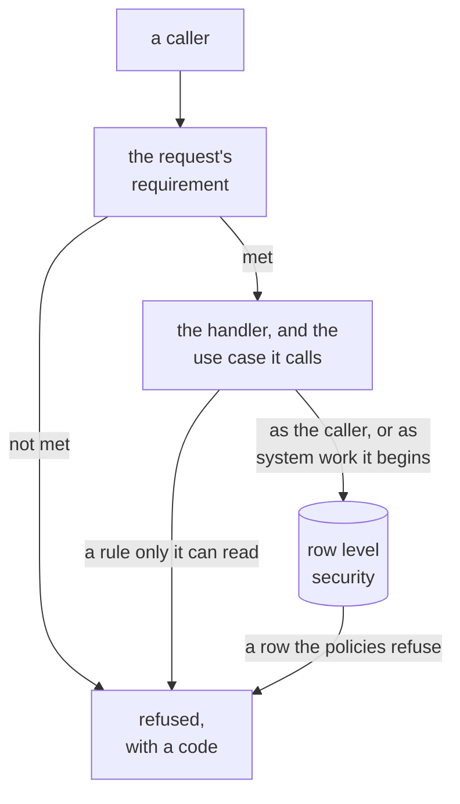
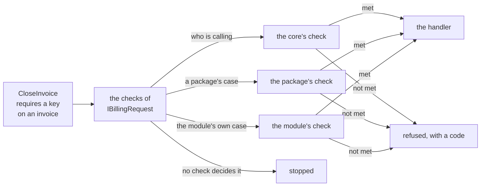
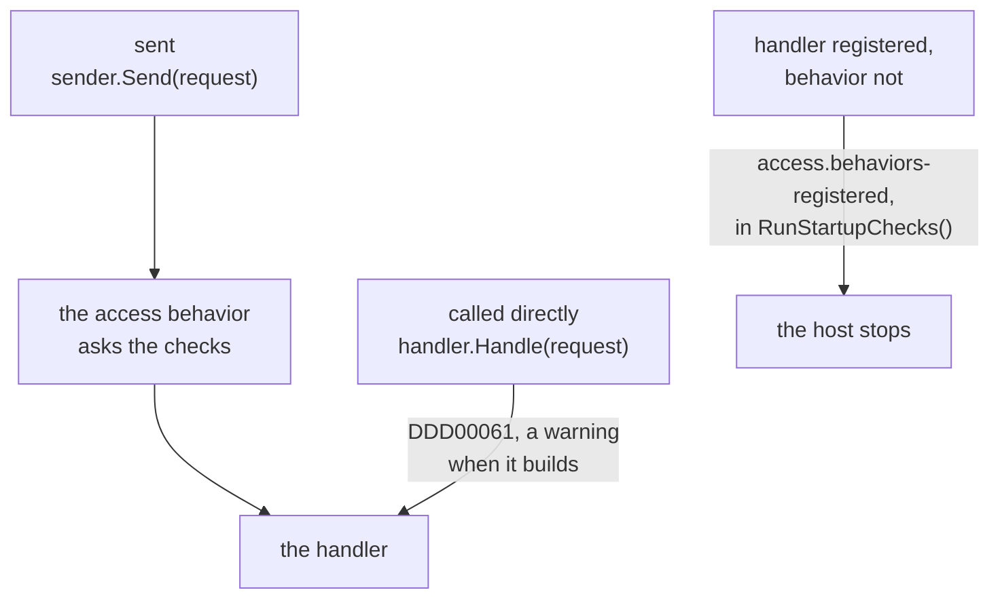

# Access requirements

A command or a query says beforehand what it takes to send it: a signed-in user, a key held on the thing it
is about, a key for the whole tenant, or only the application itself. `DDDToolkit.Access` has the types for
saying that on the request and for holding the caller to it before the handler runs. They are part of the
core package, free of any dispatcher and of any [supporting domain](writing-a-supporting-domain.md):

| Type | What it is |
|---|---|
| `IRequireAccess` | What a request implements: one member, `RequiredAccess`. |
| `AccessRequirement` | What a request answers it with: a record that says what is required. The core spells the cases about who is calling; the others come from whoever can decide them. |
| `IAccessCheck` | What decides the cases of one owner: a package ships one, a module writes one for its own. |
| `CallerAccessCheck` | The core's check of who is calling, first in every module's set. |
| `AccessChecks<TRequests>` | The checks of one module. `RequireAsync(request)` holds a request to what it declared, and fails closed. |
| `Checked<T>` | What a check read on the way, kept for the code after it that handles the same request. |
| `RequestInHand` | The request a flow of work is handling, once its checks let it through, with the requirement it passed: what the handler and its save serve, and the check to ask again. |

Who is calling is a separate question, answered by the host: [running queries as the caller](row-level-security.md#running-queries-as-the-caller).

## What a request declares

A module declares one interface of its own that derives from `IRequireAccess`, and every command and query
of the module implements it. The interface is yours to write because it is what tells one module's requests
from another's: the checks are registered for it, so a request of billing is never held to the checks of
shipping.

```csharp
[EntityId<Guid>] public readonly partial record struct InvoiceId;

public interface IBillingRequest : IRequireAccess;              // one interface per module

public sealed record CloseInvoice(InvoiceId Invoice) : IBillingRequest
{
    AccessRequirement IRequireAccess.RequiredAccess => new BillingAccess.OnInvoice("billing.close", Invoice);
}

public sealed record MyInvoices : IBillingRequest
{
    AccessRequirement IRequireAccess.RequiredAccess => AccessRequirement.SignedIn();
}

public sealed record ListPlans : IBillingRequest
{
    AccessRequirement IRequireAccess.RequiredAccess => AccessRequirement.AllowAnonymous();
}
```

- **The member is implemented explicitly,** so the requirement stands next to the request's own fields
  without becoming one of them: it is not serialized with the request and not part of its shape.
- **A requirement says what is asked, never who may.** It carries a key and the ids the request names. The
  check reads the rest where it is kept. What a requirement cannot say, a second key or a rule about what is
  given to whom, stays in the handler, in plain sight, or in the use case of the package the handler calls.
- **There is no requirement that says nothing.** A request that declares none is stopped, so a requirement
  somebody forgot never opens a door. A request anyone may send says so: `AccessRequirement.AllowAnonymous()`,
  named as ASP.NET Core's `[AllowAnonymous]` is, so it reads as meant in a review where `None` would read as
  forgotten.
- **A requirement is a record,** so two that say the same are equal, and a test can hold every request to
  the one it is meant to declare.

## The vocabulary

Every request says what it requires with one of a few requirements, each named for what it requires and
spelled on whoever decides it:

| A request requires | It answers `RequiredAccess` with | Let through | Anyone else is refused with |
|---|---|---|---|
| anyone, a caller who did not sign in too | `AccessRequirement.AllowAnonymous()` | everyone: nobody is asked | |
| a signed-in user, who need not hold anything yet | `AccessRequirement.SignedIn()` | a user who signed in, an anonymous sign-in of the identity provider too | `access.not-signed-in` |
| a caller who works in the tenant | `TenancyAccess.InTenant()`, of [Tenancy](tenancy.md#what-a-request-requires-of-its-caller) | a seat in the tenant the request was sent for, and system work there | the caller's own reason, such as `tenancy.not-seated` |
| a key for the whole tenant | `TenancyAccess.ForTheWholeTenant(key)` | whoever holds the key at the tenant's root now | `tenancy.not-permitted`, naming the key |
| a key at a unit | `TenancyAccess.AtUnit(key, unit)` | whoever holds the key at that unit now, there or above it | `tenancy.not-permitted`, with the key and the unit |
| a key on a resource | `MemberAccess.On(key, resource)`, of [Membership](membership.md#a-document-and-the-people-it-is-shared-with) | whoever holds the key on it, through its members or from above | the resource's `not-found` or `not-permitted` |
| a query that shows the resources a key is held on | `MemberAccess.SeenWith<TResourceId>(key)`, of [Membership](membership.md#inside-your-own-statements) | every caller who signed in, and system work: the query's own statement leaves out what the caller does not hold the key on | the caller's own reason where it is nobody; the resource's `not-permitted`, naming the key, for a caller who did not sign in |
| one of the application's operators | `TenancyAccess.RequiresOperator()` | a signed-in user with an [operator's token role](tenancy.md#operators) | `tenancy.operators-only` |
| only the application itself | `AccessRequirement.RequiresSystemWork()` | system work trusted code began: `Caller.System`, or `Caller.SystemIn(scope)` | `access.system-only`, for every user whatever they hold, and for work nobody began a caller for |
| something only your module knows | a record of your own | what your check lets through | your module's code |

The three of `AccessRequirement` are about who is calling and nothing else, so the core decides them, and a
host without any supporting domain has them. Who is calling is what the host's `ICallerAccessor` answers; in a
host that [requires explicit callers](row-level-security.md#fail-closed-callers), work nobody began a caller
for fails with `NoCallerException` before it is let through or refused.

- **`SignedIn()`** asks whether the caller's token names a user. An anonymous sign-in, such as Supabase Auth
  makes for a visitor without an account, names one too, marked with the `is_anonymous` claim. A handler that
  should take only an account with a verified identity refuses that claim itself, as the registration that
  [provisions a tenant](tenancy.md#who-may-ask-and-what-the-work-runs-as) does, and as Tenancy's acceptance of
  an invitation does.
- **`RequiresSystemWork()`** takes only system work that trusted code began, with
  `Callers.Begin(Caller.System)`, `Callers.Begin(Caller.SystemIn(scope))` or a supporting domain's own way,
  such as Tenancy's `TenancyWork`. A host that does not require explicit callers answers the application
  itself for work nobody began a caller for, and with no accessor that knows requests a web request gets the
  same answer; the door does not take that default for system work.

Each is a method on the class of whoever decides it, so the requirements read alike side by side:
`AccessRequirement.SignedIn()`, `TenancyAccess.InTenant()`, `MemberAccess.On(key, resource)`. A method rather
than a constructor, so a case closed over your own id takes it from the argument: `TenancyAccess.AtUnit(key,
unit)` is closed over your unit id without your writing it. And `AllowAnonymous()`, `SignedIn()` and
`RequiresSystemWork()` say who is let through rather than what is checked, as the name a reviewer looks for.

## Who may send it, and what it runs with

Three things stand between a caller and a row, and each asks what it alone can answer.

- **The request's requirement** says who may send the request, and the module's checks hold the caller to it
  before the handler runs. It is one line on the request, where a review reads it.
- **The handler**, and the use case of a package it hands the request to, asks what only it can read: who
  may give a role that manages access, where a unit hangs now, whether a project is still open. A package
  keeps such rules inside its use cases; a request never spells them.
- **Row level security** holds every row the work reads or writes to the caller it runs as, whatever the code
  above it did ([Row level security](row-level-security.md)).

**Who may send a request is not what its handler runs with.** The requirement decides who gets as far as the
handler. The work then runs as the caller, unless the handler begins system work itself, in trusted code, for
what no caller of the request could do: a registration form is `AllowAnonymous()`, and the handler that
provisions a tenant for it begins the system work that provisions it. With `SignedIn()`, for a signed-in user
who registers an organization, or `RequiresSystemWork()`, for a job only the application runs, the handler
begins the same system work. What changes with the requirement is who gets that far, and where the handler
finds what system work cannot tell it, such as who becomes the first administrator: the caller's own token
for `SignedIn()`, an account the handler makes for the address on the form for `AllowAnonymous()`, and the
request itself for a job. The caller gets nothing more by it, since the handler alone says what that system
work does. [Provisioning a tenant](tenancy.md#who-may-ask-and-what-the-work-runs-as) shows it with Tenancy.



<details>
<summary>Show the code: a form anyone may send, whose handler begins system work</summary>

```csharp
public sealed record RequestQuote(string Email, string Product) : IBillingRequest
{
    AccessRequirement IRequireAccess.RequiredAccess => AccessRequirement.AllowAnonymous();  // who may send it
}

public sealed class RequestQuoteHandler(IQuoteStore quotes) : IHandler<RequestQuote>
{
    public async Task HandleAsync(RequestQuote command, CancellationToken cancellationToken)
    {
        using (Callers.Begin(Caller.SystemIn("billing")))                                  // what it runs with
        {
            await quotes.AddAsync(command.Email, command.Product, cancellationToken);    // the one thing it does so
        }
    }
}
```

</details>

## What answers it

The cases are records that derive from `AccessRequirement`, each owned by whoever can decide it, and shipped
with the `IAccessCheck` that does:

| The case is about | Its requirement | Its check is added with |
|---|---|---|
| who is calling: anyone, a signed-in user, the application itself | `AccessRequirement.AllowAnonymous()`, `SignedIn()` and `RequiresSystemWork()`, of the core | nothing: every module's set asks the core's `CallerAccessCheck` first, and nobody has to decide that anyone may send a request |
| a tenant: a seat in it, a key for the whole of it or at a unit, operators | `TenancyAccess.InTenant()` and the rest of `TenancyRequirement`'s cases, of [Tenancy](tenancy.md#what-a-request-requires-of-its-caller) | `services.AddTenancyAccess<...>()`, for each module |
| a resource with members: a key held on it | `MemberAccess.On(key, resource)`, of [Membership](membership.md#a-document-and-the-people-it-is-shared-with) | `services.AddDocumentMemberAccess<IFilingRequest>()`, generated for each resource |
| something only your module knows | a record of your own | `services.AddAccessCheck<IBillingRequest, BillingAccessCheck>()` |

A check of your own is two methods. `Decides` says whether a requirement is one of its cases, and only looks
at the requirement. `RequireAsync` then holds the caller to it: passing is returning, refusing is throwing a
refusal with your module's code. So a branch the check forgets lets the caller through: with several cases,
end the `switch` with `default: throw`, as the packages' checks do, and a case added later without its
branch refuses. Below, the cast does the same for the one case there is.

```csharp
public abstract record BillingAccess : AccessRequirement
{
    public sealed record OnInvoice(string Key, InvoiceId Invoice) : BillingAccess;
}

// Yours: whatever answers whether the caller holds a key on an invoice
public interface IInvoiceAccess
{
    ValueTask<bool> HoldsKeyAsync(string key, InvoiceId invoice, CancellationToken cancellationToken);
}

public sealed class BillingAccessCheck(IInvoiceAccess invoices) : IAccessCheck
{
    public bool Decides(AccessRequirement requirement) => requirement is BillingAccess;

    public async ValueTask RequireAsync(AccessRequirement requirement, IRequireAccess request, CancellationToken cancellationToken)
    {
        var required = (BillingAccess.OnInvoice)requirement;
        if (!await invoices.HoldsKeyAsync(required.Key, required.Invoice, cancellationToken))
        {
            throw new RefusalException("billing.not-permitted", RefusalKind.NotPermitted, "That takes a key on the invoice.");
        }
    }
}

public static class BillingModule
{
    public static IServiceCollection AddBilling(this IServiceCollection services)
        => services.AddAccessCheck<IBillingRequest, BillingAccessCheck>();
}
```

`AddAccessCheck` registers the check, the set of checks of the interface, `AccessChecks<IBillingRequest>`, and
`Checked<T>`, each per scope. A check added for one interface is not asked about the requests of another: a
module that uses a package's check adds it for its own interface. Adding the same check for the same
interface again changes nothing.

**It fails closed.** `AccessChecks<IBillingRequest>.RequireAsync` stops a request that declares nothing, and
one whose requirement none of the checks added for its interface decides, with an exception that names the
check that is missing. A case added without its check lets nobody in. Where the case is a package's, the
exception names the package's call that adds its check, `services.AddTenancyAccess<IBillingRequest, TContext>()`
for Tenancy's, which the package says with `[AccessCheckRegistration]` on its requirement; a case of your own
names `AddAccessCheck<IBillingRequest, TCheck>()`.

**The handler acts on its request.** The check was asked about what the request names, so the handler takes
its ids from the request, and loads what it changes as its caller may see it now:

```csharp
public interface IInvoiceStore
{
    Task CloseAsync(InvoiceId invoice, CancellationToken cancellationToken);
}

public sealed class CloseInvoiceHandler(IInvoiceStore store)
{
    public Task HandleAsync(CloseInvoice command, CancellationToken cancellationToken)
        => store.CloseAsync(command.Invoice, cancellationToken);
}
```

Permission is about who is calling. That what the handler changes is right is the aggregate's to keep, that
nobody changed it since the caller read it is the version's (`ExpectVersion` at the load, and the save's own
comparison), and where the database checks every row it checks the write again as the caller.

**What a check read, for the code after it.** A check that had to work out an answer the handler needs as
well, one it would otherwise ask a second time, keeps it in `Checked<T>`: `KeepFor(request, answer)` in the
check, `TakeFor(request)` in the handler, which hands out what the request's latest pass kept, once, and throws
for a request that passed no check that keeps a `T`. A request is found by reference, so declare it as a class
or a record class. What a check keeps is kept with the [request in hand](#the-request-in-hand) as well, where
code that is not handed the request finds it: that is how the Membership package's
[expert hold](membership.md#the-expert-hold) holds a save to what its check read, with no line in the handler.



<details>
<summary>Show the code: what asks the checks</summary>

```csharp shortened
// AccessChecks<TRequests>.RequireAsync, the package's, shortened
// The first check that decides a requirement holds the caller to it
var requirement = request.RequiredAccess
    ?? throw new InvalidOperationException("CloseInvoice declares no access requirement. ...");

if (requirement is AccessRequirement.Anyone)                    // AllowAnonymous()
{
    return;                                                     // decided here, by asking nobody
}

var check = checks.FirstOrDefault(candidate => candidate.Decides(requirement))
    ?? throw new InvalidOperationException("CloseInvoice declares 'BillingAccess.OnInvoice', which none of the access checks registered for IBillingRequest decides. ...");

await check.RequireAsync(requirement, request, cancellationToken);  // in hand for the flow that handles the request
```

</details>

**The check a request passed stays with its handler.** The request is [in hand](#the-request-in-hand) for the
flow of work that handles it, with the requirement it passed, so the check can be
[asked again](#asking-its-check-again) later in that flow: the toolkit does that when the policies refuse a save
the check allowed.

## Asking the checks without Mediator

Something has to ask the checks in front of every handler. The core knows no dispatcher, so that is one
call from whatever sends your requests: your own dispatcher, an endpoint filter, a behavior of another
library.

```csharp
public interface IHandler<TRequest>
{
    Task HandleAsync(TRequest request, CancellationToken cancellationToken);
}

public sealed class BillingDispatcher(AccessChecks<IBillingRequest> checks, IServiceProvider services)
{
    public async Task SendAsync<TRequest>(TRequest request, CancellationToken cancellationToken)
        where TRequest : class, IBillingRequest
    {
        await checks.RequireAsync(request, cancellationToken);                              // returns, or refuses
        await services.GetRequiredService<IHandler<TRequest>>().HandleAsync(request, cancellationToken);
    }
}
```

The checks, the dispatcher and the handlers come from one scope, the request's: what a check keeps is
taken by a handler of the same scope. Ask the checks and run the handler in one `async` method, as above: the
request is then [in hand](#the-request-in-hand) for the handler and its save, with the check it passed, and no
longer once the method returned. A method without `async` that hands on the checks' task leaves the request in
hand for whoever called it instead.

## The request in hand

`AccessChecks<TRequests>.RequireAsync(request)` puts the request in hand for the flow of work that asked, from
the moment the checks let it through: `RequestInHand.Current.Request` is that request, in the method that asked
and in whatever it runs after, the handler and the save the handler ends with among it, and
`RequestInHand.Current.Requirement` what it declared. A request the checks refused is in nobody's hand. What a
check kept for the request is found there without it, `Checked<T>.TryFindInHand(out var kept)`, and left where
it is.

```csharp
await checks.RequireAsync(command, cancellationToken);    // in hand from here, once it passed
await handler.HandleAsync(command, cancellationToken);    // and here, down to the save
// RequestInHand.Current.Request is command; Checked<T>.TryFindInHand(out var kept) finds what its check kept
```

- **It follows the flow, as `Callers.Begin` does:** into what the method runs after the checks, into tasks
  started there, and not back out. Once the method that asked returns, its caller has nothing in hand. So two
  requests sent side by side each have their own, a request sent from inside another's handling, through a
  sender of its own, is in hand for its own handling, and the other is in hand again once it returns.
- **The method that asks is `async`.** Only an `async` method gives its caller the flow back as it was. One
  that is not, that asks the checks and returns the task of the handling it chains on, leaves the request in
  hand for its caller, and whatever that caller runs next, a handler it calls directly included, is taken for
  part of the request's handling.
- **A helper that only asks the checks** has the request in hand inside itself alone. Code that relies on the
  request in hand, as the expert hold does, then finds none, and says so.
- **What runs after the handling returned has nothing in hand,** so a save that relies on it happens inside:
  a unit-of-work behavior that saves after the handler is registered after the access behavior, and an
  endpoint does not save after `Send`.
- **A query answered with a stream** has its request in hand until its handler hands out the first item:
  every item after that is asked for by whoever reads the stream, in that reader's flow.
- **It is not the scope.** A scope may handle several requests, the mutations of one GraphQL request say: what
  is in hand is the one whose handling the code is in, and nothing a request before it left in the scope.

### Asking its check again

`RequestInHand.Current.StillPassesAsync()` asks the check the request passed again, as the same caller, now, and
keeps nothing for a handler while it does: `true` when it still lets the caller through, `false` when it refuses,
and anything else the check throws comes out as it is: a `ConcurrencyConflictException` too, which says the
resource moved on from the version the request named, not whether the caller may. A request anyone may send passed
by asking nobody, and passes again the same way. What is asked again is the requirement the request declared: a
rule a handler or a package's use case checks itself, past that requirement, is not part of it.

The toolkit asks it when the policies or a guard refuse a save the check allowed, to tell a caller whose rights
changed in between from a rule C# and the policies hold differently:
[When the policies refuse what C# allowed](row-level-security.md#when-the-policies-refuse-what-c-allowed).
`ToString()` names the request and its requirement by their types, `ChangeProjectName (MemberAccess<ProjectId>.On)`,
never their values, for a log line.

## The generated behavior, with Mediator

In a project that references [Mediator](https://github.com/martinothamar/Mediator), the source-generated one
(`Mediator.Abstractions`), mark the interface, and the toolkit's generator writes the pipeline behavior that
asks the checks, and its registration. The toolkit's packages reference no dispatcher: the only code that
names Mediator is written into your project.

```csharp
[AccessRequests]
public interface IBillingRequest : IRequireAccess;

// Written beside the interface: BillingAccessBehavior<TMessage, TResponse>, for every message that implements
// it and for no other, and the call that puts it in the pipeline with the set of checks it asks.
services.AddBillingAccessBehavior();
```

<details>
<summary>Show the code: what the generator writes</summary>

```csharp title="BillingAccessBehavior.g.cs, shortened"
public sealed class BillingAccessBehavior<TMessage, TResponse> : IPipelineBehavior<TMessage, TResponse>
    where TMessage : notnull, IBillingRequest, IMessage
{
    private readonly AccessChecks<IBillingRequest> _checks;

    public async ValueTask<TResponse> Handle(TMessage message, MessageHandlerDelegate<TMessage, TResponse> next, CancellationToken cancellationToken)
    {
        await _checks.RequireAsync(message, cancellationToken).ConfigureAwait(false);
        return await next(message, cancellationToken).ConfigureAwait(false);
    }
}

public static class BillingAccessBehaviorRegistration
{
    public static IServiceCollection AddBillingAccessBehavior(this IServiceCollection services)
    {
        services.AddAccessChecks<IBillingRequest>();
        services.TryAddEnumerable(ServiceDescriptor.Scoped(typeof(IPipelineBehavior<,>), typeof(BillingAccessBehavior<,>)));
        return services;
    }
}
```

</details>

- The behavior is named after the interface (`IBillingRequest` gives `BillingAccessBehavior`), sits in its
  namespace and is as visible as it is. An interface it cannot be written for is
  [DDD00056](diagnostics.md#ddd00056).
- A message that is answered with a stream, an `IStreamQuery<T>` say, passes a pipeline of its own in
  Mediator, `IStreamPipelineBehavior<,>`, which no `IPipelineBehavior<,>` is part of. So a second class is
  written for that one, `BillingAccessStreamBehavior<TMessage, TResponse>`, and the same call registers it:
  a stream query that implements the interface is asked about before its handler streams anything.
- Both are registered per scope, as the checks are, so register Mediator with `ServiceLifetime.Scoped`.
  Behaviors run in the order they were registered.
- How `IPipelineBehavior<TMessage, TResponse>` and `IStreamPipelineBehavior<TMessage, TResponse>` are
  implemented is read from the version of the library the project references, the order of `Handle`'s
  parameters included; a version the generator does not know is [DDD00057](diagnostics.md#ddd00057), and
  nothing is written.
- A notification is published to its handlers through neither pipeline, so nothing asks what one requires:
  a notification that implements the interface is [DDD00058](diagnostics.md#ddd00058). What needs a check is
  sent as a command or a query.
- Without the library nothing is generated, and the attribute changes nothing: you call `RequireAsync`
  yourself, [as above](#asking-the-checks-without-mediator).

Mediator's own generator registers the behaviors a host lists in `MediatorOptions.PipelineBehaviors`. It reads
that list from the code as you wrote it, and one generator never sees what another writes. So it depends on
where the interface is declared:

| The interface is declared in | The generated behavior |
|---|---|
| a module's class library, which the project that runs Mediator's generator references | is a type of a referenced assembly like any other: add it with `services.AddBillingAccessBehavior()`, or list it. Listed, the set of checks it asks still has to be registered: `AddAccessCheck` does that, and `AddAccessChecks<IBillingRequest>()` for a module that adds no check. And listed, the second class goes in the list of the other pipeline, `typeof(BillingAccessStreamBehavior<,>)` in `MediatorOptions.StreamPipelineBehaviors`: a host that lists the first alone leaves the module's stream queries unasked, and once the module has one, [does not start](#when-nothing-asks-the-checks) |
| the project that runs Mediator's generator itself | cannot be listed: `typeof(BillingAccessBehavior<,>)` in the list is Mediator's error MSG0007. Add it with `services.AddBillingAccessBehavior()`, after `AddMediator`, and it runs after the behaviors you did list |

A host of one project that wants every behavior in that list, so that Mediator's generator registers them
all, writes this one itself and leaves `[AccessRequests]` off the interface.
[DDD00057](diagnostics.md#ddd00057) shows the whole class; a host that sends stream queries writes the one
for `IStreamPipelineBehavior<,>` as well.

## When nothing asks the checks

The checks hold nobody to anything by themselves. The behavior asks them, in the pipeline a request passes when
it is sent, and a request that reaches its handler some other way is asked nothing. A handler that takes what
its check kept, `Checked<T>`, fails there for want of it. Any other handler runs, held only by what the database
checks, and per table that is coarser than what one request requires. A policy has to let every member who may
write a project's row write it, to close the project or to rename it, so it lets a rename through for one who may
only close it. So the toolkit watches the two ways round the behavior it can see: a missing behavior stops the
host when it starts, in a host that calls `RunStartupChecks()`, and a handler called in code is reported when the
code builds.

- **The behavior is not in the pipeline.** A module registers its checks and not the behavior that asks them, a
  host forgets a module's registration altogether, or a host that lists its behaviors for Mediator's generator
  leaves one out. The registration of the checks brings the [start-up check](startup-checks.md)
  `access.behaviors-registered` for an interface the toolkit wrote a behavior for, and a host that calls
  `RunStartupChecks()` does not start: the message names the behavior, its interface, and the line that adds it.
  Nothing to write for it: `AddAccessCheck`, `AddTenancyAccess`, the generated `AddDocumentMemberAccess` and
  `AddBillingAccessBehavior` itself all bring it.
- **What the check reads.** Mediator registers every handler under its handler interface, closed over its
  message, so the check reads from the host's registrations which commands and queries it can handle. For each
  one of an interface the toolkit wrote a behavior for, in any module, the behavior has to be in its pipeline:
  registered open, as the generated call adds it, or closed over that message, as Mediator registers a behavior a
  host lists. A query answered with a stream needs the behavior for streams, and a module with no such query
  needs nothing in that pipeline. A behavior registered as something no pipeline asks for, as itself say, does
  not count, and the message says so. One registration brings the check for every module, so a module whose
  registration was forgotten is found as long as any other registered its checks. A host that registered no
  module's checks at all brings no check: nothing of the toolkit's access is in it to bring one.
- **Code calls a handler.** `handler.Handle(request, cancellationToken)` with a request of a marked interface is
  [DDD00061](diagnostics.md#ddd00061), a warning at the call, with a code fix that sends the request through an
  `ISender` the code reaches. Constructing or injecting a handler is not reported, the call is. Neither is a
  decorator that hands its inner handler the request it was given, which passed the pipeline on its way in, nor
  anything in a test project, where a test calls a handler on purpose to test it alone.
- **A transport goes round the pipeline.** A route, a GraphQL resolver or a message consumer that sends through
  `ISender` passes the behavior like any other caller; one that calls a handler of a marked request is the case
  above, and is reported where it is written. One that dispatches some other way altogether asks the checks
  itself, `AccessChecks<IBillingRequest>.RequireAsync`, [as above](#asking-the-checks-without-mediator): neither
  the build nor the start can see such a way. That includes a dispatcher that calls `Handle` on a handler of a
  type parameter with no constraint to a marked interface: the build cannot tell which requests pass through it.



<details>
<summary>Show the code: what the start-up check says, and a call the build reports</summary>

```csharp
// A module that registers its check and forgot the behavior
services.AddAccessCheck<IBillingRequest, BillingAccessCheck>();
// services.AddBillingAccessBehavior();

builder.Services.RunStartupChecks();
```

```text
System.InvalidOperationException: BillingAccessBehavior<TMessage, TResponse>, the pipeline behavior the toolkit
wrote to ask the access checks of IBillingRequest, is not in the pipeline: every command and query that implements
IBillingRequest reaches its handler with nothing asking what it requires, held only by what the database checks.
Add services.AddBillingAccessBehavior() where the module registers its checks.
```

A host that lists the behaviors for Mediator's generator and leaves one out is told to list it, rather than to
call the generated registration as well, which would put the other one in the pipeline twice:

```text
System.InvalidOperationException: BillingAccessStreamBehavior<TMessage, TResponse>, the behavior the toolkit wrote
to ask the access checks of IBillingRequest of a query answered with a stream, is not in the pipeline of streams:
every such query that implements IBillingRequest is streamed with nothing asking what it requires. The host lists
its behaviors for the Mediator library: list typeof(BillingAccessStreamBehavior<,>) among its
StreamPipelineBehaviors as well.
```

```csharp
// With the Mediator library, a command of IBillingRequest, marked [AccessRequests] as above, and its handler
public sealed record CloseOverdueInvoice(InvoiceId Invoice) : ICommand, IBillingRequest
{
    AccessRequirement IRequireAccess.RequiredAccess => new BillingAccess.OnInvoice("billing.close", Invoice);
}

public sealed class CloseOverdueInvoiceHandler(IInvoiceStore store) : ICommandHandler<CloseOverdueInvoice>
{
    public async ValueTask<Unit> Handle(CloseOverdueInvoice command, CancellationToken cancellationToken)
    {
        await store.CloseAsync(command.Invoice, cancellationToken);
        return Unit.Value;
    }
}

public sealed class InvoiceReminders(CloseOverdueInvoiceHandler handler, ISender sender)
{
    public async Task CloseOverdueAsync(InvoiceId invoice, CancellationToken cancellationToken)
    {
        await handler.Handle(new CloseOverdueInvoice(invoice), cancellationToken);   // DDD00061: past the behavior
        await sender.Send(new CloseOverdueInvoice(invoice), cancellationToken);      // through it, as the fix writes it
    }
}
```

The generator says which behaviors it wrote for an interface, in an attribute of the assembly that declares it,
which is what the start-up check reads:

```csharp title="BillingAccessBehavior.g.cs, its first line"
[assembly: AccessBehavior(typeof(IBillingRequest), typeof(BillingAccessBehavior<,>),
    StreamBehavior = typeof(BillingAccessStreamBehavior<,>), Registration = "services.AddBillingAccessBehavior()")]
```

</details>

## Holding it with a test

A few things no check can see are worth a test of your own, over the requests of every module:

- **Every command and query declares.** A request that implements no interface derived from `IRequireAccess`
  passes unchecked, since nothing asks about it. List the request types of a module by reflection and hold
  each to implementing the module's interface.
- **Every requirement has a check.** `AccessChecks<TRequests>.Decides(requirement)` says whether a request
  that declares a requirement can pass at all, without reading anything. Ask it for every requirement the
  module's requests declare, and a case added without its check fails the build rather than a request.
- **A requirement that refuses nobody for want of the key is a query's.** `MemberAccess.SeenWith(key)` lets
  a signed-in caller through, one that holds nothing too, and refuses a caller who did not sign in, who
  reaches nothing under any rules: it says what a query's own statement filters by, and that filter is the check.
  Declared on a command, it lets the handler run unchecked. Hold every request that declares it to being a
  query, as the Tenancy sample's `AccessDeclarationTests.Only_a_query_declares_what_it_shows` does.
- **A request anyone may send is one somebody meant.** List the requests that declare
  `AccessRequirement.AllowAnonymous()` and hold them to a list of your own, so a new one is a decision a
  review sees. The Tenancy sample holds it to none: every route of it takes a token.

Because a requirement is a record, the same test can pin which request declares which: a table of request
types and the requirement each is meant to answer, compared with what they do answer.
