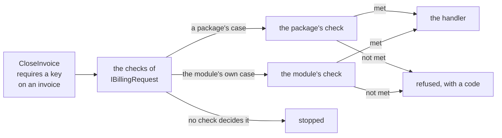

# Access requirements

A command or a query can often say beforehand what it takes to send it: a key held on the thing it is
about, a key for the whole tenant, nothing at all. `DDDToolkit.Access` has the types for saying that on the
request and for holding the caller to it before the handler runs. They are part of the core package, free
of any dispatcher and of any [supporting domain](writing-a-supporting-domain.md):

| Type | What it is |
|---|---|
| `IRequireAccess` | What a request implements: one member, `RequiredAccess`. |
| `AccessRequirement` | What a request answers it with: a record that says what is required. The cases come from whoever can decide them. |
| `IAccessCheck` | What decides the cases of one owner: a package ships one, a module writes one for its own. |
| `AccessChecks<TRequests>` | The checks of one module. `RequireAsync(request)` holds a request to what it declared, and fails closed. |
| `Checked<T>` | What a check read on the way, kept for the request's handler. |

Who is calling is a separate question, answered by the host: [running queries as the caller](row-level-security.md#running-queries-as-the-caller).

## What a request declares

A module declares one interface of its own that derives from `IRequireAccess`, and every command and query
of the module implements it. The interface is yours to write because it is what tells one module's requests
from another's: the checks are registered for it, so a request of billing is never held to the checks of
shipping.

```csharp
[EntityId<Guid>] public readonly partial record struct InvoiceId;

public interface IBillingRequest : IRequireAccess;              // one interface per module

public sealed record CloseInvoice(InvoiceId Invoice) : IBillingRequest
{
    AccessRequirement IRequireAccess.RequiredAccess => new BillingAccess.OnInvoice("billing.close", Invoice);
}

public sealed record ListPlans : IBillingRequest
{
    AccessRequirement IRequireAccess.RequiredAccess => new AccessRequirement.Open("The price list is for everybody.");
}
```

- **The member is implemented explicitly,** so the requirement stands next to the request's own fields
  without becoming one of them: it is not serialized with the request and not part of its shape.
- **A requirement says what is asked, never who may.** It carries a key and the ids the request names. The
  check reads the rest where it is kept. What a requirement cannot say, a second key or a rule about what is
  given to whom, stays in the handler, in plain sight.
- **A request that requires nothing says so, with its reason:** `AccessRequirement.Open`. It is the one case
  the core declares, because it is the one nobody has to decide.
- **A requirement is a record,** so two that say the same are equal, and a test can hold every request to
  the one it is meant to declare.

## What answers it

The cases are records that derive from `AccessRequirement`, each owned by whoever can decide it, and shipped
with the `IAccessCheck` that does:

| The case is about | Its requirement | Its check is added with |
|---|---|---|
| a tenant: a seat in it, a key for the whole of it or at a unit, operators | `TenancyRequirement`, of [Tenancy](tenancy.md#what-a-request-requires-of-its-caller) | `services.AddTenancyAccess<...>()`, for each module |
| a resource with members: a key held on it | `MemberAccess.On(key, resource)`, of [Membership](membership.md#a-document-and-the-people-it-is-shared-with) | `services.AddDocumentMemberAccess<IFilingRequest>()`, generated for each resource |
| something only your module knows | a record of your own | `services.AddAccessCheck<IBillingRequest, BillingAccessCheck>()` |

A check of your own is two methods. `Decides` says whether a requirement is one of its cases, and only looks
at the requirement. `RequireAsync` then holds the caller to it: passing is returning, refusing is throwing a
refusal with your module's code. So a branch the check forgets lets the caller through: with several cases,
end the `switch` with `default: throw`, as the packages' checks do, and a case added later without its
branch refuses. Below, the cast does the same for the one case there is.

```csharp
public abstract record BillingAccess : AccessRequirement
{
    public sealed record OnInvoice(string Key, InvoiceId Invoice) : BillingAccess;
}

// Yours: whatever answers whether the caller holds a key on an invoice
public interface IInvoiceAccess
{
    ValueTask<bool> HoldsKeyAsync(string key, InvoiceId invoice, CancellationToken cancellationToken);
}

public sealed class BillingAccessCheck(IInvoiceAccess invoices, Checked<InvoiceId> checkedInvoice) : IAccessCheck
{
    public bool Decides(AccessRequirement requirement) => requirement is BillingAccess;

    public async ValueTask RequireAsync(AccessRequirement requirement, IRequireAccess request, CancellationToken cancellationToken)
    {
        var required = (BillingAccess.OnInvoice)requirement;
        if (!await invoices.HoldsKeyAsync(required.Key, required.Invoice, cancellationToken))
        {
            throw new RefusalException("billing.not-permitted", RefusalKind.NotPermitted, "That takes a key on the invoice.");
        }

        checkedInvoice.KeepFor(request, required.Invoice);      // what was checked, for the handler
    }
}

public static class BillingModule
{
    public static IServiceCollection AddBilling(this IServiceCollection services)
        => services.AddAccessCheck<IBillingRequest, BillingAccessCheck>();
}
```

`AddAccessCheck` registers the check, the set of checks of the interface, `AccessChecks<IBillingRequest>`, and
`Checked<T>`, each per scope. A check added for one interface is not asked about the requests of another: a
module that uses a package's check adds it for its own interface. Adding the same check for the same
interface again changes nothing.

**It fails closed.** `AccessChecks<IBillingRequest>.RequireAsync` stops a request that declares nothing, and
one whose requirement none of the checks added for its interface decides, with an exception that names the
check that is missing. A case added without its check lets nobody in. Where the case is a package's, the
exception names the package's call that adds its check, `services.AddTenancyAccess<IBillingRequest, TContext>()`
for Tenancy's, which the package says with `[AccessCheckRegistration]` on its requirement; a case of your own
names `AddAccessCheck<IBillingRequest, TCheck>()`.

**The handler acts on what was checked.** A check keeps what it read for the request's handler, in
`Checked<T>`, and the handler takes it from there instead of working it out again from its request:

```csharp
public interface IInvoiceStore
{
    Task CloseAsync(InvoiceId invoice, CancellationToken cancellationToken);
}

public sealed class CloseInvoiceHandler(Checked<InvoiceId> checkedInvoice, IInvoiceStore store)
{
    public Task HandleAsync(CloseInvoice command, CancellationToken cancellationToken)
        => store.CloseAsync(checkedInvoice.TakeFor(command), cancellationToken);
}
```

`TakeFor` hands out what the request's latest pass kept, once. A handler reached without its request having
passed the check, called directly rather than sent, has nothing to take, and `TakeFor` throws: that closes
the way round the check. A request is found by reference, so declare it as a class or a record class.



<details>
<summary>Show the code: what asks the checks</summary>

```csharp title="AccessChecks<TRequests>.RequireAsync, shortened"
// The first check that decides a requirement holds the caller to it
var requirement = request.RequiredAccess
    ?? throw new InvalidOperationException("CloseInvoice declares no access requirement. ...");

if (requirement is AccessRequirement.Open)
{
    return;                                                     // decided here, by asking nobody
}

var check = checks.FirstOrDefault(candidate => candidate.Decides(requirement))
    ?? throw new InvalidOperationException("CloseInvoice declares 'BillingAccess.OnInvoice', which none of the access checks registered for IBillingRequest decides. ...");

await check.RequireAsync(requirement, request, cancellationToken);
```

</details>

## Asking the checks without Mediator

Something has to ask the checks in front of every handler. The core knows no dispatcher, so that is one
call from whatever sends your requests: your own dispatcher, an endpoint filter, a behavior of another
library.

```csharp
public interface IHandler<TRequest>
{
    Task HandleAsync(TRequest request, CancellationToken cancellationToken);
}

public sealed class BillingDispatcher(AccessChecks<IBillingRequest> checks, IServiceProvider services)
{
    public async Task SendAsync<TRequest>(TRequest request, CancellationToken cancellationToken)
        where TRequest : class, IBillingRequest
    {
        await checks.RequireAsync(request, cancellationToken);                              // returns, or refuses
        await services.GetRequiredService<IHandler<TRequest>>().HandleAsync(request, cancellationToken);
    }
}
```

The checks, the dispatcher and the handlers come from one scope, the request's: what a check keeps is
taken by a handler of the same scope.

## The generated behavior, with Mediator

In a project that references [Mediator](https://github.com/martinothamar/Mediator), the source-generated one
(`Mediator.Abstractions`), mark the interface, and the toolkit's generator writes the pipeline behavior that
asks the checks, and its registration. The toolkit's packages reference no dispatcher: the only code that
names Mediator is written into your project.

```csharp
[AccessRequests]
public interface IBillingRequest : IRequireAccess;

// Written beside the interface: BillingAccessBehavior<TMessage, TResponse>, for every message that implements
// it and for no other, and the call that puts it in the pipeline with the set of checks it asks.
services.AddBillingAccessBehavior();
```

<details>
<summary>Show the code: what the generator writes</summary>

```csharp title="BillingAccessBehavior.g.cs, shortened"
public sealed class BillingAccessBehavior<TMessage, TResponse> : IPipelineBehavior<TMessage, TResponse>
    where TMessage : notnull, IBillingRequest, IMessage
{
    private readonly AccessChecks<IBillingRequest> _checks;

    public async ValueTask<TResponse> Handle(TMessage message, MessageHandlerDelegate<TMessage, TResponse> next, CancellationToken cancellationToken)
    {
        await _checks.RequireAsync(message, cancellationToken).ConfigureAwait(false);
        return await next(message, cancellationToken).ConfigureAwait(false);
    }
}

public static class BillingAccessBehaviorRegistration
{
    public static IServiceCollection AddBillingAccessBehavior(this IServiceCollection services)
    {
        services.AddAccessChecks<IBillingRequest>();
        services.TryAddEnumerable(ServiceDescriptor.Scoped(typeof(IPipelineBehavior<,>), typeof(BillingAccessBehavior<,>)));
        return services;
    }
}
```

</details>

- The behavior is named after the interface (`IBillingRequest` gives `BillingAccessBehavior`), sits in its
  namespace and is as visible as it is. An interface it cannot be written for is
  [DDD00056](diagnostics.md#ddd00056).
- A message that is answered with a stream, an `IStreamQuery<T>` say, passes a pipeline of its own in
  Mediator, `IStreamPipelineBehavior<,>`, which no `IPipelineBehavior<,>` is part of. So a second class is
  written for that one, `BillingAccessStreamBehavior<TMessage, TResponse>`, and the same call registers it:
  a stream query that implements the interface is asked about before its handler streams anything.
- Both are registered per scope, as the checks are, so register Mediator with `ServiceLifetime.Scoped`.
  Behaviors run in the order they were registered.
- How `IPipelineBehavior<TMessage, TResponse>` and `IStreamPipelineBehavior<TMessage, TResponse>` are
  implemented is read from the version of the library the project references, the order of `Handle`'s
  parameters included; a version the generator does not know is [DDD00057](diagnostics.md#ddd00057), and
  nothing is written.
- A notification is published to its handlers through neither pipeline, so nothing asks what one requires:
  a notification that implements the interface is [DDD00058](diagnostics.md#ddd00058). What needs a check is
  sent as a command or a query.
- Without the library nothing is generated, and the attribute changes nothing: you call `RequireAsync`
  yourself, [as above](#asking-the-checks-without-mediator).

Mediator's own generator registers the behaviors a host lists in `MediatorOptions.PipelineBehaviors`. It reads
that list from the code as you wrote it, and one generator never sees what another writes. So it depends on
where the interface is declared:

| The interface is declared in | The generated behavior |
|---|---|
| a module's class library, which the project that runs Mediator's generator references | is a type of a referenced assembly like any other: add it with `services.AddBillingAccessBehavior()`, or list it. Listed, the set of checks it asks still has to be registered: `AddAccessCheck` does that, and `AddAccessChecks<IBillingRequest>()` for a module that adds no check. And listed, the second class goes in the list of the other pipeline, `typeof(BillingAccessStreamBehavior<,>)` in `MediatorOptions.StreamPipelineBehaviors`: a host that lists the first alone leaves the module's stream queries unasked |
| the project that runs Mediator's generator itself | cannot be listed: `typeof(BillingAccessBehavior<,>)` in the list is Mediator's error MSG0007. Add it with `services.AddBillingAccessBehavior()`, after `AddMediator`, and it runs after the behaviors you did list |

A host of one project that wants every behavior in that list, so that Mediator's generator registers them
all, writes this one itself and leaves `[AccessRequests]` off the interface.
[DDD00057](diagnostics.md#ddd00057) shows the whole class; a host that sends stream queries writes the one
for `IStreamPipelineBehavior<,>` as well.

## Holding it with a test

Two things no check can see are worth a test of your own, over the requests of every module:

- **Every command and query declares.** A request that implements no interface derived from `IRequireAccess`
  passes unchecked, since nothing asks about it. List the request types of a module by reflection and hold
  each to implementing the module's interface.
- **Every requirement has a check.** `AccessChecks<TRequests>.Decides(requirement)` says whether a request
  that declares a requirement can pass at all, without reading anything. Ask it for every requirement the
  module's requests declare, and a case added without its check fails the build rather than a request.
- **A requirement that refuses nobody for want of the key is a query's.** `MemberAccess.SeenWith(key)` lets
  a signed-in caller through, one that holds nothing too, and refuses a caller who did not sign in, who
  reaches nothing under any rules: it says what a query's own statement filters by, and that filter is the check.
  Declared on a command, it lets the handler run unchecked. Hold every request that declares it to being a
  query, as the Tenancy sample's `AccessDeclarationTests.Only_a_query_declares_what_it_shows` does.

Because a requirement is a record, the same test can pin which request declares which: a table of request
types and the requirement each is meant to answer, compared with what they do answer.
