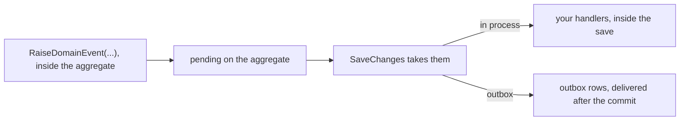

# Domain events

When an order is cancelled, other things have to follow: the stock set aside for it is released, the
customer is told, the payment is refunded. Written into `Cancel`, each of those drags a dependency into
the aggregate (a mailer, a stock service, a payment client), and the aggregate ends up knowing every
part of the system that cares about it. Adding one more reaction means editing the order.

A domain event records something that happened, and stops there. The order says that it was cancelled;
whoever cares reacts. Side effects stay out of the aggregate, and other aggregates and other modules
can react to it without the aggregate knowing they exist.

The toolkit gives every event an identity and a timestamp, restricts raising to the aggregate that
owns the event, and restricts draining to the persistence layer. This page declares an event, raises
it and reads it back, then covers delivery, the identity and the timestamp, and the stable name an
event needs once it is stored.

## Declaring an event

An event is a record deriving from `DomainEvent`, named for what happened:

```csharp
using DDDToolkit.BaseTypes;

public sealed record OrderCancelled(OrderId OrderId, CancellationReason Reason) : DomainEvent;
```

`DomainEvent` supplies:

```csharp
public Guid EventId { get; init; }            // Guid.CreateVersion7(), time ordered
public DateTimeOffset OccurredAt { get; init; }   // UtcNow
```

An event needs no attribute and no `partial`: it is an ordinary record. What the two properties are
for is under [Why the id and the timestamp](#why-the-id-and-the-timestamp).

## Raising

Raising is `protected` on `AggregateRoot<TId>`, so an event can only be created by the aggregate it
describes:

```csharp
[AggregateRoot<OrderId>]
public partial class Order
{
    public void Cancel(CancellationReason reason)
    {
        if (Status == OrderStatus.Shipped)
        {
            throw new InvalidOperationException("A shipped order cannot be cancelled.");
        }

        Status = OrderStatus.Cancelled;
        RaiseDomainEvent(new OrderCancelled(Id, reason));
    }
}
```

Nothing outside can inject an event into an aggregate. That matters when events are your integration
contract: an event that says the order was cancelled should only exist if the order actually
cancelled.

Child entities marked `[Entity<TId>]` have no event list. A change to a child is a change to its
aggregate, so the root raises the event.

## Reading and draining

```csharp
IReadOnlyList<IDomainEvent> pending = order.DomainEvents;
```

`DomainEvents` is a read-only view, marked [`[Internal]`](value-objects.md#hiding-members), the
toolkit's marker for infrastructure members, so it stays out of your tables, your JSON and your
GraphQL schema.

Draining is deliberately awkward to reach. `IHasDomainEvents` is implemented explicitly:

```csharp
public interface IHasDomainEvents
{
    IReadOnlyList<IDomainEvent> DomainEvents { get; }
    IReadOnlyList<IDomainEvent> DequeueDomainEvents();   // returns and empties
    void ClearDomainEvents();                            // discards
}
```

```csharp
var events = ((IHasDomainEvents)order).DequeueDomainEvents();
```

You will not normally write that line: the Entity Framework integration does it during save. The cast
is the point. Application code that can silently call `ClearDomainEvents()` can write a row whose
event never happened, and in a system where events are the integration contract that is a data
integrity problem, not a style issue.

## Delivery

Raising an event puts it in a list on the aggregate. Getting it to a handler is a separate concern
with a real trade-off, handled by `DDDToolkit.EntityFramework`.



<details>
<summary>Show the code: choosing how events are delivered</summary>

One line in the registration decides, and the aggregate does not change:

```csharp
// in process: handlers run inside the save
builder.Services.AddDDDToolkitEntityFramework(options => options.DispatchWithMediator());

// through the outbox: rows in the same transaction, delivered afterwards
builder.Services.AddDDDToolkitEntityFramework(options =>
{
    options.DispatchWithMediator();
    options.UseOutbox(outbox => outbox.RegisterEventsFromAssemblyContaining<Program>());
});
builder.Services.AddOutboxBackgroundService<OrderingContext>(TimeSpan.FromSeconds(2));
```

[Delivering domain events](event-delivery.md) draws both, step by step, with the rest of the setup.

</details>

**In-process dispatch** runs handlers during `SaveChanges`, before the commit. Handler changes to the
same `DbContext` ride along in the same transaction, and a throwing handler aborts the save. It is
simple and transactional, but it is best-effort: nothing survives a process crash, and handlers must
be fast because they hold the transaction open.

**Outbox delivery** writes one row per event in the same transaction as the aggregate, and a separate
reader delivers them afterwards. The write is atomic with the data, so an event is never lost and
never published for a transaction that rolled back. Delivery is at-least-once, so handlers must be
idempotent, keyed on `EventId`.

Choose in-process for side effects inside the same database, and the outbox for anything that leaves
the process. The configuration for both is in
[Domain event delivery](event-delivery.md).

## Why the id and the timestamp

`EventId` is the idempotency key. Any at-least-once delivery mechanism will hand the same event to a
handler twice eventually, and the handler needs a stable way to recognise it. `OccurredAt` records
when the thing happened, which is not the same as when a handler runs.

Both are `init`, so code that constructs the event can supply its own values:

```csharp
var evt = new OrderCancelled(id, reason) { OccurredAt = recorded };
```

That covers replaying events you already have. It does not cover testing, because the code that
constructs an event is the aggregate, not your test. See
[Deterministic time in tests](testing.md#deterministic-time-in-tests).

You can implement `IDomainEvent` directly instead of deriving from `DomainEvent`; you then provide
`EventId` and `OccurredAt` yourself.

## Stable names

As long as an event only lives in memory, its name does not matter. Once it is stored or published, a
name is written down with it, in an outbox row or on a message, and read back later by code that may
have been renamed in between. So every event has a name, and you rarely have to write it.

### The convention

An event nobody named is named after its module and its class, both in kebab case. The module is the one
the assembly declares with `[assembly: Module]` ([Modules](modules.md)):

```csharp
[assembly: Module("Ordering")]

public sealed record OrderPlaced(OrderId OrderId, CustomerId Customer) : DomainEvent;   // ordering.order-placed
public sealed record HTTPCallbackReceived(string Url) : DomainEvent;                   // ordering.http-callback-received
```

```csharp
DomainEventName.Of<OrderPlaced>();   // "ordering.order-placed"
DomainEventName.Of(someEvent);       // same, from an instance
```

An assembly without `[assembly: Module]` leaves the module out: `order-placed`. The namespace plays no
part, so moving a class to another namespace or folder changes nothing.

### Versions are in the class name

A class name that ends in `V` and a number is that version of its event, and the suffix is not part of
the name. Every version of one event shares the name:

| Class | Name | Version |
|---|---|---|
| `OrderPlaced` | `ordering.order-placed` | 1 |
| `OrderPlacedV2` | `ordering.order-placed` | 2 |
| `Level2Reached` | `ordering.level2-reached` | 1, the digits do not follow a `V` |

A class can also state its version with `[IntegrationEvent(Version = n)]`, and a stated version wins over
the one in the name: it is the one somebody wrote on purpose, the suffix is the convention for when nobody
did. When a class does both and they differ, the suffix is ignored and the build warns,
[DDD00034](diagnostics.md#ddd00034), with a fix that renames the class to the version it is. A suffix that
cannot be a version, `V0` or `V01`, fails the build with [DDD00035](diagnostics.md#ddd00035). What a version is for is in
[Versioning and upcasting](integration-events.md#versioning-and-upcasting).

### Renaming a class

The conventional name follows the class. Rename `OrderPlaced` to `PlacedOrder` and new rows are written as
`ordering.placed-order`, while the rows already in the outbox, and every consumer, still say
`ordering.order-placed`. So a rename is the moment to pin the old name:

```csharp
[DomainEventName("ordering.order-placed")]
public sealed record PlacedOrder(OrderId OrderId, CustomerId Customer) : DomainEvent;
```

A published contract pins its name in its own attribute, `[IntegrationEvent("ordering.order-placed")]`.
The version still comes from the class name, so `PlacedOrderV2` with that attribute is
`ordering.order-placed` version 2.

### Two events with one name

Two classes of one module can have the same name in different namespaces, and the convention then gives
both the same event name. An outbox row or a message could not say which of the two it is, so that is a
compile error, [DDD00036](diagnostics.md#ddd00036), on both classes:

```csharp
namespace Ordering.Orders  { public sealed record OrderPlaced(OrderId OrderId) : DomainEvent; }
namespace Ordering.Returns { public sealed record OrderPlaced(OrderId OrderId) : DomainEvent; }
// error DDD00036: 'Ordering.Returns.OrderPlaced' and 'Ordering.Orders.OrderPlaced' are both stored or
// published as 'ordering.order-placed' version 1 ...
```

The code fix pins another name on the class you invoke it on, taken from its namespace or containing
type: `[DomainEventName("ordering.returns-order-placed")]`. Or rename one of the classes. The toolkit does
not make the names unique by itself, from the namespace for instance, because then a name would change
the moment a class moved, or the moment a second class of the same name appeared, and the rows written
under the old one would be orphaned without a word.

Only events of one kind are compared:

| These two | Error? |
|---|---|
| Two domain events under one name and version | Yes |
| Two published contracts under one name and version, such as `OrderPlaced` and `OrderPlacedV1` | Yes |
| A domain event and the contract it is published as, `OrderPlaced` and `OrderPlacedV1` | No, that is the pattern |
| `OrderPlacedV1` and `OrderPlacedV2` | No, those are versions |

The check runs where the module compiles, so it sees that assembly's events. Two assemblies that declare
the same module without referencing each other are still compared when the application starts, by the
outbox registry, which refuses the second.

### The names as constants

For every name its events are stored or published under, the generator writes a constant into a class
named after the module:

```csharp title="EventNames.g.cs"
public static class OrderingEventNames
{
    /// <summary><c>ordering.order-placed</c>: OrderPlaced (version 1), OrderPlacedV2 (version 2).</summary>
    public const string OrderPlaced = "ordering.order-placed";
}
```

Use them where a name is written by hand: a topic binding, a test, a log query. Not in an event's own
`[DomainEventName]` or `[IntegrationEvent]`: the generator reads those attributes to write the constants,
so a constant cannot be what names its own event. Write the literal there. The constant is named after the
name, not the class, so a renamed class that pins its old name keeps its old constant. A contracts
assembly, where every name belongs to a published contract, marks the class `[ModuleContract]` so other
modules can use it.

### Where the name ends up

- **The outbox row** stores it in `EventName`, and the generated registration writes it out as a literal
  when the module compiles, so nothing reads an attribute at start-up.
- **The published message** carries it in its `Name`, which is what an inbox and a pgmq topic route on.
- **A broker exchange**, with MassTransit or Wolverine and `UseIntegrationEventNames()`, is the name and
  the version, `ordering.order-placed.v1` ([Transports](transports.md)).

```csharp title="IntegrationEventExtensions.g.cs, shortened"
public static OutboxOptions AddOrderingIntegrationEvents(this OutboxOptions outbox)
{
    ArgumentNullException.ThrowIfNull(outbox);
    outbox.RegisterEvent<Ordering.OrderCancelled>("ordering.order-cancelled", 1);
    outbox.RegisterEvent<Ordering.OrderPlaced>("ordering.order-placed", 1);
    return outbox;
}
```

The `1` is the version of the event's shape, which matters once the shape changes. See
[Registered when the module compiles](integration-events.md#registered-when-the-module-compiles) for the
rest of what that method registers.

### Rows written by an older build

Before events were named by convention, an event without `[DomainEventName]` was stored under its bare
class name, `OrderPlaced`. The outbox still finds such a row: every registered type answers to its class
name as well, as long as no current name is spelled the same and no other registered class has that class
name. A row found that way is read as exactly that class, upcast if the class is an older shape, and
published under the name the type has now.

## Testing

Events make aggregates testable without a database: act, then assert on what was raised.
`DDDToolkit.Testing` does the asserting, and reports only the events the call under test raised:

```csharp
AggregateScenario.Given(order)
    .When(o => o.Cancel(CancellationReason.OutOfStock))
    .RaisedExactly<OrderCancelled>();
```

See [Testing aggregates](testing.md), which also covers fixing the clock an event is stamped with, in
[Deterministic time in tests](testing.md#deterministic-time-in-tests).
