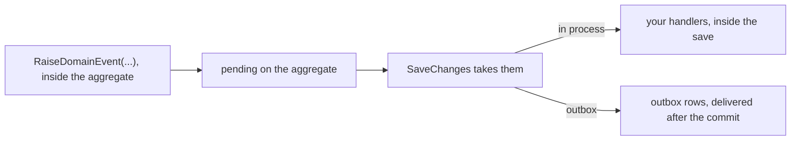

# Domain events

When an order is cancelled, other things have to follow: the stock set aside for it is released, the
customer is told, the payment is refunded. Written into `Cancel`, each of those drags a dependency into
the aggregate (a mailer, a stock service, a payment client), and the aggregate ends up knowing every
part of the system that cares about it. Adding one more reaction means editing the order.

A domain event records something that happened, and stops there. The order says that it was cancelled;
whoever cares reacts. Side effects stay out of the aggregate, and other aggregates and other modules
can react to it without the aggregate knowing they exist.

The toolkit gives every event an identity and a timestamp, restricts raising to the aggregate that
owns the event, and restricts draining to the persistence layer. This page declares an event, raises
it and reads it back, then covers delivery, the identity and the timestamp, and the stable name an
event needs once it is stored.

## Declaring an event

An event is a record deriving from `DomainEvent`, named for what happened:

```csharp
using DDDToolkit.BaseTypes;

public sealed record OrderCancelled(OrderId OrderId, CancellationReason Reason) : DomainEvent;
```

`DomainEvent` supplies:

```csharp
public Guid EventId { get; init; }            // Guid.CreateVersion7(), time ordered
public DateTimeOffset OccurredAt { get; init; }   // UtcNow
```

An event needs no attribute and no `partial`: it is an ordinary record. What the two properties are
for is under [Why the id and the timestamp](#why-the-id-and-the-timestamp).

## Raising

Raising is `protected` on `AggregateRoot<TId>`, so an event can only be created by the aggregate it
describes:

```csharp
[AggregateRoot<OrderId>]
public partial class Order
{
    public void Cancel(CancellationReason reason)
    {
        if (Status == OrderStatus.Shipped)
        {
            throw new InvalidOperationException("A shipped order cannot be cancelled.");
        }

        Status = OrderStatus.Cancelled;
        RaiseDomainEvent(new OrderCancelled(Id, reason));
    }
}
```

Nothing outside can inject an event into an aggregate. That matters when events are your integration
contract: an event that says the order was cancelled should only exist if the order actually
cancelled.

Child entities marked `[Entity<TId>]` have no event list. A change to a child is a change to its
aggregate, so the root raises the event.

## Reading and draining

```csharp
IReadOnlyList<IDomainEvent> pending = order.DomainEvents;
```

`DomainEvents` is a read-only view, marked [`[Internal]`](value-objects.md#hiding-members), the
toolkit's marker for infrastructure members, so it stays out of your tables, your JSON and your
GraphQL schema.

Draining is deliberately awkward to reach. `IHasDomainEvents` is implemented explicitly:

```csharp
public interface IHasDomainEvents
{
    IReadOnlyList<IDomainEvent> DomainEvents { get; }
    IReadOnlyList<IDomainEvent> DequeueDomainEvents();   // returns and empties
    void ClearDomainEvents();                            // discards
}
```

```csharp
var events = ((IHasDomainEvents)order).DequeueDomainEvents();
```

You will not normally write that line: the Entity Framework integration does it during save. The cast
is the point. Application code that can silently call `ClearDomainEvents()` can write a row whose
event never happened, and in a system where events are the integration contract that is a data
integrity problem, not a style issue.

## Delivery

Raising an event puts it in a list on the aggregate. Getting it to a handler is a separate concern
with a real trade-off, handled by `DDDToolkit.EntityFramework`.



<details>
<summary>Show the code: choosing how events are delivered</summary>

One line in the registration decides, and the aggregate does not change:

```csharp
// in process: handlers run inside the save
builder.Services.AddDDDToolkitEntityFramework(options => options.DispatchWithMediator());

// through the outbox: rows in the same transaction, delivered afterwards
builder.Services.AddDDDToolkitEntityFramework(options =>
{
    options.DispatchWithMediator();
    options.UseOutbox(outbox => outbox.RegisterEventsFromAssemblyContaining<Program>());
});
builder.Services.AddOutboxBackgroundService<OrderingContext>(TimeSpan.FromSeconds(2));
```

[Delivering domain events](event-delivery.md) draws both, step by step, with the rest of the setup.

</details>

**In-process dispatch** runs handlers during `SaveChanges`, before the commit. Handler changes to the
same `DbContext` ride along in the same transaction, and a throwing handler aborts the save. It is
simple and transactional, but it is best-effort: nothing survives a process crash, and handlers must
be fast because they hold the transaction open.

**Outbox delivery** writes one row per event in the same transaction as the aggregate, and a separate
reader delivers them afterwards. The write is atomic with the data, so an event is never lost and
never published for a transaction that rolled back. Delivery is at-least-once, so handlers must be
idempotent, keyed on `EventId`.

Choose in-process for side effects inside the same database, and the outbox for anything that leaves
the process. The configuration for both is in
[Domain event delivery](event-delivery.md).

## Why the id and the timestamp

`EventId` is the idempotency key. Any at-least-once delivery mechanism will hand the same event to a
handler twice eventually, and the handler needs a stable way to recognise it. `OccurredAt` records
when the thing happened, which is not the same as when a handler runs.

Both are `init`, so code that constructs the event can supply its own values:

```csharp
var evt = new OrderCancelled(id, reason) { OccurredAt = recorded };
```

That covers replaying events you already have. It does not cover testing, because the code that
constructs an event is the aggregate, not your test. See
[Deterministic time in tests](testing.md#deterministic-time-in-tests).

You can implement `IDomainEvent` directly instead of deriving from `DomainEvent`; you then provide
`EventId` and `OccurredAt` yourself.

## Stable names

As long as an event only lives in memory, its name does not matter. Once it is stored or published, a
name is written down with it, in an outbox row or on a message, and read back later by code that may
have been renamed in between.

`[DomainEventName]` decouples the wire name from the class name, so renaming or moving the class does
not break anything that stored or published the old name:

```csharp
[DomainEventName("ordering.order-placed")]
public sealed record OrderPlaced(OrderId OrderId, CustomerId Customer) : DomainEvent;
```

```csharp
DomainEventName.Of<OrderPlaced>();   // "ordering.order-placed"
DomainEventName.Of(someEvent);       // same, from an instance
```

Without the attribute the name is the class name, which is fine until the first rename. Add the
attribute to any event that is serialized, stored or published.

With `DDDToolkit.EntityFramework` referenced, its generator writes the module's outbox registration,
and the stored name of every domain event is written into it as a literal. For a module with
`OrderPlaced` above and an `OrderCancelled` without the attribute:

```csharp title="IntegrationEventExtensions.g.cs, shortened"
public static OutboxOptions AddOrderingIntegrationEvents(this OutboxOptions outbox)
{
    ArgumentNullException.ThrowIfNull(outbox);
    outbox.RegisterEvent<Ordering.OrderCancelled>("OrderCancelled", 1);
    outbox.RegisterEvent<Ordering.OrderPlaced>("ordering.order-placed", 1);
    return outbox;
}
```

`OrderCancelled` is stored under its class name, and that is the row a rename would orphan. The name is
read when the module compiles, so nothing reads the attribute at start-up; the `1` is the version of
the event's shape, which matters once the shape changes
([Versioning and upcasting](integration-events.md#versioning-and-upcasting)). See
[Registered when the module compiles](integration-events.md#registered-when-the-module-compiles) for
the rest of what that method registers.

## Testing

Events make aggregates testable without a database: act, then assert on what was raised.
`DDDToolkit.Testing` does the asserting, and reports only the events the call under test raised:

```csharp
AggregateScenario.Given(order)
    .When(o => o.Cancel(CancellationReason.OutOfStock))
    .RaisedExactly<OrderCancelled>();
```

See [Testing aggregates](testing.md), which also covers fixing the clock an event is stamped with, in
[Deterministic time in tests](testing.md#deterministic-time-in-tests).
