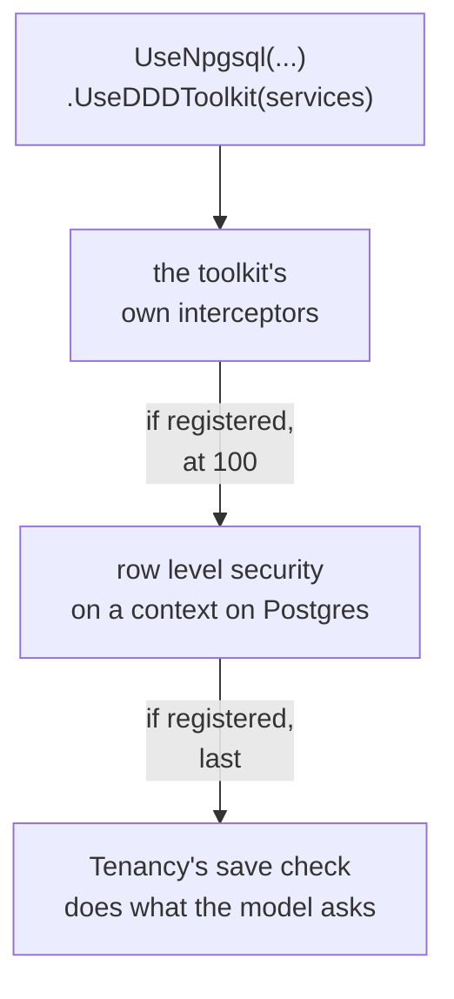
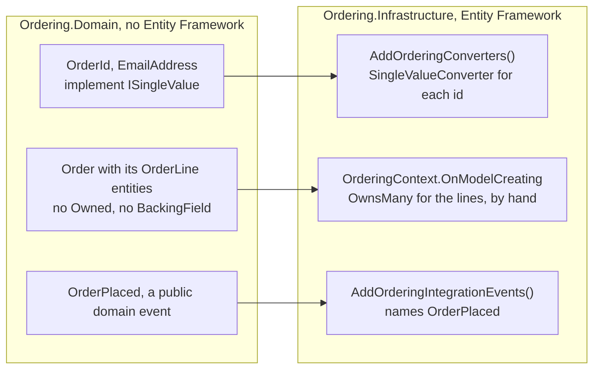
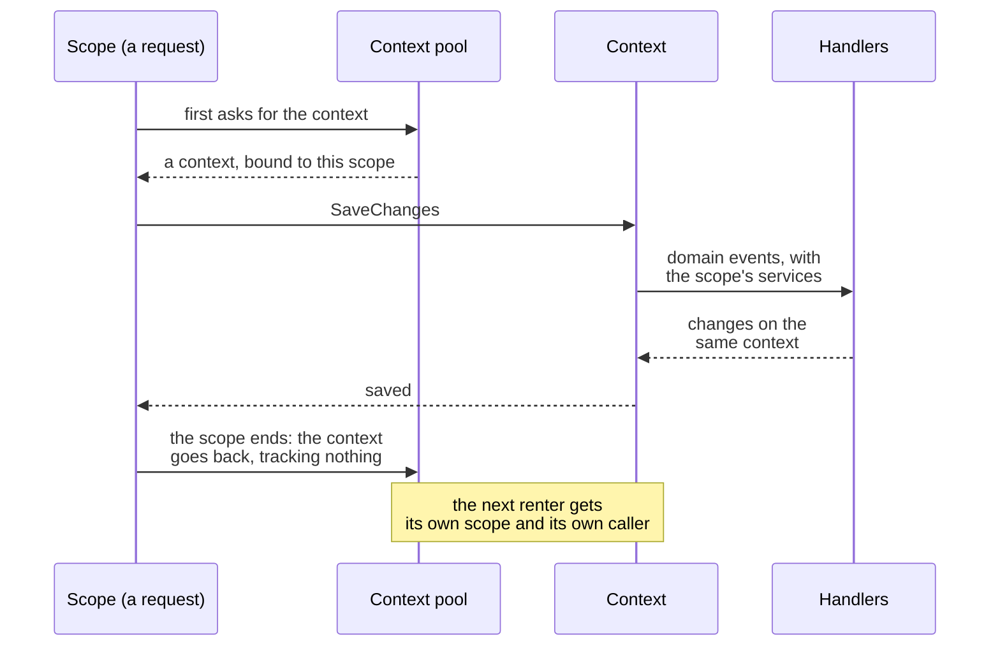

# Entity Framework

`DDDToolkit.EntityFramework` is the persistence half of the toolkit. It teaches Entity Framework Core
about the types the generators produce, so a domain model written the way the other pages describe
maps to tables without hand-written configuration. It also carries the behaviours that need a save to
hang off: domain event delivery, the invariant check and optimistic concurrency.

The package does five things:

| | What it gives you |
|---|---|
| Generated converters | A `ValueConverter` per identifier and single value object, and one registration call per assembly |
| Conventions | Read-only collections mapped, `Version` made a concurrency token, `[Internal]` members ignored |
| Domain event delivery | In-process dispatch during `SaveChanges`, or a transactional outbox |
| Invariants at the save | Every entity a save adds or changes is asked for its invariants first; see [Invariants](invariants.md#at-the-save) |
| Optimistic concurrency | `Version` incremented per save, stale writes turned into `ConcurrencyConflictException` |

It does not give you a repository abstraction or a message bus. `DbContext` is already the unit of
work, and the delegate that hands events to your publisher is one you write. If your publisher is
[Mediator](https://github.com/martinothamar/Mediator), the companion package `DDDToolkit.Mediator`
writes that delegate for you; see [In-process dispatch](event-delivery.md#in-process-dispatch). If the
events have to leave the process, the outbox delivers to a sink you implement; see
[Integration events](integration-events.md).

## Install

```bash
dotnet add package Temp.DDDToolkit.EntityFramework
```

The package brings its own source generator, so referencing it is all the configuration there is. It
targets .NET 10 and Entity Framework Core 10.

## Wiring it up

Three calls. One in your service registration, one on the `DbContextOptionsBuilder`, and one or more
in `ConfigureConventions`.

```csharp
using DDDToolkit.EntityFramework;

builder.Services.AddDDDToolkitEntityFramework();

builder.Services.AddDbContext<OrderingContext>((services, options) => options
    .UseSqlite(connectionString)
    .UseDDDToolkit(services));
```

```csharp
using DDDToolkit.EntityFramework.Conventions;
using Ordering.Domain.Converters;

public class OrderingContext(DbContextOptions<OrderingContext> options) : DbContext(options)
{
    public DbSet<Order> Orders => Set<Order>();

    protected override void ConfigureConventions(ModelConfigurationBuilder configurationBuilder)
    {
        configurationBuilder.AddDDDToolkitConventions();
        configurationBuilder.AddOrderingConverters();
    }
}
```

That stores and loads aggregates. It does not yet save an aggregate that raised a domain event: with
events pending, `SaveChanges` throws an `InvalidOperationException` that names the aggregate, says that
no delivery mode is configured and names the two calls that would configure one. Dropping the events
quietly would be worse, because each of them is a promise that something will happen.

The argument to `AddDDDToolkitEntityFramework` says how events are delivered. Handing them to
[Mediator](https://github.com/martinothamar/Mediator) handlers in the same process takes a second
package, besides Mediator itself:

```bash
dotnet add package Temp.DDDToolkit.Mediator
```

```csharp
using DDDToolkit.Mediator;

builder.Services.AddMediator(options => options.ServiceLifetime = ServiceLifetime.Scoped);
builder.Services.AddDDDToolkitEntityFramework(options => options.DispatchWithMediator());
```

That package is optional, because delivery is a delegate you can write yourself against any library or
none, and because the outbox is the other way to deliver. [Delivering domain events](event-delivery.md)
explains both and when to use which.

### `UseDDDToolkit`

Wires the context for the toolkit, with one call. It adds the toolkit's own interceptors, the ones that
deliver domain events, check invariants, raise the version and answer a save the database refused, and then
whatever the packages the host registered bring to a context: row level security once
`AddSupabaseRowLevelSecurity` or `AddPostgresRowLevelSecurity` is registered, Tenancy's save check once
`AddTenancy` is. A host that registered none of them gets the toolkit's interceptors and nothing else.

Pass the `IServiceProvider` that the options callback gives you. With `AddDbContext` that provider belongs to
the same scope as the context, so a handler that injects `OrderingContext` receives the very instance that is
saving. With a context pool the callback runs once and is handed the application's root provider, and the
handlers get the scope the context was rented in instead; see [Contexts from a pool](#contexts-from-a-pool).
[The interceptors](#the-interceptors) lists the toolkit's own in the order they run.

Each registration announces its part with a position, and the one call puts every part after the toolkit's
own interceptors, the lowest position first. That is the order the toolkit holds a context to. Tenancy's save
check comes last, at the highest position there is, so it sees what the domain event handlers changed, only
aggregates that passed their invariants, and every row another part added to the save.

Whether a part belongs on a context is decided from what the options say when the call is made. Row level
security is left off a context whose provider is configured and is not Postgres's. A context whose provider
comes later, further down the options callback or in `OnConfiguring`, gets it, and the interceptor passes over
the context at every use where it turns out not to be on Postgres: so a context on Postgres runs as its caller
wherever its provider was set. What the options cannot say at all, the model, a part decides when it is used:
Tenancy's save check sits on every context, checks the rows of one that keeps rows to a tenant, writes the
rights in Tenancy's own context, and passes over a context that has neither. So no registration names the
contexts it is for, and a module added later is wired by the same call. A model that cannot do without a part
says so, and a context of it without the part is refused at its first save
([A part a model cannot do without](#a-part-a-model-cannot-do-without)).



<details>
<summary>Show the code: three contexts in one host, one call each</summary>

```csharp
builder.Services.AddDDDToolkitEntityFramework(options => options.DispatchWithMediator());
builder.Services.AddSupabaseRowLevelSecurity();
builder.Services.AddShopTenancy(connectionString);       // AddTenancy<ShopTenancyContext>, with its context

// A module's context that keeps its rows to a tenant: the toolkit, row level security, Tenancy's save check
builder.Services.AddDbContext<OrderingContext>((services, options) => options
    .UseNpgsql(connectionString)
    .UseDDDToolkit(services));

// A context of shared data on Postgres: the same three; the save check finds no row of a tenant, and checks none
builder.Services.AddDbContext<CatalogContext>((services, options) => options
    .UseNpgsql(connectionString)
    .UseDDDToolkit(services));

// A context on SQLite in the same host: no row level security, which is Postgres's
builder.Services.AddDbContext<ReportsContext>((services, options) => options
    .UseSqlite(reportsConnectionString)
    .UseDDDToolkit(services));
```

</details>

The `Use...` calls of the packages stay, and each adds nothing a context already has. A chain written out as it
was before the one call, `UseDDDToolkit(services).UseSupabaseRowLevelSecurity(services).UseTenancy(services)`,
gives each interceptor once, as does `UseDDDToolkit` called twice. The first time the options of a context type
are built with a part, the log says so, once, as information:

```text
UseDDDToolkit gave 'OrderingContext' what the host's registrations bring, after the toolkit's own interceptors: postgres.row-level-security, tenancy.save-check. A context that should do without one is configured with UseDDDToolkitCore and the Use... calls of the parts it does want.
```

**Coming from 3.1.** Up to 3.1, `UseDDDToolkit` added the toolkit's interceptors alone, and a context ran as its
caller only with `UseSupabaseRowLevelSecurity` or `UsePostgresRowLevelSecurity` in its own options. Now every
context on Postgres that `UseDDDToolkit` wires runs as its caller once row level security is registered. A
context you left without it on purpose moves to `UseDDDToolkitCore`, below, before you upgrade. Until it does,
its queries run as the role of their caller instead of the role the application logged in as. Where the login
role owns the tables or is a superuser, as it usually is, that takes rights away: the caller sees and changes
what the policies let it. Where the login role was a restricted one, it can give more instead: background work
runs as `SystemRole`, which on Supabase is often `service_role`, past every policy, and a request as
`authenticated` or `anon`, with whatever those roles were granted. The line above names the context the first
time its options are built, which without start-up checks is the first time something uses it;
`builder.Services.RunStartupChecks()` builds every registered context before the first request, so every line is
in the log at start.

### `UseDDDToolkitCore`

The base alone: the toolkit's own interceptors, and nothing a package brings, which is what `UseDDDToolkit`
added up to 3.1. It is for a context that should do without a part the host registered, a context on Postgres
that runs as the role the application logged in as while the others run as their caller, say. Such a context
takes the parts it does want with their own calls, after it:

```csharp
// Runs as the login role, and still keeps its rows to a tenant
builder.Services.AddDbContext<ReportsContext>((services, options) => options
    .UseNpgsql(connectionString)
    .UseDDDToolkitCore(services)
    .UseTenancy(services));
```

Writing it is the decision, and the options keep it. The [start-up check](startup-checks.md) of row level
security, `postgres.row-level-security-wired`, takes a context given the base alone as meant; one without row
level security that was wired otherwise, with the toolkit's interceptors added by hand say, is still refused.
A part the context's model cannot do without is still held to: a context that keeps rows to a tenant needs
Tenancy's save check, whichever call wired it.

Running as the login role means doing what that role may. Where the host keeps to
[a login that owns nothing](row-level-security.md#a-login-that-owns-nothing), as the start-up check
`postgres.login-role-owns-nothing` holds it to, the login role holds nothing on the tables, and the database
refuses such a context's first command. It reads past the policies only where the login role owns the tables,
in a host that skips that check with a reason. Work across callers usually belongs to a system caller instead,
`Callers.Begin(Caller.SystemIn("reports"))`, in a context that runs as its caller.

### A part of your own

A package of yours, or the application's own infrastructure, brings a part the same way the toolkit's packages
do: registered next to what it is about, with a name and a position, and `UseDDDToolkit` puts it in its place on
every context it belongs on.

```csharp
public static IServiceCollection AddBillingAudit(this IServiceCollection services)
{
    services.TryAddSingleton<BillingAuditInterceptor>();
    return services.AddContextPart(new ContextPart<DbContextOptionsBuilder>(
        "billing.audit",
        position: 150,                                       // after row level security, at 100
        (options, provider) => options.UseBillingAudit(provider)));
}
```

`UseBillingAudit` is the method a host calls when it takes the parts one by one, and like the toolkit's it adds
nothing the options already have. Left as it is, the part goes on every context, and its interceptor decides at
each use whether the context gives it anything to do, as Tenancy's does. `AppliesTo` passes over a context by
what its options say, as row level security does by the provider. Where the options cannot tell yet, let the part
go on and its interceptor pass over at use what it has nothing to do for, as row level security does for a
provider set later: a part that is left off when nothing can be told yet fails open. Two registrations of one
name bring the part once. Tenancy's save check comes last, whatever position yours has, so a row your part adds
or changes in a save is checked like any other.

| Part | Brought by | Position | Goes on |
|---|---|---|---|
| `postgres.row-level-security` | `AddPostgresRowLevelSecurity`, `AddSupabaseRowLevelSecurity` | 100 | every context that may be on Postgres; it passes over one that is not |
| `tenancy.save-check` | `AddTenancy` | last, `int.MaxValue` | every context; it checks those that keep rows to a tenant |

The names and positions are constants on the interceptors, `PostgresRowLevelSecurityInterceptor.PartName` and
`TenancySaveInterceptor.PartName`, with `PartPosition` next to each. Membership brings none: its member tables
are your context's own, and on Postgres its lock is the policies the export writes, which hold a context once
row level security runs it as its caller. Its [expert hold](membership.md#the-expert-hold) is no part either: no
registration brings it, because a host decides it per context, and writes it after the one call,
`.UseDDDToolkit(services).UseMemberHolds(services)`, or after `UseDDDToolkitCore`. It changes no row, so it may come
after Tenancy's save check.

### A part a model cannot do without

A part goes on every context the one call wires, and a context needs it because of what its model holds: Tenancy's
save check, for a context that keeps rows to a tenant. Where nothing registered the part, or the context was given
the base alone, the one call has nothing to add, and the context would save without it. So the model says what it
cannot do without. `ScopeToTenant` states the save check, and a mapping of your own states its part with
`RequireContextPart`:

```csharp
entity.Metadata.Model.RequireContextPart(
    "billing.audit",
    typeof(BillingAuditInterceptor),
    registeredWith: "services.AddBillingAudit()",
    addedWith: "options.UseBillingAudit(serviceProvider)");
```

A context whose model requires a part its options do not have is refused at its first save, before anything is
written, and by the start-up check `entity-framework.toolkit-wired` before the first request. The part is seen on
a context by the interceptor it adds. Where nothing registered it, the message names the registration:

```text
'ProjectsContext' cannot do without the part tenancy.save-check, which its model requires, and its options have no TenancySaveInterceptor, so its saves would go without it. No registration brought it. Register it with services.AddTenancy<…, TContext>(…) of DDDToolkit.Supporting.Tenancy.EntityFramework, and options.UseDDDToolkit(serviceProvider) puts it on every context.
```

Where one did, the message names `UseDDDToolkit`, and the part's own call after `UseDDDToolkitCore`. The requirement
is an annotation of the model whose value is text, so the model still goes into a migration's snapshot and a
compiled model.

### `AddDDDToolkitConventions` and `Add{Module}Converters`

`AddDDDToolkitConventions` adds the five toolkit conventions to the model. It is the same for every
context, so it takes no arguments. What each one does is under
[What is generated and what is a convention](#what-is-generated-and-what-is-a-convention).

`Add{Module}Converters` is generated, one per assembly that declares identifiers or single value
objects. It registers the value converter the generator wrote for each of them, so Entity Framework
stores an `OrderId` as the `Guid` inside it:

```csharp title="ConverterExtensions.g.cs, shortened"
namespace Ordering.Domain.Converters;

public static class ConverterExtensions
{
    public static ModelConfigurationBuilder AddOrderingConverters(this ModelConfigurationBuilder modelConfigurationBuilder)
    {
        // ...
        modelConfigurationBuilder.Properties<OrderId>().HaveConversion<OrderId.OrderIdConverter>();
        modelConfigurationBuilder.DefaultTypeMapping<OrderId>().HasConversion<OrderId.OrderIdConverter>();
        // ...
        return modelConfigurationBuilder;
    }
}
```

The method lives in a `Converters` namespace under the assembly name, in a static class called
`ConverterExtensions`. Its name comes from the first of three places that has one:

1. `[assembly: Module("Ordering")]` in a file of the project. It always wins, and gives
   `AddOrderingConverters`.
2. The `DDD_Module` property that [Getting started](getting-started.md#store-it-with-entity-framework)
   sets in the project file, which a `Directory.Build.props` can set for a whole folder. It declares the
   module as well, and the build writes the attribute above from it
   ([A module named by its folder](modules.md#a-module-named-by-its-folder)), except in a test project and in
   the rare project that sets `DDD_DeclareModule` to false, where it only names the code.
3. The assembly name with the dots removed.

The module is the boundary the analyzer checks, described in [Modules](modules.md).
[Why the property becomes an attribute](modules.md#why-the-property-becomes-an-attribute) explains why the
build writes the attribute rather than leave the property to say it.

Call one per module, and one per assembly that is no module. Two assemblies of one module, such as a
module and its contracts project, share a name, and each one's method calls the ones of the module's
other assemblies it references. A solution with a shared kernel and two modules calls three:

```csharp
protected override void ConfigureConventions(ModelConfigurationBuilder configurationBuilder)
{
    configurationBuilder.AddDDDToolkitConventions();
    configurationBuilder.AddSharedKernelConverters();
    configurationBuilder.AddOrderingConverters();
    configurationBuilder.AddBillingConverters();
}
```

An assembly that declares no identifier and no single value object produces no method, because there
would be nothing for it to register, unless it is the project of a module whose other projects declare
identifiers without Entity Framework: then its method registers theirs. See
[A domain project without Entity Framework](#a-domain-project-without-entity-framework).

### `AddDDDToolkitEntityFramework`

Registers the delivery configuration and the interceptors `UseDDDToolkit` adds. The argument
configures delivery; see [Delivering domain events](event-delivery.md). If your aggregates never raise
events you can call it with no argument at all, but you still need it, because it is what registers the
interceptors.

It can be called more than once, which is what lets each module of a modular monolith register its own
outbox next to its own context. See [An outbox per context](event-delivery.md#an-outbox-per-context).

## Mapping

Everything in this section works with no `OnModelCreating` code at all. The mapping tests in
`Tests/DDDToolkit.EntityFramework.Tests/MappingTests.cs` cover each case against SQLite.

### Identifiers

A struct identifier works as a primary key, as an ordinary property, and as a nullable property:

```csharp
[EntityId<Guid>("ORD")]
public readonly partial record struct OrderId;

[AggregateRoot<OrderId>]
public partial class Order
{
    public CustomerId Customer { get; private set; }

    public CourierId? Courier { get; private set; }
}
```

The generator writes a converter into each identifier. It stores the underlying value, so the column is
a `Guid`, an `int` or a `string`, not a serialized object:

```csharp title="OrderId.Converter.g.cs"
readonly partial record struct OrderId
{
    public sealed class OrderIdConverter : ValueConverter<OrderId, Guid>
    {
        public OrderIdConverter() : base(static v => v.Value, static v => new OrderId(v))
        {
        }
    }
}
```

and the identifier is usable in a query predicate:

```csharp
var order = context.Orders.Single(o => o.Id == orderId);          // the key
var theirs = context.Orders.Count(o => o.Customer == customerId); // a plain property
var unassigned = context.Orders.Count(o => o.Courier == null);    // a nullable property
```

Class identifiers, declared as `partial record` rather than `readonly partial record struct`, map the
same way and get a converter for their always-valid twin as well.

### Ids the database never makes

An id is made in code before the save, `OrderId.Create()`, so a change and every event of it know the id from
the start; the database stores it, and makes none. Nothing has to be configured for that. Entity Framework
generates a key's value on add only when the key's own type is a number or a `Guid`, and an id is a type of its
own, which reaches its column through the converter `Add{Module}Converters` registers: the key of an
`[EntityId<long>]` is a plain `bigint` on Postgres and an `INTEGER` SQLite numbers nothing for, and a new row
whose id holds no value yet is saved with that value rather than one the database picks. The tests in
`Tests/DDDToolkit.EntityFramework.Tests/Conventions/EntityIdKeyTests.cs` hold Postgres and SQLite to it, so a
provider that ever started making ids would fail them.

An id over a `long` or a `string` that a package makes, as Tenancy makes a tenant's, says how with a `Create()`
of its own ([Creating identifiers](identifiers.md#creating-identifiers)).

### Value objects

A `[ValueObject]` record is annotated `[ComplexType]`, so its properties are stored inline in the
owning table:

```csharp
[ValueObject]
public partial record PersonName(string FirstName, string LastName);
```

```csharp title="PersonName.EntityFramework.g.cs"
[ComplexType]
partial record PersonName
{
}

[ComplexType]
partial record ValidPersonName
{
}
```

An order's `Recipient`, a `PersonName`, becomes `Recipient_FirstName` and `Recipient_LastName` columns
on the `Orders` table, not a table of its own.

A `[SingleValueObject<T>]` is a converted scalar, so it becomes one column, and a nullable one stores
and reads `null`. Its converter is written the same way as an identifier's, with a second one for the
always-valid twin:

```csharp
[SingleValueObject<string>]
public partial record EmailAddress
{
    public static EmailAddress Create(string value) => new(value);
}
```

```csharp title="EmailAddress.Converter.g.cs"
partial record EmailAddress
{
    public sealed class EmailAddressConverter : ValueConverter<EmailAddress, string>
    {
        public EmailAddressConverter() : base(static v => v.Value, static v => new EmailAddress(v))
        {
        }
    }
}

partial record ValidEmailAddress
{
    public sealed class ValidEmailAddressConverter : ValueConverter<ValidEmailAddress, string>
    {
        public ValidEmailAddressConverter() : base(static v => v.Value, static v => new ValidEmailAddress(v))
        {
        }
    }
}
```

See [Value objects](value-objects.md#entity-framework).

### Child entities and owned collections

`[Entity<TId>]` produces `[Owned]`, so a child entity is loaded and saved with its aggregate:

```csharp
[Entity<Guid>("LINE")]
public partial class OrderLine
{
    // Sku and Quantity
}
```

```csharp title="OrderLine.EntityFramework.g.cs"
[Owned]
partial class OrderLine
{
}
```

A generated `partial IReadOnlyList<OrderLine> Lines { get; }` on the aggregate is discovered as an owned
collection. The `[BackingField]` annotation on the generated property points Entity Framework at the
private list, so it reads and writes the field and never tries to write through the read-only view:

```csharp title="Order.g.cs, shortened"
partial class Order : AggregateRoot<OrderId>
{
    protected Order()
    {
    }

    // ...

    private readonly List<OrderLine> _lines = new();

    private IReadOnlyList<OrderLine>? __linesView;

    [BackingField(nameof(_lines))]
    public partial IReadOnlyList<OrderLine> Lines => __linesView ??= _lines.AsReadOnly();

    // ...
}
```

The protected constructor is the one Entity Framework uses to materialize a row. The core generator
writes `[BackingField]` only when the project references Entity Framework, so a domain project without
it gets the same property without the annotation.

Removing an element removes the row. Callers still cannot cast `Lines` back to `List<OrderLine>` and
mutate it.

### Composite keys

A property marked `[KeyPart]` joins the primary key ahead of `Id`, and the foreign key of every owned
child carries it too, so `Order` keyed `(RegionId, Id)` owns `OrderLine` rows keyed
`(RegionId, OrderId, Id)`. The child needs a property of the same name; without one the model refuses
to build. [Composite keys](composite-keys.md) has the rules, the order of several parts, and how to
override it.

### Read-only collections of primitives

A generated `IReadOnlyList<T>` where `T` is a primitive, a converted identifier or a single value
object is mapped as an Entity Framework primitive collection, which on a relational provider is a
JSON column. The elements are stored as their converted values:

```csharp
[EntityId<int>("TAG")]
public readonly partial record struct TagId;

public partial IReadOnlyList<TagId> Tags { get; }
```

Two tags produce the column value `[1,2]`, not a pair of objects.

This needs the convention. Entity Framework discovers primitive properties only when they have a
setter, and a generated collection property is get-only, so without `AddDDDToolkitConventions` the
property would be skipped silently and the data would never reach the database. The convention finds
it, sets the element type, and copies the converter, max length, unicode, precision and scale from
the type mapping the generated registration installed.

The convention only considers public get-only properties. A `protected partial IReadOnlyList<T>` is
not mapped as a primitive collection.

"A JSON column" is true on SQL Server and SQLite and not on PostgreSQL, which stores the same
collection as a native array. LINQ queries port across that difference and hand-written SQL does not.
See [Primitive collections do not port below LINQ](#primitive-collections-do-not-port-below-linq)
before you write a report against one of these columns.

### What is not mappable

Entity Framework Core 10 accepts only arrays and `IList<T>` implementations as primitive collections.
A generated `IReadOnlySet<T>` is backed by a `HashSet<T>`, so a set of primitives cannot be a
primitive collection.

Rather than leave the property silently unmapped, `ReadOnlyCollectionConvention` throws while the
model is built. The message names the type and property, says that the backing field is a `HashSet`
and that only arrays and `IList<T>` qualify, and tells you to declare `IReadOnlyList<T>` instead or
exclude the property with `[NotMapped]` or `Ignore()`. You see it on first use of the context, not at
save time.

```csharp
public partial IReadOnlySet<string> Keywords { get; }   // throws while building the model
public partial IReadOnlyList<string> Keywords { get; }  // maps
```

An `IReadOnlySet<T>` of entities is fine. That is a navigation, not a primitive collection, so
relationship discovery handles it and the children round-trip with their aggregate.

## Optimistic concurrency

Every aggregate root carries `long Version`. It is 0 on a new instance, becomes 1 when the aggregate
is inserted, and increases by exactly one per save that touches the aggregate. `AddDDDToolkitConventions`
maps it as a concurrency token, so the `UPDATE` carries the loaded version in its `WHERE` clause.

"Touches the aggregate" includes more than the root's own properties. `AggregateVersionInterceptor`
walks from each changed entry to the aggregate root it belongs to, through ownership or through a
foreign key whose principal is an aggregate root, and bumps that root. A change to an owned child, an
element added to or removed from an owned collection, or a change to a primitive collection on a
child, all version the root. Each root is bumped at most once per save, however many entries changed,
and a save that changes nothing does not bump anything.

Deleting an aggregate does not bump its version, but the token is still checked, so deleting an
aggregate somebody else has changed in the meantime conflicts like any other stale write.

The version is what makes the aggregate a unit of consistency: two people editing different lines of
the same order still conflict, which is the point.

When a save writes a stale version, you get a `ConcurrencyConflictException` naming the aggregate:

```csharp
try
{
    await context.SaveChangesAsync(cancellationToken);
}
catch (ConcurrencyConflictException conflict)
{
    // conflict.AggregateType is typeof(Order), conflict.AggregateId is the OrderId.
    // Reload the aggregate, reapply the change and save again, or report it to the user.
    return Conflict(conflict.Message);
}
```

There is no safe generic answer for the catch block, which is why the toolkit does not retry for you.
Reloading and reapplying is right when the change is a command you can repeat, such as adding a line.
Reporting the conflict is right when the user needs to see what changed underneath them. Blindly
retrying a computed value is wrong.

`conflict.InnerException` is the original `DbUpdateConcurrencyException` if you need the entries.
[Why the exception is rethrown from `SaveChangesFailed`](#why-the-exception-is-rethrown-from-savechangesfailed)
explains how it reaches your catch block unwrapped.

### The version the client saw

The token protects the moment between a load and its save. A client that read an order a minute ago and
now sends a change it decided on then is not covered by that: the server loads the order as it is now,
and saves over whatever happened in that minute. `ExpectVersion` closes the gap. Hand it the version the
client read, after the load and before the change:

```csharp
var order = await context.Orders.SingleAsync(order => order.Id == id, cancellationToken);
context.ExpectVersion(order, expectedVersion);   // from If-Match, or from the mutation's input
order.Cancel(reason);
await context.SaveChangesAsync(cancellationToken);
```

If the order is loaded at another version, it throws `ConcurrencyConflictException` there and then, before
anything changes. If the versions agree, the save compares against that version as it always does, so a
change somebody makes between the load and the save is the same conflict. One exception for both, because
the client does the same thing for both: read again, and decide again.

A request whose client may leave the version out carries a `long?`, and hands it over as it is: with none,
`null`, there is nothing to compare at the load, and the save compares the version loaded, as it always
does. So one line serves both, and it is the line a handler writes after its load:

```csharp
var order = await context.Orders.SingleAsync(order => order.Id == command.Order, cancellationToken);
context.ExpectVersion(order, command.ExpectedVersion);   // none named: the client asked for the order as it is
```

It reads nothing from the database and changes nothing in the context. It refuses, with an
`InvalidOperationException`, an aggregate this context did not load, a new aggregate, which has no stored
version yet, and a model that does not map `Version` as a concurrency token, where an expectation that
only held at the load would look like protection and be none.

A read answers the version next to the data, in the body or as an `ETag`, and a client that leaves the
expectation out gets the last write wins it had before. In GraphQL the conflict is a
[`ConcurrencyConflictError`](graphql.md#typed-errors-in-mutation-payloads) in the mutation's payload.

## Migrations

There is nothing special to do. The toolkit adds types and configuration to your own `DbContext`
model, so everything it maps appears in your ordinary migrations:

```bash
dotnet ef migrations add AddOutbox
dotnet ef database update
```

The outbox table is part of the model as soon as `AddDomainEventOutbox(Database)` is in `OnModelCreating`, so
the next migration you scaffold contains it, `ddd` schema and all. Opting in is that one call. There
is no separate package, no separate migration history table and no separate command. The same goes for
`AddDomainEventInbox(Database)` on the consuming side. See [The table](event-delivery.md#the-table).

If you write migrations by hand rather than scaffolding them, `migrationBuilder.CreateDomainEventOutbox()`
and its inbox and drop counterparts write the same tables. See
[Integration events](integration-events.md#tables-schema-and-migrations).

The same applies to everything else on this page. Struct identifier columns, complex type columns,
primitive collection columns and the `Version` column are all just columns in your model, so a
`migrations add` after changing an aggregate produces the diff you would expect.

If you map the outbox table before you need it, as the example context does, switching from
in-process dispatch to the outbox later costs no migration at all.

On Supabase the CLI applies migrations, not Entity Framework; see [Supabase](#supabase).

## What is generated and what is a convention

The split is not arbitrary. A value converter is specific to one type, so it has to be written per
type and registered per assembly, which is work for a generator. A convention is a rule about the
shape of a model, identical in every context, so it lives in the runtime package.

The generator emits, for each type:

| You wrote | Generated |
|---|---|
| `[EntityId<T>]` | A nested `ValueConverter`, for example `OrderId.OrderIdConverter`, storing `Value` |
| `[SingleValueObject<T>]` | The same, plus a converter for the always-valid twin |
| `[ValueObject]` | `[ComplexType]` on the record and on its twin |
| `[Entity<TId>]` | `[Owned]` on the class |

and once per assembly, the registration method, which registers every converter twice:

```csharp title="ConverterExtensions.g.cs, shortened"
modelConfigurationBuilder.Properties<OrderId>().HaveConversion<OrderId.OrderIdConverter>();
modelConfigurationBuilder.DefaultTypeMapping<OrderId>().HasConversion<OrderId.OrderIdConverter>();
```

Both lines are needed and neither covers the other's ground. `Properties<T>()` configures properties
of that type, which is most of what a model contains. `DefaultTypeMapping<T>()` configures the type
where no property is involved: query parameters, constants, and the element type of a primitive
collection. The read-only collection convention reads that default type mapping to find the converter
for the elements of a generated `IReadOnlyList<T>`, because Entity Framework does not carry property
configuration down to collection elements.

`ColumnLength` on an identifier or single value object becomes `HaveMaxLength` on the property
registration and `HasMaxLength` on the type mapping. See [Identifiers](identifiers.md#column-length).

The conventions, added by `AddDDDToolkitConventions`, are:

| Convention | What it does |
|---|---|
| `InternalMemberConvention` | Ignores every member carrying `[Internal]`, on entity types and complex types alike |
| `ReadOnlyCollectionConvention` | Maps generated get-only collections of primitives and converted types as primitive collections, applying the element converter |
| `AggregateRootVersionConvention` | Makes `Version` on every aggregate root a concurrency token |
| `KeyPartConvention` | Puts `[KeyPart]` properties into the primary key ahead of `Id`, and into the foreign key of every owned type below; see [Composite keys](composite-keys.md) |
| `IndexRefusalConvention` | Checks every index that says what it refuses with, `RefusesAs`, when the model is built: the index is unique, and every property its message names in braces is one the entity maps |

`InternalMemberConvention` is why `DomainEvents` never reaches your tables. The `AggregateRoot<TId>`
base class marks it `[Internal]`, so the convention ignores it exactly as `[NotMapped]` would.

Explicit configuration in `OnModelCreating` still wins over any of this. The conventions fill in what
you did not say.

### A domain project without Entity Framework

A module split into projects by layer (see [A module in layers](modules.md#a-module-in-layers)) keeps Entity
Framework out of its domain and contracts projects. The generator writes Entity Framework's parts only into a
project that references it, so those projects get no nested converters, no `[Owned]`, no `[ComplexType]`, and
no `[BackingField]` on the field behind a generated collection. What the infrastructure project, which holds
the context, gets instead:



<details>
<summary>Show the code: the infrastructure project's context and registration</summary>

```csharp
// Ordering.Infrastructure: the one project of the module that references Entity Framework
public sealed class OrderingContext(DbContextOptions<OrderingContext> options) : DbContext(options)
{
    public DbSet<Order> Orders => Set<Order>();

    protected override void OnModelCreating(ModelBuilder modelBuilder)
        => modelBuilder.Entity<Order>(order =>
        {
            // The domain project marks nothing for Entity Framework, so the context says what an order line is
            order.OwnsMany(row => row.Lines, line => line.ToTable("OrderLines"));
        });

    protected override void ConfigureConventions(ModelConfigurationBuilder configurationBuilder)
    {
        configurationBuilder.AddDDDToolkitConventions();

        // Generated into this project: a converter for every id and single value object of the module
        configurationBuilder.AddOrderingConverters();
    }
}

// The module's registration, in the same project
services.AddDDDToolkitEntityFramework(options => options.UseOutbox<OrderingContext>(outbox =>
    outbox.AddOrderingIntegrationEvents()));   // generated here too: names OrderPlaced
```

</details>

- **Identifiers and single value objects** are registered by the infrastructure project's generated
  `Add{Module}Converters()`, with `SingleValueConverter<T, TValue>`, so the context calls that one method,
  whichever of the module's projects declares the ids. See
  [Identifiers](identifiers.md#stored-by-a-project-that-does-not-declare-it).
- **Child entities and value objects** are not marked for Entity Framework, so the context maps them in
  `OnModelCreating`: `OwnsMany` or `OwnsOne` for a child entity, `ComplexProperty` for a value object. Without
  it a child entity with an id of its own is mapped as an entity type of its own, and the model changes.
- **A generated read-only collection of ids or primitives** needs its backing field named. The read-only
  collection convention finds the `List<T>` behind the property through `[BackingField]`, and without it
  leaves the collection unmapped, so the context maps it with `HasField`. A collection of child entities is a
  navigation, and Entity Framework finds its field by name.
- **Domain events** are registered by the infrastructure project's `Add{Module}IntegrationEvents()`, and must
  be `public` ([DDD00033](diagnostics.md#ddd00033)).

Whether a model still maps as it did is what `HasPendingModelChanges()` answers: a test that asks it of each
context catches a child entity or a collection the split left unmapped.

## The interceptors

`UseDDDToolkit` and `UseDDDToolkitCore` add the toolkit's own four interceptors, in the order they run,
before any part a package brings. The first of them also refuses a save of a context that lacks a part its model
requires ([A part a model cannot do without](#a-part-a-model-cannot-do-without)):

| | Interceptor | Why there |
|---|---|---|
| 1 | `PublishDomainEventsInterceptor` | Delivers domain events first, so whatever the handlers change is part of the same save |
| 2 | `InvariantInterceptor` | Sees whatever those handlers changed |
| 3 | `AggregateVersionInterceptor` | Comes after both, so a save the invariants reject leaves no version bumped |
| 4 | `DatabaseRefusalInterceptor` | Only answers a save the database refused: the refusal a unique index declares with `RefusesAs`, or `access.refused` for a row a policy or a guard denied, logged as [a race or a disagreement](row-level-security.md#when-the-policies-refuse-what-c-allowed) |

`AddDDDToolkitEntityFramework` registers them. The options object is a singleton, and so are
`InvariantInterceptor`, `AggregateVersionInterceptor` and `DatabaseRefusalInterceptor`, because they
hold no state. `UseDDDToolkit` builds a `PublishDomainEventsInterceptor` for the options it is called
on, from the provider it is handed, and that interceptor hands the handlers the scope the saving
`DbContext` belongs to: the scope that owns it under `AddDbContext`, the scope that rented it under
[a pool](#contexts-from-a-pool). It is also registered as a scoped service, for a host that adds the
interceptors by hand.

### Checking the wiring

A context built without `UseDDDToolkit`, or `UseDDDToolkitCore`, saves, and simply checks no invariant,
bumps no version and stores no event. Nothing fails, so nobody notices. `EntityFrameworkChecks` says so at start-up, before the
first request. `AddDDDToolkitEntityFramework` registers it as the [start-up check](startup-checks.md)
`entity-framework.toolkit-wired`, and one call runs it with every other check the host's registrations brought:

```csharp
builder.Services.AddDDDToolkitEntityFramework(options => options.DispatchWithMediator());
builder.Services.RunStartupChecks();
```

It looks at every context the host registers that maps one of the toolkit's classes: an entity or an aggregate,
or the table of the outbox, the inbox or the event log. A context a library brings for its own tables needs none
of the interceptors, and is passed over. Every context, either kind, is also held to the parts its model requires
([A part a model cannot do without](#a-part-a-model-cannot-do-without)). By hand, it is:

```csharp
var app = builder.Build();

await using (var scope = app.Services.CreateAsyncScope())
{
    foreach (var contextType in EntityFrameworkChecks.RegisteredContexts(scope.ServiceProvider))
    {
        EntityFrameworkChecks.EnsureToolkitWired((DbContext)scope.ServiceProvider.GetRequiredService(contextType));
    }
}
```

`EnsureToolkitWired` opens nothing. It throws unless the context's options hold the three interceptors
that decide what is saved, in the order above: a host that adds them by hand passes as long as events
come before invariants and invariants before versions. It also throws when the model and the outbox
disagree: the model maps an [event log](#an-event-log) that no `KeepEventLog()` keeps, or the context has
an outbox of its own whose table, or whose event log, the model does not map. `RegisteredContexts` lists
every context type the container knows, by name, so a module added later is checked without anyone
remembering to list it.

## Why the exception is rethrown from `SaveChangesFailed`

The interceptor translates the conflict in `ThrowingConcurrencyException`, but the update pipeline
wraps whatever that throws in a `DbUpdateException`, so callers would have to dig through inner
exceptions to find it. The interceptor therefore also handles `SaveChangesFailed`, unwraps the
`ConcurrencyConflictException` and rethrows it, which is what lets you write
`catch (ConcurrencyConflictException)` directly. It does the same for a provider that raised the
conflict without passing through `ThrowingConcurrencyException`.

Both the synchronous and the asynchronous save path behave the same.
`Tests/DDDToolkit.EntityFramework.Tests/ConcurrencyTests.cs` covers the version arithmetic, child-only
changes, deletes and both paths.

## Contexts from a pool

Entity Framework can keep context instances in a pool and hand them out again, instead of making one
for every scope. `AddPooledDbContextFactory<TContext>` registers a factory to rent from, and
`AddDbContextPool<TContext>` a context per scope. A pool earns its place when one request reads side
by side, because no two queries may share a context: each read rents a context for its own query, the
way a GraphQL server needs it for the fields of one query, while the commands of the request keep one
context as their unit of work.

```csharp
builder.Services.AddDDDToolkitEntityFramework(options => options.DispatchWithMediator());

builder.Services.AddPooledDbContextFactory<OrderingContext>((services, options) => options
    .UseNpgsql(connectionString)
    .UseDDDToolkit(services));
builder.Services.AddScopedFromPool<OrderingContext>();
```

`UseDDDToolkit` is the call it always was. `AddScopedFromPool<TContext>()` makes the context a scope
asks for one that is taken from the pool, bound to that scope, and given back when the scope ends. It
goes after either pool registration. Entity Framework 10 registers the context as a scoped service for
both of them already (checked on 10.0.0 and 10.0.12), so there the call adds the binding and nothing
else; over a factory you registered yourself it registers the scoped context too. A context registered
with `AddDbContext` or `AddDbContextFactory` is not pooled, and is refused with an
`InvalidOperationException`: the first by the call itself, the second when a scope first asks for the
context, because only the context it is then given says that it comes from no pool.

**One rule comes with a pool: nothing in the options callback reads a caller, a request or a scope.**
A pool builds its options once, with the application's root services, and every context it hands out
shares them. The toolkit's own `Use...` methods resolve singletons only, and what differs per use is
read when it is used: who is calling, which [row level security](row-level-security.md) asks on every
open and before every command, and which scope the handlers of a save belong to. An interceptor of
your own in that callback has to do the same, so register it as a singleton that asks per use, and
capture nothing while the options are built.

### Handlers and the scope of a rental

In-process handlers run with a scope's services, so a handler that injects the context is given the
one that is saving. A pool's options know no scope, so the toolkit remembers which scope each rental
was bound to:



<details>
<summary>Show the code: a command and a read on one pool</summary>

The command takes the scope's context, which `AddScopedFromPool` took from the pool and bound to the
scope, so the handlers of its events run with that scope:

```csharp
public sealed class CancelOrderHandler(OrderingContext context)
{
    public async Task HandleAsync(OrderId id, string reason, CancellationToken cancellationToken)
    {
        var order = await context.Orders.SingleAsync(order => order.Id == id, cancellationToken);
        order.Cancel(reason);
        await context.SaveChangesAsync(cancellationToken);
    }
}
```

A read rents a context for its one query and gives it back, so two reads of one request never share
one:

```csharp
public sealed class OrderReads(IDbContextFactory<OrderingContext> contexts)
{
    public async Task<bool> ExistsAsync(OrderId id, CancellationToken cancellationToken)
    {
        await using var context = await contexts.CreateDbContextAsync(cancellationToken);
        return await context.Orders.AnyAsync(order => order.Id == id, cancellationToken);
    }
}
```

</details>

- **The context a scope asks for** is bound to that scope by `AddScopedFromPool`. Nothing else is
  needed.
- **A context you rent from the factory** has no scope. Reading through it needs none, and neither
  does saving with [an outbox](event-delivery.md#the-outbox), which writes its rows on the saving
  context and resolves nothing. Dispatching in process does: name the scope with
  `context.BindToScope(scope.ServiceProvider)`, which holds until the context is disposed.
- **A pooled context with events to dispatch in process and no scope is refused**, with an
  `InvalidOperationException` that names both ways out. It is refused before any event leaves its
  aggregate, so nothing is dispatched, nothing is saved, and the same save goes through once the
  context is bound. The toolkit does not make a scope of its own for the handlers: a handler that
  asked such a scope for the context would be given another instance than the one that is saving, and
  what it changed would be lost without a word.

Options that are built once without a pool, `AddDbContextFactory` or `AddDbContext` with
`optionsLifetime: ServiceLifetime.Singleton`, hand the callback the root provider as well. Where the
container validates scopes, the first in-process dispatch from such a context is refused in the same
way, and `BindToScope` is the way out there too.

### What the next renter gets

One instance serves one renter after another, and nothing of one reaches the next:

| What | Who ends it | When |
|---|---|---|
| Tracked entities, and the domain events pending on them | Entity Framework | when the context goes back |
| Change tracker settings, the command timeout, `SavingChanges` handlers | Entity Framework puts back what the context started with | when the context goes back |
| An open transaction | Entity Framework rolls it back | when the context goes back |
| A connection left open | Entity Framework closes it, and the context keeps the connection object | when the context goes back |
| The role, the claims and the settings of row level security on the server connection | Npgsql resets the connection, and the interceptor sets them again on every open | before the connection is used again |
| The scope a rental was bound to | the toolkit: a binding is for one rental | the next rental starts with none |
| Who is calling | nobody has to: it is never kept on a context | read on every use |

What nobody resets is a field your context class declares for itself, so declare none.

A context pool bounds how many context instances are kept, not how many connections are open. A
context holds a connection only while one of its commands runs, while it has a transaction, or after
you opened one by hand; a context in the pool holds none. The bound on connections is the data
source's `Maximum Pool Size`: a read that finds every connection taken waits up to `Timeout` seconds
and then fails with Npgsql's exception, and the next one succeeds as soon as a connection is free.
Code that already holds a connection and waits for a second one can end up waiting for itself, so do
not nest them.

`PooledContextSaveTests.cs`, `PooledContextRowLevelSecurityTests.cs` and `PooledContextBudgetTests.cs`
in `Tests/DDDToolkit.EntityFramework.Tests` hold each of these lines, on SQLite and against a real
Postgres.

## Providers

Everything on this page is tested on SQLite, PostgreSQL and SQL Server. SQLite is where the fast suite
runs; the other two run in containers, in their own CI workflow, against the same aggregates and the
same context. Most of the mapping is identical on all three. This section is the part that is not, so
that none of it is a surprise in production.

### What differs, and what to do about it

| | SQLite | PostgreSQL | SQL Server |
|---|---|---|---|
| `Guid` identifier | `TEXT` | `uuid` | `uniqueidentifier` |
| Outbox timestamps | UTC `DateTime` | `timestamptz` | `datetimeoffset` |
| Primitive collection | JSON `TEXT` | `integer[]` | JSON `nvarchar` |
| Schemas | ignored | yes | yes |

Timestamps are covered under [Timestamps](event-delivery.md#timestamps). Schemas are ignored by SQLite,
which drops the schema when it writes an identifier, so `ddd.OutboxMessages` is plain `OutboxMessages`
there and nothing else changes. The primitive collection is the one that needs a paragraph.

### Your own timestamps on SQLite

The outbox converts its timestamps for SQLite by itself; your own `DateTimeOffset` properties are left as
they are, which is fine until a query compares or orders one. SQLite keeps a `DateTimeOffset` as text and
throws on `Where(voyage => voyage.StartsAt <= now)`. Call `StoreDateTimeOffsetsAsUtc()` in
`ConfigureConventions` and every `DateTimeOffset` and `DateTimeOffset?` property of the model, owned and
keyless types included, is stored as its UTC instant in a `DateTime` column, on every provider, with the
same converters the outbox uses. The value reads back as the same instant with an offset of zero; the
offset it was written with is not kept. On PostgreSQL that is still `timestamp with time zone`, and on SQL
Server it is `datetime2` instead of `datetimeoffset`, so decide before the first migration.

```csharp
protected override void ConfigureConventions(ModelConfigurationBuilder configurationBuilder)
{
    configurationBuilder.AddDDDToolkitConventions();
    configurationBuilder.StoreDateTimeOffsetsAsUtc();
}
```

### Primitive collections do not port below LINQ

A generated `IReadOnlyList<TagId>` is mapped as an Entity Framework primitive collection. What that
becomes in the database is the provider's decision, not the toolkit's, and the providers decide
differently:

- **PostgreSQL** stores it as a real `integer[]`. Npgsql maps .NET collections of a primitive onto
  PostgreSQL's own array types, which is the better mapping and the reason it does it.
- **SQL Server and SQLite** store it as a JSON document in a string column, `[1,2]`.

**This is inherent to Entity Framework Core, not something the toolkit chose or can sensibly undo.**
The mapping is supplied by each provider's type mapping source. The toolkit's convention only finds
the get-only property, sets its element type and copies the element converter across; the store type
is chosen after that, by the provider, exactly as it would be for a hand-written
`modelBuilder.PrimitiveCollection(...)`. Forcing every provider onto the same store type would mean
overriding Npgsql's native array mapping with a worse one for the sake of a portability nobody asked
for, and would break every PostgreSQL index and query already written against the array.

So the practical rule is:

**LINQ ports.** `Contains`, `Count` and the rest translate on both providers, to `= ANY(...)` on
PostgreSQL and to `OPENJSON` on SQL Server. If your query goes through `IQueryable`, you can move
providers and it keeps working.

```csharp
// Translates on both.
var tagged = await context.Shelves
    .SelectMany(shelf => shelf.Books)
    .Where(book => book.Tags.Contains(new TagId(7)))
    .ToListAsync();
```

**SQL does not port.** Anything that reaches inside the column in hand-written SQL is provider
specific, and there is no spelling that runs on both:

```sql
-- PostgreSQL
SELECT COUNT(*) FROM "Book" WHERE 7 = ANY("Tags");

-- SQL Server
SELECT COUNT(*) FROM "Book" WHERE EXISTS (SELECT 1 FROM OPENJSON("Tags") WHERE CAST([value] AS int) = 7);
```

That matters for reports, ad hoc queries, data migrations and anything a DBA writes. Indexing differs
too: a PostgreSQL array takes a GIN index, a JSON string column does not.

If you need a query like that to port, the answer is not to fight the mapping. Model the collection as
a child entity with its own table, which is one row per tag and identical on every provider. You lose
the single-column read and gain a join. That is a design decision, so make it because you need the
portability, not by accident.

Both halves are asserted against real servers in
`Tests/DDDToolkit.EntityFramework.Providers.Tests/Providers/ProviderMappingTests.cs`.

## Domain event delivery

A raised domain event is a promise that something will happen, and this package keeps it when the
context saves: by running your handlers inside `SaveChanges`, or by writing the events to an outbox
table in the same transaction and delivering them afterwards. [Delivering domain events](event-delivery.md)
explains both modes, how to choose between them, and the outbox's table, processor and retries.

## An event log

An outbox row is work: it is marked, retried, and deleted once it is delivered. Some events are also a
record, of what happened and who did it, that has to stay as it was written. A context with an outbox
keeps those in an event log, a table of its own that nothing updates:

```csharp
// in the module's registration
options.UseOutbox<OrderingContext>(outbox => outbox
    .RegisterEventsFromAssemblyContaining<Order>()
    .KeepEventLog(log => log.Keep<OrderPlaced>().Keep<OrderCancelled>()));

// in OrderingContext
protected override void OnModelCreating(ModelBuilder modelBuilder)
{
    modelBuilder.AddDomainEventOutbox(Database);
    modelBuilder.AddEventLog(Database, keepFor: TimeSpan.FromDays(365));
}
```

The save that persists the aggregate adds one `EventLogEntry` per kept event next to the event's outbox
row, so the aggregate, the outbox row and the log row are written by one transaction: all three, or none
of them. `KeepEventLog()` without a choice keeps every event the context saves; `Keep<TEvent>()` keeps a
type and everything derived from it, and `Only(domainEvent => ...)` whatever it chooses. The choices add
up.

A row has the event's id, which is its outbox row's id as well, its stable name, version and payload,
when it occurred and when it was recorded, the aggregate that raised it, and who acted:

| The caller | `ActedByKind` | `ActedById` |
|---|---|---|
| A signed-in user | `user` | the user's id, or the token's `sub` where that is no `uuid` |
| The application's own work | `system` | `null` |
| The application's own work inside a scope, `Caller.SystemIn("ordering")` | `system` | the scope |
| A request without a user | `anonymous` | `null` |

That pair is an `ActedBy`, and `IActedByAccessor` answers it. The one the toolkit registers reads the
[caller](row-level-security.md#running-queries-as-the-caller) once for each save that keeps an event. Register a
singleton of your own before `AddDDDToolkitEntityFramework` to say it differently, with a kind of your own
for one: `new ActedBy("device", serialNumber)`.

Who acted is what the application wrote, and the database does not check it: with the
[written privileges](row-level-security.md#privileges-from-the-policies), every role that saves may add a
row, under any actor. A log that has to hold the actor to the caller needs policies that do, written by a
[contribution](row-level-security.md#policies-a-package-ships) that claims the table.

A module adds columns of its own with the `configure` argument, as shadow properties, and fills them with
an `IEventLogFields`:

```csharp
modelBuilder.AddEventLog(Database, configure: log => log.Property<string?>("Branch").HasMaxLength(64));

public sealed class BranchOfTheEvent(IBranchAccessor branch) : IEventLogFields
{
    public void Fill(IDomainEvent domainEvent, EntityEntry<EventLogEntry> entry)
    {
        if (entry.Metadata.FindProperty("Branch") is not null)
        {
            entry.Property("Branch").CurrentValue = branch.Current;
        }
    }
}

services.AddSingleton<IEventLogFields, BranchOfTheEvent>();
```

> [!IMPORTANT]
> `IActedByAccessor` and every `IEventLogFields` are singletons that read what they answer each time they
> are asked, from what follows the flow of work: the ambient caller, the current request, the event
> itself. They keep nothing between two events and take no scoped service. The interceptor asks its own
> provider for them once per save, and for a context from [a pool](#contexts-from-a-pool) that provider is
> the application's root one, where a scoped one is refused with a message that says so.

**The guard.** On Postgres, `DDDToolkit.EntityFramework.Postgres` writes the table's guard into every
[script of policies](row-level-security.md#writing-the-policies) of the context, and into its Supabase
access file, whether or not the context has a rule: triggers that refuse every update of a row, a
truncate, and every delete of a row younger than `keepFor`, by the database's own clock. They fire for
every role, the table's owner and a superuser included, where a privilege or a policy would stop neither.
A refused statement is SQLSTATE `55000` with the message `A kept row does not change.`,
`PostgresRowAccess.KeptRowsSqlState` and `KeptRowsRefusal`. A log mapped without `keepFor` keeps every row
for as long as the table exists. The guard needs Postgres 14 or later.

The guard holds statements, not definitions: whoever owns the table can still drop its triggers, or the
table. So the owner is the role that runs the migrations, and the application logs in as
[a role that owns nothing](row-level-security.md#a-login-that-owns-nothing).

> [!WARNING]
> On SQLite and SQL Server nothing guards the table. The toolkit itself never updates a row and deletes
> one only through retention, but a statement of your own is not refused there.

**Letting old rows go.** [Retention](integration-events.md#keeping-the-tables-small) has a
window for the log, separate from the outbox's, and leaves the log alone without one:

```csharp
services.AddDomainEventRetention<OrderingContext>(retention =>
{
    retention.KeepOutboxFor = TimeSpan.FromDays(7);
    retention.KeepEventLogFor = TimeSpan.FromDays(400);
});
```

The table has the last word, so `KeepEventLogFor` is at least the `keepFor` the log was mapped with. A run
that finds it shorter, or finds a log kept for good, fails before it deletes anything and names both. The
guard reads the database's clock and retention the application's, so retention waits a minute longer than
`keepFor` whatever the window says; keep the two clocks within that minute of each other.

## Supabase

The Supabase CLI applies migrations from SQL files in `supabase/migrations`, not from Entity Framework.
`DDDToolkit.EntityFramework.Supabase` writes one such file per Entity Framework migration as part of the
build, and can check at start-up that Supabase applied them. See [Supabase](supabase.md).

## Where to look next

- [Getting started](getting-started.md) for the module name and your first aggregate.
- [Delivering domain events](event-delivery.md) for in-process dispatch, Mediator and the outbox.
- [Identifiers](identifiers.md) for what a struct identifier actually is, and `ColumnLength`.
- [Value objects](value-objects.md) for `[ValueObject]` and `[SingleValueObject<T>]`.
- [Entities and aggregates](entities-and-aggregates.md) for read-only collections and `[BackingField]`.
- [Invariants](invariants.md) for the check every save runs.
- [Domain events](domain-events.md) for raising, draining and stable names.
- [Integration events](integration-events.md) for sinks, published contracts and the inbox.
- [Supabase](supabase.md) for exporting migrations to the Supabase CLI.
- [Diagnostics](diagnostics.md) for the build errors the generators report.

The runnable version of everything here is the shop in
[`Examples/ModularMonolith.Supabase`](../Examples/ModularMonolith.Supabase). The host's
[`Program.cs`](../Examples/ModularMonolith.Supabase/Examples.Webshop.Host/Program.cs) shows the
registration,
[`OrderingContext.cs`](../Examples/Modules/Ordering/Examples.Webshop.Ordering/Infrastructure/Persistence/OrderingContext.cs)
shows the conventions and the generated converters,
[`OrderingModule.cs`](../Examples/Modules/Ordering/Examples.Webshop.Ordering/OrderingModule.cs) shows
the outbox, and
[`OrderingEndpoints.cs`](../Examples/Modules/Ordering/Examples.Webshop.Ordering/Api/OrderingEndpoints.cs)
shows the conflict catch block. The example's `supabase/` folder and each module's `Migrations` folder
show the Supabase export.

## For contributors: running the provider tests

```bash
dotnet test Tests/DDDToolkit.EntityFramework.Providers.Tests --filter "Provider=Postgres"
dotnet test Tests/DDDToolkit.EntityFramework.Providers.Tests --filter "Provider=SqlServer"
```

They need Docker. Without it they skip themselves, naming what could not be started, because a machine
without Docker is a normal machine and should not go red.

That skip is a problem in CI, where a green run would then say PostgreSQL and SQL Server pass without
either having started. Setting `DDDTOOLKIT_REQUIRE_CONTAINERS=1` turns every such skip into a failure
that says what was missing. Both workflows set it, and the provider workflow also counts the tests that
ran, so a filter that matched nothing cannot pass either.

The images are pinned exactly, in
`Tests/DDDToolkit.EntityFramework.Providers.Tests/Infrastructure/ContainerImages.cs`, with the reason
for each next to it. No floating tag, so a red build is always something we changed. PostgreSQL matches
the major of the pgmq image the Postgres package is tested against; SQL Server is the older release
still in mainstream support, which is the weaker of the two and therefore the one worth testing.
