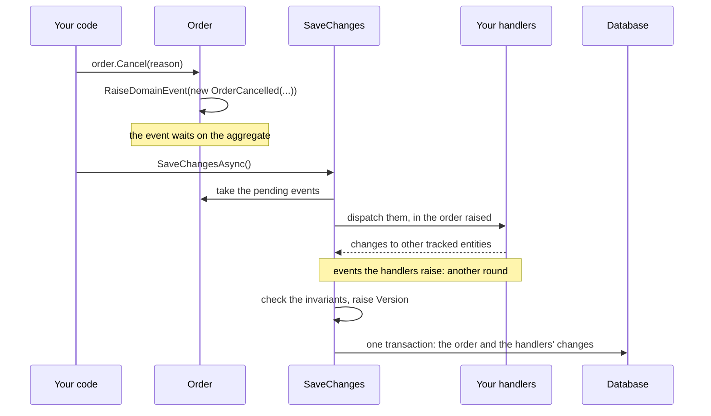
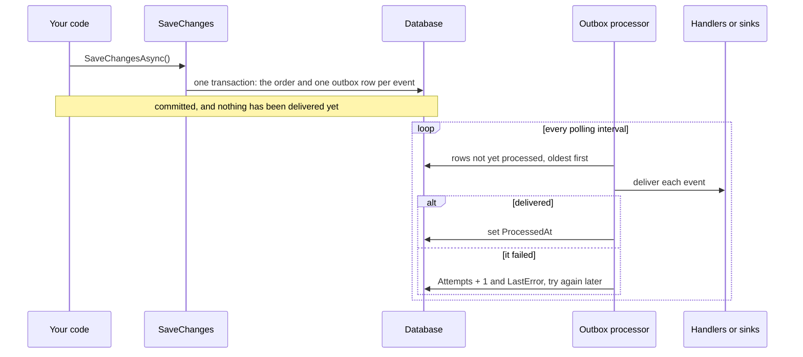

# Delivering domain events

A raised domain event is a promise that something will happen. An order was placed, so a confirmation
goes out, stock is reserved and a van is booked. Raising the event only puts it on the aggregate;
nothing has happened yet. The question this page answers is when the promised thing does happen:
inside the save, in the same transaction as the aggregate, or after it, from a record that survives a
crash.

`DDDToolkit.EntityFramework` offers one mode for each answer. In-process dispatch runs your handlers
while `SaveChanges` runs. The outbox writes the events to a table in the same transaction and delivers
them afterwards. Configure exactly one for production. If you configure neither, an aggregate that
raised events refuses to save rather than lose them; see
[When no delivery mode is configured](#when-no-delivery-mode-is-configured).

Both modes keep the event inside this process. To send it somewhere else, add a sink to the outbox:
that is a third destination and a separate page, [Integration events](integration-events.md).

This page assumes a context wired up as in [Entity Framework](entity-framework.md#wiring-it-up).

## Choosing

In process, the handlers run inside the save. Whatever they change on the same context is written with
the aggregate, in one transaction, and a handler that throws stops the save:



<details>
<summary>Show the code: dispatching in process</summary>

Register the toolkit with Mediator as the dispatcher, and add the toolkit to the context:

```csharp
builder.Services.AddMediator(options => options.ServiceLifetime = ServiceLifetime.Scoped);
builder.Services.AddDDDToolkitEntityFramework(options => options.DispatchWithMediator());

builder.Services.AddDbContext<OrderingContext>((services, options) => options
    .UseNpgsql(connectionString)
    .UseDDDToolkit(services));
```

The event is a Mediator notification, and a handler is an ordinary Mediator handler. It runs in the
saving context's scope, so what it changes on that context is saved with the order:

```csharp
[DomainEventName("ordering.order-cancelled")]
public sealed record OrderCancelled(OrderId OrderId, string Reason) : DomainEvent, INotification;

public sealed class OrderLog(ILogger<OrderLog> logger) : INotificationHandler<OrderCancelled>
{
    public ValueTask Handle(OrderCancelled notification, CancellationToken cancellationToken)
    {
        logger.LogInformation("Order {OrderId} was cancelled: {Reason}", notification.OrderId, notification.Reason);
        return default;
    }
}
```

*[`Ordering/Application/Orders/DomainEvents/OrderLog.cs`](../Examples/Modules/Ordering/DDDToolkit.Examples.Ordering/Application/Orders/DomainEvents/OrderLog.cs)*

See [In-process dispatch](#in-process-dispatch).

</details>

Through the outbox, the save only writes the events down, next to the aggregate. Delivering them is a
separate step that comes after the commit, and keeps trying until it succeeds:



<details>
<summary>Show the code: the outbox</summary>

Map the outbox table in the context:

```csharp
protected override void OnModelCreating(ModelBuilder modelBuilder)
    => modelBuilder.AddDomainEventOutbox(Database);
```

Turn the outbox on, and run the processor that delivers from it:

```csharp
builder.Services.AddDDDToolkitEntityFramework(options =>
{
    options.DispatchWithMediator();   // where the processor delivers to
    options.UseOutbox(outbox => outbox.RegisterEventsFromAssemblyContaining<Program>());
});

builder.Services.AddOutboxBackgroundService<OrderingContext>(TimeSpan.FromSeconds(2));
```

The handlers are the same as in process. They must be idempotent, because a crash between delivering
and marking the row delivers it again. See [The outbox](#the-outbox).

</details>

| | In-process | Outbox |
|---|---|---|
| When handlers run | Inside `SaveChanges`, before the write | After the commit, on the processor |
| Survives a crash | No | Yes |
| Handler failure | Aborts the save | Recorded on the row, retried |
| Delivery | Best-effort, at most once | At-least-once |
| Handlers must be idempotent | No | Yes |
| Extra table | No | Yes |
| Extra moving part | No | A processor or background service |

Use in-process dispatch for side effects inside the same database, where the transaction is the
guarantee you want. Use the outbox for anything that leaves the process, and give it a sink to leave
through.

Nothing stops you from mapping the outbox table from the start and switching later. The example
context does exactly that, so moving from one mode to the other is a change in the registration with
no schema change.

## In-process dispatch

With `DispatchInProcess` and no outbox, handlers run inside `SaveChanges`, before the database is
written. Whichever way you hand the events to your handlers, that gives you three things:

- Anything a handler changes on the same `DbContext` rides the same save, and therefore the same
  transaction. The interceptor calls `DetectChanges` after each round so those changes are seen.
- A throwing handler aborts the save. Nothing is written.
- New events raised by handlers on tracked aggregates are dispatched in a further round.

What you do not get is durability. Delivery is best-effort. The events are dequeued from the
aggregate before dispatch, so once a handler has them they exist only in memory: if the save then
fails, the events are gone. Nothing survives a process crash. And a handler that talks to the outside
world has already sent the mail or made the HTTP call by the time a later failure rolls the
transaction back.

Do not call `SaveChanges` from a handler in this mode. The save is already in progress and it will
pick your changes up.

The events reach your handlers through a delegate. `DDDToolkit.Mediator` writes it for you; you can
also write it yourself.

### The short way: `DispatchWithMediator()`

`DDDToolkit.Mediator` writes the delegate for you, against
[Mediator](https://github.com/martinothamar/Mediator):

```bash
dotnet add package DDDToolkit.Mediator
```

```csharp
using DDDToolkit.Mediator;

builder.Services.AddMediator(options => options.ServiceLifetime = ServiceLifetime.Scoped);
builder.Services.AddDDDToolkitEntityFramework(options => options.DispatchWithMediator());
```

It resolves `IPublisher` from the scope that owns the saving `DbContext` and publishes each event in
the order it was raised, awaiting one before starting the next. That is the delegate below plus a
check that each event is publishable at all, so it serves both delivery modes: add `UseOutbox` and the
processor delivers through the same call.

Three things are worth knowing before you reach for it.

**Your events have to implement `Mediator.INotification`.** Mediator cannot publish anything else. One
marker interface for the whole solution is the usual way to say it once:

```csharp
public interface IOrderingEvent : IDomainEvent, INotification;
```

An event that does not implement it makes the dispatch throw, naming the event type. It is not
skipped. By the time the delegate runs the interceptor has already dequeued the event from the
aggregate, so skipping would destroy it with no row, no log and nothing to retry.

**Register Mediator as scoped when handlers touch the `DbContext`.** Mediator registers every handler
as a singleton by default, and a singleton cannot depend on a scoped service. The lifetime is read off
your `AddMediator` call at compile time, so it has to be written there; setting it any other way
throws at start-up.

**Keep `Mediator.SourceGenerator` in your composition root.** Mediator generates its implementation
and `AddMediator` into whichever assembly the generator runs in, so reference the generator from the
project that builds the container and from nowhere else. Handlers in other projects are still
discovered, as long as those projects are referenced. `DDDToolkit.Mediator` itself references only
`Mediator.Abstractions`, so it adds no generator to your domain projects.

Mediator also reports `MSG0005` at build time for a notification that no handler handles. That is
usually the mistake it looks like, but an event you deliberately leave unhandled needs the warning
suppressed.

### The delegate

`DispatchWithMediator()` is a convenience. The toolkit core has no mediator dependency and is not
getting one: in-process delivery is a delegate, and you can write it against any library or none.

Both modes deliver through the same delegate, so handlers are written once:

```csharp
Func<IServiceProvider, IReadOnlyList<IDomainEvent>, CancellationToken, Task>
```

The provider is the scope that owns the saving `DbContext`, and the events arrive in the order they
were raised. Written against Mediator's `IPublisher`, it looks like this:

```csharp
builder.Services.AddDDDToolkitEntityFramework(options =>
{
    options.DispatchInProcess(async (services, events, cancellationToken) =>
    {
        var publisher = services.GetRequiredService<IPublisher>();
        foreach (var domainEvent in events)
        {
            await publisher.Publish(domainEvent, cancellationToken);
        }
    });
});
```

There is one delegate per process. A second `DispatchInProcess` or `DispatchWithMediator()` throws
rather than replace the first.

## The outbox

With `UseOutbox`, nothing is dispatched at save time. Instead one row per event is added to the
saving context, so the events commit atomically with the aggregate, and a separate processor delivers
them afterwards through the same dispatch delegate.

```csharp
builder.Services.AddDDDToolkitEntityFramework(options =>
{
    options.DispatchWithMediator();   // or your own DispatchInProcess(...) delegate
    options.UseOutbox(outbox => outbox.RegisterEventsFromAssemblyContaining<Program>());
});

builder.Services.AddOutboxBackgroundService<OrderingContext>(TimeSpan.FromSeconds(2));
```

The rows need a table in the context's model: `modelBuilder.AddDomainEventOutbox(Database)` in
`OnModelCreating`, described under [The table](#the-table). A save with an outbox configured and no
table mapped throws, naming the context.

An event is never lost and never published for a transaction that rolled back. Rolling back the
aggregate rolls back its events, because they are rows in the same transaction.

The cost is at-least-once delivery. A message is marked processed only after its handlers returned,
so a crash in between redelivers it. Handlers must be idempotent, keyed on `EventId`.

Written this way the outbox is durable but still in-process: the processor hands the event back to the
same delegate. Add a sink and the row leaves the process instead:

```csharp
options.UseOutbox(outbox =>
{
    outbox.RegisterEventsFromAssemblyContaining<Program>();
    outbox.SendTo<ServiceBusSink>();
});
```

`outbox.AlsoDispatchInProcess = true` asks for both; see
[Which delivery wins](integration-events.md#which-delivery-wins). Sinks, the published contract that is
not your domain event, and the inbox that makes at-least-once delivery safe to consume are all on
[Integration events](integration-events.md).

## The outbox in detail

### The table

Map it in `OnModelCreating`:

```csharp
protected override void OnModelCreating(ModelBuilder modelBuilder)
{
    modelBuilder.AddDomainEventOutbox(Database);
}
```

`Database` is the context's own property. The method reads one thing from it, the provider name, which
is what lets the timestamp columns be the right shape for the database you are actually on. See
[Timestamps](#timestamps) below.

The table is `ddd.OutboxMessages` by default. The method takes `tableName` and `schema` if you want
something else, and `schema: null` puts it in the provider's default schema. SQLite has no schemas and
ignores the argument, so the table is plain `OutboxMessages` there. The mapping sets a primary key on
`Id`, an index on `ProcessedAt`, and the lengths below.

| Column | Type | Meaning |
|---|---|---|
| `Id` | `Guid`, key, never generated | The event's `EventId`. This is the idempotency key |
| `EventName` | `string`, required, 256 | The stable name, from `[DomainEventName]` or the convention, `ordering.order-placed` |
| `Payload` | `string`, required | The event serialized with System.Text.Json |
| `Version` | `int` | The shape the payload was written in, 1 unless the event type says otherwise; see [The outbox reading its own old rows](integration-events.md#the-outbox-reading-its-own-old-rows) |
| `OccurredAt` | `DateTimeOffset` | Taken from the event |
| `AggregateType` | `string?`, 512 | CLR type name of the aggregate that raised it |
| `AggregateId` | `string?`, 256 | The aggregate's key as text, parts joined with `\|` |
| `CreatedAt` | `DateTimeOffset` | When the row was written |
| `ProcessedAt` | `DateTimeOffset?` | When the handlers succeeded, `null` while pending |
| `Attempts` | `int` | How often delivery was attempted |
| `LastError` | `string?`, 4000 | Type and message of the last failure |

`CreatedAt` comes from `options.TimeProvider`, which defaults to `TimeProvider.System` and can be
replaced in tests.

Payloads are written with System.Text.Json through `outbox.JsonOptions`, which by default are
case-insensitive on read and carry the toolkit's `SingleValueObjectConverterFactory`, so identifiers
and single value objects are stored as their raw values rather than as objects. The same options read
the payload back, so change them with care once messages exist.

### Timestamps

`OccurredAt`, `CreatedAt` and `ProcessedAt` are `DateTimeOffset` in the model. What they become in the
database depends on the provider, and you can say otherwise:

```csharp
// The provider's own instant type.
modelBuilder.AddDomainEventOutbox(Database);

// A UTC DateTime column, on every provider.
modelBuilder.AddDomainEventOutbox(Database, timestamps: DomainEventTimestamps.UtcDateTime);
```

| Provider | `ProviderDefault` | `UtcDateTime` |
|---|---|---|
| PostgreSQL | `timestamp with time zone` | `timestamp with time zone` |
| SQL Server | `datetimeoffset` | `datetime2` |
| SQLite | UTC `DateTime` as text | UTC `DateTime` as text |

The one thing the outbox needs from these columns is that they sort as instants, because the processor
reads pending messages oldest first. SQLite stores a `DateTimeOffset` as text and refuses to order by
one, so on SQLite the toolkit converts to a UTC `DateTime` whatever you ask for. Every other provider
has an instant type that orders correctly, and gets it.

Whichever column it lands in, the value is normalized to UTC on the way in. Write a `DateTimeOffset`
that carries `+02:00` and the row holds the same instant with an offset of zero, and reads back that
way. That makes the two shapes interchangeable in meaning, and it is also what keeps Npgsql happy:
PostgreSQL refuses a `DateTimeOffset` whose offset is not zero.

`AddDomainEventInbox` takes the same argument for its own `ProcessedAt`. Pass both the same thing.

If you write migrations by hand, `CreateDomainEventOutbox` and `CreateDomainEventInbox` take
`timestamps` too and default to the same `ProviderDefault`. They read `MigrationBuilder.ActiveProvider`,
so the hand-written table and the scaffolded one agree.

A database created by an earlier 3.0 build may have the older column type on SQL Server; see
[From an earlier 3.0 build](migrating-to-3.md#from-an-earlier-30-build) before upgrading one.

### Registering event types

The row stores a name, so the processor needs a name-to-type map:

```csharp
options.UseOutbox(outbox =>
{
    outbox.RegisterEventsFromAssemblyContaining<Program>();
    outbox.RegisterEventsFromAssembly(typeof(OrderPlaced).Assembly);
    outbox.RegisterEvent<OrderCancelled>();
});
```

The three calls are additive, so use whichever suits; most applications need only the first. The
assembly scans register every concrete type implementing `IDomainEvent`. Registering two types
under the same stable name throws an `ArgumentException` naming both, which is the failure you want
at start-up rather than at delivery time.

This is where a stable name earns its keep. The name is written into the row and read back later, so it
must not change while rows are waiting. The conventional name, the module and the class name in kebab
case, does not change when the class moves; when the class is renamed, `[DomainEventName]` keeps the old
one. See [Stable names](domain-events.md#stable-names).

The compiler can write this registration for you. With the Entity Framework package referenced, every
assembly gets an `Add{Module}IntegrationEvents()` that registers each of its domain events under the
name it is stored as, worked out at compile time, so nothing is scanned at start-up:

```csharp
[assembly: Module("Ordering")]

[DomainEventName("ordering.order-received")]   // renamed from OrderReceived; rows keep the old name
public sealed record OrderPlaced(OrderId Order) : DomainEvent;

public sealed record OrderCancelled(OrderId Order) : DomainEvent;
```

```csharp title="IntegrationEventExtensions.g.cs, shortened"
public static OutboxOptions AddOrderingIntegrationEvents(this OutboxOptions outbox)
{
    ArgumentNullException.ThrowIfNull(outbox);
    outbox.RegisterEvent<OrderCancelled>("ordering.order-cancelled", 1);
    outbox.RegisterEvent<OrderPlaced>("ordering.order-received", 1);
    return outbox;
}
```

`OrderPlaced` goes into the row under its pinned name and `OrderCancelled` under the conventional one. Call
`outbox.AddOrderingIntegrationEvents()` in place of the assembly scan. The same method registers what a
module publishes, which [Integration events](integration-events.md#registered-when-the-module-compiles)
covers.

An event name nobody registered is not fatal. The processor records the failure on the row, with a
`LastError` that names the missing event and the registration call, increments `Attempts`, leaves
`ProcessedAt` null and carries on with the rest of the batch. Register the type and the next run
delivers the row.

### Running the processor

For a hosted application, the background service:

```csharp
builder.Services.AddOutboxBackgroundService<OrderingContext>(
    pollingInterval: TimeSpan.FromSeconds(2),
    batchSize: 100);
```

It registers the processor, the polling options and the hosted service. On each tick it drains the
outbox batch after batch until a batch delivers nothing, each batch in its own service scope so the
processor and the handlers get a fresh context. A failure in a tick is logged and the next tick tries
again.

To drive it yourself, from a job scheduler or a test, register the processor alone:

```csharp
builder.Services.AddOutboxProcessor<OrderingContext>();
```

```csharp
var processor = scope.ServiceProvider.GetRequiredService<OutboxProcessor<OrderingContext>>();
var delivered = await processor.ProcessPendingAsync(batchSize: 100, cancellationToken);
```

`ProcessPendingAsync` loads pending messages oldest first, by `CreatedAt`, then `OccurredAt`, then
`Id`, delivers each one on its own, and returns how many were delivered successfully. The processor
throws at construction if the outbox is not enabled, or if it has neither a sink nor a dispatch
delegate to deliver through.

Each message is saved through the same scoped context, so a handler that resolves that context and
changes an aggregate commits its change together with the processed mark. Events raised by that
change become new outbox rows.

### Failures, retries and poison messages

A handler that throws does not stop the batch. The exception type and message are written to
`LastError`, truncated at 4000 characters, `Attempts` is incremented, `ProcessedAt` stays null, and
the processor moves to the next message. A later run retries it, and on success `LastError` is
cleared.

`MaxAttempts` defaults to 10. Messages that reached it are no longer loaded:

```csharp
options.UseOutbox(outbox => outbox.MaxAttempts = 5);
```

They stay in the table with their last error for you to inspect. Reset `Attempts` to retry one.

Delivered rows stay too, until something deletes them. `services.AddDomainEventRetention<TContext>(...)`
deletes them once they are older than a window you choose, and never touches a row that was not
delivered. See [Keeping the tables small](integration-events.md#keeping-the-tables-small).

Note that a batch in which every message fails returns zero, which ends the background service's
drain for that tick. The next tick picks the messages up again.

### An outbox per context

`UseOutbox(...)` configures one outbox shared by every context. With a context per module, give each
producing module an outbox of its own, registered by that module:

```csharp
services.AddDDDToolkitEntityFramework(options => options.UseOutbox<OrderingContext>(outbox =>
{
    outbox.RegisterEventsFromAssemblyContaining<Order>();
    outbox.SendToModules();
}));

services.AddOutboxBackgroundService<OrderingContext>(TimeSpan.FromSeconds(2));
```

That works because `AddDDDToolkitEntityFramework` can be called as often as you like. The first call
registers everything, and every call configures the one options object the process has. That is what
lets each module of a modular monolith register its own part next to its own context: its outbox with
`options.UseOutbox<TContext>(...)`, the contracts it reads with `options.MapIntegrationEvents(...)`.
The host keeps what is process-wide, such as `DispatchWithMediator()`. The dispatch delegate can only
be set once; a second call throws instead of quietly handing one module's events to another module's
publisher. See
[Integration events](integration-events.md#the-common-case-another-module-in-this-process) for the
module registration end to end.

A context uses its own outbox when it has one, the shared one when it has not, and none at all when
neither exists: its events are then dispatched in process at save time, as if the outbox were not there.
`options.OutboxFor(typeof(TContext))` says which of the three applies. A processor for a context without
an outbox refuses to start and names the context.

### Honest limits

- **Ordering is best-effort.** Messages are loaded oldest first, but a failed message is retried
  later than messages written after it, so delivery order is not the order of writing.
- **Concurrent processors can double-deliver.** The processor takes no lock, so two instances polling
  the same table may both pick up the same row. Combined with the crash window before
  `ProcessedAt` is written, that is the at-least-once guarantee: handlers must be idempotent, keyed
  on `EventId`, which is `OutboxMessage.Id`.
- **Delivery is not immediate.** It happens on the next poll, not at commit.
- **Two sinks share one row.** When a message goes to more than one sink and one of them refuses, the
  message as a whole is retried and the sinks that accepted it see it again. See
  [Integration events](integration-events.md#when-one-sink-fails-and-another-does-not).

`Tests/DDDToolkit.EntityFramework.Tests/OutboxTests.cs` exercises the transactional write, the
retries, `MaxAttempts`, unknown event names and the background service.

## The dispatch loop

Both modes run through the same loop in `PublishDomainEventsInterceptor`, once per `SaveChanges`:

1. Dequeue the pending events of every tracked aggregate. If there are none, stop.
2. In outbox mode, add a row per event and go back to step 1.
3. Otherwise call the dispatch delegate with the whole batch, then call `DetectChanges`, then go back
   to step 1.

The loop exists because a handler may change a tracked aggregate, which may raise a further event.
`MaxDispatchRounds` caps it at 10 by default. If a further batch of events appears after that many
rounds, `SaveChanges` throws an `InvalidOperationException` naming the events still pending and
suggesting either a handler that triggers itself or a higher limit:

```csharp
options.MaxDispatchRounds = 20;
```

## When no delivery mode is configured

If an aggregate has pending events and neither `DispatchInProcess` nor `UseOutbox` was called,
`SaveChanges` throws rather than dropping the events. The message names the aggregate types involved
and both calls that would fix it. A save with no pending events needs no delivery mode, so a context
that only writes aggregates which raise nothing works out of the box.

## Prefer `SaveChangesAsync`

The dispatch delegate is asynchronous. Synchronous `SaveChanges` therefore blocks on it. That is safe
in console applications and in ASP.NET Core, which have no synchronization context, but it can
deadlock under a UI or legacy ASP.NET synchronization context. Both overloads are otherwise
identical: events are dispatched before the write either way.

## Why Mediator and not MediatR

MediatR did this job for the first two major versions of the toolkit and does it well. From version 13
it is commercially licensed. This repository prefers dependencies its users can take for free, so the
examples and `DDDToolkit.Mediator` target Mediator, which is MIT and source generated rather than
reflection based. Nothing here stops you using MediatR: write [the delegate](#the-delegate) and it
publishes through `IPublisher` exactly as it always did.

## Where to look next

- [Entity Framework](entity-framework.md) for the registration, the mapping and the other interceptors.
- [Domain events](domain-events.md) for raising events and giving them stable names.
- [Integration events](integration-events.md) for sinks, published contracts and the inbox.
- [Invariants](invariants.md#at-the-save) for the check that runs after the handlers, before the write.
