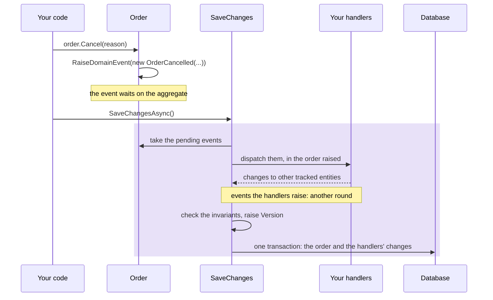
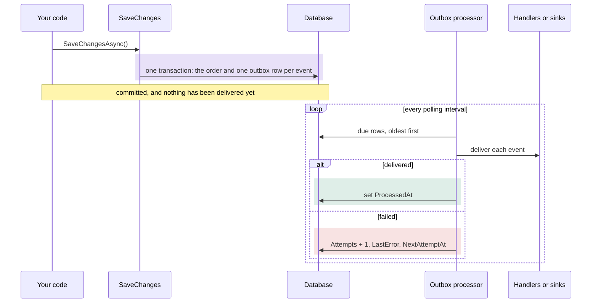

# Delivering domain events

Raising a domain event puts the event on the aggregate, and nothing else happens yet. An `OrderPlaced` event means
that a confirmation goes out, stock is reserved and a van is booked, but only once the event is delivered. This page
covers when delivery happens: inside the save, in the aggregate's transaction, or after the save, from a stored row
that survives a crash.

`DDDToolkit.EntityFramework` has one mode for each:

- **In-process dispatch** runs your handlers while `SaveChanges` runs.
- **The outbox** writes the events to a table in the same transaction, and delivers them afterwards.

Configure one of the two modes for production. If you configure neither, an aggregate that raised events refuses to
save, so no event is lost. See [When no delivery mode is configured](#when-no-delivery-mode-is-configured).

Both modes keep the event inside this process. To send the event to another process, add a sink to the outbox.
[Integration events](integration-events.md) covers sinks.

This page assumes a context set up as in [Entity Framework](entity-framework.md#setting-up-a-context).

## Choosing a delivery mode

In process, the handlers run inside the save. The changes that they make on the same context are written with the
aggregate, in one transaction. A handler that throws stops the save.

The diagram shows in-process dispatch. Purple: the steps inside `SaveChanges`, which all end in one transaction.


```mermaid
sequenceDiagram
    participant Code as Your code
    participant Order as Order
    participant Save as SaveChanges
    participant Handlers as Your handlers
    participant Db as Database

    Code->>Order: order.Cancel(reason)
    Order->>Order: RaiseDomainEvent(new OrderCancelled(...))
    Note over Order: the event waits on the aggregate
    Code->>Save: SaveChangesAsync()
    rect rgba(91, 46, 201, 0.14)
        Save->>Order: take the pending events
        Save->>Handlers: dispatch them, in the order raised
        Handlers-->>Save: changes to other tracked entities
        Note over Save,Handlers: events the handlers raise: another round
        Save->>Save: check the invariants, raise Version
        Save->>Db: one transaction: the order and the handlers' changes
    end
```

<details>
<summary>Show the code: dispatching in process</summary>

Register the toolkit with Mediator as the dispatcher, and add the toolkit to the context:

```csharp
builder.Services.AddMediator(options => options.ServiceLifetime = ServiceLifetime.Scoped);
builder.Services.AddDDDToolkitEntityFramework(options => options.DispatchWithMediator());

builder.Services.AddDbContext<OrderingContext>((services, options) => options
    .UseNpgsql(connectionString)
    .UseDDDToolkit(services));
```

The event is a Mediator notification, and a handler is an ordinary Mediator handler. The handler runs in the scope of
the saving context, so its changes on that context are saved with the order:

**[`Ordering/Application/Orders/DomainEvents/OrderLog.cs`](../Examples/Modules/Ordering/Examples.Webshop.Ordering/Application/Orders/DomainEvents/OrderLog.cs)**

```csharp
[DomainEventName("ordering.order-cancelled")]
public sealed record OrderCancelled(OrderId OrderId, string Reason) : DomainEvent, INotification;

public sealed class OrderLog(ILogger<OrderLog> logger) : INotificationHandler<OrderCancelled>
{
    public ValueTask Handle(OrderCancelled notification, CancellationToken cancellationToken)
    {
        logger.LogInformation("Order {OrderId} was cancelled: {Reason}", notification.OrderId, notification.Reason);
        return default;
    }
}
```

See [In-process dispatch](#in-process-dispatch).

</details>

With the outbox, the save only writes the events, next to the aggregate. Delivery is a separate step after the
commit. The processor retries a failed delivery until it succeeds or reaches `MaxAttempts`.

The diagram shows the outbox. Purple: the save's one transaction. Green: a delivered event. Red: a failed delivery.


```mermaid
sequenceDiagram
    participant Code as Your code
    participant Save as SaveChanges
    participant Db as Database
    participant Processor as Outbox processor
    participant Target as Handlers or sinks

    Code->>Save: SaveChangesAsync()
    rect rgba(91, 46, 201, 0.14)
        Save->>Db: one transaction: the order and one outbox row per event
    end
    Note over Code,Db: committed, and nothing has been delivered yet
    loop every polling interval
        Processor->>Db: due rows, oldest first
        Processor->>Target: deliver each event
        alt delivered
            rect rgba(31, 138, 91, 0.14)
                Processor->>Db: set ProcessedAt
            end
        else failed
            rect rgba(201, 60, 60, 0.14)
                Processor->>Db: Attempts + 1, LastError, NextAttemptAt
            end
        end
    end
```

<details>
<summary>Show the code: the outbox</summary>

Map the outbox table in the context:

```csharp
protected override void OnModelCreating(ModelBuilder modelBuilder)
    => modelBuilder.AddDomainEventOutbox(Database);
```

Turn the outbox on, and run the processor that delivers from it:

```csharp
builder.Services.AddDDDToolkitEntityFramework(options =>
{
    options.DispatchWithMediator();   // where the processor delivers to
    options.UseOutbox(outbox => outbox.RegisterEventsFromAssemblyContaining<Program>());
});

builder.Services.AddOutboxBackgroundService<OrderingContext>(TimeSpan.FromSeconds(2));
```

The handlers are the same as in process. They must be idempotent, because a crash between the delivery and the mark
delivers the event again. See [The outbox](#the-outbox).

</details>

| | In-process | Outbox |
|---|---|---|
| When handlers run | Inside `SaveChanges`, before the write | After the commit, on the processor |
| Survives a crash | No | Yes |
| Handler failure | Aborts the save | Recorded on the row, retried |
| Delivery | Best-effort, at most once | At least once |
| Handlers must be idempotent | No | Yes |
| Extra table | No | Yes |
| Extra moving part | No | A processor or background service |

Use in-process dispatch for side effects in the same database, where the transaction gives the guarantee you need.
Use the outbox for everything that leaves the process, and give the outbox a sink for it.

You can map the outbox table from the start and switch modes later. The example context does this. A switch of mode
then changes only the registration, and the database schema stays the same.

## In-process dispatch

With `DispatchInProcess` and no outbox, handlers run inside `SaveChanges`, before the database write. With any
delegate that passes the events to your handlers, you get three things:

- The changes that a handler makes on the same `DbContext` are part of the same save, and so of the same
  transaction. The interceptor calls `DetectChanges` after each round, so it sees those changes.
- A handler that throws aborts the save. Nothing is written.
- Events that handlers raise on tracked aggregates are dispatched in a further round.

You do not get durability. Delivery is best-effort:

- The interceptor takes the events off the aggregate before dispatch. Once a handler has them, the events exist
  only in memory. If the save then fails, the events are lost.
- Nothing survives a process crash.
- A handler that talks to the outside world has already sent the e-mail or made the HTTP call when a later failure
  rolls the transaction back.

Do not call `SaveChanges` from a handler in this mode. The save is already running and includes your changes.

When the saving context comes from a context pool, the handlers run in the scope that rented the context. That is
the scope that asked for the context, with `AddScopedFromPool`, or the scope that you named with `BindToScope`. A
pooled context without a scope is refused before any event is taken off the aggregate. The outbox needs no scope, so
a save that only writes outbox rows works from any pooled context. See
[Contexts from a pool](entity-framework.md#contexts-from-a-pool).

The events reach your handlers through a delegate. `DDDToolkit.Mediator` writes the delegate for you, or you can
write it yourself.

### Dispatching with Mediator

`DDDToolkit.Mediator` writes the delegate against [Mediator](https://github.com/martinothamar/Mediator):

```bash
dotnet add package Temp.DDDToolkit.Mediator --prerelease
```

```csharp
using DDDToolkit.Mediator;

builder.Services.AddMediator(options => options.ServiceLifetime = ServiceLifetime.Scoped);
builder.Services.AddDDDToolkitEntityFramework(options => options.DispatchWithMediator());
```

`DispatchWithMediator()` resolves `IPublisher` from the scope that owns the saving `DbContext`. It publishes each
event in the order raised, and awaits each event before it starts the next one. That is the delegate below, plus a
check that each event can be published. The call serves both delivery modes. Add `UseOutbox`, and the processor
delivers through the same call.

Three rules apply:

**Your events must implement `Mediator.INotification`.** Mediator cannot publish anything else. One marker interface
for the whole solution is the usual way to add it once:

```csharp
public interface IOrderingEvent : IDomainEvent, INotification;
```

An event that does not implement `INotification` makes the dispatch throw, and the message names the event type.
The dispatch does not skip the event. When the delegate runs, the interceptor has already taken the event off the
aggregate. Skipping the event would destroy it, with no row, no log and nothing to retry.

**Register Mediator as scoped when handlers use the `DbContext`.** By default Mediator registers every handler as a
singleton, and a singleton cannot depend on a scoped service. Mediator reads the lifetime from your `AddMediator`
call at compile time, so set the lifetime there. Setting it in any other way throws at start-up.

**Reference `Mediator.SourceGenerator` from your composition root only.** Mediator generates its implementation and
`AddMediator` into the assembly that runs the generator. Reference the generator from the project that builds the
container, and from no other project. Handlers in other projects are still found, as long as the composition root
references those projects. `DDDToolkit.Mediator` references only `Mediator.Abstractions`, so it adds no generator to
your domain projects.

Mediator also reports `MSG0005` at build time for a notification without a handler. That warning usually points to a
real mistake. For an event that you leave unhandled on purpose, suppress the warning.

### The dispatch delegate

`DispatchWithMediator()` is a convenience. The toolkit's core has no mediator dependency and will not get one.
In-process delivery is a delegate, and you can write it against any library, or none.

Both modes deliver through the same delegate, so you write the handlers once:

```csharp
Func<IServiceProvider, IReadOnlyList<IDomainEvent>, CancellationToken, Task>
```

The provider is the scope that owns the saving `DbContext`. The events arrive in the order raised. Written against
Mediator's `IPublisher`, the delegate looks like this:

```csharp
builder.Services.AddDDDToolkitEntityFramework(options =>
{
    options.DispatchInProcess(async (services, events, cancellationToken) =>
    {
        var publisher = services.GetRequiredService<IPublisher>();
        foreach (var domainEvent in events)
        {
            await publisher.Publish(domainEvent, cancellationToken);
        }
    });
});
```

A process has one delegate. A second `DispatchInProcess` or `DispatchWithMediator()` call throws, and does not
replace the first delegate.

## The outbox

With `UseOutbox`, nothing is dispatched at save time. The save adds one row per event to the saving context, so the
events commit atomically with the aggregate. A separate processor delivers them afterwards, through the same dispatch
delegate.

```csharp
builder.Services.AddDDDToolkitEntityFramework(options =>
{
    options.DispatchWithMediator();   // or your own DispatchInProcess(...) delegate
    options.UseOutbox(outbox => outbox.RegisterEventsFromAssemblyContaining<Program>());
});

builder.Services.AddOutboxBackgroundService<OrderingContext>(TimeSpan.FromSeconds(2));
```

The rows need a table in the context's model: `modelBuilder.AddDomainEventOutbox(Database)` in `OnModelCreating`
([The table](#the-table)). A save with an outbox configured and no table mapped throws, and the message names the
context.

An event is never lost, and never published for a transaction that rolled back. The events are rows in the
aggregate's transaction, so a rollback of the aggregate also rolls back its events.

The cost is at-least-once delivery. The processor marks a message processed only after its handlers returned, so a
crash in between delivers the message again. Handlers must be idempotent, keyed on `EventId`.

With this configuration the outbox is durable and still in-process. The processor passes each event to the same
delegate. Add a sink, and the row leaves the process instead:

```csharp
options.UseOutbox(outbox =>
{
    outbox.RegisterEventsFromAssemblyContaining<Program>();
    outbox.SendTo<ServiceBusSink>();
});
```

`outbox.AlsoDispatchInProcess = true` does both. See [Which delivery wins](integration-events.md#sinks-and-in-process-dispatch-together).
[Integration events](integration-events.md) covers sinks, the published contract that differs from your domain
event, and the inbox that makes at-least-once delivery safe to consume.

## The outbox in detail

### The table

Map the table in `OnModelCreating`:

```csharp
protected override void OnModelCreating(ModelBuilder modelBuilder)
{
    modelBuilder.AddDomainEventOutbox(Database);
}
```

`Database` is the context's property. `AddDomainEventOutbox` reads one thing from it, the provider name. The method
uses the provider name to give the timestamp columns the right type for your database. See
[Timestamps](#timestamps) below.

The table is `ddd.OutboxMessages` by default. The method takes `tableName` and `schema` to change that.
`schema: null` puts the table in the provider's default schema. SQLite has no schemas and ignores the argument, so on
SQLite the table is `OutboxMessages`. The mapping sets a primary key on `Id`, an index on `ProcessedAt`, and the
lengths below.

| Column | Type | Meaning |
|---|---|---|
| `Id` | `Guid`, key, never generated | The event's `EventId`. This is the idempotency key |
| `EventName` | `string`, required, 256 | The stable name, from `[DomainEventName]` or the convention, such as `ordering.order-placed` |
| `Payload` | `string`, required | The event, serialized with System.Text.Json |
| `Version` | `int` | The shape that the payload was written in, 1 unless the event type says otherwise. See [The outbox reading its own old rows](integration-events.md#old-rows-in-the-outbox) |
| `OccurredAt` | `DateTimeOffset` | Taken from the event |
| `AggregateType` | `string?`, 512 | CLR type name of the aggregate that raised the event |
| `AggregateId` | `string?`, 256 | The aggregate's key as text, with the parts joined by `\|` |
| `CreatedAt` | `DateTimeOffset` | When the row was written |
| `ProcessedAt` | `DateTimeOffset?` | When the handlers succeeded. `null` while the message is pending |
| `Attempts` | `int` | How many deliveries were attempted |
| `NextAttemptAt` | `DateTimeOffset?` | When a failed message may be tried again. `null` when it is due now. See [Failures, retries and poison messages](#failures-retries-and-poison-messages) |
| `LastError` | `string?`, 4000 | Type and message of the last failure |

`CreatedAt` comes from `options.TimeProvider`, which defaults to `TimeProvider.System`. Tests can replace it. The
processor takes the current time from the same provider when it compares `NextAttemptAt`.

The index is on `ProcessedAt` only. `ProcessedAt` separates the few pending rows from the many delivered rows.
`NextAttemptAt` only divides the pending rows into due and waiting. The condition "`null`, or not after now" is not
one range that an index can seek. Adding `NextAttemptAt` to the index would therefore make the index bigger without
making the poll faster.

Payloads are written with System.Text.Json through `outbox.JsonOptions`. By default these options are
case-insensitive on read, and include the toolkit's `SingleValueObjectConverterFactory`. Identifiers and single
value objects are therefore stored as their raw values. The same options read the payload back, so change them with
care once messages exist.

### Timestamps

`OccurredAt`, `CreatedAt`, `ProcessedAt` and `NextAttemptAt` are `DateTimeOffset` in the model. Their database type
depends on the provider, and you can choose another type:

```csharp
// The provider's own instant type.
modelBuilder.AddDomainEventOutbox(Database);

// A UTC DateTime column, on every provider.
modelBuilder.AddDomainEventOutbox(Database, timestamps: DomainEventTimestamps.UtcDateTime);
```

| Provider | `ProviderDefault` | `UtcDateTime` |
|---|---|---|
| PostgreSQL | `timestamp with time zone` | `timestamp with time zone` |
| SQL Server | `datetimeoffset` | `datetime2` |
| SQLite | UTC `DateTime` as text | UTC `DateTime` as text |

The outbox needs these columns to sort as instants. The processor reads pending messages oldest first, and compares
`NextAttemptAt` with the current time. SQLite stores a `DateTimeOffset` as text, and cannot order by it or compare
it. On SQLite the toolkit therefore converts to a UTC `DateTime`, whatever you ask for. Every other provider has an
instant type that orders correctly, and uses that type.

In both column types, the value is converted to UTC when it is written. A `DateTimeOffset` with `+02:00` is stored as
the same instant with offset zero, and reads back that way. The two column types therefore hold the same instants.
Npgsql needs this conversion too, because PostgreSQL refuses a `DateTimeOffset` whose offset is not zero.

`AddDomainEventInbox` takes the same argument for its `ProcessedAt`. Pass the same value to both.

If you write migrations by hand, `CreateDomainEventOutbox` and `CreateDomainEventInbox` also take `timestamps`, and
default to `ProviderDefault`. They read `MigrationBuilder.ActiveProvider`, so a hand-written table matches a
scaffolded one.

A database created by an earlier 3.0 build may have the older column type on SQL Server. Read
[From an earlier 3.0 build](migrating-to-3.md#from-an-earlier-30-build) before you upgrade such a database.

### Registering event types

The row stores a name, so the processor needs a map from names to types:

```csharp
options.UseOutbox(outbox =>
{
    outbox.RegisterEventsFromAssemblyContaining<Program>();
    outbox.RegisterEventsFromAssembly(typeof(OrderPlaced).Assembly);
    outbox.RegisterEvent<OrderCancelled>();
});
```

The three calls add to each other, so use any of them. Most applications need only the first. An assembly scan
registers every concrete type that implements `IDomainEvent`. Registering two types under the same stable name
throws an `ArgumentException` that names both types. That failure happens at start-up, before any delivery.

The stable name matters here. The row stores the name, and the processor reads the name back later, so the name
must not change while rows wait. The conventional name is the module and the class name in kebab case. It does not
change when the class moves to another namespace. When you rename the class, `[DomainEventName]` keeps the old name.
See [Stable names](domain-events.md#stable-names).

The generator can write this registration. With the Entity Framework package referenced, every assembly gets an
`Add{Module}IntegrationEvents()` method. The method registers each domain event of the assembly under its stored
name. The generator computes the names at compile time, so nothing is scanned at start-up:

```csharp
[assembly: Module("Ordering")]

[DomainEventName("ordering.order-received")]   // renamed from OrderReceived; rows keep the old name
public sealed record OrderPlaced(OrderId Order) : DomainEvent;

public sealed record OrderCancelled(OrderId Order) : DomainEvent;
```

**`IntegrationEventExtensions.g.cs`**, shortened

```csharp
public static OutboxOptions AddOrderingIntegrationEvents(this OutboxOptions outbox)
{
    ArgumentNullException.ThrowIfNull(outbox);
    outbox.RegisterEvent<OrderCancelled>("ordering.order-cancelled", 1);
    outbox.RegisterEvent<OrderPlaced>("ordering.order-received", 1);
    return outbox;
}
```

`OrderPlaced` is stored under its pinned name, and `OrderCancelled` under the conventional name. Call
`outbox.AddOrderingIntegrationEvents()` instead of the assembly scan. The same method registers what a module
publishes ([Integration events](integration-events.md#the-generated-registration)).

A domain project without an Entity Framework reference gets no such method. The module's project that references
Entity Framework, the project that holds the outbox, registers the domain project's events in its own
`Add{Module}IntegrationEvents()`:

- The events get the same names, which the domain project's `[assembly: Module]` decides.
- Any project with the same module counts. A project that references Entity Framework registers its own events.
- The events must be `public`. An event that the registering project cannot see is left out, and the toolkit
  reports diagnostic [DDD00033](diagnostics.md#ddd00033).

See [A module in layers](modules.md#a-module-in-layers).

An event name that nobody registered does not stop the processor. The processor records the failure on the row.
`LastError` names the missing event and the registration call, `Attempts` increases, and `ProcessedAt` stays null.
The processor continues with the rest of the batch. Register the type, and the next attempt delivers the row.

### Running the processor

For a hosted application, use the background service:

```csharp
builder.Services.AddOutboxBackgroundService<OrderingContext>(
    pollingInterval: TimeSpan.FromSeconds(2),
    batchSize: 100);
```

`AddOutboxBackgroundService` registers the processor, the polling options and the hosted service. `batchSize`
defaults to 100. On each tick the service drains the outbox, batch after batch, until a batch delivers nothing. Each
batch runs in a new service scope, so the processor and the handlers get a new context. A failure in a tick is
logged, and the next tick tries again.

To run the processor yourself, from a job scheduler or a test, register the processor alone:

```csharp
builder.Services.AddOutboxProcessor<OrderingContext>();
```

```csharp
var processor = scope.ServiceProvider.GetRequiredService<OutboxProcessor<OrderingContext>>();
var delivered = await processor.ProcessPendingAsync(batchSize: 100, cancellationToken);
```

`ProcessPendingAsync` loads the pending messages that are due, oldest first, by `CreatedAt`, then `OccurredAt`, then
`Id`. It delivers each message separately, and returns the number of messages delivered successfully. The processor
throws when it is constructed if the outbox is not enabled, or if it has neither a sink nor a dispatch delegate.

Each message is saved through the same scoped context. A handler that resolves that context and changes an aggregate
commits its change together with the processed mark. Events that this change raises become new outbox rows.

### Failures, retries and poison messages

A handler that throws does not stop the batch. The processor then:

- writes the exception type and message to `LastError`, truncated at 4000 characters,
- increases `Attempts`,
- leaves `ProcessedAt` null,
- moves to the next message.

The message is retried later. On success, `LastError` is cleared.

A failed message is not retried at once. The processor writes to `NextAttemptAt` when the message may be tried
again, and loads only the messages that are due, still oldest first. The wait grows with every failure:

| After attempt | 1 | 2 | 3 | 4 and later |
|---|---|---|---|---|
| The message waits | 5 s | 25 s | 2 min 5 s | 10 min |

The wait has two effects:

- A message that keeps failing does not block the messages written after it. The next poll passes it.
- A sink that is down for a few seconds costs a message one attempt. A busy drain does not load the message again
  before its time.

`RetryDelay` sets the schedule. It receives the number of attempts so far, 1 after the first failure:

```csharp
options.UseOutbox(outbox => outbox.RetryDelay = attempts => TimeSpan.FromSeconds(30 * attempts));
```

`TimeSpan.Zero` retries on the next poll. `OutboxOptions.DefaultRetryDelay` is the default schedule, for a policy
that builds on it.

`MaxAttempts` defaults to 10. The processor no longer loads a message that reached it:

```csharp
options.UseOutbox(outbox => outbox.MaxAttempts = 5);
```

With both defaults, the processor gives up on a message that keeps failing about an hour after the first attempt.
The message stays in the table with its last error, for inspection, and with no `NextAttemptAt`. Reset `Attempts`,
and the next poll retries the message. To retry a message that is still waiting, set its `NextAttemptAt` to null.

Delivered rows also stay until something deletes them. `services.AddDomainEventRetention<TContext>(...)` deletes
delivered rows that are older than a window you choose, and never deletes a row that was not delivered. See
[Keeping the tables small](integration-events.md#keeping-the-tables-small).

A batch that delivers nothing ends the background service's drain for that tick, whether its messages failed or no
message was due. A sink that is down therefore gets one batch per tick, and not every message in a loop. The next
tick continues with the messages behind the failed ones, and with the failed messages whose time has come.

### An outbox per context

`UseOutbox(...)` configures one outbox for every context. With a context per module, give each module that produces
events its own outbox, registered by that module:

```csharp
services.AddDDDToolkitEntityFramework(options => options.UseOutbox<OrderingContext>(outbox =>
{
    outbox.RegisterEventsFromAssemblyContaining<Order>();
    outbox.SendToModules();
}));

services.AddOutboxBackgroundService<OrderingContext>(TimeSpan.FromSeconds(2));
```

This works because `AddDDDToolkitEntityFramework` can be called any number of times. The first call registers the
services, and every call configures the process's single options object. Each module of a modular monolith
therefore registers its part next to its context:

- its outbox, with `options.UseOutbox<TContext>(...)`,
- the contracts it reads, with `options.MapIntegrationEvents(...)`.

The host keeps the settings for the whole process, such as `DispatchWithMediator()`. The dispatch delegate can be
set only once. A second call throws, so one module's events cannot reach another module's publisher by accident.
[Integration events](integration-events.md#delivering-to-a-module-in-the-same-process) shows the module
registration from start to end.

A context uses its own outbox when it has one. Otherwise it uses the shared outbox. When neither exists, the context
has no outbox, and its events are dispatched in process at save time. `options.OutboxFor(typeof(TContext))` returns
which of the three applies. A processor for a context without an outbox refuses to start, and the message names the
context.

### Limits

- **The order is best-effort.** The processor loads messages oldest first. A failed message waits while later
  messages are delivered, so the delivery order can differ from the write order.
- **A waiting message waits for its time.** After a sink recovers, a message that failed during the outage is sent
  at its `NextAttemptAt`, up to 10 minutes later with the default schedule. The processor does not detect that the
  sink recovered. Set `NextAttemptAt` to null to send the waiting messages at once.
- **A slow failure takes its time.** The wait limits how often a failing message is tried. Each attempt still lasts
  as long as the sink takes to fail, and the processor delivers a batch one message at a time. A batch of 100
  messages that each wait for a 30-second timeout holds the processor for 50 minutes. Keep sink timeouts short, or
  batches small.
- **Concurrent processors can deliver a message twice.** The processor takes no lock, so two instances that poll the
  same table can pick up the same row. Together with the crash window before `ProcessedAt` is written, this makes
  delivery at-least-once. Handlers must be idempotent, keyed on `EventId`, which is `OutboxMessage.Id`.
- **Delivery is not immediate.** It happens on the next poll after the commit.
- **Two sinks share one row.** When a message goes to more than one sink and one sink refuses it, the whole message
  is retried, and the sinks that accepted it receive it again. See
  [Integration events](integration-events.md#when-one-sink-fails-and-another-does-not).

`Tests/DDDToolkit.EntityFramework.Tests/OutboxTests.cs` tests the transactional write, the retries, `MaxAttempts`,
unknown event names and the background service. `OutboxRetryTests.cs` next to it tests the wait between attempts.

## The dispatch loop

Both modes run through the same loop in `PublishDomainEventsInterceptor`, once per `SaveChanges`:

1. Take the pending events off every tracked aggregate. If there are none, stop.
2. In outbox mode, add a row per event and go back to step 1.
3. Otherwise, call the dispatch delegate with the whole batch, call `DetectChanges`, and go back to step 1.

The loop exists because a handler may change a tracked aggregate, and that change may raise another event.
`MaxDispatchRounds` limits the loop to 10 rounds by default. If another batch of events appears after that many
rounds, `SaveChanges` throws an `InvalidOperationException`. The message names the events that are still pending,
and suggests two causes, a handler that triggers itself or a limit that is too low. To raise the limit:

```csharp
options.MaxDispatchRounds = 20;
```

## When no delivery mode is configured

If an aggregate has pending events and neither `DispatchInProcess` nor `UseOutbox` was called, `SaveChanges` throws,
so the events are not dropped. The message names the aggregate types and both calls that fix the problem. A save
without pending events needs no delivery mode. A context whose aggregates raise no events therefore works without
one.

## Prefer `SaveChangesAsync`

The dispatch delegate is asynchronous, so a synchronous `SaveChanges` blocks on it. That is safe in console
applications and in ASP.NET Core, which have no synchronization context. Under a UI or legacy ASP.NET
synchronization context, the block can deadlock. Otherwise the two methods behave the same. Both dispatch the events
before the write.

## Why the toolkit uses Mediator

MediatR did this job for the first two major versions of the toolkit. From version 13, MediatR has a commercial
licence. This repository prefers dependencies without a licence fee. The examples and
`DDDToolkit.Mediator` therefore target Mediator, which is MIT-licensed and uses a source generator instead of
reflection. You can still use MediatR. Write [the dispatch delegate](#the-dispatch-delegate) and publish through
MediatR's `IPublisher`.

## Where to look next

- [Entity Framework](entity-framework.md) for the registration, the mapping and the other interceptors.
- [Domain events](domain-events.md) for raising events and giving them stable names.
- [Integration events](integration-events.md) for sinks, published contracts and the inbox.
- [Invariants](invariants.md#at-the-save) for the check that runs after the handlers, before the write.
