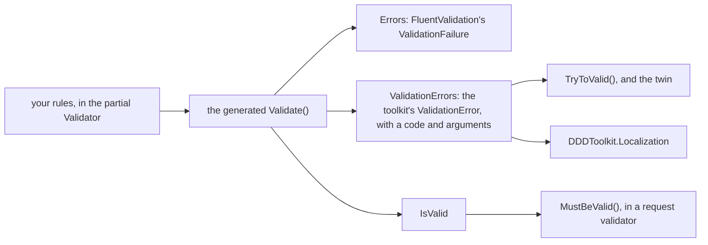

# FluentValidation

A value object carries its own rules; [Value objects](value-objects.md#validation) shows how to write
them by hand. If your team already writes rules with [FluentValidation](https://docs.fluentvalidation.net/),
there is no reason to stop at the value object. `DDDToolkit.FluentValidation` lets you write a value
object's rules as a FluentValidation validator, and lets a value object take part in the validator you
write for a command or a request.

There is nothing to register. A value object's validator is created where it is used, so no container
is involved, and the rest is extension methods.

```bash
dotnet add package DDDToolkit.FluentValidation
```

## A value object's rules

Reference the package and the generator gives every value object a nested `Validator`. You write the
other half, with the rules:

```csharp
[SingleValueObject<string>]
public partial record EmailAddress
{
    public static EmailAddress Create(string value) => new(value);

    partial class Validator
    {
        public Validator() => RuleFor(x => x.Value).EmailAddress();
    }
}
```

The generator writes the base class of that validator, the `Validate()` overrides that run it, and an
`Errors` collection with what it found:

```csharp title="EmailAddress.FluentValidation.g.cs, shortened"
partial record EmailAddress
{
    [Internal]
    [NotMapped]
    public ReadOnlyCollection<FluentValidation.Results.ValidationFailure> Errors => _errors.AsReadOnly();

    private List<FluentValidation.Results.ValidationFailure> _errors = new();

    protected override bool Validate()
    {
        var validator = new Validator();
        var result = validator.Validate(this);
        _errors = result.Errors;
        return result.IsValid;
    }

    protected override void Validate(ValidationErrorBuilder errors)
    {
        foreach (var failure in _errors)
        {
            // ... copies each failure, with its placeholder values as arguments, into a ValidationError
        }
    }

    partial class Validator : FluentValidation.AbstractValidator<EmailAddress>
    {
    }
}
```

The two halves of `Validator` are the point: the generator states the base class, you state the rules.
A value object with several properties is the same, with a rule per property:

```csharp
[ValueObject]
public partial record Address
{
    public Address(string street, string city, string postalCode)
        => (Street, City, PostalCode) = (street, city, postalCode);

    public string Street { get; protected init; }
    public string City { get; protected init; }
    public string PostalCode { get; protected init; }

    partial class Validator
    {
        public Validator()
        {
            RuleFor(x => x.Street).NotEmpty();
            RuleFor(x => x.City).NotEmpty();
            RuleFor(x => x.PostalCode).Matches(@"^\d{4}\s?[A-Za-z]{2}$");
        }
    }
}
```

Which types get a validator:

| Declaration | Validator |
|---|---|
| `[ValueObject]` | Yes |
| `[SingleValueObject<T>]` | Yes |
| `[EntityId<T>] partial record`, the record form of an identifier | Yes |
| `[EntityId<T>] partial record struct` | No: a struct identifier is well formed by construction |

Every value object in a project that references the package gets the generated `Validate()` overrides,
so its rules belong in its `Validator`.

## What the rules produce

Everything the value object already offers now runs your validator: `IsValid`, `ToValid()`,
`TryToValid()` and the [always-valid twin](value-objects.md#the-always-valid-twin). The failures come
out in two shapes, one for each kind of caller:



`Errors` is FluentValidation's own `ValidationFailure`, handy when you already work in that library.
`ValidationErrors` and `TryToValid()` hand back the toolkit's `ValidationError`, which carries the same
property, code and attempted value, and FluentValidation's placeholder values as `Arguments`. A caller
reads those without referencing FluentValidation at all:

```csharp
var email = EmailAddress.Create("nope");

email.IsValid;                          // false
email.Errors[0].PropertyName;           // "Value"

email.TryToValid(out var valid, out var errors);
errors[0].Code;                         // "EmailValidator"
errors[0].Message;                      // "'Value' is not a valid email address."
errors[0].AttemptedValue;               // "nope"
```

<details>
<summary>Show the code: rules, a request validator and an endpoint</summary>

The value objects state their rules as above. The request validator adds what is about the request,
and folds the value objects in:

```csharp
public sealed record PlaceOrder(EmailAddress? Email, Address? ShipTo, int Quantity);

public sealed class PlaceOrderValidator : AbstractValidator<PlaceOrder>
{
    public PlaceOrderValidator()
    {
        RuleFor(x => x.Email).NotNull().MustBeValid();
        RuleFor(x => x.ShipTo).NotNull().MustBeValid();
        RuleFor(x => x.Quantity).GreaterThan(0);
    }
}
```

The endpoint turns the result into the toolkit's failures, and those into a 400:

```csharp
app.MapPost("/orders", (PlaceOrder body) =>
{
    var errors = new PlaceOrderValidator().Validate(body).ToValidationErrors();
    if (errors.Count > 0)
    {
        return Results.ValidationProblem(errors.ToErrorDictionary());
    }

    // ...
});
```

</details>

## A value object in a request validator

A value object validates itself, which is not the same as taking part in the validator you write for a
command or a request. `MustBeValid()` folds it into one:

```csharp
public sealed class PlaceOrderValidator : AbstractValidator<PlaceOrder>
{
    public PlaceOrderValidator()
    {
        RuleFor(x => x.Email).NotNull().MustBeValid();
        RuleFor(x => x.ShipTo).NotNull().MustBeValid();
        RuleFor(x => x.Quantity).GreaterThan(0);
    }
}
```

The failure is reported against the containing property, so the caller gets one flat result rather
than an exception per field. For a request with an invalid email address, an empty city and no
quantity, it reads:

| Property | Code | Message |
|---|---|---|
| `Email` | `ValueObjectValidator` | 'Email' is not a valid EmailAddress. |
| `ShipTo` | `ValueObjectValidator` | 'Ship To' is not a valid Address. |
| `Quantity` | `GreaterThanValidator` | 'Quantity' must be greater than '0'. |

`ValueObjectValidator` is `ValueObjectRules.ErrorCode`, so a caller can branch on it. The value object's
type name travels as the `ValueObject` argument rather than as text in the message, so a translation can
put it where its grammar wants it; see [Localization](localization.md).

A `null` property passes, exactly as with FluentValidation's own rules, so chain `NotNull()` when the
value is required.

## One list for the whole request

`ToValidationErrors()` turns a FluentValidation result, or any list of `ValidationFailure`, into the
toolkit's `ValidationError`. That puts the request validator's failures in the same list as the ones
`TryToValid()` hands back, which is what an endpoint wants when it answers with every failure at once:

```csharp
public sealed record CheckoutRequest(string Street, string City, string PostalCode, int Quantity);

public sealed class CheckoutRequestValidator : AbstractValidator<CheckoutRequest>
{
    public CheckoutRequestValidator() => RuleFor(x => x.Quantity).GreaterThan(0);
}
```

```csharp
var errors = new List<ValidationError>(new CheckoutRequestValidator().Validate(body).ToValidationErrors());

if (!new Address(body.Street, body.City, body.PostalCode).TryToValid(out var shipTo, out var addressErrors))
{
    errors.AddRange(addressErrors.Prefixed("shipTo"));
}

if (errors.Count > 0)
{
    return Results.ValidationProblem(errors.ToErrorDictionary());
}
```

`Prefixed()` and `ToErrorDictionary()` are the toolkit's, and work the same without FluentValidation; see
[Returning a refusal from an endpoint](value-objects.md#returning-a-refusal-from-an-endpoint).

## Messages in the reader's language

FluentValidation phrases `Message` in its own languages. `DDDToolkit.Localization` goes further, because
every failure arrives with its code and its placeholder values (`MaxLength`, `ComparisonValue`,
`ValueObject`) as `Arguments`: a translation for your own codes and for FluentValidation's is looked up
by code, and filled in from the arguments. Nothing on the value object changes. See
[Localization](localization.md).

## What it does not do

- **No dependency injection.** A value object's `Validator` is created with `new` wherever the value is
  validated, so it cannot take services in its constructor. A rule that needs a service, such as "this
  email address is not taken", is not a rule about the value; put it in the request validator.
- **No asynchronous rules on a value object.** It validates synchronously, whenever `IsValid` is first
  read, so `MustAsync` and other async rules have nowhere to run. A request validator can have async
  rules of its own and run with `ValidateAsync`; `MustBeValid()` in it is a synchronous rule.
- **No rules across value objects.** A value object's rules see that value object. Rules about the
  request as a whole belong in the request validator, next to `MustBeValid()`.
