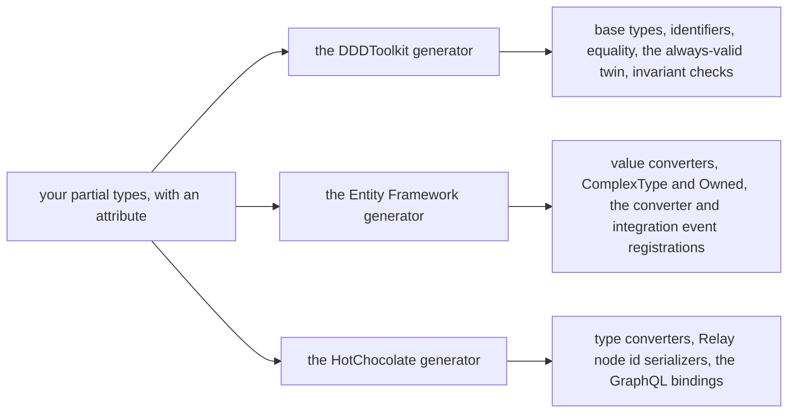

# What the generator writes

Every attribute in DDDToolkit is a request to a Roslyn source generator. The generator reads your
declaration while the project compiles and adds C# files to the same compilation. There is no runtime
library looking at your types, no reflection over them and nothing woven into the IL. What runs is the
code on this page, and you can open it, read it and step through it like your own.



<details>
<summary>Show the code: turning the generators on</summary>

Each package carries its generator, so referencing it is all there is to it:

```bash
dotnet add package Temp.DDDToolkit                   # base types and the core generator
dotnet add package Temp.DDDToolkit.EntityFramework   # its generator: the mapping
dotnet add package Temp.DDDToolkit.HotChocolate      # its generator: the GraphQL bindings
```

The registration methods the generators write are named after the module the project declares with
`[assembly: Module]`. A project that is no module, like this sample, chooses the name with
`DDD_Module`:

```xml
<PropertyGroup>
  <DDD_Module>Shop</DDD_Module>   <!-- AddShopConverters, AddShopIntegrationEvents, AddShopGraphQlRuntimeBindings -->
</PropertyGroup>
```

The generators' own package, `DDDToolkit.Analyzers`, is what lets them read that property, so it works
wherever they run. [DDD_Module, and the package that brings it](modules.md#ddd_module-and-the-package-that-brings-it)
has the order the two names are read in, and the two ways of referencing the toolkit that are supported.

</details>

This page walks through that output for one small aggregate. The code comes from
[`website/sample`](../website/sample), which the docs site compiles to show the same files on its
homepage, so it is the generators' real output. The only change is that `global::` prefixes have been
taken out and long files are shortened. Four files go in:

```csharp
[AggregateRoot<Guid>("ORD")]
public partial class Order
{
    public Order(OrderId id, Address shipTo) : base(id)
    {
        ShipTo = shipTo;
        RaiseDomainEvent(new OrderPlaced(id));
    }

    public Address ShipTo { get; private set; }

    public partial IReadOnlyList<OrderLine> Lines { get; }

    public sealed class MustHaveLines : IInvariant<Order>
    {
        public string Code => "ORDER_HAS_NO_LINES";

        public InvariantFailure? Check(Order order)
            => order.Lines.Count == 0
                ? "An order has at least one line."
                : null;
    }
}

[Entity<Guid>("LINE")]
public partial class OrderLine { /* Sku and Quantity */ }

[ValueObject]
public partial record Address(string Street, string City)
{
    protected override bool Validate() => Street.Length > 0 && City.Length > 0;
}

[DomainEventName("shop.order-placed")]
public sealed record OrderPlaced(OrderId Order) : DomainEvent;
```

58 lines in, 963 lines out, in 15 files.

## Why generate it

- **It is there, and it is current.** Add a property to a value object and its equality, its `With()`
  and its mapping follow at the next build. There is no second file that has to be kept in step, and
  no reviewer has to check that it was.
- **It costs what hand-written code costs.** Equality, conversions and invariant checks call your
  members directly. [Performance](performance.md) measures a struct id against the raw `Guid` it
  wraps, and they come out the same.
- **You pay only for what you use.** An entity without rules gets no list of rules and no check to
  run. An unimplemented `partial void CheckInvariants()` is removed by the compiler, with every call
  to it.
- **Misuse is a compile error.** When a declaration cannot be generated, or does something other than
  it looks like, you get a [diagnostic](diagnostics.md) in the editor instead of a type that quietly
  behaves like a plain class.
- **One declaration reaches every integration.** Reference `DDDToolkit.EntityFramework` or
  `DDDToolkit.HotChocolate` and their generators add converters and bindings for the same types. Your
  declaration does not change.

## `[AggregateRoot]` and `[Entity]`

`Order.g.cs` gives the class its base type, with the identifier type the attribute asked for, and the
constructor Entity Framework needs to materialize a row:

```csharp title="Order.g.cs, shortened"
partial class Order : DDDToolkit.BaseTypes.AggregateRoot<Shop.OrderId>
{
    /// <summary>Parameterless constructor for persistence frameworks and serializers.</summary>
    protected Order()
    {
    }
```

Every rule nested in the class is created once and kept in a static array. The checks walk it, then
the `CheckInvariants()` seam, then every child entity the aggregate holds in a collection:

```csharp title="Order.g.cs, shortened"
    private static readonly DDDToolkit.Invariants.IInvariant<Shop.Order>[] __invariants =
    [
        new Shop.Order.MustHaveLines(),
    ];

    public override void EnsureInvariants()
    {
        System.Collections.Generic.List<DDDToolkit.Invariants.InvariantViolation>? violations = null;
        CollectInvariantViolations(ref violations, out var seamFailure);

        CollectChildInvariantViolations(ref violations);

        if (violations is null)
        {
            return;
        }

        ThrowInvariantViolations(violations, seamFailure);
    }
```

The list of violations is created on the first failure, so a consistent aggregate allocates nothing.
[Invariants](invariants.md) explains the two stages, `GetInvariantViolations()` to ask and
`EnsureInvariants()` to throw, and when the save runs them.

The `partial` collection property gets a field behind it:

```csharp title="Order.g.cs, shortened"
    private readonly System.Collections.Generic.List<Shop.OrderLine> _lines = new();

    private System.Collections.Generic.IReadOnlyList<Shop.OrderLine>? __linesView;

    /// <summary>Read-only view over <see cref="_lines"/>. Mutate the collection through the field.</summary>
    [Microsoft.EntityFrameworkCore.BackingField(nameof(_lines))]
    public partial System.Collections.Generic.IReadOnlyList<Shop.OrderLine> Lines => __linesView ??= _lines.AsReadOnly();
}
```

In practice: code inside `Order` adds a line with `_lines.Add(...)`, and code outside it can read
`Lines` but cannot change it. Entity Framework loads and saves the field. This is the usual
hand-written pattern for keeping a collection inside its aggregate, minus the writing.

`OrderLine.g.cs` is the same for the child entity, with `Entity<OrderLineId>` as the base class.

## The identifier

`[AggregateRoot<Guid>("ORD")]` names the id type after the class, so the generator writes `OrderId`.
No `OrderId.cs` exists anywhere. It is a `readonly record struct` around the `Guid`:

```csharp title="OrderId.g.cs, shortened"
[System.Text.Json.Serialization.JsonConverter(typeof(OrderId.SystemTextJsonConverter))]
public readonly partial record struct OrderId : DDDToolkit.Abstractions.Interfaces.IEntityId<System.Guid>, System.IComparable<OrderId>, System.IParsable<OrderId>, DDDToolkit.Interfaces.ISingleValue<OrderId, System.Guid>
{
    public const string IdPrefix = "ORD";

    public System.Guid Value { get; }

    public static OrderId CreateUnique() => new(System.Guid.NewGuid());

    public static OrderId CreateSequential() => new(System.Guid.CreateVersion7());

    public override string ToString() => /* ORD_1b4e28ba-2fa1-11d2-883f-0016d3cca427 */;

    public static OrderId Parse(string input) { /* the prefix is optional */ }
    public static bool TryParse(string? input, out OrderId result) { /* ... */ }

    static OrderId DDDToolkit.Interfaces.ISingleValue<OrderId, System.Guid>.FromValue(System.Guid value) => new(value);

    public sealed class SystemTextJsonConverter : System.Text.Json.Serialization.JsonConverter<OrderId> { /* ... */ }
}
```

`CreateSequential()` makes a version 7 `Guid`, which is ordered by time and friendlier to a database
index than a random one. `ISingleValue` names the value and the way back from it, for a project that stores
the id without declaring it. [Identifiers](identifiers.md) covers the other value types, the record form,
the prefix and `ISingleValue`.

## `[ValueObject]`

`Address.g.cs` gives the record its base type and equality over its components, in declaration order:

```csharp title="Address.g.cs, shortened"
partial record Address : DDDToolkit.BaseTypes.ValueObject, DDDToolkit.Validation.IValidatable<ValidAddress>
{
    [System.Text.Json.Serialization.JsonInclude]
    public string Street { get; protected init; } = Street;

    [System.Text.Json.Serialization.JsonInclude]
    public string City { get; protected init; } = City;

    protected override System.Collections.Generic.IEnumerable<object?> GetEqualityComponents()
    {
        yield return Street;
        yield return City;
    }
```

The positional parameters become properties with a `protected init` setter, so nobody outside the
record can make a changed copy with `with` and skip validation. What it offers instead is `With()`,
which copies with changes and judges the copy afresh:

```csharp title="Address.g.cs, shortened"
    public virtual Address With(DDDToolkit.BaseTypes.Optional<string> street = default, DDDToolkit.BaseTypes.Optional<string> city = default)
        => this with { Street = street.Or(Street), City = city.Or(City) };
}
```

It also writes `ValidAddress`, the always-valid twin. Its only constructor validates, so a method that
takes a `ValidAddress` never has to check one again:

```csharp title="Address.g.cs, shortened"
public partial record ValidAddress : Address, DDDToolkit.Abstractions.Interfaces.IAlwaysValid
{
    public ValidAddress(Address value) : base(value)
    {
        value.EnsureValidated();
        _isValid = true;
    }
```

[Value objects](value-objects.md) explains validation, the twin and `With()` in full.

## The event names

Every name the project's events are stored or published under becomes a constant, in a class named after
the module:

```csharp title="EventNames.g.cs, shortened"
public static class ShopEventNames
{
    /// <summary><c>shop.order-placed</c>: <see cref="Shop.OrderPlaced"/> (version 1).</summary>
    public const string OrderPlaced = "shop.order-placed";
}
```

`OrderPlaced` pins its name with `[DomainEventName]`. Without it the name would be the module and the class
name in kebab case; [Stable names](domain-events.md#stable-names) has the rule, and the checks the same
pass runs on it.

## The module

This sample is no module, so it gets no file for one. A project whose build declares its module, with
`DDD_Module` and `DDD_DeclareModule` set to true, gets the attribute it would otherwise have written itself:

```csharp title="Module.g.cs, shortened"
// The module this project's build declared: its DDD_Module, with DDD_DeclareModule set to true. An
// [assembly: Module] of the project's own would have been kept instead, and nothing written here.
[assembly: global::DDDToolkit.Abstractions.Attributes.ModuleAttribute("Ordering")]
```

It is not written where the project declares `[assembly: Module]` already, so it never declares the module
twice. [A module named by its folder](modules.md#a-module-named-by-its-folder) has how and why.

## The access behavior

One thing the core generator writes only where another library is used. In a project that references
[Mediator](https://github.com/martinothamar/Mediator), an interface marked `[AccessRequests]` gets the
pipeline behavior that holds its requests to [what they require of their caller](access-requirements.md),
and the call that registers it:

```csharp
[AccessRequests]
public interface IShopRequest : IRequireAccess;
```

```csharp title="ShopAccessBehavior.g.cs, shortened"
[assembly: AccessBehavior(typeof(IShopRequest), typeof(ShopAccessBehavior<,>),
    StreamBehavior = typeof(ShopAccessStreamBehavior<,>), Registration = "services.AddShopAccessBehavior()")]

public sealed class ShopAccessBehavior<TMessage, TResponse> : IPipelineBehavior<TMessage, TResponse>
    where TMessage : notnull, IShopRequest, IMessage
{
    private readonly AccessChecks<IShopRequest> _checks;

    public async ValueTask<TResponse> Handle(TMessage message, MessageHandlerDelegate<TMessage, TResponse> next, CancellationToken cancellationToken)
    {
        await _checks.RequireAsync(message, cancellationToken).ConfigureAwait(false);
        return await next(message, cancellationToken).ConfigureAwait(false);
    }
}

public static class ShopAccessBehaviorRegistration
{
    public static IServiceCollection AddShopAccessBehavior(this IServiceCollection services)
    {
        services.AddAccessChecks<IShopRequest>();
        services.TryAddEnumerable(ServiceDescriptor.Scoped(typeof(IPipelineBehavior<,>), typeof(ShopAccessBehavior<,>)));
        return services;
    }
}
```

A message that is answered with a stream passes a pipeline of its own in Mediator, so the same file holds a
second class for it, which `AddShopAccessBehavior()` registers too:

```csharp title="ShopAccessBehavior.g.cs, shortened"
public sealed class ShopAccessStreamBehavior<TMessage, TResponse> : IStreamPipelineBehavior<TMessage, TResponse>
    where TMessage : IShopRequest, IStreamMessage
{
    public async IAsyncEnumerable<TResponse> Handle(TMessage message, StreamHandlerDelegate<TMessage, TResponse> next, [EnumeratorCancellation] CancellationToken cancellationToken)
    {
        await _checks.RequireAsync(message, cancellationToken).ConfigureAwait(false);
        await foreach (var item in next(message, cancellationToken).ConfigureAwait(false))
        {
            yield return item;
        }
    }
}
```

The toolkit references no dispatcher: the library is noticed by its type, and how its behaviors are implemented
is read from the version the project references. A project that does not reference it gets none of the classes.

The file opens with what it wrote, as an attribute of the assembly: the interface, both behaviors and the call that
registers them. Registering the interface's checks reads it to bring the start-up check
`access.behaviors-registered`, which stops a host that handles a request of the interface without the behavior in
its pipeline ([When nothing asks the checks](access-requirements.md#when-nothing-asks-the-checks)).

## `DDDToolkit.EntityFramework`

With the Entity Framework package referenced, its generator adds the mapping. Each id gets a value
converter that stores it as its plain value:

```csharp title="OrderId.Converter.g.cs"
public readonly partial record struct OrderId
{
    public sealed class OrderIdConverter : Microsoft.EntityFrameworkCore.Storage.ValueConversion.ValueConverter<Shop.OrderId, System.Guid>
    {
        public OrderIdConverter() : base(static v => v.Value, static v => new Shop.OrderId(v))
        {
        }
    }
}
```

One method registers every converter in the project. It is named after
`<DDD_Module>Shop</DDD_Module>` in the project file, because this sample declares no module, and you
call it from `ConfigureConventions`:

```csharp title="ConverterExtensions.g.cs, shortened"
public static Microsoft.EntityFrameworkCore.ModelConfigurationBuilder AddShopConverters(this Microsoft.EntityFrameworkCore.ModelConfigurationBuilder modelConfigurationBuilder)
{
    modelConfigurationBuilder.Properties<Shop.OrderId>().HaveConversion<Shop.OrderId.OrderIdConverter>();
    modelConfigurationBuilder.DefaultTypeMapping<Shop.OrderId>().HasConversion<Shop.OrderId.OrderIdConverter>();
    // the same for OrderLineId
    return modelConfigurationBuilder;
}
```

Value objects are marked `[ComplexType]`, so their fields become columns of the table that holds
them. Child entities are marked `[Owned]`, so they are saved with their aggregate and never alone.

`AddShopIntegrationEvents()` registers every domain event of the module with the outbox, under its stable
name, here the one from `[DomainEventName]`:

```csharp title="IntegrationEventExtensions.g.cs, shortened"
outbox.RegisterEvent<Shop.OrderPlaced>("shop.order-placed", 1);
```

The name is what the outbox stores, so renaming the class does not orphan rows already written. See
[Entity Framework](entity-framework.md) and [Integration events](integration-events.md).

A project without the Entity Framework package, such as a module's domain project, gets none of this. The
core generator still makes every id and single value object implement `ISingleValue<TSelf, TValue>`, and the
module's project that references Entity Framework writes the rest for it: its `Add{Module}Converters()`
registers those ids with `SingleValueConverter<T, TValue>`, and its `Add{Module}IntegrationEvents()` names
the domain project's events, which must be `public`. A registration a package closes over the module's
classes, such as `modelBuilder.AddTenancy()`, is written into that project as well, and into no project of
the module above it: an API project that references it calls its own public registration. See
[A module in layers](modules.md#a-module-in-layers).

## `DDDToolkit.HotChocolate`

With the HotChocolate package referenced, each id gets a type converter and a Relay node id
serializer, and one method binds them all:

```csharp title="BindingExtensions.g.cs, shortened"
public static HotChocolate.Execution.Configuration.IRequestExecutorBuilder AddShopGraphQlRuntimeBindings(this HotChocolate.Execution.Configuration.IRequestExecutorBuilder builder)
{
    builder.BindRuntimeType<Shop.OrderId, HotChocolate.Types.UuidType>();
    builder.AddTypeConverter<Shop.OrderId.ChangeTypeProvider>();
    builder.AddNodeIdValueSerializer<Shop.OrderId.NodeIdValueSerializer>();
    // the same for OrderLineId

    // The struct ids, as keys HotChocolate's paging can order a list by: OrderBy(x => x.Id) in front of ToPageAsync.
    DDDToolkit.HotChocolate.Paging.SingleValueCursorKeySerializer<Shop.OrderId, System.Guid>.Register();
    // and for OrderLineId

    return builder;
}
```

An `OrderId` is a `UUID` in the schema, can be the key inside a Relay node id, and can be the key a paged
list is ordered by. See [GraphQL](graphql.md).

## See it in your own project

Go to definition on a generated member opens the generated file, and in Visual Studio the files are
also listed under **Dependencies → Analyzers**. To have them written to disk:

```xml
<PropertyGroup>
  <EmitCompilerGeneratedFiles>true</EmitCompilerGeneratedFiles>
  <CompilerGeneratedFilesOutputPath>$(MSBuildProjectDirectory)\Generated</CompilerGeneratedFilesOutputPath>
</PropertyGroup>
```

Build, then look in `Generated/`, and add that folder to `.gitignore`. If a type you annotated
produced nothing, the build output has a `DDD` diagnostic that says why; see [Diagnostics](diagnostics.md).
