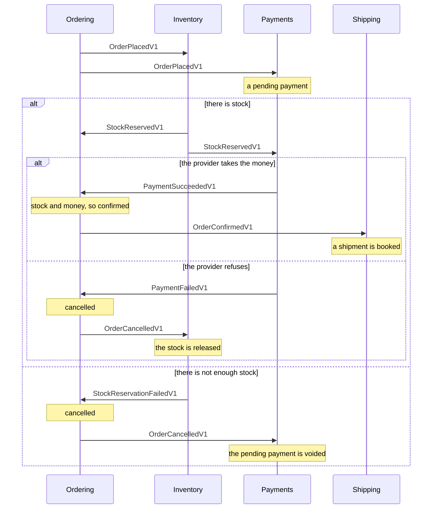
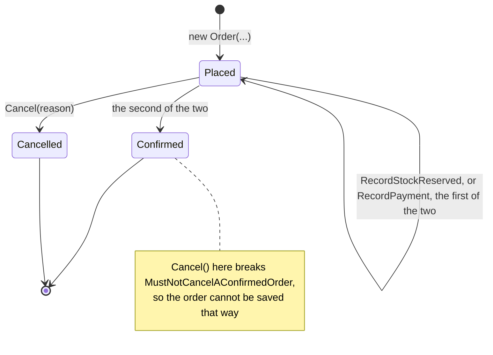

# Getting started

This page builds one module of a small shop, step by step: an identifier, a value object, an aggregate
with its rules, a test, a database, an HTTP endpoint, and finally a second module that reacts to the
first. Each step adds one thing, and says what the generator writes for it.

Every snippet comes from a project that builds and runs,
[`Examples/ModularMonolith.Supabase`](../Examples/ModularMonolith.Supabase), shortened to what the
step is about. The shop has five modules, `Catalog`, `Ordering`, `Inventory`, `Payments` and
`Shipping`, run in one host. This page follows `Ordering` and the module that reacts to it last,
`Shipping`; the others use the same pieces. The path under each snippet points at the real file, so
you can go and look at the rest of it.

## Install

```bash
dotnet add package DDDToolkit
```

`DDDToolkit` brings the base types and the core generators. That is all the first steps need. Each
integration comes with a package of its own, added in the step that uses it: Entity Framework when the
aggregate is stored, the testing kit when it is tested.

The libraries target .NET 10. The generators target `netstandard2.0` and reference nothing at run
time, so they load in any recent SDK without version conflicts.

## Declare an identifier

An order needs an id. A `Guid` would do, until somebody passes a customer's `Guid` where an order's was
meant and the compiler cannot tell. An identifier type makes that a compile error:

```csharp
[EntityId<Guid>("ORD")]
public readonly partial record struct OrderId;
```

*[`Ordering.Contracts/OrderingContracts.cs`](../Examples/Modules/Ordering/DDDToolkit.Examples.Ordering.Contracts/OrderingContracts.cs)*

Two rules: the type must be `partial` so the generator can add to it, and it must be a record. Use
`readonly partial record struct` unless you have a reason not to; it costs no allocation. The generator
writes the rest:

```csharp title="OrderId.g.cs, shortened"
[JsonConverter(typeof(OrderId.SystemTextJsonConverter))]
public readonly partial record struct OrderId : IEntityId<Guid>, IComparable<OrderId>, IParsable<OrderId>
{
    public const string IdPrefix = "ORD";

    public Guid Value { get; }

    public OrderId(Guid value) { Value = value; }

    public static OrderId CreateUnique() => new(Guid.NewGuid());
    public static OrderId CreateSequential() => new(Guid.CreateVersion7());

    public override string ToString() => /* "ORD_" followed by the Guid */;

    public static OrderId Parse(string input) { /* the prefix is optional */ }
    public static bool TryParse(string? input, out OrderId result) { /* ... */ }

    public sealed class SystemTextJsonConverter : JsonConverter<OrderId> { /* ... */ }
}
```

Most identifiers do not need a declaration at all. Name the raw value on the entity and the toolkit
generates the identifier with it:

```csharp
[Entity<Guid>("LINE")]
public partial class OrderLine    // also generates OrderLineId
```

*[`Ordering/Domain/Aggregates/Orders/Entities/OrderLine.cs`](../Examples/Modules/Ordering/DDDToolkit.Examples.Ordering/Domain/Aggregates/Orders/Entities/OrderLine.cs)*

Use the short form for the identifier nobody outside the aggregate mentions, and the explicit form for
the identifier everybody does. `OrderId` is written out because it is stored, parsed from URLs and sent
to other modules, so it deserves a file to navigate to. See [Identifiers](identifiers.md).

## Declare a value object

An order is shipped to an address. An address has no identity of its own: two addresses with the same
street, city and postal code are the same address. That makes it a value object, and it carries its own
rules:

```csharp
[ValueObject]
public partial record Address
{
    public Address(string street, string city, string postalCode)
        => (Street, City, PostalCode) = (street, city, postalCode);

    [JsonInclude] public string Street { get; protected init; }
    [JsonInclude] public string City { get; protected init; }
    [JsonInclude] public string PostalCode { get; protected init; }

    protected override void Validate(ValidationErrorBuilder errors)
    {
        if (string.IsNullOrWhiteSpace(Street))
        {
            errors.Add("A street is required.", nameof(Street), "Required", Street);
        }
        // ...
    }
}
```

*[`Ordering/Domain/ValueObjects/Address.cs`](../Examples/Modules/Ordering/DDDToolkit.Examples.Ordering/Domain/ValueObjects/Address.cs)*

Setters are `protected init`: an address is set when it is made and never changed afterwards
([DDD00010](diagnostics.md#ddd00010), [DDD00011](diagnostics.md#ddd00011)). The generator writes the
equality and an always-valid twin:

```csharp title="Address.g.cs, shortened"
partial record Address : ValueObject, IValidatable<ValidAddress>
{
    protected override IEnumerable<object?> GetEqualityComponents()
    {
        yield return Street;
        yield return City;
        yield return PostalCode;
    }

    public ValidAddress ToValid() => new(this);

    public virtual Address With(Optional<string> street = default, Optional<string> city = default, Optional<string> postalCode = default)
        => this with { Street = street.Or(Street), City = city.Or(City), PostalCode = postalCode.Or(PostalCode) };
}

public partial record ValidAddress : Address, IAlwaysValid
{
    public ValidAddress(Address value) : base(value)
    {
        value.EnsureValidated();
        _isValid = true;
    }
}
```

An `Address` may be invalid; it is what a form handed you. A `ValidAddress` cannot be: its only
constructor validates. That lets a method say in its signature that it wants a checked address, and the
aggregate in the next step does exactly that. See [Value objects](value-objects.md).

## Declare an aggregate

The order itself. It has an identity, it holds its lines, and it is the one place that decides what
may happen to them:

```csharp
[AggregateRoot<OrderId>]
public partial class Order
{
    public Order(OrderId id, ValidAddress shipTo, IEnumerable<OrderLine> lines) : base(id)
    {
        ShipTo = shipTo;
        _lines.AddRange(lines);
        Status = OrderStatus.Placed;
        Total = _lines.Aggregate(Money.Zero(), (total, line) => total.Plus(line.Subtotal));

        RaiseDomainEvent(new OrderPlaced(id, shipTo, /* the lines */, Total));
    }

    public Address ShipTo { get; private set; }

    public partial IReadOnlyList<OrderLine> Lines { get; }

    public Money Total { get; private set; }

    public OrderStatus Status { get; private set; }

    public void Cancel(string reason)
    {
        if (Status is OrderStatus.Cancelled)
        {
            return;
        }

        Status = OrderStatus.Cancelled;
        CancellationReason = reason;
        RaiseDomainEvent(new OrderCancelled(Id, reason));
    }
}
```

*[`Ordering/Domain/Aggregates/Orders/Order.cs`](../Examples/Modules/Ordering/DDDToolkit.Examples.Ordering/Domain/Aggregates/Orders/Order.cs)*

The constructor takes a `ValidAddress`, so the order never re-validates an address. `Money` is a value
object like `Address`, from the shop's shared kernel.

`Lines` is declared `partial` and get-only. That is the contract: you describe the property you want,
and the generator writes the field behind it. Inside `Order` you add to `_lines`; outside it, callers
can read `Lines` but cannot change it. Declaring a setter is an error
([DDD00020](diagnostics.md#ddd00020)).

```csharp title="Order.g.cs, shortened"
partial class Order : AggregateRoot<OrderId>
{
    protected Order() { }   // for Entity Framework and serializers

    private readonly List<OrderLine> _lines = new();

    [BackingField(nameof(_lines))]
    public partial IReadOnlyList<OrderLine> Lines => __linesView ??= _lines.AsReadOnly();

    // and the invariant checks of the next step
}
```

The base class brings the `Id`, a `Version` for optimistic concurrency, and `RaiseDomainEvent`, which
is protected, so nothing outside the aggregate can put an event into it. See
[Entities and aggregates](entities-and-aggregates.md) and [Domain events](domain-events.md).

## State an invariant

An invariant is a rule about a whole aggregate that must hold every time anyone can look at it. A
one-liner goes in the generated seam:

```csharp
partial void CheckInvariants()
{
    if (Lines.Select(line => line.Sku).Distinct().Count() != Lines.Count)
    {
        throw InvariantViolation("An order may not name the same SKU on two lines.");
    }
}
```

*[`Ordering/Domain/Aggregates/Orders/Order.cs`](../Examples/Modules/Ordering/DDDToolkit.Examples.Ordering/Domain/Aggregates/Orders/Order.cs)*

A rule that deserves a name, or a code a caller can branch on, becomes a type of its own, nested
inside the entity it is about so that it can read private state and so the generator can find it:

```csharp
public partial class Order
{
    public sealed class MustHaveLines : IInvariant<Order>
    {
        public string Code => "ORDER_HAS_NO_LINES";

        public InvariantFailure? Check(Order order)
            => order.Lines.Count == 0 ? "An order must have at least one line." : null;
    }
}
```

*[`Ordering/Domain/Aggregates/Orders/Invariants/MustHaveLines.cs`](../Examples/Modules/Ordering/DDDToolkit.Examples.Ordering/Domain/Aggregates/Orders/Invariants/MustHaveLines.cs)*

The generator finds the nested rules and writes the check that runs them all, then the seam, then
asks every line:

```csharp title="Order.g.cs, shortened"
private static readonly IInvariant<Order>[] __invariants =
[
    new Order.MustHaveLines(),
    new Order.MustNotCancelAConfirmedOrder(),
];

public override IReadOnlyList<InvariantViolation> GetInvariantViolations() { /* rules, seam, then each line */ }

public override void EnsureInvariants() { /* the same, and throws when something is broken */ }
```

`GetInvariantViolations()` asks without throwing, for the moment where "not consistent yet" is an
answer you want to handle. `EnsureInvariants()` throws. Asking the root answers for the whole
aggregate: its own rules and every line's, each violation naming the entity that reported it. Once the
aggregate is stored with Entity Framework, every save runs the check too, so the rules are a guarantee
rather than a check somebody remembered to call. An entity that states nothing pays nothing: the
compiler erases an unimplemented `partial void` and every call to it. See [Invariants](invariants.md).

## Test the aggregate

Nothing so far needs a database, and neither does testing it. `DDDToolkit.Testing` acts on an
aggregate and asserts on the domain events it raised:

```bash
dotnet add package DDDToolkit.Testing
```

```csharp
var scenario = AggregateScenario.Given(Place());
scenario.IgnorePendingEvents();

scenario.When(order => order.Cancel("No stock.")).RaisedExactly<OrderCancelled>();
scenario.When(order => order.Cancel("Changed my mind.")).RaisedNothing();
```

Each `When` is judged on what it raised itself, so the second line says what matters about a second
cancellation: nothing happens. `WhenThrows` is the same for a call that must fail, and asserts both
halves: the exception came out, and nothing was raised on the way out.

The aggregate is what calls `new OrderPlaced(...)`, so a test cannot pass an initialiser for the
timestamp. `DomainEventClock` replaces the clock the event reads, for the current asynchronous flow
only:

```csharp
var moment = new DateTimeOffset(2026, 9, 14, 9, 30, 0, TimeSpan.Zero);
using var scope = DomainEventClock.Use(new FixedClock(moment));

var order = Place();

order.PendingEvents().Should().OnlyContain(raised => raised.OccurredAt == moment);
```

*[`Tests/DDDToolkit.Examples.Tests/OrderTests.cs`](../Tests/DDDToolkit.Examples.Tests/OrderTests.cs)*

See [Testing](testing.md).

## Store it with Entity Framework

```bash
dotnet add package DDDToolkit.EntityFramework
```

The Entity Framework package brings a generator of its own. It writes a value converter for every
identifier, so an `OrderId` is stored as a plain `uuid` column, and one method per project that
registers them all:

```csharp title="ConverterExtensions.g.cs, shortened"
public static ModelConfigurationBuilder AddOrderingConverters(this ModelConfigurationBuilder modelConfigurationBuilder)
{
    modelConfigurationBuilder.Properties<OrderLineId>().HaveConversion<OrderLineId.OrderLineIdConverter>();
    modelConfigurationBuilder.DefaultTypeMapping<OrderLineId>().HasConversion<OrderLineId.OrderLineIdConverter>();
    // the same two lines for every other identifier and single value object in the project
    return modelConfigurationBuilder;
}
```

The method is named after the project. Set `DDD_Module` in the project file to choose the name; without
it the generators use the assembly name with the dots removed, which works but reads poorly:

```xml
<PropertyGroup>
  <DDD_Module>Ordering</DDD_Module>
</PropertyGroup>
```

It is only a name. Saying that a project is a *module*, with a boundary something checks, is a separate
declaration that comes up [further down](#draw-the-module-boundary).

The context calls that method and the conventions every context shares:

```csharp
public sealed class OrderingContext(DbContextOptions<OrderingContext> options) : DbContext(options)
{
    public DbSet<Order> Orders => Set<Order>();

    protected override void ConfigureConventions(ModelConfigurationBuilder configurationBuilder)
    {
        configurationBuilder.AddDDDToolkitConventions();
        configurationBuilder.AddOrderingConverters();
    }
}
```

*[`Ordering/Infrastructure/Persistence/OrderingContext.cs`](../Examples/Modules/Ordering/DDDToolkit.Examples.Ordering/Infrastructure/Persistence/OrderingContext.cs)*

There is no configuration for the domain model itself. `OrderLine` is owned because `[Entity]`
generated `[Owned]`, `Lines` is discovered through the generated backing field, `Address` is stored
inline because `[ValueObject]` generated `[ComplexType]`, and `Version` is a concurrency token. The
example's context has a few more lines; they belong to the modules and the outbox, further down.

Register the toolkit and add it to the context:

```csharp
builder.Services.AddDDDToolkitEntityFramework(options => options.DispatchWithMediator());

builder.Services.AddDbContext<OrderingContext>((services, options) => options
    .UseSqlite(connectionString)
    .UseDDDToolkit(services));
```

`UseDDDToolkit` adds the interceptors that deliver domain events, run the invariants and raise the
version when the context saves. The argument to `AddDDDToolkitEntityFramework` says how the events are
delivered. The example hands them to [Mediator](https://github.com/martinothamar/Mediator) handlers in
the same process, which is what `DDDToolkit.Mediator` adds; the outbox, further down, is the other
way. An aggregate that raised events refuses to save until one of the two is configured, rather than
dropping them. See [Domain event delivery](event-delivery.md).

Pass the provider the `AddDbContext` callback gives you, not the root provider: it belongs to the same
scope as the context, so a handler that injects `OrderingContext` receives the very instance that is
saving. See [Entity Framework](entity-framework.md).

## Refuse bad input without throwing

An endpoint turns a request into an order. The address in the body came from outside and may be junk.
`ToValid()` throws, which is right when an invalid value is a bug; at an API boundary it is an ordinary
answer to an ordinary request, so use `TryToValid` and hand back the failures:

```csharp
app.MapPost("/orders", async (PlaceOrder body, OrderingContext orders, CancellationToken cancellationToken) =>
{
    var errors = new List<ValidationError>();

    if (!new Address(body.Street, body.City, body.PostalCode).TryToValid(out var shipTo, out var addressErrors))
    {
        errors.AddRange(addressErrors.Prefixed("shipTo"));
    }

    if (errors.Count > 0)
    {
        return Results.ValidationProblem(errors.ToErrorDictionary());
    }
    // ...
});
```

*[`Ordering/Api/OrderingEndpoints.cs`](../Examples/Modules/Ordering/DDDToolkit.Examples.Ordering/Api/OrderingEndpoints.cs)*

The caller gets a 400 it can read field by field, with `shipTo.Street` and `shipTo.PostalCode` naming
the fields they filled in. Nothing was thrown, and `shipTo` is the `ValidAddress` the order's
constructor asks for. See [Failure handling](value-objects.md#failure-handling).

## Handle a concurrency conflict

`Version` is incremented on every save that touches the aggregate and checked in the `WHERE` clause, so
a stale write becomes a `ConcurrencyConflictException` naming the aggregate:

```csharp
try
{
    await orders.SaveChangesAsync(cancellationToken);
}
catch (ConcurrencyConflictException conflict)
{
    return Results.Conflict(conflict.Message);
}
```

*[`Ordering/Api/OrderingEndpoints.cs`](../Examples/Modules/Ordering/DDDToolkit.Examples.Ordering/Api/OrderingEndpoints.cs)*

There is no safe generic answer for that catch block, which is why the toolkit does not retry for you.
In the example the conflict is a real one: a customer cancelling an order at the same moment Payments
reports the money taken. Whoever saves second is refused.

## Draw the module boundary

So far there is one module. The shop has five, and they are only worth having apart if they stay
apart: if Shipping may reach into Ordering's aggregates and tables, the two are one module with two
names. The toolkit lets you say where the boundary is, and checks it.

One assembly, one module:

```csharp
[assembly: Module("Ordering")]
```

*[`Ordering/Module.cs`](../Examples/Modules/Ordering/DDDToolkit.Examples.Ordering/Module.cs)*

Nothing happens until a second assembly says it is a module too. From then on, everything an assembly
declares is its own business unless it publishes it, and the analyzer reports another module naming an
unpublished type ([DDD00022](diagnostics.md#ddd00022)) or storing another module's entity
([DDD00023](diagnostics.md#ddd00023)).

What Ordering publishes is small: its identifier, so the others can point at an order, and the
integration events of the next step. The example keeps them in a contracts project of their own, which
is the only Ordering project the other modules reference:

```csharp
[ModuleContract]
[EntityId<Guid>("ORD")]
public readonly partial record struct OrderId;
```

*[`Ordering.Contracts/OrderingContracts.cs`](../Examples/Modules/Ordering/DDDToolkit.Examples.Ordering.Contracts/OrderingContracts.cs)*

`[ModuleContract]` is what publishes it. The contracts project gets converters of its own, so
Ordering's context now calls both methods, one per project that declares identifiers:

```csharp
configurationBuilder.AddOrderingContractsConverters();
configurationBuilder.AddOrderingConverters();
```

Why a module publishes anything at all, what belongs in a contract and why it gets a project of its
own is explained in [Module contracts](module-contracts.md).

Both rules are warnings, so that a codebase adopting modules can see the list before it has to fix it.
Once the list is empty, hold it:

```xml
<WarningsAsErrors>$(WarningsAsErrors);DDD00022;DDD00023</WarningsAsErrors>
```

*[`DDDToolkit.Examples.Shipping.csproj`](../Examples/Modules/Shipping/DDDToolkit.Examples.Shipping/DDDToolkit.Examples.Shipping.csproj)*

See [Modules](modules.md).

## Tell another module something happened

When an order is confirmed, Shipping has to book a van. Ordering cannot call Shipping, which would put
the boundary back, and it should not have to know that Shipping exists at all. It publishes an
integration event instead: a contract, separate from the domain event, so the two can change at
different speeds:

```csharp
[IntegrationEvent("ordering.order-placed", Version = 1)]
public sealed record OrderPlacedV1(
    OrderId OrderId, string City, string PostalCode, IReadOnlyList<OrderedLineV1> Lines, decimal Total, string Currency);

[IntegrationEvent("ordering.order-confirmed", Version = 1)]
public sealed record OrderConfirmedV1(OrderId OrderId, string City, string PostalCode);
```

*[`Ordering.Contracts/OrderingContracts.cs`](../Examples/Modules/Ordering/DDDToolkit.Examples.Ordering.Contracts/OrderingContracts.cs)*

One small class per event says how the one becomes the other. It lives next to the aggregate it
publishes for:

```csharp
public sealed class PublishOrderConfirmed : IOutboundIntegrationEvent<OrderConfirmed, OrderConfirmedV1>
{
    public ValueTask<OrderConfirmedV1?> CreateAsync(OrderConfirmed confirmed, CancellationToken cancellationToken)
        => new(new OrderConfirmedV1(confirmed.OrderId, confirmed.ShipTo.City, confirmed.ShipTo.PostalCode));
}
```

*[`Ordering/Application/Orders/IntegrationEvents/Outbound/`](../Examples/Modules/Ordering/DDDToolkit.Examples.Ordering/Application/Orders/IntegrationEvents/Outbound/)*

The message must not be lost if the process stops right after the order is saved, and it must not be
sent for an order whose save failed. So it goes through an outbox: a table in Ordering's own database,
written in the same transaction as the order. The context maps it:

```csharp
protected override void OnModelCreating(ModelBuilder modelBuilder)
    => modelBuilder.AddDomainEventOutbox();
```

and Ordering's registration picks up the publishing classes and says that what they make goes to the
other modules. It does not say which modules those are:

```csharp
services.AddDDDToolkitEntityFramework(options => options.UseOutbox<OrderingContext>(outbox =>
{
    outbox.AddOrderingIntegrationEvents();   // generated when Ordering compiles
    outbox.SendToModules();
    outbox.AlsoDispatchInProcess = true;
}));

services.AddOutboxBackgroundService<OrderingContext>(pollingInterval: TimeSpan.FromSeconds(1));
```

*[`Ordering/OrderingModule.cs`](../Examples/Modules/Ordering/DDDToolkit.Examples.Ordering/OrderingModule.cs)*

`AddOrderingIntegrationEvents()` is generated: it registers every domain event of the module under the
name the outbox stores it as, and every publishing class with the contract it makes, so nothing is
scanned at start-up.

`SaveChanges` now writes the order and one outbox row in one transaction. The background service reads
the row afterwards, converts it, and hands it to the other modules. Ordering has already committed by
then, which is why a failing consumer cannot refuse an order, and why a concurrency conflict in a
consumer is simply retried.

In the example, Inventory and Payments pick up `OrderPlacedV1`, answer with contracts of their own, and
Ordering confirms the order once both have said yes, or cancels it when either says no. That is the
same mechanism in the other direction; `Shipping` waits for `OrderConfirmedV1`.

The whole checkout, as the modules tell each other. Every contract goes to every module that handles
it; the diagram shows where it matters:



No module calls another, and none waits for an answer: each reacts to what it hears and publishes what
happened. The order is where the answers meet. It confirms itself when it has both the stock and the
money, in whichever order they arrive.

<details>
<summary>Show the code: Ordering's side of the checkout</summary>

One small class per contract Ordering reacts to. It loads the order and tells it what happened; the
order decides what that means:

```csharp
[IntegrationEventConsumer("ordering.checkout.stock-reserved")]
public sealed class RecordStockReservation(OrderingContext context) : IIntegrationEventHandler<StockReservedV1>
{
    public async Task HandleAsync(StockReservedV1 contract, IntegrationEventMessage message, CancellationToken cancellationToken)
        => (await Checkout.OrderAsync(context, contract.OrderId, cancellationToken)).RecordStockReserved(message.OccurredAt);
}

[IntegrationEventConsumer("ordering.checkout.payment-failed")]
public sealed class CancelWithoutPayment(OrderingContext context) : IIntegrationEventHandler<PaymentFailedV1>
{
    public async Task HandleAsync(PaymentFailedV1 contract, IntegrationEventMessage message, CancellationToken cancellationToken)
        => (await Checkout.OrderAsync(context, contract.OrderId, cancellationToken)).Cancel(contract.Reason);
}
```

*[`Ordering/Application/Orders/IntegrationEvents/Inbound/Checkout.cs`](../Examples/Modules/Ordering/DDDToolkit.Examples.Ordering/Application/Orders/IntegrationEvents/Inbound/Checkout.cs)*

None of them calls `SaveChanges`. The inbox saves the order together with the row that says the message
was applied, and that save writes whatever the order raised, `OrderConfirmed` for instance, into
Ordering's outbox in the same transaction. Ordering signs its handlers up in its module registration,
with methods the generator writes:

```csharp
services.AddDDDToolkitEntityFramework(options => options.MapIntegrationEvents(contracts => contracts.AddOrderingIntegrationEvents()));
services.AddModuleIntegrationEvents<OrderingContext>(module => module.AddOrderingIntegrationEvents());
```

*[`Ordering/OrderingModule.cs`](../Examples/Modules/Ordering/DDDToolkit.Examples.Ordering/OrderingModule.cs)*

</details>

The order's side of the checkout is a small state machine. It does not care in which order the answers
arrive, and an answer that comes too late changes nothing:



<details>
<summary>Show the code: the order's methods</summary>

```csharp
public void RecordStockReserved(DateTimeOffset at)
{
    if (Status is not OrderStatus.Placed || StockReserved)
    {
        return;
    }

    StockReserved = true;
    ConfirmWhenReady(at);
}

public void RecordPayment(DateTimeOffset at)
{
    if (Status is not OrderStatus.Placed || Paid)
    {
        return;
    }

    Paid = true;
    ConfirmWhenReady(at);
}

private void ConfirmWhenReady(DateTimeOffset at)
{
    if (!StockReserved || !Paid)
    {
        return;
    }

    Status = OrderStatus.Confirmed;
    ConfirmedAt = at;
    RaiseDomainEvent(new OrderConfirmed(Id, ShipTo));
}
```

*[`Ordering/Domain/Aggregates/Orders/Order.cs`](../Examples/Modules/Ordering/DDDToolkit.Examples.Ordering/Domain/Aggregates/Orders/Order.cs)*

</details>

The host only switches the modules on, and sets the one thing that is the host's: how domain events that
stay inside a module are published.

```csharp
builder.Services.AddDDDToolkitEntityFramework(options => options.DispatchWithMediator());

builder.Services.AddCatalogModule(supabase);
builder.Services.AddOrderingModule(supabase);
builder.Services.AddInventoryModule(supabase);
builder.Services.AddPaymentsModule(supabase);
builder.Services.AddShippingModule(supabase);
```

*[`Host/Program.cs`](../Examples/ModularMonolith.Supabase/DDDToolkit.Examples.Host/Program.cs)*

## Consume it once

```csharp
[IntegrationEventConsumer("shipping.booker")]
public sealed class BookShipment(ShippingContext context) : IIntegrationEventHandler<OrderConfirmedV1>
{
    public Task HandleAsync(OrderConfirmedV1 contract, IntegrationEventMessage message, CancellationToken cancellationToken)
    {
        context.Shipments.Add(new Shipment(
            ShipmentId.CreateSequential(), contract.OrderId, $"{contract.PostalCode}, {contract.City}", message.OccurredAt));

        return Task.CompletedTask;
    }
}
```

*[`Shipping/Application/Shipments/IntegrationEvents/Inbound/BookShipment.cs`](../Examples/Modules/Shipping/DDDToolkit.Examples.Shipping/Application/Shipments/IntegrationEvents/Inbound/BookShipment.cs)*

Three things there are the point. It is typed on the contract, never on Ordering's domain event, which
is what keeps Shipping free of a reference to Ordering's domain. It does not call `SaveChanges`: the
sink runs it inside the inbox, so the shipment and the row that says this consumer applied this message
are written by one save in one transaction. And the consumer name is what the inbox keys on, so
delivery twice does the work once.

Shipping signs itself up as a consumer, with the contracts it reads and the handlers that run under its
inbox:

```csharp
services.AddDDDToolkitEntityFramework(options =>
    options.MapIntegrationEvents(contracts => contracts.RegisterFromAssemblyContaining<OrderConfirmedV1>()));

services.AddModuleIntegrationEvents<ShippingContext>(module => module.Handle<OrderConfirmedV1, BookShipment>());
```

*[`Shipping/ShippingModule.cs`](../Examples/Modules/Shipping/DDDToolkit.Examples.Shipping/ShippingModule.cs)*

and maps the inbox table in its context:

```csharp
protected override void OnModelCreating(ModelBuilder modelBuilder)
    => modelBuilder.AddDomainEventInbox(Database, schema: Schema);
```

*[`Shipping/Infrastructure/Persistence/ShippingContext.cs`](../Examples/Modules/Shipping/DDDToolkit.Examples.Shipping/Infrastructure/Persistence/ShippingContext.cs)*

`schema: Schema` puts the table in the module's own schema instead of the toolkit's default `ddd`. It
matters as soon as modules share a database, as they do on one Supabase project: every module that
consumes needs an inbox and every module that publishes an outbox, and in one shared `ddd` schema they
would all be the same two tables.

See [Integration events](integration-events.md).

## See the generated code

Nothing here is magic, and reading the output is the fastest way to understand it. Go to definition on
a generated member opens the file it is in, or have the files written to disk:

```xml
<PropertyGroup>
  <EmitCompilerGeneratedFiles>true</EmitCompilerGeneratedFiles>
  <CompilerGeneratedFilesOutputPath>$(MSBuildProjectDirectory)\Generated</CompilerGeneratedFilesOutputPath>
</PropertyGroup>
```

Build, then look in `Generated/`. Add that folder to `.gitignore`. [What the generator writes](generated-code.md)
walks through that output for a small aggregate, file by file.

Each file is named after the type it belongs to, the generator that wrote it and a short hash that
keeps two types of the same name apart, such as `Order.2c9e41f0.g.cs` for the entity itself and
`Order.EntityFramework.5b17d3aa.g.cs` for its Entity Framework part (the hash depends on the
namespace). The namespace itself is left out of the name on purpose. It is already in the folder,
and Visual Studio has to fit `Generated\{generator assembly}\{generator}\{file}` under your
project folder into 260 characters.

## When something does not generate

Every misuse reports an error with an identifier starting `DDD`. If a type you annotated produced no
code, check the build output first: the generator tells you what is wrong and which line to fix. See
[Diagnostics](diagnostics.md) for the full list.

## Run the example

```bash
dotnet run --project Examples/ModularMonolith.Supabase/DDDToolkit.Examples.Host
```

Then work through
[`DDDToolkit.Examples.Host.http`](../Examples/ModularMonolith.Supabase/DDDToolkit.Examples.Host/DDDToolkit.Examples.Host.http)
from the top. [`Examples/README.md`](../Examples/README.md) is the map of the folder and says which
file shows what, and how to run the same host on a local Supabase instead of SQLite.
