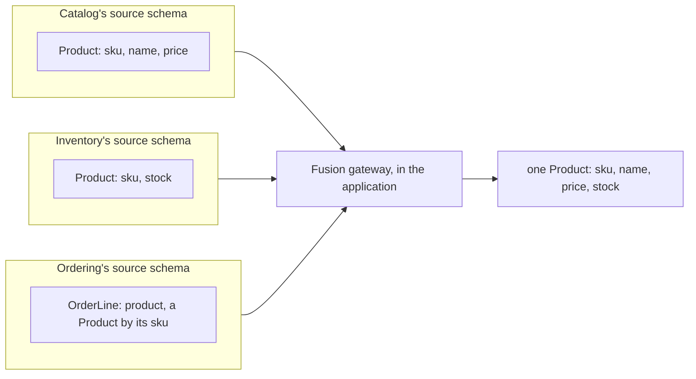

# GraphQL

`DDDToolkit.HotChocolate` makes a domain model built with the toolkit printable as a GraphQL schema.
Without it a strongly typed id becomes an object type with a `value` field, the validation bookkeeping
on your value objects becomes public API, a method on an aggregate becomes a field that any query can
run, and a client has to know that an `OrderId` is a wrapper. With it an `OrderId` is a `UUID`, the
bookkeeping and the methods are gone, and every domain event shares one interface.

This page starts with ids, which every schema needs first, then the conventions every schema gets,
errors and Relay. After that come the parts for larger systems: one schema over several modules, and
pushing events to subscribed clients. How the generated bindings work is at the end.

## Install

```bash
dotnet add package DDDToolkit.HotChocolate
```

The package brings its own source generator, so referencing it is the whole of the build-time setup.
It depends on `HotChocolate.AspNetCore`, so you do not add HotChocolate separately.

It works with HotChocolate 16.0.0 and later. The package asks for no more than that, and every pull
request runs the tests against both 16.0.0 and the newest release (16.6.6 at the time of writing).

## Register

Two kinds of call, both on the `IRequestExecutorBuilder`:

```csharp
using DDDToolkit.HotChocolate;
using Ordering.Domain.GraphQl;   // generated
using SharedKernel.GraphQl;      // generated

builder.Services
    .AddGraphQLServer()
    .AddDDDToolkitTypes()
    .AddSharedKernelGraphQlRuntimeBindings()
    .AddOrderingGraphQlRuntimeBindings()
    .AddQueryType<Query>();
```

`AddDDDToolkitTypes()` registers the conventions, and there is one call for the whole schema. Calling
it twice produces the same schema as calling it once. It does four things, each explained further
down:

- It removes `[Internal]` members, the toolkit's bookkeeping, through the
  `IgnoreInternalFieldsInterceptor`. See
  [Internal members are removed from the schema](#internal-members-are-removed-from-the-schema).
- It removes the fields HotChocolate would make of a domain type's methods. See
  [Domain types publish their data, not their behaviour](#domain-types-publish-their-data-not-their-behaviour).
- It adds the `DomainEvent` interface type. See [The DomainEvent interface](#the-domainevent-interface).
- In a Fusion source schema, and only there, it marks value objects `@shareable`. See
  [Value objects in a Fusion source schema](#value-objects-in-a-fusion-source-schema).

`Add{Module}GraphQlRuntimeBindings()` registers the scalar bindings, the type converters and the Relay
node id serializers, and there is one call per assembly that declares identifiers or single value
objects. The method is generated into the namespace `{AssemblyName}.GraphQl`, on a static class named
`HotChocolateExtensions`. The `{Module}` part comes from the `DDD_Module` MSBuild property, so a project
that sets `<DDD_Module>Ordering</DDD_Module>` gets `AddOrderingGraphQlRuntimeBindings`. See
[Store it with Entity Framework](getting-started.md#store-it-with-entity-framework), where the same
property names the converter method. An assembly that declares neither an identifier nor a single
value object gets no method at all.

The order of the two is not significant: the calls only record configuration, and the schema is built
afterwards. The order above reads in the direction of the dependency, from conventions to your types.

## What a typed id looks like in the schema

Take an id and a field that returns it:

```csharp
[EntityId<Guid>("TST")]
public readonly partial record struct TicketId
{
    public static TicketId Create(Guid value) => new(value);
}
```

```csharp
public sealed class Query
{
    public TicketId PrefixedId() => TicketId.CreateSequential();
}
```

Without the runtime bindings, HotChocolate binds by convention and sees a struct with public members:

```graphql
type Query {
  prefixedId: TicketId!
}

type TicketId {
  value: UUID!
  isEmpty: Boolean!
}
```

With the generated bindings registered, the id collapses into the scalar it wraps:

```graphql
type Query {
  prefixedId: UUID!
}
```

That is the work of the bindings method you registered. The generator wrote three lines into it for
`TicketId`:

```csharp title="BindingExtensions.g.cs, shortened"
public static IRequestExecutorBuilder AddOrderingGraphQlRuntimeBindings(this IRequestExecutorBuilder builder)
{
    // ...
    builder.BindRuntimeType<TicketId, UuidType>();
    builder.AddTypeConverter<TicketId.ChangeTypeProvider>();
    builder.AddNodeIdValueSerializer<TicketId.NodeIdValueSerializer>();
    return builder;
}
```

The first line prints `TicketId` as `UUID`. The second registers a converter between `TicketId` and
`Guid`, so a value can cross the boundary in either direction. The third lets a `TicketId` be the key
inside a Relay node id; see [Relay node ids](#relay-node-ids). The two classes they name are generated
into `TicketId` as well, and [How the bindings work](#how-the-bindings-work) shows them.

Note that the prefix is not part of the wire format. `TicketId.Create(guid).ToString()` is
`"TST_..."`, and the same id serializes as the bare `Guid`. The prefix belongs to `ToString` and
`Parse`; see [Prefixes](identifiers.md#prefixes).

### Struct ids, class ids and always-valid twins

All three bind to the same scalar.

| Declaration | Schema type |
|---|---|
| `[EntityId<Guid>] readonly partial record struct CatId` | `UUID` |
| `[EntityId<Guid>] partial record PersonId` | `UUID` |
| the generated `ValidPersonId` twin | `UUID` |

The twin is handled by the same `ChangeTypeProvider` as the type it derives from: one provider carries
the conversions for both. See [The always-valid twin](value-objects.md#the-always-valid-twin) for what
the twin is for. A struct id has no twin, so its provider carries one pair of conversions.
[How the bindings work](#how-the-bindings-work) shows the extra binding a twin gets.

Nullability and lists follow from the CLR type, as they do for any other runtime type:

```graphql
cat: UUID!
nullableCat: UUID
cats: [UUID!]!
```

`CatId?` prints as `UUID` and serializes as `null` when absent, so an optional id stays off the heap
and still reads correctly on the wire.

### Arguments and input objects

The binding is on the runtime type, not on a direction, so the same mapping applies to input. An id
used as an argument is declared as the scalar and arrives at the resolver as the id:

```csharp
public string DescribeTicketId(TicketId id) => id.ToString();
```

```graphql
describeTicketId(id: UUID!): String!
```

```graphql
{ describeTicketId(id: "44444444-4444-4444-4444-444444444444") }
```

That returns `"TST_44444444-4444-4444-4444-444444444444"`, which only a real `TicketId` can produce; a
`string` argument would come back without the prefix. Literals and variables both work, and a variable
is declared with the scalar:

```graphql
query Echo($id: UUID!) { echoCatId(id: $id) }
```

Input objects work the same way. A plain class with typed id properties is published with the id
fields already collapsed:

```csharp
public sealed class SeatReservation
{
    public TicketId Ticket { get; set; }

    public SeatNumber Seat { get; set; }
}
```

```graphql
input SeatReservationInput {
  ticket: UUID!
  seat: Int!
}
```

## The default scalar mapping

When a type carries no `[GraphQLType<T>]`, the generator picks the schema type from the CLR type it
wraps:

| Wrapped CLR type | HotChocolate type | Schema type |
|---|---|---|
| `string` | `StringType` | `String` |
| `short` | `ShortType` | `Short` |
| `int` | `IntType` | `Int` |
| `long` | `LongType` | `Long` |
| `float` | `FloatType` | `Float` |
| `double` | `FloatType` | `Float` |
| `decimal` | `DecimalType` | `Decimal` |
| `bool` | `BooleanType` | `Boolean` |
| `DateTime` | `DateTimeType` | `DateTime` |
| `DateTimeOffset` | `DateTimeType` | `DateTime` |
| `DateOnly` | `DateType` | `Date` |
| `TimeOnly` | `LocalTimeType` | `LocalTime` |
| `Guid` | `UuidType` | `UUID` |

Wrap anything else and no `BindRuntimeType` line is generated. The converter is still registered, but
the type is published by convention, as an object type with a `value` field. Name a schema type
yourself if that is not what you want.

Two rows in that table are not an exact match of runtime types, and it is worth knowing which.
`DateTimeType` has a runtime type of `DateTimeOffset`, and `FloatType` has a runtime type of `double`.
So an id or single value object over `DateTime` or over `float` leans on HotChocolate's own conversion
between those pairs rather than on anything the toolkit does. Neither pairing is covered by the
toolkit's tests. The other eleven rows match exactly, and `Guid`, `int` and `string` are exercised end
to end.

### Naming the schema type yourself

`[GraphQLType<TSchemaType>]` overrides the default for one type:

```csharp
using DDDToolkit.Abstractions.Attributes;
using DDDToolkit.HotChocolate.Attributes;
using HotChocolate.Types;

[GraphQLType<EmailAddressType>]
[SingleValueObject<string>]
public partial record EmailAddress
{
    public static EmailAddress Create(string value) => new(value);
}
```

The generator reads it and emits the binding it names, for the value object and for its always-valid
twin:

```csharp title="BindingExtensions.g.cs, shortened"
builder.BindRuntimeType<EmailAddress, EmailAddressType>();
builder.BindRuntimeType<ValidEmailAddress, EmailAddressType>();
builder.AddTypeConverter<EmailAddress.ChangeTypeProvider>();
```

```graphql
email: EmailAddress!
```

Without the attribute that field would be `String!`. `EmailAddressType` comes from
`HotChocolate.Types.Scalars`, which you reference yourself; the toolkit does not bring it in.

The attribute applies to identifiers as well as to single value objects, and to struct declarations as
well as to records:

```csharp
[EntityId<string>("USR")]
[GraphQLType<EmailAddressType>]
public readonly partial record struct LoginId
{
    public static LoginId Create(string value) => new(value);
}
```

`TSchemaType` is constrained to `HotChocolate.Types.ITypeDefinition`. This attribute is the toolkit's
own, in `DDDToolkit.HotChocolate.Attributes`, and is not HotChocolate's `GraphQLTypeAttribute`, which
annotates individual members and arguments instead of a type.

## Internal members are removed from the schema

The toolkit marks its bookkeeping with `[Internal]`, and `IgnoreInternalFieldsInterceptor` keeps every
such member out of the schema. It covers object types, input object types and interface types, so a
member stays hidden whether it is read or written. Covering interfaces matters too: a field kept on an
interface but dropped from an implementing object would make the schema invalid.

In practice this hides `IsValid`, `IsValidated`, `EnsureValidated` and the FluentValidation
integration's `Errors` on value objects, `DomainEvents` on an aggregate root, and
`GetInvariantViolations()` and `GetOwnInvariantViolations()` on every entity. It does not hide
anything you did not mark. `Id` and `Version` stay, because they are API:

```graphql
type Ticket {
  holder: EmailAddress!
  seat: Int!
  version: Long!
  id: UUID!
}
```

Asking for a hidden field is a validation error, not an empty result: the field is not in the schema at
all, so a query naming it comes back with an `errors` array that names the field.

```graphql
{ issuedTicket { domainEvents { eventId } } }
```

A type that only a hidden member mentioned, such as FluentValidation's `ValidationFailure`, stays out
of the schema as well; [Why it removes fields instead of flagging them](#why-it-removes-fields-instead-of-flagging-them)
explains how.

See [Hiding members](value-objects.md#hiding-members) for what `[Internal]` means elsewhere, and
[Optimistic concurrency](entities-and-aggregates.md#optimistic-concurrency) for `Version`.

## Domain types publish their data, not their behaviour

HotChocolate binds implicitly unless a type says otherwise: every public property and every public
method that returns something becomes a field, and a method's parameters become its arguments. For a
domain type that publishes its behaviour. A `Money` with `Plus(Money)` and `Times(int)` would come out as

```graphql
type Money {
  plus(other: MoneyInput!): Money!
  times(quantity: Int!): Money!
  amount: Decimal!
  currency: String!
}
```

with a `MoneyInput` in the schema only because `plus` needs one. On an aggregate it is worse: a method
that changes state and returns a result would become a field, and run inside an ordinary query. Neither
GraphQL nor HotChocolate can tell a method with side effects from one without.

So `AddDDDToolkitTypes()` registers `DomainBehaviourFieldsInterceptor`, which removes the fields that
come from the methods of an entity, an aggregate or a value object, on every object type bound by
convention:

```graphql
type Money {
  amount: Decimal!
  currency: String!
}
```

Properties stay, computed ones included, so a value that belongs in the schema is best made a property.
A type declared with `BindFieldsExplicitly()` is left alone and publishes exactly what it lists, a
method among them if you name one. Fields added by a type extension stay as well. Methods named with
`descriptor.Field(...)` on a type that still binds by convention are removed with the rest, because
HotChocolate records them the same way as the ones it found itself; declare that type explicitly.

Like `[Internal]`, the fields are removed during discovery, so a type that only a method's argument
mentioned, such as `MoneyInput`, never enters the schema.

## Failures as GraphQL errors

Without help, a resolver that throws `InvalidValueObjectException` or `InvariantViolationException`
reaches the client as "Unexpected Execution Error", with no code and no way to tell which field or
which rule it was. `AddDDDToolkitErrors()` fixes that:

```csharp
services
    .AddGraphQLServer()
    .AddDDDToolkitTypes()
    .AddDDDToolkitErrors();
```

Each failure becomes an error of its own, with the code in `extensions.code`:

```json
{
  "errors": [{
    "message": "Een order mag hooguit € 1.000,00 zijn.",
    "path": ["placeOrder"],
    "extensions": {
      "code": "Order.OverCreditLimit",
      "entity": "Order",
      "entityId": "ORD_…",
      "arguments": { "CreditLimit": 1000 }
    }
  }]
}
```

| Exception | Errors | Extensions |
| --- | --- | --- |
| `InvalidValueObjectException` | one per `ValidationError` | `code`, `field`, `arguments` |
| `InvariantViolationException` | one per `InvariantViolation`, children included | `code`, `entity`, `entityId`, `arguments` |

The rejected value itself is never sent back; it may be a password. Every other error passes through
untouched.

The message is phrased in the reader's language when the application registered an
`IFailureLocalizer`, by calling `AddDDDToolkitLocalization()` from `DDDToolkit.Localization`, and is the
domain's own sentence otherwise. The language is the request's UI culture, so put
`app.UseRequestLocalization(...)` before `app.MapGraphQL()`. See [Localization](localization.md).

## Relay node ids

HotChocolate's global object identification works with the toolkit's identifiers as they are. Make a
type a node the way HotChocolate documents it, with the identifier itself as the id:

```csharp
builder.Services
    .AddGraphQLServer()
    .AddGlobalObjectIdentification()
    .AddDDDToolkitTypes()
    .AddOrderingContractsGraphQlRuntimeBindings()
    .AddType<OrderType>();

public sealed class OrderType : ObjectType<Order>
{
    protected override void Configure(IObjectTypeDescriptor<Order> descriptor)
        => descriptor
            .ImplementsNode()
            .IdField(order => order.Id)                         // an OrderId
            .ResolveNode((context, id) => /* id is an OrderId */);
}
```

The bindings method is generated once per project that declares identifiers, and in the example shop
`OrderId` is declared in Ordering's contracts project, so it is that project's
`AddOrderingContractsGraphQlRuntimeBindings()` that registers it. Why the example gives a module's
contract a project of its own is explained in [Module contracts](module-contracts.md#a-project-of-its-own).

`id` prints as `ID!` and carries a node id such as `T3JkZXI6ERER…`, `node(id:)` finds the order again,
and an argument declared `[ID<Order>] OrderId id` arrives as the `OrderId` inside the node id. Another
type that points at an order can publish the reference as a node id of the owner's type, with
`descriptor.Field(shipment => shipment.Order).ID("Order")`, without referencing `Order` at all.

What makes that possible is one generated class per identifier. HotChocolate writes a node id through
an `INodeIdValueSerializer` for the id's runtime type, and it has serializers for `Guid`, `string`,
`int`, `long` and `short` but not for a type it has never seen, so an `OrderId` would fail with *No
serializer registered*. The generator therefore adds a nested `NodeIdValueSerializer` to every
identifier over one of those five, and `Add{Module}GraphQlRuntimeBindings()` registers it:

```csharp title="BindingExtensions.g.cs, shortened"
builder.AddNodeIdValueSerializer<OrderId.NodeIdValueSerializer>();
```

It derives from HotChocolate's `CompositeNodeIdValueSerializer<OrderId>` and writes the wrapped value
with HotChocolate's own helpers. The node id is therefore byte for byte the one HotChocolate writes for
the bare `Guid`: `Order:` followed by the value. Any HotChocolate server reads it, and so does a Fusion
gateway, which routes `node(id:)` by the type name in front and never looks at the value. A single value
object gets no serializer, because it is not an identity. [How the bindings work](#how-the-bindings-work)
shows the generated class.

Do not use HotChocolate's own `AddNodeIdValueSerializerFrom<OrderId>()` for a toolkit identifier. Its
generator reads the members of the type, and an identifier's `Value` is written by the toolkit's
generator; source generators do not see each other's output, so it finds no member and emits a
serializer that writes nothing and reads every node id back as an empty id. It compiles without a
warning.

## The DomainEvent interface

`AddDDDToolkitTypes()` registers one type of its own: a GraphQL interface over `IDomainEvent`.

```graphql
"Something that happened in the domain."
interface DomainEvent {
  "Unique, stable identifier of this occurrence. Use it for idempotent handling."
  eventId: UUID!
  "When the event occurred (UTC)."
  occurredAt: DateTime!
  "The runtime type name of the event."
  eventType: String!
}
```

The interface puts no event into the schema; which events a client can see is up to the fields and
types you declare. You expose events on purpose, for a reader that wants to know what happened rather
than what is: an order's history on a back-office screen, say.

Without the interface, each event type
is an object type unrelated to the others, so a field that returns several kinds of event needs a union
you declare yourself, and a union has no fields in common: the client needs a fragment per event type
even to read when each one happened. With it, a resolver can return `IReadOnlyList<IDomainEvent>`,
which prints as `[DomainEvent!]!`, and any event type you expose implements the interface
automatically, because it implements `IDomainEvent`:

```graphql
type TicketIssued implements DomainEvent {
  ticketId: UUID!
  eventId: UUID!
  occurredAt: DateTime!
  eventType: String!
}
```

`eventId` and `occurredAt` come straight from the event. `eventType` is a resolver, and it gives a
client a discriminator without a fragment per concrete type:

```graphql
{ latestEvent { ... on DomainEvent { eventType } } }
```

Exposing a domain event is a field you decided on, answering a query from a reader you chose. It is not
how anybody else learns what happened. Another module reads an integration event, and a subscribed
client is pushed the contract, never the domain event, for the reasons in
[It publishes the contract, never the domain event](#it-publishes-the-contract-never-the-domain-event).

Be aware of what `eventType` currently returns. It resolves to the CLR type name of the event, so
`TicketIssued` returns `"TicketIssued"`, and `[DomainEventName("ordering.ticket-issued")]` does not
change it. If you rename the class, the value changes with it. Treat `eventType` as a hint for
building a client, not as the stable wire name; the stable name is
[`DomainEventName.Of<T>()`](domain-events.md#stable-names).

## One schema over a modular monolith

HotChocolate Fusion puts a gateway in front of several GraphQL services and composes their schemas,
each one a source schema, into one. `DDDToolkit.HotChocolate.Fusion.InMemory` makes the modules of a
monolith what Fusion makes services: each module serves a GraphQL source schema of its own, and a
Fusion gateway inside the application composes them into one schema and answers every query by calling
them directly, in memory, with no HTTP.

```bash
dotnet add package DDDToolkit.HotChocolate.Fusion.InMemory
```

**It needs HotChocolate Fusion 16.6.6 or later**, where the other HotChocolate integration asks for
16.0.0: the in-memory connector it builds on is newer than that. The package declares it, so NuGet refuses
an older HotChocolate rather than a gateway that fails at run time.

How the example shop's `Product` comes together. No module references another's classes; they agree
on a type name and a key:



<details>
<summary>Show the code: Inventory's Product and Ordering's reference to one</summary>

Inventory declares its own `Product`, keyed on the SKU, with the one field it knows, and an internal
lookup the gateway fetches it by:

```csharp
public sealed record InventoryProduct(string Sku);

public sealed class InventoryProductType : ObjectType<InventoryProduct>
{
    protected override void Configure(IObjectTypeDescriptor<InventoryProduct> descriptor)
    {
        descriptor.Name("Product");
        descriptor.BindFieldsExplicitly();
        descriptor.Directive(new EntityKey("sku"));
        descriptor.Field(product => product.Sku);
        descriptor
            .Field("stock")
            .Type<StockItemType>()
            .Resolve(async context => await context.DataLoader<StockItemBySkuDataLoader>()
                .LoadAsync(context.Parent<InventoryProduct>().Sku, context.RequestAborted));
    }
}

[ExtendObjectType(OperationTypeNames.Query)]
public sealed class InventoryProductLookup
{
    [Lookup]
    [Internal]
    public InventoryProduct GetProductBySku(string sku) => new(sku);
}
```

*[`Inventory/Api/GraphQL/ProductStock.cs`](../Examples/Modules/Inventory/DDDToolkit.Examples.Inventory/Api/GraphQL/ProductStock.cs)*

Ordering knows only the SKU on a line, and says that it is a `Product`:

```csharp
public sealed record ProductStub(string Sku);

public sealed class ProductStubType : ObjectType<ProductStub>
{
    protected override void Configure(IObjectTypeDescriptor<ProductStub> descriptor)
    {
        descriptor.Name("Product");
        descriptor.BindFieldsExplicitly();
        descriptor.Directive(new EntityKey("sku"));
        descriptor.Field(product => product.Sku);
    }
}

[ExtendObjectType<OrderLine>]
public sealed class OrderLineProductStub
{
    public ProductStub? GetProduct([Parent] OrderLine line) => new(line.Sku);
}
```

*[`Ordering/Api/GraphQL/ProductStub.cs`](../Examples/Modules/Ordering/DDDToolkit.Examples.Ordering/Api/GraphQL/ProductStub.cs)*

</details>

Two modules can each declare their own `Product`, keyed on the same field, and a client sees one:

```csharp
// Catalog's source schema: the product's name and price, and the lookup it is fetched by
builder.Services.AddGraphQLServer("catalog").AddSourceSchemaDefaults().AddQueryType()...;

// Inventory's: its own Product, keyed on the SKU, with the stock, and an internal lookup
builder.Services.AddGraphQLServer("inventory").AddSourceSchemaDefaults().AddQueryType()...;

builder.Services.AddInMemoryFusionGateway();   // composes every source schema registered

var app = builder.Build();
app.MapInMemoryFusionGateway();                // /graphql
```

```graphql
{ productBySku(sku: "COFFEE-1KG") { name price { amount } stock { available } } }
#                                   └─ Catalog ─────────┘ └─ Inventory ─────┘
```

A module's GraphQL is then the same code in the monolith and as a service behind a Fusion gateway, and
the modules still know nothing of each other's classes: they agree on a type's name and its key.
`Examples/ModularMonolith.*` register every module this way; see the examples' README.

Three things it takes care of, all found the hard way and shown in
`Tests/Spikes/DDDToolkit.Spikes.FusionInProcess`:

- **The gateway has a service container of its own**, inside the application. HotChocolate and Fusion
  each register themselves as the one `IRequestExecutorProvider` of a container: the endpoint asks it for
  the gateway, and HotChocolate's in-memory connector asks it for the modules, so with
  `AddGraphQLGatewayServer().AddInMemorySchema(...)` and more than one source schema one of the two loses
  ("The requested schema '_Default' does not exist"). The package hands the gateway the modules
  explicitly, through the same public classes `AddInMemorySchema` uses.
- **A composition that fails does not hang.** The in-memory connector reports a composition error only
  to observers subscribed at that moment, and the gateway then waits for a schema forever. The
  application's start waits for the composed schema instead, and fails after
  `InMemoryFusionGatewayOptions.CompositionTimeout` (thirty seconds), with the composer's error when it
  was caught.
- **Relay spans the modules**: `node(id:)` is answered by whichever module owns the type in the id.

And one rule that is Fusion's, not the package's: every source schema's root query type must be called
`Query`. `AddQueryType<CatalogQuery>()` names it `CatalogQuery`, and composition refuses it.

## Value objects in a Fusion source schema

A Fusion gateway composes one schema out of the source schemas of several services, and a field belongs
to one of them unless it is marked `@shareable`: the gateway has to know who answers it. An entity has an
owner, and other services add fields to it by its key. A value object has neither owner nor identity.
`Money` in Catalog's prices and `Money` in Payments' amounts are the same type, and any service that
holds one gives the same answer for it, which is exactly what `@shareable` says. Without it, composition
refuses the second service that returns a `Money`:

```
The field 'Money.amount' in schema 'payments' must be shareable.
```

So in a source schema `AddDDDToolkitTypes()` marks every value object type `@shareable`:

```csharp
builder.Services
    .AddGraphQLServer()
    .AddSourceSchemaDefaults()       // HotChocolate: this schema is one a gateway composes
    .AddDDDToolkitTypes();           // value objects become @shareable
```

```graphql
type Money @shareable {
  amount: Decimal!
  currency: String!
}
```

A schema without `AddSourceSchemaDefaults()` gets no directive. Entities stay unshared: a service that
adds to another's entity declares a stub of it, keyed on its id, the way `Examples/Microservices.*` do
for `Order`.

## Pushing integration events to subscribers

`GraphQlSubscriptionSink` is an [integration event](integration-events.md) sink that publishes to
HotChocolate's `ITopicEventSender`, so a message leaving the outbox reaches the clients holding a socket
right now.

**It is a different thing from the other sinks, and worth being blunt about.** The in-process module sink
is how one module tells another that something happened. pgmq is how a module tells another deployable the
same thing. Both are integration: durable, retried, and the receiver gets the message whether or not it was
running at the time.

A subscription is none of that:

- **Not durable.** Nothing is stored. A payload with no subscriber is dropped.
- **Only the connected.** A client that reconnects has missed what happened while it was away, and has to
  re-read the state it cares about.
- **No acknowledgement.** The sink returns once the topic accepted the payload. Whether a socket survived
  long enough to deliver it is not knowable from there.

So use it to keep a screen in step with the server. Never as the path by which some other part of the
system learns that an order was placed. If a browser missing an update would be a bug in your data rather
than a stale view, this is the wrong mechanism.

### Registering it

```csharp
builder.Services
    .AddGraphQLServer()
    .AddDDDToolkitTypes()
    .AddOrderingGraphQlRuntimeBindings()
    .AddInMemorySubscriptions()
    .AddQueryType<Query>()
    .AddSubscriptionType<Subscription>();

builder.Services.AddIntegrationEventSubscriptions(map => map.Publish<OrderPlacedV2>("orderPlaced"));
```

```csharp
options.UseOutbox(outbox =>
{
    outbox.PublishAs<OrderPlaced, OrderPlacedV2>(e => new OrderPlacedV2(e.OrderId.Value, e.Total.Amount));
    outbox.SendTo<GraphQlSubscriptionSink>();
});
```

The subscription field reads the same topic:

```csharp
public sealed class Subscription
{
    [Subscribe(With = nameof(OnOrderPlacedAsync))]
    public OrderPlacedV2 OrderPlaced([EventMessage] OrderPlacedV2 order) => order;

    public ValueTask<ISourceStream<OrderPlacedV2>> OnOrderPlacedAsync(
        [Service] ITopicEventReceiver receiver,
        CancellationToken cancellationToken)
        => receiver.SubscribeAsync<OrderPlacedV2>("orderPlaced", cancellationToken);
}
```

```graphql
subscription { orderPlaced { orderId total } }
```

Nothing is pushed until the map names it. That is the point: a subscription payload is part of your schema,
and a schema is a deliberate list rather than whatever happened to be published.

### It publishes the contract, never the domain event

This is not tidiness. A subscription payload is a schema type. It is declared on the subscription field, it
is resolved through the schema, and the schema's own authorisation decides what the client may see, field
by field. `[Internal]` members are already gone, and an `[Authorize]` on a field still applies.

Broadcast the domain event instead and you are pushing your internal record, with your identifiers and
whatever you last added to it, to whoever is holding a socket. The contract is the list of things you
decided to say out loud, and it is the same contract the other modules read, so there is one published
shape rather than two.

No upcasting happens on this path, and that is deliberate. An upcaster catches a reader up with a payload
written before it was deployed. A subscription payload was produced seconds ago by this process, against
this schema. If the map does not name the message's name **and version**, it is simply not pushed.

### Scoping a topic

A constant topic is a firehose that every subscriber sees. Build the topic from the message to scope it,
usually to one aggregate:

```csharp
map.Publish<OrderPlacedV2>(message => $"order:{message.AggregateId}");
```

Returning `null` from the factory drops that one occurrence.

A topic string is not authorisation. It decides who is woken; the subscription field decides who is allowed
to subscribe and what they then see. Put the `[Authorize]` on the field.

### Transports

`AddInMemorySubscriptions()` is enough for a single process. At 16.6.6 HotChocolate also ships transports
for Postgres, Redis, RabbitMQ and NATS, for when more than one server is holding sockets and the server
that published is not the server the client is connected to. The toolkit's sink goes through
`ITopicEventSender` and does not care which of them is registered.

The Postgres one is worth knowing about if you are already on Postgres. It rides `LISTEN` and `NOTIFY`, so
several servers share subscriptions with no extra infrastructure at all: no Redis, no broker, nothing new to
run or pay for. Combined with the [pgmq sink](transports.md#when-a-module-becomes-its-own-deployable-pgmq),
a Postgres deployment can carry both the durable path and the live path without another service.

`Tests/DDDToolkit.HotChocolate.Tests/SubscriptionSinkTests.cs` runs the whole thing against the real
in-memory transport, including a client subscribing through the schema and receiving what the outbox
published.

## What this package does not do

It maps identifiers and single value objects onto scalars, and identifiers into Relay node ids. It does
not make any type a node: `ImplementsNode()` is yours to call. A multi-property `[ValueObject]` stays the
object type HotChocolate would infer, less its methods, and it generates no queries, mutations or
resolvers. The schema is still yours to write.

That includes subscriptions. The sink publishes a contract to a topic; the subscription field, its
arguments and its authorisation are yours, and so is the choice of transport.

## How the bindings work

Two generated pieces turn an id into a scalar, and a third makes it a node id.

For every identifier and single value object, the generator emits a nested `ChangeTypeProvider` class
implementing `HotChocolate.Utilities.IChangeTypeProvider`. It converts the object to its wrapped value
and back, and declines every other pair:

```csharp title="TicketId.HotChocolate.g.cs, shortened"
readonly partial record struct TicketId
{
    public sealed class ChangeTypeProvider : IChangeTypeProvider
    {
        public bool TryCreateConverter(Type source, Type target, HotChocolate.Utilities.ChangeTypeProvider root, [NotNullWhen(true)] out ChangeType? converter)
        {
            if (source == typeof(TicketId) && target == typeof(Guid))
            {
                converter = value => ((TicketId)value!).Value;
                return true;
            }

            if (source == typeof(Guid) && target == typeof(TicketId))
            {
                converter = value => new TicketId((Guid)value!);
                return true;
            }

            converter = null;
            return false;
        }
    }

    // ...
}
```

Asked directly, it answers like this:

```csharp
var provider = new TicketId.ChangeTypeProvider();

// root is the fallback provider HotChocolate passes in; these converters never delegate to it.
provider.TryCreateConverter(typeof(TicketId), typeof(Guid), root, out var toValue);   // true
provider.TryCreateConverter(typeof(Guid), typeof(TicketId), root, out var fromValue); // true
provider.TryCreateConverter(typeof(TicketId), typeof(string), root, out var other);   // false
```

The registration method then binds the runtime type to a schema type and registers that provider. This
is the method for a project that declares, among others, `EmailAddress`, `PersonId` and `TicketId`:

```csharp title="BindingExtensions.g.cs, shortened"
namespace Ordering.Domain.GraphQl;

public static class HotChocolateExtensions
{
    public static IRequestExecutorBuilder AddOrderingGraphQlRuntimeBindings(this IRequestExecutorBuilder builder)
    {
        // ...
        builder.BindRuntimeType<EmailAddress, EmailAddressType>();
        builder.BindRuntimeType<ValidEmailAddress, EmailAddressType>();
        builder.AddTypeConverter<EmailAddress.ChangeTypeProvider>();
        // ...
        builder.BindRuntimeType<PersonId, UuidType>();
        builder.BindRuntimeType<ValidPersonId, UuidType>();
        builder.AddTypeConverter<PersonId.ChangeTypeProvider>();
        builder.AddNodeIdValueSerializer<PersonId.NodeIdValueSerializer>();
        // ...
        builder.BindRuntimeType<TicketId, UuidType>();
        builder.AddTypeConverter<TicketId.ChangeTypeProvider>();
        builder.AddNodeIdValueSerializer<TicketId.NodeIdValueSerializer>();
        return builder;
    }
}
```

The binding decides how the type is printed. The converter decides how a value moves across the
boundary in either direction. A type with an always-valid twin, such as the class id `PersonId`, gets a
second binding for the twin, and its provider carries a second pair of conversions, between
`ValidPersonId` and `Guid`. `EmailAddress` is bound to the schema type its `[GraphQLType<T>]` names,
and gets no node id serializer, because it is a single value object and not an identity.

The third piece is the `NodeIdValueSerializer`, generated into every identifier over `Guid`, `string`,
`int`, `long` or `short`. It writes the wrapped value into a Relay node id and reads it back out;
[Relay node ids](#relay-node-ids) says why the toolkit writes it rather than HotChocolate:

```csharp title="TicketId.HotChocolate.g.cs, shortened"
readonly partial record struct TicketId
{
    // ...

    public sealed class NodeIdValueSerializer : CompositeNodeIdValueSerializer<TicketId>
    {
        protected override NodeIdFormatterResult Format(Span<byte> buffer, TicketId value, out int written)
        {
            return TryFormatIdPart(buffer, value.Value, out written)
                ? NodeIdFormatterResult.Success
                : NodeIdFormatterResult.BufferTooSmall;
        }

        protected override bool TryParse(ReadOnlySpan<byte> buffer, out TicketId value)
        {
            if (TryParseIdPart(buffer, out Guid raw, out _))
            {
                value = new TicketId(raw);
                return true;
            }

            value = default;
            return false;
        }
    }
}
```

`TryFormatIdPart` and `TryParseIdPart` are HotChocolate's own helpers, which is why the node id has
exactly the format HotChocolate gives a bare `Guid`.

## Why it removes fields instead of flagging them

`IgnoreInternalFieldsInterceptor` takes `[Internal]` members out of the schema by removing their
fields. HotChocolate offers a per-field ignore flag at type completion, and using only that is not
enough.

A field is dropped from the printed schema when it is flagged, but the types it refers to have already
been registered by then. Discovery walks the fields to work out what each one depends on, so flagging
the FluentValidation integration's `Errors` at completion still leaves `ValidationFailure` and its
`Severity` enum registered as schema types that no field can reach.

So the interceptor removes the fields in `OnBeforeRegisterDependencies`, during type discovery and
before dependencies are computed. It still flags in `OnBeforeCompleteType`, for anything internal that
appeared after discovery, such as a merged type extension.

The visible effect is that the schema contains no type that exists only because a hidden field
mentioned it. `ValidationFailure` and `Severity` are absent, and so is the `ValidPersonName` twin that
a value object's `[Internal]` `ToValid()` would otherwise have pulled in.
