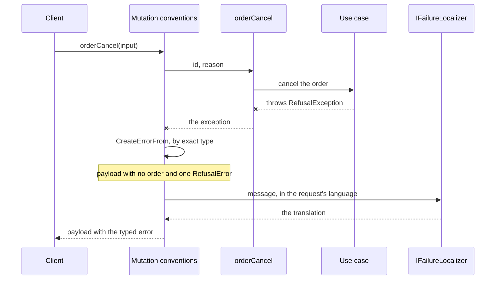
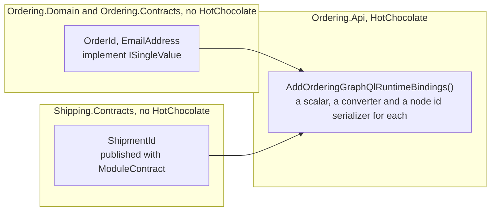
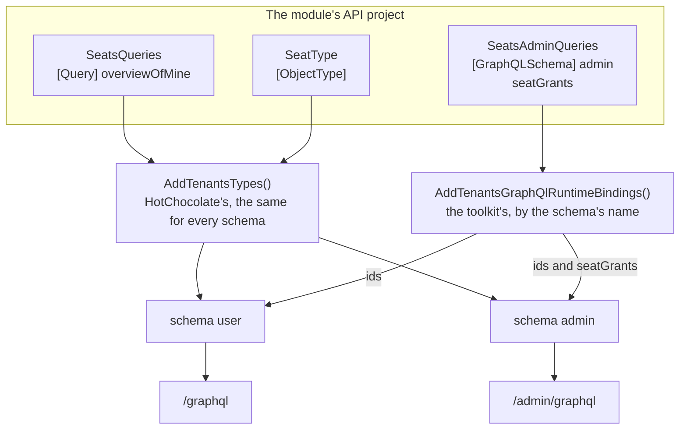
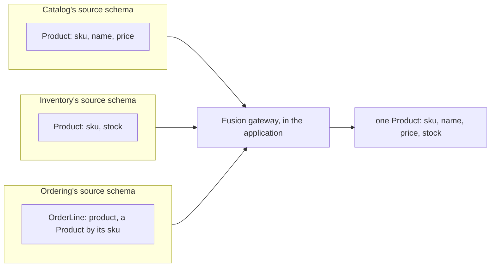
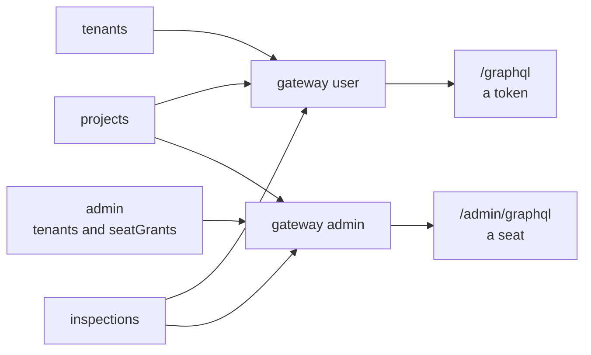
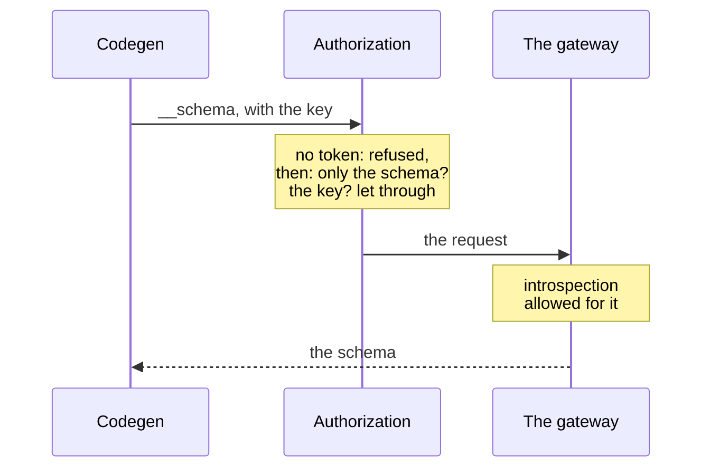

# GraphQL

`DDDToolkit.HotChocolate` makes a domain model built with the toolkit printable as a GraphQL schema.
Without it a strongly typed id becomes an object type with a `value` field, the validation bookkeeping
on your value objects becomes public API, a method on an aggregate becomes a field that any query can
run, and a client has to know that an `OrderId` is a wrapper. With it an `OrderId` is a `UUID`, the
bookkeeping and the methods are gone, and every domain event shares one interface.

This page starts with ids, which every schema needs first, then the conventions every schema gets,
errors, in the response and in a mutation's payload, a permission key on a field, Relay, and paging by an
id. After that come the parts for larger systems: a field for one schema only, one schema over several
modules, and pushing events to subscribed clients. How the generated bindings work is at the end. For a
whole schema to read beside this page, the [Tenancy sample](tenancy.md#graphql-in-the-sample) is the
reference for GraphQL; the shop sample's schema is older, and still writes by hand what HotChocolate now
generates.

## Install

```bash
dotnet add package Temp.DDDToolkit.HotChocolate --prerelease
```

The package brings its own source generator, so referencing it is the whole of the build-time setup.
It depends on `HotChocolate.AspNetCore`, so you do not add HotChocolate separately.

It asks for HotChocolate 16.6.6 or later. HotChocolate's packages are released together and an
application has one version of them all, so a HotChocolate package you reference yourself takes the
version of the others.

## Register

Two kinds of call, both on the `IRequestExecutorBuilder`:

```csharp
using DDDToolkit.HotChocolate;
using Ordering.Domain.GraphQl;   // generated
using SharedKernel.GraphQl;      // generated

builder.Services
    .AddGraphQLServer()
    .AddDDDToolkitTypes()
    .AddSharedKernelGraphQlRuntimeBindings()
    .AddOrderingGraphQlRuntimeBindings()
    .AddTypes();                     // HotChocolate's: your queries and mutations, see below
```

`AddDDDToolkitTypes()` registers the conventions, and there is one call for the whole schema. Calling
it twice produces the same schema as calling it once. It does four things, each explained further
down:

- It removes `[Internal]` members, the toolkit's bookkeeping, through the
  `IgnoreInternalFieldsInterceptor`. See
  [Internal members are removed from the schema](#internal-members-are-removed-from-the-schema).
- It removes the fields HotChocolate would make of a domain type's methods. See
  [Domain types publish their data, not their behaviour](#domain-types-publish-their-data-not-their-behaviour).
- It adds the `DomainEvent` interface type. See [The DomainEvent interface](#the-domainevent-interface).
- In a Fusion source schema, and only there, it marks value objects `@shareable`. See
  [Value objects in a Fusion source schema](#value-objects-in-a-fusion-source-schema).

`Add{Module}GraphQlRuntimeBindings()` registers the scalar bindings, the type converters and the Relay
node id serializers, and makes every struct identifier a key a paged list can be ordered by
([Paging by an id](#paging-by-an-id)). There is one call per assembly that declares identifiers or single
value objects. The method is generated into the namespace `{AssemblyName}.GraphQl`, on a static class named
`HotChocolateExtensions`. The `{Module}` part is the module the assembly declares, so a project with
`<DDD_Module>Ordering</DDD_Module>` or `[assembly: Module("Ordering")]` gets `AddOrderingGraphQlRuntimeBindings`.
A project that is no module takes it from its `DDD_Module` where it has one, and otherwise from its assembly
name; see
[DDD_Module, and the package that brings it](modules.md#ddd_module-and-the-package-that-brings-it).
Two assemblies of one module share the name, and an assembly's method calls the ones of the module's
other assemblies it references, so a schema makes one call for the module. An assembly that declares
neither an identifier nor a single value object gets no method at all, unless it is a module's project
that binds the identifiers of the module's other projects: see
[Bound by a project that does not declare it](#bound-by-a-project-that-does-not-declare-it).

The order of the two is not significant: the calls only record configuration, and the schema is built
afterwards. The order above reads in the direction of the dependency, from conventions to your types.

A project with a class of fields that belongs to one schema only, marked `[GraphQLSchema]`, has those classes
registered by the same `Add{Module}GraphQlRuntimeBindings()`, for the schema the builder builds and for no other.
The schema calls nothing more, and such a project gets the method even when it declares no identifier. See
[A field for one schema only](#a-field-for-one-schema-only).

`AddTypes()` is HotChocolate's, not the toolkit's. Its own generator writes it for a project that names it,
and it registers the project's GraphQL types, its data loaders and its operations. An operation is a static
method that says what it is, with `[Query]`, `[Mutation]` or `[Subscription]`, and the examples on this page
are written that way:

```csharp
[assembly: HotChocolate.Module("Types")]   // names the generated method: AddTypes()

public static class OrderQueries
{
    [Query]
    public static Task<Order?> GetOrderAsync(OrderId id, [Service] IOrderReads orders, CancellationToken cancellationToken)
        => orders.FindAsync(id, cancellationToken);
}
```

`[Service]` marks a parameter that is injected. HotChocolate does not ask for it; it is written so a reader
sees at once which parameters are the field's arguments. Write HotChocolate's `Module` attribute with its
namespace in a project that also declares the toolkit's [`[assembly: Module]`](modules.md): the two have
one name.

## What a typed id looks like in the schema

Take an id and a field that returns it:

```csharp
[EntityId<Guid>("TST")]
public readonly partial record struct TicketId
{
    public static TicketId Create(Guid value) => new(value);
}
```

```csharp
public static class TicketQueries
{
    [Query]
    public static TicketId PrefixedId() => TicketId.CreateSequential();
}
```

Without the runtime bindings, HotChocolate binds by convention and sees a struct with public members:

```graphql
type Query {
  prefixedId: TicketId!
}

type TicketId {
  value: UUID!
  isEmpty: Boolean!
}
```

With the generated bindings registered, the id collapses into the scalar it wraps:

```graphql
type Query {
  prefixedId: UUID!
}
```

That is the work of the bindings method you registered. The generator wrote three lines into it for
`TicketId`:

```csharp title="BindingExtensions.g.cs, shortened"
public static IRequestExecutorBuilder AddOrderingGraphQlRuntimeBindings(this IRequestExecutorBuilder builder)
{
    // ...
    builder.BindRuntimeType<TicketId, UuidType>();
    builder.AddTypeConverter<TicketId.ChangeTypeProvider>();
    builder.AddNodeIdValueSerializer<TicketId.NodeIdValueSerializer>();
    return builder;
}
```

The first line prints `TicketId` as `UUID`. The second registers a converter between `TicketId` and
`Guid`, so a value can cross the boundary in either direction. The third lets a `TicketId` be the key
inside a Relay node id; see [Relay node ids](#relay-node-ids). The two classes they name are generated
into `TicketId` as well, and [How the bindings work](#how-the-bindings-work) shows them.

Note that the prefix is not part of the wire format. `TicketId.Create(guid).ToString()` is
`"TST_..."`, and the same id serializes as the bare `Guid`. The prefix belongs to `ToString` and
`Parse`; see [Prefixes](identifiers.md#prefixes).

### Struct ids, class ids and always-valid twins

All three bind to the same scalar.

| Declaration | Schema type |
|---|---|
| `[EntityId<Guid>] readonly partial record struct CatId` | `UUID` |
| `[EntityId<Guid>] partial record PersonId` | `UUID` |
| the generated `ValidPersonId` twin | `UUID` |

The twin is handled by the same `ChangeTypeProvider` as the type it derives from: one provider carries
the conversions for both. See [The always-valid twin](value-objects.md#the-always-valid-twin) for what
the twin is for. A struct id has no twin, so its provider carries one pair of conversions.
[How the bindings work](#how-the-bindings-work) shows the extra binding a twin gets.

Nullability and lists follow from the CLR type, as they do for any other runtime type:

```graphql
cat: UUID!
nullableCat: UUID
cats: [UUID!]!
```

`CatId?` prints as `UUID` and serializes as `null` when absent, so an optional id stays off the heap
and still reads correctly on the wire.

### Arguments and input objects

The binding is on the runtime type, not on a direction, so the same mapping applies to input. An id
used as an argument is declared as the scalar and arrives at the resolver as the id:

```csharp
[Query]
public static string DescribeTicketId(TicketId id) => id.ToString();
```

```graphql
describeTicketId(id: UUID!): String!
```

```graphql
{ describeTicketId(id: "44444444-4444-4444-4444-444444444444") }
```

That returns `"TST_44444444-4444-4444-4444-444444444444"`, which only a real `TicketId` can produce; a
`string` argument would come back without the prefix. Literals and variables both work, and a variable
is declared with the scalar:

```graphql
query Echo($id: UUID!) { echoCatId(id: $id) }
```

Input objects work the same way. A plain class with typed id properties is published with the id
fields already collapsed:

```csharp
public sealed class SeatReservation
{
    public TicketId Ticket { get; set; }

    public SeatNumber Seat { get; set; }
}
```

```graphql
input SeatReservationInput {
  ticket: UUID!
  seat: Int!
}
```

## The default scalar mapping

When a type carries no `[GraphQLType<T>]`, the generator picks the schema type from the CLR type it
wraps:

| Wrapped CLR type | HotChocolate type | Schema type |
|---|---|---|
| `string` | `StringType` | `String` |
| `short` | `ShortType` | `Short` |
| `int` | `IntType` | `Int` |
| `long` | `LongType` | `Long` |
| `float` | `FloatType` | `Float` |
| `double` | `FloatType` | `Float` |
| `decimal` | `DecimalType` | `Decimal` |
| `bool` | `BooleanType` | `Boolean` |
| `DateTime` | `DateTimeType` | `DateTime` |
| `DateTimeOffset` | `DateTimeType` | `DateTime` |
| `DateOnly` | `DateType` | `Date` |
| `TimeOnly` | `LocalTimeType` | `LocalTime` |
| `Guid` | `UuidType` | `UUID` |

Wrap anything else and no `BindRuntimeType` line is generated. The converter is still registered, but
the type is published by convention, as an object type with a `value` field. Name a schema type
yourself if that is not what you want.

Two rows in that table are not an exact match of runtime types, and it is worth knowing which.
`DateTimeType` has a runtime type of `DateTimeOffset`, and `FloatType` has a runtime type of `double`.
So an id or single value object over `DateTime` or over `float` leans on HotChocolate's own conversion
between those pairs rather than on anything the toolkit does. Neither pairing is covered by the
toolkit's tests. The other eleven rows match exactly, and `Guid`, `int` and `string` are exercised end
to end.

### Naming the schema type yourself

`[GraphQLType<TSchemaType>]` overrides the default for one type:

```csharp
using DDDToolkit.Abstractions.Attributes;
using DDDToolkit.HotChocolate.Attributes;
using HotChocolate.Types;

[GraphQLType<EmailAddressType>]
[SingleValueObject<string>]
public partial record EmailAddress
{
    public static EmailAddress Create(string value) => new(value);
}
```

The generator reads it and emits the binding it names, for the value object and for its always-valid
twin:

```csharp title="BindingExtensions.g.cs, shortened"
builder.BindRuntimeType<EmailAddress, EmailAddressType>();
builder.BindRuntimeType<ValidEmailAddress, EmailAddressType>();
builder.AddTypeConverter<EmailAddress.ChangeTypeProvider>();
```

```graphql
email: EmailAddress!
```

Without the attribute that field would be `String!`. `EmailAddressType` comes from
`HotChocolate.Types.Scalars`, which you reference yourself; the toolkit does not bring it in.

The attribute applies to identifiers as well as to single value objects, and to struct declarations as
well as to records:

```csharp
[EntityId<string>("USR")]
[GraphQLType<EmailAddressType>]
public readonly partial record struct LoginId
{
    public static LoginId Create(string value) => new(value);
}
```

`TSchemaType` is constrained to `HotChocolate.Types.ITypeDefinition`. This attribute is the toolkit's
own, in `DDDToolkit.HotChocolate.Attributes`, and is not HotChocolate's `GraphQLTypeAttribute`, which
annotates individual members and arguments instead of a type.

## Internal members are removed from the schema

The toolkit marks its bookkeeping with `[Internal]`, and `IgnoreInternalFieldsInterceptor` keeps every
such member out of the schema. It covers object types, input object types and interface types, so a
member stays hidden whether it is read or written. Covering interfaces matters too: a field kept on an
interface but dropped from an implementing object would make the schema invalid.

In practice this hides `IsValid`, `IsValidated`, `EnsureValidated` and the FluentValidation
integration's `Errors` on value objects, `DomainEvents` on an aggregate root, and
`GetInvariantViolations()` and `GetOwnInvariantViolations()` on every entity. It does not hide
anything you did not mark. `Id` and `Version` stay, because they are API:

```graphql
type Ticket {
  holder: EmailAddress!
  seat: Int!
  version: Long!
  id: UUID!
}
```

Asking for a hidden field is a validation error, not an empty result: the field is not in the schema at
all, so a query naming it comes back with an `errors` array that names the field.

```graphql
{ issuedTicket { domainEvents { eventId } } }
```

A type that only a hidden member mentioned, such as FluentValidation's `ValidationFailure`, stays out
of the schema as well; [Why it removes fields instead of flagging them](#why-it-removes-fields-instead-of-flagging-them)
explains how.

See [Hiding members](value-objects.md#hiding-members) for what `[Internal]` means elsewhere, and
[Optimistic concurrency](entities-and-aggregates.md#optimistic-concurrency) for `Version`.

## Domain types publish their data, not their behaviour

HotChocolate binds implicitly unless a type says otherwise: every public property and every public
method that returns something becomes a field, and a method's parameters become its arguments. For a
domain type that publishes its behaviour. A `Money` with `Plus(Money)` and `Times(int)` would come out as

```graphql
type Money {
  plus(other: MoneyInput!): Money!
  times(quantity: Int!): Money!
  amount: Decimal!
  currency: String!
}
```

with a `MoneyInput` in the schema only because `plus` needs one. On an aggregate it is worse: a method
that changes state and returns a result would become a field, and run inside an ordinary query. Neither
GraphQL nor HotChocolate can tell a method with side effects from one without.

So `AddDDDToolkitTypes()` registers `DomainBehaviourFieldsInterceptor`, which removes the fields that
come from the methods of an entity, an aggregate or a value object, on every object type bound by
convention:

```graphql
type Money {
  amount: Decimal!
  currency: String!
}
```

Properties stay, computed ones included, so a value that belongs in the schema is best made a property.
A type declared with `BindFieldsExplicitly()` is left alone and publishes exactly what it lists, a
method among them if you name one. Fields added by a type extension stay as well. Methods named with
`descriptor.Field(...)` on a type that still binds by convention are removed with the rest, because
HotChocolate records them the same way as the ones it found itself; declare that type explicitly.

Like `[Internal]`, the fields are removed during discovery, so a type that only a method's argument
mentioned, such as `MoneyInput`, never enters the schema.

## Failures as GraphQL errors

Without help, a resolver that throws `InvalidValueObjectException`, `InvariantViolationException` or
`RefusalException` reaches the client as "Unexpected Execution Error", with no code and no way to tell which field or
which rule it was. `AddDDDToolkitErrors()` fixes that:

```csharp
services
    .AddGraphQLServer()
    .AddDDDToolkitTypes()
    .AddDDDToolkitErrors();
```

Each failure becomes an error of its own, with the code in `extensions.code`:

```json
{
  "errors": [{
    "message": "Een order mag hooguit € 1.000,00 zijn.",
    "path": ["placeOrder"],
    "extensions": {
      "code": "Order.OverCreditLimit",
      "entity": "Order",
      "entityId": "ORD_…",
      "arguments": { "CreditLimit": 1000 }
    }
  }]
}
```

| Exception | Errors | Extensions |
| --- | --- | --- |
| `InvalidValueObjectException` | one per `ValidationError` | `code`, `field`, `arguments` |
| `InvariantViolationException` | one per `InvariantViolation`, children included | `code`, `entity`, `entityId`, `arguments` |
| `RefusalException` | one | `code`, `kind`, `arguments`, and `field` when the refusal names the input it is about (`RefusalException.FieldArgument`) |

The rejected value itself is never sent back; it may be a password. Every other error passes through
untouched.

The message is phrased in the reader's language when the application registered an
`IFailureLocalizer`, by calling `AddDDDToolkitLocalization()` from `DDDToolkit.Localization`, and is the
domain's own sentence otherwise. The language is the request's UI culture, so put
`app.UseRequestLocalization(...)` before `app.MapGraphQL()`. See [Localization](localization.md).

For mutations there is a better place for a failure than the top of the response; see
[Typed errors in mutation payloads](#typed-errors-in-mutation-payloads), which this filter stays beside.
A refusal's `kind` is spelled the way the schema spells its enums, `NOT_PERMITTED` unless the schema chose
otherwise; see [Enum values, spelled your way](#enum-values-spelled-your-way).

## Typed errors in mutation payloads

An error at the top of the response is the right answer to a query that could not be answered. For a
mutation it is a poor one. A refused command is an ordinary outcome, the client has to find it in `errors`
by its path, and nothing in the schema says which errors a mutation can have.
`AddDDDToolkitMutationConventions()` turns on HotChocolate's mutation conventions for every mutation and
puts what the use case threw in the mutation's own payload, as types the schema declares:

```csharp
services
    .AddGraphQLServer()
    .AddDDDToolkitTypes()
    .AddDDDToolkitErrors()                  // queries, and whatever is not one of the four types below
    .AddDDDToolkitMutationConventions()
    .AddTypes();
```

A resolver declares nothing about errors. It takes its arguments, calls the use case and returns what
changed:

```csharp
public static class OrderMutations
{
    // Refuses with a RefusalException when the order has shipped already.
    [Mutation]
    public static Task<Order> OrderCancelAsync(OrderId id, string? reason, [Service] CancelOrder cancel, CancellationToken cancellationToken)
        => cancel.RunAsync(id, reason, cancellationToken);
}
```

The conventions give the field one input object and a payload, and the toolkit gives every payload the
same four error types:

```graphql
type Mutation {
  orderCancel(input: OrderCancelInput!): OrderCancelPayload!
}

input OrderCancelInput {
  id: UUID!
  reason: String
}

type OrderCancelPayload {
  order: Order
  errors: [OrderCancelError!]
}

union OrderCancelError = RefusalError | InvalidValuesError | BrokenRulesError | ConcurrencyConflictError
```

```graphql
interface CodedError {
  code: String!
  message: String!
  arguments: [FailureArgument!]!
}

type FailureArgument {
  name: String!
  value: String
}

type RefusalError implements CodedError {
  code: String!
  message: String!
  arguments: [FailureArgument!]!
  kind: RefusalKind!
  field: String
}

type InvalidValuesError implements CodedError {
  code: String!
  message: String!
  arguments: [FailureArgument!]!
  failures: [ValueFailure!]!
}

type ValueFailure {
  code: String!
  message: String!
  field: String
  arguments: [FailureArgument!]!
}

type BrokenRulesError implements CodedError {
  code: String!
  message: String!
  arguments: [FailureArgument!]!
  violations: [RuleViolation!]!
}

type RuleViolation {
  code: String!
  message: String!
  entity: String
  entityId: String
  arguments: [FailureArgument!]!
}

type ConcurrencyConflictError implements CodedError {
  code: String!
  message: String!
  arguments: [FailureArgument!]!
}
```

In the schema each of these types, each of their fields and each value of `RefusalKind` also has a description
for the client that reads it, left out above. The toolkit gives them itself. HotChocolate would otherwise describe
a type from the XML documentation beside its assembly, which is written for the C# reader, and which one build
has there and another does not: the source schemas of one gateway would then describe a type they share
differently. So every schema with the conventions describes them alike, whether it reads XML documentation or
not. Your own types are described from your XML documentation, as HotChocolate describes any type.

| Thrown | In `errors` | Reads as |
| --- | --- | --- |
| `RefusalException` | `RefusalError` | the refusal's code and kind. `field` is its `Field` argument (`RefusalException.FieldArgument`), the input a form puts the message under |
| `InvalidValueObjectException` | `InvalidValuesError` | code `invalid-value`, and one `ValueFailure` per `ValidationError`, each with the property it belongs to |
| `InvariantViolationException` | `BrokenRulesError` | the code, message and arguments of the first violation, and every violation in `violations`, children included |
| `ConcurrencyConflictException` | `ConcurrencyConflictError` | code `concurrency-conflict`: somebody else changed it first, or the [expected version](entity-framework.md#the-version-the-client-saw) is not the stored one |

A client reads any of them through the interface, and asks for more where it wants more:

```graphql
mutation {
  orderCancel(input: { id: "0198c1a2-7c3e-7d4f-9b1a-2f6e8d0c4b5a", reason: "Ordered twice" }) {
    order { id status }
    errors {
      ... on CodedError { code message arguments { name value } }
      ... on RefusalError { kind field }
    }
  }
}
```

```json
{
  "data": {
    "orderCancel": {
      "order": null,
      "errors": [{
        "code": "orders.already-shipped",
        "message": "Order ORD_0198c1a2 has shipped and cannot be cancelled.",
        "arguments": [{ "name": "Order", "value": "ORD_0198c1a2" }],
        "kind": "CONFLICT",
        "field": null
      }]
    }
  }
}
```

A command that went through answers `errors: null` and its result. How a refusal gets from the use case
into the payload: the conventions take the arguments out of the input object, the resolver calls the use
case, and what it throws is matched, by its exact type, to the error type that is made of it. The
message is phrased last, when the client's selection reaches the field.


```mermaid
sequenceDiagram
    participant Client
    participant Conventions as Mutation conventions
    participant Resolver as orderCancel
    participant UseCase as Use case
    participant Localizer as IFailureLocalizer

    Client->>Conventions: orderCancel(input)
    Conventions->>Resolver: id, reason
    Resolver->>UseCase: cancel the order
    UseCase--xResolver: throws RefusalException
    Resolver--xConventions: the exception
    Conventions->>Conventions: CreateErrorFrom, by exact type
    Note over Conventions: payload with no order and one RefusalError
    Conventions->>Localizer: message, in the request's language
    Localizer-->>Conventions: the translation
    Conventions-->>Client: payload with the typed error
```

<details>
<summary>Show the code: the registration behind this, and an error type of your own</summary>

```csharp
builder.Services.AddLocalization();
builder.Services.AddDDDToolkitLocalization(options => options.AddResource<OrderingFailures>());

builder.Services
    .AddGraphQLServer()
    .AddDDDToolkitTypes()
    .AddDDDToolkitErrors()
    .AddDDDToolkitMutationConventions()
    .AddTypes();

app.UseRequestLocalization("en", "nl");   // before MapGraphQL: the message is in the request's language
app.MapGraphQL();
```

An exception of your own gets an error type of your own, on the mutations that can throw it. It
implements `ICodedError`, which is the schema's interface for errors:

```csharp
public sealed class OutOfStockError : ICodedError
{
    private readonly OutOfStockException _exception;

    private OutOfStockError(OutOfStockException exception) => _exception = exception;

    public static OutOfStockError CreateErrorFrom(OutOfStockException exception) => new(exception);

    public string Code => "inventory.out-of-stock";

    public string GetMessage(IResolverContext context) => _exception.Message;

    public IReadOnlyList<FailureArgument> Arguments => [new("Sku", _exception.Sku)];
}

public static class OrderMutations
{
    [Mutation]
    [Error<OutOfStockError>]
    public static Task<Order> OrderPlaceAsync(...) => ...;
}
```

</details>

What to know about it:

- **The message is phrased when the field is resolved**, by the `IFailureLocalizer` the application
  registered, in the request's language, and is the domain's own sentence when there is none. An
  `InvalidValuesError` and a `ConcurrencyConflictError` are looked up under their codes, `invalid-value`
  and `concurrency-conflict`, the way a refusal is looked up under its own, so their translations go in the
  same resources. See [Localization](localization.md).
- **Arguments are a list of names and values as text**, because GraphQL has no type for a map of anything:
  a string as it is, `true` or `false`, a number the way JSON writes it whatever the culture, and anything
  else, such as an id, as its own text. The value that was rejected is never among them.
- **HotChocolate matches an error type by the exception's exact type.** A class derived from
  `RefusalException` is therefore not a typed error: it passes the conventions by and reaches the client as
  a top-level coded error, through `AddDDDToolkitErrors()`. Throw `RefusalException` itself, with a code.
- **Queries are not touched.** A refused query answers a top-level error with `extensions.code`, as
  [above](#failures-as-graphql-errors).
- **`CodedError` is the interface of every error type of the schema**, your own included. HotChocolate adds
  the interface's fields to an error type that lacks them, so a type that does not implement `ICodedError`
  builds, and fails when it is answered.
- **The schema declares what the errors are made of** (`RefusalKind`, `FailureArgument`, `ValueFailure`,
  `RuleViolation`) as soon as the conventions are on, whether or not it has a mutation. `RefusalKind` is
  also the type of the `kind` a refused query carries.
- Calling it twice is harmless. In a Fusion source schema the error types are `@shareable`; see
  [The conventions in a composed schema](#the-conventions-in-a-composed-schema).

### A check in front of every mutation

A check that runs before any mutation, such as "the caller's account is not suspended", is a field
middleware that a type interceptor adds, and it refuses by throwing a `RefusalException` like a use case
does. Where its refusal arrives depends on where the middleware was added, because the conventions wrap
each mutation field in a middleware of their own, and only what is thrown inside that one becomes a typed
error:

| Added in | Lands |
| --- | --- |
| `OnBeforeCompleteMutationField`, the hook an interceptor is handed each mutation field in | inside the conventions: a `RefusalError` in the payload |
| `OnBeforeCompleteType` of the mutation type, put first in the field's middleware | outside the conventions: a top-level coded error, and no payload |

```csharp
public sealed class AccountGate : TypeInterceptor
{
    public override void OnBeforeCompleteMutationField(ITypeCompletionContext completionContext, ObjectFieldConfiguration mutationField)
        => mutationField.MiddlewareConfigurations.Insert(0, new FieldMiddlewareConfiguration(next => async context =>
        {
            context.Services.GetRequiredService<AccountCheck>().RequireActive();   // yours: throws RefusalException
            await next(context);
        }));
}
```

## A permission key on a field

What a caller may read is decided where it is read: a query answers what the caller may see and says
nothing about the rest. A field can be another matter. The caller sees the product and may not see what it
costs, a client should be able to read that rule in the schema, and a caller that asks anyway should be
told. That is HotChocolate's own `[Authorize]`, with a permission key as its policy:

```csharp
[ObjectType<ProductOverview>]
internal static partial class ProductType
{
    [Authorize(CatalogKeys.ViewCosts)]        // HotChocolate.Authorization; the key is "catalog.costs.view"
    public static async Task<decimal?> GetCostAsync([Parent] ProductOverview product, ICostByProductIdDataLoader costs, CancellationToken cancellationToken)
        => await costs.LoadAsync(product.Id, cancellationToken);
}
```

HotChocolate does not know who holds a key, and neither does the toolkit. The module does, for its own
types: it writes one small class per type whose fields carry a rule, an `IFieldKeys<TParent>`, and
`AddDDDToolkitKeyAuthorization()` has HotChocolate ask it:

```csharp
internal sealed class ProductFieldKeys : IFieldKeys<ProductOverview>
{
    public async ValueTask<RefusalException?> RefusedAsync(ProductOverview parent, string key, IResolverContext context, CancellationToken cancellationToken)
        => await context.Service<IHeldKeysByProductIdDataLoader>().LoadAsync(parent.Id, cancellationToken) is { } held && held.Contains(key)
            ? null                                                                  // the caller holds it: the field is resolved
            : new RefusalException("catalog.not-permitted", RefusalKind.NotPermitted, "You may not see this.",
                new Dictionary<string, object?> { ["Key"] = key });
}

builder.Services.AddScoped<IFieldKeys<ProductOverview>, ProductFieldKeys>();

builder.Services
    .AddGraphQLServer()
    .AddDDDToolkitErrors()                  // shapes the refusal
    .AddDDDToolkitKeyAuthorization();
```

A caller that holds the key on the first product and not on the second gets:

```json
{
  "data": { "products": [{ "name": "Coffee", "cost": 4.10 }, { "name": "Tea", "cost": null }] },
  "errors": [{
    "message": "You may not see this.",
    "path": ["products", 1, "cost"],
    "extensions": { "code": "catalog.not-permitted", "kind": "NOT_PERMITTED", "arguments": { "Key": "catalog.costs.view" } }
  }]
}
```

- **The rule is in the schema**: `cost: Decimal @authorize(policy: "catalog.costs.view")`, in a module's
  source schema and in the schema a gateway composes of it. A rule on a property of the record itself is a
  line in the type class's `Configure`: `descriptor.Field(product => product.Sku).Authorize(CatalogKeys.ViewSkus)`.
- **A refused field answers the refusal the module gave.** The field is `null`, the object and its other
  fields stay, and `errors` has one entry at the field's path with the refusal's code, kind and arguments,
  shaped by [`AddDDDToolkitErrors()`](#failures-as-graphql-errors) as a refused query is. Give the same
  refusal the module's access check gives for that key, and a client reads one code either way. The
  resolver does not run. A field under a rule has to be nullable: a refused field that is never null takes
  its parent with it.
- **A batch of parents costs one question.** The key is asked once for every parent, and the parents of a
  list are asked side by side, so an `IFieldKeys` that awaits a data loader keyed by the parent asks once
  for each batch the loader sends, which is the page as a rule. One that reads on its own asks once per row.
- **A rule on a field guards that field, and nothing else that answers the same value.** Above, the cost is
  read by the field's own resolver, which a refusal keeps from running, so nothing gives it away. When the
  value is part of the record a query already answers, a route that writes that record, or another field over
  it, answers the value without asking. Then hold the rule where the data is read: the query leaves the value
  out, as `null`, for a caller who does not hold the key, and the attribute declares the rule and gives the
  refusal. The Tenancy sample does so for a crew member's roles and a role's keys
  ([GraphQL in the sample](tenancy.md#graphql-in-the-sample)).
- **What nobody can answer is refused, never allowed.** A parent whose type has no `IFieldKeys`
  registered, a field without a parent (a `[Query]` method), a rule that names roles, and a rule applied
  after the resolver or during validation each answer an error that says what is missing, with
  HotChocolate's code for a policy that does not exist, `AUTH_POLICY_NOT_FOUND`:
  `The key 'catalog.costs.view' on 'Product.cost' has nobody to answer for it: no IFieldKeys<ProductOverview> is registered.`
  An `[Authorize]` without a policy answers HotChocolate's `AUTH_NO_DEFAULT_POLICY`. The parent's own type
  is asked first, then the types it derives from, so one `IFieldKeys` for a base record answers for the
  records derived from it.
- **An application has one authorization handler**, in its own services, for all its schemas.
  `AddDDDToolkitKeyAuthorization()` replaces another, such as the one HotChocolate's ASP.NET Core policies
  register, and a registration after it replaces this one. In a modular application call it on every
  source schema: that is how each gets the `@authorize` directive.
- **It stands beside the request's own check, never in its place.** A resolver still sends a query that
  answers only what the caller may see. The rule refuses out loud what a caller that sees the object asked
  for and may not have.
- **Put the rule on the field.** HotChocolate applies a rule on a type to every field that returns the
  type, so it would be asked about the objects those fields belong to.

## Enum values, spelled your way

GraphQL's custom is `NOT_PERMITTED`, and HotChocolate writes enum values that way. An application whose
REST API and database say `not_permitted` would rather have one spelling everywhere. It is the host's
choice, made once for the schema:

```csharp
services
    .AddGraphQLServer()
    .AddDDDToolkitEnumValues(EnumValueSpelling.LowerSnakeCase)
    .AddDDDToolkitErrors();
```

```graphql
enum RefusalKind {
  invalid
  not_permitted
  not_found
  conflict
}
```

`AddDDDToolkitEnumValues` spells the values of the application's enums, in answers, arguments and
variables. `LowerSnakeCase` is what `JsonNamingPolicy.SnakeCaseLower` writes, the policy a host gives the
enum converter of its REST JSON (`new JsonStringEnumConverter(JsonNamingPolicy.SnakeCaseLower)`), so the
two APIs agree by construction. `UpperSnakeCase` is HotChocolate's own.

`AddDDDToolkitErrors()` spells the `kind` in a refused query's extensions as the schema spells its enums,
from that one call, whichever of the two comes first: `not_permitted` here, and `NOT_PERMITTED` in a schema
that does not call `AddDDDToolkitEnumValues`. So a client reads one spelling of `RefusalKind` whether it
arrives there or in a mutation's `RefusalError`.

- A member that carries `[GraphQLName]` keeps that name.
- A member whose lower spelling would be `true`, `false` or `null` is refused when the schema is built:
  GraphQL reads those three as literals, so no document could name the value. Give it a `[GraphQLName]`.
- HotChocolate's own enums keep HotChocolate's spelling. Its directives know their values by it: a source
  schema that printed `@serializeAs(type: string)` would not compose.
- It registers HotChocolate's default naming conventions with this one change, XML documentation
  included. A schema that has naming conventions of its own overrides `GetEnumValueName` there instead.
- In a composed schema every source schema needs the same spelling; see
  [The conventions in a composed schema](#the-conventions-in-a-composed-schema).

## Relay node ids

HotChocolate's global object identification works with the toolkit's identifiers as they are. Make a
type a node the way HotChocolate documents it, with the identifier itself as the id:

```csharp
builder.Services
    .AddGraphQLServer()
    .AddGlobalObjectIdentification()
    .AddDDDToolkitTypes()
    .AddOrderingGraphQlRuntimeBindings()
    .AddType<OrderType>();

public sealed class OrderType : ObjectType<Order>
{
    protected override void Configure(IObjectTypeDescriptor<Order> descriptor)
        => descriptor
            .ImplementsNode()
            .IdField(order => order.Id)                         // an OrderId
            .ResolveNode((context, id) => /* id is an OrderId */);
}
```

The bindings method is generated once per project that declares identifiers, and in the example shop
`OrderId` is declared in Ordering's contracts project. Both projects are Ordering, so both methods are
`AddOrderingGraphQlRuntimeBindings()`, and the module's calls the contracts' one: the single call above
registers `OrderId` whichever of the two projects the schema is built in. Why the example gives a module's
contract a project of its own is explained in [Module contracts](module-contracts.md#a-project-of-its-own).

`id` prints as `ID!` and carries a node id such as `T3JkZXI6ERER…`, `node(id:)` finds the order again,
and an argument declared `[ID<Order>] OrderId id` arrives as the `OrderId` inside the node id. Another
type that points at an order can publish the reference as a node id of the owner's type, with
`descriptor.Field(shipment => shipment.Order).ID("Order")`, without referencing `Order` at all.

What makes that possible is one generated class per identifier. HotChocolate writes a node id through
an `INodeIdValueSerializer` for the id's runtime type, and it has serializers for `Guid`, `string`,
`int`, `long` and `short` but not for a type it has never seen, so an `OrderId` would fail with *No
serializer registered*. The generator therefore adds a nested `NodeIdValueSerializer` to every
identifier over one of those five, and `Add{Module}GraphQlRuntimeBindings()` registers it:

```csharp title="BindingExtensions.g.cs, shortened"
builder.AddNodeIdValueSerializer<OrderId.NodeIdValueSerializer>();
```

It derives from HotChocolate's `CompositeNodeIdValueSerializer<OrderId>` and writes the wrapped value
with HotChocolate's own helpers. The node id is therefore byte for byte the one HotChocolate writes for
the bare `Guid`: `Order:` followed by the value. Any HotChocolate server reads it, and so does a Fusion
gateway, which routes `node(id:)` by the type name in front and never looks at the value. A single value
object gets no serializer, because it is not an identity. [How the bindings work](#how-the-bindings-work)
shows the generated class.

Do not use HotChocolate's own `AddNodeIdValueSerializerFrom<OrderId>()` for a toolkit identifier. Its
generator reads the members of the type, and an identifier's `Value` is written by the toolkit's
generator; source generators do not see each other's output, so it finds no member and emits a
serializer that writes nothing and reads every node id back as an empty id. It compiles without a
warning.

## Bound by a project that does not declare it

The nested `ChangeTypeProvider` and `NodeIdValueSerializer` are written into the project that declares
the identifier, and only when that project references this package. A module split into projects by
layer (see [A module in layers](modules.md#a-module-in-layers)) declares its identifiers in a domain or
contracts project that does not: `DDDToolkit.HotChocolate` depends on `HotChocolate.AspNetCore`, and a
contracts project is referenced by every module that reads it, so the reference would carry ASP.NET Core
into all of them. The module's API project, which builds its schema, binds those identifiers instead:


```mermaid
flowchart LR
    subgraph own ["Ordering.Domain and Ordering.Contracts, no HotChocolate"]
        OwnIds["OrderId, EmailAddress<br/>implement ISingleValue"]
    end
    subgraph other ["Shipping.Contracts, no HotChocolate"]
        PublishedIds["ShipmentId<br/>published with ModuleContract"]
    end
    subgraph api ["Ordering.Api, HotChocolate"]
        Bindings["AddOrderingGraphQlRuntimeBindings()<br/>a scalar, a converter and a node id serializer for each"]
    end
    OwnIds --> Bindings
    PublishedIds --> Bindings
```

<details>
<summary>Show the code: what Ordering.Api registers</summary>

Every project of the module declares the module's name, which is how the generator knows whose
identifiers they are:

```csharp
[assembly: Module("Ordering")]
```

The API project declares no identifier, and still gets the method:

```csharp
using Ordering.Api.GraphQl;   // generated

builder.Services
    .AddGraphQLServer()
    .AddDDDToolkitTypes()
    .AddOrderingGraphQlRuntimeBindings()
    .AddTypes();
```

</details>

Every identifier, single value object and always-valid twin implements `ISingleValue<TSelf, TValue>`,
which names the value and the way back from it (see
[Identifiers](identifiers.md#stored-by-a-project-that-does-not-declare-it)), and the package has one
provider and one serializer for all of them, in `DDDToolkit.HotChocolate.Types`:
`SingleValueChangeTypeProvider<T, TValue>` and `SingleValueNodeIdSerializer<T, TValue>`. The generated
`Add{Module}GraphQlRuntimeBindings()` of a project that references the package registers them for the
types of other projects:

```csharp title="BindingExtensions.g.cs of Ordering.Api, shortened"
builder.BindRuntimeType<EmailAddress, StringType>();
builder.AddTypeConverter<SingleValueChangeTypeProvider<EmailAddress, string>>();
builder.BindRuntimeType<OrderId, UuidType>();
builder.AddTypeConverter<SingleValueChangeTypeProvider<OrderId, Guid>>();
builder.AddNodeIdValueSerializer<SingleValueNodeIdSerializer<OrderId, Guid>>();
builder.BindRuntimeType<ValidEmailAddress, StringType>();
builder.AddTypeConverter<SingleValueChangeTypeProvider<ValidEmailAddress, string>>();
```

Which types those are:

- **Every identifier and single value object of the module's other projects**: the projects that declare
  the same `[assembly: Module]`.
- **The published ones of the other modules it references**, marked `[ModuleContract]` or public in a
  [contracts project](modules.md#a-contracts-project). They are the only ones the module may name
  ([DDD00022](diagnostics.md#ddd00022)), so they are the only ones its schema can show.
- **Not a type that has a nested provider.** Its project references the package and binds it in its own
  `Add{Module}GraphQlRuntimeBindings()`. A project of the same module that references it calls that method
  from its own, and does not bind again what it bound; another module's, the schema still calls.
- **Not a type of an assembly that declares no module**, such as a package or a shared kernel: no
  module's bindings can speak for it. A project that declares no module itself binds only its own.
- **Not a type the project cannot name**: an `internal` one, or one over a value declared in an assembly
  the project does not reference. Generated code that names it would not compile.

Each of them is bound as its own project would bind it. It prints as the
[default scalar](#the-default-scalar-mapping) of its value, and a value without one gets the converter
only. An always-valid twin has a binding and a provider of its own, since nothing nested in its parent
converts it, and is still built through its validating constructor. An identifier over `Guid`, `string`,
`int`, `long` or `short` gets a node id serializer that writes exactly what
[the nested one](#relay-node-ids) writes, so a node id stays the same whichever project binds the
identifier.

`[GraphQLType<T>]`, from [Naming the schema type yourself](#naming-the-schema-type-yourself), is
declared in this package, so a type that carries it is declared in a project that references the
package, and normally has its nested provider. Where such a project takes the package without its
generator, the type is bound here like the others, to the schema type it names. A schema type the
project cannot name is not written: the type gets the converter only, and the binding is yours to add.

Two modules that show the same published identifier each bind it. In one schema over both, HotChocolate
is told the same scalar, converter and serializer twice, and the schema is the one it would be with one.

Where a schema shows a type nothing binds, such as a shared kernel's `CountryCode`, the same two classes
bind it by hand:

```csharp
builder.Services
    .AddGraphQLServer()
    .BindRuntimeType<CountryCode, StringType>()
    .AddTypeConverter<SingleValueChangeTypeProvider<CountryCode, string>>();
```

A project that references the package keeps its nested classes and its own method, so nothing changes
for an application that does not split its modules.

## Paging by an id

HotChocolate pages an Entity Framework query with `ToPageAsync`: the list is ordered by keys that
together are unique, and the cursor of a row is those keys. An identifier is the natural last key, and it
is one as it is:

```csharp
Page<Order> page = await context.Orders
    .OrderByDescending(order => order.PlacedAt)
    .ThenBy(order => order.Id)                     // an OrderId
    .ToPageAsync(paging, cancellationToken);       // paging: HotChocolate's PagingArguments
```

HotChocolate writes each key into the cursor with a serializer for the key's type, and it has one for a
`Guid` or a `string` and none for a type it has never seen: ordering by an `OrderId` fails with "The key
type `Ordering.OrderId` is not supported." The package has the serializer,
`SingleValueCursorKeySerializer<T, TValue>` in `DDDToolkit.HotChocolate.Paging`, and the generated
`Add{Module}GraphQlRuntimeBindings()` registers it for every struct identifier it binds, the project's own
and those [of other projects](#bound-by-a-project-that-does-not-declare-it):

```csharp title="BindingExtensions.g.cs, shortened"
// The struct ids, as keys HotChocolate's paging can order a list by: OrderBy(x => x.Id) in front of ToPageAsync.
SingleValueCursorKeySerializer<OrderId, Guid>.Register();
```

- **The page after a cursor compares the column itself.** The id's own `CompareTo` is what Entity
  Framework translates, so the statement is
  `WHERE "PlacedAt" < @value OR ("PlacedAt" = @value AND "Id" > @value2) ORDER BY "PlacedAt" DESC, "Id" LIMIT @p`.
- **The cursor of an identifier is the cursor of its value.** The serializer hands the value to the one
  HotChocolate has for it. Ordering by `(Guid)order.Id`, the identifier's own operator, needs no
  registration and gives the same cursors, with the column cast in the statement; a list paged that way
  keeps its cursors when it orders by the identifier.
- **It is registered when the bindings are added, not when the schema is built.** HotChocolate keeps its
  serializers in one list for the process, so a REST route that pages by the same query has them from the
  first request. A host without a schema, or a test of the read side alone, registers an identifier itself:
  `SingleValueCursorKeySerializer<OrderId, Guid>.Register()`. Registering it again does nothing.
- **Struct identifiers only.** Paging needs a key that compares to itself, and a generated `record struct`
  identifier does. A class identifier does not, and is not registered. Neither is an identifier over a value
  HotChocolate's paging has no serializer for.
- **A cursor that is not this list's is yours to refuse.** The paging library reads what a client sends
  leniently, in three ways: a text that is no cursor is answered an empty page; a cursor of a list ordered
  by other keys fails inside the read, a `FormatException` out of `ToPageAsync` where a value is not of its
  key's type; and a cursor of this list with a head written into it, which says how many pages to skip and
  what the list's total is, is believed. Check the marker against the query's own keys before paging, and
  refuse it with a code of your own, as the Tenancy sample does for all three:
  [A marker that is not the list's cursor](tenancy.md#a-marker-that-is-not-the-lists-cursor).

`ToPageAsync` is HotChocolate's, in `GreenDonut.Data.EntityFramework`, which the project that holds the
context references, on its own or through `HotChocolate.Data.EntityFramework`. This package does not: the
serializer needs only what HotChocolate itself brings.

## The DomainEvent interface

`AddDDDToolkitTypes()` registers one type of its own: a GraphQL interface over `IDomainEvent`.

```graphql
"Something that happened in the domain."
interface DomainEvent {
  "Unique, stable identifier of this occurrence. Use it for idempotent handling."
  eventId: UUID!
  "When the event occurred (UTC)."
  occurredAt: DateTime!
  "The runtime type name of the event."
  eventType: String!
}
```

The interface puts no event into the schema; which events a client can see is up to the fields and
types you declare. You expose events on purpose, for a reader that wants to know what happened rather
than what is: an order's history on a back-office screen, say.

Without the interface, each event type
is an object type unrelated to the others, so a field that returns several kinds of event needs a union
you declare yourself, and a union has no fields in common: the client needs a fragment per event type
even to read when each one happened. With it, a resolver can return `IReadOnlyList<IDomainEvent>`,
which prints as `[DomainEvent!]!`, and any event type you expose implements the interface
automatically, because it implements `IDomainEvent`:

```graphql
type TicketIssued implements DomainEvent {
  ticketId: UUID!
  eventId: UUID!
  occurredAt: DateTime!
  eventType: String!
}
```

`eventId` and `occurredAt` come straight from the event. `eventType` is a resolver, and it gives a
client a discriminator without a fragment per concrete type:

```graphql
{ latestEvent { ... on DomainEvent { eventType } } }
```

Exposing a domain event is a field you decided on, answering a query from a reader you chose. It is not
how anybody else learns what happened. Another module reads an integration event, and a subscribed
client is pushed the contract, never the domain event, for the reasons in
[It publishes the contract, never the domain event](#it-publishes-the-contract-never-the-domain-event).

Be aware of what `eventType` currently returns. It resolves to the CLR type name of the event, so
`TicketIssued` returns `"TicketIssued"`, not its stored name `ordering.ticket-issued`, and
`[DomainEventName]` does not change it. If you rename the class, the value changes with it. Treat `eventType` as a hint for
building a client, not as the stable wire name; the stable name is
[`DomainEventName.For<T>()`](domain-events.md#stable-names).

## A field for one schema only

An application may serve two schemas that differ: the one every user is offered at `/graphql`, and one at
`/admin/graphql` for the people who administer it, with fields that read other people's data. HotChocolate serves
both: each schema is registered under a name, `AddGraphQLServer("admin")`, and each endpoint serves one,
`MapGraphQL("/admin/graphql", "admin")`. What it does not do is put a field in one of them and not in the other.
Its generator registers everything it finds in a project, every `[Query]` method and every `[ObjectType<T>]` class,
in one method, and every schema that calls that method gets all of it.

`[GraphQLSchema]`, on a class of fields in the API project, says which schema the class belongs to:


```mermaid
flowchart TB
    subgraph api ["The module's API project"]
        Own["SeatsQueries<br/>[Query] overviewOfMine"]
        Type["SeatType<br/>[ObjectType]"]
        Admin["SeatsAdminQueries<br/>[GraphQLSchema] admin<br/>seatGrants"]
    end
    Own --> Types["AddTenantsTypes()<br/>HotChocolate's, the same for every schema"]
    Type --> Types
    Admin --> Bindings["AddTenantsGraphQlRuntimeBindings()<br/>the toolkit's, by the schema's name"]
    Types --> User["schema user"]
    Types --> AdminSchema["schema admin"]
    Bindings -->|ids| User
    Bindings -->|ids and seatGrants| AdminSchema
    User --> UserEndpoint["/graphql"]
    AdminSchema --> AdminEndpoint["/admin/graphql"]
```

<details>
<summary>Show the code: a class of the admin schema, and a host with two schemas</summary>

```csharp title="Tenants.Api/Seats/GraphQL/SeatsAdminQueries.cs"
[GraphQLSchema("admin", OperationType.Query)]
internal static class SeatsAdminQueries
{
    // seatGrants(seatId: UUID!): [SeatGrant!]!, in the admin schema only
    public static async Task<IReadOnlyList<SeatGrant>> GetSeatGrantsAsync(SeatId seatId, [Service] ISender sender, CancellationToken cancellationToken)
        => await sender.Send(new SeatGrants(seatId), cancellationToken);
}
```

```csharp title="Program.cs"
foreach (var name in new[] { "user", "admin" })
{
    builder.Services.AddGraphQLServer(name)
        .AddDDDToolkitTypes()
        .AddTenantsGraphQlRuntimeBindings()   // the toolkit's: the ids, and the classes marked for this name
        .AddTenantsTypes();                   // HotChocolate's: what its generator found, in every schema
}

app.MapGraphQL("/graphql", "user").RequireAuthorization();
app.MapGraphQL("/admin/graphql", "admin").RequireAuthorization("Administrators");
```

What the toolkit's generator writes into the bindings for it, shortened:

```csharp title="AddTenantsGraphQlRuntimeBindings(), generated"
public static IRequestExecutorBuilder AddTenantsGraphQlRuntimeBindings(this IRequestExecutorBuilder builder)
{
    builder.BindRuntimeType<SeatId, UuidType>();   // and the module's other ids, for every schema
    // ...

    switch (builder.Name)
    {
        case "admin":
            builder.AddTypeExtension<QueryFieldsOfAdmin_0>();   // descriptor.Field(typeof(SeatsAdminQueries).GetMethod("GetSeatGrantsAsync", ...))
            builder.ConfigureSchema(schema => schema.TryAddRootType(...Query...));
            break;
    }

    return builder;
}
```

</details>

Both schemas are made of the same two calls, as every schema is. HotChocolate's `AddTenantsTypes()` registers what
its generator found, in both. The toolkit's `AddTenantsGraphQlRuntimeBindings()` binds the module's ids as scalars,
in both, and registers the classes marked for the schema whose name the builder has: for `"admin"` the fields of
`SeatsAdminQueries`, for `"user"` nothing more. So `seatGrants` is a field of the admin schema, and a document that
asks `/graphql` for it is refused when it is validated, before anything runs. Marking a class asks nothing of the
host: there is no other method to call, and none to forget.

- **A class without the attribute is in every schema**, as it always was. The types, and the fields every caller is
  offered, need no mark; only what one schema has and the others have not is marked. A project that marks nothing
  gets exactly the bindings it had.
- **A marked class says what its methods are**: `[GraphQLSchema("admin", OperationType.Query)]`, and each public
  static method is a field of that schema's `Query`, as a `[Query]` method is; `OperationType.Mutation` and
  `OperationType.Subscription` make the others. HotChocolate binds such a method the way it binds a `[Query]` method its
  generator found, so `[Service]` parameters, a data loader, a `CancellationToken` and the attributes it reads off a
  method, `[Lookup]` and `[Cost]` among them, work as there. A method marked `[GraphQLIgnore]` or `[DataLoader]` is no
  field, and neither is the stream a subscription names with `[Subscribe(With = ...)]`. A class of two schemas
  carries the attribute twice.
- **It carries nothing HotChocolate's generator registers**: no `[Query]` on its methods, no `[QueryType]` or
  `[ExtendObjectType]` on the class. Any of those would put it into every schema after all, and
  [DDD00062](diagnostics.md#ddd00062) refuses it. It refuses as well what would lose a field without a word: an
  instance method, a class with no field, and two methods that would be one field, such as two overloads.
- **A schema's name is one the classes and the host agree on**, as a Fusion source schema's is. Put it in a constant
  both can read. HotChocolate's default schema, `AddGraphQLServer()`, is called `_Default`. To give one schema
  something the other must not have, name both, and mark the classes of each.
- **What is marked are root fields**, of `Query`, `Mutation` or `Subscription`. A field of one schema on a type
  every schema shows, such as a seat's grants on `Seat`, is registered by hand in the schema that has it, as the
  shop sample adds `product` to `OrderLine` for its gateway's schema alone
  ([One schema over a modular monolith](#one-schema-over-a-modular-monolith), `AddOrderingProductStub`), or is
  answered by a root field of its own, as `seatGrants(seatId:)` is.
- **A type goes where a field takes it.** A record that only a marked field answers, with no type class of its own,
  is in the schemas where such a field is, and nowhere else: HotChocolate infers it from the field. A type class,
  `[ObjectType<T>]`, is HotChocolate's generator's to register, in every schema; a record only one schema shows needs
  none, or is shown by every schema without a field that answers it.
- **The schema decides who is offered a field, not who may use it.** A field sends its request, and the request's
  access check refuses whoever does not hold what it requires, at either endpoint. An endpoint may ask more of its
  callers, `MapGraphQL("/admin/graphql", "admin").RequireAuthorization(...)`: that keeps the administration's schema,
  its introspection included, from callers who have no business with it.

With [one schema over a modular monolith](#one-schema-over-a-modular-monolith), the two are gateways: the attribute
says which schema a class belongs to, and a gateway which schemas form one endpoint. The
[Tenancy sample](tenancy.md#graphql-in-the-sample) serves its administration that way:
[Several gateways](#several-gateways).

## One schema over a modular monolith

HotChocolate Fusion puts a gateway in front of several GraphQL services and composes their schemas,
each one a source schema, into one. `DDDToolkit.HotChocolate.Fusion.InMemory` makes the modules of a
monolith what Fusion makes services: each module serves a GraphQL source schema of its own, and a
Fusion gateway inside the application composes them into one schema and answers every query by calling
them directly, in memory, with no HTTP.

```bash
dotnet add package Temp.DDDToolkit.HotChocolate.Fusion.InMemory --prerelease
```

**It needs HotChocolate Fusion 16.6.6 or later**, the version `DDDToolkit.HotChocolate` asks for too. The
package declares it, so NuGet refuses an older HotChocolate rather than a gateway that fails at run time.

How the example shop's `Product` comes together. No module references another's classes; they agree
on a type name and a key:


```mermaid
flowchart LR
    subgraph catalog ["Catalog's source schema"]
        CatalogProduct["Product: sku, name, price"]
    end
    subgraph inventory ["Inventory's source schema"]
        InventoryProduct["Product: sku, stock"]
    end
    subgraph ordering ["Ordering's source schema"]
        Line["OrderLine: product, a Product by its sku"]
    end
    catalog --> Gateway["Fusion gateway, in the application"]
    inventory --> Gateway
    ordering --> Gateway
    Gateway --> Client["one Product: sku, name, price, stock"]
```

<details>
<summary>Show the code: Inventory's Product and Ordering's reference to one</summary>

Inventory declares its own `Product`, keyed on the SKU, with the one field it knows, and an internal
lookup the gateway fetches it by:

```csharp
public sealed record InventoryProduct(string Sku);

public sealed class InventoryProductType : ObjectType<InventoryProduct>
{
    protected override void Configure(IObjectTypeDescriptor<InventoryProduct> descriptor)
    {
        descriptor.Name("Product");
        descriptor.BindFieldsExplicitly();
        descriptor.Directive(new EntityKey("sku"));
        descriptor.Field(product => product.Sku);
        descriptor
            .Field("stock")
            .Type<StockItemType>()
            .Resolve(async context => await context.DataLoader<StockItemBySkuDataLoader>()
                .LoadAsync(context.Parent<InventoryProduct>().Sku, context.RequestAborted));
    }
}

public static class ProductStockQueries
{
    [Query]
    [Lookup]
    [Internal]
    public static InventoryProduct? GetProductBySku(string sku) => new(sku);
}
```

*[`Inventory/Api/GraphQL/ProductStock.cs`](../Examples/Modules/Inventory/Examples.Webshop.Inventory/Api/GraphQL/ProductStock.cs)*

Ordering knows only the SKU on a line, and says that it is a `Product`. This part is for a schema a gateway
composes and for no other, so a host asks for it, and it is described by hand: what HotChocolate's
generator finds in a project, it registers in every schema the project is part of. A root field of one schema
only can be marked instead ([A field for one schema only](#a-field-for-one-schema-only)); a field on a type,
as `product` is on `OrderLine`, is registered by hand like this.

```csharp
public sealed record ProductStub(string Sku);

public sealed class OrderLineProductStub
{
    public ProductStub? GetProduct([Parent] OrderLine line) => new(line.Sku);
}

public static IRequestExecutorBuilder AddOrderingProductStub(this IRequestExecutorBuilder graphql) => graphql
    .AddObjectType<ProductStub>(product =>
    {
        product.Name("Product");
        product.BindFieldsExplicitly();
        product.Directive(new EntityKey("sku"));
        product.Field(stub => stub.Sku);
    })
    .AddTypeExtension(new ObjectTypeExtension<OrderLine>(line =>
    {
        line.BindFieldsExplicitly();
        line.Field("product").ResolveWith<OrderLineProductStub>(stub => stub.GetProduct(default!));
    }));
```

*[`Ordering/Api/GraphQL/ProductStub.cs`](../Examples/Modules/Ordering/Examples.Webshop.Ordering/Api/GraphQL/ProductStub.cs)*

</details>

Two modules can each declare their own `Product`, keyed on the same field, and a client sees one:

```csharp
// Catalog's source schema: the product's name and price, and the lookup it is fetched by
builder.Services.AddGraphQLServer("catalog").AddSourceSchemaDefaults().AddCatalogTypes()...;

// Inventory's: its own Product, keyed on the SKU, with the stock, and an internal lookup
builder.Services.AddGraphQLServer("inventory").AddSourceSchemaDefaults().AddInventoryTypes()...;

builder.Services.AddInMemoryFusionGateway();   // composes every source schema registered

var app = builder.Build();
app.MapInMemoryFusionGateway();                // /graphql
```

```graphql
{ productBySku(sku: "COFFEE-1KG") { name price { amount } stock { available } } }
#                                   └─ Catalog ─────────┘ └─ Inventory ─────┘
```

A module's GraphQL is then the same code in the monolith and as a service behind a Fusion gateway, and
the modules still know nothing of each other's classes: they agree on a type's name and its key.
`Examples/ModularMonolith.*` register every module this way; see the examples' README.

That is the application's one gateway, of every schema it registers. An application that serves more than one
surface, a user's and an administration's, names a gateway per surface and lists the schemas of each:
[Several gateways](#several-gateways). Every gateway is an endpoint, so what the host requires of its callers it
puts on it as on a route, and a tool such as GraphQL Codegen reads its schema with a key of the application's:
[Reading the schema from a tool](#reading-the-schema-from-a-tool).

Three things it takes care of, all found the hard way and shown in
`Tests/Spikes/DDDToolkit.Spikes.FusionInProcess`:

- **The gateway has a service container of its own**, inside the application. HotChocolate and Fusion
  each register themselves as the one `IRequestExecutorProvider` of a container: the endpoint asks it for
  the gateway, and HotChocolate's in-memory connector asks it for the modules, so with
  `AddGraphQLGatewayServer().AddInMemorySchema(...)` and more than one source schema one of the two loses
  ("The requested schema '_Default' does not exist"). The package hands the gateway the modules
  explicitly, through the same public classes `AddInMemorySchema` uses.
- **A composition that fails does not hang.** The in-memory connector reports a composition error only
  to observers subscribed at that moment and does not try again, and the gateway then waits for a schema
  forever. The package hands the composer no source schema until it is listening, so the application's
  start fails as soon as the composer refuses the source schemas, with every error it found and not only
  the first. Where nothing
  is reported at all, the start gives up after `InMemoryFusionGatewayOptions.CompositionTimeout` (thirty
  seconds).
- **Relay spans the modules**: `node(id:)` is answered by whichever module owns the type in the id.
- **Two lookups of one module, each for several keys, are both answered.** When one answer names the seats
  and the roles of a list of crews, the gateway asks their owner for both at the same step, as one batch of
  two requests, each with a set of variables per key. HotChocolate's in-memory client (16.6.6 and 16.6.7)
  reads the variables of the second such request from where the first one's begin, and every field the batch
  was to fill answers "Unexpected Execution Error". The package sends the requests of such a batch one after
  the other; every other batch goes to the client as it is.

And one rule that is Fusion's, not the package's: every source schema's root query type must be called
`Query`. A method marked `[Query]` is a field of `Query` already; `AddQueryType<CatalogQuery>()` names the
type `CatalogQuery`, and composition refuses it.

### What a module's resolver runs in

The gateway calls a module's source schema in memory, and it is worth knowing what that call carries,
because it is less than an HTTP request and more than nothing:

- **A scope of the application, made for the call.** The gateway hands a source schema no services, and
  the source schema makes a scope of the application's container for each call. It is not the HTTP
  request's scope: a scoped service that middleware filled in is another instance in a resolver, so
  nothing reaches a resolver through one.
- **What is ambient stays ambient.** The call is awaited in the request's own flow, so what the host's
  middleware made ambient before the gateway is there in a resolver, in a lookup the gateway calls in
  another module, and in a data loader: the caller `Callers.Begin` made current, and the culture request
  localization set. Such middleware is in the pipeline, which runs before every endpoint, the gateway's among
  them.
- **The fields of a query run side by side.** With a scope per resolver each field gets its own scoped
  services, and so its own `DbContext`:

  ```csharp
  graphql.ModifyOptions(options =>
  {
      options.DefaultQueryDependencyInjectionScope = DependencyInjectionScope.Resolver;
      options.DefaultMutationDependencyInjectionScope = DependencyInjectionScope.Request;
  });
  ```

- **Each mutation field is a call of its own.** A document with two mutations reaches the source schema as
  two calls, one after the other, the second starting after the first has ended. With the request's scope
  for mutations, as above, that is a scope per mutation field: each command has its own unit of work.
- **Lookups for one answer arrive together.** When an answer names twenty products, the module that owns
  their stock gets one call, and a data loader behind its lookup gets the twenty keys together, as a rule in
  one batch.
- **A gateway is an endpoint**, so it requires of its callers what a route would, the same way:

  ```csharp
  app.UseAuthentication();
  app.UseAuthorization();
  app.MapInMemoryFusionGateway("/graphql", "user").RequireAuthorization();   // a token, or 401
  ```

  Mapping a gateway by name answers the endpoint's builder. The one gateway of every schema,
  `AddInMemoryFusionGateway()` without a name, is mapped by name as well when it requires something:
  `MapInMemoryFusionGateway("/graphql", InMemoryFusionGateway.DefaultName).RequireAuthorization()`. A group's
  requirements and prefix reach a gateway mapped in it as they reach its routes: in `MapGroup("/api")` it answers at
  `/api/graphql`, its schema file at `/api/graphql/schema.graphql`. A tool that only reads the schema has no
  token, and reads it with a key instead: [Reading the schema from a tool](#reading-the-schema-from-a-tool).

- **A source schema that never finishes building holds the start.** `CompositionTimeout` bounds the gateway's
  own wait for the composed schema. HotChocolate builds every source schema when the application starts, in
  a hosted service registered before the gateway's, with no timeout: a schema that waits in
  `ConfigureSchemaAsync` for something that does not come keeps the application from starting, however short
  the timeout is.

### The conventions in a composed schema

The host gives every module's schema the same conventions, in one place, so that the schemas cannot
disagree about a type they all declare:

```csharp
static IRequestExecutorBuilder AddHostConventions(this IRequestExecutorBuilder graphql) => graphql
    .AddDDDToolkitTypes()
    .AddDDDToolkitErrors()
    .AddDDDToolkitMutationConventions()
    .AddDDDToolkitEnumValues(EnumValueSpelling.LowerSnakeCase)
    .AddDDDToolkitEntityNullability();

builder.Services.AddGraphQLServer("catalog").AddSourceSchemaDefaults().AddHostConventions()...;
builder.Services.AddGraphQLServer("inventory").AddSourceSchemaDefaults().AddHostConventions()...;
```

- **The error types are shared.** Every module with the mutation conventions declares the same
  `RefusalError`, `InvalidValuesError`, `BrokenRulesError` and `ConcurrencyConflictError`, and to the
  gateway each is one type that several schemas return. In a source schema the toolkit marks them
  `@shareable`, as it does value objects, and the gateway's schema has each of them once.
- **One spelling.** An enum two modules declare, such as `RefusalKind`, is one type to the gateway, and
  the composer wants every schema to define every value of it. Modules that spell differently do not
  compose, and the application's start says so: "The enum type 'RefusalKind' in schema 'catalog' must
  define the value 'NOT_PERMITTED'."
- **Failures cross the gateway whole.** A refused mutation answers its `RefusalError` in the payload, and a
  refused query its top-level error with `extensions.code`, `kind`, `arguments` and, where the refusal names
  an input, `field`, in the request's language either way. So does the refusal of
  [a field under a permission key](#a-permission-key-on-a-field).
- **Every field of an entity but its key may be null**, in every module's schema, so a reference its owner
  answers nothing for reaches the client without an error. See
  [Types over your own records](#types-over-your-own-records).

### References between modules

A module names another module's entity by its key and nothing else, and the gateway fetches the rest from
the owner. What that takes, and what a client sees when the owner has nothing to say:

- **Declare the key on both sides**, with `[EntityKey("id")]`. A key is inferred only from a lookup that
  answers one nullable object, so the owner's lookup answers `Product?`, and a type other modules refer to
  does not leave its key to inference.
- **A lookup that exists for the gateway alone is internal.** Mark it `[Lookup]` and `[Internal]`
  (HotChocolate's, from `HotChocolate.Types.Composite`): the gateway resolves references through it, the
  composed schema has no such field, and a client that asks for it is refused when its document is
  validated, before any module is called. A lookup stays public only when a client has a use for it on
  its own. The module's own printed schema shows it as `@lookup @internal`.
- **A lookup answers nothing for what the caller may not read**, exactly as for what is not there, so
  the two cannot be told apart. Internal or not, it reads the way every other query of the module does,
  with the same check of what the caller may see.
- **A reference field is nullable, and what "nothing" looks like depends on what was asked.** The
  reference exists because the module that named it gave its key; the owner only fills it in. When the
  owner's lookup answers nothing:

  | The client asked the reference for | It gets |
  | --- | --- |
  | its key alone | `{ id }`, from the module that named it; the owner is not asked |
  | fields of the owner that may be null | an object with the key and those fields `null`, and no error |
  | a field the owner declares as never null | `null` for the reference, one error at that field ("Cannot return null for non-nullable field", `HC0018`), and the rest of the answer stands |

  A reference field that could not be null would take its parent with it. An application that wants
  "nothing to read" to arrive without an entry in `errors` declares the fields other modules reach
  through a reference as nullable: `AddDDDToolkitEntityNullability()` does that for every entity at once,
  see [Types over your own records](#types-over-your-own-records).
- **A mutation that takes an expected version answers the new one.** A client sends the version it read as
  an argument, `expectedVersion`, where a route takes `If-Match`; the use case hands it to
  [`ExpectVersion`](entity-framework.md#the-version-the-client-saw), and a stale one is a
  `ConcurrencyConflictError` in the payload. A mutation that answers what it changed, read after the save,
  gives the client the version its next change takes without a second request.
- **A schema that names a node writes node ids.** With Relay, the module that owns the node type turns on
  global object identification with `MarkNodeFieldAsLookup`, and a module that only refers to the node,
  with `[ID("Project")]` on the key, calls `AddGlobalObjectIdentification(registerNodeInterface: false)`.
  Without it that module writes the bare key, which the owner cannot read as a node id.

### Types over your own records

A module's GraphQL type needs no record of its own. HotChocolate's `[ObjectType<T>]` declares it over the
record the module's application layer already answers, so nothing is mapped: the record's properties are
the fields, and a static method beside them is a field the record does not have, resolved only when a
client asks for it.

```csharp
// Catalog's application layer: what its queries answer. Nothing here knows of GraphQL.
public sealed record ProductOverview(ProductId Id, string Name, string Sku);

// Catalog's API project
[ObjectType<ProductOverview>]
[EntityKey("id")]
internal static partial class ProductType
{
    static partial void Configure(IObjectTypeDescriptor<ProductOverview> descriptor) => descriptor.Name("Product");

    public static async Task<IReadOnlyList<Price>> GetPricesAsync(
        [Parent] ProductOverview product, IPricesByProductIdDataLoader prices, CancellationToken cancellationToken)
        => await prices.LoadAsync(product.Id, cancellationToken) ?? [];
}
```

The record says a name is never null, and it is right about itself. As a field of an entity that other
modules refer to it is wrong: the gateway has to leave the name empty when Catalog answers nothing for a
product, and [a field that is never null turns that into an error](#references-between-modules). Saying so
per field would be a line for every field of every entity, on types that were meant to need none.
`AddDDDToolkitEntityNullability()`, among the host's conventions, says it once: every field of an object
type with a key may be null, except the key.

```graphql
type Product @key(fields: "id") {
  prices: [Price!]
  id: UUID!
  name: String
  sku: String
}
```

A client that reaches a product Catalog does not answer, through an order line of another module, gets
`{ "id": "…", "name": null, "sku": null }` and no entry in `errors`. A field under
[a permission key](#a-permission-key-on-a-field) is nullable by the same call, as a field that can be
refused has to be.

- **An entity is an object type that carries a key**: the `@key` the module's own printed schema shows on
  it. `[EntityKey("id")]` on the type class or the record puts it there, and it is what a type other
  modules refer to declares anyway.
- **The fields named in the key stay as declared.** A key of several fields, `"sku warehouse { id }"`,
  keeps `sku` and `warehouse`.
- **Only the outermost null is allowed**: `[Price!]!` becomes `[Price!]`, a list that may be absent, of
  prices that are whole.
- **A type without a key is not touched**, and neither is a type that is only its key, which is what a
  module has of another module's entity. So every source schema gets the call.
- **It does not matter how the field's type was written down**: inferred from the record, declared by a
  resolver of the type class, or named with `Type<T>()`.
- **An interface the entity implements is not changed.** A field the two share has to be nullable in the
  interface as well, or HotChocolate refuses the schema when it is built.
- `null` now means "not there, or not yours to see". Say so in the type's description: it is the one
  thing the schema no longer says.

### A module that keeps its GraphQL types internal

A module that exports one type, its entry, can keep everything of its GraphQL internal: the classes of its
operations, the records they answer, the data loaders and the registration. HotChocolate's generated
registration finds an internal class's `[Query]` and `[Mutation]` methods and an internal data loader as it
finds public ones. An object type it infers from a public class only, so each internal record is registered
by name:

```csharp
[assembly: HotChocolate.Module("DepotTypes")]

internal static IRequestExecutorBuilder AddDepotSchema(this IRequestExecutorBuilder graphql) => graphql
    .AddSourceSchemaDefaults()
    .AddDepotTypes()                       // generated: the operations of the internal classes, and the loaders
    .AddObjectType<DepotOutput>();         // internal record: registered, since it is not inferred
```

The generated `AddDepotTypes()` is public, on a public class of the module's project, whatever the classes it
registers are. It adds types to a schema, which is no way into the module. The fields of `Query` are in the
order of their classes' names, then as they are written.

### Your schemas in a test

What a client is offered, and what the gateways compose by, should not change by accident.
`InMemoryFusionSchemas`, a singleton `AddInMemoryFusionGateway` registers, prints both, for a test that
compares each with a committed file:

```csharp
[Fact]
public async Task The_schemas_are_the_committed_ones()
{
    await using var app = new WebApplicationFactory<Program>();
    var schemas = app.Services.GetRequiredService<InMemoryFusionSchemas>();

    foreach (var gateway in schemas.GatewayNames)       // "admin", "user", in ordinal order
    {
        (await schemas.PrintGatewayAsync(gateway)).Should().Be(await File.ReadAllTextAsync($"{gateway}.graphql"));
    }

    foreach (var name in schemas.SourceSchemaNames)     // every schema a gateway composes, once
    {
        (await schemas.PrintSourceAsync(name)).Should().Be(await File.ReadAllTextAsync($"{name}.source.graphql"));
    }
}
```

`PrintGatewayAsync(name)` is a gateway's composed schema as its endpoint serves it for `?sdl`: one `Product`,
and no trace of how it is put together; an application with one gateway prints it with `PrintGatewayAsync()`.
`PrintSourceAsync(name)` is one module's schema with the directives the gateways compose by (`@key`, `@lookup`,
`@internal`, `@shareable`), which is where a changed key or a type that stopped being shared shows.
`SourceSchemaNamesOf(gateway)` says which schemas one gateway composes. Source schemas print as soon as the
application is built; a gateway's needs it to be mapped, and source schemas that compose, and says which of the two
is missing otherwise.

### Several gateways

An application that serves more than one surface, the one every user is offered and an administration's, names a
gateway per surface and lists the source schemas each composes. A schema may be in more than one gateway:


```mermaid
flowchart LR
    Tenants["tenants"] --> User["gateway user"]
    Admin["admin<br/>tenants and seatGrants"] --> Office["gateway admin"]
    Projects["projects"] --> User
    Projects --> Office
    Inspections["inspections"] --> User
    Inspections --> Office
    User --> UserEndpoint["/graphql<br/>a token"]
    Office --> AdminEndpoint["/admin/graphql<br/>a seat"]
```

[`[GraphQLSchema]`](#a-field-for-one-schema-only) says which schema a class of fields belongs to; a gateway says
which schemas form one endpoint. In the Tenancy sample, Tenancy registers its schema twice from the same calls, the
second time under `"admin"` and so with the classes marked for it, and the administration's gateway composes that
one, in the place of the user's Tenancy, with the same modules the user's gateway composes. Its clients get
everything a user gets, and another person's roles besides, in one schema; the user's gateway has nothing of it.

- **Each gateway composes the schemas listed for it, and no other**, on its own: the user's never sees the
  administration's types, and a document that names one of its fields is refused when it is read, before anything
  runs. A name listed that no schema is registered under fails the mapping, with the names there are; `"Admin"`
  beside `AddGraphQLServer("admin")` is such a name, since names are compared as they are written.
- **Every schema a gateway lists is a source schema**: `AddSourceSchemaDefaults()`, an administration's too. A
  lookup the gateway resolves another module's references through is in each of a module's source schemas that a
  gateway composes with those modules, so a class of lookups marked for one schema is marked for both.
- **Each gateway has options of its own.** The bounds of a request, in `ConfigureGateway`, are given to each, and
  each says who reads its schema, `SchemaReaders` ([Reading the schema from a tool](#reading-the-schema-from-a-tool)).
- **The application starts when every gateway has a composed schema.** One whose schemas do not compose fails the
  start with the composer's reason, and names the gateway; one that is registered and not mapped fails it too.
- **A name is the gateway's own.** Registering a second gateway under a name fails at once, and mapping a name no
  gateway has fails with the names there are. A gateway mapped at two paths is one gateway.
- **The one gateway of every schema stays.** `AddInMemoryFusionGateway()`, with no name and no list, composes every
  schema the application registers; it is `InMemoryFusionGateway.DefaultName` among the gateways. Beside named
  ones it would compose theirs too, so an application with several names them all.

<details>
<summary>Show the code: a module with two schemas, and a host with two gateways</summary>

```csharp title="Tenants.Api/GraphQL/TenantsGraphQL.cs"
// Two source schemas of the same calls. [GraphQLSchema("admin", ...)] puts SeatsAdminQueries into the second only;
// the lookups are marked for both.
var schema = Tenancy(services.AddGraphQLServer("tenants").AddSourceSchemaDefaults());
var administration = Tenancy(services.AddGraphQLServer("admin").AddSourceSchemaDefaults());
```

```csharp title="Program.cs"
builder.Services.AddInMemoryFusionGateway("user", ["tenants", "projects", "inspections"],
    options => options.ConfigureGateway = gateway => gateway.AddMaxExecutionDepthRule(10, skipIntrospectionFields: true));
builder.Services.AddInMemoryFusionGateway("admin", ["admin", "projects", "inspections"],
    options => options.ConfigureGateway = gateway => gateway.AddMaxExecutionDepthRule(10, skipIntrospectionFields: true));

app.MapInMemoryFusionGateway("/graphql", "user").RequireAuthorization();
app.MapInMemoryFusionGateway("/admin/graphql", "admin").RequireAuthorization("seat-required");
```

*[`Program.cs`](../Examples/Tenancy/Examples.Tenancy.Host/Program.cs), [`SampleGateways.cs`](../Examples/Tenancy/Examples.Tenancy.Host/GraphQL/SampleGateways.cs)*

</details>

A schema that is not a source schema stays HotChocolate's to serve, `MapGraphQL("/admin/graphql", "admin")`, with
nothing of the other modules in it: a type another module owns is not fetched for it, and the schema key below does
not reach it.

### Reading the schema from a tool

GraphQL Codegen, the Relay compiler's schema download and a build step that writes `schema.graphql` read a schema
without a user: an introspection query, or the schema file at `{path}?sdl` and `{path}/schema.graphql` (behind a
group's prefix, for a gateway mapped in a group). A gateway that requires a token would refuse them, so a tool sends
the application's schema key instead, in the `X-GraphQL-Schema-Key` header:


```mermaid
sequenceDiagram
    participant Tool as Codegen
    participant Auth as Authorization
    participant Gateway as The gateway
    Tool->>Auth: __schema, with the key
    Note over Auth: no token: refused,<br/>then: only the schema?<br/>the key? let through
    Auth->>Gateway: the request
    Note over Gateway: introspection<br/>allowed for it
    Gateway-->>Tool: the schema
```

The endpoint's authorization refuses the tool, as it refuses any request without a token. Before that refusal is
answered, the gateway looks at the request: if it reads the schema and nothing else, and carries the key, it goes on
to the gateway, which allows introspection for that one request. Anything else is answered as the endpoint answers
it. In Development the key is not needed: a developer's codegen reads the schema of the application on their machine
as it is. That is the default, and a gateway's `SchemaReaders` say otherwise where the host wants otherwise (below).

| The request, by default | In Development | Elsewhere, with the key | Elsewhere, without it |
| --- | --- | --- | --- |
| reads the schema, without a token | answered | answered | refused: 401 where the endpoint requires a token |
| reads the schema, with a token | answered | answered | the file 403, introspection an error that names the header |
| asks for anything else | as the endpoint requires | as the endpoint requires: the key opens nothing else | as the endpoint requires |

- **Only the schema.** A request reads the schema when it is the schema file, or when every operation of its
  document asks `__schema`, `__type` or `__typename` at its root, fragments included. One that could be read two
  ways is not: a JSON property twice, a persisted operation, a batch, a field aliased `__schema`, a query string on
  a post, a socket, a body that is no text. Those are the endpoint's to decide.
- **Elsewhere nobody reads the schema without the key**, a signed-in user neither: the schema of an application in
  production is its tools' to read. The gateway refuses introspection to whoever does not read the schema, and the
  schema file too, which HotChocolate hands to whoever reaches it: every `GET` that asks for the file, whatever
  operation it carries besides, since whether HotChocolate runs that operation first depends on server options a
  host may change (`EnableGetRequests`, `EnforceGetRequestsPreflightHeader`).
- **The host says who reads a gateway's schema**, with `SchemaReaders` in the gateway's options:
  `DevelopmentOrKey`, the default; `KeyOnly`, the key in Development as well, for a host that runs in Development
  where others than its developers reach it; `Everyone`, for a public API whose schema is no secret, past the
  endpoint's authorization too; or `Nobody`, key or not, where the schema is read from the committed file. One
  setting decides the authorization, introspection and the file alike, so a schema is never readable one way and
  refused the other: `DisableIntrospection` in `ConfigureGateway` does not overrule it.
- **The key is configuration, never code**: `GraphQL:SchemaKey`. A host on a developer's machine runs in Development
  and needs none. A deployed host reads it from its own configuration, the environment variable `GraphQL__SchemaKey`
  or its secret store, and the tool reads the same secret from its own environment, a CI secret or an untracked
  `.env` file: one secret, given to both. It has at least 32 characters, or the mapping fails: a key that can be
  guessed opens the schema to whoever guesses it. Without one, nothing reads the schema outside Development by
  default.
- **It is compared in constant time and never logged.** A wrong key is logged as a warning, with the path it was sent
  to and nothing of either key, and the request is answered as one without a key.
- **It passes the endpoint's authorization** through the application's `IAuthorizationMiddlewareResultHandler`, which
  `AddInMemoryFusionGateway` wraps for as long as the host's own lives, a scoped one per request, so a handler the
  host registered first, one that answers a refusal its own way, still answers every other refusal. One registered
  after `AddInMemoryFusionGateway` would replace it; mapping a gateway by name then fails and says to register it
  first. `MapInMemoryFusionGateway()` without a name maps an endpoint that requires nothing, which no refusal reaches,
  so the order is no matter there.
- **Gateways only.** A plain schema the host maps with `MapGraphQL` does not take the key: HotChocolate lets one
  interceptor per schema allow introspection for a request, and a plain schema's is the host's, while a gateway's
  container is the package's own. An administration schema that should take it is served through a gateway, as
  above.

<details>
<summary>Show the code: the key, GraphQL Codegen, the Relay compiler and a public schema</summary>

```bash
# Once: the key, kept as one secret, GRAPHQL_SCHEMA_KEY in the build server's secrets and the host's store.
openssl rand -base64 32
```

```yaml title=".github/workflows/schema.yml"
# The one secret, given to the host as configuration and to the tool as its environment.
env:
  GraphQL__SchemaKey: ${{ secrets.GRAPHQL_SCHEMA_KEY }}   # the host, when CI runs one outside Development
  GRAPHQL_SCHEMA_KEY: ${{ secrets.GRAPHQL_SCHEMA_KEY }}   # GraphQL Codegen and curl below
```

```ts title="codegen.ts"
import type { CodegenConfig } from '@graphql-codegen/cli';

const config: CodegenConfig = {
  schema: [
    {
      'https://api.example.com/graphql': {
        headers: { 'X-GraphQL-Schema-Key': process.env.GRAPHQL_SCHEMA_KEY ?? '' },
      },
    },
  ],
  documents: ['src/**/*.graphql'],
  generates: { 'src/gql/': { preset: 'client' } },
};

export default config;
```

```bash
# The Relay compiler reads a file: download it, then point relay.config.json's "schema" at it.
curl -H "X-GraphQL-Schema-Key: $GRAPHQL_SCHEMA_KEY" https://api.example.com/graphql/schema.graphql -o schema.graphql
```

```csharp title="Program.cs"
// A public API: every request reads the schema, wherever the application runs.
builder.Services.AddInMemoryFusionGateway("public", ["catalog"], options => options.SchemaReaders = SchemaReaders.Everyone);
```

</details>

The [Tenancy sample](tenancy.md#graphql-in-the-sample) maps both of its gateways with `RequireAuthorization`;
`GraphQLSchemaKeyTests` runs its host in Production and downloads each gateway's schema with the key, the way a build
server would, and is refused without it.

## Value objects in a Fusion source schema

A Fusion gateway composes one schema out of the source schemas of several services, and a field belongs
to one of them unless it is marked `@shareable`: the gateway has to know who answers it. An entity has an
owner, and other services add fields to it by its key. A value object has neither owner nor identity.
`Money` in Catalog's prices and `Money` in Payments' amounts are the same type, and any service that
holds one gives the same answer for it, which is exactly what `@shareable` says. Without it, composition
refuses the second service that returns a `Money`:

```
The field 'Money.amount' in schema 'payments' must be shareable.
```

So in a source schema `AddDDDToolkitTypes()` marks every value object type `@shareable`:

```csharp
builder.Services
    .AddGraphQLServer()
    .AddSourceSchemaDefaults()       // HotChocolate: this schema is one a gateway composes
    .AddDDDToolkitTypes();           // value objects become @shareable
```

```graphql
type Money @shareable {
  amount: Decimal!
  currency: String!
}
```

A schema without `AddSourceSchemaDefaults()` gets no directive. Entities stay unshared: a service that
adds to another's entity declares a stub of it, keyed on its id, the way `Examples/Microservices.*` do
for `Order`.

## Pushing integration events to subscribers

`GraphQlSubscriptionSink` is an [integration event](integration-events.md) sink that publishes to
HotChocolate's `ITopicEventSender`, so a message leaving the outbox reaches the clients holding a socket
right now.

**It is a different thing from the other sinks, and worth being blunt about.** The in-process module sink
is how one module tells another that something happened. pgmq is how a module tells another deployable the
same thing. Both are integration: durable, retried, and the receiver gets the message whether or not it was
running at the time.

A subscription is none of that:

- **Not durable.** Nothing is stored. A payload with no subscriber is dropped.
- **Only the connected.** A client that reconnects has missed what happened while it was away, and has to
  re-read the state it cares about.
- **No acknowledgement.** The sink returns once the topic accepted the payload. Whether a socket survived
  long enough to deliver it is not knowable from there.

So use it to keep a screen in step with the server. Never as the path by which some other part of the
system learns that an order was placed. If a browser missing an update would be a bug in your data rather
than a stale view, this is the wrong mechanism.

### Registering it

```csharp
builder.Services
    .AddGraphQLServer()
    .AddDDDToolkitTypes()
    .AddOrderingGraphQlRuntimeBindings()
    .AddInMemorySubscriptions()
    .AddTypes();

builder.Services.AddIntegrationEventSubscriptions(map => map.Publish<OrderPlacedV2>("orderPlaced"));
```

```csharp
options.UseOutbox(outbox =>
{
    outbox.PublishAs<OrderPlaced, OrderPlacedV2>(e => new OrderPlacedV2(e.OrderId.Value, e.Total.Amount));
    outbox.SendTo<GraphQlSubscriptionSink>();
});
```

The subscription field reads the same topic:

```csharp
public static class OrderSubscriptions
{
    [Subscription]
    [Subscribe(With = nameof(OnOrderPlacedAsync))]
    public static OrderPlacedV2 OrderPlaced([EventMessage] OrderPlacedV2 order) => order;

    public static ValueTask<ISourceStream<OrderPlacedV2>> OnOrderPlacedAsync(
        [Service] ITopicEventReceiver receiver,
        CancellationToken cancellationToken)
        => receiver.SubscribeAsync<OrderPlacedV2>("orderPlaced", cancellationToken);
}
```

```graphql
subscription { orderPlaced { orderId total } }
```

Nothing is pushed until the map names it. That is the point: a subscription payload is part of your schema,
and a schema is a deliberate list rather than whatever happened to be published.

### It publishes the contract, never the domain event

This is not tidiness. A subscription payload is a schema type. It is declared on the subscription field, it
is resolved through the schema, and the schema's own authorisation decides what the client may see, field
by field. `[Internal]` members are already gone, and an `[Authorize]` on a field still applies.

Broadcast the domain event instead and you are pushing your internal record, with your identifiers and
whatever you last added to it, to whoever is holding a socket. The contract is the list of things you
decided to say out loud, and it is the same contract the other modules read, so there is one published
shape rather than two.

No upcasting happens on this path, and that is deliberate. An upcaster catches a reader up with a payload
written before it was deployed. A subscription payload was produced seconds ago by this process, against
this schema. If the map does not name the message's name **and version**, it is simply not pushed.

### Scoping a topic

A constant topic is a firehose that every subscriber sees. Build the topic from the message to scope it,
usually to one aggregate:

```csharp
map.Publish<OrderPlacedV2>(message => $"order:{message.AggregateId}");
```

Returning `null` from the factory drops that one occurrence.

A topic string is not authorisation. It decides who is woken; the subscription field decides who is allowed
to subscribe and what they then see. Put the `[Authorize]` on the field.

### Transports

`AddInMemorySubscriptions()` is enough for a single process. At 16.6.6 HotChocolate also ships transports
for Postgres, Redis, RabbitMQ and NATS, for when more than one server is holding sockets and the server
that published is not the server the client is connected to. The toolkit's sink goes through
`ITopicEventSender` and does not care which of them is registered.

The Postgres one is worth knowing about if you are already on Postgres. It rides `LISTEN` and `NOTIFY`, so
several servers share subscriptions with no extra infrastructure at all: no Redis, no broker, nothing new to
run or pay for. Combined with the [pgmq sink](transports.md#when-a-module-becomes-its-own-deployable-pgmq),
a Postgres deployment can carry both the durable path and the live path without another service.

`Tests/DDDToolkit.HotChocolate.Tests/SubscriptionSinkTests.cs` runs the whole thing against the real
in-memory transport, including a client subscribing through the schema and receiving what the outbox
published.

## What this package does not do

It maps identifiers and single value objects onto scalars, and identifiers into Relay node ids. It does
not make any type a node: `ImplementsNode()` is yours to call. A multi-property `[ValueObject]` stays the
object type HotChocolate would infer, less its methods, and it generates no queries, mutations or
resolvers. The schema is still yours to write.

That includes subscriptions. The sink publishes a contract to a topic; the subscription field, its
arguments and its authorisation are yours, and so is the choice of transport.

## How the bindings work

Two generated pieces turn an id into a scalar, and a third makes it a node id.

For every identifier and single value object, the generator emits a nested `ChangeTypeProvider` class
implementing `HotChocolate.Utilities.IChangeTypeProvider`. It converts the object to its wrapped value
and back, and declines every other pair:

```csharp title="TicketId.HotChocolate.g.cs, shortened"
readonly partial record struct TicketId
{
    public sealed class ChangeTypeProvider : IChangeTypeProvider
    {
        public bool TryCreateConverter(Type source, Type target, HotChocolate.Utilities.ChangeTypeProvider root, [NotNullWhen(true)] out ChangeType? converter)
        {
            if (source == typeof(TicketId) && target == typeof(Guid))
            {
                converter = value => ((TicketId)value!).Value;
                return true;
            }

            if (source == typeof(Guid) && target == typeof(TicketId))
            {
                converter = value => new TicketId((Guid)value!);
                return true;
            }

            converter = null;
            return false;
        }
    }

    // ...
}
```

Asked directly, it answers like this:

```csharp
var provider = new TicketId.ChangeTypeProvider();

// root is the fallback provider HotChocolate passes in; these converters never delegate to it.
provider.TryCreateConverter(typeof(TicketId), typeof(Guid), root, out var toValue);   // true
provider.TryCreateConverter(typeof(Guid), typeof(TicketId), root, out var fromValue); // true
provider.TryCreateConverter(typeof(TicketId), typeof(string), root, out var other);   // false
```

The registration method then binds the runtime type to a schema type and registers that provider. This
is the method for a project that declares, among others, `EmailAddress`, `PersonId` and `TicketId`:

```csharp title="BindingExtensions.g.cs, shortened"
namespace Ordering.Domain.GraphQl;

public static class HotChocolateExtensions
{
    public static IRequestExecutorBuilder AddOrderingGraphQlRuntimeBindings(this IRequestExecutorBuilder builder)
    {
        // ...
        builder.BindRuntimeType<EmailAddress, EmailAddressType>();
        builder.BindRuntimeType<ValidEmailAddress, EmailAddressType>();
        builder.AddTypeConverter<EmailAddress.ChangeTypeProvider>();
        // ...
        builder.BindRuntimeType<PersonId, UuidType>();
        builder.BindRuntimeType<ValidPersonId, UuidType>();
        builder.AddTypeConverter<PersonId.ChangeTypeProvider>();
        builder.AddNodeIdValueSerializer<PersonId.NodeIdValueSerializer>();
        // ...
        builder.BindRuntimeType<TicketId, UuidType>();
        builder.AddTypeConverter<TicketId.ChangeTypeProvider>();
        builder.AddNodeIdValueSerializer<TicketId.NodeIdValueSerializer>();

        // The struct ids, as keys HotChocolate's paging can order a list by: OrderBy(x => x.Id) in front of ToPageAsync.
        SingleValueCursorKeySerializer<TicketId, Guid>.Register();

        return builder;
    }
}
```

The binding decides how the type is printed. The converter decides how a value moves across the
boundary in either direction. A type with an always-valid twin, such as the class id `PersonId`, gets a
second binding for the twin, and its provider carries a second pair of conversions, between
`ValidPersonId` and `Guid`. `EmailAddress` is bound to the schema type its `[GraphQLType<T>]` names,
and gets no node id serializer, because it is a single value object and not an identity. The last line
is not the schema's: it makes the struct identifier `TicketId` a key a paged list can be ordered by, and
the class identifier `PersonId` gets none. See [Paging by an id](#paging-by-an-id).

The third piece is the `NodeIdValueSerializer`, generated into every identifier over `Guid`, `string`,
`int`, `long` or `short`. It writes the wrapped value into a Relay node id and reads it back out;
[Relay node ids](#relay-node-ids) says why the toolkit writes it rather than HotChocolate:

```csharp title="TicketId.HotChocolate.g.cs, shortened"
readonly partial record struct TicketId
{
    // ...

    public sealed class NodeIdValueSerializer : CompositeNodeIdValueSerializer<TicketId>
    {
        protected override NodeIdFormatterResult Format(Span<byte> buffer, TicketId value, out int written)
        {
            return TryFormatIdPart(buffer, value.Value, out written)
                ? NodeIdFormatterResult.Success
                : NodeIdFormatterResult.BufferTooSmall;
        }

        protected override bool TryParse(ReadOnlySpan<byte> buffer, out TicketId value)
        {
            if (TryParseIdPart(buffer, out Guid raw, out _))
            {
                value = new TicketId(raw);
                return true;
            }

            value = default;
            return false;
        }
    }
}
```

`TryFormatIdPart` and `TryParseIdPart` are HotChocolate's own helpers, which is why the node id has
exactly the format HotChocolate gives a bare `Guid`.

An identifier declared in a project without this package has none of the three pieces nested in it.
The project that builds the schema registers `SingleValueChangeTypeProvider<T, TValue>` and
`SingleValueNodeIdSerializer<T, TValue>` for it, which do the same through `ISingleValue`; see
[Bound by a project that does not declare it](#bound-by-a-project-that-does-not-declare-it).

## Why it removes fields instead of flagging them

`IgnoreInternalFieldsInterceptor` takes `[Internal]` members out of the schema by removing their
fields. HotChocolate offers a per-field ignore flag at type completion, and using only that is not
enough.

A field is dropped from the printed schema when it is flagged, but the types it refers to have already
been registered by then. Discovery walks the fields to work out what each one depends on, so flagging
the FluentValidation integration's `Errors` at completion still leaves `ValidationFailure` and its
`Severity` enum registered as schema types that no field can reach.

So the interceptor removes the fields in `OnBeforeRegisterDependencies`, during type discovery and
before dependencies are computed. It still flags in `OnBeforeCompleteType`, for anything internal that
appeared after discovery, such as a merged type extension.

The visible effect is that the schema contains no type that exists only because a hidden field
mentioned it. `ValidationFailure` and `Severity` are absent, and so is the `ValidPersonName` twin that
a value object's `[Internal]` `ToValid()` would otherwise have pulled in.
