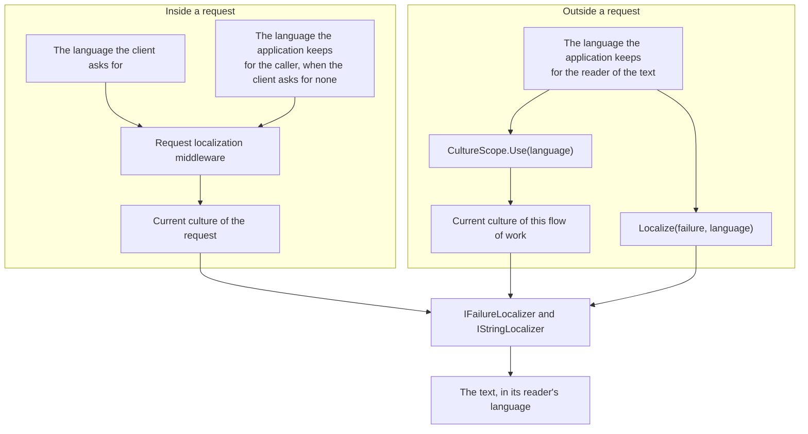

# Localization

A failure the toolkit reports carries three things: a stable **code**, a **message** in the domain's
own words, and the **arguments** that message was built from. `DDDToolkit.Localization` uses the
first and the third to phrase the failure again in the reader's language, at the moment it becomes a
response.

This covers every failure the toolkit hands you: `ValidationError` from a value object or a
FluentValidation validator, `InvariantViolation` from `GetInvariantViolations()` or from
`InvariantViolationException.InvariantViolations` on the throwing path, and `RefusalException` from a
command that was refused.

## The rule: the domain stays language-free

The domain never looks at a culture. An invariant runs on a save in a background job as readily as in
a request, and there is no reader there to ask. So the domain reports *what* is wrong, and the edge
decides *how to say it*:

```text
domain                                   edge
──────                                   ────
Code       "Till.OverLimit"      ──►     looked up in your resx for the current UI culture
Message    "A till holds at most 100…"   kept as the fallback when nobody translated the code
Arguments  { Limit: 100, Cash: 150 }     fill the translated template
```

A failure whose code nobody translated keeps the domain's own message, so adding localization never
makes a response worse than it was.

## Setting it up

```bash
dotnet add package Temp.DDDToolkit.Localization
```

`IFailureLocalizer` itself lives in the core `DDDToolkit` package, so an integration can ask for one
without depending on how translations are stored. `DDDToolkit.Localization` provides the implementation
that reads them through `IStringLocalizer`.

```csharp
builder.Services.AddLocalization();
builder.Services.AddDDDToolkitLocalization(options => options.AddResource<SharedFailures>());

var app = builder.Build();
app.UseRequestLocalization("en", "nl");
```

`SharedFailures` is an empty marker class with `SharedFailures.resx`, `SharedFailures.nl.resx` and so
on beside it, found exactly as `IStringLocalizer<SharedFailures>` finds them. Sources are asked in the
order they were added. `AddLocalizer(IStringLocalizer)` adds one you built yourself, such as one that
reads translations from a database.

The language is `CultureInfo.CurrentUICulture`, which the request localization middleware sets per
request. Numbers and dates inside a message are formatted with `CultureInfo.CurrentCulture`. Where there
is no request, the code that writes the text names the language:
[Texts outside a request](#texts-outside-a-request).

## Writing translations

The key is the failure's code. The value is a template with named placeholders:

```xml
<data name="Till.OverLimit" xml:space="preserve">
  <value>In deze kassa mag hooguit {Limit:C} zitten, en er zit {Cash:C} in.</value>
</data>
<data name="MaximumLengthValidator" xml:space="preserve">
  <value>{PropertyName} is hooguit {MaxLength} tekens lang.</value>
</data>
```

- `{Name}` is replaced by the argument of that name, matched without regard to case.
- `{Name:format}` applies a .NET format string, so `{Limit:C}` is a currency in the current culture.
- `{{` and `}}` are literal braces.
- A placeholder with no value is left as written, so a typo shows on screen rather than as an exception
  on the failure path.

Besides its arguments, a template can name the failure's own members:

| Failure | Placeholders |
| --- | --- |
| `ValidationError` | `{PropertyName}`, `{AttemptedValue}`, `{Code}` |
| `InvariantViolation` | `{EntityType}`, `{EntityId}`, `{Code}` |

An argument of the same name wins.

An invariant violation is looked up as `{EntityType}.{Code}` first and then as the bare code. A rule
shared by several entities can then have one translation, and still get a different one where the
sentence has to differ: `Drawer.NotNegative` beats `NotNegative`.

## Using it

`IFailureLocalizer` phrases one failure. The extension methods phrase a list and keep everything else,
so the result can still be branched on:

```csharp
app.MapPost("/subscribers", (SubscribeRequest body, IFailureLocalizer localizer) =>
{
    if (!EmailAddress.Create(body.Email).TryToValid(out var email, out var errors))
    {
        return Results.ValidationProblem(errors.Prefixed("email").ToErrorDictionary(localizer));
    }

    return Results.Ok(subscribers.Add(email));
});
```

```csharp
var violations = order.GetInvariantViolations();
if (violations.Count > 0)
{
    return Results.UnprocessableEntity(violations.Localized(localizer).Select(v => new { v.Code, v.Message }));
}
```

On the throwing path, `InvariantViolationException.InvariantViolations` holds the same violations,
codes and arguments included, one for one with the phrased `Violations`:

```csharp
catch (InvariantViolationException exception)
{
    return Results.UnprocessableEntity(exception.InvariantViolations.Localized(localizer)
        .Select(v => new { v.Code, v.Message }));
}
```

## Giving a failure its arguments

A template's placeholders are filled from the failure's `Arguments`, so a failure whose message names a
value has to carry that value as well.

### Value objects

A rule you write by hand adds its values next to its message:

```csharp
protected override void Validate(ValidationErrorBuilder errors)
{
    if (Value.Length > 40)
    {
        errors.Add("A street is at most 40 characters.", nameof(Value), "Street.TooLong", Value,
            new Dictionary<string, object?> { ["MaxLength"] = 40 });
    }
}
```

`new ValidationError(...).With("MaxLength", 40)` does the same for a single failure.

With [FluentValidation](fluent-validation.md) you write nothing: every placeholder value FluentValidation knows (`MaxLength`,
`TotalLength`, `ComparisonValue`, `PropertyName`, and anything you add with
`context.MessageFormatter.AppendArgument`) arrives in `Arguments`, and the error code
(`MaximumLengthValidator`, `NotEmptyValidator`, ...) is the key. The same goes for
`result.ToValidationErrors()` on a validator you wrote yourself.

FluentValidation also has its own translations, and they are used for `Message`. But a value object
validates once and caches the verdict, so that message is in whichever language was current *the first
time* anything asked. The localizer phrases the failure when it is read, which is the moment that
counts.

### Invariants

`IInvariant<T>.Check` returns an `InvariantFailure`. A string converts to one, so a rule with nothing
to add returns its message. A rule whose message names values adds them:

```csharp
public partial class Order
{
    public sealed class MustStayWithinTheCreditLimit : IInvariant<Order>
    {
        public const string ViolationCode = "Order.OverCreditLimit";

        public string Code => ViolationCode;

        public InvariantFailure? Check(Order order)
            => order.Total <= order.CreditLimit
                ? null
                : new InvariantFailure($"An order may total at most {order.CreditLimit}.")
                    .With("CreditLimit", order.CreditLimit)
                    .With("Total", order.Total);
    }
}
```

The rule is nested inside the entity it is about, which is where the generator looks for rules to run.
The happy path returns `null` and allocates nothing.

The `CheckInvariants()` seam reports strings, so its violations carry `InvariantViolation.SeamCode`
and have no code worth translating. A rule that needs translating needs a code, which is one more
reason to give it [a type of its own](invariants.md#a-named-invariant).

### Refusals

A command that is refused throws `RefusalException`, with a `Code`, a `Kind` and the `Arguments` its
message names. `IFailureLocalizer.Localize(refusal)` looks it up by its code like any other failure, and
a template can name its arguments as well as `{Code}` and `{Kind}`. The method has a default on the
interface that returns the refusal's own message, so a localizer you wrote before refusals existed keeps
compiling and keeps working. The edge chooses the status from `Kind`: `Invalid` is a 400, `NotPermitted`
a 403, `NotFound` a 404 and `Conflict` a 409.

A refusal of kind `Invalid` that is about one input names that input in the argument
`RefusalException.FieldArgument` (`"Field"`), so a form can put the text under it:

```csharp
throw new RefusalException(
    "subscription.plan-name-invalid",
    RefusalKind.Invalid,
    "A plan's name takes 1 to 40 characters.",
    new Dictionary<string, object?> { [RefusalException.FieldArgument] = "name", ["Max"] = 40 });
```

The value is the domain's word for the input. An edge whose input is called otherwise maps it, the way
`Prefixed("shipTo")` does for a value object's failures. It stays an argument and is no property of the
refusal, because a refusal about a command as a whole has no field to name.

## GraphQL

`DDDToolkit.HotChocolate` has an error filter that does all of the above for you: every failure the
toolkit throws becomes a GraphQL error of its own, with its code in the extensions and its message in
the reader's language. A refusal becomes one error, with its kind in the `kind` extension, and with the
input it names in the `field` extension, which is where a validation failure has its property.

```csharp
services.AddGraphQLServer()
    .AddDDDToolkitTypes()
    .AddDDDToolkitErrors();
```

See [GraphQL](graphql.md#failures-as-graphql-errors).

With `AddDDDToolkitMutationConventions()` a mutation's failures are typed errors in its payload, and
their `message` fields are phrased by the same localizer. Two of those errors have a code of the
toolkit's own, `invalid-value` and `concurrency-conflict`, looked up the way a refusal's code is: give
them a text in your resources and it is what a client reads. See
[Typed errors in mutation payloads](graphql.md#typed-errors-in-mutation-payloads).

## Texts outside a request

A request has a reader, and the middleware has asked which language they read. A mail, a notice, the
result of a job or a line in an export is written with nobody at the other end, and often for someone
other than whoever started the work. The domain still does not look at a culture. The code that writes
the text says whose language it is:



<details>
<summary>Show the code: a mail in its reader's language</summary>

```csharp
// The application keeps a language per reader: their own, else their organization's, else its default.
var language = await readers.LanguageOfAsync(recipient, cancellationToken);

using (CultureScope.Use(language))
{
    mail.Subject = texts["report-ready.subject"];           // IStringLocalizer reads the current UI culture
    mail.Body = texts["report-ready.body", report.Name, report.MadeAt];
}

// One failure, without a scope around it:
var why = localizer.Localize(refusal, language);
```

</details>

`CultureScope.Use(culture)` makes a culture the current culture and the current UI culture until the scope
is disposed, and puts back the two that were current before, also when the work inside throws. It takes a
`CultureInfo` or a culture's name, such as the `"nl"` the application keeps for a reader. Everything inside
the scope reads that culture: `IFailureLocalizer`, `IStringLocalizer`, and the formatting of numbers and
dates.

The current culture belongs to a flow of work. It follows an `await` inside the scope, and work started
inside the scope starts with it. It does not reach work that was running already, and it does not flow
back out of an `async` method to its caller. So open and dispose a scope in one method, with `using`.

For a single failure there is an overload that takes the culture:

```csharp
string Localize(this IFailureLocalizer localizer, RefusalException refusal, CultureInfo culture);
string Localize(this IFailureLocalizer localizer, ValidationError error, CultureInfo culture);
string Localize(this IFailureLocalizer localizer, InvariantViolation violation, CultureInfo culture);
```

Each asks the localizer inside a scope, so a localizer of your own, which reads the current UI culture
like any other, is asked in that culture too.

The same overloads are what an exception handler needs. The request localization middleware sets the
culture inside its own `async` method, further in than the handler, so by the time an exception reaches
the handler that culture is gone and a plain `Localize(refusal)` answers in the server's language. The
choice the middleware made is still on the request, and the handler names it:

```csharp
var culture = httpContext.Features.Get<IRequestCultureFeature>()?.RequestCulture.UICulture
              ?? CultureInfo.GetCultureInfo("en");
problem.Title = localizer.Localize(refusal, culture);
```

## A browser app with its own translations

An application whose front end has translations of its own does not need the server's sentences at all.
What the server and the client agree on is the code and the arguments. The message is what a client
shows when it knows no better.

- **The code is the translation key, as it is.** `subscription.plan-name-invalid` or `Till.OverLimit` is a
  valid key in every common translation format, so the client's file has the same keys as your resx and a test
  can hold the two lists to each other.
- **The arguments fill the client's template.** They arrive by name, as values:
  `{ "Max": 40 }`, `{ "Min": 1, "Max": 200 }`. The client formats numbers and dates
  its own way.
- **The message is the fallback.** A code the client's file does not know yet, because the server was
  deployed first, still shows a sentence in the reader's language when the request said which.
- **`Field` puts the text under its input.** A refusal about one input carries `Field`, and a value
  object's failure its `PropertyName`. In GraphQL both arrive as `field`. A form looks the input up by
  that name, and shows a failure without one at the top.

Send `Accept-Language` from the client anyway. It costs nothing, and the fallback is then in the right
language.

## One module, one resx

Calls to `AddDDDToolkitLocalization()` add up, so each module registers its own translations from its
own composition method and every one of them is asked, in the order the calls were made:

```csharp
public static IServiceCollection AddOrdering(this IServiceCollection services)
    => services.AddDDDToolkitLocalization(o => o.AddResource<OrderingFailures>());

public static IServiceCollection AddShipping(this IServiceCollection services)
    => services.AddDDDToolkitLocalization(o => o.AddResource<ShippingFailures>());
```

## A package's texts under your own codes

A package that ships its texts names each one once, in its own resx. When the codes are yours to choose,
because the package refuses under a prefix per module or per resource, a failure carries your code and the
resx has the package's name for it. Add the resx with the codes that read it: for each code a failure
carries, the name of the entry that holds its text.

```csharp
services.AddDDDToolkitLocalization(o => o.AddResource<SubscriptionFailures>(new Dictionary<string, string>
{
    ["billing.plan-closed"] = "subscription.plan-closed",
}));
```

Only the codes you name are answered, several codes may read one entry, and the same resx can be added
once for each set of codes. [The check](#checking-that-everything-is-translated) follows your codes to the
entries they read, language by language. A package whose codes are yours hands you the map.

### Texts a package's registration offers

A package that knows the codes when you register what they are for can do this for you. Its registration
offers its texts, with the map, and you write no line for them:

```csharp
// In the package's registration: the texts of what this resource refuses with, under the codes it was given
services.AddFailureTexts<MembershipFailures>(rules.Codes.TextKeys);

// In your host: nothing about the package's texts
services.AddDDDToolkitLocalization(o => o.AddResource<SharedFailures>());
```

[Membership](membership.md) offers its texts this way, once for each resource you register, under that
resource's codes.

- **An offer changes nothing by itself.** `AddFailureTexts` is in the core package and registers a
  `FailureTexts`, which only `AddDDDToolkitLocalization` reads. An application that does not phrase its
  failures in the reader's language is given no localizer by a package, and its failures keep their own
  sentences.
- **Your texts come first.** The localizer asks the sources you add, wherever you add them, then every offer
  in the order it was made, then the toolkit's own messages. A text of yours for a package's code is the one
  a reader gets, whether you added it before the package was registered or after.
- **No resx factory is needed for it.** An offer is read from the package's own assembly and its satellites,
  by the marker type's name, whatever folder you keep your own resources in, and without
  `AddLocalization()`. [The check](#checking-that-everything-is-translated) reads an offer as it reads any
  source, under the name of its resx.

## A sample in two languages

The Tenancy sample (`Examples/Tenancy`) answers in English or Dutch, by the request's `Accept-Language` header.
It is the pieces above put together:

- **The texts are beside the codes.** Each module keeps a marker class with its two resource files next to
  the refusals they translate: `Aggregates/Projects/ProjectFailures.resx` and `.nl.resx` beside
  `ProjectRefusals.cs`. The table keeps its English, so the domain reads no resource; the neutral file repeats
  it, and a test holds the two equal.
- **Each module registers its own.** The module's entry calls its application project's registration, and
  that calls `AddDDDToolkitLocalization(texts => texts.AddResource<ProjectFailures>())`. The Tenants module adds
  the package's `TenancyFailures` and the texts of the rules the application added. The host calls
  `AddLocalization()` and adds the texts of the codes it answers itself, first.
- **A code has one text.** Inspections passes three of Projects' codes on, and has no text of its own for
  them.
- **The host chooses the language per request**, from the header and from nothing else
  (`Host/Languages/RequestLanguages.cs`), with `app.UseRequestLocalization()` after tenant selection and
  before authorization.
- **The exception handler names the language.** `RefusalProblems` opens
  `CultureScope.Use(RequestLanguages.LanguageOf(httpContext))` around what it phrases, for the reason given
  under [Texts outside a request](#texts-outside-a-request).
- **GraphQL follows.** The sample's gateway at `/graphql` comes after the same middleware, so the `message`
  of a refusal, in a mutation's payload or as a query's error, is in the request's language too.
- **The UI has a switch.** It keeps the language in its session, shows its own pages from `UiTexts.resx` in
  that language, named with every lookup, and sends it as `Accept-Language` with every call.

Tests keep it whole (`Tests/Examples.Tenancy.Tests/Host/Languages`): every code the host can
answer has a text in both languages, through the localizer the host registered; an entry of one file is an
entry of the other, with the same placeholders; and no Dutch text has a word for the reader. A scenario sends
the same refused request twice and reads it in Dutch and in English, and another reads one refusal, for a
caller without a seat, from a route and from GraphQL.

The Dutch says what is the case or what is needed, never "je" or "u": which of the two fits is an
application's choice, and a text without either is right in both.

## The toolkit's own messages

The toolkit writes four messages itself, and ships them in English and Dutch:

| Code | Where it comes from | Placeholders |
| --- | --- | --- |
| `Unspecified` | a `Validate()` that returned `false` without saying why | `{ValueObject}` |
| `ValueObjectValidator` | `MustBeValid()` in `DDDToolkit.FluentValidation` | `{PropertyName}`, `{ValueObject}` |
| `access.refused` | `ToolkitRefusals.Refused`: a save that a row level security policy denied, refused by `DDDToolkit.EntityFramework` | none |
| `access.role-not-allowed` | `ToolkitRefusals.RoleNotAllowed`: a token whose role is on no list of the host's, refused by `DDDToolkit.EntityFramework.Postgres` before anything runs for it | `{Role}` |

They are asked last, so a key of the same name in your own resx overrides them, and adding another
language is adding those four keys to it.

Override them in every language you support, not only in your neutral resx. `IStringLocalizer` falls
back from `SharedFailures.nl.resx` to `SharedFailures.resx` before the toolkit is asked at all, so an
override in the neutral file alone gives Dutch readers your English text instead of the toolkit's
Dutch. The check below reports exactly that.

## Checking that everything is translated

`FailureTranslations` checks that every failure you expect is translated in every language you support,
so a missing translation fails a test instead of reaching a user:

```csharp
[Fact]
public void Every_failure_is_translated_in_every_language()
    => FailureTranslations
        .Check(localizer, "en", "nl", "de")         // the first is the language of your neutral resx
        .Invariants(typeof(Order).Assembly)          // every IInvariant, found and asked for its code
        .Codes("Street.TooLong", "City.Required")    // codes your value objects report
        .ToolkitCodes()                              // the toolkit's own messages
        .Verify();
```

`localizer` is the one the application registers, taken from a service provider built the way the
application builds it. The check follows each key through each source the way the localizer does at
run time, one language level at a time (`nl-NL`, then `nl`, then the neutral resx), and `Verify()`
throws with a report:

```text
3 failure translations are missing or hidden:

  de     Order.OverCreditLimit            fallsback: readers get SharedFailures.resx's neutral (en) text.
  nl     Nobody.Knows                     missing: no source knows it, so readers get the domain's own message.
  nl     ValueObjectValidator             hidden: SharedFailures.resx has it only in its neutral (en) resx, which
                                          wins over the toolkit's nl text. Add it to the nl resx too.
```

| Problem | Meaning |
| --- | --- |
| `Missing` | No source knows the key, so readers get the domain's own message. |
| `FallsBack` | Nothing translates it into this language, so readers get your neutral text or the toolkit's English. |
| `Hidden` | The toolkit translates it, but your neutral resx wins first. |

Invariants are found for you: every `IInvariant` in the assemblies you name is created and asked for
its code, and either of its two keys counts. Codes your value objects report and FluentValidation's
codes are strings in your code, so name the ones you expect with `Codes(...)`.

`Findings()` returns the same report as a list, for a test that wants to assert something narrower,
and nothing here needs a test framework, so the same check works at startup in development:

```csharp
if (app.Environment.IsDevelopment())
{
    FailureTranslations.Check(app.Services.GetRequiredService<IFailureLocalizer>(), "en", "nl")
        .Invariants(typeof(Order).Assembly)
        .Verify();
}
```
