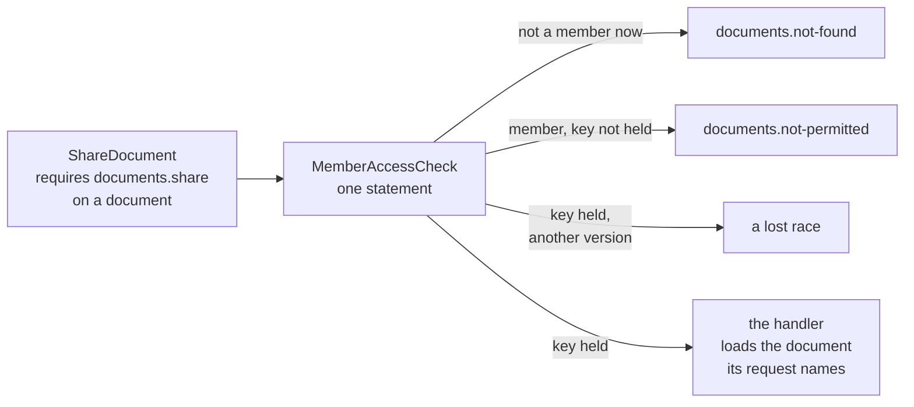
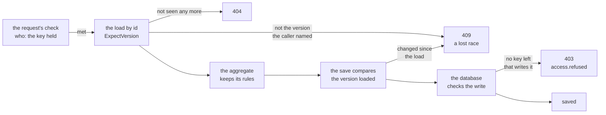
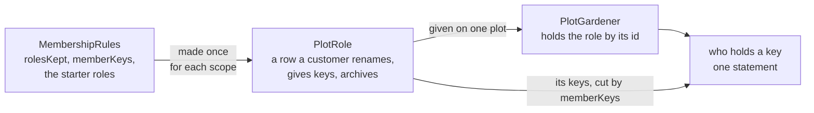
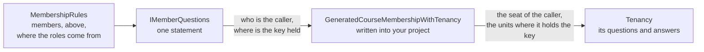
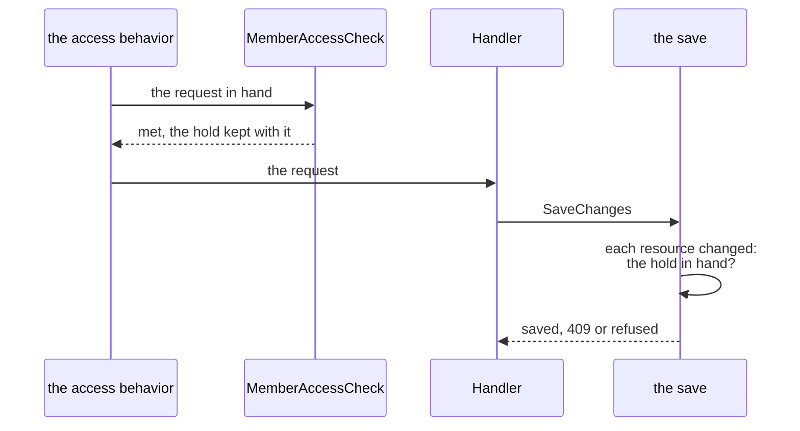

# Membership

> [!NOTE]
> The Membership packages are published as `Temp.DDDToolkit.Supporting.Membership`, `.EntityFramework` and
> `.Postgres`, under a `Temp.` id like [every 3.x package](migrating-to-3.md#the-package-ids), and first as
> prereleases: the names on this page can change until a release that is not one.

Membership is the toolkit's second [supporting domain](writing-a-supporting-domain.md): who may do what on
one **resource**, through being a **member** of it. A document shared with people, a case file with a team,
a folder with its staff: each has members for a period, who hold roles for a period, and one owner who
cannot be lost. The package keeps those rules and answers who holds which key; the resource, its words, its
database and [who may give a role](#who-may-give-a-role-is-yours-to-decide) stay yours.

It comes in three packages:

| Package | What it holds |
|---|---|
| `DDDToolkit.Supporting.Membership` | The member template, the member list with its rules, the role template for [roles a customer makes](#roles-a-customer-makes), the rules of access as one declaration, and the access questions and requirements. No database in it. Its generator writes [the member list](#the-member-list-is-written-for-you) on your aggregate. |
| `DDDToolkit.Supporting.Membership.EntityFramework` | `HasMembers()` and `IsKeptRole()` for your context, two registrations per resource named after it, `AddDocumentMembership()` and `AddDocumentMemberAccess()`, and the access questions answered inside your own statements. Works on every provider. Its generator writes what joins a resource to [Tenancy](#with-tenancy), in an application that has both. |
| `DDDToolkit.Supporting.Membership.Postgres` | The same questions as four SQL functions per resource, for your [row access rules](row-level-security.md#row-access-rules-written-in-c) to ask, and a start-up check. |

It needs nothing else: no dispatcher, and no [Tenancy](tenancy.md). Members are your users, unless you say
[who else they are](#beside-an-organization). In an application that has Tenancy as well, a member can be a
seat, and [what joins the two](#with-tenancy) is written for you.

The [Tenancy sample](../Examples/README.md#the-tenancy-sample) is the worked example of all three beside
Tenancy. Its Projects module keeps a project's crew as members, who are seats, and the project roles each
tenant keeps for its crews, made from three starter roles when a tenant is set up and the tenant's own to
change from then on; the database's functions and lock are written from the same rules.
[Who may do what, in the sample](tenancy.md#who-may-do-what-in-the-sample) walks through it.

## A document and the people it is shared with

The whole of it, for one resource whose members are your users: a document, the people it is shared with,
and one command that shares it. The code below is all there is to write, and it compiles as it stands; the
`using` lines are left out.

**The domain.** The aggregate stays yours, declared as it always was. You declare a **member class** with
the package's template, naming the resource it is a member of, and keep the owner, the members and the codes
on your aggregate:

```csharp
[EntityId<Guid>] public readonly partial record struct UserId;
[EntityId<Guid>] public readonly partial record struct DocumentId;
[EntityId<Guid>] public readonly partial record struct DocumentShareId;

// A member of a document: its row's id, who a member is, what a role is known by, and the resource
[Member<DocumentShareId, UserId, NamedRole, Document>]
public sealed partial class DocumentShare;

[AggregateRoot<DocumentId>]
public sealed partial class Document
{
    public static MembershipCodes Codes { get; } = MembershipCodes.Under("documents");

    public Document(DocumentId id, UserId owner, NamedRole ownerRole, DateTimeOffset now) : base(id)
    {
        OwnerId = owner;
        Members.Open(ownerRole, now);                // the owner is a member, for good, in the owner's role
    }

    public UserId OwnerId { get; private set; }

    public bool Archived { get; private set; }

    public partial IReadOnlyList<DocumentShare> Shares { get; }

    public void ShareWith(UserId user, NamedRole role, MemberPeriod period, DateTimeOffset now, UserId? by)
    {
        if (Archived)                                // your own guard, in front of the member list
        {
            throw new RefusalException("documents.archived", RefusalKind.Conflict, "The document is archived.");
        }

        Members.Add(user, role, period, now, by);    // Members: written for you, over Shares
    }
}
```

`Members` is the document's **member list**, a `MemberList` over `Shares`. You do not declare it: the
package's generator [writes it](#the-member-list-is-written-for-you) from the collection, the owner and the
codes above.

**The rules.** Who holds which key is one declaration, which the code that checks a request and the database
both read: the keys of the resource, every one of which its owner holds, and the roles a member can be given.

```csharp
public static class DocumentMembership
{
    public static MembershipRules Rules { get; } = new(
        "documents",
        keys: ["documents.view", "documents.edit", "documents.share"],
        roles: [new("contributor", ["documents.view", "documents.edit"]), new("onlooker", ["documents.view"])],
        codes: Document.Codes,
        changeMembersKey: "documents.share",
        changeOwnerKey: "documents.share");
}
```

The last two name the key your commands require to change the members and to hand the document on, so a
database that checks every row holds a statement that reaches it past your application to that key as well,
rather than to whatever your own rule lets a caller change of a document
([who writes the member rows](#who-writes-the-member-rows)).

**The wiring.** Your context maps the members, and your services register the resource:

```csharp
public sealed class FilingContext(DbContextOptions<FilingContext> options) : DbContext(options)
{
    public DbSet<Document> Documents => Set<Document>();

    protected override void ConfigureConventions(ModelConfigurationBuilder configuration)
    {
        configuration.AddDDDToolkitConventions();
        configuration.AddFilingConverters();         // your ids, stored by the converters generated for your module
    }

    // Both member tables, owned by the document
    protected override void OnModelCreating(ModelBuilder modelBuilder)
        => modelBuilder.Entity<Document>().HasMembers(document => document.Shares, document => document.OwnerId);
}

public static class FilingModule
{
    public static IServiceCollection AddFiling(this IServiceCollection services, Action<DbContextOptionsBuilder> database)
    {
        services.AddDbContext<FilingContext>(database);                             // your context, on your provider
        services.AddDocumentMembership<FilingContext>(DocumentMembership.Rules);    // the access questions of documents
        services.AddDocumentMemberAccess<IFilingRequest>();                         // their check, for your requests
        services.RequireExplicitCallers();                                          // work that says nothing about who it runs as fails
        return services.AddScoped<DocumentHandlers>();
    }
}
```

`AddDocumentMembership` and `AddDocumentMemberAccess` are generated for your member class and named after
the resource it names. `HasMembers` adds two tables to your model, `DocumentShares` and
`DocumentShareRoles`: add a migration for them, as for any change to it.

**A request and its handler.** A request says what it requires, and its handler changes the document the
request names, which is the one that was checked:

```csharp
public interface IFilingRequest : IRequireAccess;                   // what every request of your module implements

public sealed record ShareDocument(DocumentId Document, UserId With, string Role, DateTimeOffset? Until, long? ExpectedVersion = null) : IFilingRequest
{
    AccessRequirement IRequireAccess.RequiredAccess => MemberAccess.On("documents.share", Document, ExpectedVersion);
}

public sealed class DocumentHandlers(
    FilingContext db,
    MemberAdmission<DocumentId, UserId, NamedRole> admission,
    ICallerAccessor callers,
    TimeProvider clock)
{
    // Writing a document: whoever writes it owns it
    public async Task<DocumentId> WriteAsync(CancellationToken cancellationToken)
    {
        var owner = new UserId(callers.Current.UserId!.Value);
        var ownerRole = await admission.OwnerRoleAsync(cancellationToken);           // "owner", which the rules added
        var document = new Document(DocumentId.CreateSequential(), owner, ownerRole, clock.GetUtcNow());
        db.Documents.Add(document);
        await db.SaveChangesAsync(cancellationToken);
        return document.Id;
    }

    // Sharing one: reached once the check let the request through
    public async Task HandleAsync(ShareDocument command, CancellationToken cancellationToken)
    {
        var role = new NamedRole(command.Role);                                      // "contributor"
        await admission.RequireRoleAsync(role, cancellationToken);                   // one of the roles the rules declare

        var document = await db.Documents.SingleOrDefaultAsync(row => row.Id == command.Document, cancellationToken)
            ?? throw Document.Codes.Of(MembershipRefusals.NotFound);                 // gone since the check
        db.ExpectVersion(document, command.ExpectedVersion);                         // If-Match: a stale version is a 409

        var now = clock.GetUtcNow();
        document.ShareWith(command.With, role, MemberPeriod.Between(now, command.Until), now, by: new UserId(callers.Current.UserId!.Value));
        await db.SaveChangesAsync(cancellationToken);
    }
}
```

Something asks the checks in front of the handler: `AccessChecks<IFilingRequest>.RequireAsync(request)`, one
call from your dispatcher or an endpoint filter, or, with the Mediator library, the behavior the generator
writes for an interface marked `[AccessRequests]`. [Access requirements](access-requirements.md) has both,
and what `IRequireAccess`, `AccessRequirement` and `Checked<T>` are. `MemberAccess.On(key, resource)` is one
of [the requirements every request picks from](access-requirements.md#the-vocabulary), beside the toolkit's
`AccessRequirement.SignedIn()` and the rest, and Tenancy's `TenancyAccess.InTenant()` and the rest: a request
of a module with members says which, and none leaves it to a package. With the behavior, `AddDocumentMemberAccess`
also brings the start-up check that the behavior is in the pipeline, and a handler called past it is a warning;
see [When nothing asks the checks](access-requirements.md#when-nothing-asks-the-checks).



<details>
<summary>Show the code: what the check does</summary>

```csharp title="MemberAccessCheck<Document, DocumentId>.RequireAsync, shortened"
case MemberAccess<DocumentId>.On required:
{
    // The caller's own refusal when it is nobody, then not-found, then not-permitted: one statement
    var hold = await questions.RequireAsync(required.Resource, required.Key, cancellationToken);

    // Only now, with the document seen and the key held, so a caller without access learns nothing from a version
    if (required.ExpectedVersion is { } expected && expected != hold.Version)
    {
        throw new ConcurrencyConflictException(typeof(Document), required.Resource);
    }

    kept.KeepFor(request, hold);                    // for the expert hold; the handler takes nothing of it
    break;
}
```

</details>

**Who is calling.** `RequireExplicitCallers()` is there because of who holds every key: the application
itself. Work that says nothing about who it runs as counts as the application, so a host that never
[says who is calling](row-level-security.md#running-queries-as-the-caller) would let every request through.
With it such work [fails instead](row-level-security.md#fail-closed-callers), and a request reaches the
questions only as the caller your host began.

**Why each piece is yours to write.** The package knows nothing of your resource but what these lines say:

| You write | Because |
|---|---|
| `DocumentShareId` | A member row is a child entity of your aggregate, and a child entity has an id: what its table is keyed by, beside the document. |
| The member class, in one line | It is your class and your table, and the place for what only you know of a member: a property, or a rule about it. |
| `NamedRole` in it | What a member holds a role by: a name, where the rules declare the roles, and an id, where [roles are rows](#roles-a-customer-makes). |
| `OwnerId` | The owner is a column of your resource. The statement that answers who holds a key reads it there, and so do the database's functions, so the member list is handed it and keeps no copy. |
| `Shares` | Members live inside your aggregate: loaded and saved with it, under its one version. |
| `Codes` | What a client reads when a rule about the members refuses: `documents.already-member`. The aggregate needs only the codes, so the rules, with their keys and roles, stay out of your domain. The rules take the same codes, so a request is refused under them as well. |
| `ownerRole` and `now` in the constructor | The aggregate reads nothing and knows no rules. Which role is the owner's is the rules' to say, so the use case asks, `OwnerRoleAsync`, and hands it in, with the time. |
| Your guard in `ShareWith` | It is the whole hook: a document that changes no more simply does not call the member list. |
| The rules' name, keys and roles | The name is what the resource's functions in the database are named after. The keys are what is asked about on a document, and its owner holds every one: a key that is in no list is held by nobody, and a role that lists a key the rules do not state is refused where they are declared. |
| `HasMembers(shares, owner)` | The model is your context's to build. The owner is said once more because the mapping reads no code of your aggregate: it marks the column the access statement reads. |
| `AddDocumentMembership<FilingContext>(rules)` | Closed over your classes already. Which context maps the document, and which rules apply, only you know. |
| `AddDocumentMemberAccess<IFilingRequest>()` | A check is added for one request interface, and a module may have several resources, or ask about another module's: this says whose requests the document's check decides. |
| `IFilingRequest` | What tells your module's requests from another's: the [checks are registered for it](access-requirements.md#what-a-request-declares). |
| `RequiredAccess`, explicitly, with `ExpectedVersion` | Which key a command takes is yours to say. Explicitly, so it is no field of the request. The version is the one the caller read, for a command that sends it: it is compared after the key, so a caller without access learns nothing from it. |
| `MemberAdmission<DocumentId, UserId, NamedRole>` in the constructor | Membership's use cases are small classes generic over your ids alone, three at most, so they read where they are taken, and a module with several kinds of resource names each one's by its own ids. None is nested in one class over your classes, as Tenancy's use cases are, so there is no class named after your module to name them through, and no alias to write ([Calling a use case](tenancy.md#calling-a-use-case)). |
| `RequireRoleAsync` in the handler | The member list takes any role: it cannot know which roles there are. `MemberAdmission` asks the rules, and, where you registered them, whether the one to be made a member is known (`RequireMemberAsync` and an `IMemberDirectory`) and whether a role goes to a member at all (`IMemberRolePolicy`). |
| `ExpectVersion` after the load | The check and the load are two statements. The version the caller named is held again where the handler loads, so a change in between is a lost race; a caller that named none asked for the document as it is. The rest is there already ([from the check to the save](#from-the-check-to-the-save)). |

### The member list is written for you

`Members` is a private property the package's generator writes on the resource a member class names. Every
part of it is said elsewhere already, the four types by the member class and the rest by the resource, so
you write your own methods and guards over it, and not the line itself.

<details>
<summary>Show the code: what the generators write for the document</summary>

```csharp title="Document.Members.g.cs"
partial class Document
{
    private global::DDDToolkit.Supporting.Membership.MemberList<global::Filing.DocumentShare, global::Filing.DocumentShareId, global::Filing.UserId, global::DDDToolkit.Supporting.Membership.NamedRole> Members
        => new(_shares, OwnerId, global::Filing.DocumentShareId.CreateSequential, Codes);
}
```

```csharp title="MembershipEntityFrameworkServiceCollectionExtensions.*.Registration.g.cs, shortened"
internal static partial class GeneratedMembershipEntityFrameworkServiceCollectionExtensions
{
    public static IServiceCollection AddDocumentMembership<TContext>(this IServiceCollection services, MembershipRules rules)
        where TContext : DbContext
        => MembershipEntityFrameworkServiceCollectionExtensions.AddMembership<DocumentShare, DocumentShareId, UserId, NamedRole, TContext, Document, DocumentId>(services, rules);

    public static IServiceCollection AddDocumentMemberAccess<TRequests>(this IServiceCollection services)
        where TRequests : class, IRequireAccess
        => MembershipEntityFrameworkServiceCollectionExtensions.AddMemberAccess<Document, DocumentId, TRequests>(services);
}
```

</details>

It is written from four things the resource declares, and only when each is the only one of its kind there,
so that nothing is guessed: the get-only `partial` collection of the member class, the property of what a
member is known by (`UserId` here) that is the owner, `CreateSequential` of the member class's own id, and
the static `MembershipCodes`. [DDD00059](diagnostics.md#ddd00059) lists each with what stands in its way,
and says which it is when the list is not written.

For every other shape you write the list yourself, on the resource, and the generator leaves a resource that
declares one alone: a resource with two properties of the member's id, a member row keyed by something else
than a `Guid`, codes kept in a class of their own, a collection that is itself called `Members`.

```csharp
private MemberList<DocumentShare, DocumentShareId, UserId, NamedRole> Members
    => new(_shares, OwnerId, DocumentShareId.CreateSequential, DocumentRefusals.Membership);
```

`_shares` is the field the toolkit keeps `Shares` in. A resource that has no list, and cannot be given one,
is told what stands in the way when it is built: [DDD00059](diagnostics.md#ddd00059).

## From the check to the save

The check runs before the handler, and the handler loads, changes and saves after it. Between the two, other
requests go on: somebody renames the document, takes a role from the caller, revokes what reached it from
above. What holds a change through that, on the default path, is what is already there, each doing one thing:



1. **The request's requirement**, `MemberAccess.On(key, document, ExpectedVersion)`, before the handler: who
   may, and, where the caller named the version it read, that the document is still at it.
2. **The load by id.** The handler loads the document its request names, which is the one that was checked,
   and holds it to the version the caller named, with one line: `db.ExpectVersion(document, command.ExpectedVersion)`.
   A document changed between the check and the load is the same 409 as at the check. A caller that named no
   version asked for the document as it is, and gets it.
3. **The save** compares the version it loaded, so a change between the load and the save is a lost race too.
4. **The aggregate's own rules** keep the document right, whatever version it is at: an archived document
   takes no member, the owner stays.
5. **The database**, where it checks every row as the caller ([on Postgres](#on-postgres-the-second-lock), with
   row level security forced), checks the write once more. A caller that lost every key that writes the
   document since the check is refused there, `access.refused`, 403, and nothing is written; one the
   document is hidden from by then finds none to load, 404.

So permission is about who, and the version is about what the caller read. How the caller holds the key, and
until when, a rule of yours [asks the questions for](#who-may-give-a-role-is-yours-to-decide), in one
statement.

<details>
<summary>Show the code: the handler, and a store that loads with the version</summary>

```csharp
// The handler, with the context: two lines for the load
var document = await db.Documents.SingleOrDefaultAsync(row => row.Id == command.Document, cancellationToken)
    ?? throw Document.Codes.Of(MembershipRefusals.NotFound);
db.ExpectVersion(document, command.ExpectedVersion);       // none named: nothing to compare

// Or behind a store of yours, which the handler calls in one line:
// var document = await store.LoadAsync(command.Document, command.ExpectedVersion, cancellationToken)
//     ?? throw Document.Codes.Of(MembershipRefusals.NotFound);
public async Task<Document?> LoadAsync(DocumentId id, long? expectedVersion, CancellationToken cancellationToken)
{
    var document = await db.Documents.SingleOrDefaultAsync(row => row.Id == id, cancellationToken);
    if (document is not null)
    {
        db.ExpectVersion(document, expectedVersion);
    }

    return document;
}
```

</details>

What happens to a rename of the Tenancy sample's projects, with a change played between its check and its
handler, on Postgres with the policies forced (`AccessHoldScenarios`):

| Between the check and the handler | The rename |
|---|---|
| the caller's role that gave the key is taken | 403 `access.refused`: the database refuses the write |
| what reached the project from above is revoked, or the project moved out of reach | 404: there is none to load |
| somebody else renamed it, and the caller named the version it read | 409, at the load |
| somebody else renamed it, and the caller named no version | saved: the last write wins, which is what a caller that names no version asks for |
| the project moved to a place where the caller still holds the key | saved: who the caller is did not change |

What the default path does not do, in plain sight:

- **The database checks what its policies say, and nothing finer.** A policy that lets any key that writes a
  row through lets a caller through that lost the command's own key and kept another one between the check
  and the save. Write the policy per key where that matters.
- **A handler reached around its checks** is held by the database alone, to what its caller may: a caller
  that may do it does it. Whatever sends your requests asks the checks; a test can hold that. A save your
  handler runs as the application's own work is held by no row rule at all, so begin that work only for a
  request whose check let it through: `RequestInHand.Current.Request` is then that very request
  ([the request in hand](access-requirements.md#the-request-in-hand)), as in the Tenancy sample's
  `OwnPlaceOnTheCrew`.
- **The save is not tied to the version the check read.** For a caller that named no version, a change
  between the check and the load is the last write that wins. [The expert hold](#the-expert-hold) ties it, and
  refuses a handler reached around its checks, with one line.

## Who may give a role is yours to decide

The package keeps the members and answers who holds which key. Adding a member, giving or taking a role
and handing a resource to another owner are yours to allow: the package has no key of its own for any of
them, and no rule about who gives what to whom. Each of your commands requires what you choose.

**A key on the resource.** The usual rule, and one line on the request: the one `ShareDocument` has above.
Whoever holds `documents.share` on the document shares it, with anyone, in any role, for as long as they
say. The owner holds every key of the resource, so the owner may. A member may when one of its roles gives
the key, which is your rules' to say.

**A rule of your own.** Anything further you write in the handler. The questions say until when the caller
holds the key, in one statement, so "nobody gives a role for longer than they hold the key themselves" is a
few lines:

```csharp
public sealed record AdmitStaff(FolderId Folder, StaffCode Staff, NamedRole Role, DateTimeOffset? Until, long? ExpectedVersion = null) : IFilingRequest
{
    AccessRequirement IRequireAccess.RequiredAccess => MemberAccess.On("folders.staff", Folder, ExpectedVersion);
}

// In the handler:
var hold = await questions.RequireAsync(command.Folder, "folders.staff", cancellationToken);   // IMemberQuestions<FolderId>
if (hold.Until is { } mine && (command.Until is not { } theirs || theirs > mine))
{
    throw new RefusalException("folders.longer-than-held", RefusalKind.NotPermitted,
        "Nobody is put on a folder for longer than you hold the key to put them there.");
}

await admission.RequireMemberAsync(command.Staff, cancellationToken);   // MemberAdmission<FolderId, StaffCode, NamedRole>
await admission.RequireRoleAsync(command.Role, cancellationToken);
var now = clock.GetUtcNow();
folder.Admit(command.Staff, command.Role, MemberPeriod.Between(now, command.Until), now, by);
```

- **`MemberHold.Until`** is the first moment the caller no longer holds the key, as its membership and its
  roles stand now. It has no end, `null`, for the owner and for the application's own work. For a key that
  being a member gives it is the end of the membership; for a key a role gives, the end of the last role
  that gives it now, or of the membership if that ends sooner. For a key held from above, see
  [held from above for as long as it is seen](#beside-an-organization).
- **The package applies no rule of its own here.** Not "no further than your own hold", and not "never to
  yourself": a caller who passes what your command requires gives what your handler lets it give.
- **How the caller holds the key,** `MemberHold.Via`, is in the same answer, for a rule about that.

## What the package keeps

- **A member is on the list once, for a period.** A membership that ended is over: the member comes back
  with a new one, without the roles of the old. One that still runs, or is still to start, is the member's
  one membership: adding the member again is refused, whenever the new one would start. `Add` and `GiveRole`
  take the moment they are called at for that, next to the period: what has ended by then is replaced, and
  nothing else.
- **A member holds each role once, for a period of its own.** A role counts only while its membership does.
- **There is one owner,** always a member, with no end, in the owner's role. The owner cannot be removed,
  or lose that role, until somebody else is named owner.
- **An owner's place has no end, and keeps none.** Naming an owner takes away the end the new owner's membership
  had, and handing the resource on again does not put it back: somebody who was on a resource for a week
  and owned it for a day is on it for good. What its roles gave, they give no longer than before: a role
  with no end of its own, or one that ran past the membership's end, stops where the membership would have.
  The same holds for a start: somebody who was to come next month is a member from the day they are named,
  and their roles count no sooner than they were to. `NameOwner` answers what it changed (`OwnerNamed`):
  whether the membership began anew, the roles that went, the end it lifted, `EndLifted`, and the start it
  moved, `StartMoved`. Keep the end, and take the member off the list then, if a former owner is to leave
  when they would have.
- **Members live inside your aggregate.** They are loaded and saved with it, under its one version, so
  `If-Match` on the resource covers its members. Your own guard runs in front of every change, and you
  raise your own events from what the member list answers: the package raises none.
- **Refusals carry your codes.** `MembershipCodes.Under("documents")` gives `documents.not-found`,
  `documents.already-member` and so on; `With` renames one, and `WithMemberArgument("Staff")` names the
  argument a refusal carries the member in.
- **The texts come with the registration.** English and Dutch, under your codes: registering a resource
  offers them to your [failure localizer](localization.md#texts-a-packages-registration-offers), so an
  application that calls `AddDDDToolkitLocalization()` adds no line for them, and one that does not is given
  nothing. A text of your own for one of these codes is asked first.

Two rules are about the whole list, so the member list has a check for each, `OneMembershipPerMember()` and
`OwnerStays()`. The list refuses both before anything changes. Two invariants of your aggregate that call
the checks are a net under code that changed the collection some other way, and are yours to add or to
leave out:

```csharp
// Nested in Document, so they run whenever the document is checked, under the document's own codes
public sealed class OneSharePerUser : IInvariant<Document>
{
    public string Code => Codes[MembershipRefusals.AlreadyMember];

    public InvariantFailure? Check(Document entity) => entity.Members.OneMembershipPerMember();
}

public sealed class OwnerKeepsAPlace : IInvariant<Document>
{
    public string Code => Codes[MembershipRefusals.OwnerProtected];

    public InvariantFailure? Check(Document entity) => entity.Members.OwnerStays();
}
```

For a screen that lists the members of a resource, `MemberOverviews.Of(document.Shares, document.OwnerId, now)`
puts them in the one order every answer lists members in: the owner first, then by when each membership
starts, each with its roles and whether they count now. It reads nothing.

## Who holds a key

| The key is | Held by |
|---|---|
| a key of the resource (`keys`) | the owner, by owning the resource, with no end |
| given by a role (`roles`, or the role's row where [a customer makes the roles](#roles-a-customer-makes), cut by `memberKeys`) | a member now, holding that role now |
| the one being a member gives (`seeKey`) | every member now, whatever roles it holds |
| held where the resource sits, or above it (`above`) | whoever you answer holds it there |
| any key | the application itself, and its work in a scope the rules name (`systemScopes`) |

The owner's role is the owner's place on the member list, and a role like any other: whoever else is given
it holds what it gives. Rules that name no owner's role, as the document's do, get one added: `owner`, which
gives every key of the resource, so no key is the owner's alone then. To keep a key to the owner, declare
the owner's role yourself, `ownerRole: "keeper"` with a role of that name among `roles` that leaves the key
out, or leave the key out of what a member's role gives:
`memberKeys: MemberKeys.AllBut("documents.hand-over")`. A key of the resource that no role gives is the
owner's alone.

`seeKey` is the one key that being a member gives by itself. The document's rules name none: a member sees
the document all the same, and holds on it what its roles give.

A caller who is neither a member now nor the owner does not see the resource, unless it holds the key that
sees it [from above](#beside-an-organization): `not-found`, exactly as for one that does not exist. A caller
that sees it and does not hold the key is `not-permitted`, naming the key. A version that is not the one the
caller read is compared last.

Who the caller is as a member comes from the rules: `MemberSource.CallerId`, the user id of its token, for a
member id over a `Guid`, `MemberSource.Claim("app_metadata.staff")` for one over a text, or
`MemberSource.Resolved()` for [an id you resolve yourself](#beside-an-organization). Only a signed-in
user is anybody's member, or holds anything from above: a caller who did not sign in reaches nothing, and
nothing is read for it. The same goes for one whose token lacks that id or claim, where nothing above
reaches the resource.

Work in a scope, `Caller.SystemIn("billing")`, is not the application itself. It is nobody's member and
holds nothing on a resource, unless the resource's rules name that scope: `systemScopes: ["documents"]`,
which a module says for the work it does on its own resources. Another module's work is not above your
rules.

## Inside your own statements

`IMemberQuestions<DocumentId>` answers one resource (`HoldAsync`, and `RequireAsync` and `ViaAsync` over it) and
many (`KeysOnAsync`, the keys held on up to 200 resources), each in one statement. For your own queries it
hands out a **reach**, which you put into the query, so a list is one statement and never ids fetched
first:

```csharp
// The query that lists: nothing is refused, the statement leaves out what the caller does not reach
public sealed record ListDocuments : IFilingRequest
{
    AccessRequirement IRequireAccess.RequiredAccess => MemberAccess.SeenWith<DocumentId>("documents.view");
}

var seen = questions.Reach("documents.view");                    // IMemberQuestions<DocumentId>
var page = await db.Documents.Within(seen).OrderBy(document => document.Id).Take(20).ToListAsync(cancellationToken);

// Your own columns next to how a key is held and until when, for what you tell another module about a document
var act = questions.Reach("documents.edit");
var answer = await db.Documents.Where(document => document.Id == id)
    .Within(seen)
    .Reached(act)
    .Select(found => new { found.Resource.Archived, found.AsMember, found.FromAbove, found.Until })
    .FirstOrDefaultAsync(cancellationToken);
var via = answer is null ? null : act.Via(answer.AsMember, answer.FromAbove);

// What the caller may do with each row of a page
var keys = await db.Documents.Where(document => ids.Contains(document.Id))
    .KeysOn(questions.KeyReach(["documents.edit", "documents.share"]))
    .ToListAsync(cancellationToken);
```

A query declares `MemberAccess.SeenWith(key)`: the checks [fail closed](access-requirements.md#what-answers-it),
so a request that declares nothing is stopped, and this is what a list declares. It refuses nobody for want
of the key. The reach is the filter. So it is a query's to declare: on a command it lets the handler run
unchecked, which a test of yours can hold ([holding it with a test](access-requirements.md#holding-it-with-a-test)).
A caller who did not sign in reaches nothing under any rules, so the check refuses it, `documents.not-permitted`
naming the key, and the query's statement is never sent: a database that checks every row may refuse that
caller's role your schema outright rather than answer nothing. With [Tenancy](#with-tenancy), a list that
declares `SeenWith` asks nothing of Tenancy: a caller who names no tenant gets an empty list, where a command,
which declares one of Tenancy's cases, is refused with `tenancy.tenant-required`.

The questions read on a context of their own where you registered a factory for the context (a pooled one
with `AddScopedFromPool`), since the questions of one request may be asked side by side, and otherwise on
the request's context. Where the resource, or the role class of [roles a customer makes](#roles-a-customer-makes),
has a query filter that reads a member of your context, they read on the request's own context instead: a
rule you keep on that context is one a context made for one reading knows nothing of. A filter that reads
what is around the work, as [Tenancy's](tenancy.md) does, holds on every context.

A reach is data: it goes into a query on whichever context you run it. One kind is told which context that
is, a reach that puts a query of its own into yours: the rows of [roles a customer makes](#roles-a-customer-makes),
or [an answer of yours](#beside-an-organization). On the request's own context nothing more is said; a query
on a context made for one reading hands that context over, `db.Crates.Within(reach, db)`.

## Several kinds of resource

An application with documents and folders declares a member class, rules and a `HasMembers` call for each,
and registers each. Everything is asked for by the resource, so neither touches the other: its own tables,
codes, functions, member list, `IMemberQuestions<FolderId>` and `MemberAdmission<FolderId, StaffCode, NamedRole>`.
The module's one request interface takes a check per resource.

Each member class names its resource, and the registrations are
[named after it](writing-a-supporting-domain.md#a-registration-named-after-what-it-is-for), with one member
class in a project as with several. A second resource changes no call that was there:

```csharp
[Member<FolderMemberId, StaffCode, NamedRole, Folder>]
public sealed partial class FolderMember;

services.AddDocumentMembership<FilingContext>(DocumentMembership.Rules);
services.AddDocumentMemberAccess<IFilingRequest>();
services.AddFolderMembership<FilingContext>(FolderMembership.Rules);
services.AddFolderMemberAccess<IFilingRequest>();
```

A resource has one member class: two that name the same resource are refused when the project is built
([DDD00045](diagnostics.md#ddd00045)), and so is a member class that names something that is no aggregate
root of yours, a child entity included ([DDD00050](diagnostics.md#ddd00050)). Either is said once, on the
member class to fix, and a domain project without the registrations hears it as
[DDD00060](diagnostics.md#ddd00060); the list of the class the resource keeps is written all the same.

`HasMembers` takes your names for the two tables and for the member's column:

```csharp
modelBuilder.Entity<Folder>().HasMembers(folder => folder.Staff, folder => folder.Keeper,
    new MemberTableNames("FolderStaff", "FolderStaffRoles", MemberColumn: "StaffCode"));
```

Both tables are kept under the resource's whole key. The parts a resource declares with
[`[KeyPart]`](composite-keys.md) are carried into them, each under its own name. A key you give with
`HasKey` is said before `HasMembers`: one said afterwards does not reach the member tables, and is refused
where the mapping is read.

## On Postgres: the second lock

`DDDToolkit.Supporting.Membership.Postgres` writes four functions per resource, under the names its rules
give them (`MembershipFunctions`): the resources the caller is a member of, those where it holds a role
that gives a key, those it sees, and those it holds a key on, as a member, as the owner or from above. They
answer what the access questions answer, from the same rules. What a caller reads and changes of a resource
is yours to say, in [row access rules](row-level-security.md#row-access-rules-written-in-c) that ask the
functions, and the member tables follow the resource's rules, as every table of an aggregate's entities does.

Membership brings nothing to a context's options: the member tables are your context's own, and so is the way it
is wired. A context wired with `UseDDDToolkit` runs as its caller once row level security is registered, so these
policies hold it with nothing more to write, and with [Tenancy](#with-tenancy) it has Tenancy's save check as well
([`UseDDDToolkit`](entity-framework.md#usedddtoolkit)).

```csharp
// The project that runs the export: one class per resource, with the rules it is registered with
[assembly: UseRowAccessContribution(typeof(DocumentMembershipFunctions))]

public sealed class DocumentMembershipFunctions() : MembershipRowAccessContribution<DocumentShare>(DocumentMembership.Rules);

// Your questions for them: the owner is the rules' name, the names are the rules' own
[AccessFunctions(Owner = "documents")]
public static partial class DocumentQuestions
{
    [AccessSet("documents_i_see")]
    public static partial AccessSet<DocumentId> Seen();

    [AccessSet("documents_where_i_hold")]
    public static partial AccessSet<DocumentId> HeldOn(string key);
}

[RowAccess<Document>(RowOperations.Read, To = [RowAccessRoles.User])]
public static partial class UsersReadTheDocumentsTheySee
{
    public static bool Allows(Document document, Caller caller) => DocumentQuestions.Seen().Contains(document.Id);
}

// Where the resources are registered: the package's start-up check of the database
services.AddMembershipPostgres();

// The host, before it serves anything: every check the registrations brought, this one among them
services.RunStartupChecks();
```

- **The class is yours to list** because the export writes into your migrations only what the project that
  runs it lists: the migrations run as the role that owns your tables, so nothing a reference offers gets
  there without your say ([policies a package ships](row-level-security.md#policies-a-package-ships)). It
  hands over the rules, which only your application has, and it is one line.
- **The questions are yours to declare** because a rule is written into a policy when the project is built,
  and the generator translates `Seen().Contains(document.Id)` from a declaration it can read. The names are
  the rules' own, and the export refuses a question whose function nothing it is written with defines.
- **The functions** run as their owner with an empty search path, and only the database roles the rules
  name may ask them (`grantTo`, signed-in users unless you say otherwise). Whether a period applies is asked
  of the database's clock. The application's own work in a scope the rules name is answered every resource,
  as in C#, where that work's role is one of `grantTo` (`RowAccessRoles.SystemIn`).
- **The check** is the [start-up check](startup-checks.md) `membership.functions-in-place`, which
  `AddMembershipPostgres()` brings and the host runs with its other checks, after the migrations';
  `MembershipPostgresChecks.EnsureFunctionsAreInPlaceAsync` is the same by hand. The call is the only thing that
  brings it: what the package writes reaches the database through the export, so nothing else of it is
  registered at run time, and a host that leaves the call out runs its other checks and not this one, without a
  word. Make it where the resources are registered, next to the registration of each. It refuses a database that
  lacks a function of any registered resource, or has one that does
  not run as its owner, has no empty search path, answers no set, was written from other rules than the
  resource is registered with or by another version of the package, may be executed by every role or by one
  the rules do not name, or may not be executed by a role the rules name. It reads the line of a function's
  body that names its rules: a body rewritten by hand under that line is not found. A contribution you
  forget to list writes nothing. With one resource the build warns
  ([DDD00054](diagnostics.md#ddd00054)); with several, one listed class is enough for the build, and this
  check is what finds the resource whose class is missing.

### Who writes the member rows

That the member tables follow the resource's rules has a consequence. A row knows no command: whoever your
rule lets change a resource writes its member rows and its owner column, by any statement that reaches the
database, past the check in front of your handler. Somebody who only edits a document could give itself a
role on it, or make itself its owner, and an owner holds every key. So the rules name the keys your
commands require for that, and the package writes a lock from them:

```csharp
public static MembershipRules Rules { get; } = new(
    "documents",
    keys: ["documents.view", "documents.edit", "documents.share"],
    roles: [new("contributor", ["documents.view", "documents.edit"]), new("onlooker", ["documents.view"])],
    codes: Document.Codes,
    changeMembersKey: "documents.share",        // what your commands that change the shares require
    changeOwnerKey: "documents.share");         // what your command that hands a document on requires
```

| The rules name | The database then holds |
|---|---|
| `changeMembersKey` | a restrictive policy on both member tables: a row is added, changed or removed only on a resource the caller holds that key on, or the key that changes the owner, since naming an owner writes member rows too |
| `changeMembersKey`, where the [roles are kept](#roles-a-customer-makes) | a second restrictive policy on the table of the roles a member holds: a role added or changed there is one the caller sees in your role table, asked as the caller, so your rules on that table decide which |
| `changeOwnerKey` | a trigger on the resource's table: a statement that would leave a row with another owner is refused, as a policy refuses, unless the caller held that key on the resource before. A new row had no owner before, so whom it names is your rule about adding a resource to hold |
| `above:`, with either key | nothing about where a resource sits: the lock asks what the caller holds where the resource sits when the statement runs, so the column that says where is yours to hold |

- **You still decide who may.** The two entries are what the database is told, and nothing else: no code
  of the package gates a command by them, and your commands declare what they require as before.
- **What decides who holds a key, the lock takes as the rows say it.** Three columns are yours to hold,
  since who may change them is your decision and not the package's:
  - *The owner of a new resource.* Your rule about adding one says whom a caller may name: ask that the
    owner is the caller unless the caller may name owners, as your command does. The sample's
    `SeatsOpenProjectsWhereTheyMay` asks that.
  - *Where a resource sits*, for one [reached from above](#beside-an-organization). Whoever your rule lets
    change the resource could move it, by a statement of its own, to a place where it holds the key that
    changes the owner or the members, and use the key there. Hold the column with a trigger of your own, as
    the sample's `UnitChangesWithItsKeys` does, or leave it out of what callers may change.
  - *Who may be put on a member list.* Who a member's row is of is fixed once it is there (`HasMembers`
    maps it so, and the exported privileges leave it out of UPDATE), but who is added is your rules'. The
    sample's `CrewSeatsOfTheProjectsTenant` adds a crew member only for a seat of the project's tenant.
- **The resource's other columns follow your rule for changing it.** The lock holds the member rows and the
  owner column. Every other column of the resource is written by whoever your rule lets change the resource,
  and that rule asks for any key that changes it, since a row knows no command: in the sample, a seat that only
  manages a project's crew may change the project's row, because adding a member bumps the project's version.
  Where a column's command asks a stricter key than that, hold the column with a
  [column rule](row-level-security.md#column-rules), a rule with `Columns` that asks the functions for the key
  the command asks: the sample's `NameAndPlanChangeWithTheEditKey` holds a project's name and planned days to
  `projects.edit`, and `StateChangesWithTheCloseKey` its state to `projects.close`. The owner column stays the
  lock's, written from the key the rules name with nothing of yours, and held by the start-up check below; a
  column rule of your own on it would hold it a second time.
- **It narrows, and allows nothing.** The lock is for the database roles of `grantTo`, on top of your own
  rules. Reading stays what your rules say. The application itself and the role that owns the tables are
  not held by it.
- **It holds the roles that can hold a key, and no other.** A database role outside `grantTo` cannot ask
  the functions, so it holds no key, and the lock is not written for it. Where a rule of yours lets such a
  role change the resource, a token role of its own say, that role writes the member rows and the owner
  column as your rule lets it: name it in `grantTo`, or let it change the resource only through the
  application.
- **Rules that name neither** leave the member rows and the owner column to your own rule about changing
  the resource. The start-up check then says so, a line for each such resource, returned and logged as a
  warning, and refuses nothing. That is sound where your rule admits exactly who may change the members
  and name the owner, or where no caller reaches the database past your application. Naming the key for
  the members without the one for the owner leaves a way round: whoever makes itself owner holds every key.
- **A refusal of the lock reaches your caller as `access.refused`.** A policy's refusal is read as every
  policy's is, and the trigger refuses as the toolkit's access guards do: `42501`, its own name as the constraint
  (`documents_owner_stays`), and the toolkit's hint. A save it refuses, from a handler whose caller lost the key
  between the check and the save say, is a `RefusalException` with that code, a 403, and a warning that names
  the trigger; see [When the database refuses](row-level-security.md#when-the-database-refuses).
- **The check holds the lock too:** a database where a policy of the lock is gone for a role, or the
  trigger is disabled, is refused at start-up. So is one where kept roles have lost the trigger that keeps
  the owner's role in use.
- **Each statement is asked as it runs,** as every policy is. A resource is opened with its owner on the
  list, and those rows pass like any other. The owner sees the resource from the moment its row names it, so
  a read rule that asks `Seen()` lets the owner write the member rows of a resource it has just opened, in the
  same save; and an owner holds every key the rules state, so state the key
  that changes the members among them where a caller opens a resource as itself. And an owner that hands
  its own resource on, holding the keys by owning it alone, holds them no longer once the owner column has
  changed: the rows a hand-over writes after that are not its to write, under the lock or under a rule of
  yours that asks what the caller holds. Somebody who holds the key through a role, or
  [from above](#beside-an-organization), hands a resource on as itself. An owner's own hand-over is saved
  as the application's own work, once your command's check let it through: the handler knows that by the
  [request in hand](access-requirements.md#the-request-in-hand), `RequestInHand.Current.Request` being its command,
  and saves as the caller otherwise.
- **For a resource the database checks.** On a resource with no row access rules of yours the lock's
  policies would be the only ones on the member tables, and nobody would read a row of them.

## Beside an organization

A resource often stands beside something that knows people already: an organization with places for its
people, roles of its own and units in a tree. A resource's roles do not have to come from there, and
neither does anything else. The rules say three things apart from each other. Each has the default a
document has, and any of the one goes with any of the others:

| The rules say | Left out | Said, and what you answer then |
|---|---|---|
| **Who a member is** | the caller's own id, or a claim (`members`) | `members: MemberSource.Resolved(...)`: an id you resolve for the caller, such as its place in the organization. You answer it with an `ICallerMember<TResourceId, TMemberId>`. |
| **Where the roles come from** | declared in the rules, held by name (`roles`) | `rolesKeptElsewhere: new(...)`: rows you keep, held by their id. You answer which of them give a key with an `IRolesWithKey<TResourceId, TRoleId>`, and which there are with an `IMemberRoles<TResourceId, TRoleId>`. Or `rolesKept: true`: [rows a customer makes](#roles-a-customer-makes), kept for the resource, with nothing for you to answer. |
| **Whether something above reaches it** | nothing: its members and its owner alone | `above: new(...)`, with a `seeKey`, and `HasMembers(..., at: ...)` for where the resource sits. You answer where the caller holds a key with an `IPlacesReached<TResourceId, TPlaceId>`. |

So the people of an organization can be the members of a resource whose roles are its own, declared in its
rules or made by a customer; or its roles can be the organization's as well; with or without a key held
higher up reaching it.
A crate in a depot, with every one of the three said:

```csharp
// A member is a porter of the depot, and a role is one of the depot's
[Member<CratePorterId, PorterId, DepotRoleId, Crate>]
public sealed partial class CratePorter;

public static MembershipRules Rules { get; } = new(
    "crates",
    keys: ["crates.scrap"],                                         // what the owner holds by owning
    members: MemberSource.Resolved("depot/caller_porter"),
    seeKey: "crates.see",
    ownerRole: "crate-lead",                                        // what your IMemberRoles finds the owner's role by
    memberKeys: MemberKeys.AllBut("crates.move", "depot.manage"),   // what no role gives on a crate
    rolesKeptElsewhere: new("depot/roles_with_key"),
    above: new("depot/bays_where_i_hold"));

// OnModelCreating: the members, and where a crate sits
modelBuilder.Entity<Crate>().HasMembers(crate => crate.Porters, crate => crate.OwnerId, at: crate => crate.BayId);

// Services: the resource, with the class that answers for the depot
services.AddCrateMembership<DepotContext, CratesInTheDepot>(CrateMembership.Rules);
```

The class is yours, because the organization is: one class that implements the ports the rules need, handed
to the registration, which registers each port it implements for that resource. A port you registered before
stays, and rules that need one nobody answers are refused when the application starts, with what to
register.

```csharp
public sealed class CratesInTheDepot(DepotDesk desk, DepotContext db)
    : ICallerMember<CrateId, PorterId>, IMemberRoles<CrateId, DepotRoleId>,
      IRolesWithKey<CrateId, DepotRoleId>, IPlacesReached<CrateId, BayId>
{
    // Who the caller is as a member, or nobody: from what you know of the caller already
    public PorterId? Find(Caller caller) => desk.ActivePorterOf(caller);

    // The roles that give a key: a query, which goes into the statement that asks
    public IQueryable<DepotRoleId> RolesWith(DbContext context, Caller caller, string key)
        => context.Set<DepotRoleKey>().Where(given => given.Key == key).Select(given => given.RoleId);

    // Where the caller holds a key: each place it is held at, and every place below
    public IQueryable<BayId> PlacesReached(DbContext context, Caller caller, string key)
    {
        var user = caller.UserId;
        return from porter in context.Set<Porter>()
               where porter.UserId == user && porter.Active     // a porter the depot let go holds nothing
               join hold in context.Set<BayHold>() on porter.Id equals hold.PorterId
               where hold.Key == key
               join path in context.Set<BayPath>() on hold.BayId equals path.AboveId
               select path.BayId;
    }

    // Which roles there are, and which is the owner's: what the admission asks before a role is given
    public async ValueTask<bool> ExistsAsync(DepotRoleId role, CancellationToken cancellationToken)
        => await db.Roles.AnyAsync(kept => kept.Id == role && kept.InUse, cancellationToken);

    public async ValueTask<DepotRoleId?> FindOwnerRoleAsync(CancellationToken cancellationToken)
        => await db.Roles.Where(kept => kept.Name == CrateMembership.Rules.OwnerRole && kept.InUse)
            .Select(kept => (DepotRoleId?)kept.Id)
            .FirstOrDefaultAsync(cancellationToken);
}
```

- **A member is who you say.** `Find` is asked about every signed-in caller, and answers nobody for one
  that does not count: such a caller is nobody's member, whatever rows name it. It reads nothing: look
  your caller up where the request begins. `Require` refuses a caller you refuse outright, before anything
  is read; left as it is, it refuses nobody.
- **Above is asked about everybody who signed in.** Reach from above is for callers on no member list, so
  `PlacesReached` is asked about a caller `Find` answered nobody for as well. Say there too whether the
  caller still counts: answered from the caller's id alone, it lets somebody you let go keep what they held.
- **A role gives what the rules let it.** Whatever a role holds where it is kept, it gives a member only a
  key within `memberKeys`, and no key from above is cut by that list: it is about members.
- **Seen from above by the key that sees.** A caller who holds `seeKey` where the resource sits, or above
  it, sees the resource as its members do, and holds on it whatever else it holds there. Without that key
  the resource is not there for it, so rules that reach from above name one. The questions answer only
  for what the caller sees. A reach says where one key is held, seen or not, as the function for it does:
  in a statement of your own, put the reach that sees in front, `db.Crates.Within(seen).Within(act)`.
- **Members come first.** A caller that holds a key as a member and from above holds it as a member:
  `Via` is `Members`, then `Above`.
- **Held from above for as long as it is seen.** Only you know until when a key is held above, so the
  package knows no end of it. `MemberHold.Until` is `null` for a caller that sees the resource from above
  as well, whatever its membership and its roles say. For one that sees the resource as a member alone it
  is the end of that membership: the resource is not there for it after.
- **Still one statement.** What you answer is a query over rows your context maps, put into the statement
  that asks, [on the context it runs on](#inside-your-own-statements).

**On Postgres** the [four functions](#on-postgres-the-second-lock) ask functions of yours, each by the
logical name the rules give, `owner/name`: one without parameters that answers the caller's member id or
`NULL`, and two that take a key and answer the role ids, and the places. You define them as
[a contribution of your own](row-level-security.md#policies-a-package-ships), which the project that runs
the export lists beside the resource's:

```csharp
public sealed class DepotFunctions : IRowAccessContribution
{
    public string Owner => "depot";

    public RowAccessContributionResult? Contribute(DbContext context, RowAccessExport export)
    {
        if (context.Model.FindEntityType(typeof(Porter)) is not { } porters)
        {
            return null;                                        // this context does not map the depot
        }

        var id = RowAccessModel.Column(porters, nameof(Porter.Id));
        var user = RowAccessModel.Column(porters, nameof(Porter.UserId));
        var active = RowAccessModel.Column(porters, nameof(Porter.Active));
        return new(
            Functions:
            [
                // depot/caller_porter: runs as its owner, and is granted to nobody
                new ContributedFunction("caller_porter", "", "uuid",
                    $"SELECT p.{id} FROM {RowAccessModel.Table(porters)} p WHERE p.{user} = {{caller:uid}} AND p.{active}",
                    SecurityDefiner: true),
                // depot/roles_with_key and depot/bays_where_i_hold: each takes the key as text, and answers a set
            ],
            Policies: [],
            Statements: []);
    }
}
```

- **A logical name is a text,** so the package refers to nothing of yours. The export refuses a name that
  nothing it is written with defines, and the start-up check refuses functions written from rules that name
  other ones.
- **Grant them to nobody.** The four functions run as their owner, so yours need not be executable by a
  caller, and a caller cannot ask who it is or which roles give what.
- **Answer for the caller by a condition of your own,** its id or a claim, and never by a policy. The four
  functions ask yours as their owner, past whatever policies your tables have, so a function that reads
  "the caller's rows" answers for everybody's. The two that take a key are never asked without one.
- **A host whose database answers nothing itself leaves the names out:** `MemberSource.Resolved()`, `new()`.

Where the organization is [Tenancy](tenancy.md), a member is a seat, the roles can be the tenant's, and
the place is an organization unit. The class is then [written for you](#with-tenancy), and the three
functions are Tenancy's own, `tenancy/caller_seat`, `tenancy/roles_with_key` and
`tenancy/units_where_i_hold`. Neither package references the other.

## Roles a customer makes

The roles of a document above are the ones its rules declare: the same for everybody, changed by a deploy.
A resource can keep its roles as rows instead, which a customer makes for itself at run time: a name, what
the role is for, and the keys it gives, chosen from what your rules let a member's role give. A role is
given on one resource and counts only there. That makes three places a role can come from:

| Where a role comes from | A member holds it by | Who makes it | What it gives is read from |
|---|---|---|---|
| Declared in the rules (`roles`) | its name, `NamedRole` | you, in code | the rules |
| Kept for the resource (`rolesKept: true`) | the id of your role class | a customer, at run time | the role's row, in your own context |
| Kept elsewhere (`rolesKeptElsewhere: new(...)`) | the id of whatever keeps it | whoever keeps it | what you answer, [beside an organization](#beside-an-organization) |

A plot in a garden, whose roles each garden makes for itself:

```csharp
[EntityId<Guid>] public readonly partial record struct PlotRoleId;

// The role class: an aggregate of its own beside the resource, named for the resource it is a role of
[KeptRole<PlotRoleId, Plot>]
public sealed partial class PlotRole
{
    public PlotRole(PlotRoleId id, GardenId garden, KeptRoleDraft draft) : base(id, draft, PlotMembership.Rules)
        => GardenId = garden;

    public GardenId GardenId { get; private set; }               // yours: whose a role is
}

// A member holds a role by the role class's id
[Member<PlotGardenerId, UserId, PlotRoleId, Plot>]
public sealed partial class PlotGardener;

public static MembershipRules Rules { get; } = new(
    "plots",
    keys: ["plots.see", "plots.plant", "plots.water", "plots.fence", "plots.sell"],
    roles: [new("tender", ["plots.see", "plots.plant", "plots.water"]), new("waterer", ["plots.see", "plots.water"])],
    seeKey: "plots.see",
    memberKeys: MemberKeys.Only("plots.see", "plots.plant", "plots.water", "plots.fence"),
    rolesKept: true);                                             // roles are rows; the roles above are the starter roles

// OnModelCreating: the package's part of a role, then yours
modelBuilder.Entity<PlotRole>(role =>
{
    role.IsKeptRole();
    role.HasIndex(row => new { row.GardenId, row.Name }).IsUnique()
        .RefusesAs("plots.role-name-taken", "Another role of this garden is called {Name} already.");
    role.HasIndex(row => new { row.GardenId, row.MadeFrom }).IsUnique();
    role.HasQueryFilter(row => row.GardenId == CurrentGarden);    // your rule: a request reads its own garden's roles
});

// Services: nothing new. The rules say the roles are kept, and the model says where
services.AddPlotMembership<GardenContext>(PlotMembership.Rules);
```



<details>
<summary>Show the code: making a garden's starter roles</summary>

The roles the rules declare are the starter roles: what a customer begins with. You ask for them when a
scope is set up, a customer of yours or the whole application, by handing over the roles that scope has, and
make what is missing with your own constructor:

```csharp
var existing = await db.PlotRoles.IgnoreQueryFilters().Where(role => role.GardenId == garden).ToListAsync(cancellationToken);
foreach (var draft in StarterRoles.Missing(PlotMembership.Rules, existing))
{
    db.PlotRoles.Add(new PlotRole(PlotRoleId.CreateSequential(), garden, draft));
}
```

</details>

A starter role is made once. It is told by what it was made from, `MadeFrom`, and not by its name or its
status, so one a customer renamed or archived is not made again, and the unique index over your scope and
`MadeFrom` keeps two requests that ask at the same moment apart. The owner's role is found the same way: the
role in use made from the starter role the rules name as the owner's (`ownerRole`, or `owner`, which the
rules add). A customer may call it what it likes.

A role is made with your constructor, and changed with three operations of the package's. Each answers what
happened, so you raise your own events: the package raises none.

```csharp
var role = new PlotRole(PlotRoleId.CreateSequential(), garden, new KeptRoleDraft("Fencer", "Keeps the rabbits out.", ["plots.fence"]));

bool renamed = role.Rename("Hedger", "Keeps the rabbits out.", PlotMembership.Rules);     // the name and what it is for, both as they are to be
RoleKeysSet set = role.SetKeys(["plots.see", "plots.fence"], PlotMembership.Rules);       // set.Added, set.Removed
role.Archive(PlotMembership.Rules);
```

- **Each takes the resource's rules.** A role is a row and carries none: the rules are your one declaration
  of what a member's role can give and of the codes it refuses under, and handing them in keeps both out of
  the row. The constructor of your class is where you say them for a new role.
- **A key is one a member's role can give.** Every key of a role is within the rules' `memberKeys`, or the
  change is refused, `plots.key-not-for-members`, naming the keys. The list is asked again where a role's
  keys are read, so a key you take out of `memberKeys` later is given by no role, whatever its row still
  holds. Left out, `memberKeys` is every key the starter roles list, the owner's among them. Say it with
  `MemberKeys.Only(...)` where a customer makes the roles: under `MemberKeys.AllBut(...)` a customer
  chooses from every key there is but the exceptions, one a module adds later among them. Rules under
  which a role could give nothing at all are refused where they are declared.
- **A name is trimmed and not empty,** at most 120 characters, and a description is at most 1000: either is
  refused under `plots.role-name-invalid`, which names the field. `Rename` takes both as they are to be:
  no description, `null`, clears the one there was. That a name is used once is an index you declare, over
  your own columns and `Name`, as above: `RefusesAs` gives the refusal your own code. The package knows of
  no such column.
- **An archived role gives nothing from then on,** is not given again, and stays on the members that hold
  it, so what they held still has a name. It changes no more (`plots.role-archived`).
- **The role every owner holds is not archived** (`plots.owner-role-stays`): nobody could be made an owner
  after. It is renamed and given other keys like any role. What the owner may do does not hang on it: the
  owner holds every key of the resource by owning it. On Postgres a trigger the package writes on your role
  table refuses it as well, whoever writes the row: your application's own work and the table's owner
  included, since no command archives that role either. A role is archived and never removed, so the trigger
  holds archiving; who may delete a row of the table is your rules', and callers need no DELETE on it.
- **Where a role came from is written once.** `IsKeptRole` maps `MadeFrom` as fixed once the row is there
  (`IsFixedAfterInsert`): a save that changed it is refused, and where the export writes the privileges from
  the policies, a caller may update every column of a role but that one. The owner's role is found by it.
- **Who may make, change or archive a role** is a requirement on your command, like
  [who may give one](#who-may-give-a-role-is-yours-to-decide).

**Whose a role is, is yours.** The package assumes no customer, no tenant and no column for one. You add
the column to your class, set it in your constructor, and keep one customer's rows from another's by your
own rule, as for any aggregate: a query filter, or a [row access rule](row-level-security.md#row-access-rules-written-in-c).
What the package asks about roles before a role is given, whether a role is one in use and which is the
owner's (`MemberAdmission`), it reads through the request's own context, so your rule applies to it: a role
of another customer is no role there is. A query filter applies where a role's keys are read as well,
[inside the access questions' statement](#inside-your-own-statements). Where a request reads more than one
scope's roles and two of them are the owner's, the package says so and picks neither. An application without
customers keeps one set of roles, and declares the two indexes over `Name` and over `MadeFrom` alone. An
application that finds a scope's roles some other way registers its own `IMemberRoles<TResourceId, TRoleId>`
before the resource, and the admission asks that.

**Read where it is kept.** Which roles give a key is a subquery over your role table inside the one
statement that reads the members, so every question stays one statement. On Postgres the
[four functions](#on-postgres-the-second-lock) join the role table of the same context, for a role in use
that holds the key: no function of yours is asked, and nothing is registered for the roles. Their
fingerprint covers that the roles are kept and what a member's role can give, so the start-up check refuses
functions written before either changed; a starter role more changes no function. A second resource with
kept roles declares a role class, rules and a mapping of its own, and neither's roles are the other's.

**What the database holds, and what it leaves to you.** The functions run as their owner and find a role by
its id. A rule you keep in your context, a query filter, does not reach them: a role of one customer that got
onto another's resource gives nothing where your application asks, and gives its keys where the database is
asked. Who could write such a row, and what holds each:

- **Your application** asks the admission before a role is given, `RequireRoleAsync`, in a request your rule
  applies to: a role of another customer is no role there is.
- **A caller that writes the rows itself,** past your application, is held by the lock where the rules name
  `changeMembersKey`: a role it adds to a member, or changes a member's role into, is one it sees in your
  role table. That is asked as the caller, under your [row access rules](row-level-security.md#row-access-rules-written-in-c)
  on the role table, so the rule that shows a caller its own customer's roles is the one that keeps another
  customer's off its resources. Say whose a role is in that rule, from the caller's token or a function of
  yours, as you say it in your query filter; a rule that shows every signed-in user every role keeps nothing
  apart. Keep the resources a caller may change to that same customer by your rules on them, as
  [Tenancy's policy](#with-tenancy) keeps a tenant's rows: a caller shown one customer's roles that could
  change another customer's resource could put the one on the other. The callers that change members read
  the roles they give, as your access questions already do, and the roles of the rows they change, archived
  ones too: a member's role whose period changes is asked the same.
- **Your application's own work** and the role that owns the tables are not held, as for the rest of the
  lock: they write what your commands checked. A row written before the lock was there is not looked at
  again; if a store of yours may have one, a query over your scope columns finds it.

A role's row decides what everybody who holds the role may do, so who may change it is worth a rule in the
database as well as a requirement on your command. The role table is your aggregate's and gets no policy
from the package, only the trigger that keeps the owner's role in use: give it row access rules of its own,
as for any aggregate callers can reach past your application. A rule that lets signed-in users read their
own customer's roles and nobody write them is enough to turn row security on. The start-up check holds you to
it: a role table without row security that a database role of `grantTo` may write is refused.

## With Tenancy

Where the organization is [Tenancy](tenancy.md), the class [beside an organization](#beside-an-organization)
has you write is written for you. Neither package references the other. In a project that references both,
Membership's generator notices Tenancy and writes, for each member class whose members are seats, the class
that joins the two and a registration named after the resource.

**What you write.** The member class says that a member is a seat, by taking Tenancy's seat id as its member
id. The rules say the three things, each with the function of Tenancy's that answers it in the database.
And one registration takes the place of `AddCourseMembership`:

```csharp
namespace Campus.Courses;

// A member is a seat of the tenant, and holds roles of courses, which a customer makes
[Member<CourseTutorId, SeatId, CourseRoleId, Course>]
public sealed partial class CourseTutor;

public static class CourseMembership
{
    public static MembershipRules Rules { get; } = new(
        "courses",
        keys: ["courses.see", "courses.grade", "courses.outline", "courses.dissolve"],
        roles: [new("tutor", ["courses.see", "courses.grade"]), new("convenor", ["courses.see", "courses.outline"])],
        members: MemberSource.Resolved("tenancy/caller_seat"),      // who a member is: the caller's seat
        seeKey: "courses.see",
        memberKeys: MemberKeys.Only("courses.see", "courses.grade", "courses.outline"),
        above: new("tenancy/units_where_i_hold"),                   // what reaches a course: a key held at its unit, or above
        rolesKept: true);                                           // where the roles come from: rows of your role class
}

// OnModelCreating, in the context of the courses: Tenancy's read model beside them, and where a course sits
modelBuilder.AddTenancyReadModel<TenantId, SeatId, OrganizationUnitId, RoleId>("tenancy");
modelBuilder.Entity<Course>(course =>
{
    course.ScopeToTenant(row => row.TenantId);
    course.HasMembers(row => row.Tutors, row => row.OwnerSeatId, at: row => row.UnitId);
});

// Services: the one registration, and the course's check for your requests
services.AddCourseMembershipWithTenancy<CampusContext>(CourseMembership.Rules);
services.AddCourseMemberAccess<ICampusRequest>();
```



<details>
<summary>Show the code: what the generator writes</summary>

`AddCourseMembershipWithTenancy` registers the resource as `AddCourseMembership` does, with a class that
answers each of Membership's questions from one of Tenancy's:

```csharp title="GeneratedMembershipWithTenancyExtensions.AddCourseMembershipWithTenancy.g.cs, shortened"
namespace DDDToolkit.Supporting.Membership.EntityFramework;

internal static partial class GeneratedMembershipWithTenancyExtensions
{
    public static IServiceCollection AddCourseMembershipWithTenancy<TContext>(this IServiceCollection services, MembershipRules rules)
        where TContext : DbContext
    {
        if (rules.Members.Kind != MemberSourceKind.Resolved)
        {
            throw new ArgumentException("...");                  // a member is a seat, which no token carries
        }

        services.TryAddScoped<GeneratedCourseMembershipWithTenancy<TContext>>(
            provider => new GeneratedCourseMembershipWithTenancy<TContext>(provider, rules));

        return MembershipEntityFrameworkServiceCollectionExtensions.AddMembership<
            CourseTutor, CourseTutorId, SeatId, CourseRoleId, TContext, Course, CourseId,
            GeneratedCourseMembershipWithTenancy<TContext>>(services, rules);
    }
}

internal sealed class GeneratedCourseMembershipWithTenancy<TContext> :
    ICallerMember<CourseId, SeatId>, IMemberDirectory<CourseId, SeatId>, IPlacesReached<CourseId, OrganizationUnitId>
    where TContext : DbContext
{
    // _tenancy is ITenancyAnswers<TenantId, SeatId, OrganizationUnitId, RoleId>, _catalogue is the TenancyCatalogue

    public SeatId? Find(Caller caller)
    {
        var current = _tenancy.Caller;
        return current.Kind == TenancyCallerKind.Seat ? current.Seat : null;
    }

    public void Require(Caller caller) => _tenancy.RequireTenant();

    public async ValueTask<bool> IsActiveAsync(SeatId member, CancellationToken cancellationToken)
        => await AskAsync(
            tenancy => tenancy.Seats().AnyAsync(seat => seat.Id.Equals(member) && seat.Status == SeatStatus.Active, cancellationToken),
            cancellationToken);

    public IQueryable<OrganizationUnitId> PlacesReached(DbContext context, Caller caller, string key)
    {
        var tenancy = _tenancy.Over(context);
        return _catalogue.Knows(key) ? tenancy.UnitsWhereIHold(key) : tenancy.Units().Where(unit => false).Select(unit => unit.Id);
    }
}
```

</details>

That is the usual shape, with two kinds of roles, each kept where it belongs: the organization's roles in
Tenancy, given at a unit and counting for everything below it, and a resource's own roles in Membership,
[made by a customer](#roles-a-customer-makes), given on one resource and counting only there. A resource
can have its members hold the tenant's roles instead, which the member class says by holding a role by
Tenancy's role id:

| | A resource's own roles | The tenant's roles on the member list |
|---|---|---|
| The member class | `[Member<CourseTutorId, SeatId, CourseRoleId, Course>]` | `[Member<LabTechnicianId, SeatId, RoleId, Lab>]` |
| The rules say | `rolesKept: true` | `rolesKeptElsewhere: new("tenancy/roles_with_key")`, and `ownerRole:` the role pack an owner's role is made from |
| A role of the organization | reaches the resource from above | reaches it from above, and gives its keys where it is given on the member list, cut by `memberKeys` |

What the written class answers:

- **A member is the caller's seat,** as Tenancy found it for the request. The application's own work in a
  tenant is nobody's member. It holds every key on a resource whose rules name the scope it runs in
  (`systemScopes`), and nothing on any other. Somebody without an active seat in
  the tenant is refused where a question refuses, before anything is read, with Tenancy's own code:
  `tenancy.not-seated`, `tenancy.seat-suspended`, `tenancy.tenant-required`. A suspended seat is nobody:
  the rows that name it still apply, and reach nothing.
- **Somebody is made a member while their seat is active,** in the tenant the caller acts in:
  `MemberAdmission` asks Tenancy. A seat of another tenant is no seat there.
- **A key held in the organization reaches the resource from above:** held at the unit the resource sits at,
  or at one above it. `Via` says `Above`. Only a key of Tenancy's catalogue can be held there, so add the
  resource's keys to it: mark the module's list of them with `[TenancyPermissions]`, and the host adds it
  ([A module states its keys once](tenancy.md#a-module-states-its-keys-once)). A key you leave out, one that is the owner's
  alone say, is held by nobody from above, and asking about it is no mistake. A role given in the
  organization for a while reaches the resource until the moment it ends. The hold does not name that
  moment, as [beside any organization](#beside-an-organization), so a rule of yours that reads the hold's
  end asks Tenancy for the end of what is held there.
- **The tenant's roles, where the member class holds them.** The class then also answers which of the
  tenant's roles in use give a key, whether a role is one of them, and which is the owner's: the tenant's
  role in use made from the pack `ownerRole` names. A tenant that archives that role has none: naming an
  owner is refused with `no-owner-role` until it has one again, and the archived role gives nothing where
  it is still held.
- **Still one statement.** Tenancy's answers are queries over its read model in your context, put into the
  statement that asks.
- **Rules that take a member from the caller itself are refused** when the application starts. A seat's id
  is over the same value as a user's, so `MemberSource.CallerId` would otherwise be accepted and read a user
  for a seat.
- **A port you registered before stays,** as with a class of your own.

It is written into the project that gets `AddCourseMembership`, the one that declares the member class or
the project of its module that holds the context, when that project references Tenancy's Entity Framework
package. And only for seats:

- **The member id is the seat's.** Tenancy's ids are your own, so the generator reads them from the classes
  you declared with Tenancy's templates, in the project or in one it references. A member class whose member
  id is not the id of your `[SeatAggregate<SeatId>]` class is a resource shared among other people, such as
  the users of your identity provider. It gets nothing, and registers as before, with `AddDocumentMembership`.
- **A module that knows the organization only by its ids** cannot be told which of them are Tenancy's:
  the classes are another module's. Its registration takes the ones it could not be given, the tenant's, the
  unit's and the role's, and the role's is left out where the members hold the tenant's roles by it:

  ```csharp
  services.AddCourseMembershipWithTenancy<CoursesContext, TenantId, OrganizationUnitId, RoleId>(CourseMembership.Rules);
  ```

  Such a project cannot be told the seat's id from any other id either, so the registration is there for
  each of its member classes, and takes the member id for the seat's. Call it for a resource whose members
  are seats, and `AddDocumentMembership` for one whose members are not.

- **Without Tenancy nothing is written,** and an application without an organization builds as it did.

**What stays yours.**

- **The rules.** The three entries are yours to say, and to leave out: a resource of a tenant can take its
  members from somewhere else, keep its roles any of the three ways, or be reached by nothing from above.
  The three names are those of Tenancy's own functions; an application whose database answers nothing itself
  leaves them out, `MemberSource.Resolved()`, `new()`.
- **Your context.** It maps Tenancy's read model beside the resource, `AddTenancyReadModel`, or
  `AddTenancyReadFunctions` on a database that [keeps the rights itself](tenancy.md#modules-read-through-functions),
  and says where a resource sits, `at:`.
- **The tenant on your rows.** Membership knows no tenant. The resource and your role class are kept to
  their tenant by Tenancy's own rule, `ScopeToTenant`, like every row of a tenant, and a tenant's starter
  roles are made when you set the tenant up.
- **On Postgres,** the project that runs the export lists Tenancy's contribution and one for each resource.
  The files are written together, so a function of a resource's finds Tenancy's in whatever schema its
  context puts it, and the export refuses a name nothing defines. Tenancy keeps every row to its tenant;
  what a seat reads inside it is your [row access rule](#on-postgres-the-second-lock), asking the resource's
  functions.

## The expert hold

The default path holds a change to who its caller is, and to the version its caller named. A host that wants
more switches the **expert hold** on, with one line on the context and none in a handler:

```csharp
services.AddDbContext<FilingContext>((serviceProvider, options) => options
    .UseNpgsql(connectionString)
    .UseDDDToolkit(serviceProvider)
    .UseMemberHolds(serviceProvider));             // every save of a document held to its request's check
```

From then on every save that changes a resource with members, a member or a role of one included, is held
to what the access check of its request read of that resource: the version it read it at.

| The save changes | Under the hold |
|---|---|
| the resource its request's check read, at that version | saved |
| that resource, changed since the check, version named or not | 409, a lost race, whatever changed: a rename, a crew row, a move |
| a resource no check of its request read, a handler called directly, a transport around the pipeline, a save after the request's handling returned, another resource than the request names | refused with an `InvalidOperationException`, and nothing is saved |
| any other resource, as the application's own work that trusted code began (`Callers.Begin(Caller.System)`, or a scope the rules name) | saved: system work needs no check. A resource the request's check did read stays held to its version, whoever saves it |
| a new resource | saved: there was nothing to check |



The handler is handed nothing and passes nothing on. What ties the save to the check is the **request in
hand** ([`RequestInHand`](access-requirements.md#the-request-in-hand)): `AccessChecks.RequireAsync` puts the
request in hand for the flow of work that asked, the method that runs the handler next, from the moment the
checks let it through; `MemberAccessCheck` keeps what it read with it, in `Checked<MemberHold<DocumentId>>`;
and at the save the hold finds it there, for each resource the save changes.

<details>
<summary>Show the code: what the save asks</summary>

```csharp title="MemberHoldInterceptor, shortened"
foreach (var root in ChangedRoots(context))                // changed or deleted, or a member or a role beneath it
{
    if (resource.HoldInHand(root.Entity) is { } hold)      // Checked<MemberHold<DocumentId>>.TryFindInHand, for this document
    {
        var expected = SavedBefore(root, hold) ?? hold.Version;   // once a save of this handling succeeded: the version it left
        if (root.Property("Version").OriginalValue is not long loaded || loaded != expected)
        {
            throw new ConcurrencyConflictException(root.Metadata.ClrType, hold.Resource);
        }

        continue;                                          // and the save compares that version, as every save does
    }

    if (IsOwnWork(resource.Rules))                         // begun by trusted code, and the host answers it too
    {
        continue;
    }

    throw new InvalidOperationException("Document ... was changed with no request in hand ... Nothing was saved.");
}
```

</details>

- **Why the flow and not the scope.** A scope can handle more than one request: the mutations of one GraphQL
  request, or a query sent before a command. A hold a query's check kept in the same scope must not let a
  handler called directly save, and it does not: what the save finds is what the request whose handling it is
  in passed with, and nothing of another.
- **Ask the checks and run the handler in one `async` method.** The behavior the generator writes does, and so
  does [a dispatcher of your own](access-requirements.md#asking-the-checks-without-mediator) that awaits
  `RequireAsync` and then the handler. A helper that only asks the checks has the request in hand inside itself
  alone, and every save after it is refused. A dispatcher that is not an `async` method, one that chains the
  handler onto the checks and returns the task, leaves the request in hand for its caller, and a handler that
  caller then calls directly would be held as part of the request.
- **Save inside the access behavior.** What is in hand is gone once the access behavior returned, so a save
  after that is refused, on every command. A unit-of-work behavior that saves after the handler has to run
  inside the access behavior, so it is registered after it: where the access behavior is added with
  `Add{Module}AccessBehavior()`, the unit of work is added after that call as well, not listed in
  `MediatorOptions.PipelineBehaviors`, whose behaviors run first. And an endpoint does not save after `Send`.
- **A handler may save twice.** The first save is held to the check; once it succeeded, the next is held to
  the version that save left. A save that failed counts for nothing: tried again with the stored values
  taken as the loaded ones, it is not at the version the check read, and is a 409 again.
- **The save has to compare the version.** A model that does not map `Version` as a concurrency token is
  refused at the first held save, and `UseMemberHolds` before `UseDDDToolkit` is refused where the context is
  built: the hold runs after the domain event handlers, so it holds what they change too.
- **What changes is held, whoever changes it in the handling.** A domain event handler that runs in the save
  and changes another resource with members is refused, unless it begins the application's own work for it.
- **It costs no statement.** It compares versions the context loaded already. What it adds over the default
  path is a 409 for a change the caller's own rights did not depend on, a document moved to a place where the
  caller still holds the key say, and a refusal for a handler reached around its checks.
- **Off, it does nothing,** and `MemberAccessCheck` keeps what it read all the same: that costs nothing either.

The Tenancy sample ships the default path. Its tests switch the hold on for Projects' context, with the same
line through `ConfigureDbContext`, and play the races both ways: `AccessHoldScenarios`.

## What it does not do

- **Know an organization.** It keeps no people, no roles of an organization's and no tree of places, and
  references no package that does. What a resource [beside one](#beside-an-organization) needs, you
  answer, in a class you write, or, where the organization is Tenancy, in one
  [written into your project](#with-tenancy). The roles it does keep are a resource's own, given on one
  resource and counting only there.
- **Decide who gives a role.** That is [yours](#who-may-give-a-role-is-yours-to-decide).
- **Groups, or access through another resource.** A member is one id. A thing whose access is another
  resource's asks that resource's questions.
