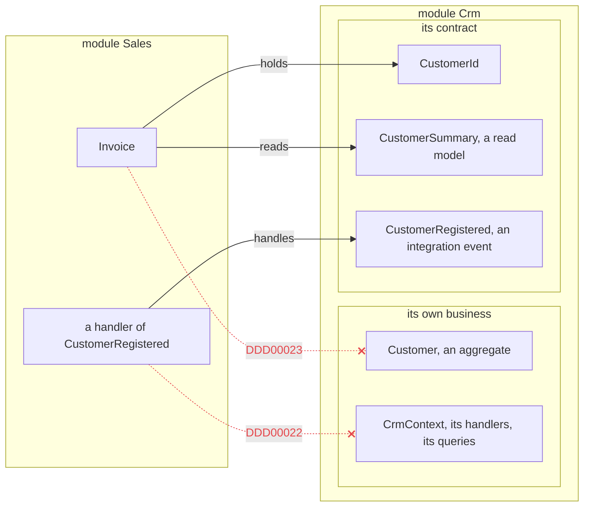
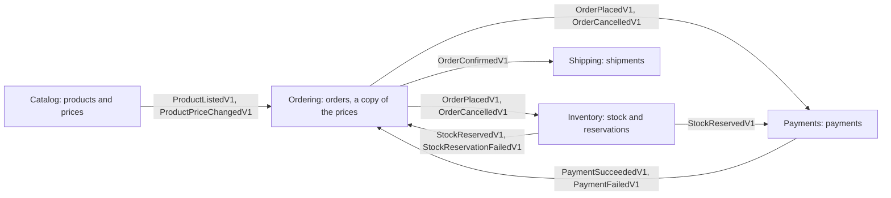
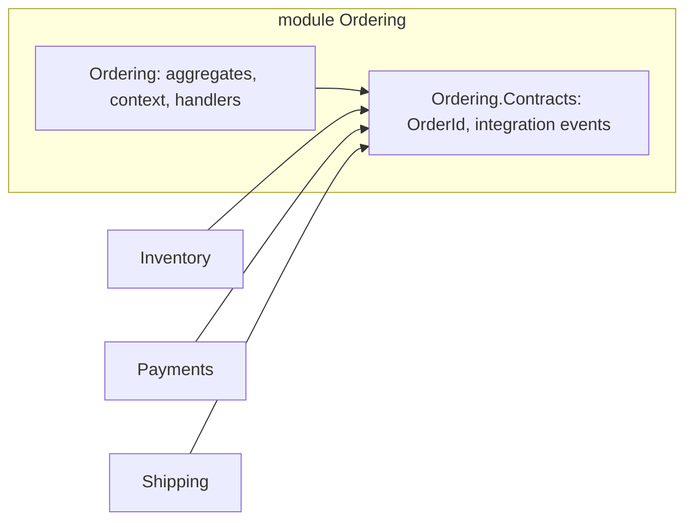

# Module contracts

A [module](modules.md) is only a boundary if something stays on the inside. This page is about the
other half: what a module deliberately lets out, why that list should be short and written down, and
where to keep it.

You do not need any of it while your application is one module. It starts to matter the day a second
module has to know something about the first.

## The problem

Two modules in one solution, `Crm` and `Sales`. Sales needs a customer's name on an invoice, so it
references the Crm project and uses what it finds there:

```csharp
// in Sales
public string InvoiceHeader(Customer customer) => $"Invoice for {customer.Name}";
```

That is reasonable code, and so is the next step: an invoice holds its `Customer`, a Sales query joins
Crm's table, a Sales handler calls Crm's repository. Each change is small and each one works.

A year later Crm wants to split `Name` into first and last name, move its tables to a schema of its own,
or run as a separate service. It cannot, because Sales depends on all of it. Nothing was ever decided;
the boundary between the two modules simply stopped existing, one convenient reference at a time.

C#'s `public` does not prevent this. It means "every assembly that references me", and Crm's types have
to be public anyway, for Crm's own host, its tests and its other projects. The language has no word for
*public, but not for other modules*.

## A contract: what a module promises

The fix is to make the promise explicit. A module names the few types other modules may use, and
everything else is its own to change. That short list is its **contract**: the same idea as the public
API of a library, or the HTTP API of a service, except that it is inside one process and a compiler
checks it.

What that buys:

- **The owner knows what it may change.** Anything not in the contract can be renamed, reshaped or
  deleted without asking anybody. Anything in it is a promise, and changing it is a decision.
- **A consumer knows what it may rely on**, and cannot come to rely on anything else by accident.
- **The module can leave the process.** When a module becomes a service, the contract is what the
  others kept using, so it is what crosses the network. There is nothing else to unpick. The
  [microservices samples](../Examples/README.md) run the same five modules as three services for
  exactly that reason.

What that looks like between two modules. Sales may hold Crm's identifier, read its summary and react
to its event. Holding Crm's entity or naming its `DbContext` is what the analyzer reports:



<details>
<summary>Show the code: publishing, and what the analyzer says</summary>

Crm says it is a module and publishes three types. Everything else it declares, `public` or not, stays
its own:

```csharp
[assembly: Module("Crm")]

[ModuleContract]
[EntityId<Guid>("CUS")]
public readonly partial record struct CustomerId;

[ModuleContract]
public sealed record CustomerSummary(CustomerId Id, string Name);

[IntegrationEvent("crm.customer-registered")]
public sealed record CustomerRegistered(Guid CustomerId, string Name);
```

In Sales, using what Crm published is fine, and the rest is reported:

```csharp
[assembly: Module("Sales")]

[AggregateRoot<Guid>("INV")]
public partial class Invoice
{
    public CustomerId Customer { get; private set; }      // fine: published
    public Customer Buyer { get; private set; }           // DDD00023: another module's entity, stored
}

public sealed class InvoiceReport
{
    public string Describe(CrmContext crm) => "...";      // DDD00022: named, and not published
}
```

See [What the analyzer catches](modules.md#what-the-analyzer-catches).

</details>

## What goes in a contract

In rough order of how often you will want it:

| Publish | Why |
|---|---|
| Integration events | The supported way for another module to learn that something happened. See [Integration events](integration-events.md) |
| Identifiers | Another module has to be able to point at your things, and an `OrderId` is safer to pass around than a `Guid` |
| Read models and value objects | A copy of data another module can read, with no behaviour and no navigation |
| Interfaces your module implements | A front door with a signature, for the rare question that cannot wait for an event |
| Entities and aggregate roots | Almost never. See [below](#keeping-a-contract-a-contract) |

A small contract is a good contract. The example shop's Ordering module publishes one identifier and
three integration events, and the modules that react to orders need nothing more from it.

The whole shop, drawn the same way: each arrow is a contract one module publishes and another handles.
No arrow is a method call, and no module holds another's objects; an `OrderId` is all that travels
with an order:



<details>
<summary>Show the code: one module's contracts, and another reading them</summary>

What Ordering publishes, in its contracts project:

```csharp
[ModuleContract]
[EntityId<Guid>("ORD")]
public readonly partial record struct OrderId;

[IntegrationEvent("ordering.order-placed", Version = 1)]
public sealed record OrderPlacedV1(
    OrderId OrderId, string City, string PostalCode, IReadOnlyList<OrderedLineV1> Lines, decimal Total, string Currency);

[IntegrationEvent("ordering.order-confirmed", Version = 1)]
public sealed record OrderConfirmedV1(OrderId OrderId, string City, string PostalCode);

[IntegrationEvent("ordering.order-cancelled", Version = 1)]
public sealed record OrderCancelledV1(OrderId OrderId, string Reason);
```

*[`Ordering.Contracts/OrderingContracts.cs`](../Examples/Modules/Ordering/DDDToolkit.Examples.Ordering.Contracts/OrderingContracts.cs)*

Shipping reads one of them, and keeps the `OrderId` it carries:

```csharp
[IntegrationEventConsumer("shipping.booker")]
public sealed class BookShipment(ShippingContext context) : IIntegrationEventHandler<OrderConfirmedV1>
{
    public Task HandleAsync(OrderConfirmedV1 contract, IntegrationEventMessage message, CancellationToken cancellationToken)
    {
        context.Shipments.Add(new Shipment(
            ShipmentId.CreateSequential(), contract.OrderId, $"{contract.PostalCode}, {contract.City}", message.OccurredAt));

        return Task.CompletedTask;
    }
}
```

*[`Shipping/Application/Shipments/IntegrationEvents/Inbound/BookShipment.cs`](../Examples/Modules/Shipping/DDDToolkit.Examples.Shipping/Application/Shipments/IntegrationEvents/Inbound/BookShipment.cs)*

</details>

## Declaring it

A module says what it publishes, type by type:

```csharp
using DDDToolkit.Abstractions.Attributes;

[ModuleContract]
[EntityId<Guid>("CUS")]
public readonly partial record struct CustomerId;

[ModuleContract]
public sealed record CustomerSummary(CustomerId Id, string Name);

[IntegrationEvent("crm.customer-registered")]
public sealed record CustomerRegistered(Guid CustomerId, string Name);
```

Three things are published there. `[ModuleContract]` publishes a type. An integration event is
published without a second attribute, because a type whose whole job is to be read by somebody else is
already a contract. A type nested inside a published type is published with it.

Everything else in the assembly, `public` or not, is the module's own business. Once both sides are
[modules](modules.md#what-a-module-is-here), naming anything else from Crm in Sales is a warning
([DDD00022](diagnostics.md#ddd00022)), and so is storing Crm's entity in a Sales one
([DDD00023](diagnostics.md#ddd00023)). The Invoice from the problem above becomes:

```csharp
// in Sales
public string InvoiceHeader(CustomerSummary customer) => $"Invoice for {customer.Name}";
```

`[ModuleContract]` on its own does nothing until the assemblies say which module they belong to. That
is on purpose: adding it early costs nothing, and it starts to count when the second module arrives.

## A project of its own

The attribute is enough to draw the line. The example shop goes one step further and gives each
module's contract a project of its own:

```
Ordering/
    DDDToolkit.Examples.Ordering/              the module: aggregates, persistence, handlers, endpoints
    DDDToolkit.Examples.Ordering.Contracts/    what it publishes: OrderId and three integration events
Shipping/
    DDDToolkit.Examples.Shipping/              references Ordering.Contracts, never Ordering
```

*[`Ordering.Contracts/OrderingContracts.cs`](../Examples/Modules/Ordering/DDDToolkit.Examples.Ordering.Contracts/OrderingContracts.cs)*

Every arrow is a project reference. The modules that react to orders reference Ordering's contracts,
and nothing references Ordering itself:



<details>
<summary>Show the code: two projects, one module</summary>

Both projects say they are Ordering:

```csharp
// Ordering/Module.cs, and the first lines of Ordering.Contracts/OrderingContracts.cs
[assembly: Module("Ordering")]
```

The contracts project publishes the identifier; its integration events are published by being
integration events:

```csharp
[ModuleContract]
[EntityId<Guid>("ORD")]
public readonly partial record struct OrderId;

[IntegrationEvent("ordering.order-confirmed", Version = 1)]
public sealed record OrderConfirmedV1(OrderId OrderId, string City, string PostalCode);
```

Shipping references the contracts and nothing else of Ordering's, and holds the analyzer's rules as
errors:

```xml
<PropertyGroup>
  <WarningsAsErrors>$(WarningsAsErrors);DDD00022;DDD00023</WarningsAsErrors>
</PropertyGroup>

<ItemGroup>
  <ProjectReference Include="..\..\Ordering\DDDToolkit.Examples.Ordering.Contracts\DDDToolkit.Examples.Ordering.Contracts.csproj" />
</ItemGroup>
```

*[`DDDToolkit.Examples.Shipping.csproj`](../Examples/Modules/Shipping/DDDToolkit.Examples.Shipping/DDDToolkit.Examples.Shipping.csproj)*

</details>

Both projects carry `[assembly: Module("Ordering")]`, so they are one module in two assemblies. Why
split them:

- **The compiler does most of the work.** Shipping references only the contracts project, so Ordering's
  aggregates, its `DbContext` and its handlers are not merely forbidden in Shipping, they are not
  there. No analyzer is needed to stop a navigation to `Order` when `Order` cannot be named at all.
- **One file says what the module promises.** Reviewing a change to the contract means reviewing one
  small project, and a pull request that touches it is visibly a change to a promise.
- **Consumers get few dependencies.** Referencing the contracts brings the contracts, not Ordering's
  Entity Framework model or its packages. The example's contracts project does reference
  `DDDToolkit.EntityFramework`, for one reason: the value converter for the published `OrderId` is
  generated into the assembly that declares the id, and Shipping stores an `OrderId` in a column.

For a small codebase the split can wait. `[ModuleContract]` in the module's own project, with the
analyzer watching the other modules, draws the same line with one project fewer.

## Keeping a contract a contract

- **Publish identifiers and primitives, not your value objects.** Ordering's `OrderPlacedV1` carries
  `City` and `PostalCode`, not Ordering's `Address`, and the total as an amount and a currency, not as
  `Money`. A consumer that deserialized `Address` would be coupled to a type Ordering expects to change
  freely.
- **A published type must not hand out an unpublished one.** If `CustomerSummary` had a `Customer`
  property, the contract would leak the entity it was meant to hide. The analyzer cannot see this
  ([What the analyzer cannot catch](modules.md#what-the-analyzer-cannot-catch)); a record of primitives
  and published ids has no such hole.
- **Once published, a change is a breaking change.** Somebody deployed against it. Add a new version
  of an integration event instead of changing the old one; see
  [Versioning and upcasting](integration-events.md#versioning-and-upcasting).
- **Entities stay home.** Publishing an entity lets another module name it, and
  [DDD00023](diagnostics.md#ddd00023) still fires when that module stores it. `[ModuleContract]` says
  "you may name this type"; it cannot say "you may make it part of your own transaction", because that
  is not the owner's to give. Publish the identifier and a read model instead.

## Related

- [Modules](modules.md): what a module is, and the analyzer that holds the line.
- [Integration events](integration-events.md): the contract that carries news from one module to
  another, and how it is delivered and consumed once.
- [Entities and aggregates](entities-and-aggregates.md#reference-other-aggregates-by-id): the same
  argument one scale down, between two aggregates of one module.
