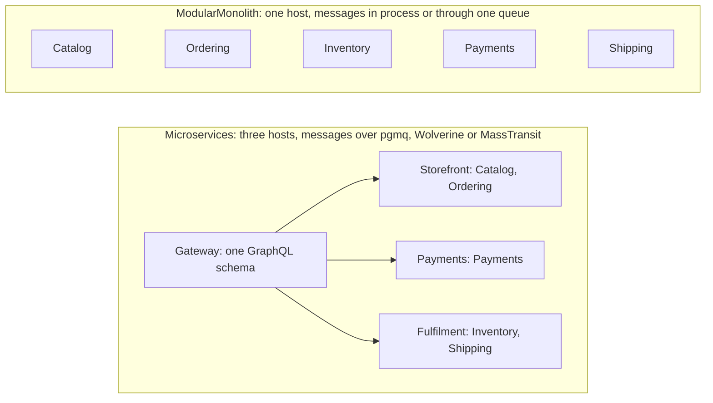
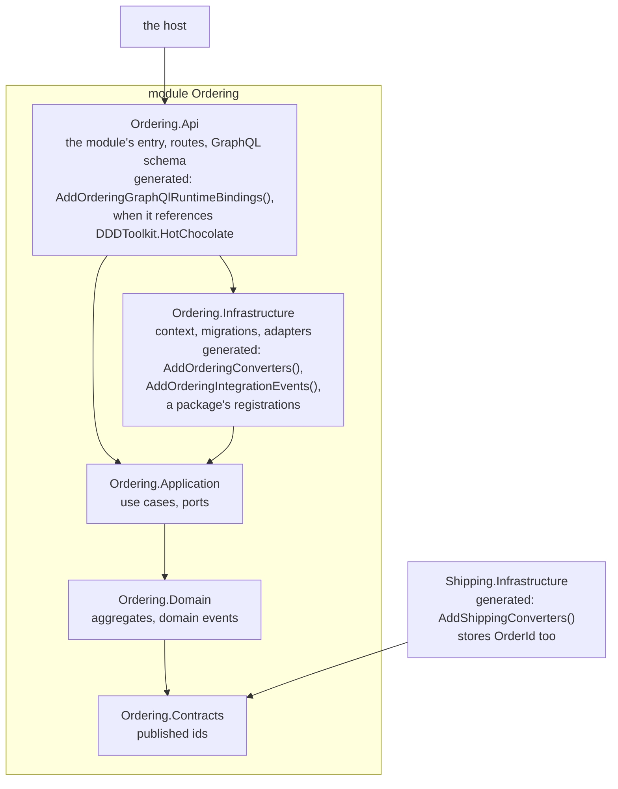
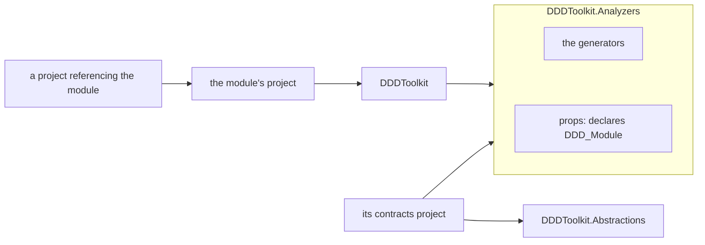

# Modules

Everything else in this toolkit is tactical: an id that cannot be mixed up, a value object that cannot
be invalid, an aggregate that saves as one unit. None of it stops one part of your system from
reaching into another part and taking whatever it finds. That is a strategic question, and in a
modular monolith it is the only one that decides whether you still have modules a year from now.

This page is about the one strategic rule a compiler can actually check: a module is a boundary, and
you may only use what the module on the other side published.

## What a module is here

**A module is an assembly.** One project, one module.

```csharp
// Ordering/AssemblyInfo.cs, or any file in the project
[assembly: Module("Ordering")]
```

That is the whole declaration. Everything the assembly declares belongs to the module, and everything
it declares is internal to the module unless it says otherwise.

Two assemblies may carry the same name, and then they are one module. That is how you split a module
into `Ordering.Domain` and `Ordering.Infrastructure` without inventing a boundary between them; see
[A module in layers](#a-module-in-layers).

An assembly with no `[Module]` is not a module. It is never reported for, and never reported against.
The framework, your NuGet packages, a shared kernel and every project you have not got round to yet
all stay out of the way. Nothing changes in a codebase until somebody adds the attribute.

## What it publishes

Once there are two modules, each one decides what the other may use. It marks those types
`[ModuleContract]`, and every integration event it declares is published without being marked:

```csharp
[ModuleContract]
[EntityId<Guid>("CUS")]
public readonly partial record struct CustomerId;

[ModuleContract]
public sealed record CustomerSummary(CustomerId Id, string Name);
```

Everything else in the assembly, `public` or not, is the module's own business. Why a module would
want that, what belongs in a contract and where to keep it is a page of its own:
[Module contracts](module-contracts.md).

## What the analyzer catches

### DDD00022, using what is not published

```csharp
// in module Sales
public sealed class OrderReport
{
    public string Describe(Customer customer) => customer.Name;   // DDD00022
}
```

`Customer` belongs to module `Crm` and `Crm` does not publish it. The rule reports wherever you *name*
another module's unpublished type: a parameter, a field, a base type, a generic argument, an
attribute, a `typeof`, a `new`, a static call, a `using` alias. One name, one warning.

Two ways out. If the type really is part of the contract, mark it `[ModuleContract]` in the module that
owns it, which is a decision taken by the team that owns it. If it is not, go through something that
is: a published read model, an interface, an integration event.

### DDD00023, holding another module's entity

```csharp
// in module Sales
[AggregateRoot<Guid>("ORD")]
public partial class Order
{
    public Customer Buyer { get; private set; }   // DDD00023
}
```

This is the one that quietly ends a modular monolith, so it gets a rule of its own.

A property typed as another module's entity is a navigation. Entity Framework will map it, a query in
`Sales` will load rows belonging to `Crm`, and one `SaveChanges` will write into both modules inside
one transaction. From that point on the two modules cannot be tested apart, migrated apart, or pulled
into separate services without unpicking every query that crossed over. Nothing about the code looks
wrong; it is one property.

Hold the identifier instead, and let an integration event tell you when the other side changes:

```csharp
[AggregateRoot<Guid>("ORD")]
public partial class Order
{
    public CustomerId Buyer { get; private set; }

    public void PlaceFor(CustomerId customer) => Buyer = customer;
}
```

**Publishing the entity does not help**, and the rule fires whether or not the entity is published.
That is deliberate. `[ModuleContract]` says "you may name this type"; it cannot say "you may make this
type part of your own transaction", because that is not the owner's to give.

Like [DDD00021](diagnostics.md#ddd00021), this rule reads stored state only: fields and properties.
Passing another module's entity into a method and reading it is not reported, because nothing is
stored and Entity Framework builds nothing from it. It is still usually a sign that the call belongs
on the other side of the boundary, but it is not what this rule is about.

### Both rules are warnings

A module boundary is a design decision. The code compiles either way, nothing stops being generated,
and a codebase adopting modules wants to see the list before it is forced to fix it. Adding
`[assembly: Module]` to one project and getting forty errors would teach exactly one lesson: take the
attribute off again.

Once the list is empty, hold it:

```xml
<PropertyGroup>
  <WarningsAsErrors>$(WarningsAsErrors);DDD00022;DDD00023</WarningsAsErrors>
</PropertyGroup>
```

Or drop a rule entirely, per project:

```xml
<PropertyGroup>
  <NoWarn>$(NoWarn);DDD00023</NoWarn>
</PropertyGroup>
```

Unlike the generator diagnostics, these two come from a real analyzer, so `#pragma warning disable
DDD00022` and `[SuppressMessage]` both work on a single line or member. Use them where you mean it and
leave a reason next to them.

## What the analyzer cannot catch

Read this list before you trust the rule, because the gaps are real.

| Not caught | Why |
|---|---|
| Several modules inside one project | A module is an assembly here. See [below](#why-not-namespaces) |
| A type you never name, such as `var buyer = summary.Owner;` | The rule reports names in your source, and there is no name in that line |
| An extension method called on an instance, `customer.Deactivate()` | You named the method, not the class that declares it |
| A member inherited from an unpublished base type | Reporting it would fire on types the author never saw |
| Reflection, DI by string, `dynamic`, serialization | Nothing about them is visible at compile time |
| Generated code | Skipped on purpose; you cannot fix a file you do not write |
| A published type that hands you an unpublished one | That is the publishing module's bug, and the rule is not clever enough to call it |

The last one is worth designing against rather than hoping for: if a published type exposes an
unpublished one, the contract is not really a contract. A published record of primitives and published
ids has no such hole.

## How this fits with integration events

The two halves are meant to be read together. [Integration events](integration-events.md) explain how
a message gets from one place to another and how to consume it once. This page is why you would bother
instead of adding a project reference and a navigation property.

The shape a module ends up with is small:

- It publishes identifiers, so other modules can point at its things.
- It publishes integration events, so other modules can react to its things.
- It publishes a read model or an interface where somebody genuinely needs to ask it a question.
- It keeps its entities, its aggregates, its repositories and its `DbContext` to itself.

Two modules that share only that can be deployed together forever, and can be pulled apart on the day
that stops being true. Two modules that share a navigation property cannot.

A consuming module also says who its handlers run as, next to them:
`module.Around((services, message, contract) => Callers.Begin(Caller.SystemIn("shipping")))`. Under row
level security that is what its policies see, for the handler's work and its inbox row alike; see
[Who the handlers run as](integration-events.md#who-the-handlers-run-as).

## One set of modules, any host

A module registers everything it needs itself, so a host only chooses which modules it runs and how
their messages travel. The example shop runs the same five modules as one process and as three
services:



<details>
<summary>Show the code: two hosts over the same modules</summary>

The monolith runs all five, and hands each module's messages to the others in process:

```csharp
var host = ModuleHost.InProcess(database);

builder.Services.AddCatalogModule(host);
builder.Services.AddOrderingModule(host);
builder.Services.AddInventoryModule(host);
builder.Services.AddPaymentsModule(host);
builder.Services.AddShippingModule(host);
```

*[`ModularMonolith.Supabase/Examples.Webshop.Host/Program.cs`](../Examples/ModularMonolith.Supabase/Examples.Webshop.Host/Program.cs)*

The storefront service runs two of them, and sends what the others need through pgmq:

```csharp
var host = new ModuleHost(
    ModuleDatabase.Postgres(connectionString),
    outbox =>
    {
        outbox.SendToModules();   // Catalog to Ordering, next door
        outbox.SendToPgmq();      // everything the other services handle
    });

builder.Services.AddCatalogModule(host);
builder.Services.AddOrderingModule(host);
```

*[`Microservices.Pgmq/Examples.Webshop.Pgmq.Storefront/Program.cs`](../Examples/Microservices.Pgmq/Examples.Webshop.Pgmq.Storefront/Program.cs)*

</details>

A module does not know which of the two it is in. What changes is the host's `Program.cs`, and the
modules' boundaries are what make that possible: nothing crosses between them except contracts, and a
contract travels as well over a queue as through a method call.

## A module in layers

A module can be as many projects as its layers: a contracts project with what it publishes, a domain project
with its aggregates and events, an application project with its use cases, an infrastructure project with
its context and migrations, and an API project with its routes and the module's entry. Every one of them
declares the same `[assembly: Module("Ordering")]`, so they are one module to the analyzer, and the domain,
application and contracts projects reference neither Entity Framework nor ASP.NET Core.

The generators treat the projects of one module as one module too. What Entity Framework needs is written
where Entity Framework is, into the infrastructure project, from what the other projects declare:



<details>
<summary>Show the code: the module's entry and what it calls</summary>

```csharp
// Ordering.Api: the entry, the one type of the project that names the infrastructure project
public static class OrderingModule
{
    public static IServiceCollection AddOrderingModule(this IServiceCollection services, ModuleHost host)
        => services.AddOrderingInfrastructure(host).AddOrderingApplication();

    public static IEndpointRouteBuilder MapOrderingModule(this IEndpointRouteBuilder routes)
        => routes.MapOrderingEndpoints();
}

// Ordering.Infrastructure: the context, the adapters of the ports, and what the generators wrote here
public static IServiceCollection AddOrderingInfrastructure(this IServiceCollection services, ModuleHost host)
{
    host.Database.AddContext<OrderingContext, OrderingContextFactory>(services, OrderingContext.Schema);
    services.AddScoped<IOrderStore, EfOrderStore>();
    services.AddDDDToolkitEntityFramework(options => options.UseOutbox<OrderingContext>(outbox =>
    {
        outbox.AddOrderingIntegrationEvents();
        host.Publish(outbox);
    }));
    return services;
}

// The host: one reference and one call per module
builder.Services.AddOrderingModule(host);
```

</details>

- **Converters.** Every id and single value object implements `ISingleValue<TSelf, TValue>`. The
  infrastructure project's `Add{Module}Converters()` registers `SingleValueConverter<T, TValue>` for the ids of
  its module's other projects that have no converter of their own, and registers the published ids of other
  modules it references, with their own converter where their project references Entity Framework. It is
  written even when the project declares no id. See
  [Identifiers](identifiers.md#stored-by-a-project-that-does-not-declare-it).
- **Domain events.** Its `Add{Module}IntegrationEvents()` names the domain events of its module's projects
  that do not reference Entity Framework, under the names they would have had in their own registration.
  Those events must be `public`; one the infrastructure project cannot see is
  [DDD00033](diagnostics.md#ddd00033).
- **A package's registrations.** A registration closed over the classes a module declares with a package's
  templates, such as `modelBuilder.AddTenancy()`, is written into the infrastructure project, which references
  the package's Entity Framework registrations, closed over the classes of the domain project. A project of
  the module above it, such as the API project, gets none: it calls the infrastructure project's own public
  registration. See
  [Writing your own supporting domain](writing-a-supporting-domain.md#a-registration-closed-over-your-classes).

- **GraphQL bindings.** An API project that references `DDDToolkit.HotChocolate` holds the module's GraphQL
  source schema, and gets `Add{Module}GraphQlRuntimeBindings()`: the ids of its module's other projects, and
  the published ids of the modules it names, as scalars and node ids. See
  [Bound by a project that does not declare it](graphql.md#bound-by-a-project-that-does-not-declare-it).

Only projects with the same `[assembly: Module]` are taken together. A project of another module gets none
of this but the converters for the ids this module publishes, as `Shipping.Infrastructure` stores `OrderId`
above. A project that declares no module, such as the host, registers only what it declares itself, and a
package that declares no module is never taken for one of your projects.

The module's entry, `AddOrderingModule(host)`, goes in the API project, which is what a host serves. It calls
the infrastructure project's own registration, `AddOrderingInfrastructure(host)`, for the context, the
adapters of the ports and whatever the generators wrote there, then the application project's, and it maps
the routes. So the host references the API project and nothing else of the module, and still makes one call
per module. The API project references the infrastructure project for that one call: the entry is the only
type in it that names the infrastructure project, and no route names it, Entity Framework or a port. The
[Tenancy sample](../Examples/README.md#the-tenancy-sample) is laid out this way, with tests that hold
each project to it. Its modules' reads each take a context of their own, so its infrastructure registrations
take their contexts from a pool, with `AddScopedFromPool` for the request's own
([Contexts from a pool](entity-framework.md#contexts-from-a-pool)): two pools for each context, one on the
host's connections for requests and one on those for background work.

### Folders inside the layers

Inside a layer project the thing comes first and the kind second. A folder is named for what its classes are
about: an aggregate in the domain project, a feature in the application and the API project, an adapter in the
infrastructure project. Only inside it do `Events`, `Commands` or `Rest` say what kind of class a file holds.
A folder named `Commands` at a project's root would keep every command of the module together and spread what
belongs to a crew over five folders; a folder named `Crew` keeps the crew together. The Projects module of the
[Tenancy sample](../Examples/README.md#the-tenancy-sample):

```
Projects/
  Examples.Tenancy.Projects.Contracts/
    Module.cs
    ValueObjects/                 ProjectId.cs
    Keys/                         ProjectKeys.cs
    Gate/                         IProjectGate.cs, ProjectAnswer.cs
    RowAccess/                    ProjectsISee.cs, ProjectsWhereIHold.cs: what another module's row rules may ask
  Examples.Tenancy.Projects.Domain/
    Module.cs, GlobalUsings.cs
    Aggregates/
      Projects/
        Project.cs                the aggregate root
        ProjectRefusals.cs        its refusals, beside it
        ProjectFailures.cs        the marker of ProjectFailures.resx and .nl.resx: the refusals' texts, in two languages
        Entities/                 CrewMember.cs, on the Membership package's member template
        Events/                   ProjectOpened.cs, CrewRoleGiven.cs and the rest, an event per file
        Invariants/               NameIsValid.cs, OneMembershipPerSeat.cs and the rest, a rule per file
        ValueObjects/             ProjectState.cs, CrewMemberId.cs
      ProjectRoles/
        ProjectRole.cs            a project role of a tenant's, on the Membership package's kept-role template
        Events/                   ProjectRoleMade.cs and the rest
        ValueObjects/             ProjectRoleId.cs
  Examples.Tenancy.Projects.Application/
    Module.cs, GlobalUsings.cs, ProjectsApplicationServices.cs
    Access/                       the access check, the rules it asks, the keys, and what it reads of a project
      Queries/                    KeyOnProject.cs, KeysOnProjects.cs, KeysHeldAtRoot.cs
    Crew/
      Commands/                   AddCrewMember.cs, GiveCrewRole.cs, TakeCrewRole.cs, RemoveCrewMember.cs
      Queries/                    AllCrewMembers.cs
      CrewOverview.cs             what more than one use case answers with, beside them
    Lifecycle/
      Commands/                   OpenProject.cs, ChangeProjectName.cs, PlanProject.cs, MoveProjectToUnit.cs, CloseProject.cs, ReopenProject.cs
    Operators/
      Queries/                    TenantProjects.cs: what the application's own staff read
      TenantProject.cs            what it answers with
    Overview/
      Queries/                    VisibleProjects.cs, ProjectDetail.cs, and three that are asked about a page of projects
      ProjectOverview.cs, ProjectListFilter.cs
    Ownership/
      Commands/                   ChangeProjectOwner.cs
    ProjectRoles/
      Commands/                   MakeProjectRole.cs, RenameProjectRole.cs, SetProjectRoleKeys.cs, ArchiveProjectRole.cs, SetUpProjectRoles.cs
      Queries/                    TenantProjectRoles.cs, ProjectRolesById.cs
      ProjectRoleListing.cs       what both answer with
    StoredProjects/               IProjectStore.cs, IProjectReads.cs, IProjectReading.cs: the ports several features share
  Examples.Tenancy.Projects.Infrastructure/
    Module.cs, GlobalUsings.cs, ProjectsInfrastructure.cs
    Persistence/                  ProjectsContext.cs, EfProjectStore.cs, EfProjectReads.cs; Migrations/, and
                                  ProjectsContextFactory.cs, which dotnet ef and the export build the context with
    Access/                       the row rules, a class per file, column rules among them;
                                  UnitChangesWithItsKeys.cs, a rule Postgres holds beyond the
                                  policies, as a trigger of the module's own
  Examples.Tenancy.Projects.Api/
    Module.cs, GlobalUsings.cs, ProjectsModule.cs
    Access/Rest/                  AccessEndpoints.cs
    Access/GraphQL/               AccessQueries.cs, ProjectKeySetType.cs; AccessDataLoaders.cs, which a rule on a
                                  field asks through
    Crew/Rest/                    CrewEndpoints.cs
    Crew/GraphQL/                 CrewMutations.cs; CrewMemberType.cs and CrewRoleHoldType.cs, types over the
                                  application's records; CrewFieldKeys.cs, which answers the permission key a
                                  field of a crew member asks for
    Lifecycle/Rest/               LifecycleEndpoints.cs
    Lifecycle/GraphQL/            LifecycleMutations.cs
    Operators/Rest/               OperatorsEndpoints.cs
    Operators/GraphQL/            OperatorsQueries.cs, TenantProjectType.cs
    Overview/Rest/                OverviewEndpoints.cs
    Overview/GraphQL/             OverviewQueries.cs, OverviewPagedQueries.cs, ProjectType.cs, OverviewDataLoaders.cs, ChangedProject.cs
    Ownership/Rest/               OwnershipEndpoints.cs
    Ownership/GraphQL/            OwnershipMutations.cs
    ProjectRoles/Rest/            ProjectRolesEndpoints.cs
    ProjectRoles/GraphQL/         ProjectRolesQueries.cs, ProjectRolesMutations.cs, ProjectRoleType.cs,
                                  ProjectRolesDataLoaders.cs, ProjectRoleFieldKeys.cs
    Rest/                         ProjectVersions.cs: what the routes of several features share, here If-Match and ETag
    GraphQL/                      ProjectsGraphQL.cs, which registers the module's schema; ReferencedSeat.cs and
                                  the other entities of Tenancy's as this module names them; schema.graphql
```

- **A project's root** holds its entry points and nothing else: `Module.cs`, `GlobalUsings.cs`, and the class
  that registers the project, which in the API project is the module's entry.
- **A file declares one type**, and is named after it: an event, an invariant, an entity and a value object
  each have a file of their own. A use case is the exception. Its request, its handler and what only it
  answers with are one file, because they change together.
- **The namespace of a type is its folder**, in every project: the project's name, then the folders its file
  is in, so `Projects.Domain.Aggregates.Projects.Events.ProjectOpened` and
  `Projects.Application.Crew.Queries.AllCrewMembers`. A type is found from its name, and a using says which
  part of a project a file leans on. `GlobalUsings.cs` carries the namespaces most files of a project need,
  so a file names only what is particular to it.
- **The domain project** has a folder per aggregate under `Aggregates`, named in the plural. The aggregate
  root and its refusals are in it, with `Entities`, `Events`, `Invariants` and `ValueObjects` beside them.
  An invariant is nested in the class it is about, so its file declares a partial of that class around the
  one rule, and is the one file whose namespace is not its folder: a partial has its class's namespace. What
  several aggregates share goes in `ValueObjects` and `Services` at the project's root.
- **What several modules share** and none owns is in a project of its own beside the modules,
  `Shared/Examples.Tenancy.Shared.Domain`, with the same folders by kind; it declares no module
  and references none, and only a module's domain and contracts projects reference it. The sample's example
  is `ValueObjects/DateRange.cs`, a range of calendar days: Projects plans a project with one, Inspections
  says which days an inspection covers with one, and the rule between them, that those days lie within the
  project's planned range, is held by Inspections with what Projects' gate answers. A type one module owns
  is not shared: it stays in that module's contracts, as `ProjectId` does. What the modules' infrastructure
  projects do the same way has a project beside it, `Shared/Examples.Tenancy.Shared.Infrastructure`, which
  only they reference: the check a paged read makes of the marker it is asked with, `Paging/ListCursors.cs`.
  And what their application projects do the same way has one too,
  `Shared/Examples.Tenancy.Shared.Application`, which only they reference: the check a paged query makes of
  the page it is asked for, `Paging/PageSizes.cs`.
- **The application project** has a folder per feature, named by a noun of the domain, and in it `Commands`
  and `Queries`; a feature with commands only has no `Queries` folder. A feature may be named for who it is
  for: what the application's own staff read is `Operators`. A port that one feature uses lives in that
  feature's folder, as Inspections' two do. The ports that several features share sit in a folder at the root
  named for what it holds: `StoredProjects` holds what the use cases read and save projects through. It holds
  the ports and nothing else, since what a port answers with is a feature's, and lives there. No folder in
  this project carries the name of a layer, nor `Persistence`, the name the infrastructure project gives its
  storage: a layer is a project. The access check is a feature of its own, `Access`.
- **The API project** uses the application project's feature names. A feature's routes are in `Rest`, in one
  class named after the feature, and they send that feature's requests. Its GraphQL is in `GraphQL` beside it:
  the fields in `{Feature}Queries` and `{Feature}Mutations`, which send that feature's requests too, and the
  types they answer. A field is a method marked `[Query]` or `[Mutation]`. The one exception is a field that
  pages: HotChocolate writes its connection type only for a class it generates the type of, so the paged
  fields of a feature are in a class marked `[QueryType]`, `{Feature}PagedQueries`, which holds nothing else.
  What the features share is at the project's root: in `GraphQL` the registration of the module's source
  schema, another module's entities as this one names them, and the committed schema; in `Rest` what the
  routes of several features read or write the same way. The entry maps the routes, feature by feature, and
  registers the schema.
- **The infrastructure project** is grouped by adapter, because one adapter serves many features:
  `Persistence` holds the context, its migrations and the adapters of the ports. It knows how the module is
  stored and nothing of how it is served: its project names no HotChocolate package and its code uses none, a
  list is paged by the paging library alone (`GreenDonut.Data.EntityFramework`), and no context is registered
  with a schema, because a field only sends a query and every query that reads takes a context of its own.
- **The tests** mirror it: a folder per module with a folder per feature in it, next to `Architecture` for
  the tests that hold the layout and `Infrastructure` for the fixtures.

Nothing but convention keeps a folder in step with what is in it. So the sample's tests ask:
`FeatureFolderTests` reads the requests from the host's container and holds each to its feature's `Commands`
or `Queries`, each route and each GraphQL field to the feature whose requests it sends, and every project's
root to having no folder named after a kind of class or after a layer; `LayerReferenceTests` holds a project
that knows storage to referencing no HotChocolate; `SourceTreeTests` reads the source tree and holds every aggregate, entity, event
and invariant to its folder, every file to declaring one type, and every namespace to its folder. Both are in
[`Tests/Examples.Tenancy.Tests/Architecture`](../Tests/Examples.Tenancy.Tests/Architecture).

Moving a class to another namespace changes its full name, and two things name a class as text. An Entity
Framework snapshot and each migration's designer file name every entity by its class: the model differ compares
tables, so it sees no change and asks for no migration, and the text is replaced by hand. And a name that is
stored or sent must not move with a namespace. The outbox stores a domain event under its module's name and
its class's (`projects.project-opened`), with nothing of its namespace, and the sample's models have no
discriminator column. `MigrationTests` and `StoredNameTests` hold both.
The shop under [`Examples/Modules`](../Examples/Modules) keeps a module in one project and has the same
folders inside it, with the layers as its top folders: `Domain/Aggregates/Orders/Events`,
`Application/Orders/IntegrationEvents`.

## One API over the modules: GraphQL

A module's boundary holds in its API as well. Rather than one GraphQL schema that knows every module,
each module can serve a schema of its own: its types, its queries, and its part of the types other
modules own, keyed on a name and a key they agree on. Catalog declares `Product` with its name and
price; Inventory declares its own `Product`, keyed on the same SKU, with the stock; Ordering says a line's
product is the `Product` with that SKU. No module references another's classes, and a client still sees
one `Product`.

`DDDToolkit.HotChocolate.Fusion.InMemory` composes those schemas inside the monolith with HotChocolate
Fusion, and calls the modules in memory. The same schemas compose across processes when a module becomes
a service, so its GraphQL does not change on that day either. See
[One schema over a modular monolith](graphql.md#one-schema-over-a-modular-monolith), and
`Examples/ModularMonolith.*` for five modules doing it.

## DDD_Module, and the package that brings it

A module's name is also the name in the code the generators write: `{Module}EventNames`,
`Add{Module}Converters`, `Add{Module}IntegrationEvents` and `Add{Module}GraphQlRuntimeBindings`. The
generators look for that name in three places, and the first one that answers wins:

| Where | Who it is for |
|---|---|
| `[assembly: Module("Ordering")]` | A module. It always wins. |
| `<DDD_Module>Shop</DDD_Module>` | A project that is no module: a shared kernel, an application without modules, a test project. |
| The assembly name, with the dots removed | A project with neither. |

`DDD_Module` is an MSBuild property, so a `Directory.Build.props` can set it for every project in a
folder. The attribute is what one assembly says about itself, which is why it wins: a module below
that folder still gets its own name.

```xml
<PropertyGroup>
  <DDD_Module>Shop</DDD_Module>
</PropertyGroup>
```

### Two assemblies, one module

Ordering and its contracts project both declare `[assembly: Module("Ordering")]`, so both generate
`AddOrderingConverters` and `AddOrderingGraphQlRuntimeBindings`. They do not collide. An assembly's
method calls the ones of the module's other assemblies it references, so one call registers the module,
and it leaves to them what they registered. A project of the module without Entity Framework or
HotChocolate has no method to call: its identifiers are registered by the method of the project that
references it ([A module in layers](#a-module-in-layers)).

```csharp
// in Ordering's context: OrderLineId from Ordering, and OrderId from Ordering.Contracts with it
configurationBuilder.AddOrderingConverters();

// in Shipping's context, which references only Ordering.Contracts and stores an OrderId: Shipping's
// registration covers the OrderId it stores, so it is the one call
configurationBuilder.AddShippingConverters();
```

Import the generated namespace of the assembly you are in, or of the one assembly of another module
you reference, and the name is never ambiguous. `Add{Module}IntegrationEvents` is the one method that
does not call the others. A contracts project has none to call; if two assemblies of one module both
generate it, call the second as an ordinary static method.

### How the property reaches the generators

A generator can only read an MSBuild property the project
declares as visible to the compiler. **The `DDDToolkit.Analyzers` package declares `DDD_Module`.** The package
that holds the generators also holds a props file declaring the properties they read, and NuGet imports
that file into each project the generators run in: one that references the package itself, one that
gets it as a dependency of `DDDToolkit`, and one that gets it through a project reference. There is
nothing to add to a project file.



So there are two supported ways to reference the toolkit, and a module with a
[contracts project](module-contracts.md#a-project-of-its-own) uses both:

| Project | References | Gets |
|---|---|---|
| The module | `DDDToolkit`, and the integrations it uses | The base types, and through them the attributes and the generators |
| Its contracts | `DDDToolkit.Abstractions` and `DDDToolkit.Analyzers`, without `DDDToolkit` | The attributes and the generators, and nothing that runs |

The second row is for a project that should carry no runtime. A record struct identifier, a read model
and an integration event compile against the attributes alone. Entities, aggregate roots, value objects
and domain events derive from base types in `DDDToolkit`, so the project that declares those references
`DDDToolkit`.

<details>
<summary>Show the code: a contracts project without the runtime</summary>

```xml
<Project Sdk="Microsoft.NET.Sdk">

  <PropertyGroup>
    <TargetFramework>net10.0</TargetFramework>
  </PropertyGroup>

  <ItemGroup>
    <PackageReference Include="Temp.DDDToolkit.Abstractions" Version="3.1.0" />
    <PackageReference Include="Temp.DDDToolkit.Analyzers" Version="3.1.0" PrivateAssets="all" />
  </ItemGroup>

</Project>
```

```csharp
[assembly: Module("Billing")]

[EntityId<Guid>("INV")]
public readonly partial record struct InvoiceId;

public sealed record InvoiceSummary(InvoiceId Id, decimal Total);

[IntegrationEvent]
public sealed record InvoiceSent(InvoiceId InvoiceId);
```

The generators write `InvoiceId` and `BillingEventNames.InvoiceSent` here, as they would in the module.
The attribute names the class; a contracts project that is no module would set `DDD_Module` for that,
which is what [`build/package-consumers/ContractsOnly`](../build/package-consumers/ContractsOnly/Acme.Billing.Contracts.csproj)
does to prove the property arrives.

</details>

Both rows are built against the packed packages on every pull request, together with a project that
gets the toolkit only through a project reference, and the build fails if `DDD_Module` did not name
the generated class in any of them.

If the generators do arrive and the props file does not, because a reference excludes the package's
build assets, `DDD_Module` is ignored. The build says so with [DDD00014](diagnostics.md#ddd00014)
rather than naming everything after the assembly without a word. A module is not affected: its name
comes from the attribute, and the property is not read.

## Adopting this on an existing codebase

1. Pick the module with the fewest things pointing at it and add `[assembly: Module]` to it. Nothing
   happens yet, because nothing else is a module.
2. Add `[assembly: Module]` to one of its callers. Now you get a list.
3. Work the list. Most entries are a published id that was never marked, or a query that should be a
   published read model.
4. Turn `DDD00023` into an error for those two projects when its list is empty, then `DDD00022`.
5. Repeat with the next module. The rules stay silent about every project you have not reached.

## Design choices

### Why not namespaces

Several modules inside one project is the other common layout, and this analyzer does not support it.

The reason is what an analyzer can see. It gets this compilation plus the *metadata* of everything the
compilation references. When code in `Ordering` names a type from `Billing`, the analyzer has to ask
that type which module it belongs to, and the only answer available is whatever survived into
`Billing.dll`. An assembly attribute survives. A namespace cannot carry an attribute at all, so a
namespace layout would have to be described by a convention that the other side cannot confirm, and a
boundary you cannot confirm is not a boundary.

There is a second reason to prefer a project per module, and it is the better one: the compiler
already enforces `internal` at the assembly boundary. Put a module in its own project and half the job
is done by C# itself. What the analyzer adds is the other half, which C# has no word for: *public, but
not for you*.

### Why not the DDD_Module MSBuild property

`DDD_Module` already exists in this toolkit and it is not this. It is an MSBuild property, which means
it reaches the compiler of the project that sets it and travels no further. The compiler building
`Ordering` cannot read what `Billing.csproj` set. So it can name generated code in a project that is
no module, and it cannot be a boundary. The traffic goes one way only: the attribute names a module's
generated code as well, and wins over the property where a project has both. What the two name, and
how the property reaches the generators, is [above](#ddd_module-and-the-package-that-brings-it).

## Related

- [Module contracts](module-contracts.md), what a module publishes and why.
- [Integration events](integration-events.md), the supported way across a boundary.
- [One schema over a modular monolith](graphql.md#one-schema-over-a-modular-monolith), the modules'
  GraphQL composed without a module knowing another.
- [Entities and aggregates](entities-and-aggregates.md#reference-other-aggregates-by-id), the same
  argument one scale down, inside a single module.
- [Diagnostics](diagnostics.md#ddd00022), the reference entries for both rules.
