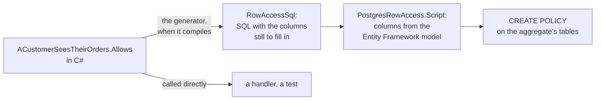

# Row level security

Postgres's row level security decides, for every query, which rows the caller gets to see and change,
from policies on the tables. It does not apply to the tables' owner, and an application usually logs in
as the owner, so the policies guard whatever else reaches the database and not the application.
`DDDToolkit.EntityFramework.Postgres` changes that: every connection a context opens runs as the caller,
so the policies decide what the application sees too. And the policies themselves can be written in C#,
next to the aggregate they guard, as rules the generator turns into SQL when the code compiles.

This page is about Postgres, any Postgres. [Supabase](supabase.md#row-level-security-for-your-own-queries)
has the same thing with Supabase's roles and `auth` functions, and its build writes the policies into
`supabase/migrations` for you.

## Install

```bash
dotnet add package DDDToolkit.EntityFramework.Postgres
```

## Running queries as the caller

```csharp
builder.Services.AddPostgresRowLevelSecurity();

builder.Services.AddDbContext<OrderingContext>((provider, options) => options
    .UseNpgsql(connectionString)
    .UsePostgresRowLevelSecurity(provider));
```

Every time the context opens a connection, the interceptor sets a role and the caller's token claims on
it, the way PostgREST does for each request:

```sql
SELECT set_config('role', 'authenticated', false), set_config('request.jwt.claims', '{"sub":"…"}', false)
```

| The caller | Runs as | `ddd.caller_id()` |
|---|---|---|
| A signed-in user | `authenticated`, with their token's claims | the user's id |
| A request without a user | `anon`, with the claims `{"role":"anon"}` | `null` |
| No request at all: an outbox poller, a hosted service | `SystemRole`, or the role the application logged in as | `null` |
| Code inside `using (Callers.Begin(caller))` | that caller, whatever the request says | the caller's |

The roles are PostgREST's by default; `AddPostgresRowLevelSecurity(options => ...)` changes them.

**Who is calling** is the toolkit's `Caller`, and an `ICallerAccessor` says which one it is at this
moment. A host registers the accessor that knows its callers: `AddSupabaseJwtBearer` from
`DDDToolkit.Auth.Supabase.AspNetCore` answers from the request, and `DDDToolkit.Auth.Supabase.AzureFunctions`
from the invocation. Without one, the answer is whatever `Callers.Begin` made current, or the system
outside any, which is what a worker service or a test wants. A caller comes from the claims of a
validated token, `Callers.FromClaims(claims)`, or is made in code, `Caller.User(id)`, in which case the
database sees its id and role and no other claims.

```csharp
// a job queued on a user's behalf, with the claims of the token that queued it
using (Callers.Begin(Callers.FromClaims(job.Claims)))
{
    await handler.HandleAsync(job, cancellationToken);
}
```

`Callers.Begin` follows `await` and `Task.Run` the way an `AsyncLocal` does, and a caller begun in code
wins over the request's. The same works the other way round, for a step a request takes on the
application's behalf: `Callers.Begin(Caller.System)`.

**Background work** runs as `SystemRole`, or, left unset, as the role the application logged in as,
which as the owner sees every row. For an application that should not be able to see everything by
accident, log in as a role of its own that may do nothing but switch roles, and set `SystemRole` to a
role with `BYPASSRLS`. A query outside a request that nobody meant to run as the system then fails
instead of seeing every row.

**How the settings travel.** They are set on the connection when a context opens it, because Entity
Framework opens a connection for each query outside a transaction, and cost one round trip each time.
Npgsql clears them with `DISCARD ALL` before the pooled connection is used again. Three ways of
connecting would let them reach somebody else, and the interceptor refuses them before connecting:
`No Reset On Close`, which skips that reset; `Multiplexing`, which shares a connection between callers at
once; and Supabase's transaction pooler on port 6543, which hands each transaction whichever server
connection is free. A connection you open yourself and hand to `UseNpgsql(connection)` gets no settings
at all.

## A Postgres of your own

A Supabase project has the roles and the functions a policy asks about the caller. A Postgres of your
own has neither until `PostgresRowAccess.SetupScript()` makes them: `anon` and `authenticated`, granted
to the role the application logs in as so it may switch to them, and `ddd.caller_id()`,
`ddd.caller_role()` and `ddd.caller_claims()`, which read the claims the interceptor set. It can run
again, so it belongs in an early migration:

```csharp
public partial class RowLevelSecurity : Migration
{
    protected override void Up(MigrationBuilder migrationBuilder)
    {
        migrationBuilder.Sql(PostgresRowAccess.SetupScript());
        migrationBuilder.Sql("""
            grant usage on schema ordering to anon, authenticated;
            grant select, insert, update, delete on all tables in schema ordering to anon, authenticated;
            alter default privileges in schema ordering grant select, insert, update, delete on tables to anon, authenticated;
            """);
    }
}
```

The grants give the two roles the tables; the policies then decide which rows. `ddd.caller_id()` is
`null` for a token whose `sub` is not a `uuid`, so a rule about a user matches nobody rather than failing
every query; `Caller.UserId` is `null` for it too.

## Row access rules written in C#

A rule is a static method on a class of its own, marked with the aggregate it guards and what it allows:

```csharp
[RowAccess<Order>(RowOperations.Read | RowOperations.Change)]
public static partial class ACustomerSeesTheirOrders
{
    public static bool Allows(Order order, Caller caller)
        => order.PlacedBy == null || order.PlacedBy?.Value == caller.UserId;
}
```

When the class compiles, the generator translates `Allows` into SQL and writes it into the class as
`RowAccessSql`. The rule stays an ordinary method as well, so a handler, a test or a screen asks the same
rule in C#: `ACustomerSeesTheirOrders.Allows(order, caller)`.



What the generator translates, and into what:

| In `Allows` | In the policy |
|---|---|
| `order.PlacedBy == null \|\| order.PlacedBy?.Value == caller.UserId` | `("PlacedBy" IS NULL) OR ("PlacedBy" IS NOT DISTINCT FROM ddd.caller_id())` |
| `order.Status != OrderStatus.Cancelled` | `"Status" IS DISTINCT FROM 2`, or `'Cancelled'` when the column stores it as text |
| `order.Total.Amount <= 500` | `coalesce("Total_Amount" <= 500, FALSE)` |
| `caller.IsSignedIn && !order.IsPublic` | `(ddd.caller_id() IS NOT NULL) AND (NOT "IsPublic")` |
| `caller.Claim("app_metadata.team") == order.Team` | `ddd.caller_claims() #>> '{app_metadata,team}' IS NOT DISTINCT FROM "Team"` |
| `caller.Role == "authenticated"` | `ddd.caller_role() IS NOT DISTINCT FROM 'authenticated'` |

`==` is C#'s equality, nulls included, so it becomes `IS NOT DISTINCT FROM`, and a comparison that SQL
would leave unknown is false, as it is in C#. The caller functions are wrapped in `(SELECT ...)` in the
policy itself, so Postgres asks them once per query rather than once per row. Column names come from the
Entity Framework model when the policies are written, so renaming a property or its column changes the
policy with it. A value object stored inline is its columns, and a typed id's `.Value` is the id's column.

What the database cannot check is a compile error on that expression: a method call such as
`order.Team.StartsWith("n")`, `DateTime.UtcNow`, anything about another aggregate. For those,
`Sql.Call<T>` and `Sql.Raw<T>` write SQL into the rule:

```csharp
public static bool Allows(Order order, Caller caller)
    => order.PlacedBy?.Value == caller.UserId
       || Sql.Call<bool>("support.is_agent", caller.UserId);
```

The arguments are translated like the rest; the function is yours to create in a migration. A rule that
uses either is the database's only: called in C#, it throws, because C# cannot run the SQL.

**Entities follow their aggregate.** A rule is on the root. The tables of the aggregate's entities, an
order's lines, get a policy of their own that asks the root's table, which answers under the rules, so an
aggregate is visible whole or not at all and Entity Framework never loads half of one.

**Roles.** A rule is for `anon` and `authenticated` unless `To` says otherwise:
`[RowAccess<Order>(RowOperations.Read, To = new[] { "authenticated" })]`. Several rules on one aggregate add up:
a row one of them allows is allowed.

[DDD00038](diagnostics.md#ddd00038) to [DDD00040](diagnostics.md#ddd00040) are the rules the generator
enforces: the class's shape, what it can translate, and that the type is an aggregate root.

### Writing the policies

`PostgresRowAccess.Script(context, rules)` returns the SQL for one context: it first drops every policy an
earlier script made on the context's tables, found by the comment each one carries, and then makes the
rules' policies again. So the latest script says what the rules are now, a rule taken out disappears
with it, and a policy you wrote by hand is left alone.

```csharp
var sql = PostgresRowAccess.Script(context,
[
    RowAccessRule.For<Order>("A customer sees their orders", RowOperations.Read | RowOperations.Change, ACustomerSeesTheirOrders.RowAccessSql),
]);
```

Put the SQL it returns into a migration when the rules change, as text rather than as the call: a
migration renders nothing when it runs later, on a database that is only as far as that migration. That
is what the Supabase build does by itself, into `supabase/migrations`, from every rule of every module the
host references; see [Supabase](supabase.md#row-access-rules-in-the-build).

## Where to look next

- [Supabase](supabase.md#row-level-security-for-your-own-queries) for Supabase Auth's tokens, and the build
  that writes the policies.
- [Designing aggregates](aggregate-design.md), because a policy is about an aggregate, not a row.
- [Diagnostics](diagnostics.md#ddd00038) for the build errors about a rule.
