# Row level security

Postgres's row level security decides, for every query, which rows the caller gets to see and change,
from policies on the tables. It does not apply to the tables' owner, and an application usually logs in
as the owner, so the policies guard whatever else reaches the database and not the application.
`DDDToolkit.EntityFramework.Postgres` changes that: every connection a context opens runs as the caller,
so the policies decide what the application sees too. And the policies themselves can be written in C#,
next to the aggregate they guard, as rules the generator turns into SQL when the code compiles.

This page is about Postgres, any Postgres. [Supabase](supabase.md#row-level-security-for-your-own-queries)
has the same thing with Supabase's roles and `auth` functions, and its build writes the policies into
`supabase/migrations` for you.

## Install

```bash
dotnet add package Temp.DDDToolkit.EntityFramework.Postgres
```

## Running queries as the caller

```csharp
builder.Services.AddPostgresRowLevelSecurity();

builder.Services.AddDbContext<OrderingContext>((provider, options) => options
    .UseNpgsql(connectionString)
    .UsePostgresRowLevelSecurity(provider));
```

Every time the context opens a connection, the interceptor sets a role and the caller's token claims on
it, the way PostgREST does for each request, in one statement. Through a pooler that hands each
transaction another server connection it sets them per transaction instead:
[How the settings travel](#how-the-settings-travel).

```sql
SELECT set_config('role', 'authenticated', false), set_config('request.jwt.claims', '{"sub":"…"}', false), …
```

| The caller | Runs as | `ddd.caller_id()` |
|---|---|---|
| A signed-in user | `authenticated`, with their token's claims; the role its [token role](#token-roles) is mapped to when the token carries one of its own | the user's id |
| A request without a user | `anon`, with the claims `{"role":"anon"}` | `null` |
| The application's own work inside a scope, `Caller.SystemIn("projects")` | [`ddd_system_in`](#the-scoped-system-role), with the claims `{"role":"ddd_system_in","scope":"projects"}` | `null` |
| No request at all: a hosted service of your own | `SystemRole`, or the role the application logged in as; nobody at all where the host [requires explicit callers](#fail-closed-callers), whose own pollers begin the system caller for their bookkeeping only | `null` |
| Code inside `using (Callers.Begin(caller))` | that caller, whatever the request says | the caller's |

The roles are PostgREST's by default; `AddPostgresRowLevelSecurity(options => ...)` changes them.

**Who is calling** is the toolkit's `Caller`, and an `ICallerAccessor` says which one it is at this
moment. A host registers the accessor that knows its callers: `AddSupabaseJwtBearer` from
`DDDToolkit.Auth.Supabase.AspNetCore` answers from the request, and `DDDToolkit.Auth.Supabase.AzureFunctions`
from the invocation. Without one, the answer is whatever `Callers.Begin` made current, or the system
outside any, which is what a worker service or a test wants. A caller comes from the claims of a
validated token, `Callers.FromClaims(claims)`, or is made in code, `Caller.User(id)`, in which case the
database sees its id and role and no other claims.

```csharp
// a job queued on a user's behalf, with the claims of the token that queued it
using (Callers.Begin(Callers.FromClaims(job.Claims)))
{
    await handler.HandleAsync(job, cancellationToken);
}
```

`Callers.Begin` follows `await` and `Task.Run` the way an `AsyncLocal` does, and a caller begun in code
wins over the request's. The same works the other way round, for a step a request takes on the
application's behalf: `Callers.Begin(Caller.System)`.

**Background work** runs as `SystemRole`, or, left unset, as the role the application logged in as,
which as the owner sees every row. For an application that should not be able to see everything by
accident, log in as a role of its own that may do nothing but switch roles, and set `SystemRole` to a
role with `BYPASSRLS`. A query outside a request that nobody meant to run as the system then fails
instead of seeing every row. Stricter still is a `SystemRole` that holds the toolkit's own tables and
nothing else: see [A login that owns nothing](#a-login-that-owns-nothing).

### How the settings travel

The role, the claims and the [settings of your own](#settings-of-your-own) live on the server for as long
as the host says, in `PostgresRowLevelSecurityOptions.Scope`. Nothing guesses it from the connection
string:

| Scope | They last | Right for |
|---|---|---|
| `Connection`, the default | as long as the connection is open | a direct connection, and a pooler that keeps one server connection per client connection, such as Supabase's session pooler |
| `Transaction` | one transaction | a pooler that hands each transaction whichever server connection is free: PgBouncer in transaction mode, Supabase's transaction pooler |

**Per connection.** The settings are set on the connection when a context opens it, because Entity
Framework opens a connection for each query outside a transaction, and cost one round trip each time.
Npgsql clears them with `DISCARD ALL` before the pooled connection is used again. Three ways of
connecting would let them reach somebody else, and the interceptor refuses them before connecting:
`No Reset On Close`, which skips that reset; `Multiplexing`, which shares a connection between callers at
once; and Supabase's transaction pooler on port 6543, which hands each transaction whichever server
connection is free. When the statement fails, a role the login role may not switch to for one, the
connection is closed with it, and the next query opens it and tries again rather than running as the
login role.

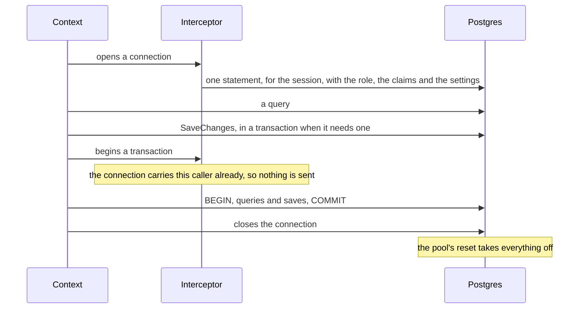
```mermaid
sequenceDiagram
    participant Context
    participant Interceptor
    participant Postgres
    Context->>Interceptor: opens a connection
    Interceptor->>Postgres: one statement, for the session, with the role, the claims and the settings
    Context->>Postgres: a query
    Context->>Postgres: SaveChanges, in a transaction when it needs one
    Context->>Interceptor: begins a transaction
    Note over Interceptor: the connection carries this caller already, so nothing is sent
    Context->>Postgres: BEGIN, queries and saves, COMMIT
    Context->>Postgres: closes the connection
    Note over Postgres: the pool's reset takes everything off
```

<details>
<summary>Show the code: the default, and what it refuses</summary>

```csharp
builder.Services.AddPostgresRowLevelSecurity();   // Scope is RowLevelSecurityScope.Connection

// Refused when a context opens a connection, before anything connects:
//   Host=db;...;No Reset On Close=true
//   Host=db;...;Multiplexing=true
//   Host=aws-0-eu-west-1.pooler.supabase.com;Port=6543;...
```

</details>

**Per transaction.** A transaction pooler gives a client a server connection for one transaction and then
hands it to the next client as it is, so a setting made for a session reaches whoever comes next. In
`Transaction` scope nothing is ever set for a session:

- **A command outside a transaction** gets `RESET ROLE; CALL ddd.use_caller(@role, @claims, @names, @values);`
  written in front of its text. Npgsql sends both together and Postgres runs them as one transaction, so
  the settings apply to that command and end with it, at no round trip. The reset takes off a role some
  other client left on the server connection, so that the call is always made by the role the application
  logged in as.
- **A transaction** a context begins, or is handed with `UseTransaction`, gets the settings once, as its
  first statement, `SELECT set_config('role', $1, true), …`, and so does a `TransactionScope` the
  connection is enlisted in. From there on the transaction runs as that one caller.
- **A save always runs in a transaction.** The commands of a save cannot carry the call in front: Entity
  Framework reads how many rows each statement changed, in order, and would take a save for a concurrency
  conflict after it was written. So the interceptor sets the context's `AutoTransactionBehavior` to
  `Always` before every save, whatever it was, and leaves it there.
- **Opening a connection** sends nothing.

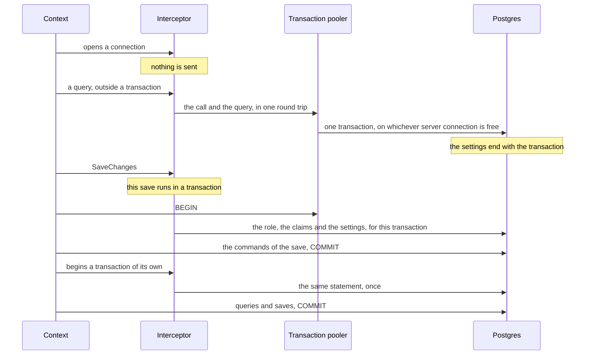
```mermaid
sequenceDiagram
    participant Context
    participant Interceptor
    participant Pooler as Transaction pooler
    participant Postgres
    Context->>Interceptor: opens a connection
    Note over Interceptor: nothing is sent
    Context->>Interceptor: a query, outside a transaction
    Interceptor->>Pooler: the call and the query, in one round trip
    Pooler->>Postgres: one transaction, on whichever server connection is free
    Note over Postgres: the settings end with the transaction
    Context->>Interceptor: SaveChanges
    Note over Interceptor: this save runs in a transaction
    Context->>Pooler: BEGIN
    Interceptor->>Postgres: the role, the claims and the settings, for this transaction
    Context->>Postgres: the commands of the save, COMMIT
    Context->>Interceptor: begins a transaction of its own
    Interceptor->>Postgres: the same statement, once
    Context->>Postgres: queries and saves, COMMIT
```

<details>
<summary>Show the code: the scope, the connection string and the login role's grants</summary>

```csharp
builder.Services.AddPostgresRowLevelSecurity(options => options.Scope = RowLevelSecurityScope.Transaction);

builder.Services.AddDbContext<OrderingContext>((provider, options) => options
    .UseNpgsql("Host=pooler;Port=6432;Database=shop;Username=app;Password=...;No Reset On Close=true;Max Auto Prepare=0")
    .UsePostgresRowLevelSecurity(provider));
```

```sql
-- for a login role that did not run the script that made the procedure
grant usage on schema ddd to app;
grant execute on procedure ddd.use_caller(text, text, text[], text[]) to app;
```

</details>

What the scope asks of an application:

- **The procedure `ddd.use_caller`.** `PostgresRowAccess.SetupScript()` makes it, and so does every script
  of policies and every exported access file, so a database that has the policies has it. It runs as its
  caller and is taken from `PUBLIC`: only the role the application logs in as may call it, since whoever
  could call it could say who they are. A login role that did not run the script needs the two grants
  above.
- **Named parameters.** Entity Framework names every parameter. A command built by hand with a positional
  one, `$1`, is refused outside a transaction: it cannot be mixed with the caller's.
- **No transaction control and no role in SQL of your own.** A command is refused when one of its
  statements begins with `BEGIN`, `START TRANSACTION`, `COMMIT`, `END`, `ROLLBACK`, `ABORT`,
  `PREPARE TRANSACTION`, `SET ROLE`, `RESET ROLE`, `SET SESSION AUTHORIZATION`,
  `RESET SESSION AUTHORIZATION`, `RESET ALL` or `DISCARD`: it would end the transaction the settings live
  in, or change the role itself, and every statement after it would run as the login role. Only the first
  words of a statement count, so `CASE … END` is fine, and so are savepoints, `ROLLBACK TO` included.
  Begin, commit and roll back through the context. This catches a mistake, not an attack: a statement can
  hide the same in a function it calls.
- **Through the pooler,** `No Reset On Close=true`, since the reset Npgsql sends before a connection is
  used again is a session's, and a transaction pooler would run it on whichever server connection is
  free, and `Max Auto Prepare=0`, since a prepared statement lives on one server connection. Both are
  allowed in this scope; `Multiplexing` is still refused. Run migrations, and statements that cannot run
  inside a transaction, through a session pooler or a direct connection.
- **Transactions the context knows about.** A transaction begun on the connection itself and never handed
  to the context is one neither Entity Framework nor the interceptor can see: a command the context sends
  inside it carries the call, and the rest of that transaction then runs as that caller.

When a statement that sets the caller fails in this scope, nothing is left half set: a command outside a
transaction fails with its call, in the same round trip, and a transaction whose first statement failed
is rolled back and never handed to the context.

In both scopes the statement empties `request.jwt.claim.sub`, `request.jwt.claim.role`,
`request.jwt.claim.email` and `request.jwt.claim`. Supabase's `auth.uid()`, `auth.role()`, `auth.email()`
and `auth.jwt()` read those before the claims, so a value that something else left on the server
connection, a pooler that does not reset it for one, would otherwise decide who the statement runs as.

### Fail-closed callers

Outside a request and outside any caller, the answer is the system, which on most databases is the
tables' owner, past every policy. That is what a 3.x host gets, and it means work that nobody said
anything about runs with the application's whole power. A host that would rather have such work fail
says so once:

```csharp
builder.Services.RequireExplicitCallers();
```

Then an accessor that knows no caller throws `NoCallerException` instead of answering the system, so
the first query of work that never said who it runs as fails before it connects. `AmbientCallerAccessor`,
the Supabase accessor for ASP.NET Core outside a request, and `GetSupabaseCaller()` in Azure Functions
outside an HTTP trigger all do. An accessor of your own that answers the system by itself is refused by
the interceptor all the same: the system is the caller only inside `Callers.Begin(Caller.System)`. A
request still has its caller: its user, or `anon`.

The toolkit's own work says who it runs as. Reading, marking and deleting outbox rows, receiving from a
transport, checking the migrations and preparing a sample's database are the application's own
bookkeeping, and run as `Caller.System`. The handlers it calls are not: they run with no caller, inside
`Callers.BeginNone()`, until something begins one for them.

| Work | Without `RequireExplicitCallers` | With it |
|---|---|---|
| The outbox processor's, retention's and a transport's bookkeeping | whoever is current, the system outside any caller | `Caller.System` |
| Turning an event into the contract it is published as, and a sink of your own | whoever is current | `Caller.System`, with the bookkeeping: read only what the event's own module publishes |
| A module's integration event handlers, their inbox read and save | what the module's [scopes](integration-events.md#who-the-handlers-run-as) begin, or whoever is current when it has none | what the module's scopes begin; a module with none does not run them |
| A domain event handler the outbox dispatches in process | whoever is current | nobody: it begins its own caller, or its first query throws |
| The start-up migrations check | `Caller.System` | `Caller.System` |

A domain event handler dispatched in process saves its own work. A change it leaves unsaved on the
outbox processor's context would be saved with the processed mark, as the system, so with the option the
message fails instead and the change is dropped. With `DeliverInTransaction` the processor's context holds
a transaction begun as the system, so such a handler works on a context of its own; a transaction you
begin on the processor's context yourself is joined, and has to be begun as the system too.

A module says what its handlers run as where it registers them, with a scope around each delivery:
a scoped system caller its policies hold, or, written down on purpose, the system itself.

```csharp
services.AddModuleIntegrationEvents<ShippingContext>(module => module
    .Around((services, message, contract) => Callers.Begin(Caller.SystemIn("shipping")))
    .Handle<OrderPlacedV1, BookShipment>());

// or, where the handlers may see every row:
services.AddModuleIntegrationEvents<ShippingContext>(module => module
    .Around(IntegrationEventScopes.System)
    .Handle<OrderPlacedV1, BookShipment>());
```

A caller that leaked into a request, begun by middleware that forgot to end it, would win over the
request's own. `context.SupabaseCaller()` is the request's caller whatever is ambient, so a host can make
it current at the start of every request: `using (Callers.Begin(context.SupabaseCaller()))`.

### Token roles

A token says which role it is for, in its `role` claim. PostgREST switches to whatever role that claim
names. The interceptor does not: the claim picks the database role only through a list the host wrote, so
a token that names the system's role, the login role or any other role the database happens to have runs
as none of them.

| The token's `role` claim | Runs as |
|---|---|
| `authenticated`, or no claim at all | `UserRole`, with the token's claims |
| a role in `TokenRoles` | the role it is mapped to, with the token's claims |
| `UserRole` or `AnonymousRole` by its own name, or `anon` | that role, with the token's claims |
| anything else | nothing: the caller is refused with `access.role-not-allowed` |

The refusal is a `RefusalException` of the kind "not permitted", `ToolkitRefusals.RoleNotAllowed`, whose
argument `Role` is the role the token carried. It is thrown before the context connects, and before the
next command when the caller changed on an open connection, so no statement runs for that caller as any
role. An edge answers it like any other refusal, usually with a 403. A role is matched as the token spells
it, and a `role` claim that is not text, a list of roles say, is a role on no list rather than no claim.

A host whose identity provider gives some of its users a role of their own, analysts who look across every
customer's tickets say, maps that role to a database role:

```csharp
builder.Services.AddPostgresRowLevelSecurity(options =>
{
    options.TokenRoles["analyst"] = "desk_analyst";
});
```

A user whose token carries `analyst` then runs as `desk_analyst`. The claims are still the token's own, so
`ddd.caller_role()` answers `analyst` and `ddd.caller_id()` the user's id. A rule names the role by the
token role, never by the database role, so no role name is baked into a compiled module:

```csharp
public static class DeskRoles
{
    public const string Analyst = RowAccessRoles.TokenPrefix + "analyst";   // "@token:analyst"
}

[RowAccess<Ticket>(RowOperations.Read, To = [DeskRoles.Analyst])]
public static partial class AnalystsReadEveryTicket
{
    public static bool Allows(Ticket ticket, Caller caller) => caller.IsSignedIn;
}
```

An attribute takes constants, which is what `TokenPrefix` is for; `RowAccessRoles.Token("analyst")` gives the
same name where a call will do, in a contribution for one. A script resolves it through the roles it is
written with, `RowAccessExport.Roles`, and `RowAccessRoleNames.Of(options)` carries the map. A rule for a
token role those roles do not map is refused when the script is written, naming the rule: its policy
would be for a role no query runs as. The Supabase export takes the map from a
[build property](supabase.md#roles-and-caller-functions-of-your-own).

**The mapped role is held to its policies like the [scoped system role](#the-scoped-system-role).**
`SetupScript(options)` makes it `NOLOGIN NOINHERIT` and grants it to the login role, and a script whose
policies name it makes it where the database does not have it. Both fail when a role of that name exists
that can log in, can bypass row level security or is a superuser, that has the privileges of a role that
owns tables, or whose privileges the user's or the anonymous caller's role has. The scoped system role's
own check takes the mapped roles in: none of them may have its privileges, or the holder of a token would
do the application's own work. The options refuse a map to `SystemRole`, to the scoped system role or to
`AnonymousRole` where they are registered. Like the other roles, a mapped role needs privileges on your
tables before its policies let it near a row:

```sql
grant usage on schema desk to desk_analyst;
grant select on all tables in schema desk to desk_analyst;
```

**A mapped role is kept apart from the other callers in both directions.** The user's and the anonymous
caller's role may not have its privileges, and it may not have theirs. Both scripts fail for a mapped role
that has the privileges of `UserRole` or `AnonymousRole`: the holder of an analyst's token would be a
signed-in user as well, or an anonymous caller with an identity, and get every policy and every privilege
written for them.

```sql
grant authenticated to desk_analyst with inherit true;   -- Postgres 16 and later
-- The next setup script fails, and so does the next script that has a policy for desk_analyst
-- or writes privileges:
--   The role desk_analyst has the privileges of authenticated or anon, so the holder of a token mapped
--   to it would get every policy and every privilege written for those callers. ...
revoke authenticated from desk_analyst;
```

What analysts share with signed-in users is said by the rules instead: a rule for both names both,
`To = [RowAccessRoles.User, DeskRoles.Analyst]`, and each role is given its own privileges. What counts is
having the privileges, which is what `pg_has_role(..., 'USAGE')` answers: a membership that hands nothing
on, `with inherit false`, is not refused. Before Postgres 16 a grant has no such option and the role's own
`INHERIT` decides for all of its memberships, so there the check fails for a mapped role somebody made
`INHERIT` and granted one of the two, and not for the `NOINHERIT` one the scripts make.

A token role may also be mapped to `UserRole` itself, for a provider that calls its signed-in users
`member`: it is then that role, and nothing is made or checked for it.

**A role on no list.** `UnknownTokenRole.Refuse` is the default. With `UnknownTokenRole.Anonymous` such a
caller runs as an anonymous one instead: `AnonymousRole`, with an anonymous caller's claims,
`{"role":"anon"}`, so the database sees no user and `ddd.caller_id()` is `null`. A module's
[settings](#settings-of-your-own) are asked for `Caller.Anonymous` too, so one made
from the user's id or claims is what it is for a request without a user. In C# the caller is still the
user the token names, so a rule asked in C# may allow what the policies then refuse. Choose it for a host
that would rather show such a caller what everybody may see than refuse it.

The interceptor reads the roles once, when it is built: a change to the options afterwards reaches no
connection.

> [!IMPORTANT]
> A token whose role is neither `authenticated` nor one the host listed used to run as `UserRole`,
> whatever it said. It is now refused. A host whose tokens carry a role of their own maps it in
> `TokenRoles`, to `UserRole` where those users are ordinary signed-in users.

### A caller that changes on an open connection

A connection can stay open over more than one caller: one opened with `OpenConnection()`, or a
transaction's. Before every command, and before a transaction begins, the interceptor works the role,
the claims and the settings out again and compares them with what it set on the connection:

- outside a transaction, a change is set first, with the same statement, which costs one round trip when
  the caller changed and none when it did not;
- inside a transaction, it is not set: a transaction runs as one caller, and a setting made inside it
  would be undone by its rollback. With `RequireExplicitCallers` the command is refused with an
  `InvalidOperationException` that names both callers; without it a warning is logged, once per
  connection, and the transaction goes on as the caller it began with.

Begin the caller before the transaction, or run the other caller's work on a context of its own.

A connection opened inside a `TransactionScope` sets the caller inside that transaction. When the scope
rolls back, the setting goes with it, and the interceptor sets the caller again before the connection's
next command. A transaction you begin with SQL of your own, `BEGIN` in a command, is not one the
interceptor sees, and neither is one begun on the connection itself and never handed to the context.

Where the settings last one transaction, the same holds inside a transaction: the caller it began with is
the caller it runs as, and a change is refused or logged. Outside one there is nothing to compare, since
every command carries the caller there is when it is sent.

### A connection you pass in

A context can be given a connection it did not open, `UseNpgsql(connection)`, and a transaction it did
not begin, `Database.UseTransaction(transaction)`. What a connection carries is remembered for the whole
process, not per interceptor, so it does not matter which context, or which instance of the interceptor,
set it:

- **A connection another context opened** carries that context's caller into the next one, which compares
  it with the current caller as it would on one it opened itself, and sends nothing when they agree.
- **A connection nobody set a caller on,** one opened by hand, gets the caller before the context's first
  command on it, which costs that one round trip, once. Closed and opened again by the code that owns it,
  it carries nothing, and gets the caller again.
- **A connection nobody set a caller on, with a transaction already open on it,** handed over with
  `UseTransaction` or opened inside a `TransactionScope`, cannot be given one safely: what is set for a
  session inside a transaction is undone by its rollback, and whatever ran in it before ran as the login
  role. With `RequireExplicitCallers` the command is refused with an `InvalidOperationException` that says
  what to change. Without it a warning is logged, once per connection, and the command runs as the role the
  connection carries.
- **In `Transaction` scope** a command outside a transaction carries its call whoever opened the
  connection, and a transaction handed over with `UseTransaction` gets the settings at that moment, for
  the rest of it.

Two contexts that work in one transaction both have to be told of it: begin it on one and hand it to the
other with `UseTransaction`. The second then finds the caller the transaction began with and runs as it,
and a different caller by then is refused, as inside any transaction. What is set for one transaction is
marked on the server, so a context asks the server rather than trust what it remembers of a transaction
object: once, when it is handed the transaction, or before every command when it uses the connection
without having been handed it.

> [!NOTE]
> Where the login role [owns nothing](#a-login-that-owns-nothing), a command on a connection without a
> caller fails with Postgres's `42501`, permission denied, and no word about why. The interceptor either
> gives such a connection its caller or refuses the command with a message that names the three ways
> out: open the connection through a context, begin the transaction after a context opened it, or take
> the connection from [`CallerConnections`](#sql-of-your-own).

### Settings of your own

A module whose policies need more than the caller, the team a request chose, for one, puts it on the
connection next to the role and the claims, in the same statement, so it costs no round trip of its own.
It names its settings, and gives their values for each caller:

```csharp
public sealed class TeamSetting : IRowLevelSecuritySettings
{
    public IReadOnlyCollection<string> Names { get; } = ["teams.current"];

    public IEnumerable<KeyValuePair<string, string>> For(Caller caller)
        => TeamScope.Current is { } team ? [new("teams.current", team.ToString())] : [];
}

services.AddPostgresRowLevelSecurity();
services.AddRowLevelSecuritySettings<TeamSetting>();
```

A policy reads it with `current_setting('teams.current', true)`. Every name a module declares is set every
time, to its value or to `''` when `For` leaves it out, so a pooled connection never keeps an earlier
caller's value; a name it did not declare fails the connection. The names are checked when the
interceptor is built: `prefix.name` in lower case, none of PostgREST's `request.*`, and one owner each.

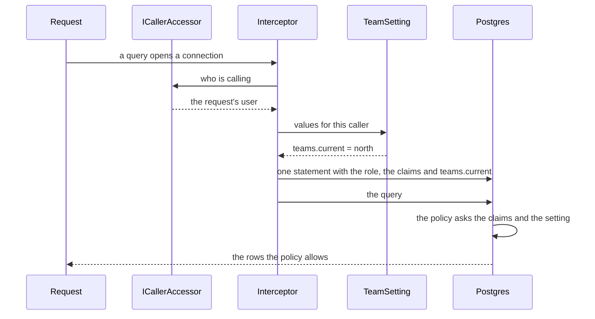
```mermaid
sequenceDiagram
    participant Request
    participant Accessor as ICallerAccessor
    participant Interceptor
    participant Settings as TeamSetting
    participant Postgres
    Request->>Interceptor: a query opens a connection
    Interceptor->>Accessor: who is calling
    Accessor-->>Interceptor: the request's user
    Interceptor->>Settings: values for this caller
    Settings-->>Interceptor: teams.current = north
    Interceptor->>Postgres: one statement with the role, the claims and teams.current
    Interceptor->>Postgres: the query
    Postgres->>Postgres: the policy asks the claims and the setting
    Postgres-->>Request: the rows the policy allows
```

<details>
<summary>Show the code: the policy that asks both</summary>

```sql
CREATE POLICY "A team sees its notebooks" ON teams."Notebooks" FOR SELECT TO authenticated
    USING ("Team" = current_setting('teams.current', true)
           AND "Members" @> ARRAY[(SELECT ddd.caller_id())]);
```

</details>

A setting is the application's word, not the caller's: any statement on the application's connection can
set it to anything, as it can the role. A policy that can derive what it needs from the verified claims,
and use the setting only to choose among what those allow, stays right when the application's own code
sets a wrong value.

### A statement timeout per caller

Postgres applies the settings stored on a role, `alter role authenticated set statement_timeout = '8s'`,
when that role logs in, not when a session switches to it. A caller's statements therefore run under the
timeout of the role the application logged in as, whatever the caller's own role says. Say the timeout per
kind of caller instead:

```csharp
builder.Services.AddPostgresRowLevelSecurity(options =>
{
    options.StatementTimeouts[CallerKind.User] = TimeSpan.FromSeconds(8);
    options.StatementTimeouts[CallerKind.Anonymous] = TimeSpan.FromSeconds(3);
});
```

It travels in the statement that sets the caller, so it costs no round trip, and a statement that runs
longer is cancelled by Postgres with `57014`, `query_canceled`. A kind left out gets the login role's own
again, its reset value, read in the same statement: a timeout never outlives the caller it was set for,
on a connection that stays open over several callers as little as on a pooled one. Where the settings
last one transaction the timeout is the transaction's, and a kind without one sets nothing. A user whose
[token role](#token-roles) is on no list and who runs as an anonymous caller gets the anonymous caller's.
A timeout is at least a millisecond. With no timeout configured, the statement is what it always was.

### SQL of your own

SQL sent through a context, `context.Database.SqlQuery`, `ExecuteSql` and `FromSql`, goes through the
interceptor like any query, in both scopes. SQL sent past Entity Framework, a command on
`context.Database.GetDbConnection()`, does not, and what it runs as differs between the scopes:

| Scope | A command on `GetDbConnection()` runs as |
|---|---|
| `Connection` | the caller the connection carries, for as long as the context holds it open |
| `Transaction` | the login role, since nothing lives on a session, unless it runs inside a transaction the context began or was handed |

For SQL a module sends without a context, a report read with a data reader or a bulk copy, take the
connection from `CallerConnections`, which sets the caller with the interceptor's own statement, refuses
what the interceptor refuses, and brings the [statement timeout](#a-statement-timeout-per-caller) and the
[settings of your own](#settings-of-your-own) along:

```csharp
builder.Services.AddCallerConnections(provider => provider.GetRequiredService<NpgsqlDataSource>());

public sealed class OrderExport(CallerConnections connections)
{
    public async Task WriteAsync(Stream output, CancellationToken cancellationToken)
    {
        await using var transaction = await connections.BeginTransactionAsync(cancellationToken);
        await using var connection = transaction.Connection!;

        await using var command = connection.CreateCommand();
        command.Transaction = transaction;
        command.CommandText = """SELECT "Id", "Total" FROM ordering."Orders" """;   // the caller's orders, by the policies
        await using var reader = await command.ExecuteReaderAsync(cancellationToken);
        // ...
    }
}
```

- `BeginTransactionAsync` works in both scopes: an open connection, a transaction on it, and the caller
  set for that transaction alone. The connection is the transaction's, and yours to dispose with it.
- `OpenAsync` gives an open connection with the caller set for its session, and is refused in
  `Transaction` scope, where a session must carry nothing.
- **One caller per connection.** The caller is the one there is when the connection is opened. Dispose it
  before the caller changes.
- A context handed such a connection, or such a transaction, [finds the caller there](#a-connection-you-pass-in)
  and sends nothing of its own.

### With a context pool

A context pool, `AddPooledDbContextFactory` or `AddDbContextPool`, builds a context's options once and
hands one instance to one caller after another. Nothing of row level security is kept on a context or
read while the options are built, so the call is the one above, with the provider the pool's callback is
handed:

```csharp
builder.Services.AddPooledDbContextFactory<OrderingContext>((provider, options) => options
    .UseNpgsql(connectionString)
    .UseDDDToolkit(provider)
    .UsePostgresRowLevelSecurity(provider));
builder.Services.AddScopedFromPool<OrderingContext>();
```

- **Read at every use:** who is calling, the role and the claims that follow from it, and the values of
  every `IRowLevelSecuritySettings`. The interceptor asks when a connection opens, before every command
  and before a transaction begins, so each rental runs as its own caller, whoever held the instance
  before. A settings class of your own keeps to the same rule: `For(caller)` works its values out each
  time, and keeps nothing per connection or per context.
- **Reset between renters:** a context that goes back to the pool closes its connection and keeps the
  connection object. What was set on the server connection Npgsql clears before that connection is used
  again, and the interceptor sets the role, the claims and the settings anew on the next open, whatever
  it remembered of the last. Where the settings last one transaction there is nothing to reset: a
  transaction a context left open is rolled back when the context goes back, and the settings with it.

A context pool is not a bound on connections. A context holds a connection only while a command runs,
while it has a transaction, or between `OpenConnection()` and `CloseConnection()`, and a context that
waits in the pool holds none. The bound is the data source's, so budget it there:

- **Say the limits.** Give every data source its `Maximum Pool Size`, `Minimum Pool Size`,
  `Connection Idle Lifetime`, `Connection Lifetime`, `Timeout` and `Application Name` in its connection
  string, rather than leaving Npgsql's defaults to decide.
- **More readers than connections wait.** A read that needs a connection when none is free waits up to
  `Timeout` seconds, and then fails with Npgsql's exception for an exhausted pool. It does not hang.
- **Never wait for a second connection while you hold one.** Code that has a transaction open, or a
  connection it opened by hand, and then runs a query on another context needs two at once. With a
  small pool, two requests that do so each hold one and wait for the other until `Timeout`. Without such
  nesting a data source of one connection still completes everything, one piece of work at a time.
- **Size for the widest request.** `Maximum Pool Size` is at least the number of reads one request runs
  side by side, so that a request never queues behind itself, and every instance of the application,
  with its pollers and its listeners, stays within what the database, or the pooler in front of it,
  allows.

[Contexts from a pool](entity-framework.md#contexts-from-a-pool) has the registration, and what Entity
Framework resets when a context goes back.

## A Postgres of your own

A Supabase project has the roles and the functions a policy asks about the caller. A Postgres of your
own has neither until `PostgresRowAccess.SetupScript()` makes them: `anon` and `authenticated`, and
`ddd_system_in`, the [scoped system role](#the-scoped-system-role), all three granted to the role the
application logs in as so it may switch to them, and with them the role of every
[token role](#token-roles) the options it is given map; `ddd.caller_id()`, `ddd.caller_role()` and
`ddd.caller_claims()`, which read the claims the interceptor set;
`ddd.written_in_this_transaction(xmin)`, which the policies of an aggregate's entities ask; and the
procedure `ddd.use_caller`, which sets a caller for one transaction where the
[settings travel per transaction](#how-the-settings-travel), and which only the login role may call. It
can run again, so it belongs in an early migration:

```csharp
public partial class RowLevelSecurity : Migration
{
    protected override void Up(MigrationBuilder migrationBuilder)
    {
        migrationBuilder.Sql(PostgresRowAccess.SetupScript());
        migrationBuilder.Sql("""
            grant usage on schema ordering to anon, authenticated;
            grant select, insert, update, delete on all tables in schema ordering to anon, authenticated;
            alter default privileges in schema ordering grant select, insert, update, delete on tables to anon, authenticated;
            """);
    }
}
```

The grants give the two roles the tables; the policies then decide which rows. A script of policies
can write them instead, table by table and command by command, from the policies it holds:
[Privileges from the policies](#privileges-from-the-policies). `ddd.caller_id()` is
`null` for a token whose `sub` is not a `uuid`, so a rule about a user matches nobody rather than failing
every query; `Caller.UserId` is `null` for it too.

Those grants take in the module's outbox and inbox tables as well, which have no policies, so a caller
could read every pending message. A caller's save only adds outbox rows, and the toolkit reads, marks and
deletes them as the system; an inbox is read and added to by whoever a module's handlers run as, never by
a request. Take the rest back:

```sql
revoke select, update, delete on ordering."OutboxMessages" from anon, authenticated;
revoke all on ordering."InboxMessages" from anon, authenticated;
```

The role that runs `SetupScript()` owns the `ddd` schema, its functions and its procedure. When somebody
else runs it, `SetupScript(loginRole: "app")`, and the application's migrations then run as `app`, the
policy scripts leave those objects alone while they are as the policies need them. When an upgrade of the
toolkit changes `ddd.written_in_this_transaction` or `ddd.use_caller`, or brings a role the setup makes,
such as `ddd_system_in`, `app` cannot replace what it does not own, and may not be allowed to create a
role: run the new version's `SetupScript()` first, as the role that ran it before. It makes and grants
what is missing, and the scripts then leave it as it is.

## Row access rules written in C#

A rule is a static method on a class of its own, marked with the aggregate it guards and what it allows:

```csharp
[RowAccess<Order>(RowOperations.Read | RowOperations.Change)]
public static partial class ACustomerSeesTheirOrders
{
    public static bool Allows(Order order, Caller caller)
        => order.PlacedBy == null || order.PlacedBy?.Value == caller.UserId;
}
```

When the class compiles, the generator translates `Allows` into SQL and writes it into the class as
`RowAccessSql`. The rule stays an ordinary method as well, so a handler, a test or a screen asks the same
rule in C#: `ACustomerSeesTheirOrders.Allows(order, caller)`.

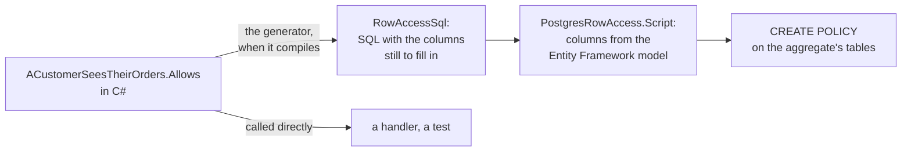
```mermaid
flowchart LR
    Rule["ACustomerSeesTheirOrders.Allows<br/>in C#"] -->|"the generator,<br/>when it compiles"| Template["RowAccessSql:<br/>SQL with the columns<br/>still to fill in"]
    Template --> Script["PostgresRowAccess.Script:<br/>columns from the<br/>Entity Framework model"]
    Script --> Policies["CREATE POLICY<br/>on the aggregate's tables"]
    Rule -->|"called directly"| Handler["a handler, a test"]
```

<details>
<summary>Show the code: what the generator writes into the rule, and what the script makes of it</summary>

```csharp title="ACustomerSeesTheirOrders.RowAccess.g.cs, shortened"
partial class ACustomerSeesTheirOrders
{
    public const string RowAccessSql = "(({col:PlacedBy} IS NULL) OR ({col:PlacedBy} IS NOT DISTINCT FROM {caller:uid}))";
}
```

```csharp
// The script takes the columns from the context's model,
// and writes a policy per command and role
var sql = PostgresRowAccess.Script(context,
[
    RowAccessRule.For<Order>("A customer sees their orders", RowOperations.Read | RowOperations.Change, ACustomerSeesTheirOrders.RowAccessSql),
]);

// The same rule, called directly
var allowed = ACustomerSeesTheirOrders.Allows(order, caller);
```

```sql
CREATE POLICY "A customer sees their orders (select) for authenticated" ON ordering."Orders" FOR SELECT TO authenticated
    USING (("PlacedBy" IS NULL) OR ("PlacedBy" IS NOT DISTINCT FROM (SELECT ddd.caller_id())));
-- and one for anon, and one per role for UPDATE

-- OrderLine belongs to the aggregate: it is read with its Orders, and written as the rules let a caller write its Orders.
CREATE POLICY "OrderLine (select) for authenticated" ON ordering."OrderLine" FOR SELECT TO authenticated
    USING (EXISTS (SELECT 1 FROM ordering."Orders" parent WHERE parent."Id" = ordering."OrderLine"."OrderId"));
-- and one for anon, and one per role for INSERT, UPDATE and DELETE
```

</details>

What the generator translates, and into what:

| In `Allows` | In the policy |
|---|---|
| `order.PlacedBy == null \|\| order.PlacedBy?.Value == caller.UserId` | `("PlacedBy" IS NULL) OR ("PlacedBy" IS NOT DISTINCT FROM ddd.caller_id())` |
| `order.Status != OrderStatus.Cancelled` | `"Status" <> 2`, or `'Cancelled'` when the column stores it as text |
| `order.Total.Amount <= 500` | `coalesce("Total_Amount" <= 500, FALSE)` |
| `caller.IsSignedIn && !order.IsPublic` | `(ddd.caller_id() IS NOT NULL) AND (NOT "IsPublic")` |
| `caller.Claim("app_metadata.team") == order.Team` | `ddd.caller_claims() #>> '{app_metadata,team}' IS NOT DISTINCT FROM "Team"` |
| `caller.Role == "authenticated"` | `ddd.caller_role() IS NOT DISTINCT FROM 'authenticated'` |
| `order.Due < DateTimeOffset.UtcNow` | `coalesce("Due" < now(), FALSE)` |

`==` keeps C#'s meaning. Between two values C# says cannot be null, an enum, a number, a flag, a `Guid`
or an id that is a struct, it is SQL's `=`, which an index can answer. Where either side can be null it
is C#'s equality, nulls included: `IS NOT DISTINCT FROM`, which no index answers. A comparison that SQL
would leave unknown is false, as it is in C#, except one with a
[scalar question](#set-shaped-questions), which has no C# answer. `DateTimeOffset.UtcNow` and
`DateTime.UtcNow` are the database's `now()`, the time its transaction began. Compare it with a column of
type `timestamp with time zone`, which is what Npgsql makes of a `DateTime` or a `DateTimeOffset` by
default: against a `timestamp without time zone`, Postgres turns `now()` into the time of the session's
time zone, which a caller of the Data API can choose. The caller functions are wrapped in `(SELECT ...)` in
the policy itself, so Postgres asks them once per query rather than once per row. Column names come from the
Entity Framework model when the policies are written, so renaming a property or its column changes the
policy with it. A value object stored inline is its columns, and a typed id's `.Value` is the id's column.

What the database cannot check is a compile error on that expression: a method call such as
`order.Team.StartsWith("n")`, a local variable, anything about another aggregate. A question only the
database can answer is asked through an [access function](#asking-the-aggregates-entities-access-functions)
or a [set-shaped question](#set-shaped-questions). For the rest, `Sql.Call<T>` and `Sql.Raw<T>` write SQL
into the rule:

```csharp
public static bool Allows(Order order, Caller caller)
    => order.PlacedBy?.Value == caller.UserId
       || Sql.Call<bool>("support.is_agent", caller.UserId);
```

The arguments are translated like the rest; the function is yours to create in a migration. A rule that
uses either is the database's only: called in C#, it throws, because C# cannot run the SQL.

**Entities follow their aggregate.** A rule is on the root. The tables of the aggregate's entities, an
order's lines, get policies of their own that ask the root: a caller reads a line when it may read the
order, and writes one when the order's write rules let it; see
[The aggregate's entities](#the-aggregates-entities).

**Roles.** A rule is for signed-in users and callers without a user unless `To` says otherwise:
`[RowAccess<Order>(RowOperations.Read, To = [RowAccessRoles.User])]`. Several rules on one aggregate add
up: a row one of them allows is allowed. Each policy is for one role; see
[One policy per command and role](#one-policy-per-command-and-role).

**A stricter key for one column.** A rule with `Columns = [nameof(Order.Status)]` holds a change of those
columns alone, beside the rules for the row, for a column whose change takes more than changing the row does;
see [Column rules](#column-rules).

[DDD00038](diagnostics.md#ddd00038) to [DDD00041](diagnostics.md#ddd00041), [DDD00051](diagnostics.md#ddd00051)
and [DDD00052](diagnostics.md#ddd00052) are the rules the generator enforces: the class's shape and the
columns a column rule names, what it can translate, that the type is an aggregate root, that a rule asks an
access function about the aggregate's entities, that a set is asked once per statement, and that a function's
name has an owner.

### One policy per command and role

Every policy a script writes is for one command and one role, and a table gets at most one policy for
each pair: the rules that let a role do one thing to a table are asked in one policy, their conditions
OR-ed together. Postgres ORs a table's permissive policies anyway, so nothing is allowed that the rules on
their own would not allow. What it gives is one place per table, command and role that says who may do
what, which is also what Supabase's performance advisor asks for.

| Rules that grant a role a command | The policy |
|---|---|
| one | named after the rule, the command and the role: `"A customer has their orders (select) for anon"` |
| several | named after the table: `"Orders (select) for authenticated"`, with a comment above it naming the rules |

So a policy's name changes when another rule starts or stops granting the same command to the same role.
A test or a script of your own that looks a policy up does better to ask for its table, command and role
than for its name.

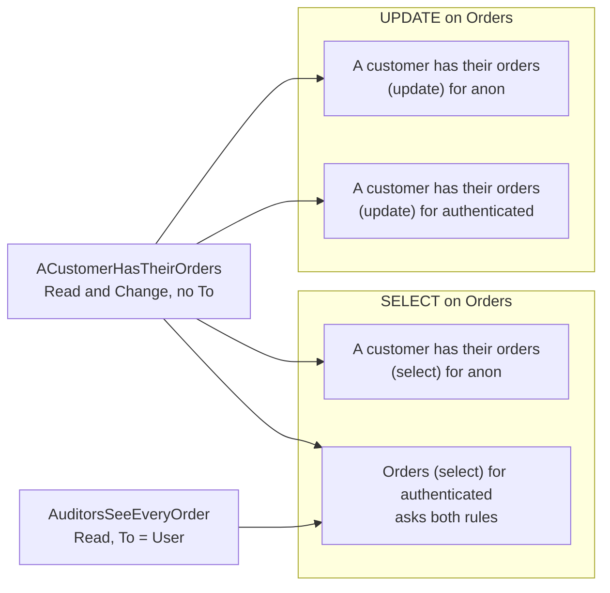
```mermaid
flowchart LR
    Customer["ACustomerHasTheirOrders<br/>Read and Change, no To"]
    Auditors["AuditorsSeeEveryOrder<br/>Read, To = User"]
    subgraph Reading["SELECT on Orders"]
        SelectAnon["A customer has their orders<br/>(select) for anon"]
        SelectUser["Orders (select) for authenticated<br/>asks both rules"]
    end
    subgraph Changing["UPDATE on Orders"]
        UpdateAnon["A customer has their orders<br/>(update) for anon"]
        UpdateUser["A customer has their orders<br/>(update) for authenticated"]
    end
    Customer --> SelectAnon
    Customer --> SelectUser
    Auditors --> SelectUser
    Customer --> UpdateAnon
    Customer --> UpdateUser
```

<details>
<summary>Show the code: the two rules, and the policy that asks both</summary>

```csharp
[RowAccess<Order>(RowOperations.Read | RowOperations.Change)]
public static partial class ACustomerHasTheirOrders
{
    public static bool Allows(Order order, Caller caller)
        => order.PlacedBy == null || order.PlacedBy?.Value == caller.UserId;
}

[RowAccess<Order>(RowOperations.Read, To = [RowAccessRoles.User])]
public static partial class AuditorsSeeEveryOrder
{
    public static bool Allows(Order order, Caller caller) => caller.Claim("app_metadata.auditor") == "true";
}
```

```sql
-- Orders (select) for authenticated asks the rules 'A customer has their orders' and 'Auditors see every order': a row one of them allows is allowed.
CREATE POLICY "Orders (select) for authenticated" ON ordering."Orders" FOR SELECT TO authenticated
    USING ((("PlacedBy" IS NULL) OR ("PlacedBy" IS NOT DISTINCT FROM (SELECT ddd.caller_id())))
        OR ((SELECT ddd.caller_claims() #>> '{app_metadata,auditor}') IS NOT DISTINCT FROM 'true'));
```

</details>

A policy you wrote yourself, permissive or restrictive, is never merged into these: a script only ever
drops and makes the policies it made, found by their comment. A restrictive policy of yours on the same
table still holds every caller it names to its own condition as well.

The types of a hierarchy that Entity Framework maps to one table share its policies, and those of their
entities' tables, in the same way. A rule about a type derived in the hierarchy holds for that type's rows,
and those of the types derived from it, only: its condition also asks the table's discriminator, so a rule
about priority orders says nothing about the other orders in the table.

**Roles by what they are for.** `To` names roles through `RowAccessRoles`: `User` for a signed-in user,
`Anonymous` for a caller without one, and `SystemIn` for the [scoped system role](#the-scoped-system-role).
A rule compiles with the symbols, and a script writes the roles they stand for, so a module's rules suit
every host whatever it calls its roles. `RowAccessRoleNames.Default` is `authenticated`, `anon` and
`ddd_system_in`; `RowAccessRoleNames.Of(options)` takes the roles the interceptor switches to with those
options:

```csharp
var sql = PostgresRowAccess.Script(context, rules, accessFunctions, new RowAccessExport
{
    Roles = RowAccessRoleNames.Of(rowLevelSecurityOptions),
    CallerFunctions = PostgresCallerFunctions.Toolkit,
});
```

A role's own name in `To` works as well, and is written as it is spelled, in double quotes where Postgres
would otherwise fold it to lower case. `PUBLIC` is refused, in any spelling: it is every role there is, the
application's own included. So is a name with a `$`, which a script cannot write into the blocks it puts
role names in, and one longer than the 63 bytes of a name Postgres keeps. The Supabase build takes the
roles and the caller functions from two properties of the project; see
[Supabase](supabase.md#roles-and-caller-functions-of-your-own).

### The scoped system role

`RowAccessRoles.SystemIn`, `ddd_system_in` unless you configure another, is the role the application's own
work runs as when it should stay inside the policies: a scoped system caller, `Caller.SystemIn(scope)`. It
can neither log in nor bypass row level security, so the rows it reads and writes are those its policies
allow, as for a user. Its claims carry its scope, `{"role":"ddd_system_in","scope":"projects"}`, so a
policy can tell one module's work from another's with `(SELECT ddd.caller_claims()) ->> 'scope'`. A scope
is lower case letters, digits, `_` and `-`, such as the module's name. A script whose policies are for it
makes sure of that, in its prelude:

- it makes the role, `NOLOGIN NOINHERIT`, where the database does not have it. That needs a role that may
  create roles; where the migrations run as one that may not, run `SetupScript()` first, as the role that
  may, and the scripts then find the role made;
- it fails when a role of that name exists that can log in, bypass row level security or is a superuser,
  or that has the privileges of a role that owns tables, because Postgres does not hold an owner to row
  level security, so the policies would hold nothing back;
- it fails when the user's or the anonymous caller's role has the scoped role's privileges, or the role
  of a mapped [token role](#token-roles) has, because a policy for a role applies to every role that has
  its privileges, so every caller would get the policies meant for the application's own work;
- it grants the role to the role running the script, unless that one may switch to it already. Since
  Postgres 16 the role that creates a role may administer it but not switch to it until it grants itself
  the role.

Like `anon` and `authenticated`, the role needs privileges on your tables before its policies let it read
or write a row:

```sql
grant usage on schema ordering to ddd_system_in;
grant select, insert, update, delete on all tables in schema ordering to ddd_system_in;
```

As for the other two roles, take back what it does not need on the module's outbox and inbox tables,
which have no policies: it adds outbox rows, and reads and adds the inbox rows of the handlers that run as
it.

```sql
revoke select, update, delete on ordering."OutboxMessages" from ddd_system_in;
revoke update, delete on ordering."InboxMessages" from ddd_system_in;
```

A login role other than the one that runs the migrations needs a grant of its own:
`grant ddd_system_in to app;`. `SetupScript()` makes the role the same way, refuses one the prelude would
refuse, and grants it to the login role. `PostgresRowLevelSecurityOptions.SystemInRole` names it; `null`
leaves it out of the setup, and a scoped system caller then fails before its query connects, rather than
running as another role. A rule for `RowAccessRoles.SystemIn` still gets its policies then:
`RowAccessRoleNames.Of(options)` writes them for `ddd_system_in`, and the script makes that role where it is
missing. Leave such rules out where the application has no scoped system role.

### The aggregate's entities

Each table of an aggregate's entities gets one policy per command and role that a rule of the root
grants, named after the table, the command and the role: `"OrderLine (insert) for anon"`. Each asks the
root's rules about the root row the entity belongs to:

| On the entity's table | Allowed when |
|---|---|
| `SELECT` | the caller may read the row the entity belongs to, which answers under its own policies |
| `INSERT` | a `Change` rule allows the root row, or a `Create` rule does and the running transaction wrote that row |
| `UPDATE` | a `Change` rule allows the root row |
| `DELETE` | a `Change` or a `Remove` rule allows the root row |

So an aggregate is visible whole or not at all, and Entity Framework never loads half of one. And a caller
whose rules only let it read an order cannot add, change or remove its lines, whether it tries through
Entity Framework, with SQL of its own or through the Data API. An entity of an entity, a line's parts, is
read with its line and written under the order's rules, which its policies reach by going up through the
line to the order. A command no rule grants a role gets no policy for that role, and Postgres refuses it.

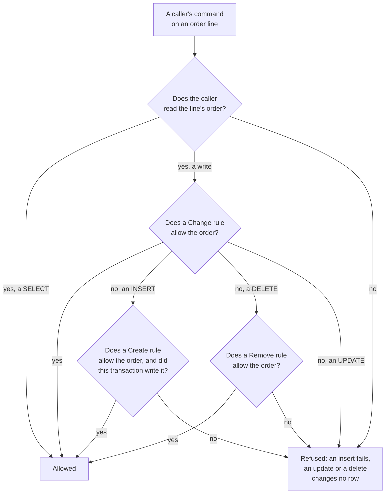
```mermaid
flowchart TD
    Command["A caller's command<br/>on an order line"] --> Readable{"Does the caller<br/>read the line's order?"}
    Readable -->|"yes, a SELECT"| Allowed["Allowed"]
    Readable -->|"yes, a write"| Change{"Does a Change rule<br/>allow the order?"}
    Readable -->|no| Refused["Refused: an insert fails,<br/>an update or a delete<br/>changes no row"]
    Change -->|yes| Allowed
    Change -->|"no, an INSERT"| Create{"Does a Create rule<br/>allow the order, and did<br/>this transaction write it?"}
    Change -->|"no, a DELETE"| Remove{"Does a Remove rule<br/>allow the order?"}
    Change -->|"no, an UPDATE"| Refused
    Create -->|yes| Allowed
    Create -->|no| Refused
    Remove -->|yes| Allowed
    Remove -->|no| Refused
```

<details>
<summary>Show the code: the order's rules, and two of the policies they give its lines</summary>

The rules are on the order; nothing mentions its lines:

```csharp
[RowAccess<Order>(RowOperations.Read | RowOperations.Change)]
public static partial class ACustomerHasTheirOrders
{
    public static bool Allows(Order order, Caller caller)
        => order.PlacedBy == null || order.PlacedBy?.Value == caller.UserId;
}

[RowAccess<Order>(RowOperations.Create)]
public static partial class NobodyOrdersForSomebodyElse
{
    public static bool Allows(Order order, Caller caller) => order.PlacedBy?.Value == caller.UserId;
}
```

Reading a line asks whether the caller reads its order; adding one asks the order's rules about the order:

```sql
CREATE POLICY "OrderLine (select) for authenticated" ON ordering."OrderLine" FOR SELECT TO authenticated
    USING (EXISTS (SELECT 1 FROM ordering."Orders" parent WHERE parent."Id" = ordering."OrderLine"."OrderId"));

CREATE POLICY "OrderLine (insert) for authenticated" ON ordering."OrderLine" FOR INSERT TO authenticated
    WITH CHECK (EXISTS (SELECT 1 FROM ordering."Orders" r WHERE r."Id" = ordering."OrderLine"."OrderId"
        AND (((r."PlacedBy" IS NULL) OR (r."PlacedBy" IS NOT DISTINCT FROM (SELECT ddd.caller_id())))
          OR ((r."PlacedBy" IS NOT DISTINCT FROM (SELECT ddd.caller_id())) AND ddd.written_in_this_transaction(r.xmin)))));
```

</details>

The `Create` case lets a caller who may place an order, but not change one, add the lines of the order
it is placing in the same save. Later in the same transaction, only SQL of your own can add more: when
a save adds a line to an order, the toolkit bumps the order's version, and that is an update, which needs
`Change`. The policy asks `ddd.written_in_this_transaction(xmin)` about the order's row, which is true when
the running transaction wrote the row's current version, inside a savepoint or not. Right after its drop,
every script makes that function, and the `ddd` schema it lives in, when they are missing or differ.

> [!NOTE]
> The function asks whether the transaction *wrote* the root row, not whether it inserted it. A root row
> the same transaction updated counts as well, whatever updated it: an `UPDATE` policy you wrote by
> hand, a trigger, a `SECURITY DEFINER` function, a foreign key's `ON UPDATE CASCADE` or
> `ON DELETE SET NULL`, which run as the table's owner, or work the application did earlier in that
> transaction as another caller. The rules' own policies are not such a way: a caller with only a `Create`
> rule cannot make an existing order count by updating it, because the update needs a `Change` rule and
> so changes no row. An `UPDATE` policy of your own on the root therefore also lets its callers add
> entities wherever a `Create` rule holds. And the policy reads the root as the caller, so a caller who may
> create a root but not read it cannot add its entities: whoever may create an aggregate should also be
> allowed to read it.

A root row so old that Postgres has frozen it, written more than two billion transactions earlier, keeps
the id of the transaction that wrote it, and that id can pass for a recent one. Adding an entity to such a
row with only a `Create` rule then fails with an error instead of the usual refusal, or, when that old id
matches a transaction running at that moment, is allowed.

### Asking the aggregate's entities: access functions

Whether the caller is one of a project's members is a question about the project's entities, and a rule
cannot ask it itself. The tables of the entities have policies that ask the aggregate's table whether
their row is visible, so a policy on the aggregate's table that read them would ask itself, and Postgres
stops the query with infinite recursion ([DDD00041](diagnostics.md#ddd00041)). Put the question in an
access function, written the way a rule is, and let the rules call it:

```csharp
[AccessFunction<Project>("projects.is_member")]
public static partial class ProjectMembership
{
    public static bool Allows(Project project, Caller caller)
        => project.Members.Any(member => member.UserId == caller.UserId);
}

[RowAccess<Project>(RowOperations.Read | RowOperations.Change)]
public static partial class MembersWorkOnTheirProjects
{
    public static bool Allows(Project project, Caller caller) => ProjectMembership.Allows(project, caller);
}
```

The function becomes one SQL function. It runs as its owner, `SECURITY DEFINER`, so it reads the members
without their policies, and with an empty search path, so nothing in the caller's session changes what it
reads. The rule asks it about the row:

```sql
CREATE OR REPLACE FUNCTION projects.is_member(uuid) RETURNS boolean
    LANGUAGE sql STABLE SECURITY DEFINER SET search_path = '' AS $function$
    SELECT EXISTS (SELECT 1 FROM projects."Projects" root
                   WHERE root."Id" = $1 AND (EXISTS (SELECT 1 FROM projects."ProjectMember" e1
                                                     WHERE e1."ProjectId" = root."Id" AND ((e1."UserId" IS NOT DISTINCT FROM (SELECT ddd.caller_id()))))))
$function$;

CREATE POLICY "Members work on their projects (select) for authenticated" ON projects."Projects" FOR SELECT TO authenticated
    USING (projects.is_member("Id"));
-- and the same for anon, and for UPDATE
```

**It is made once.** Only the context that maps `Project` writes the function, however many modules see
the class that declares it, and it writes it before the policies that call it. A later script replaces it
in place, so the policies of other modules that call it keep working, and drops the functions the context
no longer declares, once nothing asks them. Two functions that would be one in the database, one
`schema.name`, are refused, whether one context writes both or two contexts write one each.

**Only the roles that ask it may run it.** The script revokes the function from `PUBLIC`, takes back every
other grant on it but its owner's, what a schema's default privileges gave and what an earlier script
granted alike, and grants it to the roles of the policies that ask it: `anon` and `authenticated` above. A
function no policy asks is executed by nobody but its owner, a superuser and the functions that run as
their owner. A script of one context knows only that context's policies: where a policy of another module
asks the function for a role of its own, write the contexts together with `PostgresRowAccess.Scripts`, as
the Supabase build does, or grant it yourself after the script.

**Its parameters and what it returns are fixed.** Postgres cannot change either with `CREATE OR REPLACE`,
and cannot drop a function that other modules' policies call short of dropping those policies with it. To
change them, give the function a new name. The old one stays while a policy of another module still asks
it, and the context's next script drops it once none does. The Supabase export refuses the change against
a module's newest access file and says so; a script of your own has no history to compare with.

**Asked by a key.** The generator adds `Name` and an `Allows` that takes the aggregate's key, for a rule
that holds a project's id rather than the project: `ProjectMembership.Allows(task.ProjectId)` becomes
`projects.is_member("ProjectId")`. Only the database can answer that one; called in C#, it throws
`DatabaseOnlyException`. Where C# holds the project, `ProjectMembership.Allows(project, caller)` answers in
memory, because the members are loaded with the project.

**Other modules** see only the Projects module's contracts, which cannot hold the definition, since it
reads the module's own aggregate. So the contracts publish it by its key, and the definition takes its
name from there:

```csharp
// Projects.Contracts
[AccessFunctionContract<ProjectId>("projects.is_member")]
public static partial class ProjectMembers;

// Projects
[AccessFunction<Project>(ProjectMembers.Name)]
public static partial class ProjectMembership
{
    public static bool Allows(Project project, Caller caller)
        => project.Members.Any(member => member.UserId == caller.UserId);
}

// Tasks
[RowAccess<ProjectTask>(RowOperations.All)]
public static partial class ProjectMembersWorkOnItsTasks
{
    public static bool Allows(ProjectTask task, Caller caller) => ProjectMembers.Allows(task.ProjectId);
}
```

The function's name is written once, and the key is typed: a rule cannot pass a task's id where a
project's is asked. The Supabase build writes the access file of the module that owns a function before
the files of the modules that call it, and refuses a rule that asks a function no module defines.

`Sql.Call` stays for functions defined outside C#, in a migration of your own: an existing
`extras.can_export("Id")`, say. The build does not look for those among the access functions; they are
yours.

`Any` is over the aggregate's own collections, with or without a condition. Inside an `Any`, the entity may be
asked about its own entities in the same way, as deep as the model goes:

```csharp
[AccessFunction<Ticket>("desk.reacted_to_comment")]
public static partial class ReactedToComment
{
    public static bool Allows(Ticket ticket, Caller caller, string text)
        => ticket.IsPublic || ticket.Comments.Any(comment => comment.Text == text
            && comment.Reactions.Any(reaction => reaction.User == caller.UserId));
}
```

The inner question becomes an `EXISTS` inside the outer one, joined to the comment it is asked of, and may read
that comment, its own reaction, the caller and the function's parameters. What it may not ask from in there is
one of the aggregate's own collections again, `ticket.Watchers.Any(...)` inside `ticket.Comments.Any(...)`:
that is DDD00039, and the two belong side by side, joined with `&&` or `||`. A row rule itself reads no
collection at all, an entity's entities included: it asks an access function (DDD00041).

**More than the aggregate.** `Allows` may take more after the caller: a `string`, `bool`, `int`, `long`,
`Guid` or an id, each a parameter of the SQL function after the key. The generator adds them to
`Allows(key, ...)` as well, and a rule passes them along:

```csharp
[AccessFunction<Project>("projects.has_role")]
public static partial class ProjectRoles
{
    public static bool Allows(Project project, Caller caller, string role)
        => project.Members.Any(member => member.UserId == caller.UserId && member.Role == role);
}

// ProjectRoles.Allows(project, caller, "lead") and ProjectRoles.Allows(task.ProjectId, "lead") both become
// projects.has_role("Id", 'lead') and projects.has_role("ProjectId", 'lead') in their policies
```

The function is `projects.has_role(uuid, text)`. A contract publishes one like it by declaring its question,
`static partial bool Allows(ProjectId key, string role);`, which the generator implements.

### Set-shaped questions

An access function asked about one row runs once for every row a query looks at. Where the question is
"which of these may the caller see", it is cheaper to ask it the other way round: once per statement, for
the set of keys it allows, and let Postgres find those rows through the key's index. A set-shaped question
answers with an `AccessSet<T>`, which a rule asks with `Contains`:

```csharp
[AccessFunction<Ticket>("tickets_i_watch", Shape = AccessFunctionShape.Set)]
public static partial class TicketsIWatch
{
    public static bool Allows(Ticket ticket, Caller caller)
        => ticket.Watchers.Any(watcher => watcher.User == caller.UserId);
}

[RowAccess<Ticket>(RowOperations.Read)]
public static partial class WatchersReadTheTicketsTheyWatch
{
    public static bool Allows(Ticket ticket, Caller caller) => TicketsIWatch.Ids().Contains(ticket.Id);
}
```

With `Shape = AccessFunctionShape.Set` the generator adds `Ids(...)`, which takes the function's own
parameters, in place of `Allows(key, ...)`, and the policy asks the set once:

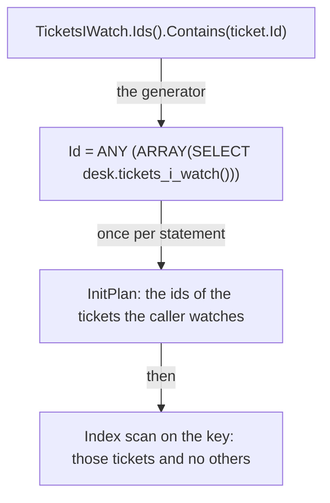
```mermaid
flowchart TD
    Rule["TicketsIWatch.Ids().Contains(ticket.Id)"] -->|"the generator"| Policy["Id = ANY (ARRAY(SELECT desk.tickets_i_watch()))"]
    Policy -->|"once per statement"| Set["InitPlan: the ids of the tickets the caller watches"]
    Set -->|"then"| Scan["Index scan on the key: those tickets and no others"]
```

<details>
<summary>Show the code: the function the export writes, and the policy that asks it</summary>

```sql
CREATE OR REPLACE FUNCTION desk.tickets_i_watch() RETURNS SETOF uuid
    LANGUAGE sql STABLE SECURITY DEFINER SET search_path = '' AS $function$
    SELECT DISTINCT e1."TicketId" FROM desk."TicketWatcher" e1
    WHERE (e1."User" IS NOT DISTINCT FROM (SELECT ddd.caller_id()))
$function$;

CREATE POLICY "Watchers read the tickets they watch (select) for authenticated" ON desk."Tickets" FOR SELECT TO authenticated
    USING ("Id" = ANY (ARRAY(SELECT desk.tickets_i_watch())));
-- and the same for anon, since the rule names no roles
```

</details>

`= ANY (ARRAY(SELECT ...))` is the form on purpose. Postgres runs the `ARRAY(SELECT ...)` as an InitPlan,
before it reads the table, and looks the ids up in the key's index. The same question written
`"Id" IN (SELECT ...)` stays a filter in a policy: a hashed SubPlan, checked against every row the scan
reads, with no index condition to narrow it. The toolkit's own tests read both plans from `EXPLAIN`. A
function whose whole question is whether one of the aggregate's entities is so, as above, reads the
entities' table alone, `SELECT DISTINCT e1."TicketId" FROM ... e1`, so its work grows with what the caller
holds, not with the number of tickets; in the tests, on 5,000 tickets, it reads about half the buffers of the same question
asked from the tickets' table. A question about the entities of those entities starts from the same table and
asks theirs inside it, so the tickets' table is still never read:

```csharp
[AccessFunction<Ticket>("desk.tickets_i_reacted_in", Shape = AccessFunctionShape.Set)]
public static partial class TicketsIReactedIn
{
    public static bool Allows(Ticket ticket, Caller caller)
        => ticket.Comments.Any(comment => comment.Reactions.Any(reaction => reaction.User == caller.UserId));
}
```

```sql
CREATE OR REPLACE FUNCTION desk.tickets_i_reacted_in() RETURNS SETOF uuid
    LANGUAGE sql STABLE SECURITY DEFINER SET search_path = '' AS $function$
    SELECT DISTINCT e1."TicketId" FROM desk."TicketComment" e1
    WHERE (EXISTS (SELECT 1 FROM desk."CommentReaction" e2 WHERE e2."TicketCommentTicketId" = e1."TicketId" AND e2."TicketCommentId" = e1."Id" AND ((e2."User" IS NOT DISTINCT FROM (SELECT ddd.caller_id())))))
$function$;
```

A set-shaped function needs an aggregate whose key is one column.

**Questions of your own.** A question the database answers that is not about one aggregate, the ids of
what the caller follows, say, is declared in an `[AccessFunctions]` class, without a body, which the
generator writes:

```csharp
[AccessFunctions]
public static partial class Questions
{
    [AccessSet("ids_i_follow")]
    public static partial AccessSet<TId> IdsIFollow<TId>(string kind) where TId : IEntityId;

    [AccessScalar("caller_team")]
    public static partial string CallerTeam();
}

// Questions.IdsIFollow<ProjectId>("projects").Contains(project.Id)
//   "Id" = ANY (ARRAY(SELECT projects.ids_i_follow('projects')))
// project.Team == Questions.CallerTeam()
//   "Team" = (SELECT projects.caller_team())
```

An `[AccessSet]` question answers with a set, an `[AccessScalar]` one with a value, and called in C# either
throws `DatabaseOnlyException`. Their parameters are strings, numbers, flags, `Guid`s, ids, or a type
parameter constrained to `IEntityId`, for a question over ids a package does not know. The SQL function
is the one of that name: an access function's, or one a package writes into your migrations. A question
named with its schema, `extras.caller_team`, is a function of your own, which the policy calls as it is,
as `Sql.Call` does.

**A set is asked once, so its arguments do not read the row.** Only the value compared with the set, the
argument of `Contains`, may be a column; the question's own arguments are constants, the caller, or the
enclosing access function's parameters. An argument that read the row would make the set different for
every row, and the database would ask it once per row after all
([DDD00051](diagnostics.md#ddd00051)). A scalar question may take a column, and is then asked per row.

**A scalar question and null.** A question such as `CallerTeam()` answers `NULL` for a caller it does not
know, and such a caller must pass no condition built on it. So a comparison with a scalar question is
SQL's own, `a = b`, `a <> b`, `a < b`, whatever C# says of their nullability: unknown for such a caller,
which a policy counts as no. A ticket without a team is not the team of a caller without one, and a team is
not "another team" than one nobody knows. The comparison stays unknown under `!`, too, so
`!(ticket.Team == Questions.CallerTeam())` lets such a caller through no more than `==` does. There is no C#
answer to keep here, since the question throws in C#.

### Names relative to the module

A module's schema is the host's choice, so a module does not have to write it into its function names. A
name without a schema is relative to its owner: `tickets_i_watch` in the Desk module is
`desk/tickets_i_watch`, and the export creates the function in the schema of the context that maps the
aggregate, its default schema or else the aggregate table's, whatever the host called it. The owner is
the module the declaring assembly names with `[assembly: Module("Desk")]`, written as a module's name is
in a migration's file name, or the `Owner` of the class's `[AccessFunctions]`, which a package that
declares no module uses:

```csharp
[AccessFunction<Ticket>("tickets_i_watch", Shape = AccessFunctionShape.Set)]
[AccessFunctions(Owner = "desk")]
public static partial class TicketsIWatch { ... }
```

A name with neither a schema nor an owner is [DDD00052](diagnostics.md#ddd00052). `schema.name` keeps
working as it did, and a name with a slash, `projects/project_ids_where_i_hold`, is taken as it is, which is
how a definition in one module matches a contract another publishes: a contract's generated `Name` is its
logical name, so `[AccessFunction<Project>(ProjectsWhereIHold.Name)]` defines it wherever it lives.

A rule asks the function by its logical name, `{fn:desk/tickets_i_watch}` in its SQL, and a script writes
the name the function has in the database. It knows the functions of its own context;
`PostgresRowAccess.Scripts` and the Supabase build know those of every context, so a rule of one module may
ask a function another module defines. For a script of one context whose rules ask another's, hand it the
names with `RowAccessExport.FunctionNames`, from `PostgresRowAccess.FunctionNamesOf(contexts, functions)`.
A rule that asks a logical name nothing defines is refused when its script is written, naming the rule.

A script writes a function's name without quotes, which Postgres reads in lower case, while Entity
Framework quotes the schema it creates. So the schema a relative name lands in, the context's default
schema or its aggregate table's, is lower case letters, digits and underscores; a script refuses a
function it would create in `"Desk"`.

### Column rules

A policy is asked of a row and a command, and never of a column: Postgres cannot tell it which columns a
statement changes. Where every change to a row takes the same key, that is all a rule needs. Where one column
takes a stricter key than the rest of the row, the policy for `UPDATE` has to let through whoever holds any of
the keys, and whoever holds one of them then changes every column. A project shows it: renaming one takes the
key to edit it, closing it the key to close it, its crew the key to manage the crew and its owner the key to
name owners, and a project that is moved has to pass at the unit it arrives at, where the key to open projects
is what the move asks. So the policy that lets a seat change a project asks for any of those keys. A seat that
only manages the crew, or only opens projects at the unit, could rename the project with a statement of its own,
past the check in front of the handler.

`Columns` on a rule makes it a column rule: one condition more, for a change of those columns alone.

```csharp
[RowAccess<Project>(RowOperations.Change, To = [RowAccessRoles.User], Columns = [nameof(Project.State)])]
public static partial class StateChangesWithTheCloseKey
{
    public static bool Allows(Project project, Caller caller) => ProjectsWhereIHold.Ids(ProjectKeys.Close).Contains(project.Id);
}
```

It is written where the other rules are, beside your infrastructure, and nothing about it goes on the aggregate.
The script writes it as a trigger rather than a policy, before an update of the columns it holds, that asks the
rule and refuses the statement when the answer is no:

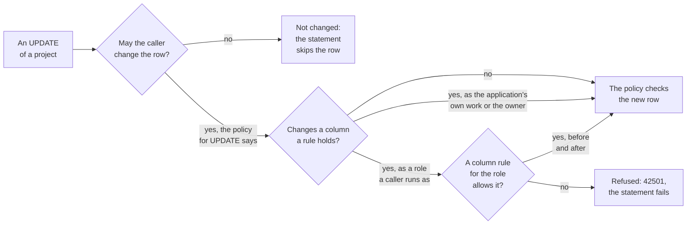
```mermaid
flowchart LR
    Update["An UPDATE<br/>of a project"] --> Policy{"May the caller<br/>change the row?"}
    Policy -->|no| Untouched["Not changed:<br/>the statement<br/>skips the row"]
    Policy -->|"yes, the policy<br/>for UPDATE says"| Held{"Changes a column<br/>a rule holds?"}
    Held -->|no| Check["The policy checks<br/>the new row"]
    Held -->|"yes, as a role<br/>a caller runs as"| Rule{"A column rule<br/>for the role<br/>allows it?"}
    Held -->|"yes, as the application's<br/>own work or the owner"| Check
    Rule -->|"yes, before<br/>and after"| Check
    Rule -->|no| Refused["Refused: 42501,<br/>the statement fails"]
```

- **The row's own rules still decide first.** The trigger only fires for a row the policy for `UPDATE` lets the
  caller change, and the policy still checks the new row after it. A column rule lets nobody change anything a
  rule for the row does not let them change: it narrows that, for its columns.
- **It is asked as a rule for `UPDATE` is,** of the row as it was and of the row as it is about to be, and both
  have to say yes. A rule that reads nothing of the row but its key, as a set-shaped question about the row's id
  does, answers the same of both while the key stays what it was, which every change Entity Framework makes
  does, so it is asked once per changed row rather than twice.
- **It is asked once per changed row, not once per statement.** A policy asks a set once per statement; a
  trigger runs for each row whose held column changes, and asks the set again for each. Entity Framework's saves
  change one row per statement, so for them a column rule costs the set asked once more. A statement that
  changes a held column of many rows, an `ExecuteUpdate` or a Data API `PATCH` with a filter, asks the set once
  for each of them.
- **Its SQL runs in the trigger, with an empty search path.** Every name the toolkit writes carries its schema.
  A function the rule calls with `Sql.Call` names its schema too, `"public.is_agent"`, or `"pg_catalog.lower"`
  for one of Postgres's own, which [DDD00038](diagnostics.md#ddd00038) holds it to: in a policy Postgres finds a
  name when the policy is made, in a trigger only as it runs. The SQL of a `Sql.Raw` names every table and
  function with its schema as well, and cannot read the row's columns by name, which a trigger knows only as
  the row before and after; read the row in C# instead.
- **Several column rules on one column add up:** a change one of them allows is allowed, as the rules of a row
  do. The columns the same rules hold share one trigger, so a statement that changes several of them asks the
  rules once.
- **The roles a caller's statement runs as are held:** the roles the column rules are for, the signed-in user's
  and the anonymous caller's, every [token role](#token-roles) you map, and any other role a policy lets change
  the table. A held role that none of the column's rules is for may not change the column, as a role that no
  rule grants a command may not run it. The application's own work is not held: the
  [scoped system role](#the-scoped-system-role) and the bookkeeping role pass, unless a column rule names the
  role in `To`, and so do the tables' owner and a role that may bypass row level security, which no policy holds
  either.
- **A value object is every column it is stored in:** `Columns = [nameof(Project.Planned)]` holds both columns of
  the planned range, and `"Planned.From"` the one. A property of a value object is named with a dot, which
  `nameof` does not write. A collection of values stored in the row, such as a list of strings kept as an array,
  is its one column.
- **It is found the way a policy is:** the trigger carries a comment, and the drop at the start of every script,
  and of every migration of a module with rules, takes it away with the policies. A rule taken out loses its
  trigger with the next script, and a migration may drop or change a column a column rule holds, which the
  trigger would otherwise stand in the way of.
- **The refusal is the database's, and the caller is told `access.refused`:** `42501`,
  `insufficient_privilege`, with a message that names the rule, the trigger's name as the constraint, and the
  toolkit's hint, as every access guard the toolkit writes refuses. Through Entity Framework the save is refused as one
  a policy refuses is: a `RefusalException` with the code `access.refused`, and a warning that names the
  trigger. See [When the database refuses](#when-the-database-refuses).

<details>
<summary>Show the code: two column rules of a project, and the trigger one of them becomes</summary>

The project's rule for changing it asks for any key that changes one, on the project or, for the key to open
projects, at its unit; the two column rules hold the columns whose commands ask a stricter one:

```csharp
[RowAccess<Project>(RowOperations.Change, To = [RowAccessRoles.User])]
public static partial class SeatsChangeTheProjectsTheyWorkOn
{
    public static bool Allows(Project project, Caller caller)
        => ProjectsWhereIHold.Ids(ProjectKeys.Edit).Contains(project.Id)
            || ProjectsWhereIHold.Ids(ProjectKeys.Close).Contains(project.Id)
            || ProjectsWhereIHold.Ids(ProjectKeys.ManageCrew).Contains(project.Id)
            || ProjectsWhereIHold.Ids(ProjectKeys.ChangeOwner).Contains(project.Id)
            || TenancyRowAccess.UnitsWhereIHold<OrganizationUnitId>(ProjectKeys.Open).Contains(project.UnitId);
}

[RowAccess<Project>(RowOperations.Change, To = [RowAccessRoles.User], Columns = [nameof(Project.Name), nameof(Project.Planned)])]
public static partial class NameAndPlanChangeWithTheEditKey
{
    public static bool Allows(Project project, Caller caller) => ProjectsWhereIHold.Ids(ProjectKeys.Edit).Contains(project.Id);
}

[RowAccess<Project>(RowOperations.Change, To = [RowAccessRoles.User], Columns = [nameof(Project.State)])]
public static partial class StateChangesWithTheCloseKey
{
    public static bool Allows(Project project, Caller caller) => ProjectsWhereIHold.Ids(ProjectKeys.Close).Contains(project.Id);
}
```

What the script writes for the state, shortened. The rule reads the row's key alone, so the row as it is about
to be is asked only where the key changes:

```sql
CREATE OR REPLACE FUNCTION projects.projects_state_column_rule() RETURNS trigger
    LANGUAGE plpgsql SET search_path = '' AS $body$
BEGIN
    IF CURRENT_USER = 'authenticated' THEN
        IF (OLD."Id" = ANY (ARRAY(SELECT projects.project_ids_where_i_hold('projects.close')))) IS NOT TRUE
           OR (OLD."Id" IS DISTINCT FROM NEW."Id" AND (NEW."Id" = ANY (ARRAY(SELECT projects.project_ids_where_i_hold('projects.close')))) IS NOT TRUE) THEN
            RAISE EXCEPTION USING ERRCODE = 'insufficient_privilege', CONSTRAINT = 'projects_state_column_rule', HINT = 'ddd:access.refused',
                MESSAGE = 'The column rule ''State changes with the close key'' does not let this caller change "State" of projects."Projects".';
        END IF;
    ELSIF CURRENT_USER IN ('anon', 'tenancy_operator') THEN
        RAISE EXCEPTION USING ERRCODE = 'insufficient_privilege', CONSTRAINT = 'projects_state_column_rule', HINT = 'ddd:access.refused',
            MESSAGE = 'No column rule is for this caller''s role, so it may not change "State" of projects."Projects".';
    END IF;
    RETURN NEW;
END
$body$;

CREATE TRIGGER projects_state_column_rule BEFORE UPDATE OF "State" ON projects."Projects"
    FOR EACH ROW WHEN (OLD."State" IS DISTINCT FROM NEW."State")
    EXECUTE FUNCTION projects.projects_state_column_rule();
COMMENT ON TRIGGER projects_state_column_rule ON projects."Projects" IS 'DDDToolkit column rule';
```

A script of your own writes the same from `RowAccessRule.ForColumns<Project>("State changes with the close key",
[nameof(Project.State)], StateChangesWithTheCloseKey.RowAccessSql, RowAccessRoles.User)`. A column rule's
`RowAccessSql` starts with `{columns}`, which `ForColumns` takes and `RowAccessRule.For` refuses: as a rule
about whole rows, it would let whoever it allows change every column. An export of a version without column
rules stops at the placeholder it does not know, and asks for the same version of the toolkit's packages
everywhere, rather than write such a policy.

</details>

[DDD00038](diagnostics.md#ddd00038) reports a column rule for another operation than `Change`, which are about
whole rows; a name in `Columns` that is no property of the aggregate or of a value object it holds, or is a
collection of its entities, whose rows follow the rules for the aggregate's row; and a `Sql.Call` without a
schema. A property the model stores in no column of the aggregate's table, one it ignores, is refused when the
script is written, naming the rule.

A column rule asks one question of the row before and after the change. A rule that asks something else of each,
as moving a project does, the key to edit it where it was and the key to open projects where it goes, is a
trigger of your own, written as a [contribution](#policies-a-package-ships): the sample's `UnitChangesWithItsKeys`.
The owner column of a resource whose members the [Membership package](membership.md#who-writes-the-member-rows)
keeps is held by the package's own lock, which it writes from the key its rules name for naming an owner.

### Policies a package ships

A package, or a module of your own, can have tables that are not your aggregates, or SQL whose names
depend on your model: the schema you gave its tables, the column types of your ids. `[RowAccess]` rules
cannot cover those, so such a package writes its row level security itself, as a row access contribution:
a class the script asks, for every context, what it writes there.

```csharp
// In the package: an audit trail, whose entries are read by who wrote them.
[assembly: RowAccessContribution(typeof(AuditRowAccess))]

public sealed class AuditRowAccess : IRowAccessContribution
{
    public string Owner => "audit";

    public RowAccessContributionResult? Contribute(DbContext context, RowAccessExport export)
    {
        if (context.Model.FindEntityType(typeof(AuditEntry)) is not { } entries)
        {
            return null;   // this context does not map the package's table
        }

        var id = RowAccessModel.Column(entries, nameof(AuditEntry.Id));
        var writtenBy = RowAccessModel.Column(entries, nameof(AuditEntry.WrittenBy));
        return new(
            Functions:
            [
                new ContributedFunction("entries_i_wrote", "", "SETOF " + RowAccessModel.ColumnType(entries, nameof(AuditEntry.Id)),
                    $"SELECT e.{id} FROM {RowAccessModel.Table(entries)} e WHERE e.{writtenBy} = {{caller:uid}}",
                    SecurityDefiner: true, GrantTo: [RowAccessRoles.User]),
            ],
            Policies:
            [
                new ContributedPolicy(entries, "Entries are read by who wrote them", "SELECT", RowAccessRoles.User,
                    $"{id} = ANY (ARRAY(SELECT {{fn:audit/entries_i_wrote}}()))", null),
            ],
            Statements: [],
            ExclusiveTables: [entries]);
    }
}

// In the host, the project that runs the Supabase export: the package's SQL goes into its migrations.
[assembly: UseRowAccessContribution(typeof(AuditRowAccess))]
```

An offer alone writes nothing: the migrations run the SQL as the role that owns your tables, so it gets
there only by your choice. The build warns about an offer you do not list,
[DDD00054](diagnostics.md#ddd00054). On a Postgres of your own, hand the contribution to the script in
`RowAccessExport.Contributions`.

The build creates a listed contribution with `new X()` before your application starts, so a contribution
whose SQL depends on what only your application knows, such as a list of its own, takes it from a class of
yours. The package offers a class to derive from, or a generic one, and you list your class, which counts
as using the offer:

```csharp
// In the package
[assembly: RowAccessContribution(typeof(PlanRowAccess))]
public class PlanRowAccess(IReadOnlyList<string> plans) : IRowAccessContribution { ... }

// In the host
[assembly: UseRowAccessContribution(typeof(ShopPlanRowAccess))]
public sealed class ShopPlanRowAccess() : PlanRowAccess(ShopPlans.All);
```

A contribution may be asked about a context several times in one export, so it answers from the model
and what it was made with, the same every time.

What a contribution answers for a context goes into that context's script, with a comment above each part
that names the contribution, its assembly and the assembly's version:

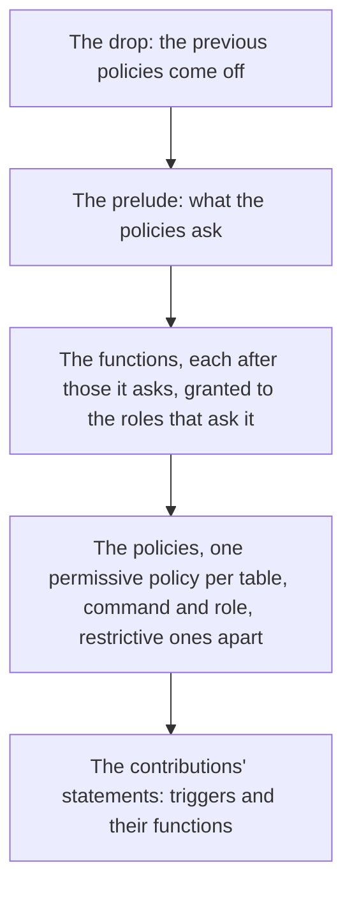
```mermaid
flowchart TD
    Drop["The drop: the previous policies come off"] --> Prelude["The prelude: what the policies ask"]
    Prelude --> Functions["The functions, each after those it asks, granted to the roles that ask it"]
    Functions --> Policies["The policies, one permissive policy per table, command and role, restrictive ones apart"]
    Policies --> Statements["The contributions' statements: triggers and their functions"]
```

<details>
<summary>Show the code: what the audit contribution above adds to a script</summary>

```sql
-- Written by the row access contribution Audit.AuditRowAccess in Audit 1.2.0.
CREATE OR REPLACE FUNCTION audit.entries_i_wrote() RETURNS SETOF uuid
    LANGUAGE sql STABLE SECURITY DEFINER SET search_path = '' AS $function$
SELECT e."Id" FROM "audit"."AuditEntries" e WHERE e."WrittenBy" = (SELECT auth.uid())
$function$;
COMMENT ON FUNCTION audit.entries_i_wrote() IS 'DDDToolkit access function of AuditContext';
REVOKE ALL ON FUNCTION audit.entries_i_wrote() FROM PUBLIC;

-- Who may execute the functions above: the roles granted it below, and nobody else. Every other grant
-- on them is taken back first, what an earlier file gave and what a schema's default privileges gave alike.
DO $ddd$ ... $ddd$;
GRANT EXECUTE ON FUNCTION audit.entries_i_wrote() TO authenticated;

ALTER TABLE audit."AuditEntries" ENABLE ROW LEVEL SECURITY;

-- Entries are read by who wrote them (select) for authenticated asks the policy 'Entries are read by who wrote them' of the row access contribution Audit.AuditRowAccess in Audit 1.2.0.
CREATE POLICY "Entries are read by who wrote them (select) for authenticated" ON audit."AuditEntries" FOR SELECT TO authenticated
    USING ("Id" = ANY (ARRAY(SELECT audit.entries_i_wrote())));
COMMENT ON POLICY "Entries are read by who wrote them (select) for authenticated" ON audit."AuditEntries" IS 'DDDToolkit row access rule';
```

</details>

- **Functions** are created in the default schema of the context the contribution answered for, or in
  `public` when it has none, as `LANGUAGE sql` with `SET search_path = ''`, so their bodies name everything
  with its schema. Unlike an access function's, the schema is not a table's: a contribution may write for
  several tables.
  `SecurityDefiner` is false unless the contribution says otherwise. Rules and other contributions ask one
  by its logical name, `{fn:audit/entries_i_wrote}`, with the contribution's `Owner`, and a script writes
  it after the functions it asks. It carries the context's function comment, so the next script keeps it
  while the contribution still writes it, replacing it in place, and drops it once it does not.
  It returns a type, `SETOF` a type, or rows of named columns, `TABLE ("TicketId" uuid, "DueAt" timestamp with
  time zone)`. Those names are the function's own, the same in every application whatever its tables call
  their columns, which is what lets a package map a function's rows for the modules that read them.
- **A function folded into the query that asks it.** A function that answers rows for other queries to
  read, as a view would, can say `Inlinable: true`. Postgres folds a set-returning SQL function into the
  calling query only when it runs as its caller, is `STABLE` or `IMMUTABLE`, is not `STRICT`, is one
  `SELECT`, and has no `SET` clause, so the script writes such a function without `SET search_path = ''`,
  and refuses one that runs as its owner, is `VOLATILE`, or is not one `SELECT`. The plan then reads the
  tables the function reads, with their indexes and with the caller's policies on them, where a function
  kept apart answers every row it may before the query narrows them. What it gives up is the pinned search
  path. That is safe for a function that runs as its caller: it has only the caller's rights, and its body
  names every table, function and type with its schema, as every contributed function's must, so nothing in
  it is looked up along the caller's path. A function that runs as its owner always keeps the empty path.
- **Who may run a function** is its `GrantTo`, and no other role but its owner: every other grant on it,
  a schema's default privileges' included, is taken back. A policy for any other role that asks it is
  refused, naming the rule and the function: a rule without `To` is for `anon` as well, so a function kept
  for signed-in users makes such a rule say `To = [RowAccessRoles.User]`. The same goes for a policy that
  asks it through an access function, which runs as its owner and so asks it for whoever the policy is
  for. A function granted to no role is a helper for the functions that run as their owner, access
  functions among them. A contributed function that runs as its caller may ask only functions granted to
  every role it is granted to.
- **Policies** are named like a rule's, `"<name> (select) for authenticated"`, and carry the rules'
  comment, so the next script drops them. A permissive one is merged with the rules' and other
  contributions' permissive policies for the same table, command and role, as Postgres would OR them
  anyway; a restrictive one is a policy of its own and narrows whatever the others allow. Two policies of
  one name on a table are refused, naming both. Every table a contributed policy names gets row level
  security.
- **Tables a contribution keeps to itself**, its `ExclusiveTables`, get row level security and policies
  from it alone: a rule, or another contribution, that would add one is refused, naming both.
- **Statements** come last, one statement each, and can run again: triggers and the functions they run.
  A statement's function gets no grants from the script, so only a trigger's may be `SECURITY DEFINER`,
  since nobody can call a trigger function on its own, and it says `SET search_path = ''`, since the
  schemas of a caller's session would otherwise decide what it runs with its owner's rights. Any other
  function that runs as its owner is a `ContributedFunction`.
- In all of these, `{fn:owner/name}` and `{caller:uid}`, `{caller:role}`, `{caller:claims}`,
  `{caller:signedin}` and `{caller:claim:path}` are filled in as they are in a rule, with the export's
  caller functions; write a brace itself as `{{` or `}}`. `RowAccessModel` writes the names from the model:
  `Table`, `Column`, `ColumnType`, `Stored` for a value as its column stores it, `EntityTablesOf` for the
  tables of an aggregate's entities and the way up to its own, and `Literal`. `Refusal` writes the statement a
  trigger refuses with, so a save it refuses is answered as one a policy refuses is: see
  [When the database refuses](#when-the-database-refuses).

A context whose only row access is a contribution gets a script, and a Supabase access file, all the same.

### When the database refuses

The check in front of a handler refuses first, with your own code and the key that is missing. The database
refuses only what that check let through: a caller that lost a key between the check and the save, a handler
that skipped its check, a rule the database holds more strictly than C# asks it. `UseDDDToolkit` answers each
of those the same way. The save throws a `RefusalException` with the code `access.refused`, a refusal of the
kind "not permitted": a 403 from a route and a `RefusalError` from a GraphQL mutation. A warning is logged as
well, since the application allowed what the database does not.

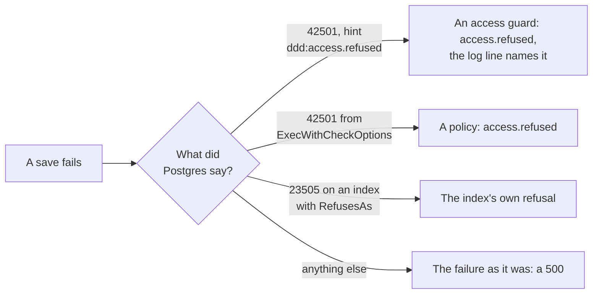
```mermaid
flowchart LR
    Failed["A save fails"] --> Code{"What did<br/>Postgres say?"}
    Code -->|"42501, hint<br/>ddd:access.refused"| Guard["An access guard: access.refused,<br/>the log line names it"]
    Code -->|"42501 from<br/>ExecWithCheckOptions"| Policy["A policy: access.refused"]
    Code -->|"23505 on an index<br/>with RefusesAs"| Index["The index's own refusal"]
    Code -->|"anything else"| Other["The failure as it was: a 500"]
```

An update or a delete whose row a policy hides fails with no error at all: the statement finds no row, as when
somebody else changed it first. That case is told apart by reading the row again, as
[`AggregateVersionInterceptor`](entity-framework.md) does, and is answered with the same refusal.

- **A policy's refusal is known by where Postgres raised it, not by its words.** With every error Postgres sends
  the name of the function in its own source that raised it, and that name is never translated. A new row a
  policy refuses is refused by `ExecWithCheckOptions`, which raises nothing else as `42501`, so a server set to
  answer in Dutch with `lc_messages` is read as one that answers in English. Only the table the warning names
  comes from the message: the one it quotes, or, where it cannot be read, the one table the save wrote.
- **An access guard marks its refusal.** An access guard is a trigger that holds who may change what, as a
  policy holds who may write a row. Every `RAISE` of PL/pgSQL comes from the same function of Postgres, whatever
  it is about, and a missing privilege is `42501` too. So an access guard says it is one: SQLSTATE `42501`, its
  own name as the constraint, and the hint `ddd:access.refused`. Every access guard the toolkit writes does: the
  trigger of a [column rule](#column-rules), the Membership package's lock on an owner column, and Tenancy's
  triggers on a seat's status and on who changed a row.
- **It stays `42501`, with a hint, rather than a code of the toolkit's own.** `42501` is what every tool already
  reads as "not allowed": the Data API answers it with a 403, and a pgTAP test that expects a refusal expects it.
  To those a code of the toolkit's own would be a failure of another kind. The hint of a `RAISE` is the
  trigger's own text: Postgres hands it on as written and never translates it. Postgres gives some errors of its
  own a hint, in the server's language, but never this one, and only this exact hint counts, so the mark means
  the same whatever language the server answers in.
- **Anything else is the failure it is.** A missing privilege, a role the policies hold that reads with
  `row_security` off, a trigger that raises without the hint, a check that fails: each is the application's own
  set-up, or a rule that holds whoever writes, and ends the request as a failure of the server, where somebody
  will see it. The message of the second names row level security in so many words, which is why words decide
  nothing. The toolkit's triggers that hold what may never be, whoever writes, are no access guards and raise
  codes of their own. Tenancy's checks of a tenant's last administrator, of the rights and the paths, and of the
  rows that stay fixed, and the Membership package's trigger that keeps an owner's role in use, raise
  `check_violation`; an [event log](entity-framework.md#an-event-log)'s guard raises `55000`. Tenancy's store answers the last administrator
  with a refusal of its own.
- **Only a save is answered.** `DatabaseRefusalInterceptor` sees what a `SaveChanges` threw. A statement of your
  own, an `ExecuteUpdate`, an `ExecuteDelete` or SQL, is no save: an access guard's refusal of it reaches you as
  the `PostgresException` itself. `DatabaseRefusal.From(exception)` reads it as it reads a save's, if you want to
  answer it with `access.refused` too.
- **The caller is told `access.refused`, and no more.** Not which guard refused, nor its message. The check in
  C# is where a refusal is specific, with the key that is missing, in the reader's language. When the database
  refuses what that check let through, the two disagree, and the fix is in the check or in the rule, unless the
  caller's rights changed in between, which the toolkit tells by asking the request's check again
  ([When the policies refuse what C# allowed](#when-the-policies-refuse-what-c-allowed)). The log line names the
  guard for whoever runs the application, and the refusal keeps the database's error as its inner exception. A guard's name belongs to the schema: it changes when a table or a rule does, and has no text in any
  language, so it would make a poor code for a client to branch on.
- **Your own trigger refuses the same way.** From C#, in a [contribution](#policies-a-package-ships),
  `RowAccessModel.Refusal(guard, message)` writes the statement. By hand it is one line. A trigger that should not
  be answered as a refusal leaves the hint out. `DatabaseRefusal.From(exception)` reads what refused for a
  translation of your own: `GuardRefused`, with the guard's name as `Constraint`.

<details>
<summary>Show the code: a trigger of your own that refuses as the toolkit's access guards do</summary>

By hand, in a migration of your own: a signed-in user's pallet keeps its number.

```sql
CREATE OR REPLACE FUNCTION depot.pallets_number_stays() RETURNS trigger
    LANGUAGE plpgsql SET search_path = '' AS $body$
BEGIN
    IF CURRENT_USER = 'authenticated' THEN
        RAISE EXCEPTION USING ERRCODE = 'insufficient_privilege', CONSTRAINT = 'pallets_number_stays',
            HINT = 'ddd:access.refused', MESSAGE = 'A pallet keeps its number.';
    END IF;
    RETURN NEW;
END
$body$;

CREATE TRIGGER pallets_number_stays BEFORE UPDATE OF "Number" ON depot."Pallets"
    FOR EACH ROW WHEN (OLD."Number" IS DISTINCT FROM NEW."Number")
    EXECUTE FUNCTION depot.pallets_number_stays();
```

From C#, in a contribution's statements, as the sample's `UnitChangesWithItsKeys` writes its trigger:

```csharp
string Refusal(string message) => RowAccessModel.Refusal(Trigger, message);

// ...
$"    IF NOT ({HeldOn(ProjectKeys.Edit, $"OLD.{id}")}) OR NOT ({HeldAt(ProjectKeys.Open, $"NEW.{unit}")}) THEN\n" +
$"        {Refusal(MovedWithoutTheKeys)}\n" +
"    END IF;\n" +
```

What a save that a guard refuses throws, and what is logged:

```csharp
catch (RefusalException refused) when (refused.Code == ToolkitRefusals.Refused)
{
    // refused.Kind is RefusalKind.NotPermitted, and refused.InnerException the DbUpdateException:
    // DatabaseRefusal.From(refused.InnerException!) is GuardRefused, with Constraint "pallets_number_stays".
}
```

```text
warn: The database refused a save the application allowed: the guard pallets_number_stays on depot.Pallets.
      C# and the guards disagree.
```

A statement of your own is no save, so its refusal reaches you as the database's exception, read the same way:

```csharp
try
{
    await context.Pallets.Where(pallet => pallet.Id == id)
        .ExecuteUpdateAsync(set => set.SetProperty(pallet => pallet.Number, number), cancellationToken);
}
catch (PostgresException failure) when (DatabaseRefusal.From(failure)?.Kind == DatabaseRefusalKind.GuardRefused)
{
    throw ToolkitRefusals.Of(ToolkitRefusals.Refused, failure);
}
```

</details>

### Writing the policies

`PostgresRowAccess.Script(context, rules, accessFunctions)` returns the SQL for one context: it first drops
every policy an earlier script made on the context's tables, and every trigger of a
[column rule](#column-rules), found by the comment each one carries, then makes what its policies ask, the
`ddd` schema and `ddd.written_in_this_transaction` with the grants on them, and the scoped system role when a
policy is for it, wherever the database does not have them as they should be, drops the functions the context
no longer writes, and then makes its functions, each after those it asks and granted to the roles that ask it,
the policies again, and the column rules' triggers. So the latest script says what the rules are now, a rule
taken out disappears with it, and a policy you wrote by hand is left alone.

```csharp
var sql = PostgresRowAccess.Script(context,
[
    RowAccessRule.For<Order>("A customer sees their orders", RowOperations.Read | RowOperations.Change, ACustomerSeesTheirOrders.RowAccessSql),
]);
```

Given a `RowAccessExport` as well, it writes the roles and the caller functions the export names: which
roles the rules' symbolic roles become, and how a policy asks about the caller. Without one, they are
`RowAccessRoleNames.Default` and the toolkit's `ddd` functions. The export's `Contributions` are the
[policies packages ship](#policies-a-package-ships).

A script of one context grants its access functions to the roles of that context's own policies, and to no
other role. If a policy of another module asks one of them, through a contract, for a role this context's
policies are not for, write the contexts with `Scripts` below, or add a `GRANT EXECUTE` of your own after
the script: the next script takes it back.

For several modules, `PostgresRowAccess.Scripts(contexts, rules, accessFunctions, export)` returns each
context with its script, in the order to run them: a context before every context whose rules, access
functions or contributions ask a function it defines, because a policy or a function that asks one is
refused while it does not exist, and otherwise in the order given. Contexts that ask each other's functions
are refused, naming them. Each script knows where the functions of every context live, so a rule may ask
another module's function by its [logical name](#names-relative-to-the-module), and grants each of its
access functions to the roles of every context's policies that ask it.

Put the SQL it returns into a migration when the rules change, and when an upgrade of the toolkit changes
what it writes, as text rather than as the call: a migration renders nothing when it runs later, on a
database that is only as far as that migration. That
is what the Supabase build does by itself, into `supabase/migrations`, from every rule of every module the
host references; see [Supabase](supabase.md#row-access-rules-in-the-build).

### Privileges from the policies

A policy decides which rows a command touches; a privilege decides whether the command runs at all.
Granted by hand, the two drift apart: a privilege beyond the policies turns a refusal into an empty
answer, and a privilege short of them turns a rule that allows into `permission denied`.
`RowAccessExport.WriteGrants` has the script write the privileges from the very policies it holds:

```csharp
var sql = PostgresRowAccess.Script(context, rules, accessFunctions, new RowAccessExport
{
    Roles = RowAccessRoleNames.Of(options),
    WriteGrants = true,
});
```

After the policies, the script takes back every privilege on each table it wrote policies for, and then
gives a role each command a permissive policy for that role allows, and `USAGE` on the tables' schemas:

```sql
GRANT USAGE ON SCHEMA ordering TO authenticated;

REVOKE ALL ON TABLE ordering."Orders" FROM PUBLIC, anon, authenticated, ddd_system_in;
GRANT SELECT, INSERT, DELETE ON TABLE ordering."Orders" TO authenticated;
GRANT UPDATE ("Status", "Total_Amount", "Version") ON TABLE ordering."Orders" TO authenticated;
```

- **What is taken back** is what any of the script's roles could hold: the user's, the anonymous caller's
  and the scoped system role, the role of every mapped [token role](#token-roles), the bookkeeping role of
  [a login that owns nothing](#a-login-that-owns-nothing), and `PUBLIC`. A grant of your own to one of
  them on such a table is gone after the next script. A grant to any other role stays, and so does every
  privilege on a table without a rule, which is not the script's to give or take. A role a rule names as
  the database spells it, `To = ["reporting"]`, is such another role: it is given what its policies allow
  and keeps what it held before, so a rule of its own that you narrow leaves a privilege for you to take
  back.
- **A restrictive policy gives nothing.** It only narrows what a permissive one allows.
- **`UPDATE` is granted per column**: every column but those of a key, those Entity Framework refuses or
  ignores a change of once the row is saved, and those the database computes. So what C# would not change,
  the database does not let change either. A column of JSON is granted as a whole.
- **A role that may add rows** gets `USAGE` on the sequences the table's columns own.
- **A role the policies let change or remove rows of a table and not read them** is refused when the
  script is written, with the role and the table. Entity Framework finds the row it changes by reading it,
  and Postgres asks the privilege to read for that, so such a rule could never run.

A column that never changes once its row is saved says so in the model:

```csharp
builder.Property(order => order.CustomerId).IsFixedAfterInsert();
```

Entity Framework then throws when a save would change it, and the script leaves the column out of the
`UPDATE` grant, so a statement that goes around Entity Framework is refused as well, with SQLSTATE
`42501`. `IsFixedAfterInsert()` is in `DDDToolkit.EntityFramework`, and means the same on every provider;
only Postgres has the privilege to match.

The toolkit's own tables have no policies, and get what their use asks. An outbox table takes `INSERT`
from the user's role, the scoped system role and every role the policies let write a table of the context,
because a save writes the event's row in the same transaction; an
[event log](entity-framework.md#an-event-log) does the same. An inbox table gives `SELECT` and `INSERT` to
the scoped system role, which is what the handlers of integration events run as. Nobody else reads a
pending message, so the `revoke` statements written by hand in
[A Postgres of your own](#a-postgres-of-your-own) and [The scoped system role](#the-scoped-system-role)
are not needed next to it.

A privilege is the only lock on those tables, so there a script takes back more than its own roles hold.
It finds, where it runs, every role that holds a privilege on them, and takes it back from each that
cannot log in and is held to row level security: the bookkeeping role of an earlier script after
`SystemRole` changed, the role of a token role since unmapped, which the login role may still switch to.
Left alone are the tables' owner and a role that can log in, bypasses row level security or is a
superuser: a script refuses a bookkeeping role, a scoped system role or the role of a token role that is
one, so what such a role holds there you gave it, the role your own background work runs as for one.

`WriteGrants` is off by default, and a script without it is byte for byte what it was. `anon` and
`authenticated` have to exist where the script runs, as they do on Supabase and after `SetupScript()`;
the script makes the other roles it names.

### A login that owns nothing

A statement that reaches the application's connection can always go back to the role that logged in:
Postgres checks a change of role against the session's user, not against the role that is current. So
whatever the login role owns or holds is outside every policy, for whoever manages to send a statement. A
login role that holds nothing leaves such a statement the roles it may switch to, each held to its
policies and its privileges, and nothing besides.

That takes three things. The migrations run as another role, which owns the tables. The application logs
in as a role that owns nothing, holds no privilege on a table, and gets the roles it switches to without
inheriting them. A migration makes the role, without a login or a password, since a migration is kept in a
repository and a password is not; whoever deploys turns the login on once, as the database's owner, with a
secret of that deployment. On Supabase the build writes that migration from the role's name, set in the
project that exports beside the roles the policies are written for. It writes it after every other file, and a
new one whenever those roles change; see
[The role the application logs in as](supabase.md#the-role-the-application-logs-in-as).

```xml
<SupabaseLoginRole>app</SupabaseLoginRole>
```

Without that build, the migration is yours to write. The deployment's one statement is yours either way:

```sql
-- In a migration, or written by the Supabase build
create role app nologin noinherit;
grant anon, authenticated, ddd_system_in to app;

-- Once per deployment, as the owner, never in a file of the repository
alter role app with login password '...';
```

And the system caller, which was the login role itself, gets a role of its own for the one thing it still
has to do: the toolkit's bookkeeping, which reads, marks and deletes outbox rows, cleans the inbox and
asks which migrations ran.

```csharp
builder.Services.AddPostgresRowLevelSecurity(options => options.SystemRole = "ddd_system");
```

`RowAccessRoleNames.Of(options)` carries that role as `System`, and a script written with it and
`WriteGrants` makes sure of it, in its prelude and its privileges:

- it makes the role, `NOLOGIN NOINHERIT` and without `BYPASSRLS`, where the database does not have it, and
  grants it to the role running the script;
- it fails when a role of that name can log in, bypass row level security or is a superuser, has the
  privileges of a role that owns tables, or is granted to a role callers run as; and it is refused when it
  is written if the role is the user's, the anonymous caller's, the scoped system role or the role of a
  token role, because the bookkeeping role is a role of its own;
- it gives the role `SELECT` and `DELETE` on the outbox table and `UPDATE` on the four columns that say how
  a delivery went, `Attempts`, `LastError`, `NextAttemptAt` and `ProcessedAt`, so the bookkeeping cannot
  rewrite an event that is still to be delivered; every command on the inbox table; `SELECT` on the
  migration history where the database keeps one; and, on an event log that lets old rows go, `DELETE` and
  `SELECT` on the columns that find them.

The login role needs the grant too, in a migration after the script: `grant ddd_system to app;`, which
the Supabase build writes into the login role's file once `SupabaseRowAccessRoles` has `system=ddd_system`.
Where the [settings travel per transaction](#how-the-settings-travel), it needs the procedure that sets them
as well: `grant usage on schema ddd to app;` and
`grant execute on procedure ddd.use_caller(text, text, text[], text[]) to app;`, which no file of the build
writes.

System work that reads a module's own tables now fails with `permission denied`, which is the point: it
runs as a [scoped system caller](#the-scoped-system-role) instead, inside the policies. Where the
bookkeeping role itself has to reach a table, write the rule for `RowAccessRoles.System`, `@system`: the
role gets the policy, and with `WriteGrants` the privilege. A script that names the role without one
configured is refused, naming it.

> [!NOTE]
> A host whose system caller runs as a role that bypasses row level security, Supabase's `service_role`
> for one, has no bookkeeping role. Its scripts are what they were for as long as they write no
> privileges and no rule is for `RowAccessRoles.System`, also where a rule or a grant spells that role's
> name out. With `WriteGrants`, write them with `RowAccessRoleNames.Of(options) with { System = null }`:
> a role that bypasses the policies is refused as a bookkeeping role when the script runs.

Three checks say at start-up, before the first request, whether the database and the context are as this
relies on. `AddPostgresRowLevelSecurity`, and so `AddSupabaseRowLevelSecurity`, registers them, with the check of
the functions [below](#forcing-row-level-security), as [start-up checks](startup-checks.md) over every context the
host registers on Postgres, and the host runs them with one call, before the server binds its port:

```csharp
builder.Services.AddPostgresRowLevelSecurity();
builder.Services.RunStartupChecks();
```

They are `postgres.login-role-may-switch-to-callers`, `postgres.login-role-owns-nothing` and
`postgres.row-level-security-wired`, each named by a constant of `PostgresRowAccessChecks`. A host turns one off
only by name and with a reason in its code, as [Turning a check off](startup-checks.md#turning-a-check-off) shows,
and the login role's checks are the last it should want to. A host that runs them by hand, from a class of its own,
calls the methods behind them, the switch first:

```csharp
await PostgresRowAccessChecks.EnsureLoginRoleMaySwitchToCallersAsync(context, cancellationToken);
await PostgresRowAccessChecks.EnsureLoginRoleOwnsNothingAsync(context, cancellationToken);
PostgresRowAccessChecks.EnsureRowLevelSecurityWired(context);
```

The first asks whether the role the application logged in as may switch to every role the context's
interceptor switches to: the user's, the anonymous caller's, the scoped system role, `SystemRole`, and the
role of every mapped token role. A role is switched to when a caller of its kind connects, not when the
application starts, so a grant left out passes the start and fails the first request of that caller: a token
role nobody holds while testing, or the background work. Where the settings travel per transaction, it also
asks whether the login role may call `ddd.use_caller`. It asks as the login role itself, on the context's
connection opened past the interceptor, since the system caller's role is one of those it asks about; so it
comes before every check that runs as the system caller, `EnsureSupabaseMigrationsAppliedAsync` among them, and
the runner runs it in a stage of its own, before them. It
throws naming the login role, and each role it may not switch to, or that does not exist, with the `GRANT` that
fixes it, and the pair of `SupabaseRowAccessRoles` that maps the role, the fix for a host whose Supabase build
writes the login role's migration: that file grants what the property maps, so there a missing role is a missing
pair.

The second reads the catalogs on the context's own connection and throws unless the role the application
logged in as owns no table, view, sequence, function or schema among the schemas of the context's model
and `ddd`, holds no privilege on their tables and may create nothing in those schemas, of its own or
through `PUBLIC`, has the privileges of no role it is a member of without switching to it, and is neither
a superuser nor a role that bypasses row level security. Nor may it create roles or replicate, each a way past
the policies that a statement takes as the login role itself: before Postgres 16 a role that may create roles
grants itself any role that is not a superuser, and a role that may replicate reads every change to every
table from a replication slot. A role it may switch to is one statement away, so
the check also names each such role that is a superuser, bypasses row level security, or owns a table, a
function or a schema there: a login role granted the role that owns the tables holds nothing and reaches
everything. A login role that owns the database is `pg_database_owner`, which owns the schema `public`:
where the context's tables are in `public`, it is named the same way, and the fix is another owner for the
database. The role the system caller runs as is not asked whether it bypasses, since a host that names a
bypassing `SystemRole`, Supabase's `service_role` for one, chose that. The exception names the login role
and every finding with the statement that fixes it. A login role that owns a schema there made it, so it is
the role the migrations run as: then the one finding is that, with the one fix, to log in as a role of its
own and keep that one for the migrations. The third opens nothing: it throws unless the context runs its commands
through the row level security interceptor, without which every command runs as the login role, and is
refused outright where that role holds nothing. As a start-up check it runs first, with the checks that read the
services: a context without the interceptor would fail the other two without saying why.

### Forcing row level security

Postgres exempts a table's owner from the table's policies, so whoever reaches the owning role reads and
writes every row. `RowAccessExport.ForceRowLevelSecurity` writes `FORCE ROW LEVEL SECURITY` after every
`ENABLE` of a script, on the tables of the rules, of the aggregates' entities and of the contributions:

```sql
ALTER TABLE ordering."Orders" ENABLE ROW LEVEL SECURITY;
ALTER TABLE ordering."Orders" FORCE ROW LEVEL SECURITY;
```

The owner is then held to the policies like any other role, and no policy is for it, so it reads no row
and writes none. The only way past the policies is a role with `BYPASSRLS`, or a superuser: a migration
that moves data runs as one.

> [!IMPORTANT]
> The [access functions](#asking-the-aggregates-entities-access-functions) run as their owner, so that
> they answer without the policies of the tables they read. On a forced table that only holds while the
> owner may bypass row level security. A function owned by any other role reads the tables under that
> role's policies, finds no row, and answers that nobody may do anything, without a word.

The start-up check `postgres.definer-owners-bypass`, which `AddPostgresRowLevelSecurity` brings with the three
above, checks it, and `PostgresRowAccessChecks.EnsureDefinerOwnersBypassAsync(context, cancellationToken)` does
the same by hand: it throws unless every function that runs as its owner, in the schemas of the context's model
and in `ddd`, is owned by a role that bypasses row level security or is a superuser, and names each
function, its owner and the fix. While no table in those schemas is forced it passes, whoever owns the
functions, so it can stand next to the three checks above in a host that forces nothing yet. On Supabase the
migrations run as `postgres`, which may.

It is off by default, and a script without it is byte for byte what it was. Turning it off again does not
take the force off a table that has it: `ALTER TABLE … NO FORCE ROW LEVEL SECURITY` does, in a migration
of your own. A [contribution](#policies-a-package-ships) that turns row level security on in a statement
of its own reads the flag from the export it is handed.

## When the policies refuse what C# allowed

Under row level security a command is checked twice: by the application, before its handler runs, and by the
policies, when its statements reach the database. When the policies refuse what the application let through,
`UseDDDToolkit` refuses the save with `access.refused` (`ToolkitRefusals.Refused`), a refusal of the kind "not
permitted", which the Tenancy sample answers with 403, with what the save threw as its inner exception. It
shows in two ways. An insert, or an update whose new row a policy rejects, fails with Postgres's `42501`. An
update or a delete of a row a policy hides from the statement finds no row, exactly as a save that lost a race
to another one does, so
`AggregateVersionInterceptor` reads the row again first: a row somebody changed or removed is the
`ConcurrencyConflictException` it always was, and only a row still there as the save left it is a refusal. The
caller is told no more than that the database refused the change.

Somebody else may need to hear more, and what depends on why the policies refused. There are two reasons:

- **The caller's rights changed between the check and the save.** A key was taken from a role the caller holds,
  a grant was revoked, the caller's seat was suspended: in the milliseconds between the request's access check and
  its save, or in the seconds a slow handler takes. The check and the policies agreed, each at the moment it was
  asked, and nothing needs fixing: an information line says what happened, with no stack trace. A change of rights
  that changes the very row the save is about ends the same way: taking a crew role off a project in the Tenancy
  sample moves the project's version, but the handler loads the project as it is when it runs, so the save goes
  ahead and the policies refuse it. Only a request that names the version it read (`ExpectVersion`) loses the race
  instead, a `ConcurrencyConflictException` that the sample answers with 409, and the policies are not asked.
- **The policies refuse what C# allows.** A rule is held in two places that do not hold it alike, or a handler
  changes something its request's check never asked about. A retry gets the same answer, and a developer should
  look: a warning says so.

To tell the two apart, the toolkit asks the request's access check again, as the same caller, now. The request
is in hand for the flow of work that handles it, with the check it passed
([`RequestInHand`](access-requirements.md#asking-its-check-again)), and a save its handler makes runs in that
flow. Asked again, the check refuses: the rights changed. It still lets the caller through: the policies and C#
disagree. Where nothing passed a check in that flow, a handler called directly, work outside any request, or a
request anyone may send (`AccessRequirement.AllowAnonymous()`), there is nothing to ask, and the application let
through what the policies do not without asking anything: that is a warning too.

A [guard](#when-the-database-refuses) that refuses a statement, a trigger that raises `42501` with the toolkit's
hint, is told apart the same way, and each line names it: `The guard projects_owner_stays refused a save after
the access check of ChangeProjectOwner (MemberAccess<ProjectId>.On) let the caller through.`, or, as a warning,
`... the guard projects_owner_stays on projects.Projects. C# and the guards disagree.` The table goes with it
where the database named one or the save wrote one.

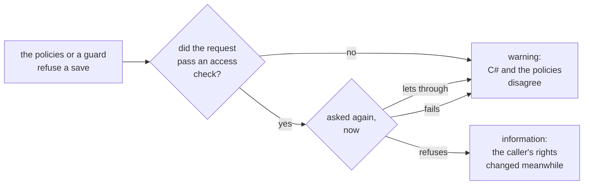
```mermaid
flowchart LR
    Refused["the policies or a guard<br/>refuse a save"] --> Passed{"did the request<br/>pass an access<br/>check?"}
    Passed -- "no" --> Warning["warning:<br/>C# and the policies<br/>disagree"]
    Passed -- "yes" --> Again{"asked again,<br/>now"}
    Again -- "refuses" --> Information["information:<br/>the caller's rights<br/>changed meanwhile"]
    Again -- "lets through" --> Warning
    Again -- "fails" --> Warning
```

Nothing is written for it. `AccessChecks<TRequests>.RequireAsync` puts every request it lets through in hand,
with its check, in the flow of the method that awaited it: the behavior the generator writes, or a dispatcher of your own
written with `async` and `await` ([asking the checks without Mediator](access-requirements.md#asking-the-checks-without-mediator)).
The lines are written through the context's logger factory under the category of `DatabaseRefusalInterceptor`,
and name the request and its requirement by their types, never their values; a warning carries what the save
threw. The check is asked again only for a save the policies refused, and only when a logger listens: one more
check, which every other save does without. Asked again, a check keeps nothing for a handler (`Checked<T>`), so
nothing of that second asking stays behind.

What is asked again is the requirement the request declared. A rule a handler checks itself, past what its
request declared, is not part of it. Nor is what a package's use case asks past it: a request handed to one of
Tenancy's use cases declares what the use case asks first, `TenancyAccess.InTenant()` say, and the use case asks
the rest itself. A change of rights against either is still a warning, and the warning names the requirement
that was asked again, so it shows how little that one asked. A save made after the handler returned, by a pipeline behavior around the access
behavior, runs outside the handler's flow and finds no check to ask: the warning without a request. A check that
gives no answer the second time leaves the warning too, and the warning says why: its connection gone, say, or a
`ConcurrencyConflictException` because what the request is about moved on from the version it named, which says
nothing about the caller's rights.

<details>
<summary>Show the code: the three lines, and a rename in the Tenancy sample that loses its key on the way</summary>

```text
info: DDDToolkit.EntityFramework.Interceptors.DatabaseRefusalInterceptor
      The database refused a save to projects.Projects after the access check of ChangeProjectName
      (MemberAccess<ProjectId>.On) let the caller through. Asked again, the check refuses as well: the caller's
      rights changed between the check and the save, and the caller is refused.

warn: DDDToolkit.EntityFramework.Interceptors.DatabaseRefusalInterceptor
      The database refused a save the application allowed: projects.Projects. C# and the policies disagree: asked
      again, the access check of ChangeProjectName (MemberAccess<ProjectId>.On) still lets the caller through.

warn: DDDToolkit.EntityFramework.Interceptors.DatabaseRefusalInterceptor
      The database refused a save the application allowed: projects.Projects. C# and the policies disagree.
```

In the [Tenancy sample](../Examples/README.md#the-tenancy-sample), Vic renames a project as its crew lead. Between his request's
check and its save, the tenant's roles manager leaves the crew lead's role giving nothing but `projects.view`.
The project's row did not change, so the handler loads what was checked, renames it, and saves; the policy on
`projects.Projects`, which reads the role's keys as they are now, finds no key of Vic's that writes the row and
leaves the statement no row. The request is answered 403 `access.refused`, and the first line above is logged:

```csharp
// RequestPipelineTests.A_key_taken_from_a_crew_role_since_the_check_is_refused_by_the_database_and_logged_as_a_change_of_rights
using var renamed = await vic.PutAsJsonAsync($"/projects/{pier.Id.Value}/name", new { name = "Pier 7, east" });

await renamed.ShouldBeRefusedAsync(HttpStatusCode.Forbidden, ToolkitRefusals.Refused);
logs.Entries.Single(entry => entry.Category == typeof(DatabaseRefusalInterceptor).FullName).Level.Should().Be(LogLevel.Information);
```

Code of your own that writes past Entity Framework, and meets a refusal of the policies itself, asks the same:

```csharp
if (RequestInHand.Current is { } inHand && !await inHand.StillPassesAsync(cancellationToken))
{
    logger.LogInformation("The caller's rights changed between the access check of {Request} and the save.", inHand);
}
```

</details>

## Where to look next

- [Supabase](supabase.md#row-level-security-for-your-own-queries) for Supabase Auth's tokens, and the build
  that writes the policies.
- [Designing aggregates](aggregate-design.md), because a policy is about an aggregate, not a row.
- [Diagnostics](diagnostics.md#ddd00038) for the build errors about a rule.
