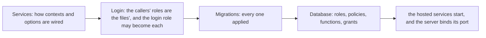

# Start-up checks

A host on Postgres relies on more than its code. The role it logs in as must hold nothing, every migration must
be applied, and the policies and functions in the database must be the ones the code writes. None of that shows
in a request until it goes wrong, so the packages check it when the host starts. Each registration that brings
something to check brings the check with it, and one call runs them all, before the server binds its port:

```csharp
builder.Services.AddSupabaseRowLevelSecurity();   // checks the login role and the contexts
builder.Services.AddTenancyPostgres();            // checks Tenancy's part of the database
// the modules, each with its context and its migrations

builder.Services.RunStartupChecks();
```

The first check that finds something wrong stops the start with its own exception, which names what is wrong and
the statement that puts it right. A module added later brings its checks with it, and nothing in the host lists
them, so nothing in the host has to remember them.

## The order



<details>
<summary>Show the code: registrations that bring a check of each stage, and the one call</summary>

```csharp
builder.Services.AddDDDToolkitEntityFramework(options => options.DispatchWithMediator());
//   Services:   entity-framework.toolkit-wired

builder.Services.AddSupabaseRowLevelSecurity();
//   Services:   postgres.row-level-security-wired
//   Login:      supabase.roles-match-access-files, postgres.login-role-may-switch-to-callers
//   Database:   postgres.login-role-owns-nothing, postgres.definer-owners-bypass

// in a module: its context, marked [SupabaseMigrations]
services.AddDbContext<OrderingContext>((serviceProvider, options) => options
    .UseNpgsql(connectionString)
    .UseDDDToolkit(serviceProvider));

// in the host: every marked context, in the one call the build writes into it, in the namespace named after the
// host's assembly (using Shop.Host; in a top-level Program.cs)
builder.Services.AddSupabaseMigrations();
//   Migrations: supabase.migrations-applied

builder.Services.RunStartupChecks();
//   every check above, stage by stage, before the server binds its port
```

</details>

Every check runs in a stage, `StartupCheckStage`, and every check of one stage runs before any of the next. The
stages are the order in which one failure hides another, so a host is told the cause rather than one of its
effects:

- **Services** reads the application's services and opens no connection: which options are registered, how
  each context is configured, and whether what asks a module's access checks is in the pipeline. A context wired
  wrong would fail every question put to the database through it, without saying why.
- **Login** asks, as the role the host logs in as, whether the roles its callers run as are the ones the
  database's access files were written for, and whether it may switch to every one of them. Every stage after it
  asks as the system caller, and so switches to the system caller's role first.
- **Migrations** asks whether every migration is applied. A policy or a function a missing migration would have
  made is missing because of it, and this stage names the migration.
- **Database** asks whether the database is set up as the application relies on: the login role holds nothing,
  and the policies, functions, triggers, grants and extensions are the ones the code expects.

Within a stage the checks run in the order they were registered. A check that has to come before another of its
stage says so by name, in `RunsBefore`: Tenancy's checks of the database run before its read of the stored keys,
whatever order `AddTenancy` and `AddTenancyPostgres` were called in. A name no registration brought is passed
over, and a check that says it runs before one of an earlier stage stops the start, since that cannot be.

The checks run as the application itself, `Caller.System`, as the toolkit's own bookkeeping does: a host that
[requires explicit callers](row-level-security.md#fail-closed-callers) would refuse the first connection a check
made otherwise. They read the catalogs of the database and change nothing.

## What the packages bring

| Check | Constant | Brought by | Stage | What it holds the host to |
|---|---|---|---|---|
| `access.behaviors-registered` | `AccessBehaviorChecks.BehaviorsRegisteredCheck` | `AddAccessChecks`, and so `AddAccessCheck`, a package's registration of its check and the generated `Add{Module}AccessBehavior`, for an interface the toolkit wrote a behavior for | Services | Every command and query the host handles, of an interface the toolkit wrote a behavior for, has that behavior in its pipeline, the one for streams for a stream query, in every module ([When nothing asks the checks](access-requirements.md#when-nothing-asks-the-checks)) |
| `entity-framework.toolkit-wired` | `EntityFrameworkChecks.ToolkitWiredCheck` | `AddDDDToolkitEntityFramework` | Services | Every context that maps the toolkit's classes is built with `UseDDDToolkit`, or `UseDDDToolkitCore` ([Checking the wiring](entity-framework.md#checking-the-wiring)), and every context has the parts its model requires, Tenancy's save check for rows kept to a tenant ([A part a model cannot do without](entity-framework.md#a-part-a-model-cannot-do-without)) |
| `postgres.row-level-security-wired` | `PostgresRowAccessChecks.RowLevelSecurityWiredCheck` | `AddPostgresRowLevelSecurity`, `AddSupabaseRowLevelSecurity` | Services | Every context on Postgres runs its commands as the caller, but one given the toolkit's base alone with `UseDDDToolkitCore`, which runs as the login role on purpose ([Running queries as the caller](row-level-security.md#running-queries-as-the-caller)) |
| `supabase.roles-match-access-files` | `SupabaseRowAccessChecks.RolesMatchAccessFilesCheck` | `AddSupabaseRowLevelSecurity` | Login | The roles every such context switches to are the ones the newest access file the database applied records it was written for; it runs before the next ([Roles and caller functions of your own](supabase.md#roles-and-caller-functions-of-your-own)) |
| `postgres.login-role-may-switch-to-callers` | `PostgresRowAccessChecks.LoginRoleMaySwitchToCallersCheck` | `AddPostgresRowLevelSecurity`, `AddSupabaseRowLevelSecurity` | Login | The login role may become every caller of every such context, the scoped system role where it exists ([A login that owns nothing](row-level-security.md#a-login-that-owns-nothing)) |
| `postgres.login-role-owns-nothing` | `PostgresRowAccessChecks.LoginRoleOwnsNothingCheck` | the same | Database | The login role owns and holds nothing in the contexts' schemas, and reaches no role that does |
| `postgres.definer-owners-bypass` | `PostgresRowAccessChecks.DefinerOwnersBypassCheck` | the same | Database | Every function that runs as its owner is owned by a role the forced policies let through |
| `supabase.migrations-applied` | `SupabaseMigrations.AppliedCheck` | `AddSupabaseMigrations` | Migrations | Every registered context has every migration applied ([Checking at start-up](supabase.md#checking-at-start-up)) |
| `tenancy.catalogue-builds` | `TenancyChecks.CatalogueBuildsCheck` | `AddTenancy` | Services | The catalogue holds together |
| `tenancy.contexts-wired` | `TenancyChecks.ContextsWiredCheck` | `AddTenancy` | Services | Every context that keeps rows to a tenant checks its saves, after the toolkit's interceptors (one without the save check is told what `entity-framework.toolkit-wired` tells it), and one that keeps the access history says who acted as Tenancy knows the caller ([Keeping tenants apart](tenancy.md#keeping-tenants-apart-the-filter-and-the-save-check)) |
| `tenancy.explicit-callers` | `TenancyPostgresChecks.ExplicitCallersCheck` | `AddTenancyPostgres` | Services | The host still requires explicit callers |
| `tenancy.seated-token-roles` | `TenancyPostgresChecks.SeatedTokenRolesCheck` | `AddTenancyPostgres` | Services | Every token role Tenancy seats reaches the database as a signed-in user |
| `tenancy.system-in-role-confined` | `TenancyPostgresChecks.SystemInRoleConfinedCheck` | `AddTenancyPostgres` | Database | System work in a tenant cannot leave it |
| `tenancy.system-reads-across-tenants` | `TenancyPostgresChecks.SystemReadsAcrossTenantsCheck` | `AddTenancyPostgres` | Database | The few reads across tenants answer, with nothing past the policies |
| `tenancy.policies-in-place` | `TenancyPostgresChecks.PoliciesInPlaceCheck` | `AddTenancyPostgres` | Database | The policies, functions and the index on a tenant's root are the ones the catalogue writes ([Setting it up](tenancy.md#setting-it-up)) |
| `tenancy.unknown-stored-keys` | `TenancyChecks.UnknownStoredKeysCheck` | `AddTenancy` | Database | Logs a key a role holds that the catalogue has lost, and refuses nothing |
| `membership.functions-in-place` | `MembershipPostgresChecks.FunctionsInPlaceCheck` | `AddMembershipPostgres` | Database | The functions and the lock of every resource's membership are written from its rules ([On Postgres](membership.md#on-postgres-the-second-lock)) |
| `pgmq.extension-installed` | `PgmqQueue.ExtensionInstalledCheck` | `AddPgmqSink`, `AddPgmqConsumer` | Database | Every database a sink or a consumer uses has pgmq, with topics where they are used ([Transports](transports.md#queues-creation-and-the-missing-extension)) |

Each name is a public constant, the one in the table, so a host turns a check off by the constant rather than by a
string it could spell wrong. The method behind each check, such as
`PostgresRowAccessChecks.EnsureLoginRoleOwnsNothingAsync`, is still there for a host that calls it itself. The log
says which checks passed, in the order they ran:

```text
info: DDDToolkit.Startup.StartupCheckRunner
      The start-up checks passed in 412 ms: postgres.row-level-security-wired, ...
```

## Turning a check off

A host that answers a check's question some other way turns it off by name, and says why in its code. The log
repeats the reason every time the host starts:

```csharp
builder.Services.SkipStartupCheck(
    SupabaseMigrations.AppliedCheck,
    reason: "the deployment checks the migrations before it starts the host");
```

Turning a check off should be rare, and the reason should say what answers the question instead. One case is
common enough to name: a host on Supabase that still logs in as `postgres`, the owner of its tables, while it runs
its own queries [under row level security](supabase.md#checking-at-start-up). `postgres.login-role-owns-nothing`
stops it, rightly: a login that owns the tables is what that check is there to find. The host turns that one check
off, with that reason, until it logs in as a role of its own.

`SkipStartupChecks(reason: ...)` turns every check off, for a host composed for something other than serving: a
test that reads what the host registers, with no database behind it, say. A name that no registration brings is
logged as a warning when the host starts, since a name spelled wrong turns nothing off.

## Off until the host asks

The checks run once the host calls `RunStartupChecks()`, and not before, the pgmq check included. A registration
brings its checks and runs none of them: a check opens connections and can refuse the start, so whether a host
runs them is one line in the host's own code, where whoever reads `Program.cs` sees it. A host composed for
something other than serving, a tool that reads the host's services or a test that builds them, does not call it
and so runs none.

## Before the server binds its port

The runner does its work in `IHostedLifecycleService.StartingAsync`. The host calls that for every lifecycle
service before it calls any hosted service's `StartAsync`, so the checks run before the server binds its port,
before a queue is read and before any seeding, in a `WebApplication` and in a generic host alike, whatever order
the services were registered in.

That also means the checks run before anything a host does to its database in a hosted service of its own. A host
that applies its migrations as it starts, in development say, does so before `app.Run()`, or in the
`StartingAsync` of a lifecycle service registered before `RunStartupChecks()`; or it turns
`supabase.migrations-applied` off, with that reason.

The host calls the lifecycle services' `StartingAsync` in the order they were registered, and the runner sits
where `RunStartupChecks()` was called; a host that calls it twice has it where it called it last. A host that
starts its services concurrently, with `HostOptions.ServicesStartConcurrently`, calls every `StartingAsync` at
once, so registering first means nothing there: it does what has to come first before `app.Run()`. The checks
still run before any `StartAsync`, the server's included.

## A host that still calls them by hand

A host that kept its own start-up class and also calls `RunStartupChecks()` runs those checks twice: once in the
runner, and once in its class, after. Each of the toolkit's checks reads the catalogs and changes nothing, so the
second run costs a few queries at start-up and nothing else. Nothing tries to tell which check a host already
called, since a check skipped by a wrong guess is worse than one run twice. Delete the class when you can.

<details>
<summary>Show the code: a host before and after</summary>

Before, every host on Postgres wrote this class, and had to keep it in step with every package it used:

```csharp
public sealed class PostgresStartupCheck(IServiceProvider services) : IHostedService
{
    public async Task StartAsync(CancellationToken cancellationToken)
    {
        using var system = Callers.Begin(Caller.System);

        await using (var scope = services.CreateAsyncScope())
        {
            foreach (var contextType in EntityFrameworkChecks.RegisteredContexts(scope.ServiceProvider))
            {
                var context = (DbContext)scope.ServiceProvider.GetRequiredService(contextType);
                await PostgresRowAccessChecks.EnsureLoginRoleMaySwitchToCallersAsync(context, cancellationToken);
            }
        }

        await services.EnsureSupabaseMigrationsAppliedAsync(cancellationToken);
        TenancyPostgresChecks.EnsureExplicitCallers(services);
        // ... and seven more, in an order of its own
        await TenancyPostgresChecks.EnsurePoliciesAreInPlaceAsync(services, cancellationToken);
        await MembershipPostgresChecks.EnsureFunctionsAreInPlaceAsync(services, cancellationToken);
    }

    public Task StopAsync(CancellationToken cancellationToken) => Task.CompletedTask;
}

services.AddHostedService<PostgresStartupCheck>();
```

After, the registrations it already makes bring the checks, and the host asks for them:

```csharp
using Shop.Host; // the namespace named after the host's assembly, where the build writes AddSupabaseMigrations()

builder.Services.AddSupabaseRowLevelSecurity();
builder.Services.AddTenancyPostgres();
builder.Services.AddMembershipPostgres();
// the modules: Tenancy with AddTenancy, the membership
builder.Services.AddSupabaseMigrations();   // every context marked [SupabaseMigrations]

builder.Services.RunStartupChecks();
```

</details>

## A check of your own

A package, or a module, registers a check of its own where it registers what the check is about, so every host
that uses it gets the check:

```csharp
public static IServiceCollection AddLedger(this IServiceCollection services)
{
    // ...
    return services.AddStartupCheck(new StartupCheck(
        "ledger.refunds-table",
        StartupCheckStage.Database,
        LedgerChecks.EnsureRefundsTableAsync));
}
```

The check is handed the application's root services: what it needs of a scope, a context say, it takes in a scope
of its own. It throws to refuse the start, and what it throws is what the host's operator reads, so it names what
is wrong and what puts it right. Registering a check under a name already taken registers nothing, so a
registration that is called twice brings its check once. Name it with a prefix of your own, a dot and what holds.
It runs, as every check does, once the host calls `RunStartupChecks()`.

A check reads and changes nothing. Work that changes data at start-up is not a check, and has a call of its own
beside `RunStartupChecks()`: Tenancy's `SyncRolePacks()`, which brings every tenant's roles up to the packs they
were made from once the host has started, is one ([Packs after provisioning](tenancy.md#packs-after-provisioning)).

## Where to look next

- [Access requirements](access-requirements.md#when-nothing-asks-the-checks), for the check of the access behaviors.
- [Row level security](row-level-security.md#a-login-that-owns-nothing), for what the login role's checks ask.
- [Supabase](supabase.md#checking-at-start-up), for the migrations' check and the login role the build writes.
- [Tenancy](tenancy.md#setting-it-up) and [Membership](membership.md#on-postgres-the-second-lock), for what their
  checks of the database hold you to.
