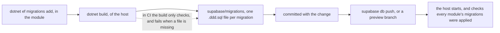
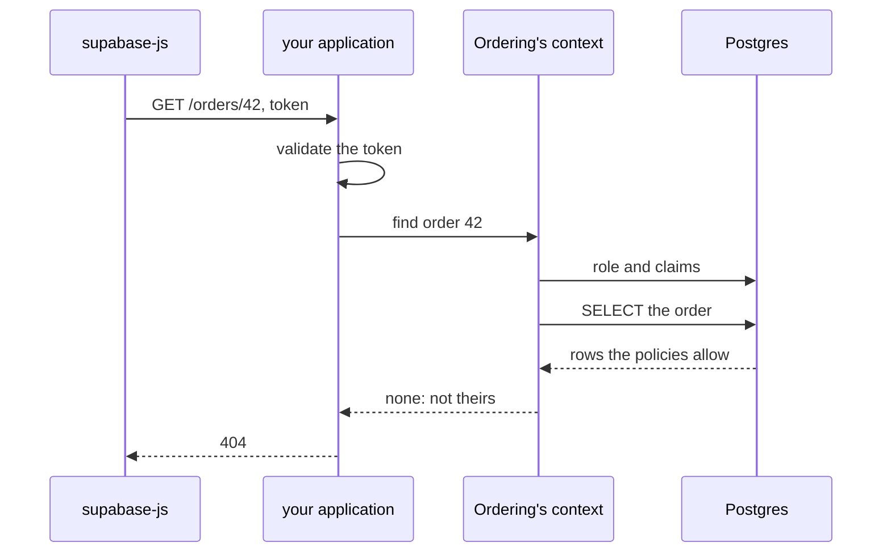

# Supabase

The Supabase CLI does not run Entity Framework migrations. It runs the SQL files in
`supabase/migrations`, and so do `supabase db reset` and Supabase branching.
`DDDToolkit.EntityFramework.Supabase` turns each Entity Framework migration into one of those files,
so you keep writing migrations with `dotnet ef migrations add` and Supabase applies them.

## Install

```bash
dotnet add package DDDToolkit.EntityFramework.Supabase
```

It depends on Entity Framework's relational layer and the dependency injection abstractions, and brings
its own source generator: not on Npgsql, which your application already brings, and not on the rest of
the toolkit, so it works for any context that has migrations. Reference it from the module that holds
the context.

From a change to a model to a database that has it:



<details>
<summary>Show the code: the three places it is switched on</summary>

The design-time factory of each module's context is marked:

```csharp
[SupabaseMigrations]
public sealed class OrderingContextFactory : IDesignTimeDbContextFactory<OrderingContext>
{
    public OrderingContext CreateDbContext(string[] args)
    {
        var options = new DbContextOptionsBuilder<OrderingContext>();
        OrderingContext.UsePostgres(options, "Host=unused");
        return new OrderingContext(options.Options);
    }
}
```

The host's project file turns the export on, writing locally and only checking in CI:

```xml
<PropertyGroup>
  <SupabaseMigrationsExport>Write</SupabaseMigrationsExport>
  <SupabaseMigrationsExport Condition="'$(ContinuousIntegrationBuild)' == 'true'">Check</SupabaseMigrationsExport>
</PropertyGroup>
```

And the host refuses to start against a database that lacks a migration:

```csharp
// in the module
services.AddSupabaseMigrations<OrderingContext, OrderingContextFactory>();

// in the host
var app = builder.Build();
await app.Services.EnsureSupabaseMigrationsAppliedAsync();
```

</details>

## Exporting as part of the build

The export needs a context on Npgsql, but it never connects, so a connection string that points nowhere
is enough. That is exactly what the design-time factory `dotnet ef` already uses gives you. Mark it:

```csharp
[SupabaseMigrations]
public sealed class OrderingContextFactory : IDesignTimeDbContextFactory<OrderingContext>
{
    public OrderingContext CreateDbContext(string[] args)
    {
        var options = new DbContextOptionsBuilder<OrderingContext>();
        OrderingContext.UsePostgres(options, "Host=unused");
        return new OrderingContext(options.Options);
    }
}
```

and turn the export on in the project that references every module: the host of a modular monolith,
the presentation layer of a service.

```xml
<PropertyGroup>
  <SupabaseMigrationsExport>Write</SupabaseMigrationsExport>
  <SupabaseMigrationsExport Condition="'$(ContinuousIntegrationBuild)' == 'true'">Check</SupabaseMigrationsExport>
</PropertyGroup>
```

That is all. Nothing in `Program.cs`, no command to remember, no list of modules to keep up to date.

- **`Write`** writes a file for every migration that has none, after every build. Locally that means
  the files exist by the time you commit, and `supabase start` or `db reset` has them.
- **`Check`** only compares, and fails the build when a file is missing, changed or orphaned, naming
  each one. In CI that catches the migration somebody added without building locally.
- **Unset** does nothing, which is every project but the one you turned it on in.

The list of modules you do not keep is kept by the compiler. In the project that turned the export on,
the package's generator finds every marked factory in the assemblies it references and writes them down
as ordinary code:

```csharp title="DDDToolkit.SupabaseMigrationSources.g.cs"
namespace DDDToolkit.EntityFramework.Supabase.Generated
{
    internal static class SupabaseMigrationSources
    {
        public static IReadOnlyList<SupabaseMigrationSource> All()
            => new SupabaseMigrationSource[]
            {
            SupabaseMigrationSource.For<OrderingContext, OrderingContextFactory>("Ordering"),
            };

        [ModuleInitializer]
        internal static void ExportWhenTheBuildAsks()
            => SupabaseMigrationBuild.RunIfRequested(All);
    }
}
```

Add a module with a marked factory and the next build exports its migrations too. `"Ordering"` is the
module name the files carry, read from the module's `[assembly: Module("Ordering")]`.
[How the build step works](#how-the-build-step-works) explains the module initializer.

Commit the files. Supabase branching and the GitHub integration read `supabase/migrations` from the
repository, so the files have to be there, and `Check` is what guarantees they are. If you do not use
branching you can generate them in the pipeline instead, with `Write` in a release build followed by
`supabase db push`, and leave them out of the repository.

## What the build writes

Each file is named after its migration and its module: `20260922120000_AddOrders` in a project with
`[assembly: Module("Ordering")]` becomes `20260922120000_AddOrders.ordering.ddd.sql`. Without a module
attribute the context's name stands in, less its `Context`. Entity Framework ids and Supabase versions
are both `yyyyMMddHHmmss` timestamps, so the two histories sort the same way, and a file written with
`supabase migration new` takes its place between them by date. The Supabase CLI reads everything
between the first underscore and `.sql` as the name, so `.ordering.ddd` is only there for people: next
to the policies and triggers you write by hand, it says which files the build writes and which module
each belongs to.

The file is what `dotnet ef migrations script` writes for that one step, with three differences:

- **No `START TRANSACTION` and `COMMIT`.** The CLI already runs a file, and the row it records in
  `supabase_migrations.schema_migrations`, in one transaction. It runs statements that cannot be in a
  transaction, such as `CREATE INDEX CONCURRENTLY`, on their own.
- **Row level security on new tables in `public`.** Supabase serves `public` through its Data API and
  grants the `anon` and `authenticated` roles access to it. Without row level security, a table
  Entity Framework creates there can be read and written by anyone who has the publishable key. With
  it on and no policy, those roles see nothing. Your application still works, because it connects as
  the table's owner, and row level security does not apply to the owner, unless you
  [run its queries as the caller](#row-level-security-for-your-own-queries). Change
  `SupabaseMigrationOptions.RowLevelSecuritySchemas` to cover other schemas, or clear it to turn this
  off. Putting your tables in a schema the Data API does not expose, with
  `modelBuilder.HasDefaultSchema("app")`, is even simpler. The toolkit's own `ddd` schema is not
  exposed.
- **A header comment naming the migration and its context.** That comment is how a file whose
  migration was removed gets recognised.

One of the example's files, with most of its statements left out:

```sql title="supabase/migrations/20260923093256_TrackCheckout.ordering.ddd.sql, shortened"
-- Exported by DDDToolkit from the Entity Framework migration 20260923093256_TrackCheckout of OrderingContext.
-- Written from that migration; change the migration, not this file.

ALTER TABLE ordering."Orders" ADD "CancellationReason" text;

-- ...

INSERT INTO ordering."__EFMigrationsHistory" ("MigrationId", "ProductVersion")
VALUES ('20260923093256_TrackCheckout', '10.0.12');
```

The `__EFMigrationsHistory` insert stays in. After Supabase applies a file, `GetPendingMigrations()`
and `dotnet ef migrations list` agree that the migration is applied. Let one of the two apply
migrations, not both. Supabase does not read Entity Framework's history, so if the application calls
`Database.Migrate()` first, the CLI applies that migration a second time and fails.

`Export` never overwrites or deletes a file. Supabase applies each version once, so rewriting a file
that was already applied changes nothing on that database, and a database that has not applied it yet
ends up with a different schema. Instead, the report (and `EnsureInSync`) lists:

| Status | Meaning |
|---|---|
| `Missing` / `Created` | The migration had no file; `Export` writes it. |
| `Changed` | The file is not what the migration generates now. Delete and export again only if it was never applied anywhere; otherwise make the change in a new migration. |
| `VersionTaken` | Another file already has this timestamp. |
| `Orphaned` | An exported file whose migration is gone, usually after `dotnet ef migrations remove`. |

The comparison ignores line endings, and it ignores the Entity Framework version in the history
insert, so a checkout with `\r\n` or an Entity Framework update does not show every file as changed.
Files you wrote yourself, such as policies, triggers and storage buckets, are left alone.

If a database already has these migrations from `dotnet ef database update`, tell Supabase once:
`supabase migration repair --status applied <version>` for each exported version.

## Checking at start-up

On Supabase the migrations are the CLI's to apply, so the application must not call
`Database.Migrate()`. It can still refuse to run against an older schema. Each module registers its
source, and the host checks them all once it is built:

```csharp
// in the module
services.AddSupabaseMigrations<OrderingContext, OrderingContextFactory>();

// in the host
var app = builder.Build();
await app.Services.EnsureSupabaseMigrationsAppliedAsync();
```

It asks each context's own migration history and throws a `SupabaseMigrationsPendingException` that
names every context with migrations missing, and each missing migration. Registering the same context
twice registers it once; with no sources registered it does nothing, which is what a module running on
something other than Supabase wants.

## Several modules, one Supabase project

A Supabase project is one database, so a modular monolith's modules share it. Give each module a
schema of its own and a migration history table in that schema, and export them all into the same
`supabase/migrations`:

```csharp
public const string Schema = "ordering";

public static void UsePostgres(DbContextOptionsBuilder options, string connectionString)
    => options.UseNpgsql(connectionString, npgsql => npgsql.MigrationsHistoryTable(HistoryRepository.DefaultTableName, Schema));

protected override void OnModelCreating(ModelBuilder modelBuilder)
{
    modelBuilder.HasDefaultSchema(Schema);
    modelBuilder.AddDomainEventOutbox(Database);
}
```

Each module's migrations only ever see its own history table, so neither can report the other's as
pending. Supabase has one history, which interleaves the modules by timestamp. That is fine, because no
module's migration touches another module's schema. A context only reports its own exported files as
orphaned, and if two modules scaffold migrations in the same second, the second one is reported as
`VersionTaken` rather than written.

Module schemas are not in the Data API's `schemas` list in `supabase/config.toml`, so the Data API does
not serve them and nothing needs row level security.

`Examples/ModularMonolith.Supabase` does all of this for five modules. Each module's factory is marked
`[SupabaseMigrations]`, next to its context, and its migrations are in its
`Infrastructure/Persistence/Migrations` folder. When the host runs on Supabase, the shared
[`ModuleDatabase.AddContext`](../Examples/Shared/DDDToolkit.Examples.Hosting/ModuleDatabase.cs)
registers the start-up check for each module. The host's project file turns the export on, `Write`
locally and `Check` in CI, and `supabase/migrations` holds the committed files. See
[its README](../Examples/README.md#on-supabase) to run it against a local Supabase.

## Row level security for your own queries

An application that connects as `postgres` is the owner of its tables, and row level security does not
apply to the owner. So the policies you wrote for the Data API guard the Data API and nothing else: every
query your application runs sees every row, and who may see what is the application's own code to get
right. That is a fine design, and the default. If you would rather keep Supabase's policies as the
authority, for the application as well as for supabase-js, run each request's queries as the user who
sent it, the way PostgREST does.

Row level security itself is Postgres's, and so is the package that does this,
`DDDToolkit.EntityFramework.Postgres`, which this one brings; [Row level security](row-level-security.md)
has all of it. What is Supabase's is the token, the roles and `auth.uid()`, and that is what this section
is about.

```bash
dotnet add package DDDToolkit.Auth.Supabase.AspNetCore       # an ASP.NET Core application
dotnet add package DDDToolkit.Auth.Supabase.AzureFunctions   # Azure Functions on the isolated worker
```

Both bring `DDDToolkit.Auth.Supabase`, which validates Supabase Auth's tokens without a web framework. One
request, from the token supabase-js sends to the rows a module's query gets back:



<details>
<summary>Show the code: switched on in the host, per context</summary>

```csharp
builder.Services.AddAuthentication().AddSupabaseJwtBearer("https://<ref>.supabase.co");
builder.Services.AddSupabaseRowLevelSecurity();

builder.Services.AddDbContext<OrderingContext>((provider, options) => options
    .UseNpgsql(connectionString)
    .UseSupabaseRowLevelSecurity(provider));

// after Build()
app.UseAuthentication();
```

</details>

`AddSupabaseJwtBearer` validates the access tokens Supabase Auth issues, the ones supabase-js holds for
a signed-in user: issued by `https://<ref>.supabase.co/auth/v1`, for the audience `authenticated`, and
signed with a key the project publishes. A project still on the legacy JWT secret publishes none, and nor
does the CLI's local stack unless you give it signing keys; for those, pass the secret:
`AddSupabaseJwtBearer(url, jwt => jwt.UseSupabaseJwtSecret(secret))`.

`AddSupabaseRowLevelSecurity` and `UseSupabaseRowLevelSecurity` are Postgres's row level security with the
roles every Supabase project has. Every time a context opens a connection, the caller's role and the
token's claims go on it, as PostgREST puts them on for each request:

| The caller | Runs as | `auth.uid()` |
|---|---|---|
| A request with a valid Supabase access token | `authenticated`, with the token's claims exactly as signed | the user's id |
| A request without one, or signed in some other way | `anon`, with the claims `{"role":"anon"}` | `null` |
| No request at all: an outbox poller, a hosted service | `SystemRole`, or the role the application logged in as | `null` |
| Code inside `using (Callers.Begin(caller))` | that caller, whatever the request says | the caller's |

So `auth.uid()`, `auth.jwt()` and every policy on every table the context touches apply to its queries,
and a policy you already test with pgTAP says what the application may see. Who is calling, work that
leaves a request, and how the settings travel are the same on any Postgres; see
[Running queries as the caller](row-level-security.md#running-queries-as-the-caller). Connect through the
session pooler on port 5432, or directly: the transaction pooler on port 6543 hands each transaction
whichever server connection is free, and is refused.

**The database needs to know about the application's roles.** `anon` and `authenticated` have no
privileges in a schema of yours until you grant them some, in a migration you write by hand:

```sql
grant usage on schema ordering to anon, authenticated;
grant select, insert, update, delete on all tables in schema ordering to anon, authenticated;
alter default privileges in schema ordering grant select, insert, update, delete on tables to anon, authenticated;
```

Keep such schemas out of the Data API's exposed schemas. Granted to `anon`, a table in an exposed schema
is open to anyone holding the publishable key, as far as its policies let them; unexposed, only the
application reaches it.

Write policies for aggregates, not rows. A policy that hides some of an order's lines hands Entity
Framework half an aggregate, and its invariants then check half the data. Put the rule on the root, and
let the children follow it: `using (exists (select 1 from ordering."Orders" o where o."Id" = "OrderId"))`
asks the orders table, which answers under its own policy, so an order is visible whole or not at all.
Rules written in C# do this for you, as the next section shows.

**Background work** runs as `SystemRole`, or, left unset, as the role the application logged in as.
Logged in as `postgres`, that is the owner, as before. For an application that should not be able to see
everything by accident, log in as a role of its own that may do nothing but switch roles, as PostgREST's
`authenticator` does, and set `SystemRole = SupabaseRowLevelSecurity.ServiceRole`:

```sql
create role shop_app login noinherit password '...';
grant anon, authenticated, service_role to shop_app;
```

`Examples/ModularMonolith.Supabase` turns this on with `Supabase:Url`. An order there is its customer's:
it knows who placed it, and two rules written in C#, `ACustomerHasTheirOrders` and
`NobodyOrdersForSomebodyElse`, become its policies, as the next section describes. A signed-in customer
sees their own orders, and a guest's order stays anybody's with its id.

### Row access rules in the build

[Row access rules written in C#](row-level-security.md#row-access-rules-written-in-c) go into
`supabase/migrations` with the migrations. The build finds every `[RowAccess]` rule in the modules the
host references and writes, for each module with rules, a file of its own,
`{version}_access.{module}.ddd.sql`, whose policies ask `auth.uid()` and `auth.jwt()`:

```sql
-- Written by DDDToolkit from the row access rules of OrderingContext.
DO $ddd$ ... $ddd$;   -- drops the policies the previous file made on the module's tables

ALTER TABLE ordering."Orders" ENABLE ROW LEVEL SECURITY;

CREATE POLICY "A customer has their orders (read)" ON ordering."Orders" FOR SELECT TO anon, authenticated
    USING (("PlacedBy" IS NULL) OR ("PlacedBy" IS NOT DISTINCT FROM (SELECT auth.uid())));
COMMENT ON POLICY "A customer has their orders (read)" ON ordering."Orders" IS 'DDDToolkit row access rule';

-- OrderLine belongs to the aggregate, and is seen and changed with it.
ALTER TABLE ordering."OrderLine" ENABLE ROW LEVEL SECURITY;
CREATE POLICY "OrderLine goes with its Orders" ON ordering."OrderLine" FOR ALL TO anon, authenticated
    USING (EXISTS (SELECT 1 FROM ordering."Orders" parent WHERE parent."Id" = "OrderLine"."OrderId"))
    WITH CHECK (EXISTS (SELECT 1 FROM ordering."Orders" parent WHERE parent."Id" = "OrderLine"."OrderId"));
```

The file says what the rules are now: it drops every policy an earlier one made, found by the comment each
carries, and makes them all again, so a rule taken out disappears and a policy you wrote by hand is left
alone. A file already written is never written again, because Supabase may have applied it. A rule that
changes, or a migration of the module that comes after the last file, gets a new file, numbered after
everything else in the directory, and `Check` in CI fails until it is there.

A policy stands in the way of dropping a column it reads, so every migration of a module with rules
starts by taking the module's generated policies off. The access file after it puts them back.

### In Azure Functions

The isolated worker runs no ASP.NET Core pipeline, not even with its ASP.NET Core integration, so there
is no `UseAuthentication()` to hang a bearer scheme on. `DDDToolkit.Auth.Supabase.AzureFunctions` is a
worker middleware instead: for every HTTP-triggered invocation it validates the token in the request's
`Authorization` header and runs the function inside `Callers.Begin`, as that user, or as `anon` without a
valid token.

```csharp
var builder = FunctionsApplication.CreateBuilder(args);
builder.UseSupabaseAuth();

builder.Services.AddSupabaseAuth("https://<ref>.supabase.co");
builder.Services.AddSupabaseRowLevelSecurity();
builder.Services.AddDbContext<OrderingContext>((provider, options) => options
    .UseNpgsql(connectionString)
    .UseSupabaseRowLevelSecurity(provider));
```

A queue, timer or Service Bus trigger has no request and runs as the system, unless the function begins a
caller itself, say from the claims its message carries. `context.GetSupabaseCaller()` says who an
invocation runs as, for a function that answers somebody without a user with a 401.

### Anywhere else

A worker service or a tool of your own needs no host package. `SupabaseTokenValidator`, from
`DDDToolkit.Auth.Supabase`, checks a token against the project's published keys and returns its `Caller`;
`Callers.Begin` makes it current; and `AddSupabaseRowLevelSecurity()` alone asks for exactly that caller,
or the system outside any. Pass `Callers.FromClaims(claims)` only the claims of a token something
validated.

## Exporting by hand

Everything the build does is also an API, for a test, a tool of your own or a context without a
factory:

```csharp
var ordering = SupabaseMigrationSource.For<OrderingContext, OrderingContextFactory>();

SupabaseMigrations.Export([ordering, shipping]);        // writes what is missing
SupabaseMigrations.EnsureInSync([ordering, shipping]);  // throws unless everything is there
```

`SupabaseMigrationSource.For(() => ...)` takes a delegate instead of a factory. Given sources and no
directory, `Export`, `Compare` and `EnsureInSync` find the Supabase project the way the CLI does: from
the current directory upwards to the nearest `supabase/config.toml`.
`SupabaseMigrations.FindDirectory(start)` does the same from a directory you choose. The three also
take a single `DbContext`; that form does not search, and uses `supabase/migrations` under the current
directory unless you pass one.

## How the build step works

The build step runs your code at build time, so here is what it does. A source generator in the
package looks, in the project that turned the export on, for every factory marked `[SupabaseMigrations]`
in the assemblies it references, and writes the list as ordinary generic code,
`SupabaseMigrationSource.For<OrderingContext, OrderingContextFactory>("Ordering")`, together with a
module initializer, as shown under [Exporting as part of the build](#exporting-as-part-of-the-build).
After the build, a target in the package starts the application it just built with one environment
variable set. The module initializer runs before `Main`, sees the variable, exports, and ends the
process. None of the application's own start-up runs: no host builder, no configuration providers, no
Azure App Configuration, no hosted services. Without the variable, which is every other time the
application starts, the initializer returns at once. Nothing is found or created by reflection; the
factory is `new TFactory()`. It adds about a second to a build of that one project.

A marked factory the generated code cannot create, because it is not public, has no public
parameterless constructor or does not implement `IDesignTimeDbContextFactory<TContext>`, is reported as
[DDD00031](diagnostics.md#ddd00031) instead of being skipped.

The package brings the generator and the build step to the host through the module that references it,
so the host does not reference the package itself unless it uses the start-up check.

## Where to look next

- [Entity Framework](entity-framework.md#migrations) for migrations on any other database.
- [Row level security](row-level-security.md) for callers, work outside a request, and rules written in C#.
- [Modules](modules.md) for `[assembly: Module("Ordering")]`, the name the files carry.
- [Diagnostics](diagnostics.md#ddd00031) for the build error about an unusable factory.
