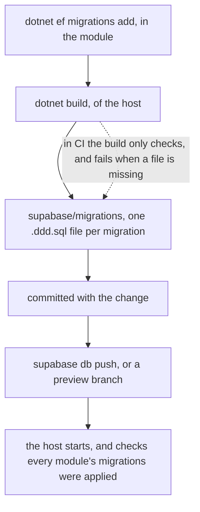
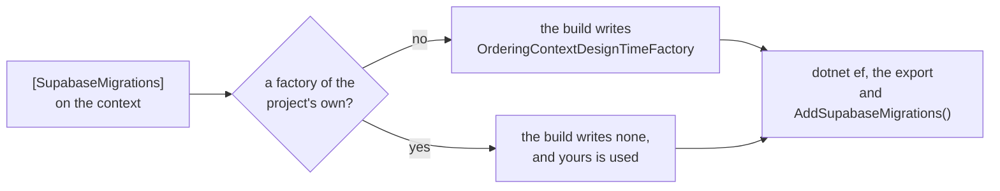
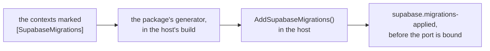
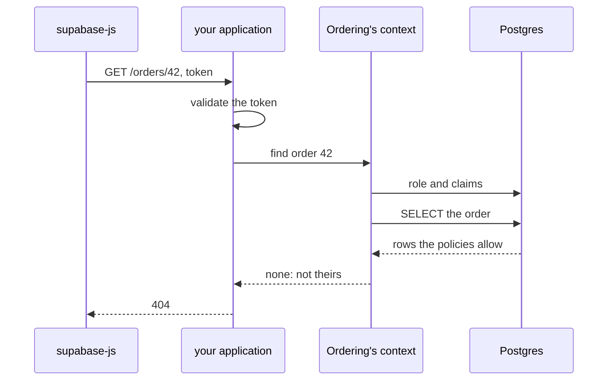
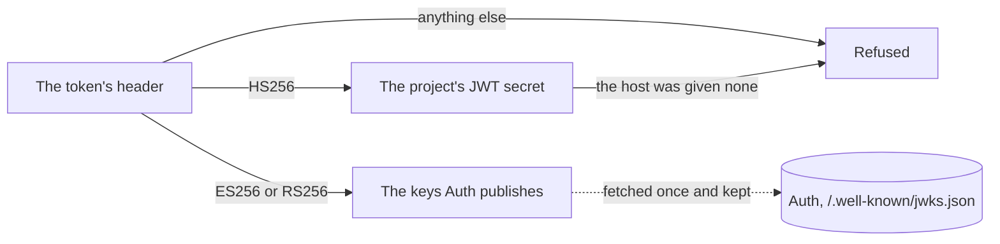
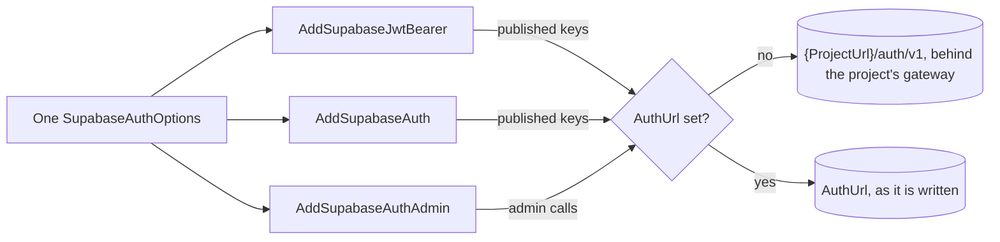
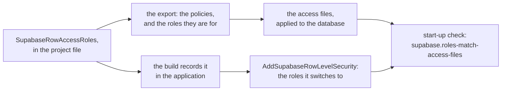
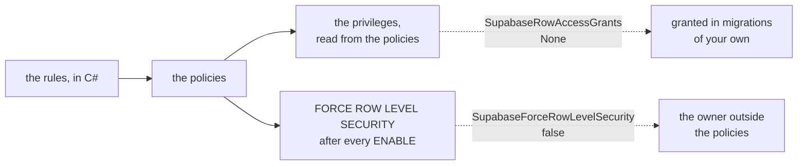
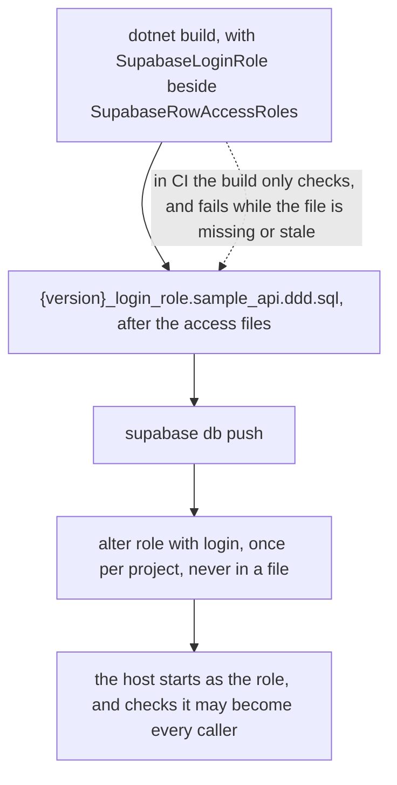
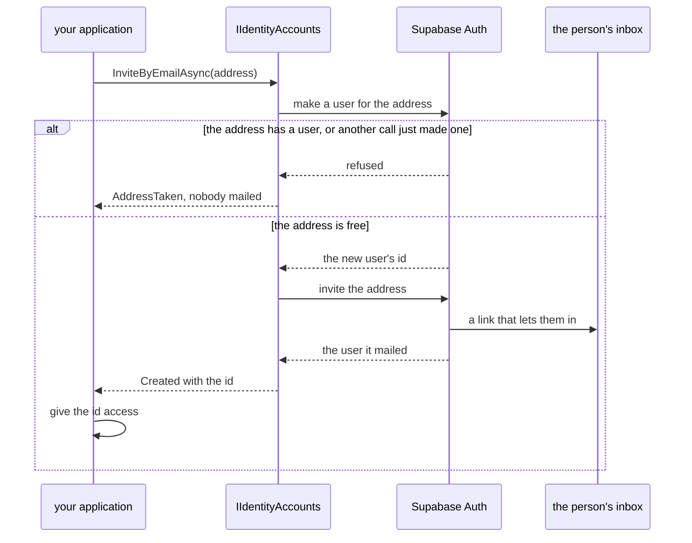

# Supabase

The Supabase CLI does not run Entity Framework migrations. It runs the SQL files in
`supabase/migrations`, and so do `supabase db reset` and Supabase branching.
`DDDToolkit.EntityFramework.Supabase` turns each Entity Framework migration into one of those files,
so you keep writing migrations with `dotnet ef migrations add` and Supabase applies them.

## Install

```bash
dotnet add package Temp.DDDToolkit.EntityFramework.Supabase
```

It depends on Entity Framework's relational layer and the dependency injection abstractions, and brings
its own source generator: not on Npgsql, which your application already brings, and not on the rest of
the toolkit, so it works for any context that has migrations. Reference it from the module that holds
the context.

From a change to a model to a database that has it:


```mermaid
flowchart TB
    Add["dotnet ef migrations add, in the module"] --> Build["dotnet build, of the host"]
    Build --> Files["supabase/migrations, one .ddd.sql file per migration"]
    Files --> Commit["committed with the change"]
    Commit --> Push["supabase db push, or a preview branch"]
    Push --> Start["the host starts, and checks every module's migrations were applied"]
    Build -. "in CI the build only checks, and fails when a file is missing" .-> Files
```

<details>
<summary>Show the code: the three places it is switched on</summary>

Each module's context is marked:

```csharp
[SupabaseMigrations]
public sealed class OrderingContext(DbContextOptions<OrderingContext> options) : DbContext(options)
{
    // ...
}
```

The host's project file turns the export on, writing locally and only checking in CI:

```xml
<PropertyGroup>
  <SupabaseMigrationsExport>Write</SupabaseMigrationsExport>
  <SupabaseMigrationsExport Condition="'$(ContinuousIntegrationBuild)' == 'true'">Check</SupabaseMigrationsExport>
</PropertyGroup>
```

And the host refuses to start against a database that lacks a migration, with one call for every marked context:

```csharp
// in the host
using Shop.Host; // the namespace named after the host's assembly, where the build writes AddSupabaseMigrations()

builder.Services.AddSupabaseMigrations();
builder.Services.RunStartupChecks();
```

</details>

## Exporting as part of the build

The export needs a context on Npgsql, but it never connects, so a connection string that points nowhere
is enough. `dotnet ef` needs the same: a design-time factory that makes the context without the host. You
write neither. Mark the context `[SupabaseMigrations]`, and the package's generator writes the factory beside it,
in the context's project, in a file named after it:


```mermaid
flowchart LR
    Marked["[SupabaseMigrations]<br/>on the context"] --> Own{"a factory of the<br/>project's own?"}
    Own -- "no" --> Written["the build writes<br/>OrderingContextDesignTimeFactory"]
    Own -- "yes" --> Yours["the build writes none,<br/>and yours is used"]
    Written --> Users["dotnet ef, the export<br/>and AddSupabaseMigrations()"]
    Yours --> Users
```

The export is always Postgres, so the factory is always the same: Npgsql, pointing nowhere, and
`UseDDDToolkitDesignTime()`, which is `DDDToolkit.EntityFramework`'s and keeps the migration history where a host
that wires the context with `UseDDDToolkit` keeps it, in the context's default schema, so the files record each
migration in the table the application reads (see
[The migration history](entity-framework.md#the-migration-history)). In a project that does not reference
`DDDToolkit.EntityFramework` the toolkit does not wire the context, and the factory leaves the history where Entity
Framework keeps it.

`dotnet ef` finds the factory where it finds one written by hand: it looks in the startup project first and then in
the context's own assembly, which is where this one is. So `dotnet ef migrations add` works with the module as its own
startup project or with the host as the startup project, and a startup project with a factory of its own, a project
of SQL Server migrations say, keeps using that one. The migrations are found where Entity Framework looks when it is
told nothing else, in the context's assembly.

A factory of your own for the context, in its project, wins: the build writes none, says nothing, and uses yours.
Make it public, with a public parameterless constructor, where the export or the check is in another project, as
the host is: the list the build writes there creates it with `new()`, and the project that exports reports
[DDD00031](diagnostics.md#ddd00031) for one it cannot. Write one for a context the build cannot make, one whose
constructor needs more than its options, say, and for one that needs more at design time than Npgsql pointing
nowhere and the toolkit's call: provider options such as `MapEnum` or `UseNodaTime`, or a history table of its own.
The build reports DDD00031 at a marked context it cannot write a factory for, and that has none: one that is
abstract or generic, has no constructor that takes its options alone or none that sets its `required` members, or
is in a project that does not reference `Npgsql.EntityFrameworkCore.PostgreSQL`.

A factory of the host's own for a module's context wins in the host. `dotnet ef` takes it first with the host as its
startup project, so the export and the start-up check there make the context with it too; with the module as its
startup project, `dotnet ef` takes the one beside the context. The marker may still go on a factory instead, as it
did up to 3.1: for a context whose migrations are in a project of their own, whose factory says where they are. A
marked factory wins over every other factory of its context.

<details>
<summary>Show the code: a marked context and the factory the build writes beside it</summary>

```csharp
[SupabaseMigrations]
public sealed class OrderingContext(DbContextOptions<OrderingContext> options) : DbContext(options)
{
    protected override void OnModelCreating(ModelBuilder modelBuilder)
        => modelBuilder.HasDefaultSchema("ordering");
}
```

```csharp title="OrderingContextDesignTimeFactory.g.cs, shortened"
public sealed class OrderingContextDesignTimeFactory : IDesignTimeDbContextFactory<OrderingContext>
{
    public OrderingContext CreateDbContext(string[] args)
        => new OrderingContext(new DbContextOptionsBuilder<OrderingContext>().UseNpgsql("Host=unused").UseDDDToolkitDesignTime().Options);
}
```

```bash
dotnet ef migrations add AddOrders --project src/Ordering --startup-project src/Ordering
dotnet ef migrations has-pending-model-changes --project src/Ordering --startup-project src/Host
```

Both say `Using DbContext factory 'OrderingContextDesignTimeFactory'.` with `--verbose`.

</details>

Then turn the export on in the project that references every module: the host of a modular monolith,
the presentation layer of a service.

```xml
<PropertyGroup>
  <SupabaseMigrationsExport>Write</SupabaseMigrationsExport>
  <SupabaseMigrationsExport Condition="'$(ContinuousIntegrationBuild)' == 'true'">Check</SupabaseMigrationsExport>
</PropertyGroup>
```

That is all for the export. Nothing in `Program.cs`, no command to remember, no list of modules to keep up to date.

- **`Write`** writes a file for every migration that has none, after every build. Locally that means
  the files exist by the time you commit, and `supabase start` or `db reset` has them.
- **`Check`** only compares, and fails the build when a file is missing, changed or orphaned, naming
  each one. In CI that catches the migration somebody added without building locally.
- **Unset** does nothing, which is every project but the one you turned it on in.

The property may also be given for a whole build, as `-p:SupabaseMigrationsExport=Check` on the command
line, in a `Directory.Build.props` or by CI: only an application that is not a test project runs the
export, so the value reaches the host and every module and test project ignores it. Every application
in that build runs it, though. When more than one references the modules, an API beside a program that
only exports, say, keep the property in the exporting project's file, or give it to a build of that
project alone: `dotnet build src/Exporter -p:SupabaseMigrationsExport=Check`.

The list of modules you do not keep is kept by the compiler. In the project that turned the export on,
the package's generator finds every marked context in the assemblies it references, each with the factory beside
it, and writes them down as ordinary code:

```csharp title="DDDToolkit.SupabaseMigrationSources.g.cs"
namespace DDDToolkit.EntityFramework.Supabase.Generated
{
    internal static class SupabaseMigrationSources
    {
        public static IReadOnlyList<SupabaseMigrationSource> All()
            => new SupabaseMigrationSource[]
            {
            SupabaseMigrationSource.For<OrderingContext, OrderingContextDesignTimeFactory>("Ordering"),
            };

        [ModuleInitializer]
        internal static void ExportWhenTheBuildAsks()
            => SupabaseMigrationBuild.RunIfRequested(All);
    }
}
```

Add a module with a marked context and the next build exports its migrations too. `"Ordering"` is the
module name the files carry, the module the project declares: `<DDD_Module>Ordering</DDD_Module>` or
`[assembly: Module("Ordering")]`.
[How the build step works](#how-the-build-step-works) explains the module initializer.

Commit the files. Supabase branching and the GitHub integration read `supabase/migrations` from the
repository, so the files have to be there, and `Check` is what guarantees they are. If you do not use
branching you can generate them in the pipeline instead, with `Write` in a release build followed by
`supabase db push`, and leave them out of the repository.

## What the build writes

Each file is named after its migration and its module: `20260922120000_AddOrders` in a project of module
Ordering becomes `20260922120000_AddOrders.ordering.ddd.sql`. Without a module the context's name stands in,
less its `Context`, and the build warns with [DDD00055](diagnostics.md#ddd00055): renaming the class would then
rename every file the export looks for. Entity Framework ids and Supabase versions
are both `yyyyMMddHHmmss` timestamps, so the two histories sort the same way, and a file written with
`supabase migration new` takes its place between them by date. The Supabase CLI reads everything
between the first underscore and `.sql` as the name, so `.ordering.ddd` is only there for people: next
to the policies and triggers you write by hand, it says which files the build writes and which module
each belongs to.

The file is what `dotnet ef migrations script` writes for that one step, with three differences:

- **No `START TRANSACTION` and `COMMIT`.** The CLI already runs a file, and the row it records in
  `supabase_migrations.schema_migrations`, in one transaction. It runs statements that cannot be in a
  transaction, such as `CREATE INDEX CONCURRENTLY`, on their own.
- **Row level security on new tables in `public`.** Supabase serves `public` through its Data API and
  grants the `anon` and `authenticated` roles access to it. Without row level security, a table
  Entity Framework creates there can be read and written by anyone who has the publishable key. With
  it on and no policy, those roles see nothing. Your application still works, because it connects as
  the table's owner, and row level security does not apply to the owner, unless you
  [run its queries as the caller](#row-level-security-for-your-own-queries). Change
  `SupabaseMigrationOptions.RowLevelSecuritySchemas` to cover other schemas, or clear it to turn this
  off. Putting your tables in a schema the Data API does not expose, with
  `modelBuilder.HasDefaultSchema("app")`, is even simpler. The toolkit's own `ddd` schema is not
  exposed.
- **A header comment naming the migration and its context.** That comment is how a file whose
  migration was removed gets recognised.

One of the example's files, with most of its statements left out:

```sql title="supabase/migrations/20260923093256_TrackCheckout.ordering.ddd.sql, shortened"
-- Exported by DDDToolkit from the Entity Framework migration 20260923093256_TrackCheckout of OrderingContext.
-- Written from that migration; change the migration, not this file.

ALTER TABLE ordering."Orders" ADD "CancellationReason" text;

-- ...

INSERT INTO ordering."__EFMigrationsHistory" ("MigrationId", "ProductVersion")
VALUES ('20260923093256_TrackCheckout', '10.0.12');
```

The `__EFMigrationsHistory` insert stays in. After Supabase applies a file, `GetPendingMigrations()`
and `dotnet ef migrations list` agree that the migration is applied. Let one of the two apply
migrations, not both. Supabase does not read Entity Framework's history, so if the application calls
`Database.Migrate()` first, the CLI applies that migration a second time and fails.

`Export` never overwrites or deletes a file. Supabase applies each version once, so rewriting a file
that was already applied changes nothing on that database, and a database that has not applied it yet
ends up with a different schema. Instead, the report (and `EnsureInSync`) lists:

| Status | Meaning |
|---|---|
| `Missing` / `Created` | The migration had no file; `Export` writes it. |
| `Changed` | The file is not what the migration generates now. Delete and export again only if it was never applied anywhere; otherwise make the change in a new migration. |
| `VersionTaken` | Another file already has this timestamp. |
| `Orphaned` | An exported file whose migration is gone, usually after `dotnet ef migrations remove`. |

The comparison ignores line endings, and it ignores the Entity Framework version in the history
insert, so a checkout with `\r\n` or an Entity Framework update does not show every file as changed.
Files you wrote yourself, such as policies, triggers and storage buckets, are left alone.

If a database already has these migrations from `dotnet ef database update`, tell Supabase once:
`supabase migration repair --status applied <version>` for each exported version.

## Checking at start-up

On Supabase the migrations are the CLI's to apply, so the application must not call
`Database.Migrate()`. It can still refuse to run against an older schema. The host registers every marked context
with one call, which brings the [start-up check](startup-checks.md) `supabase.migrations-applied`, and runs it with
its other checks, before the server binds its port:


```mermaid
flowchart LR
    Contexts["the contexts marked<br/>[SupabaseMigrations]"] --> Generator["the package's generator,<br/>in the host's build"]
    Generator --> Call["AddSupabaseMigrations()<br/>in the host"]
    Call --> Check["supabase.migrations-applied,<br/>before the port is bound"]
```

`AddSupabaseMigrations()` takes no type arguments and names no module: the package's generator writes it into
every application that is not a test project, with the list of every marked context the application references,
each with the factory `dotnet ef` makes it with from the host, in the namespace named after the application's
assembly. A top-level `Program.cs` is in no namespace, so it needs `using Shop.Host;` for the call; without it the
compiler finds only the package's `AddSupabaseMigrations<TContext, TFactory>()` and asks for its type arguments. A
module that is added is checked with no change in the host, and the host's own code still names no context. The
export's property plays no part: a host whose files another program exports, as the Tenancy sample's does, gets the
call all the same.

The list follows the references, not the registrations: a marked context of any project the host references is in
it, whether the host registers that context or not, and the check asks each one for its history. A host that
shares a project with a marked context it does not use, a worker beside an API say, is stopped by the check with a
message that names the context. Such a host registers the contexts it does use one by one, with the factory
`dotnet ef` uses: `services.AddSupabaseMigrations<OrderingContext, OrderingContextDesignTimeFactory>()`. A host that
wrote an `AddSupabaseMigrations()` of its own before the build wrote one keeps it: the build then writes the list,
`SupabaseMigrationsOfModules.All()`, and leaves the call to the host's.

<details>
<summary>Show the code: the host's one call, and what the build wrote for it</summary>

```csharp
// in the host
using Shop.Host; // the namespace named after the host's assembly, where the build writes AddSupabaseMigrations()

builder.Services.AddSupabaseMigrations();
builder.Services.RunStartupChecks();
```

```csharp title="SupabaseMigrationsOfModules.g.cs, shortened"
namespace Shop.Host
{
    internal static class SupabaseMigrationsOfModules
    {
        public static IReadOnlyList<SupabaseMigrationSource> All()
            => new SupabaseMigrationSource[]
            {
            SupabaseMigrationSource.For<OrderingContext, OrderingContextDesignTimeFactory>("Ordering"),
            SupabaseMigrationSource.For<ShippingContext, ShippingContextDesignTimeFactory>("Shipping"),
            };

        public static IServiceCollection AddSupabaseMigrations(this IServiceCollection services)
        {
            foreach (var source in All())
            {
                DependencyInjection.AddSupabaseMigrations(services, source);
            }

            return services;
        }
    }
}
```

A host that checks some contexts and not others registers each itself, with the factory the build wrote:
`services.AddSupabaseMigrations<OrderingContext, OrderingContextDesignTimeFactory>()`.

</details>

It asks each context's own migration history and throws a `SupabaseMigrationsPendingException` that
names every context with migrations missing, and each missing migration. Where the running context reads its
history from another table than the one its design-time factory's context records the migrations in, which is
where the exported files record them, the message says that as well, with both tables: the migrations may well
be applied, and recorded where the application does not look. It also says what to do. Where those files were
applied to a database already, the application names the table they record in, with the `MigrationsHistoryTable`
the message spells out, since an applied file keeps the table it was exported with. Where none was applied
anywhere yet, the factory gets the application's history instead, `UseDDDToolkitDesignTime()` where the application
calls `UseDDDToolkit`, and the files are exported again and the local database reset. For a marked context, whose
factory the build writes, that means a factory of your own beside it, which the build then uses in place of its own. Registering the same context
twice registers it once, and the check once however many contexts there are; with no sources registered there is
no check, which is what a host running on something other than Supabase wants: it does not call
`AddSupabaseMigrations()`.

A host that runs its checks by hand calls the method behind it once the host is built, as before:

```csharp
var app = builder.Build();
await app.Services.EnsureSupabaseMigrationsAppliedAsync();
```

A deployment that checks the migrations itself before it starts the host turns the check off, and says so:
`builder.Services.SkipStartupCheck(SupabaseMigrations.AppliedCheck, reason: "...")`.

It asks as the system caller, so with [row level security](#row-level-security-for-your-own-queries) it switches
to the system caller's role, `ddd_system` unless the project says otherwise, which the access files give the
migration history. An application that logs in as a role of its own checks first that the role may switch to it, as
[The role the application logs in as](#the-role-the-application-logs-in-as) shows; the runner does that in the
stage before the migrations'.

With [row level security for your own queries](#row-level-security-for-your-own-queries), the same call also runs
the checks `AddSupabaseRowLevelSecurity` brings, and one of them is that the role the host logs in as owns
nothing. Logged in as `postgres`, as this page starts out, the host owns its tables, so
`postgres.login-role-owns-nothing` stops it, with a message that says to log in as a role of its own:
[the role the application logs in as](#the-role-the-application-logs-in-as). Until it does, it turns that one
check off, and says why:

```csharp
builder.Services.AddSupabaseRowLevelSecurity();
builder.Services.RunStartupChecks();
builder.Services.SkipStartupCheck(
    PostgresRowAccessChecks.LoginRoleOwnsNothingCheck,
    reason: "logs in as postgres, which owns the tables, until it has a login role of its own");
```

## Several modules, one Supabase project

A Supabase project is one database, so a modular monolith's modules share it. Give each module a
schema of its own, and export them all into the same `supabase/migrations`. The migration history table goes in
that schema by itself: `UseDDDToolkit` in the host and `UseDDDToolkitDesignTime()` in the design-time factory keep
it there ([The migration history](entity-framework.md#the-migration-history)).

```csharp
public const string Schema = "ordering";

protected override void OnModelCreating(ModelBuilder modelBuilder)
{
    modelBuilder.HasDefaultSchema(Schema);
    modelBuilder.AddDomainEventOutbox(Database);
}
```

A context the host does not wire with `DDDToolkit.EntityFramework` names the table itself, in the host's options
and the factory's alike:
`UseNpgsql(connectionString, npgsql => npgsql.MigrationsHistoryTable(HistoryRepository.DefaultTableName, Schema))`.
The factory the build writes names no table, so such a context, marked, gets a factory of your own beside it that
does.

Each module's migrations only ever see its own history table, so neither can report the other's as
pending. Supabase has one history, which interleaves the modules by timestamp. That is fine, because no
module's migration touches another module's schema. A context only reports its own exported files as
orphaned, and if two modules scaffold migrations in the same second, the second one is reported as
`VersionTaken` rather than written.

Module schemas are not in the Data API's `schemas` list in `supabase/config.toml`, so the Data API does
not serve them and nothing needs row level security.

`Examples/ModularMonolith.Supabase` does all of this for five modules. Each module's context is marked
`[SupabaseMigrations]`, the build writes its design-time factory beside it, and its migrations are in its
`Infrastructure/Persistence/Migrations` folder. When the host runs on Supabase, it registers the start-up check for
every module with its one `AddSupabaseMigrations()`. The host's project file turns the export on, `Write`
locally and `Check` in CI, and `supabase/migrations` holds the committed files. See
[its README](../Examples/README.md#on-supabase) to run it against a local Supabase.

## Row level security for your own queries

An application that connects as `postgres` is the owner of its tables, and row level security does not
apply to the owner. So the policies you wrote for the Data API guard the Data API and nothing else: every
query your application runs sees every row, and who may see what is the application's own code to get
right. That is a fine design, and the default. If you would rather keep Supabase's policies as the
authority, for the application as well as for supabase-js, run each request's queries as the user who
sent it, the way PostgREST does.

Row level security itself is Postgres's, and so is the package that does this,
`DDDToolkit.EntityFramework.Postgres`, which this one brings; [Row level security](row-level-security.md)
has all of it. What is Supabase's is the token, the roles and `auth.uid()`, and that is what this section
is about.

```bash
dotnet add package Temp.DDDToolkit.Auth.Supabase.AspNetCore       # an ASP.NET Core application
dotnet add package Temp.DDDToolkit.Auth.Supabase.AzureFunctions   # Azure Functions on the isolated worker
```

Both bring `DDDToolkit.Auth.Supabase`, which validates Supabase Auth's tokens without a web framework. One
request, from the token supabase-js sends to the rows a module's query gets back:


```mermaid
sequenceDiagram
    participant Client as supabase-js
    participant Api as your application
    participant Context as Ordering's context
    participant Postgres
    Client->>Api: GET /orders/42, token
    Api->>Api: validate the token
    Api->>Context: find order 42
    Context->>Postgres: role and claims
    Context->>Postgres: SELECT the order
    Postgres-->>Context: rows the policies allow
    Context-->>Api: none: not theirs
    Api-->>Client: 404
```

<details>
<summary>Show the code: switched on in the host, once for every context</summary>

```csharp
builder.Services.AddAuthentication().AddSupabaseJwtBearer("https://<ref>.supabase.co");
builder.Services.AddDDDToolkitEntityFramework(options => options.DispatchWithMediator());   // the toolkit, Temp.DDDToolkit.EntityFramework
builder.Services.AddSupabaseRowLevelSecurity();

builder.Services.AddDbContext<OrderingContext>((provider, options) => options
    .UseNpgsql(connectionString)
    .UseDDDToolkit(provider));                       // runs it as its caller, with the toolkit

// after Build()
app.UseAuthentication();
```

</details>

`AddSupabaseJwtBearer` validates the access tokens Supabase Auth issues, the ones supabase-js holds for
a signed-in user: issued by `https://<ref>.supabase.co/auth/v1`, for the audience `authenticated`, and
signed with a key the project publishes. A hosted project with signing keys needs nothing more, and nor
does the stack the Supabase CLI starts. A project still on the legacy JWT secret publishes no key; for
that one, and for tokens an application signs itself, pass the secret as well, as
[Two kinds of token](#two-kinds-of-token) shows.

`AddSupabaseRowLevelSecurity` is Postgres's row level security with the roles every Supabase project has, and
`UseDDDToolkit`, the toolkit's call on a context's options, from `Temp.DDDToolkit.EntityFramework`, puts it on
every context on Postgres once it is registered: a context needs no call of its own. This package works without
the toolkit as well: a context without it takes `UseSupabaseRowLevelSecurity` instead. A context that should run
as the role the application logged in as is configured with `UseDDDToolkitCore`
([`UseDDDToolkitCore`](entity-framework.md#usedddtoolkitcore)); it then does what that role may, which on a
project that logs in as a role that owns and holds nothing is nothing at all. Every time a context opens a
connection, the caller's role and the token's claims go on it, as PostgREST puts them on for each request:

| The caller | Runs as | `auth.uid()` |
|---|---|---|
| A request with a valid Supabase access token | `authenticated`, with the token's claims exactly as signed | the user's id |
| A request without one, or signed in some other way | `anon`, with the claims `{"role":"anon"}` | `null` |
| The application's own work inside a scope, `Caller.SystemIn("projects")` | `ddd_system_in`, with the claims `{"role":"ddd_system_in","scope":"projects"}` | `null` |
| No request at all: a hosted service of your own | `ddd_system`, the toolkit's bookkeeping role, unless the project names another with `system=` in `SupabaseRowAccessRoles`, or the role the application logged in as with `system=none`; nobody at all where the host requires explicit callers, whose own pollers begin the system caller for their bookkeeping only | `null` |
| Code inside `using (Callers.Begin(caller))` | that caller, whatever the request says | the caller's |

So `auth.uid()`, `auth.jwt()` and every policy on every table the context touches apply to its queries,
and a policy you already test with pgTAP says what the application may see. The same statement empties
`request.jwt.claim.sub`, `request.jwt.claim.role`, `request.jwt.claim.email` and `request.jwt.claim`, which
`auth.uid()`, `auth.role()`, `auth.email()` and `auth.jwt()` read before the claims, so nothing left on a
server connection decides who a query runs as. Who is calling, work that leaves a request, and how the
settings travel are the same on any Postgres; see
[Running queries as the caller](row-level-security.md#running-queries-as-the-caller).

With `builder.Services.RequireExplicitCallers()`, work outside a request that never said who it runs as
fails instead of running as the system, and the toolkit's own background work says who it runs as; see
[Fail-closed callers](row-level-security.md#fail-closed-callers). `context.SupabaseCaller()` is a request's
own caller, the token's user or `anon`, whatever caller is ambient. Connect through the
session pooler on port 5432, or directly: the transaction pooler on port 6543 hands each transaction
whichever server connection is free, and is refused unless the settings travel per transaction, as
[Through the transaction pooler](#through-the-transaction-pooler) shows.

**The database needs to know about the application's roles.** `anon` and `authenticated` have no
privileges in a schema of yours until something grants them some. For the tables of an aggregate whose
rules are written in C#, the access files the build writes do, from the policies, and they give the module's
outbox and inbox what a caller needs there and no more; see
[Privileges, forced policies and the bookkeeping role](#privileges-forced-policies-and-the-bookkeeping-role).
A table without such a rule needs a migration you write by hand:

```sql
grant usage on schema ordering to anon, authenticated;
grant select, insert, update, delete on all tables in schema ordering to anon, authenticated;
alter default privileges in schema ordering grant select, insert, update, delete on tables to anon, authenticated;
```

Such grants take in the module's outbox and inbox tables too, which have no policies, and there the module's
access file decides, since it writes their privileges as well: the outbox takes rows from the signed-in user,
the scoped system role and the roles the module's policies let write, and from nobody else. So a guest who
writes a table without a rule under these grants has the save refused, `permission denied` on the outbox, as
soon as it raises an event. Such a module needs a rule for that table, whose policies then give the guest the
table and the outbox both, or the privileges left to the project, with `SupabaseRowAccessGrants` set to `None`
([Turning one off](#privileges-forced-policies-and-the-bookkeeping-role)); a project that writes them itself
takes back what a caller does not need as [A Postgres of your own](row-level-security.md#a-postgres-of-your-own)
shows.

Keep such schemas out of the Data API's exposed schemas. Granted to `anon`, a table in an exposed schema
is open to anyone holding the publishable key, as far as its policies let them; unexposed, only the
application reaches it.

Write policies for aggregates, not rows. A policy that hides some of an order's lines hands Entity
Framework half an aggregate, and its invariants then check half the data. Put the rule on the root, and
let the children follow it. For reading,
`using (exists (select 1 from ordering."Orders" o where o."Id" = "OrderId"))` asks the orders table,
which answers under its own policy, so an order is visible whole or not at all. For writing, a child's
policy asks the root's write rules about its order, so a caller who may only read an order cannot add,
change or remove its lines. Rules written in C# do both for you, as the next section shows.

**Background work** runs as `ddd_system`, a role of the application's own that the access files make and give
the toolkit's bookkeeping and nothing else: reading, marking and deleting outbox rows, the inbox, and which
migrations ran. A hosted service of yours that reads or writes a module's tables is refused there as
`ddd_system`, so begin its work as a [scoped system caller](row-level-security.md#the-scoped-system-role),
`using (Callers.Begin(Caller.SystemIn("projects")))`, which runs as `ddd_system_in`, inside the policies the
module's rules write for `RowAccessRoles.SystemIn`. A host that logs in as `postgres` and wants its background work
to run as that owner, past the policies, says so once, in its project file, and in the exporter's too where the
export runs in a project of its own; the build hands it to `AddSupabaseRowLevelSecurity` as well
([Roles and caller functions of your own](#roles-and-caller-functions-of-your-own)):

```xml
<SupabaseRowAccessRoles>system=none</SupabaseRowAccessRoles>
```

For an application that should not be able to see everything by accident, log in as a role of its own that may
do nothing but switch roles, as PostgREST's `authenticator` does. The build writes the migration that makes the
role, without a login or a password, since it is kept in the repository, when the project that exports names it
with [`SupabaseLoginRole`](#the-role-the-application-logs-in-as):

```xml
<SupabaseLoginRole>shop_app</SupabaseLoginRole>
```

The login is turned on once per project, as `postgres`, with a secret of that project's, in the SQL editor or
with `psql`:

```sql
-- Once per project, never in a file of the repository
alter role shop_app with login password '...';
```

The role is given `anon`, `authenticated`, the scoped system role and `ddd_system`, the roles the policies and
the privileges are written for. A host whose background work runs as `service_role` instead, as a secret key
would, says `system=service_role` in `SupabaseRowAccessRoles`; `service_role` is no role the access files make or
the login role's file grants, so the grant of it is yours, in a migration of your own after that file:
`grant service_role to shop_app;`.

`Examples/ModularMonolith.Supabase` turns this on with `Supabase:Url`. An order there is its customer's:
it knows who placed it, and two rules written in C#, `ACustomerHasTheirOrders` and
`NobodyOrdersForSomebodyElse`, become its policies, as the next section describes. A signed-in customer
sees their own orders, and a guest's order stays anybody's with its id.

### Two kinds of token

Supabase Auth signs a user's access token one of two ways, and the token's header says which. The bearer
scheme, and `SupabaseTokenValidator` outside ASP.NET Core, check each kind with its own kind of key:


```mermaid
flowchart LR
    Token[The token's header] -->|HS256| Secret[The project's JWT secret]
    Token -->|ES256 or RS256| Published[The keys Auth publishes]
    Token -->|anything else| Refused[Refused]
    Secret -->|the host was given none| Refused
    Published -.->|fetched once and kept| Auth[("Auth, /.well-known/jwks.json")]
```

<details>
<summary>Show the code: a host that takes both</summary>

```csharp
builder.Services.AddAuthentication().AddSupabaseJwtBearer(new SupabaseAuthOptions
{
    ProjectUrl = builder.Configuration["Supabase:Url"]!,       // the issuer is {ProjectUrl}/auth/v1
    JwtSecret = builder.Configuration["Supabase:JwtSecret"],   // unset: published keys only
});
```

`AddSupabaseJwtBearer(url, jwt => jwt.UseSupabaseJwtSecret(secret))` is the same, and
`AddSupabaseAuth(...)` takes the same settings for a function or a worker.

</details>

| Signed with | Algorithm | Checked with | Who signs this way |
|---|---|---|---|
| A signing key | ES256 or RS256 | The public half, which Auth publishes at `{project URL}/auth/v1/.well-known/jwks.json` | A hosted project with signing keys, and the stack the Supabase CLI starts |
| The JWT secret | HS256 | The secret, which the host has to be given | A project still on the legacy secret, and whatever signs tokens itself with that secret, such as a test |

A host with the project's URL alone takes the first kind. Given the secret too, it takes both, which is
what a developer's machine needs when a local stack's Auth signs with a key and the application's own
tooling signs with the stack's secret. Supabase advises signing keys for a hosted project, rather than
handing its secret to another service.

- **Each kind keeps to its own keys and algorithms.** A published key is public, so it is never taken for
  a secret: a token whose header says HS256 is held against the secret and nothing else, and is refused by
  a host that has none. A token signed any other way than these three is refused, and so is one signed by
  nobody. The issuer, the audience and the lifetime are checked the same for both kinds.
- **The published keys are fetched when the first token needs them, and kept.** They are fetched again as
  ASP.NET Core's JWT bearer fetches a provider's: after `AutomaticRefreshInterval`, and when a token names
  a key that is not among them, though no more often than `RefreshInterval`. So rotating a project's
  signing keys needs nothing in the host, and a stream of tokens that name unknown keys does not become
  a stream of requests to Auth. A key Auth stopped publishing is refused from the next fetch on.
- **Nothing is fetched for a token signed with the secret.** A host with no Auth server in reach takes
  those all the same.
- **The keys are fetched over https.** Whoever answers for the keys decides who is signed in, so they do
  not travel unencrypted without anybody having said so. Plain http is taken for an Auth server on the same
  machine, `localhost` or a loopback address, which is what a local stack is. Any other address in plain
  http is refused when the host starts; for an Auth server on a private network of your own, set
  `AllowPlainHttp = true` on the `SupabaseAuthOptions`, as [Where Auth answers](#where-auth-answers) shows.
- **No token waits on Auth without end.** A request for the keys ends with the timeout of the client that
  fetches them, the scheme's `BackchannelTimeout` in ASP.NET Core, and a token that waits behind another
  token's fetch stops waiting after as long. Either is refused.

### Where Auth answers

Every Supabase registration takes the project by the URL its tokens name, and reaches Auth where a project's
gateway serves it, at `{ProjectUrl}/auth/v1`: the bearer and `AddSupabaseAuth` fetch the published keys there,
and the [admin client](#users-before-their-first-sign-in) sends its calls there. A host with more to say about
the project than its URL says it once, in a `SupabaseAuthOptions`, and hands that one object to each of them.


```mermaid
flowchart LR
    Options[One SupabaseAuthOptions] --> Bearer[AddSupabaseJwtBearer]
    Options --> Validator[AddSupabaseAuth]
    Options --> Admin[AddSupabaseAuthAdmin]
    Bearer -->|published keys| Set{AuthUrl set?}
    Validator -->|published keys| Set
    Admin -->|admin calls| Set
    Set -->|no| Gateway[("{ProjectUrl}/auth/v1, behind the project's gateway")]
    Set -->|yes| Bare[("AuthUrl, as it is written")]
```

- **The project's URL is all a project needs**, hosted or the stack the Supabase CLI starts: its gateway
  serves Auth under it. A URL that already ends in `/auth/v1` is taken as it is, by every registration alike.
- **`AuthUrl` is for an Auth server that answers elsewhere**, and is taken as it is written, with nothing
  added. For an Auth server with no gateway in front of it, that is the server's own root, such as
  `http://auth:9999`. For a project's gateway reached inside a network under another name than its tokens
  carry, as a stack in containers is, it is that name with its `/auth/v1`, such as `http://kong:8000/auth/v1`:
  the gateway's address alone reaches no Auth. The keys are fetched there and the admin client calls there;
  the issuer a token has to name stays `{ProjectUrl}/auth/v1`.
- **`AllowPlainHttp` says that the network to Auth is your own.** Auth is reached over https, or in plain
  http on the same machine. Any other address in plain http is refused when the host starts, because both
  the keys a token is checked with and the secret key the admin client sends would travel unencrypted. One
  setting covers both, since it is one address.
- **Each registration reads the object when it is called.** A later change reaches none of them, so a host
  fills it in from its configuration before it hands it on, and describes the project in one place.

<details>
<summary>Show the code: one description of the project, for every registration</summary>

```csharp
var supabase = new SupabaseAuthOptions
{
    ProjectUrl = builder.Configuration["Supabase:Url"]!,       // the issuer is {ProjectUrl}/auth/v1
    JwtSecret = builder.Configuration["Supabase:JwtSecret"],   // unset: published keys only
    AuthUrl = builder.Configuration["Supabase:AuthUrl"],       // unset: Auth answers at {ProjectUrl}/auth/v1
};

builder.Services.AddAuthentication().AddSupabaseJwtBearer(supabase);
builder.Services.AddSupabaseAuthAdmin(supabase, builder.Configuration["Supabase:SecretKey"]!);
```

A function or a worker registers the validator with the same object, `AddSupabaseAuth(supabase)`. The admin
client checks no token, so it passes the JWT secret by. `Examples/Tenancy` describes its project in one place,
`SampleAuthentication.ProjectOf` in `Host/Auth/SampleAuthentication.cs`, which reads it from the configuration
for every registration there, and its AppHost sets `Supabase:AuthUrl`, because it starts Auth with no gateway
in front of it.

</details>

### Through the transaction pooler

Supabase's transaction pooler, port 6543 on the pooler's host, gives a client a server connection for one
transaction and hands it to the next client as it is. What is set for a session there reaches whoever
comes next, so by default the interceptor refuses that host and port. To use it, have the settings travel
per transaction instead:

```csharp
builder.Services.AddSupabaseRowLevelSecurity(options => options.Scope = RowLevelSecurityScope.Transaction);

builder.Services.AddDbContext<OrderingContext>((provider, options) => options
    .UseNpgsql("Host=aws-0-eu-west-1.pooler.supabase.com;Port=6543;Database=postgres;Username=postgres.<ref>;Password=...;No Reset On Close=true;Max Auto Prepare=0")
    .UseDDDToolkit(provider));
```

Nothing is then set for a session: a command outside a transaction carries a call that sets the role and
the claims for that command alone, and a transaction gets them as its first statement.
[How the settings travel](row-level-security.md#how-the-settings-travel) has both scopes side by side,
and what this one refuses. What it needs on Supabase:

- **`No Reset On Close=true` and `Max Auto Prepare=0`** in the connection string: the pooler has no session
  for a reset, or for a prepared statement, to belong to.
- **The procedure `ddd.use_caller`,** which every exported access file makes, so a project whose access
  files are applied has it. An application that logs in as a role of its own, not as the role that applied
  the migrations, needs `grant usage on schema ddd to shop_app;` and
  `grant execute on procedure ddd.use_caller(text, text, text[], text[]) to shop_app;` in a migration
  written by hand. The file [`SupabaseLoginRole`](#the-role-the-application-logs-in-as) writes grants roles
  and no privilege, so these two stay yours; `EnsureLoginRoleMaySwitchToCallersAsync` says at start-up when
  they are missing.
- **Migrations through the session pooler, or directly.** The Supabase CLI applies the exported files over
  a connection of its own, which is neither the application's nor the transaction pooler's.

A project's timeouts per role, `alter role authenticated set statement_timeout`, are applied by Postgres
when a role logs in, not when the application switches to it: give each kind of caller its timeout with
[`StatementTimeouts`](row-level-security.md#a-statement-timeout-per-caller). And the pooler has a budget
of its own, the pool size of the project: keep the `Maximum Pool Size` of every data source, over every
instance of the application, within it.

### Row access rules in the build

[Row access rules written in C#](row-level-security.md#row-access-rules-written-in-c) go into
`supabase/migrations` with the migrations. The build finds every `[RowAccess]` rule in the modules the
host references and writes a file of its own, `{version}_access.{module}.ddd.sql`, for each module with
rules, whose policies ask `auth.uid()` and `auth.jwt()`, and for each module with an outbox, an inbox or an
event log, whose privileges the file writes as well. The
[access functions](row-level-security.md#asking-the-aggregates-entities-access-functions) a module's
rules call go into the file of the module that maps their aggregate, before its policies, and that file
is written before the files of the modules that call them:

```sql
-- Written by DDDToolkit from the row access rules of OrderingContext.
DO $ddd$ ... $ddd$;   -- drops the policies the previous file made on the module's tables, and the triggers
                      -- of its column rules

DO $ddd$ ... $ddd$;   -- makes what the policies below ask, where the database lacks it:
                      -- the ddd schema, ddd.written_in_this_transaction(xid), the scoped system role,
                      -- and for every role a policy names GRANT USAGE ON SCHEMA ddd and
                      -- GRANT EXECUTE ON FUNCTION ddd.written_in_this_transaction(xid)

ALTER TABLE ordering."Orders" ENABLE ROW LEVEL SECURITY;
ALTER TABLE ordering."Orders" FORCE ROW LEVEL SECURITY;

CREATE POLICY "A customer has their orders (select) for anon" ON ordering."Orders" FOR SELECT TO anon
    USING (("PlacedBy" IS NULL) OR ("PlacedBy" IS NOT DISTINCT FROM (SELECT auth.uid())));
COMMENT ON POLICY "A customer has their orders (select) for anon" ON ordering."Orders" IS 'DDDToolkit row access rule';
-- and one for authenticated, and one per role for every other command a rule grants

-- OrderLine belongs to the aggregate: it is read with its Orders, and written as the rules let a caller write its Orders.
ALTER TABLE ordering."OrderLine" ENABLE ROW LEVEL SECURITY;
ALTER TABLE ordering."OrderLine" FORCE ROW LEVEL SECURITY;
CREATE POLICY "OrderLine (select) for anon" ON ordering."OrderLine" FOR SELECT TO anon
    USING (EXISTS (SELECT 1 FROM ordering."Orders" parent WHERE parent."Id" = ordering."OrderLine"."OrderId"));
CREATE POLICY "OrderLine (insert) for anon" ON ordering."OrderLine" FOR INSERT TO anon
    WITH CHECK (EXISTS (SELECT 1 FROM ordering."Orders" r WHERE r."Id" = ordering."OrderLine"."OrderId"
        AND (((r."PlacedBy" IS NULL) OR (r."PlacedBy" IS NOT DISTINCT FROM (SELECT auth.uid())))
          OR ((r."PlacedBy" IS NOT DISTINCT FROM (SELECT auth.uid())) AND ddd.written_in_this_transaction(r.xmin)))));
-- and the same for authenticated, and for UPDATE and DELETE, each from the rules that grant it

-- Privileges, from the policies above: what a table gave the roles of this file before is taken back, and a
-- role then gets the commands a permissive policy allows it, and no more.
GRANT USAGE ON SCHEMA ordering TO anon, authenticated, ddd_system, ddd_system_in;
REVOKE ALL ON TABLE ordering."Orders" FROM PUBLIC, anon, authenticated, ddd_system, ddd_system_in;
GRANT SELECT, INSERT ON TABLE ordering."Orders" TO anon;
GRANT UPDATE ("ConfirmedAt", "Paid", "Status", ...) ON TABLE ordering."Orders" TO anon;
-- and the same for authenticated, and for OrderLine

-- The outbox takes a row from whoever saves, and nobody but the bookkeeping reads, marks or deletes one.
REVOKE ALL ON TABLE ordering."OutboxMessages" FROM PUBLIC, anon, authenticated, ddd_system, ddd_system_in;
GRANT INSERT ON TABLE ordering."OutboxMessages" TO anon, authenticated, ddd_system_in;
GRANT SELECT, DELETE ON TABLE ordering."OutboxMessages" TO ddd_system;
-- and UPDATE of the four columns that say how a delivery went, and the inbox, which the scoped system role
-- reads and adds to

-- The roles the policies and the privileges above are written for, recorded on the ddd schema, where the
-- host's start-up check reads them.
DO $ddd$ ... COMMENT ON SCHEMA ddd IS 'DDDToolkit row access roles: {"user":"authenticated",...}' ... $ddd$;
```

The `FORCE` after each `ENABLE` and the privileges at the end are written unless the project turns them off;
see [Privileges, forced policies and the bookkeeping role](#privileges-forced-policies-and-the-bookkeeping-role).

The file says what the rules are now: it drops every policy an earlier one made, found by the comment each
carries, and makes them all again, so a rule taken out disappears and a policy you wrote by hand is left
alone. A [column rule](row-level-security.md#column-rules) is a trigger rather than a policy, and goes the same
way, after the policies. A file already written is never written again, because Supabase may have applied it. A rule that
changes, or a migration of the module that comes after the last file, gets a new file, numbered after
everything else in the directory, and `Check` in CI fails until it is there.

Right after the drop, every file makes what its policies ask, where the database does not have it yet or
has it otherwise: the `ddd` schema, `ddd.written_in_this_transaction`, which the policies of an
aggregate's entities ask about the root row, and the right to use both for every role a policy names.
The file makes the [scoped system role](row-level-security.md#the-scoped-system-role), `ddd_system_in`, too,
refuses one of that name that could log in or get past row level security, or whose privileges `anon` or
`authenticated` have, and grants it to the role that applies the file, `postgres` under `supabase db push`.
It then writes that role's privileges on the module's tables from its policies, as it does for `anon` and
`authenticated`; see [below](#privileges-forced-policies-and-the-bookkeeping-role).

A grant of the role to a role of your own that the application logs in as, when that is not the role that
applies the files, is yours, in a migration of your own, unless the project names that role with
`SupabaseLoginRole`, whose migration the build writes with the grant, as
[further below](#the-role-the-application-logs-in-as). The start-up check,
`EnsureLoginRoleMaySwitchToCallersAsync`, asks for it wherever the role exists:

```sql
grant ddd_system_in to app;   -- app being the role the application logs in as
```

A project that sets `SupabaseRowAccessGrants` to `None` writes the privileges itself, in a migration of its
own, and the file then makes `ddd_system_in` only where a policy is for it. Where one is, that migration gives
the role what its policies need:

```sql
grant usage on schema ordering to ddd_system_in;
grant select, insert, update, delete on all tables in schema ordering to ddd_system_in;
revoke select, update, delete on ordering."OutboxMessages" from ddd_system_in;   -- it only adds outbox rows
revoke update, delete on ordering."InboxMessages" from ddd_system_in;
```

Every policy is for one role, and the rules that grant a role the same command on a table share one
policy; see [One policy per command and role](row-level-security.md#one-policy-per-command-and-role).
An entity's table gets one policy per command and role: a caller reads a line when it may read its
order, adds one when a rule lets it change the order, or let it place the order in the same transaction
(through Entity Framework, in the same save), changes one when it may change the order, and removes one
when it may change or remove the order. See
[The aggregate's entities](row-level-security.md#the-aggregates-entities).

A policy stands in the way of dropping a column it reads, so every migration of a module with rules or
contributions starts by taking the module's generated policies off. The access file after it puts them
back. Between the two, the module's tables have only the policies you wrote by hand, restrictive ones a
contribution writes included, so apply a migration and the access files after it together, as
`supabase db push` does with every file it has not applied yet.

**The functions a file makes.** Every access function, and every function a contribution writes, is
created after the functions of the same file it asks, because the Supabase CLI has Postgres check a
function's body when it creates it. Each is revoked from `PUBLIC`, every other grant on it but its owner's
is taken back, and it is granted to the roles of the policies, in any module, that ask it; a contributed
function is granted to the roles it names. That takes back what the project's default privileges gave:
on Supabase's `public` schema they let `anon`, `authenticated` and `service_role` execute every new
function, which the Data API offers as an RPC. It takes back a `GRANT EXECUTE` of your own on such a
function too, so give a role of your own a function through a policy that asks it, or grant it in a
migration of your own after the access file. The function's owner, the role that ran the migrations, may
always execute it.

A function a new file still makes has to take the parameters, and return what, the module's newest file
says: Postgres cannot change either in place, and cannot drop a function other modules' policies use short
of dropping those policies with it, so the export refuses the change with a message that says to give the
function a new name. A function a new file no longer makes is dropped, unless a policy of a module whose
file comes later still asks it: then it stays until that module's file asks the new name, and the next
file of its own module drops it.

**The order of the files.** A build that writes several access files numbers them so that a module's file
comes after the files of every module whose functions its rules, access functions or contributions ask,
and otherwise in the order of the modules. Two modules that ask each other's functions fail the export,
with a message that names both and the functions, since neither file could be applied first.

**Policies a package ships.** A package or a module can write
[row level security of its own](row-level-security.md#policies-a-package-ships), for tables that are not
your aggregates, from your model. A package that declares itself a contributor, Tenancy and Membership on
Postgres among them, is written into your migrations because the project that runs the export references it,
from what your application marks for it, `[TenancyCatalogue]` or `[MembershipRules<TMember>]`; leave one out
with `[assembly: LeaveOutRowAccessContribution(typeof(X))]`. A contribution of your own, one of your modules
offers, the project that runs the export lists, and the build warns while it does not,
[DDD00069](diagnostics.md#ddd00069):

```csharp
[assembly: UseRowAccessContribution(typeof(UnitChangesWithItsKeys))]
```

What a contribution writes for a module goes into that module's access file, with a comment that names it.
One of yours is named with its class, its assembly and the assembly's version, so a new version of the
project that holds it writes a new file; give that project a version of its own, as the sample's
[Projects infrastructure](../Examples/Tenancy/Modules/Projects/Examples.Tenancy.Projects.Infrastructure/Examples.Tenancy.Projects.Infrastructure.csproj)
does, if a build sets every project's version, or each release writes the access files again. A package's is
named with the package's class and assembly and no version, so neither a release of your application nor one
of the package that writes the same SQL changes an access file. A module whose only row access is a
contribution gets an access file too, and its migrations start with the drop.

#### Roles and caller functions of your own

The policies are written for a role per kind of caller, and ask `auth.uid()`, `auth.role()` and `auth.jwt()`.
Each has a default, and most projects write none of them:

| Key | The caller | Default |
|---|---|---|
| `user` | a signed-in user | `authenticated` |
| `anonymous` | a caller without a token | `anon` |
| `system-in` | the application's own work inside the policies, `Caller.SystemIn(...)` | `ddd_system_in` |
| `system` | the application's own work outside a request, the toolkit's bookkeeping | `ddd_system` |
| `token:<role>` | a signed-in user whose token carries that role | none mapped |

A project whose roles or caller functions differ says so once, in the project file that turns the export on.
The export runs before the application's `Main`, so its configuration never reaches it; these two properties
are how it does, shown here with every default spelled out:

```xml
<PropertyGroup>
  <SupabaseRowAccessRoles>user=authenticated|anonymous=anon|system-in=ddd_system_in|system=ddd_system</SupabaseRowAccessRoles>
  <SupabaseCallerFunctions>uid=auth.uid()|role=auth.role()|claims=auth.jwt()</SupabaseCallerFunctions>
</PropertyGroup>
```

Each is `key=value` pairs, and each pair is optional: a key left out keeps its default. The pairs are
separated by `|`, because the build hands them to the export in a list that MSBuild splits at every `;`,
so a `;` in either property fails the build with a message that says to use `|`, and no value can hold a
`|`. Each caller function is a function called without arguments, with its schema or without, such as
`auth.uid()`, because a policy writes it into its condition as it is. An unknown or repeated key, a pair
without a value, a role no policy can be for, such as `PUBLIC`, or a caller function that is not such a
call fails the export with an `error :` line that names the property. The same two settings are
`SupabaseMigrationOptions.Roles` and `SupabaseMigrationOptions.CallerFunctions` when you export
[by hand](#exporting-by-hand); the roles start there from `SupabaseRowLevelSecurity.DefaultRoles`, the table above.

**The roles the policies are for are the roles the application switches to**, and the project file is the one
place that says them. The build records `SupabaseRowAccessRoles` in the application, as an attribute of its
assembly, the way `DDD_Module` declares a module, and `AddSupabaseRowLevelSecurity` takes what it recorded as its
defaults, the table's where it recorded nothing. So `Program.cs` names no role, and what its own code sets still
wins. Every access file records, too, the roles it was written for, on the `ddd` schema, and where the export
runs in another project than the host, the host's start-up check compares the two:


```mermaid
flowchart LR
    Property["SupabaseRowAccessRoles,<br/>in the project file"] --> Export["the export: the policies,<br/>and the roles they are for"]
    Property --> Recorded["the build records it<br/>in the application"]
    Export --> Database["the access files,<br/>applied to the database"]
    Recorded --> Options["AddSupabaseRowLevelSecurity:<br/>the roles it switches to"]
    Database --> Check["start-up check:<br/>supabase.roles-match-access-files"]
    Options --> Check
```

The record is in an application whose project sets the property and that is not a test project. A value written
over several lines is recorded on one, and read as the export reads it. `AddSupabaseRowLevelSecurity` reads the
record from the assembly whose code calls it, which is the host's where `Program.cs` calls it. Where a library of
the application calls it, an `AddInfrastructure()` for one, it reads the record of the application the host's
environment names, `IHostEnvironment.ApplicationName`, which `WebApplication.CreateBuilder` and
`Host.CreateApplicationBuilder` put in the services before your code runs. That is the host's assembly also in a
test that runs the host through `WebApplicationFactory`, so the test gets the host's roles. Without a host it falls
back to the entry assembly. A recorded value the export would refuse stops the registration with the same message.

<details>
<summary>Show the code: a host that exports itself, and maps a token role</summary>

```xml
<!-- the host's project file -->
<PropertyGroup>
  <SupabaseMigrationsExport>Write</SupabaseMigrationsExport>
  <SupabaseRowAccessRoles>token:analyst=desk_analyst</SupabaseRowAccessRoles>
</PropertyGroup>
```

```csharp
// Program.cs: the defaults, and analyst as desk_analyst, from the build's record
builder.Services.AddSupabaseRowLevelSecurity();
builder.Services.RunStartupChecks();
```

</details>

**Where the export runs in a project of its own**, a program that writes `supabase/migrations` and nothing else,
the host's build records nothing of the exporter's. To still say the roles once, put the property in a
`Directory.Build.props` above both projects: the build records it in every application under it, the exporter and
the host alike, and leaves the libraries and the test projects alone.

```xml
<!-- Directory.Build.props, above the exporter and the host -->
<Project>
  <PropertyGroup>
    <SupabaseRowAccessRoles>token:analyst=desk_analyst</SupabaseRowAccessRoles>
  </PropertyGroup>
</Project>
```

Otherwise the host says the same deviations again, in its own project file or in code. Either way its start-up
check, `supabase.roles-match-access-files`, which `AddSupabaseRowLevelSecurity` brings, reads the roles the newest
access file the database applied records, and stops the host where its own differ, before its first request: a
database that lags behind the exporter is caught too. It names each difference with the fixes on both sides: the
pair or the line of code that makes the host match the files, and the pair that makes the exporter's files match
the host. It asks as the role the host logs in as, in the stage of the login, before the check that this role may
switch to the callers' roles, since a role the files were never written for is missing there too:

```text
The access files in the database of 'ProjectsContext' were written for other roles than the ones this host switches to:
- the token role 'operator': the policies are for desk_operator, and this host maps it to no role. Fix: token:operator=desk_operator in this host's SupabaseRowAccessRoles, or options.TokenRoles["operator"] = "desk_operator" in its code; or take token:operator=desk_operator out of SupabaseRowAccessRoles of the project that exports.
```

A database without a record, one the export wrote no access file for, or one applied before the files recorded
their roles, has nothing to compare and passes; so does a host without a scoped system role, for that one. The
Tenancy sample is laid out this way: `Examples.Tenancy.Exporter` maps the operators' token role, and the host maps
it in `SampleStorage`.

A [token role](row-level-security.md#token-roles) the application maps to a database role of its own is
one more pair of `SupabaseRowAccessRoles`, `token:<role>=<database role>`, which the host's options take as an
entry of `TokenRoles`:

```xml
<SupabaseRowAccessRoles>token:analyst=desk_analyst</SupabaseRowAccessRoles>
```

A rule for `RowAccessRoles.Token("analyst")` is then written for `desk_analyst`, and the access file makes
that role where the project does not have it, `NOLOGIN NOINHERIT`, and refuses one that can log in or
bypass row level security, as it does for `ddd_system_in`, or that has the privileges of `authenticated`
or `anon`: a role of its own stays one. Without the pair the export refuses the rule, naming it. The token
role is spelled as the token spells it; `token:` itself is read in any case. A token of Supabase Auth
carries `authenticated` unless something gives it another role, a custom access token hook for one, and a
token whose role is on no list is [refused](row-level-security.md#token-roles) rather than run as a
signed-in user. The access files write the role's privileges on the tables from its policies, as they write
the other roles' (see below); a project that turns that off grants them in a migration of its own.

#### Privileges, forced policies and the bookkeeping role

An access file writes more than the policies. Unless the project that exports turns them off, it also writes
the privileges of its tables, read from those policies, and forces the policies on the tables' owner:


```mermaid
flowchart LR
    Rules["the rules, in C#"] --> Policies["the policies"]
    Policies --> Privileges["the privileges,<br/>read from the policies"]
    Policies --> Forced["FORCE ROW LEVEL SECURITY<br/>after every ENABLE"]
    Privileges -. "SupabaseRowAccessGrants<br/>None" .-> Yours["granted in migrations<br/>of your own"]
    Forced -. "SupabaseForceRowLevelSecurity<br/>false" .-> Owner["the owner outside<br/>the policies"]
```

**The privileges.** Each access file ends with the
[privileges of its tables](row-level-security.md#privileges-from-the-policies), read from the policies
above them: every privilege the file's roles held on a table is taken back, and a role gets each command a
permissive policy allows it, `UPDATE` on the columns that may change, and what the outbox, the inbox and an
[event log](entity-framework.md#an-event-log) ask. A policy and the privilege it needs come from one rule, so
they cannot drift apart: granted by hand, a privilege beyond the policies only turns a refusal into an empty
answer, and one short of them turns a rule that allows into `permission denied`. A module without a rule gets
an access file for its outbox, its inbox and its event log alone. The migrations you wrote to grant and revoke
the same privileges are not needed. On a table with policies a role the file does not name keeps what you
gave it, and a grant of your own to one of the file's roles is narrowed to what the policies allow. A table
without a rule is not the file's to give or take. On the outbox, the inbox and an event log, which have no
policies, a file also takes back what a role an earlier file named still holds; a role that can log in or
bypasses row level security keeps what you gave it there, `service_role` for one.

**The forced policies.** Every `ENABLE ROW LEVEL SECURITY` of an access file is followed by `FORCE ROW LEVEL
SECURITY`, so a table's owner is [held to its policies too](row-level-security.md#forcing-row-level-security).
On Supabase that takes nothing from the application: the tables are owned by the role the CLI runs migrations
as, `postgres`, which may bypass row level security, so a host that logs in as `postgres` works as it did, and
so do the functions of an access file, which `postgres` owns. What it closes is the owner's way past the
policies for every other role that has the owner's privileges: a login role granted `postgres`, or one that
came to own a table. The exported migrations are not rewritten: the table an Entity Framework migration
creates is forced by its module's access file, once a rule or a contribution covers it.

**Turning one off** is rare, and only for these reasons:

- `SupabaseRowAccessGrants` is `Write`, the default, or `None`. `None` is for a project that grants the
  privileges by hand and has to keep doing so: on tables with rules, for a role that needs more than its
  policies say, or because its callers write tables without rules under grants of its own. A module's outbox
  takes rows from the signed-in user, the scoped system role and the roles its policies let write, so a guest
  who writes a table no rule covers would have the save refused; a rule for that table is the other way out,
  since its policies then give the guest the table and the outbox. `Examples/ModularMonolith.Supabase` is such
  a project: a guest reprices a product in Catalog, which has no rules. The access files then write no
  privilege, a module without a rule gets no access file for its outbox and inbox, and the scoped system role
  is made only where a policy is for it. Turning it off does not give back what an access file applied before
  took: grant that again in a migration of your own, numbered after that file.
- `SupabaseForceRowLevelSecurity` is `true`, the default, or `false`. `false` is for a project whose tables'
  owner may not bypass row level security while the application's own work runs as that owner: forced, the
  policies would hold that work too, and none is for it. On Supabase the owner is `postgres`, so this is a
  project whose migrations are applied by a role of its own. Turning it off does not take the force off a table
  that has it: `ALTER TABLE … NO FORCE ROW LEVEL SECURITY` does, in a migration of your own.

<details>
<summary>Show the code: both switches turned off, in the project that exports</summary>

```xml
<PropertyGroup>
  <SupabaseRowAccessGrants>None</SupabaseRowAccessGrants>
  <SupabaseForceRowLevelSecurity>false</SupabaseForceRowLevelSecurity>
</PropertyGroup>
```

</details>

As with any change to what an access file says, turning one off, or on again, has the next build write a new
access file for each module whose file it changes, and `Check` in CI fail until it is there.

**The bookkeeping role.** An application that [logs in as a role that holds nothing](row-level-security.md#a-login-that-owns-nothing)
runs its own work outside a request, the toolkit's bookkeeping, as a role of its own: `ddd_system`, the `system`
pair's default, which the system caller switches to unless the project says otherwise. So nothing names it.
Unless `SupabaseRowAccessGrants` is `None`, the access file makes that role, `NOLOGIN NOINHERIT` and without
`BYPASSRLS`, grants it to the role that applies the file, and gives it the outbox, the inbox, the migration
history and the rows of an event log that may go, and nothing else. Every module gets such a file, also one with
no rule and no outbox: the system caller checks at start-up that every migration ran, and reads each module's
history as that role. A pair that names another role of the application's own, `system=desk_books`, does the same
for that one. It is a role of its own: a pair that names the user's, the anonymous caller's or the scoped system
role, or the role of a token role, fails the export, and so does a pair that gives one of those callers
`ddd_system` while the `system` pair is left to that default.

Two values of the pair leave the files without a bookkeeping role, and the system caller past the policies:

- `system=none` runs it as the role the application logs in as, `postgres` for a host that logs in as the owner,
  as `Examples/ModularMonolith.Supabase` does on purpose;
- `system=service_role`, or another of Postgres's or Supabase's own roles, runs it as that role, as a secret key
  would. The files neither make it nor give it the toolkit's tables, and the login role's file does not grant it:
  that grant, and whatever `service_role` needs on the module's schemas, are migrations of your own.

`SupabaseRowAccessGrants` set to `None` makes no bookkeeping role either, unless a rule is for
`RowAccessRoles.System`, so the build warns where the project leaves the `system` pair to its default there:
say `system=none`, or name the role a migration of your own makes and grants.

The same three settings are `SupabaseMigrationOptions.WriteGrants` and
`SupabaseMigrationOptions.ForceRowLevelSecurity`, both `true` unless set, and `Roles.System` when you export
[by hand](#exporting-by-hand), `ddd_system` unless set; there it is the bookkeeping role alone, so set it to
`null` for a system caller that runs as the login role or as `service_role`, and a role of the platform's is
refused before anything is written. An unknown value of either property fails the export with an `error :`
line that names it.

#### The role the application logs in as

An application that logs in as a role of its own makes that role in a migration: without a login and without
a password, since a migration is kept in a repository, and a member of the roles its callers run as and of
nothing else. That migration's one fact of its own is the role's name. The roles it is given are the ones
`SupabaseRowAccessRoles` maps, so the build writes it, from one more property beside that one. The login stays
the deployment's, and the host checks at start-up that the role may become every caller:


```mermaid
flowchart TB
    Build["dotnet build, with SupabaseLoginRole beside SupabaseRowAccessRoles"] --> File["{version}_login_role.sample_api.ddd.sql, after the access files"]
    File --> Push["supabase db push"]
    Push --> Login["alter role with login, once per project, never in a file"]
    Login --> Start["the host starts as the role, and checks it may become every caller"]
    Build -. "in CI the build only checks, and fails while the file is missing or stale" .-> File
```

<details>
<summary>Show the code: the property, in the project that exports</summary>

```xml
<PropertyGroup>
  <!-- The roles callers run as are the defaults, so SupabaseRowAccessRoles says nothing. -->
  <SupabaseLoginRole>sample_api</SupabaseLoginRole>
</PropertyGroup>
```

</details>

The file is `{version}_login_role.sample_api.ddd.sql`, written after every other file of that build, the access
file that makes the roles it grants among them. It does what you would otherwise write by hand:

```sql
create role sample_api nologin noinherit;
grant anon, authenticated, ddd_system_in, ddd_system to sample_api;
```

and it does it so that it runs again without harm, on a new database and on one that has every earlier file:

- it makes the role where there is none, and `ddd_system_in` and `ddd_system` where no access file has made
  them yet;
- it refuses a `sample_api` that is there already and is a superuser, may bypass row level security, may create
  roles, may replicate, or has the privileges of a role it is granted without switching to it, by its attribute
  or by a grant made while it inherited. The error's hint is the `ALTER ROLE` or the `GRANT ... WITH INHERIT FALSE`
  that fixes it;
- it grants each role in a statement of its own, unless the role may switch to it already, and finds it granted
  where the migration of another database on the server granted it at the same moment, since roles are the
  server's.

What it leaves out:

- **The login and its password.** Whoever deploys turns the login on once per project, as `postgres`, with a
  secret of that project's: `alter role sample_api with login password '...';`.
- **Every privilege.** No table, schema or function is granted to the role: it reaches a table only by switching
  to a role whose policies let it. The procedure the [transaction pooler](#through-the-transaction-pooler) needs
  is the one grant of that kind an application may want, and it stays yours.
- **Every other role.** `service_role` is no role the policies are written for, so a host whose system caller runs
  as it grants it in a migration of its own.

**It keeps up with the roles.** A file once written is never written again, as an access file is not: Supabase
may have applied it. When the roles change, a token role mapped for one, the next build writes a new file,
numbered after everything else, that grants the roles as they are now and takes back a role the file before it
granted and no caller runs as any more. `Check` in CI fails until it is there, with
`sample_api login role: has no file that says what it is now`. Another name gets a file of its own, and the old
role is the deployment's to drop.

**A name is refused** when the build runs, with an `error :` line that says what to use instead, when it is not
a plain lowercase identifier (a lowercase letter or `_`, then lowercase letters, digits and `_`), is longer than
the 63 bytes Postgres keeps of a name, is a word SQL keeps for itself, is one of Postgres's or Supabase's own
roles (`postgres`, `authenticated`, `anon`, `service_role`, `authenticator`, those that start with `pg_` or
`supabase_`, and a few more), or is one of the roles `SupabaseRowAccessRoles` maps: the role the application logs
in as only switches to those. A `;` fails the build as it does in the other properties. Left unset, nothing is
written and every other file is what it was. By hand, it is `SupabaseMigrationOptions.LoginRole`, which
`Export` and `Compare` of the sources write and compare after every module's files.

**At start-up**, `PostgresRowAccessChecks.EnsureLoginRoleMaySwitchToCallersAsync` says whether the role the
application logged in as may switch to every role its options name, which is what the file grants. The scoped
system role, `ddd_system_in`, is asked about where it exists: the access files make it, but where the project
writes the privileges itself they make it only where a rule is for `RowAccessRoles.SystemIn`, and an
application whose rules name it nowhere does no scoped system work, so it starts without one. It comes
before [the migrations' check](#checking-at-start-up), which runs as the system caller and so switches to
the system caller's role: a login role that may not would fail there, on the switch, without saying why. Once
per context the host registers, and in that order, is what the [start-up checks](startup-checks.md) do with one
call: `AddSupabaseRowLevelSecurity` brings `supabase.roles-match-access-files` and
`postgres.login-role-may-switch-to-callers`, which run, in that order, in the stage before the migrations'.

```csharp
builder.Services.AddSupabaseRowLevelSecurity();
builder.Services.RunStartupChecks();
```

<details>
<summary>Show the code: the same three checks, by hand</summary>

```csharp
var app = builder.Build();

await using (var scope = app.Services.CreateAsyncScope())
{
    foreach (var contextType in EntityFrameworkChecks.RegisteredContexts(scope.ServiceProvider))
    {
        var context = (DbContext)scope.ServiceProvider.GetRequiredService(contextType);
        await SupabaseRowAccessChecks.EnsureRolesMatchAccessFilesAsync(context, CancellationToken.None);
        await PostgresRowAccessChecks.EnsureLoginRoleMaySwitchToCallersAsync(context, CancellationToken.None);
    }
}

await app.Services.EnsureSupabaseMigrationsAppliedAsync();
```

</details>

Where the build writes this file, a role the switch check names is one the host's options switch to and
`SupabaseRowAccessRoles` leaves out, or one whose file the database has not had yet; where the export runs in a
project of its own, the check before it has already said which, comparing the host's roles with the ones the
access files record. So the switch check names, besides the `GRANT`, the pair to add and the file to apply. Take
that fix rather than the grant: granted by hand, the role passes the check, but the access files still write
nothing for it, and the bookkeeping role then fails on the outbox when the first event is sent. See
[A login that owns nothing](row-level-security.md#a-login-that-owns-nothing).

### In Azure Functions

The isolated worker runs no ASP.NET Core pipeline, not even with its ASP.NET Core integration, so there
is no `UseAuthentication()` to hang a bearer scheme on. `DDDToolkit.Auth.Supabase.AzureFunctions` is a
worker middleware instead: for every HTTP-triggered invocation it validates the token in the request's
`Authorization` header and runs the function inside `Callers.Begin`, as that user, or as `anon` without a
valid token.

```csharp
var builder = FunctionsApplication.CreateBuilder(args);
builder.UseSupabaseAuth();

builder.Services.AddSupabaseAuth("https://<ref>.supabase.co");
builder.Services.AddDDDToolkitEntityFramework(options => options.DispatchWithMediator());
builder.Services.AddSupabaseRowLevelSecurity();
builder.Services.AddDbContext<OrderingContext>((provider, options) => options
    .UseNpgsql(connectionString)
    .UseDDDToolkit(provider));
```

A queue, timer or Service Bus trigger has no request and runs as the system, unless the function begins a
caller itself, say from the claims its message carries. `context.GetSupabaseCaller()` says who an
invocation runs as, for a function that answers somebody without a user with a 401. Where the host
requires explicit callers, such an invocation runs as nobody until the function begins a caller, and
`GetSupabaseCaller()` throws `NoCallerException` for it.

### Anywhere else

A worker service or a tool of your own needs no host package. `SupabaseTokenValidator`, from
`DDDToolkit.Auth.Supabase`, checks a token against the keys the project publishes, or against its secret
when it was given one ([Two kinds of token](#two-kinds-of-token)), and returns its `Caller`;
`Callers.Begin` makes it current; and `AddSupabaseRowLevelSecurity()` alone asks for exactly that caller,
or the system outside any, or nobody where the host requires explicit callers. Pass
`Callers.FromClaims(claims)` nothing but the claims of a token that was already checked.

## Users before their first sign-in

An application that gives access by the id of a Supabase user sometimes needs that id before the person
has ever signed in: an administrator adds a colleague, an import brings people along, a seeding makes the
demo users. `SupabaseAuthAdmin`, in `DDDToolkit.Auth.Supabase`, is a client for the admin API of Supabase
Auth that does those few things. It is for server code only: every call sends the project's secret key.

```csharp
builder.Services.AddSupabaseAuthAdmin(
    "https://<ref>.supabase.co",                       // the project's URL, as the bearer is given it
    builder.Configuration["Supabase:SecretKey"]!);     // sb_secret_..., from the host's secret store
```

It takes the project as the bearer does, and calls Auth where the bearer finds the project's keys,
`https://<ref>.supabase.co/auth/v1`. A host whose Auth answers elsewhere hands it the `SupabaseAuthOptions`
it hands the bearer, `AddSupabaseAuthAdmin(supabase, secretKey)`, as [Where Auth answers](#where-auth-answers)
shows.

| Call | What Auth does | The answer |
|---|---|---|
| `CreateUserAsync(new SupabaseNewUser(email, Id: id), ct)` | Makes the user, under an id of your own when you give one, and mails nobody | The user. A taken address is an exception whose `AddressAlreadyRegistered` is true. A taken id is one whose `DuplicateKey` is true, and so is an address that another call registered at the same moment |
| `InviteUserAsync(id, options, ct)` | Mails the user with that id its invitation, a link that lets the person in | `Sent` with the id, `AlreadyRegistered` when the user has proven the address, or `null` when there is no such user |
| `InviteByEmailAsync(email, options, ct)` | Auth's own invitation of an address: makes a user when the address has none, and mails whoever is there and has not proven the address. Works in a project with sign-ups switched off | `Sent` with the user's id, or `AlreadyRegistered` |
| `FindUserAsync(id, ct)` | Reads the user | The user, with `HasSignedIn`, or `null` when there is none |
| `UpdateUserAsync(id, change, ct)` | Sets a password, merges entries into `app_metadata`, or both | Nothing |
| `DeleteUserAsync(id, ct)` | Deletes the user for good, which is what erasing a person ends with | `false` when the user was already gone, so an erasure can be run again |

A user is known by its id. Nothing looks a user up by an address, and the user that comes back carries
none: access belongs to the account a person signed in with, and an address proves nothing about who is
asking.

Each call is one request, except `InviteUserAsync`: Auth invites by address, so it reads the user, has Auth
invite the address it has for them, and checks that the user Auth mailed is the one you asked for. Nothing
is retried, because an invitation sent twice is two mails; that is also why the client is not one from
`IHttpClientFactory`, where a host's retry handler for every client would wrap it. Nothing is logged
either. A refusal is a `SupabaseAuthAdminException` with the HTTP status and Auth's error code, such as
`over_email_send_rate_limit`, and none of Auth's own text, which can quote the address. The address travels
in the request's body and the key in its headers, never in the URL, which is what request logs and traces
keep. The client follows no redirect, so the key goes to Auth's address and nowhere else; a handler of
your own that you pass, for a proxy say, is refused while it follows redirects (`AllowAutoRedirect = false`).
Auth's address is https. Plain http is taken for an Auth server on the same machine, `localhost` or a
loopback address; for one on a private network of your own, where the key would otherwise travel
unencrypted without anybody having said so, set `AllowPlainHttp` on the `SupabaseAuthOptions`, the setting
the bearer fetches the keys by.

> [!IMPORTANT]
> `AlreadyRegistered` is for your server code, not for the person who asked for the invitation. Tell them
> the same for an address that has an account as for one that has none: whoever may invite could otherwise
> find out which addresses have accounts, one guess at a time.

> [!WARNING]
> `Sent` from `InviteByEmailAsync` does not always mean a new user. Auth also invites a user who was made
> earlier and never proved the address, and answers with the id that user already had. In a project that
> lets anybody sign up, somebody else can have signed up with the address first and chosen a password,
> which still works once the invited person has proven the address: access you gave to that id is theirs
> too. So make the user yourself with `CreateUserAsync`, which refuses an address that has a user, proven or
> not, and have it mailed by its id with `InviteUserAsync`. A sign-up by somebody else afterwards does not
> change a user you made. The port below does exactly this for you. In a project with sign-ups switched
> off, `InviteByEmailAsync` alone is enough.

### Inviting through the port

Application code does not have to know that it is Supabase. `IIdentityAccounts`, in the core's
`DDDToolkit.Identity`, is the port for these things, and `AddSupabaseAuthAdmin` registers
`SupabaseIdentityAccounts` for it. A host on another identity provider, or a development host with none,
registers an adapter of its own, after `AddSupabaseAuthAdmin` if it calls that at all.

| Call | What it does | The answer |
|---|---|---|
| `InviteByEmailAsync(address, signInRedirect, ct)` | Makes an account under an id the provider chooses, then has it mailed its invitation | `Created` with the id, or `AddressTaken` |
| `CreateAsync(identity, address, ct)` | Makes an account under an id of your own, and mails nobody | `Created` with that id, or `AddressTaken` |
| `InviteAccountAsync(identity, signInRedirect, ct)` | Has the account with that id mailed its invitation | `IdentityInvitation.Sent`, `AlreadyProven` when the address is proven and nobody was mailed, or `NoSuchAccount` |
| `FindAsync(identity, ct)` | Reads the account | An `IdentityAccount` with `HasSignedIn`, or `null` |
| `DeleteAsync(identity, ct)` | Deletes the account for good | `false` when it was already gone |

**`Created` means: this call made the account, just now.** It is never the answer for an account that was
there already, because nothing says who made that one. An address somebody registered first, a stranger
who signed up with it or your own application an hour ago, answers `AddressTaken` and is not mailed. So
every id your application holds is the id of an account it made itself, and access given to it goes to
whoever proves the address is theirs. The adapter gets there by making the user before it invites, and
it holds when two invitations for one address arrive together: Auth lets one of them make the user, the
database refuses the other, and that one answers `AddressTaken` without mailing anybody.


```mermaid
sequenceDiagram
    participant App as your application
    participant Port as IIdentityAccounts
    participant Supabase as Supabase Auth
    participant Person as the person's inbox
    App->>Port: InviteByEmailAsync(address)
    Port->>Supabase: make a user for the address
    alt the address has a user, or another call just made one
        Supabase-->>Port: refused
        Port-->>App: AddressTaken, nobody mailed
    else the address is free
        Supabase-->>Port: the new user's id
        Port->>Supabase: invite the address
        Supabase->>Person: a link that lets them in
        Supabase-->>Port: the user it mailed
        Port-->>App: Created with the id
        App->>App: give the id access
    end
```

<details>
<summary>Show the code: inviting a person, and what to do with each answer</summary>

```csharp
public sealed class InviteColleague(IIdentityAccounts accounts)
{
    public async Task HandleAsync(string address, Uri welcomePage, CancellationToken ct)
    {
        switch (await accounts.InviteByEmailAsync(address, welcomePage, ct))
        {
            case IdentityAccountOutcome.Created created:
                // An account this call made. Keep the id: it is what access is given to,
                // and what the account is mailed again by.
                await GiveAccessAsync(created.Identity, ct);
                break;

            case IdentityAccountOutcome.AddressTaken:
                // Somebody's account, and nothing says whose: give nothing to it.
                // Go on in your own way, such as an invitation of your own that the
                // person accepts after signing in.
                break;
        }

        // Either way, whoever asked is told the same: "an invitation is on its way".
    }
}
```

</details>

Which call to use when:

| You want | Use |
|---|---|
| To invite somebody, and the id may be the one Auth chooses | `InviteByEmailAsync(address, ...)`, and keep the id of `Created` |
| An account under an id your application already refers to the person by, from an import or a seeding | `CreateAsync(id, address, ...)`. It mails nobody; `InviteAccountAsync(id, ...)` when the person should hear of it |
| The id on record before Auth is asked, so that work that failed halfway can find the account again | Store the id, then `CreateAsync(id, address, ...)` and `InviteAccountAsync(id, ...)`. `FindAsync(id, ...)` says how far it got |
| To mail an account again, because the link was never followed or has expired | `InviteAccountAsync(id, ...)` with the id you kept. A second `InviteByEmailAsync` answers `AddressTaken`, for an account of your own as for anybody's |

`InviteByEmailAsync` is two requests to Auth. When the second fails, because Auth's allowance of mails is
used up or the connection is lost, the adapter deletes the user it just made and throws the failure as it
was, so the invitation can be tried again. If the deletion fails as well, it throws an
`IdentityAccountLeftBehindException` with the account's id: the address stays taken while that account is
there, and nothing looks an account up by its address, so that id is the way back to it. Delete the
account by it, or invite it by it, once Auth answers again.

The first request has no such way back. If Auth made the user and its answer never arrived, because the
connection broke or the caller stopped waiting, nobody learned the id. The user stays, and the address
answers `AddressTaken` from then on, like an address somebody else registered, so what your application
does with `AddressTaken` is what it does here. Where that is not good enough, keep the id yourself, the
third row of the table: after the same failure `FindAsync(id, ...)` finds the account, and
`InviteAccountAsync(id, ...)` mails it.

> [!NOTE]
> Auth has no invitation for a user who has proven the address: `InviteAccountAsync` answers
> `AlreadyProven` and nobody is mailed. That person signs in, or asks for a new password, the ordinary way.

## Exporting by hand

Everything the build does is also an API, for a test, a tool of your own or a context without a
factory:

```csharp
var ordering = SupabaseMigrationSource.For<OrderingContext, OrderingContextDesignTimeFactory>();

SupabaseMigrations.Export([ordering, shipping]);        // writes what is missing
SupabaseMigrations.EnsureInSync([ordering, shipping]);  // throws unless everything is there
```

`SupabaseMigrationSource.For(() => ...)` takes a delegate instead of a factory. The rules, the access
functions and the row access contributions go in `SupabaseMigrationOptions`: `RowAccessRules`,
`RowAccessFunctions` and `RowAccessContributions`, which the build fills in for you, and so does the role the
application logs in as, `LoginRole`, whose file only the forms that take sources write. Its `WriteGrants` and
`ForceRowLevelSecurity` are `true` unless set, as the build's two properties are, so a test that compares the
directory with what a build wrote sets them only where the project file turns one off. Given sources and no
directory, `Export`, `Compare` and `EnsureInSync` find the Supabase project the way the CLI does: from
the current directory upwards to the nearest `supabase/config.toml`.
`SupabaseMigrations.FindDirectory(start)` does the same from a directory you choose. The three also
take a single `DbContext`; that form does not search, and uses `supabase/migrations` under the current
directory unless you pass one.

## How the build step works

The build step runs your code at build time, so here is what it does. A source generator in the
package looks, in the project that turned the export on, for every context marked `[SupabaseMigrations]`, and every
factory marked so, in the assemblies it references, and writes the list as ordinary generic code,
`SupabaseMigrationSource.For<OrderingContext, OrderingContextDesignTimeFactory>("Ordering")`, together with a
module initializer, as shown under [Exporting as part of the build](#exporting-as-part-of-the-build). A marked
context is made by the factory in its own assembly: the one the package's other generator wrote there, or one of
the project's own, which then wins.
After the build, a target in the package starts the application it just built with one environment
variable set. The module initializer runs before `Main`, sees the variable, exports, and ends the
process. None of the application's own start-up runs: no host builder, no configuration providers, no
Azure App Configuration, no hosted services. Without the variable, which is every other time the
application starts, the initializer returns at once. Nothing is found or created by reflection; the
factory is `new TFactory()`. It adds about a second to a build of that one project.

A marked context no factory makes, because the build could not write one and the project has none of its own,
or has more than one, and a marked factory the generated code cannot create, because it is not public, has no
public parameterless constructor or does not implement `IDesignTimeDbContextFactory<TContext>`, are reported as
[DDD00031](diagnostics.md#ddd00031) instead of being skipped.

The generated code also hands the export the row access contributions: first those of every referenced
package that declares itself a contributor with `[assembly: RowAccessContribution]`, each made in a class the
generator writes into a file of its own, `DDDToolkit.RowAccessContributionsOfPackages.g.cs`, from the members
the application marks, unless the project leaves it out with `[assembly: LeaveOutRowAccessContribution]`; then
the ones the project lists with `[assembly: UseRowAccessContribution(typeof(X))]`, each as `new X()`. A
package's contribution whose data the application does not mark is [DDD00054](diagnostics.md#ddd00054), one
whose marks cannot be used [DDD00072](diagnostics.md#ddd00072), one the project lists again
[DDD00073](diagnostics.md#ddd00073), and a line that leaves nothing out [DDD00074](diagnostics.md#ddd00074).
An assembly that declares a module offers its contribution rather than writing it, and one the project does
not list is [DDD00069](diagnostics.md#ddd00069).

The package brings the generators and the build step to the host through the module that references it,
so the host does not reference the package itself: `AddSupabaseMigrations()` arrives the same way.

### Coming from 3.1

A design-time factory marked `[SupabaseMigrations]` keeps working as it did. To have the build write it, move the
marker to the context and delete the factory, in the same change: with both in the project, the factory, which is
the project's own, wins and the build writes none. The build's factory is named `OrderingContextDesignTimeFactory`,
not `OrderingContextFactory`, which matters only where code names it, as
`services.AddSupabaseMigrations<OrderingContext, OrderingContextFactory>()` does; replace those calls with the
host's one `AddSupabaseMigrations()`, with `using Shop.Host;` in a top-level `Program.cs`. A host that wrote a
parameterless `AddSupabaseMigrations()` of its own keeps it, and the build writes no second one beside it. The
exported files do not change, as long as the factory you delete said
what the build's says: Npgsql, and `UseDDDToolkitDesignTime()` where the host calls `UseDDDToolkit`. A factory
that said more, a history table of its own or options for Npgsql, stays, unmarked or marked as you like.

## Where to look next

- [Entity Framework](entity-framework.md#migrations) for migrations on any other database.
- [Row level security](row-level-security.md) for callers, work outside a request, and rules written in C#.
- [Modules](modules.md) for `[assembly: Module("Ordering")]`, the name the files carry.
- [Diagnostics](diagnostics.md#ddd00031) for the build error about a context or factory the build cannot make, and
  [DDD00054](diagnostics.md#ddd00054), [DDD00070](diagnostics.md#ddd00070),
  [DDD00072](diagnostics.md#ddd00072), [DDD00073](diagnostics.md#ddd00073) and
  [DDD00074](diagnostics.md#ddd00074) for a package's row access contribution, and
  [DDD00069](diagnostics.md#ddd00069) for a module's.
