# Tenancy

> [!NOTE]
> The Tenancy packages are published as `Temp.DDDToolkit.Supporting.Tenancy`, `.EntityFramework` and `.Postgres`,
> under a `Temp.` id like [every 3.x package](migrating-to-3.md#the-package-ids), and first as prereleases: the
> names on this page can change until a release that is not one. [The sample](#who-may-do-what-in-the-sample)
> runs on them from source, on Supabase's own Postgres image.

Tenancy is the toolkit's first [supporting domain](writing-a-supporting-domain.md): the part of a
multi-tenant application that knows who you are in a tenant and what you may do where in its
organization. Every application with tenants needs it, and none is set apart by it, so it is written once,
as a package, and each application extends it with what only it knows.

It comes in three packages:

| Package | What it holds |
|---|---|
| `DDDToolkit.Supporting.Tenancy` | The model, its rules and its use cases. No database in it. |
| `DDDToolkit.Supporting.Tenancy.EntityFramework` | `AddTenancy()` for your context, the organization tree as a closure table, and the access questions as Entity Framework queries. Works on every provider. |
| `DDDToolkit.Supporting.Tenancy.Postgres` | The same questions as SQL functions and row level security policies, through the [export](supabase.md). |

The page goes in the order you need it:

1. **What Tenancy is**: [the model](#the-model).
2. **How an application adopts it**: [step by step](#adopting-it-step-by-step), and a section for each step,
   from [your tenancy module](#your-tenancy-module) to the [access history](#access-history).
3. **The sample**: [who may do what in it](#who-may-do-what-in-the-sample), its
   [GraphQL](#graphql-in-the-sample), how to [try it](#try-it), and
   [each design choice with where to see it](#design-choices-and-where-to-see-them).
4. **Reference**: [the second lock on Postgres](#on-postgres-the-second-lock), with its functions and
   policies, [why it is shaped this way](#why-it-is-shaped-this-way) and
   [what it does not do](#what-it-does-not-do).

## The model

| | Holds | Rules the package states |
|---|---|---|
| **Tenant** | Its slug, its status and its shape | Status moves in one direction, and closed is final. The shape only goes from flat to hierarchical. |
| **Organization** | The tree of **OrganizationUnits** | One root, no cycles, a depth of at most 32. A unit is archived, never deleted. |
| **Seat** | A person in a tenant: their **Placements** in units, and the **RoleGrants** at each | One placement per unit and one primary. Only active roles are granted. The person a seat belongs to never changes. |
| **Role** | A name and the **Permission** keys it grants | Only keys from the catalogue, with the keys they imply expanded. |
| **Catalogue** | The permission keys and the **RolePacks** | One administrators' pack seeded for each shape, Tenancy's own when you declare none. A key is retired, never deleted. Keys that manage access are marked, Tenancy's own among them. |

Tenant, Organization, Seat and Role are aggregates, and they refer to each other by id. The catalogue is
data, not a class you declare: Tenancy's keys, the keys your modules contribute, and what your application
adds, which may be nothing ([What the catalogue is for](#what-the-catalogue-is-for)). A unit has no kind:
whether it is a region or a site is yours to keep, on your own unit class
([The kind of a unit](#the-kind-of-a-unit)). Two rules span more than one aggregate, and so
live in the use cases, guarded against concurrent changes. The last administrator of a tenant cannot be
removed. And a role that manages access is given or taken away only by someone who holds its keys that
manage access, there and for at least as long, and never by a seat to itself; a seat that holds one is
suspended, deactivated or reactivated by the same rule, and a unit moved away from it or under it too. Other
roles are given by whoever holds `tenancy.grants.manage` where the seat is placed.
[Who may give a role](#who-may-give-a-role) has the details.

A tenant's roles start as copies of the catalogue's packs, and are the tenant's own to rename and re-key from
then on. A role made from a pack still follows that pack when your application changes it, once the host syncs
the packs, and what the tenant changed itself stays ([Packs after provisioning](#packs-after-provisioning)).
Whoever holds `tenancy.roles.manage` for the whole tenant may put any key of the catalogue into any role, so that
key is what makes an administrator: an active seat, placed at the root, that holds it there through a grant
with no end. A key that manages access is added to a role, or taken out, by an administrator alone
([who may give a role](#who-may-give-a-role)).

Tenancy raises domain events. Integration events are the application's to write, from those, the way any
module writes its own.

### The administrators' pack

A tenant's first seat is given the role of the administrators' pack, at the root. That role holds the keys
that manage access, so whoever holds it can give the next role: a tenant cannot start without one. You need
not declare it. When your catalogue declares no administrators' pack at all, `TenancyCatalogue.Build` adds
Tenancy's own, `TenancyPacks.DefaultAdministrators`: key `administrator`, named Administrator, for every
shape, seeded when a tenant is provisioned. It lists no keys, so it holds every live key, one a module adds
later included, and a tenant that has the role already gets that key at the next sync of the packs
([Packs after provisioning](#packs-after-provisioning)). So the smallest application declares no catalogue at all: its modules mark their keys, the
host adds them with one generated call ([A module states its keys once](#a-module-states-its-keys-once)), and
`options.Catalogue` stays unset. Packs that administer nothing, such as a viewer's, sit next to the default
one.

A pack says which tenants are given a copy with `SeededFor`. Left out, every tenant is; set to a shape, only a
tenant of that shape, provisioned so or changed to it later. It is about which tenants get the role, not about
the role: a role has no shape, and the tenant's copy is its own. Declare your own administrators' pack once the
role should have another name or list its keys, and then declare one for every shape: a single one with no
`SeededFor`, or one seeded for each shape. The default is added only when you declare none, so a catalogue with
an administrators' pack seeded for a flat tenant and none for a hierarchical one is refused, with a problem that
names the `SeededFor` to write. One declared with `SeedOnProvision: false` is seeded into no tenant and counts
for no shape; the problem names it, and says to leave that off. Two seeded for one shape are refused too, and
the problem says to keep one: seed the other for another shape, or declare it without `Administers`. While the
default is added, a pack of yours may not have its key, or one of its
names ignoring case, Administrator or the Dutch Beheerder, since a tenant's roles have names of their own; the
problem names the pack, and says to rename it or to declare it with `Administers: true`, which makes it the
administrators' pack. `HasDefaultAdministrators` on the built catalogue says which of the two it has.

A tenant provisioned in Dutch gets the default role as Beheerder: the package names its own pack in the two
languages it ships, and your `IRolePackTexts` is asked first, by the key `administrator`
([Roles in the tenant's language](#roles-in-the-tenants-language)). On Postgres the access file is written
from the same catalogue, so `pack_keys('administrator')` answers every live key, and the start-up check that
compares the database's functions with the catalogue the application runs with passes.

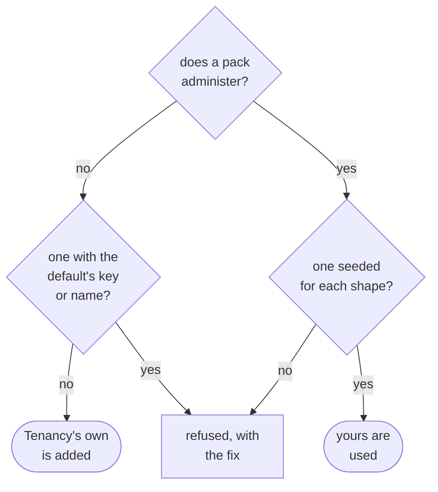

<details>
<summary>Show the code: an application without a catalogue, one with keys of its own and no packs, and one with an administrators' pack for each shape</summary>

```csharp
// No catalogue: the keys are Tenancy's and the modules', and every tenant starts with the default
// administrators' role, given to its first seat
services.AddTenancy<ShopTenancyContext>();

// Keys the application owns itself, and still no pack: the default administrators' role holds them too
public static ApplicationCatalogue Application { get; } = new(Permissions: ShopKeys.All);

// A provisioned tenant names the role by the pack's key
var administrators = provisioned.RolesByPack[TenancyPacks.DefaultAdministratorsKey];

// Administrators of your own, one seeded for each shape of tenant, and a pack that every tenant gets
public static ApplicationCatalogue Application { get; } = new(
    Packs:
    [
        new("owner", "Owner", "Runs the shop", [], SeededFor: TenantShape.Flat, Administers: true),
        new("head-office", "Head office", "Runs every branch", [], SeededFor: TenantShape.Hierarchical, Administers: true),
        new("viewer", "Viewer", "Looks at the orders", [ShopKeys.OrdersView]),   // no SeededFor: every tenant
    ],
    Permissions: ShopKeys.All);
```

</details>

Switching an application that runs already from a pack of its own to the default changes no tenant it has.
Each keeps the role its old pack gave it, with that role's keys, and the seats that hold it keep it. Nothing
copies the default into those tenants until a change of shape, which copies every pack seeded for the new shape
that the tenant has no copy of, the default among them. A tenant that still has a role named like the default,
as an old pack called Administrator gave it, refuses that copy with `tenancy.role-name-taken`, and the change of
shape with it. Rename that role in those tenants first, or keep declaring your own pack.

An administrators' pack that lists no keys holds every key of the catalogue, the modules' included. One that
lists keys holds those and no others, for administrators who run access without holding the keys to the
modules' work. Its list has to hold every one of Tenancy's keys and every key that manages access, itself or
through a key that implies it; `TenancyCatalogue.Build` refuses a pack that leaves one out and names each key,
so marking another key stops the application at start-up until the pack lists it. Either way an administrator
can give every role, and appointing an area manager needs no system work. The list is what the administrators'
role starts with, not a wall around the seat: an administrator still puts any key into a role, and gives
itself a role that manages no access, as every seat that manages grants may.

### Packs after provisioning

A tenant's roles are copies of the packs it was given, and the tenant changes them as it likes. Your packs change
too: a module you add brings keys that an administrators' pack listing none now holds, and you add a key to a pack,
or take one out. A tenant provisioned before that still has the role the old pack made. One call of the host's,
`SyncRolePacks()`, brings those roles up to their packs once the host has started, in every tenant, without
undoing what a tenant changed itself.

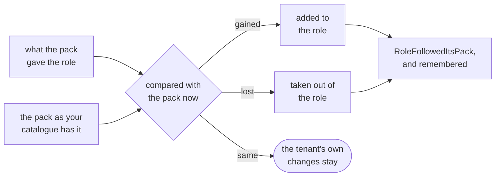

Every role made from a pack remembers what the pack gave it, `KeysFromPack`: as the pack was when the role was
made, and since then as it was when the role last followed it. The sync compares that with the pack as your
catalogue builds it now. A key the pack gained is added to the role, and a key it lost is taken out. A key the
tenant took out of the role stays out while the pack still holds it, and a key the tenant added stays while the
pack never held it: neither is a change of the pack. Say a tenant took closing boards out of its Project lead, and
you later add archiving boards to that pack: at the next start the role gets archiving, and closing stays out. A
tenant whose Administrator came from the default administrators' pack gets the keys of a module you add, and
nobody makes a role for them by hand.

What the comparison cannot tell apart is settled this way:

| Case | What the sync does |
|---|---|
| A key the tenant added by hand, which the pack gains later and loses again | Once the pack holds it, it is the pack's: it goes when the pack loses it, and the event says so |
| A key the tenant took out, which the pack loses and later gains again | It comes back as a key the pack gained: once the pack lost it, the role no longer remembers it. The event names it, among the keys that manage access when it manages access |
| A key that is no longer live, retired or removed from your code | It stays on the role. It grants nothing, and retiring a key changes no role |
| A key that a key the role keeps implies | It stays, or comes with that key, as everywhere a role's keys are set |
| An archived role | Left as it is: it grants nothing, and changes no more |
| A role an import or a seeding made from a pack with keys of its own | It remembers the pack's keys, not its own, so what it holds beyond the pack, or lacks, is the tenant's and stays |
| A role whose pack your catalogue no longer has | It keeps its keys and what it remembers, and follows the pack again if you declare it again under the same key |
| A role made before roles remembered their pack, whose column is empty, or made from a pack your catalogue did not have then | It follows as if the pack had given it nothing yet: it gets every key of the pack it lacks, and loses none |
| A role whose keys are stored in another order | The same keys are no change: they are saved in order, and no event is raised |
| A role whose following would take the administrator key from the tenant's last administrators | Left as it is, and named in the answer. It follows once the tenant has an administrator through another role |

A key that manages access follows the same rule. An administrator alone adds one to a role or takes one out
([who may give a role](#who-may-give-a-role)), but only your code puts a key in a pack, so the sync, which is your
application's work, follows the pack in those keys too. The event names them apart, so whoever tells the tenant
can say that the change gives or takes away power over other people's access.

**Turning it on** is one call, next to the start-up checks and not among them: a check reads and changes nothing,
and this changes the tenants' roles. It runs once per start, in the background, after the start-up checks and
after every hosted service has started, so a seeding of your own is done by then; the host serves meanwhile. It
visits the active and the suspended tenants one after the other, and in each runs `RoleCommands.FollowPacksAsync`
as Tenancy's system work in that tenant, so on Postgres it writes under the policies, in Tenancy's own scope. Each
tenant is one save, which takes the tenant's access revision first, as every change of rights does. So a second run
changes nothing, and two instances of the host that start at once cannot both commit a tenant: the one that loses
reads the tenant again and finds nothing left to change. A tenant whose sync fails is logged, and left for the
next start.

`AddTenancy` registers what the call runs, `IRolePackSync`. A host that would rather sync from a deployment step,
or behind an endpoint of its operators, leaves the call out and runs that itself, and an operator who syncs one
tenant runs the use case in it, recorded as the operator.

<details>
<summary>Show the code: turning the sync on, and running it yourself</summary>

```csharp
// The host
builder.Services.RunStartupChecks();
builder.Services.SyncRolePacks();   // once the host has started, every tenant's roles follow their packs

// A deployment step, or an operator's endpoint for every tenant: the same, run when you say
var report = await services.GetRequiredService<IRolePackSync>().SyncAsync(cancellationToken);
if (!report.Succeeded)
{
    foreach (var (tenant, error) in report.Failed)
    {
        logger.LogError(error, "The roles of tenant {Tenant} did not follow their packs", tenant);
    }
}

// One tenant, for an operator, whom the events then name
using (TenancyWork.BeginOperatorIn<TenantId, SeatId>(tenant, operatorIdentity))
{
    var followed = await roles.FollowPacksAsync(cancellationToken);   // roles: TenancyUseCases.RoleCommands
    // followed.Changed, followed.KeptForAnAdministrator, followed.WithoutTheirPack
}
```

</details>

**Telling the tenant.** Each role that changes raises `RoleFollowedItsPack`: the tenant, the role, the pack, the
keys that came in, `Added`, and went out, `Removed`, those of them that manage access, `ManagingAccess`, and who
made the change, `By`, the system. The package sends no message itself. `AddTenancyEventLog` keeps the event in the
[access history](#access-history), where the tenant's administrators read it, and that is all the sample does. To
mail them, publish the event as a contract of your own and handle that where your application sends mail.

<details>
<summary>Show the code: mailing a tenant's administrators when a role followed its pack</summary>

```csharp
// The contract, in the module that publishes it
[IntegrationEvent]
public sealed record RoleFollowedItsPackV1(long TenantId, Guid RoleId, string Pack, string[] Added, string[] Removed, string[] ManagingAccess);

// Tenancy's outbox: mapped before AddTenancyDomainEvents, which keeps every event it has no mapping for off the sinks
options.UseOutbox<ShopTenancyContext>(outbox => outbox
    .PublishAs<RoleFollowedItsPack<TenantId, RoleId, SeatId>, RoleFollowedItsPackV1>(followed => new RoleFollowedItsPackV1(
        followed.TenantId.Value, followed.RoleId.Value, followed.Pack, [.. followed.Added], [.. followed.Removed], [.. followed.ManagingAccess]))
    .AddTenancyDomainEvents()
    .KeepEventLog(log => log.AddTenancyEventLog()));

// Where your application sends mail: who administers the tenant, and where to write to them, is yours to know
public sealed class TellTheAdministrators(IShopAdministrators administrators, IMailer mailer)
    : IIntegrationEventHandler<RoleFollowedItsPackV1>
{
    public async Task HandleAsync(RoleFollowedItsPackV1 followed, IntegrationEventMessage message, CancellationToken cancellationToken)
    {
        // A role may only gain keys, or only lose them: a line is written for what happened, and none for what did not
        string?[] lines =
        [
            $"The role made from the pack {followed.Pack} changed with the application.",
            followed.Added.Length > 0 ? $"It gained {string.Join(", ", followed.Added)}." : null,
            followed.Removed.Length > 0 ? $"It lost {string.Join(", ", followed.Removed)}." : null,
            followed.ManagingAccess.Length > 0 ? $"It changes who may manage access: {string.Join(", ", followed.ManagingAccess)}." : null,
        ];
        var body = string.Join(Environment.NewLine, lines.OfType<string>());

        foreach (var address in await administrators.AddressesAsync(followed.TenantId, cancellationToken))
        {
            await mailer.SendAsync(address, "A role changed with the application", body, cancellationToken);
        }
    }
}
```

The handler is delivered at least once, so it remembers the message it mailed for, by `message.MessageId`, when a
second mail would matter. [Integration events](integration-events.md) has the handler's registration, and where it
says what it runs as.

</details>

The roles' table has one column more, `KeysFromPack`, on every database, which a migration of yours adds like any
change of the model: nullable, so the rows stored before it have none, and follow as the table above says. On
Postgres the export writes two triggers and a stricter policy for it as well. A seat that changes a role does not
change the column: a trigger refuses that, as a policy refuses, and another keeps the pack a role was made from. A
role a seat adds names no pack, or is an exact copy of one, remembering exactly the pack's keys
([What the policies check](#what-the-policies-check)).

## Adopting it, step by step

Tenancy becomes a module of your application, like any other. In the order you would do it:

1. **Add the packages**, at the version of every other `Temp.DDDToolkit.*` package; they are prereleases for
   now, so with `--prerelease`. The model goes in the project that declares your classes, the domain project,
   and in the projects that ask its questions; the Entity Framework package in the project with the context,
   the infrastructure project; and on Postgres the Postgres package beside it, which the host and the project
   that exports the migrations then see through their references. The sample's projects reference them so.

   ```bash
   dotnet add Shop.Tenants.Domain package Temp.DDDToolkit.Supporting.Tenancy --prerelease
   dotnet add Shop.Tenants.Infrastructure package Temp.DDDToolkit.Supporting.Tenancy.EntityFramework --prerelease
   dotnet add Shop.Tenants.Infrastructure package Temp.DDDToolkit.Supporting.Tenancy.Postgres --prerelease   # on Postgres
   ```

   A contracts project that says `[assembly: GenerateTenancyIds]` takes the first package as well
   ([In a module split by layer](#the-shortest-start-the-switch)).
2. **Get your classes and ids.** The shortest start is one line, `[assembly: GenerateTenancyClasses]`: the
   generator writes each of the package's classes you leave out, as the package ships it, and its id
   ([The shortest start: the switch](#the-shortest-start-the-switch)). Declare a class yourself where you need
   fields and rules ([How your classes add behaviour](#how-your-classes-add-behaviour)); yours always wins.
3. **Map and register it.** `modelBuilder.AddTenancy(database: Database)` in a plain context of your module,
   a migration of your own, and `services.AddTenancy<TContext>()`, with your catalogue when you have one
   ([Your tenancy module](#your-tenancy-module)); each id makes its own new ones
   ([How a new id is made](#how-a-new-id-is-made)).
4. **Write your catalogue, when you need one.** Each module states its own keys once, on a list it marks with
   `[TenancyPermissions]`, and the host adds every module's with one generated call
   ([A module states its keys once](#a-module-states-its-keys-once)). Your part adds the role
   packs a tenant starts with, keys no module owns, and a mark on every key that manages access
   ([What the catalogue is for](#what-the-catalogue-is-for)). Declare no administrators' pack, and every tenant
   starts with Tenancy's own ([The administrators' pack](#the-administrators-pack)); need none of the rest, and
   leave the catalogue out. `SyncRolePacks()` in the host brings a pack you change later to the roles tenants
   already made from it ([Packs after provisioning](#packs-after-provisioning)).
5. **Say who is calling, per request.** After authentication, `TenantSelection` finds the seat the token's
   identity has in the tenant the request names, and that seat is the caller for the rest of the request
   ([How the tenant reaches a policy](#how-the-tenant-reaches-a-policy) has the middleware).
6. **Provision a tenant.** `TenantCommands.ProvisionAsync` makes the tenant, its root unit, its roles from
   the packs and its first seat, as [system work](#system-work). [Calling a use case](#calling-a-use-case)
   shows the call, and the class named after your module that every use case is named through, which the
   generator writes for you. A request that asks for a tenant says who may send it, and its handler begins the
   system work itself ([Who may ask, and what the work runs as](#who-may-ask-and-what-the-work-runs-as)).
7. **Keep your own tables to a tenant.** `ScopeToTenant` on an entity; `UseDDDToolkit` on its context gives it
   Tenancy's save check, which `AddTenancy` brought
   ([Keeping tenants apart](#keeping-tenants-apart-the-filter-and-the-save-check)).
8. **Ask in your modules.** A module maps the read model and asks where the caller holds a key, inside its
   own query ([Who may do what](#who-may-do-what)). A request says what it requires of its caller, and a
   check holds the caller to it before the handler runs
   ([What a request requires of its caller](#what-a-request-requires-of-its-caller)). A module answers ids,
   and a screen asks the directory what they are called ([Names](#names)).
9. **Let people manage access.** The package's use cases place seats, give roles and change roles, each
   held to [who may give a role](#who-may-give-a-role). Put requests of your own in front of them, each
   declaring what its use case asks first, and routes in front of those.
10. **Add what you need of the rest**: [invitations](#invitations), role names in a tenant's
    [language](#languages), [operators](#operators), [who changed a row](#who-changed-a-row) and the
    [access history](#access-history).
11. **On Postgres, add the second lock**: row level security under all of it
    ([Setting it up](#setting-it-up)).

The [sample](#who-may-do-what-in-the-sample) is a small application built this way.

## Your tenancy module

Tenancy's aggregates are classes of your own, each declared with one of the package's templates over an id of
your own: the tenant, its organization with its units, the seats and the roles. Most applications add something
to one or two of them and nothing to the rest, and the rest need not be written at all.

### The shortest start: the switch

One line in the project your classes belong to:

```csharp
[assembly: GenerateTenancyClasses]
```

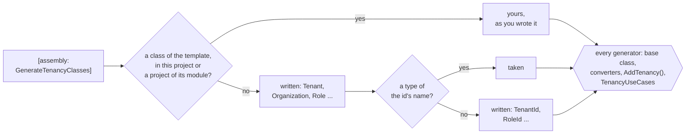

The switch has the generator write each of Tenancy's classes the project leaves out, as the package ships it:
a `Tenant`, an `Organization`, an `OrganizationUnit`, a `Role` and a `Seat`, each declared with its template, and
a `TenantId`, an `OrganizationUnitId`, a `RoleId` and a `SeatId`, each an `[EntityId<Guid>]` without a prefix,
published with `[ModuleContract]`. An organization shares its tenant's id, so there is no `OrganizationId`. They
are public, in the project's root namespace, so every folder of it sees them without a using, and each says in
its documentation that the switch wrote it and how to declare it yourself. The invitation is not written: it is
the one class you may leave out, and declaring it is what turns [invitations](#invitations) on. A written class
is the package's whole: the role remembers what its pack gave it, `KeysFromPack`, which your migration maps like
every column, and follows the pack when the host syncs ([Packs after provisioning](#packs-after-provisioning)).

Nothing is generated without the switch, and nothing you declare is replaced. A class of a template that the
project declares, or a project of its module that it references, is yours, and the switch writes the others
around it. An id is taken where a type of its name is found, in the project or in a project of its module, and
written where none is. A written class that shares its id with a class you declared, as an organization shares
its tenant's, takes that class's id: an organization written beside your `ShopTenant` over `ShopTenantId` is
declared over `ShopTenantId`.

A name the switch cannot use is said once, where the switch is, [DDD00066](diagnostics.md#ddd00066), and the
class is not written: a type of the class's name already in the root namespace, yours or a referenced project's;
a namespace of that name, a folder `Organization/` directly under the project, say; an id of the class's name the
generator writes for an `[AggregateRoot<Guid>]` class of yours; or two ids of one name to choose from. A class that
needs the one kept out, as a seat needs its role, is kept out with it, no id is written for either, and
`AddTenancy()` and the class the use cases are named through stand back rather than say again that the class is
missing. A class of yours that is in the way and is meant to be the package's class becomes it with the template:
`[RoleAggregate<RoleId>] public sealed partial class Role`.

A written class and id get everything the toolkit's generators write for one you declare, though no generator
sees another's output: each provider those generators read hands the written classes and ids on beside the
declared ones, so the base class, the converters of the ids, `modelBuilder.AddTenancy()` and the class the use
cases are named through ([Calling a use case](#calling-a-use-case)) are written for them, in a project of one and in
a module split by layer alike. So is what another package writes for a template that names a written id: a
[Membership](membership.md) member class whose members are seats, `[Member<CrewMemberId, SeatId, RoleId, Project>]`,
gets its member list and its registrations over the written `SeatId`. The compiled project carries the same
attributes a hand-written one would, so the projects above it see the written classes as they see yours.

Two things see them only from the next project up:

- **Other generators of the project with the switch do not see what it wrote.** HotChocolate's, for one: an
  `[ObjectType<Role>]` over a written `Role` does not compile in that project. Nor does a toolkit generator that
  reads a written class by its symbol, a row access rule that names it, say. A module split by layer has those in
  the projects above, where all is well. A module of one project that needs one declares that class or id itself,
  one line, and it wins. A written id as the key of a
  [resource access contract](row-level-security.md#a-resources-access-asked-by-its-id) needs neither: the
  contract beside `[assembly: GenerateTenancyIds]`, and a rule of the same project that asks it, are written over
  the id the switch writes.
- **Code outside the root namespace** names the written types through `global using Shop.Tenants;`, the root
  namespace, rather than a using at the top of a file: the parts the generators write for your classes, a
  collection of `SeatId`s say, are files of their own, which a file's using does not reach. Code inside the root
  namespace, in any folder of it, needs neither.

**In a module split by layer** the ids belong in the contracts project, which the other modules reference, and
the classes in the domain project. Say `[assembly: GenerateTenancyIds]` in the contracts project and
`[assembly: GenerateTenancyClasses]` in the domain project, which then takes the contracts' ids. The first needs
the contracts project to reference the Tenancy package; a contracts project that should not, as the sample's,
declares the four ids itself, one line each, and the domain project's switch takes those.

<details>
<summary>Show the code: what the switch writes for a class and for an id</summary>

```csharp title="Role.TemplateDefault.g.cs, the comment shortened"
namespace Shop.Tenants;

/// <summary>
/// The application's <c>Role</c>, declared <c>[RoleAggregate&lt;RoleId&gt;]</c> and nothing more: the package's class as it
/// ships. Written by the generator, because this project says <c>[assembly: GenerateTenancyClasses]</c> and
/// neither it nor a project it references declares a class with <c>[RoleAggregate]</c>.
/// </summary>
[global::DDDToolkit.Supporting.Tenancy.RoleAggregateAttribute<global::Shop.Tenants.RoleId>]
public sealed partial class Role
{
}
```

```csharp title="RoleId.TemplateDefault.g.cs, the comment shortened"
namespace Shop.Tenants;

/// <summary>
/// The id of the class declared with <c>[RoleAggregate]</c>: written by the generator, because this
/// project says <c>[assembly: GenerateTenancyClasses]</c> and neither it nor a project it references declares <c>RoleId</c>.
/// </summary>
[global::DDDToolkit.Abstractions.Attributes.ModuleContract]
[global::DDDToolkit.Abstractions.Attributes.EntityId<global::System.Guid>]
public readonly partial record struct RoleId;
```

The base class, the constructor, the rules and the id's members come from the generators that write them for a
declared class and id, in files of their own.

</details>

### Your own classes

When a class needs fields, rules or behaviour of its own, declare it, and the switch writes the rest:

```csharp
// Shop.Tenants: the switch for the classes that add nothing, your own seat for its job title
[assembly: GenerateTenancyClasses]

[SeatAggregate<SeatId>]
public sealed partial class Seat
{
    public string? JobTitle { get; private set; }
}
```

The seat is declared over the `SeatId` the switch writes. Without the switch, you declare all of them, and the
ids, which your contracts project then holds with the key type and prefix you choose. An id over anything but a
`Guid` says how a new one is made ([How a new id is made](#how-a-new-id-is-made)):

```csharp
// Shop.Tenants.Contracts
[EntityId<long>]
public readonly partial record struct TenantId
{
    public static TenantId Create() => new(Snowflakes.Next());   // yours: a snowflake, or a number of a HiLo block
}

[EntityId<Guid>] public readonly partial record struct SeatId;
[EntityId<Guid>] public readonly partial record struct OrganizationUnitId;
[EntityId<Guid>] public readonly partial record struct RoleId;

// Shop.Tenants
[TenantAggregate<TenantId>]
public sealed partial class ShopTenant
{
    public bool IsDemo { get; private set; }
}

[SeatAggregate<SeatId>]
public sealed partial class ShopSeat
{
    public string? JobTitle { get; private set; }
}

[OrganizationUnit<OrganizationUnitId>]
public sealed partial class ShopUnit
{
    public CostCentre? CostCentre { get; private set; }
}

[OrganizationAggregate<TenantId>] public sealed partial class ShopOrganization;
[RoleAggregate<RoleId>] public sealed partial class ShopRole;
```

The package's rules run for your classes before your own, and your classes are what Entity Framework
maps, written or declared. [Writing your own supporting domain](writing-a-supporting-domain.md) explains how
that works.

### How a new id is made

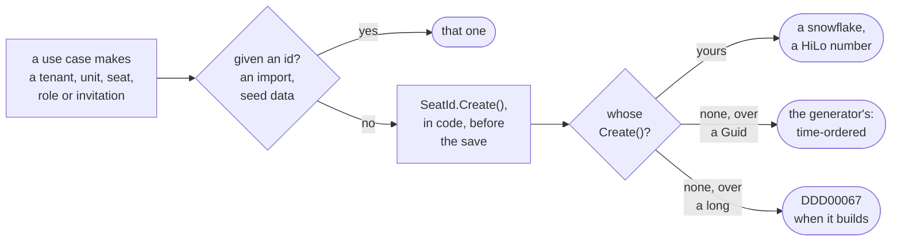

Tenancy makes the id of every tenant, unit, seat, role and invitation it creates in code, before anything is saved,
so the change and every event of it know the id from the start; the database never makes one. It asks the id
itself, `SeatId.Create()`, and a use case given an id, for an import or seed data, uses that one instead.

The generator writes `Create()` for every `[EntityId<Guid>]`, the switch's ids included: a time-ordered id, what
`CreateSequential()` makes, which a database index keeps in order. An id over a `long`, an `int` or a `string` has
none, because there is no telling how a new one is made, so it declares its own: for a `long` a snowflake or a
number of a block a HiLo sequence hands out, and for an `int`, which a 64-bit snowflake does not fit, the HiLo
number. A `Create()` of your own wins for a `Guid` too. An id you write by hand, without `[EntityId<T>]`, has nothing the generator adds, so it declares
`Create()` and implements `ICreatableEntityId<TenantId>` itself. A class declared over an id without one is
[DDD00067](diagnostics.md#ddd00067) when the project builds, on the class, and its code fix adds to the id what it
lacks, a `Create()` that throws until you write its body. So there is nothing to set in the registration, and
nothing for the database to generate: Entity Framework stores an id as a value the application gives
([Ids the database never makes](entity-framework.md#ids-the-database-never-makes)).

<details>
<summary>Show the code: an id that says how a new one is made, and what Tenancy calls</summary>

```csharp
// Shop.Tenants.Contracts: a tenant id over a long, from a sequence that hands out blocks of a thousand
[EntityId<long>]
public readonly partial record struct TenantId
{
    public static TenantId Create() => new(TenantNumbers.Next());
}

// Every id the generator writes over a Guid, the four the switch writes among them
public static SeatId Create() => CreateSequential();

// In Tenancy's use cases, generic over your ids, where TSeatId : ICreatableEntityId<TSeatId>
var seatId = command.AdminSeatId ?? TSeatId.Create();
```

</details>

### The context and the registration

The context is a plain `DbContext` in your module, with your conventions. `AddTenancy()` is generated for
your classes, the way `AddDomainEventOutbox` adds the outbox:

```csharp
public sealed class ShopTenancyContext(DbContextOptions<ShopTenancyContext> options) : DbContext(options)
{
    protected override void OnModelCreating(ModelBuilder modelBuilder)
    {
        modelBuilder.HasDefaultSchema("tenancy");
        modelBuilder.AddTenancy(database: Database);
        modelBuilder.AddDomainEventOutbox(Database, schema: "tenancy");
    }

    protected override void ConfigureConventions(ModelConfigurationBuilder configurationBuilder)
    {
        configurationBuilder.AddDDDToolkitConventions();
        configurationBuilder.AddTenantsConverters();   // generated: both projects are of the module Tenants
    }
}
```

The migrations are yours too, made from your model in the project where the context lives. The package
has none, because it cannot know your database. Their history is in the context's schema, `tenancy` here, where
`UseDDDToolkit` keeps it; the context's design-time factory, which `dotnet ef` makes it with, keeps it there too
with `UseDDDToolkitDesignTime()` after its provider
([The migration history](entity-framework.md#the-migration-history)). On Supabase you write no factory: mark the
context `[SupabaseMigrations]`, as any module's, and the build writes it beside the context
([Exporting as part of the build](supabase.md#exporting-as-part-of-the-build)).

Given the context's `Database`, `AddTenancy` keeps two of the aggregates' rules in the database as well:
a tenant's organization has a single root, and a seat a single primary placement. Each is a unique index
with a filter, written in your provider's SQL for Postgres, SQLite and SQL Server; another provider gets
neither, and so does a context that leaves `database` out. They refuse a write that goes past the
aggregates, such as SQL of your own. Added to an existing model, they are a migration like any other
change. On Postgres with [the second lock](#on-postgres-the-second-lock) the index on a tenant's root is
required: the start-up checks refuse a database without it
([The index on a tenant's root](#the-index-on-a-tenants-root)).

The tables are called `Tenants`, `Seats`, `SeatRoleGrants` and so on, and those two indexes after their
tables, unless you pass `AddTenancy` a `TenancyTableNames` of your own. Their columns, keys and other
indexes are named as your context names everything else. [Your own naming](#your-own-naming) keeps a
database in snake_case.

Registering Tenancy is generated the same way: `services.AddTenancy<ShopTenancyContext>(...)` is closed over
your classes and ids, and leaves you the context to name. Both generated calls are internal to the project
that declares your classes, or to a project of the same module that declares none of them, declared with
`DDD_Module`, which its folder can set for all of them ([A module named by its folder](modules.md#a-module-named-by-its-folder)),
or with `[assembly: Module]`, such as the module's infrastructure project next to its domain project
([In a module split by layer](writing-a-supporting-domain.md#in-a-module-split-by-layer)), so register
Tenancy from there:

```csharp
public static IServiceCollection AddShopTenancy(this IServiceCollection services, string connectionString)
    => services
        .AddTenancy<ShopTenancyContext>(options =>
            options.Catalogue = ShopCatalogue.Application)   // when you have one: packs, keys of your own, marks
        .AddDbContext<ShopTenancyContext>((serviceProvider, options) => options
            .UseNpgsql(connectionString)
            .UseDDDToolkit(serviceProvider));
```

`AddTenancy` brings Tenancy's save check to every context `UseDDDToolkit` wires, after the toolkit's own
interceptors: this one, and every context that keeps its own entities to a tenant, with nothing more to write.
[Keeping tenants apart](#keeping-tenants-apart-the-filter-and-the-save-check) says why it goes there, and what
checks it.
[A registration closed over your classes](writing-a-supporting-domain.md#a-registration-closed-over-your-classes)
explains how the calls without your classes come about.

### What the catalogue is for

Tenancy asks the application only what it needs to decide something, and its catalogue is what it decides
access with: which keys exist, which of them manage access and whether those stay contained, and which roles a
new tenant starts with. Tenancy
brings its own keys, and every module states its keys next to the code that asks for them, once
([A module states its keys once](#a-module-states-its-keys-once)). What is left for your
`ApplicationCatalogue` is what neither can say:

| Part | What it decides | Without it |
|---|---|---|
| `Packs` | The roles a new tenant starts with, which shape of tenant gets each (`SeededFor`), and what its first administrator holds | Every tenant starts with Tenancy's administrators' role alone ([The administrators' pack](#the-administrators-pack)) |
| `Permissions` | Keys that belong to no module | Only Tenancy's keys and the modules' contributions |
| `AccessManagingKeys` | A key a module declares that should manage access in your application | A key manages access only where it is declared so ([Which keys manage access](#who-may-give-a-role)) |
| `ContainAccessManagingKeys` | Whether a seat hands on a key that manages access only where it holds it itself | On: containment holds ([Containment, on or off](#containment-on-or-off)) |

Every part is optional, and so is the catalogue: leave `options.Catalogue` unset and Tenancy builds it from
`new ApplicationCatalogue()`, its own keys and the modules'. The export on Postgres, which builds the
catalogue without the registration, does the same: it writes the policies from the part you mark
`[TenancyCatalogue]`, and from `new ApplicationCatalogue()` where you mark none
([Setting it up](#setting-it-up)). Nothing else is asked for: what kind of unit a unit is decides nothing, so
it is [yours to keep](#the-kind-of-a-unit), on your own unit class.

### A module states its keys once

A module's keys are needed by two programs that cannot ask each other: the host, which builds its catalogue
from its services, and the program that exports the database's policies, which builds the same catalogue
without any. Both compose the modules, so both see every module's assembly, and read the keys there: the host
through Tenancy's generator, which comes with the package, and the export through the Supabase package's, which
finds the same marked lists for Tenancy's contribution ([Setting it up](#setting-it-up)).

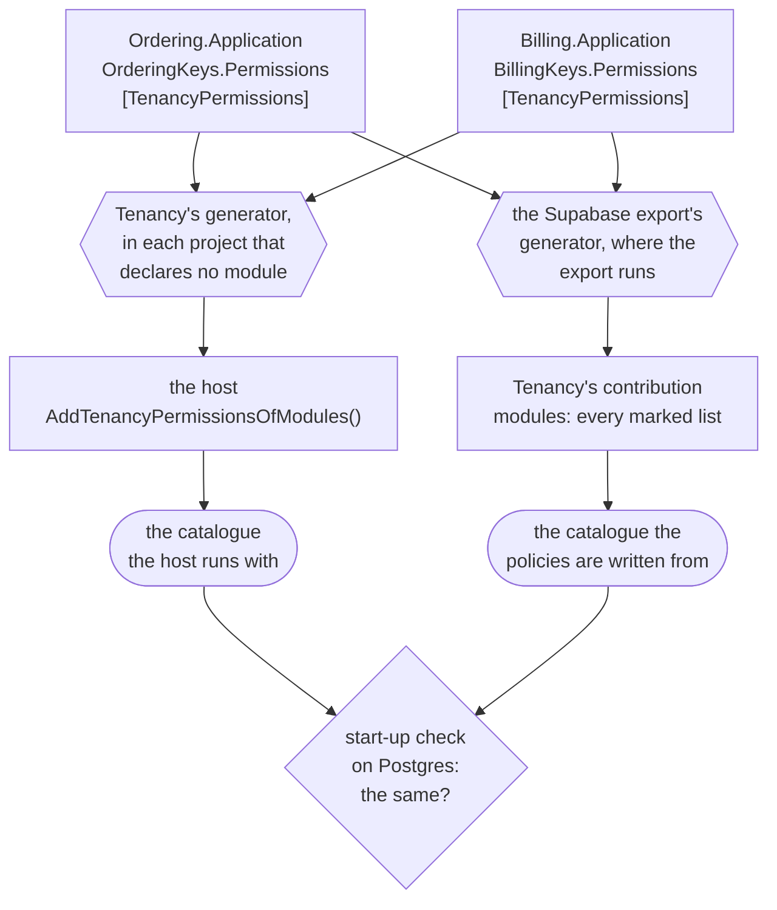

<details>
<summary>Show the code: a module's keys, the host's one call, and what the generators write</summary>

```csharp
// Ordering.Application: the keys, stated once
public static class OrderingKeys
{
    [TenancyPermissions]
    public static IReadOnlyList<Permission> Permissions { get; } =
    [
        new("orders.view", "Ordering", "See the orders"),
        new("orders.refund", "Ordering", "Refund an order", ManagesAccess: true),
    ];
}

// The host's Program.cs: the host references every module, and the class is in the namespace of its assembly
using Shop.Host;

builder.Services.AddTenancyPermissionsOfModules();

// What Tenancy's generator writes into each of those projects, in the namespace of its assembly
internal static class TenancyPermissionsOfModules
{
    public static IReadOnlyList<Permission> All { get; } = Join(
        global::Shop.Billing.BillingKeys.Permissions,
        global::Shop.Ordering.OrderingKeys.Permissions);

    public static IServiceCollection AddTenancyPermissionsOfModules(this IServiceCollection services)
        => TenancyServiceCollectionExtensions.AddTenancyPermissions(services, All);
}

// What the Supabase package's generator writes into the project that runs the export, in
// DDDToolkit.RowAccessContributionsOfPackages.g.cs: Tenancy's contribution, made from the same lists
private readonly IRowAccessContribution _contribution = new global::DDDToolkit.Supporting.Tenancy.Postgres.TenancyRowAccessContribution(
    modules: new IEnumerable<Permission>[]
    {
        global::Shop.Billing.BillingKeys.Permissions,
        global::Shop.Ordering.OrderingKeys.Permissions,
    },
    application: global::Shop.ShopCatalogue.Application);
```

</details>

A module states its keys on the static list where it declares them, and marks that list with
`[TenancyPermissions]`. That is the only place: its registration adds nothing, and no other project lists them.
In every application that references Tenancy, the program the modules are composed in, and in every library
that references it and declares no module, the generator writes `TenancyPermissionsOfModules`, an internal class
with the project's own marked lists and those of every project it references. Its namespace is named after the
project's assembly, `Shop.Host` for `Shop.Host.dll`, whatever the project's `RootNamespace` says:

- **`TenancyPermissionsOfModules.All`**: every module's keys, one list after the other, in the order of the
  lists' names. A program of your own that builds the catalogue without the host's services builds it with
  `TenancyCatalogue.Build(application, TenancyPermissionsOfModules.All)`, or
  `TenancyCatalogue.Build(TenancyPermissionsOfModules.All)` without a part of your own. The Supabase export
  needs neither: it hands Tenancy's contribution the same lists, found where they are marked.
- **`services.AddTenancyPermissionsOfModules()`**: adds `All` to the catalogue, as one contribution. The host
  calls it once. A top-level `Program.cs` is in no namespace, so it needs `using Shop.Host;` for the call.

Neither call names a module, so a module that is added, or a key a module adds, reaches both programs with the
next build, and nothing in the host changes. While no module marks a list, before the first one does or after
the last one is taken out, `All` is empty, and both calls compile all the same.

Declaring a module means `DDD_Module`, set in the project file or for a folder of projects
([A module named by its folder](modules.md#a-module-named-by-its-folder)), or `[assembly: Module]`. A module's
own libraries get no class: a module states its own keys and composes no other module's. A module project that
is not declared one yet gets one as well, and leaves it alone: the host's call is the one that counts. An
application gets the class whether it declares a module or not, because nothing composes the modules from it:
an application in one project that sets `DDD_Module` to name its code, as
[Getting started](getting-started.md) does, is a module and the host at once, and registers its own keys with the
same call. A library that the host and an export share, to compose the modules in one place, sets no `DDD_Module`,
or it is a module and gets no class.

The list is a static property or field, readable, declared in a class that is not generic (nor nested in one),
whose type is a sequence of `Permission`: `IReadOnlyList<Permission>`, `IEnumerable<Permission>` or an array.
In a library it is public as well, in public types, because the project that composes the modules reads it from
outside, whether the library declares a module or not. A list that cannot be read that way is the error
[DDD00063](diagnostics.md#ddd00063) where it is declared, because the module's keys would otherwise be missing
from the catalogue with nothing to say so. Only an application, the program itself, may keep a list of its own
internal: it collects that list itself, and no other project composes the modules from it.

`AddTenancyPermissions` stays, for keys you add by hand. A module that marks its list does not call it as well:
the same list added twice stops the catalogue at start-up, with one problem that names its keys and says which
call to take out.

A host that leaves `AddTenancyPermissionsOfModules()` out runs without any module's keys. A pack that names one
of them stops the catalogue at start-up; with no such pack, as with Tenancy's default administrators' pack, the
first question about one of them throws. Both messages say how a module's keys reach the catalogue: the list
marked `[TenancyPermissions]`, and the host's call.

The two programs build the same catalogue as long as they reference the same modules, and add no keys by hand
that the other does not. The export can be the host itself, and then there is one list. Where it is a program
of its own, as in the sample, it references the modules the host does, and the start-up check on Postgres
stays the guard: it compares the functions the export wrote with the catalogue the host runs with, and refuses
a host whose policies were written from another catalogue ([Setting it up](#setting-it-up)).

### Calling a use case

Tenancy's use cases, and the records they take and answer, are nested in one generic class,
`TenancyUseCases<TTenant, TTenantId, TOrganization, TUnit, TUnitId, TSeat, TSeatId, TRole, TRoleId>`, so
your classes and ids are named once for all of them. You do not name them yourself. The toolkit's generator
closes the class over your classes in the project that declares them, as a class of the same name without the
type parameters: `TenancyUseCases`, whatever your module is called. Every project that references that project,
the module's application, infrastructure and API projects, the host and your tests, names everything through it,
and none of them writes the nine types.

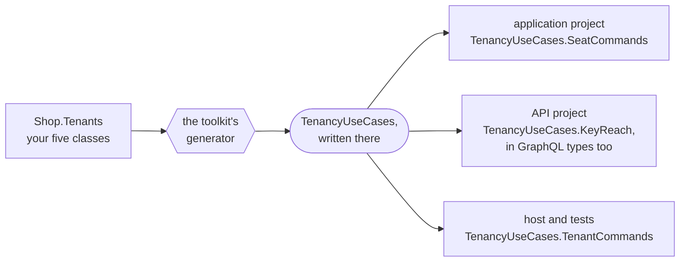

<details>
<summary>Show the code: what the generator writes into the project that declares the classes</summary>

```csharp title="TenancyUseCases.TemplateFacade.g.cs, shortened"
/// <summary>
/// TenancyUseCases, closed over the classes of the module Tenants: ShopTenant, TenantId, ShopOrganization,
/// ShopUnit, OrganizationUnitId, ShopSeat, SeatId, ShopRole and RoleId.
/// Named as the package's class is; [assembly: TemplateFacadeName("TenancyUseCases", "...")] in this project names it otherwise.
/// </summary>
public abstract class TenancyUseCases : global::DDDToolkit.Supporting.Tenancy.UseCases.TenancyUseCases<
    global::Shop.Tenants.ShopTenant, global::Shop.Tenants.Contracts.TenantId, global::Shop.Tenants.ShopOrganization,
    global::Shop.Tenants.ShopUnit, global::Shop.Tenants.Contracts.OrganizationUnitId, global::Shop.Tenants.ShopSeat,
    global::Shop.Tenants.Contracts.SeatId, global::Shop.Tenants.ShopRole, global::Shop.Tenants.Contracts.RoleId>
{
    private TenancyUseCases()
    {
    }
}
```

</details>

`TenancyUseCases.TenantCommands`, `TenancyUseCases.OrganizationCommands`, `TenancyUseCases.SeatCommands`,
`TenancyUseCases.RoleCommands` and `TenancyUseCases.TenancyDirectory` are services, registered by `AddTenancy`
and taken in a constructor, and `TenancyUseCases.TenantToProvision` or `TenancyUseCases.SeatOverview` is a record
to name. The first call most applications write provisions a tenant:

```csharp
public sealed class FirstTenant(TenancyUseCases.TenantCommands tenants)
{
    public async Task SetUpAsync(Guid identity, CancellationToken cancellationToken)
    {
        // Nobody holds a seat yet, so this is system work, begun on purpose: closed over your ids as well.
        using (TenancyUseCases.BeginSystem())
        {
            await tenants.ProvisionAsync(
                new TenancyUseCases.TenantToProvision(
                    "harbor", "Harbor Works", TenantShape.Hierarchical, "Harbor Works", identity),
                cancellationToken);
        }
    }
}
```

`TenancyUseCases` is a class in the global namespace that derives from the package's class, closed over your
classes, and does nothing else: nothing makes one. C# finds a type nested in a class through every class
derived from it, so `TenancyUseCases.SeatCommands` is the package's own `SeatCommands`, closed over your
classes: the type `AddTenancy` registered, which the container hands out and whose documentation your editor
shows. The invitation use cases take your invitation class and its id as well:
`TenancyUseCases.InvitationCommands<ShopInvitation, InvitationId>` ([Invitations](#invitations)).

- **Why a class, and not an alias.** A global `using` alias holds in the project that declares it and no
  further, so every project would declare its own. A class is written once and reaches every project that
  references it, and the generators there read it as any type: HotChocolate's, reading
  `[ObjectType<TenancyUseCases.KeyReach>]` in an API project, sees the package's record. A generator's alias
  would be the compiler's to see and not theirs.
- **Named as the package's class is.** The name is the one this page and the package's documentation use,
  whatever your module is called, so a module called Tenancy reads as well as one called Tenants. It does not
  clash with the package's generic class, even in a file that imports `DDDToolkit.Supporting.Tenancy.UseCases`: C#
  tells the two apart by their type parameters.
- **Or you name it, in one line.** The project that declares the classes gives it a name of your own, beside
  `[assembly: Module]` or Tenancy's switch, and every project above uses that name:
  `[assembly: TemplateFacadeName("TenancyUseCases", "ShopTenancy")]`, from `DDDToolkit.Abstractions.Attributes`
  as `[assembly: Module]` is. (A template facade is the toolkit's word for this class: the one a package asks, with
  `[assembly: TemplateFacade]`, to have written over your classes.) You need it when two of your modules
  declare Tenancy's classes ([below](#two-modules-with-the-classes)); otherwise only when you prefer another name.
  Any name a class can have will do, as long as no namespace or type of yours in the global namespace has it:
  `Shop`, for a module whose namespaces start with `Shop.`, is the namespace's. A line that changes nothing, in a
  project that declares none of the classes, naming a class no package asks for or giving a name a namespace has,
  is a warning at the line, [DDD00076](diagnostics.md#ddd00076).
- **Only the project that declares the classes gets it.** Classes split over two projects of one module get it
  in the project where they are complete, and the projects above see that one. A name of your own goes beside
  the module in either of them: the project that writes the class reads it in the projects of its module it
  takes classes from.
- **What leaves it out is said where the classes are.** A template with no class or several, or a class that does
  not meet what the use cases ask of it: the projects above would only hear that the name does not exist, CS0246,
  so the project that declares the classes says why, [DDD00065](diagnostics.md#ddd00065), as information on the
  first of them. Where one of your classes or `AddTenancy` in that project already reports it as an error, that
  error is what you see.
- **What you wrote stays.** A project that has a type or a namespace of that name in the global namespace, or
  an alias of that name at the top of one of its files, gets no class. A name you give yourself is told instead,
  DDD00076, when a type or a namespace has it, since the line would only take the class away; your own alias of
  it still stands. A project above it that keeps an alias of that very name is told by the compiler, CS0576: take
  the alias out. One of another name still works next to the class, and names the same types. A type of that name the project declares in a namespace of its own
  keeps the class out too, with DDD00065 on that type: in the global namespace the class would win over it in
  every file that imports its namespace, since C# looks there before it looks at a file's usings. A project above
  is not looked at: there a type of that name imported with a using is hidden by the class, so qualify it, or
  name the class otherwise.
- **In the project that declares the classes, other generators do not see it.** It is one generator's output,
  and the others of that project read the code as written: Mediator's writes the name as it is spelled, which
  compiles, but HotChocolate's does not know the type, in its attributes and in a resolver's parameters and
  return type, and writes `typeof(TenancyUseCases.RoleSummary?)` for a lookup that may answer nothing, which does
  not compile. A module split by layer has its GraphQL types in its API project, above, where all is well. A
  module of one project with GraphQL types over Tenancy's records keeps one alias of exactly that name there,
  `global using TenancyUseCases = DDDToolkit.Supporting.Tenancy.UseCases.TenancyUseCases<...>;`, which every
  generator of the project reads. The generator stands back for it, and nothing else changes.

#### Two modules with the classes

Most applications have one module with Tenancy's classes. One with two, a module for customers' tenants and one
for partners', gets a `TenancyUseCases` in each module's domain project. While neither module references the
other, each module's own projects see only their own, so nothing is wrong there. The two meet in every project that
references both, the host and your tests, where the first line that names `TenancyUseCases` would be the compiler's
CS0433. So such a project is told before that, [DDD00075](diagnostics.md#ddd00075), with the line that gives one
of them a name of its own written out, and the project it goes in.

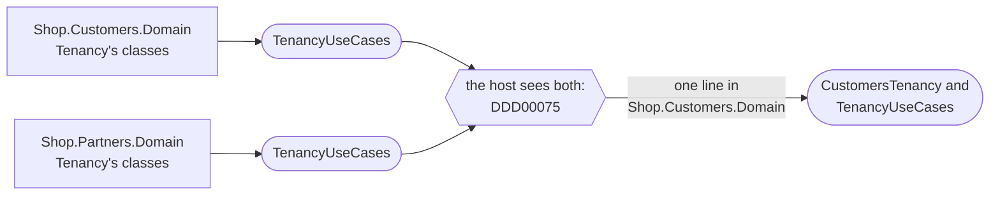

The line goes where the module declares its classes, and the module's projects above it, the host and the tests
name its use cases by the new name; the other module keeps `TenancyUseCases`. A module whose domain project
references the other's still gets its own class, and is told on its own first Tenancy class as well: in that
project the compiler binds the name to its own class and says so, CS0436, and every project above it sees both,
is told at its project file and cannot name either, CS0433. Nothing names the other module's classes without a
word.

<details>
<summary>Show the code: the one line, and the host naming each</summary>

```csharp title="Shop.Customers.Domain/Module.cs"
using DDDToolkit.Abstractions.Attributes;
using DDDToolkit.Supporting.Tenancy;

[assembly: Module("Customers")]
[assembly: GenerateTenancyClasses]
[assembly: TemplateFacadeName("TenancyUseCases", "CustomersTenancy")]
```

```csharp title="Shop.Host/Provisioning.cs"
public sealed class Provisioning(CustomersTenancy.TenantCommands customers, TenancyUseCases.TenantCommands partners)
{
    // Customers' tenants through the name given, partners' through the package's.
}
```

</details>

The rest of this page writes `TenancyUseCases.`, as the sample does.

### Your ids, named once

You name your classes and ids once, where you declare them. What you call of Tenancy's generic over your ids
comes closed over them as well, each kind as far as it can reach: system work and the current caller wherever your
classes are seen, the registrations in your module's own projects, where Tenancy is registered. No project there
writes the ids again to call them:

| What | Generic over your ids | Closed over them | Where |
|---|---|---|---|
| System work | `TenancyWork.BeginSystem<TenantId, SeatId>()` and the rest | `TenancyUseCases.BeginSystem()`, `BeginSystemIn(tenant)`, `BeginOperator`, `BeginOperatorIn`, `BeginTokenIn` | Every project that sees your classes: their module, the host, your tests |
| The current caller | `TenancyCallers.Current<TenantId, SeatId>()` | `TenancyUseCases.CurrentCaller()` | The same |
| Registrations | `outbox.AddTenancyDomainEvents<TenantId, SeatId, OrganizationUnitId, RoleId>()` and the rest | `outbox.AddTenancyDomainEvents()`, `log.AddTenancyEventLog()`, `outbox.AddTenancyInvitationEvents<InvitationId>()`, `modelBuilder.AddTenancyReadModel()` and `AddTenancyReadFunctions()`, beside `AddTenancy`, `AddTenancyAccess` and `AddTenancyInvitations` | The project that declares your classes, and a project of their module that registers Tenancy, where the context is; not the host or a test project above them |
| Tenant selection, for a host's middleware | `TenantSelection<TenantId, SeatId>` | `ITenantSelection`, which answers the caller without its ids | Every project: it names no id |

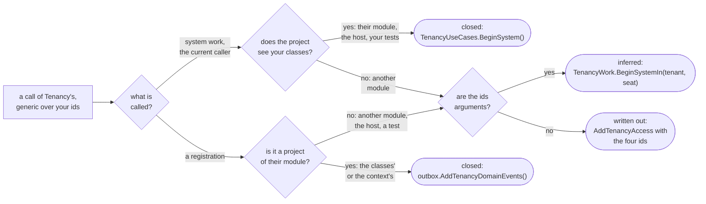

What "seen" means differs for each kind:

- **System work and the current caller** are static members of the class the use cases are named through. C#
  finds a static member through a derived class as it finds a nested type, so they reach exactly as far as
  `TenancyUseCases` does: the project that declares your classes and every project above it, your host and your
  tests among them. In the project that declares the classes too, where the class is the generator's output: a
  call is bound by the compiler, which sees what every generator wrote. Only another generator does not, reading a
  signature or an attribute, and a call is neither.
- **Registrations** are generated as `AddTenancy` is, into the project that declares your classes, or into the
  lowest project of their module that references the registrations, where the context is. They are internal to
  that project, so a project above it, the host or a test project, does not get them: a host registers a module
  through the module's own registration, and a test project that registers Tenancy itself writes the ids, unless
  it declares classes of its own.
- **`ITenantSelection`** names no id at all. `AddTenancy` registers it per scope as the very selection it registers
  closed over your ids, unless your host registered one of its own before, which stays; and what it answers, an `ITenancyCaller`, is what `TenancyCallers.Begin` takes, so a host's
  middleware reads the same in every application ([How the tenant reaches a policy](#how-the-tenant-reaches-a-policy)).

**Another module sees only your ids.** A module that refers to the organization by the ids of your contracts
project, Billing or Projects, sees none of your classes, and nothing it sees says which of its ids are Tenancy's:
the toolkit never takes an id for the tenant's by its name. So it writes them where it calls Tenancy and they are
no arguments, `AddTenancyAccess<TenantId, SeatId, OrganizationUnitId, RoleId, IBillingRequest, BillingContext>()`
and `AddTenancyReadFunctions<TenantId, SeatId, OrganizationUnitId, RoleId>()`, and C# infers them where they are:
system work for a seat, `TenancyWork.BeginSystemIn(tenant, seat, "billing")`, and a key at a unit,
`TenancyAccess.AtUnit(key, unit)`.

**Types keep their ids.** `ITenancyAnswers<...>` and `ITenancyQuestions<...>`, which a handler takes in its
constructor, and records such as `SeatOfCaller<TenantId, SeatId>` name your ids wherever they are named. A class
names what is nested in it, and gives no other generic type a second name; these stay apart from the use cases so
that a module that sees only the ids can take them too. A project names such a type once, with a `global using`
alias of its own, as each of the sample's application projects names the answers.

**Three more name them, in the project that declares your classes too.** The sample's Tenants module writes two of
them, and the third is in [System work](#system-work):

- `TenantSelection<TenantId, SeatId>`, where a person's own seats are asked for a tenant picker, `SeatsOfAsync`: it
  answers records with your ids in them, so it stays on the selection generic over them. `ITenantSelection` carries
  only what needs no id.
- `EfTenancyReadSource<TenantId, SeatId, OrganizationUnitId, RoleId>`, the source of Tenancy's rows a reading of
  your own makes over its context: a type, as the answers are.
- `TenancySystemReads.TenantsToSweepAsync<ShopTenant, TenantId>(tenancy, scope, cancellationToken)`, the tenants a
  round of system work visits: a method of the Entity Framework package, which the class the use cases are named
  through does not know, and it takes Tenancy's context as any context, so no argument says which tenant it is.

<details>
<summary>Show the code: the same calls where your classes are seen, and in another module</summary>

```csharp
// The module that declares the classes, in its infrastructure project: generated, closed over the four ids
options.UseOutbox<ShopTenancyContext>(outbox => outbox
    .AddTenancyDomainEvents()
    .AddTenancyInvitationEvents<InvitationId>()       // the invitation's id: an application may have none
    .KeepEventLog(log => log.AddTenancyEventLog()));

// The host, a test, or any project that sees TenancyUseCases: system work and the current caller
using (TenancyUseCases.BeginSystemIn(tenant, administrator))
{
    await seeder.SeedAsync(cancellationToken);
}

var caller = TenancyUseCases.CurrentCaller();          // a TenancyCaller<TenantId, SeatId>, nobody outside any scope

// The host's middleware: the selection without its ids
var seat = await context.RequestServices.GetRequiredService<ITenantSelection>()
    .ResolveAsync(context.SupabaseCaller(), context.Request.Headers["Tenant"], context.RequestAborted);

// Another module, which sees only the ids: written out where they are no arguments, inferred where they are
services.AddTenancyAccess<TenantId, SeatId, OrganizationUnitId, RoleId, IBillingRequest, BillingContext>();
modelBuilder.AddTenancyReadFunctions<TenantId, SeatId, OrganizationUnitId, RoleId>("tenancy");

using (TenancyWork.BeginSystemIn(tenant, seat, "billing"))
{
    await invoices.SaveOnlyAsync(invoice, cancellationToken);
}

// The answers it takes in a constructor: one alias per project
global using ShopAnswers = DDDToolkit.Supporting.Tenancy.Access.ITenancyAnswers<
    Shop.Contracts.TenantId, Shop.Contracts.SeatId, Shop.Contracts.OrganizationUnitId, Shop.Contracts.RoleId>;
```

</details>

## How your classes add behaviour

Your class is the package's class with your part added. Nothing of the package's is replaced, and there
are four ways to add:

- **Your own members.** Fields and methods on your class, stored with it: a tenant's `IsDemo`, a seat's
  `JobTitle` and a method that changes it. Placements and grants stay the package's, and change through
  its use cases only.
- **Your own entities.** Your class may hold entities of its own, mapped with it, as any aggregate does.
- **Your own rules.** A nested `IInvariant<T>` on your class runs after the package's rules, on every save,
  and refuses the save the way theirs do.
- **The package's domain events.** Every change the package makes raises one: `tenancy.seat-suspended`,
  `tenancy.organization-unit-archived` and the rest, each saying [who made the change](#access-history).
  Handle one in process, with `AlsoDispatchInProcess`, or map it to an integration event of your own before
  `AddTenancyDomainEvents`, and it leaves through the outbox like any module's. An event you do not map is
  stored and reaches no other module.

The package declares no virtual members and no hook methods, so there is nothing to override. A rule of
the package always runs, whatever the application, and a rule of yours can only add to it. The sample's
unit adds a cost centre and a rule about its format:

```csharp
[OrganizationUnit<OrganizationUnitId>]
public sealed partial class OrganizationUnit
{
    public string? CostCentre { get; private set; }

    public void SetCostCentre(string? costCentre) => CostCentre = costCentre;

    // Runs after the package's rules about names, parents and archiving, never instead of them.
    public sealed partial class CostCentreFormat : IInvariant<OrganizationUnit>
    {
        public string Code => "tenants.unit.cost-centre";

        public InvariantFailure? Check(OrganizationUnit entity)
            => entity.CostCentre is null || Format().IsMatch(entity.CostCentre)
                ? null
                : "A cost centre is two capitals, a dash and three digits.";

        [GeneratedRegex(@"^[A-Z]{2}-\d{3}$")]
        private static partial Regex Format();
    }
}
```

A field of yours starts at its default. For a new tenant, its root and its first seat you set it while the
tenant is provisioned, through three callbacks on the command:

```csharp
await tenants.ProvisionAsync(
    new TenancyUseCases.TenantToProvision(
        "harbor", "Harbor Works", TenantShape.Hierarchical, "Harbor Works", identity,
        ConfigureTenant: tenant => tenant.MarkAsDemo(),
        ConfigureRoot: root => root.SetCostCentre("HW-001"),
        ConfigureFirstSeat: seat =>
        {
            seat.Rename("Ada");
            seat.ChangeJobTitle("Harbor master");
        }),
    cancellationToken);
```

Each runs once the instance is made and before the tenant is activated, in that order: the tenant is still
being provisioned, the root is in its organization, and the seat is placed at the root and holds the
administrators' role. What they set is written in the save that provisions, an event your class raises there
leaves with the provisioning's own, and a callback that throws stops the provisioning with nothing saved. For
every later unit, `AddUnitAsync` takes the same kind of callback, `configure`
([The kind of a unit](#the-kind-of-a-unit)), and so do the two that make every later seat, `AddSeatAsync` and
`AcceptAsync` of an invitation ([How a seat is shown](#how-a-seat-is-shown)).


An event you want another module to hear is mapped in the outbox of your Tenancy context, before the call
that keeps the rest to itself:

```csharp
services.AddDDDToolkitEntityFramework(options => options.UseOutbox<ShopTenancyContext>(outbox => outbox
    .PublishAs<SeatSuspended<TenantId, SeatId>, SeatSuspendedV1>(suspended => new SeatSuspendedV1(suspended.SeatId.Value))
    .AddTenancyDomainEvents()));   // generated like AddTenancy, closed over your four ids
```

### The kind of a unit

Tenancy keeps no kind of unit. Whether a unit is a region, an area or a site decides nothing about access: a
key held at a unit reaches every unit below it, whatever either is called. So the package neither asks for a
kind nor checks one, and an application that tells its units apart adds a field of its own to its unit class,
an enum say, shown and stored like any field of its own. It sets the field in the callback of the use case
that makes the unit:

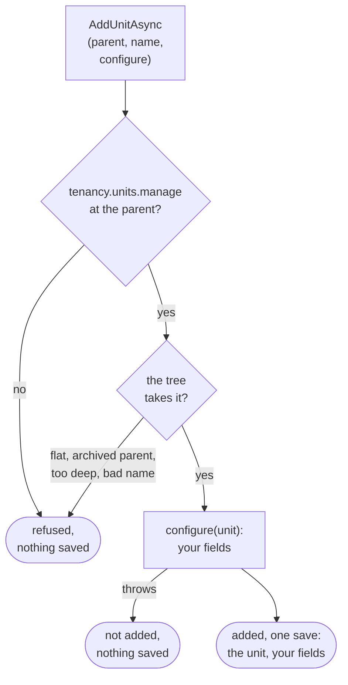

<details>
<summary>Show the code: a unit's kind as the application's own enum</summary>

```csharp
public enum UnitKind { Company, Region, Area, Site }

[OrganizationUnit<OrganizationUnitId>]
public sealed partial class OrganizationUnit
{
    public UnitKind? Kind { get; private set; }

    public void SetKind(UnitKind? kind) => Kind = kind;
}

// The command's handler: the package's use case adds the unit, the callback sets the kind, one save writes both
public async ValueTask<OrganizationUnitId> Handle(AddOrganizationUnit command, CancellationToken cancellationToken)
    => await organization.AddUnitAsync(command.Parent, command.Name, cancellationToken, configure: unit => unit.SetKind(command.Kind));

// The root's, when the tenant is provisioned
new TenancyUseCases.TenantToProvision(slug, name, shape, name, identity, ConfigureRoot: root => root.SetKind(UnitKind.Company));

// The query's handler: the directory decides which units the caller reads and answers your own units, whole, each
// with its path and depth beside it; a plain select shows the kind
public sealed record UnitListing(OrganizationUnitId Id, OrganizationUnitId? ParentId, string Name, UnitKind? Kind, UnitStatus Status, string Path, int Depth);

public async ValueTask<IReadOnlyList<UnitListing>> Handle(OrganizationUnits query, CancellationToken cancellationToken)
{
    var units = await reads.AskDirectoryAsync(directory => directory.ListUnitsAsync(cancellationToken));
    return [.. units.Select(found => new UnitListing(found.Unit.Id, found.Unit.ParentId, found.Unit.Name, found.Unit.Kind, found.Unit.Status, found.Path, found.Depth))];
}

// Stored by its name: one line in the context's ConfigureConventions
configurationBuilder.Properties<UnitKind>().HaveConversion<string>().HaveMaxLength(16);
```

The sample stores the kind by its key in lower case instead, with a converter of its own (`UnitKindKeyConverter`),
because its rows from before the enum hold the keys of the catalogue the package once asked for.

</details>

The use case checks the caller, and the organization checks the tree and makes the unit through your own
class. It hands the unit to `configure` before it takes the unit in, so your field is written in the same save
as the unit and a rule of your class judges it there. A callback that throws leaves the organization as it was:
the unit is not added, and not even a later save in the same scope writes it. The root works the same way,
through `ConfigureRoot` when the tenant is provisioned.

To show the kind, select it. `ListUnitsAsync` and `UnitsByIdAsync` answer your own units, whole, each as a
`UnitInTree`: the unit, with its path from the root and its depth beside it, the two things a unit does not carry
itself. So a field your unit class adds is shown with a plain `Select` over the units the directory read, with no
read more, and nothing you do to one is saved. The sample does all of it: a `UnitKind` enum on its unit, set by
its command and by its seeding, and a `UnitListing` its queries select, the unit's own fields with the path beside
them.

## Who may do what

Tenancy answers questions about the organization, and nothing else:

| Question | Answer |
|---|---|
| `UnitsWhereIHold(key)` | The units where the current seat holds the key: the units it was granted it at, and every unit below them |
| `ReadableUnits()` | The units the current seat is placed in, and every unit below them: where it belongs, not what it may open |
| `HoldsTenantWideAsync(key)` | Whether it holds the key at the root, so for the whole tenant |
| `HoldsAtAsync(key, unit)` | Whether it holds the key at that unit, granted there or above it |
| `KeysIHoldAt(unit)` | Every key it holds that reaches that unit |
| `RolesWithKey(key)` | The active roles that grant the key |
| `SeatsHoldingAt(key, unit)` | The active seats that hold the key at that unit now, granted there or above it. A seat learns about another seat where it may read that seat's grant ([who reads which grants](#who-reads-which-grants)): one that manages grants, seats or units at North learns who holds the key from North or below it, and not who holds it from the root. System work in the tenant learns every holder; a seat that manages nothing learns only whether it holds the key there itself |
| `WhereIHold(keys)` | Every pair of a unit and one of the keys the seat holds there: `UnitsWhereIHold` for several keys in one query |
| `RoleKeys(keys)` | Every pair of an active role and one of the keys it grants: `RolesWithKey` for several keys in one query |
| `UnitsUnder(unit)` | The unit and every unit below it, in the caller's tenant |
| The current tenant and seat | Who is asking |

A grant counts from its start until its end, and that is compared when the question is asked, so a grant
that ended yesterday gives nothing today without anything being written. A suspended seat, an archived
role and a key the catalogue has retired give nothing either.

It does not decide who may open a project. The module that owns the project does: it knows what a project
is, who is on its team and in which role, and it combines that with Tenancy's answer. A key held at a unit
holds for everything below it.


<details>
<summary>Show the code: asking Tenancy by hand, without Membership</summary>

The questions are asked over the module's own context, which maps Tenancy's rows as a read model, so they
become subqueries of the module's statement instead of lists fetched first. Written by hand, the two halves
are in two projects. The application project references no Entity Framework: it asks through a read port,
`IProjectReads`, which opens a reading on a context of its own for each query. The access rules ask Tenancy's
questions over the reading's rows and pack the answers, queries that have not run yet, into a reach, a record
of the module's own. The reading, which the infrastructure project implements, puts them into the statement
that reads the projects. A module whose resources have members can leave both halves to the
[Membership package](membership.md), which writes them from its rules, as the sample's Projects module does.
Both shortened, by hand, for the projects the caller may edit:

```csharp
// Projects.Application: Tenancy's answers stay sets, and go to the port as a reach
await using var reading = reads.Open();                          // a context for this one query
var tenancy = answers.Over(reading.Tenancy, reading.Queries);
var reach = new ProjectReach(
    wholeTenant: false,
    units: tenancy.UnitsWhereIHold("projects.edit"),             // a query, not a list
    seat,
    membershipIsEnough: false,                                   // true for "projects.view" alone
    crewRoles: tenancy.RolesWithKey("projects.edit"),            // a query too
    now);
var mine = await reading.PageAsync(reach, filter, paging, cancellationToken);       // data: no entity leaves the port

// Projects.Infrastructure: the reading writes the statement, with both answers as subqueries
var units = reach.Units;
var roles = reach.CrewRoles;
return await db.Projects.AsNoTracking()
    .Where(project => units.Contains(project.UnitId)
        || project.Crew.Any(row => row.SeatId == seat
            && row.StartsAt <= now && (row.EndsAt == null || row.EndsAt > now)
            && row.Roles.Any(held => roles.Contains(held.RoleId)
                && held.StartsAt <= now && (held.EndsAt == null || held.EndsAt > now))))
    .Select(project => new Row { /* its own columns, and how it was reached */ })
    .OrderBy(row => row.Number)
    .ToPageAsync(paging, cancellationToken);   // one statement: GreenDonut's paging, by the number
```

A crew member holds a key on a project through a role that gives it, held now, in a membership that applies
now. Seeing the project is the one exception: for `projects.view` the membership alone is enough, so that
reach says `membershipIsEnough` and the reading leaves the roles out.

Code that holds the context itself, in a module's infrastructure project or in a module of one project,
writes `answers.Over(db)` for the same questions over the same rows.

```csharp
// The context: the read model next to the module's own tables, and the tenant on its own entities.
// On Postgres the rows come from Tenancy's read functions, anywhere else from views over its tables.
// The module sees Tenancy's ids, not its classes, so it names them (Your ids, named once).
if (Database.IsNpgsql())
{
    modelBuilder.AddTenancyReadFunctions<TenantId, SeatId, OrganizationUnitId, RoleId>("tenancy");
}
else
{
    modelBuilder.AddTenancyReadModel<TenantId, SeatId, OrganizationUnitId, RoleId>("tenancy");
}

modelBuilder.Entity<Project>().ScopeToTenant(project => project.TenantId);
```

```sql
-- Postgres: the same shape as a policy, two set-shaped questions that each run once per statement
"Id" = ANY (ARRAY(SELECT projects.crew_project_ids('projects.edit')))
OR "UnitId" = ANY (ARRAY(SELECT tenancy.units_where_i_hold('projects.edit')))
```

</details>

The read model needs Tenancy's tables in the same database as the module's: one database with a schema
per module, or one SQLite file. Where they are apart, ask Tenancy's own context first and pass the answer
in as a list. `AddTenancyReadModel` maps the rows as views over those tables. On Postgres with
`DDDToolkit.Supporting.Tenancy.Postgres`, a module maps `AddTenancyReadFunctions` instead and
[reads Tenancy through its functions](#modules-read-through-functions); the questions are asked the same way
over either.

### Key sets for navigation, abilities for actions

A list that shows what the caller may do with each row, a button here and none there, needs several keys for
many rows. Asking `UnitsWhereIHold` once per key, or `HoldsAtAsync` once per row, is a query per answer.
`WhereIHold(keys)` answers every pair of a unit and a key in one query, and like the other questions it is a
part of the module's own statement:

```csharp
var tenancy = answers.Over(db);
var held = tenancy.WhereIHold(["projects.edit", "projects.close"]);

// Each project with the keys held where it hangs: one statement
var abilities = await (
    from project in db.Projects
    join pair in held on project.UnitId equals pair.Unit
    select new { project.Id, pair.Key }).ToListAsync(cancellationToken);

// The projects under one unit, whatever the caller holds there
var under = tenancy.UnitsUnder(unit);
var below = await db.Projects.Where(project => under.Contains(project.UnitId)).ToListAsync(cancellationToken);
```

`RoleKeys(keys)` does the same for roles, for a module whose rows are reached through a role as well, as a
project's crew is. Every key is checked against the catalogue first, so a typo throws, and a retired key is
held nowhere.

A key set is for showing what a caller can do. It decides nothing: by the time a button is pressed, a grant
may have ended. Whether a command may run is asked when it runs, by the use case that runs it, with
`HoldsAtAsync` or the module's own rule. Read the keys to draw the screen, and ask again to act.

### What a request requires of its caller

Every command and query says what it requires, and a check holds the caller to it before the handler runs.
The types for it are the toolkit's own, in `DDDToolkit.Access`: [Access requirements](access-requirements.md)
has how a request declares what it requires, how the checks are asked and fail closed, and the pipeline
behavior that is written for you with Mediator. Tenancy ships the cases it is the one to decide, spelled with
`TenancyAccess`:

```csharp
public interface IBillingRequest : IRequireAccess;              // one interface per module

public sealed record CloseTheBooks(int Year) : IBillingRequest
{
    AccessRequirement IRequireAccess.RequiredAccess => TenancyAccess.ForTheWholeTenant(BillingKeys.CloseTheBooks);
}
```

| A request requires | It writes | Lets through | Refuses with |
|---|---|---|---|
| a caller who works in the tenant | `TenancyAccess.InTenant()` | a seat in the tenant the request was sent for, and system work there | what the caller is nobody for, such as `tenancy.not-seated` |
| a key for the whole tenant | `TenancyAccess.ForTheWholeTenant(key)` | whoever holds the key at the tenant's root now, and system work in the tenant | `tenancy.not-permitted`, naming the key |
| a key at a unit | `TenancyAccess.AtUnit(key, unit)` | whoever holds the key at that unit now, there or above it, and system work in the tenant at a unit of its own | `tenancy.not-permitted`, with the key and the unit |
| one of the application's operators | `TenancyAccess.RequiresOperator()` | an [operator](#operators) | `tenancy.operators-only`, for a seat and for system work too |

Beside them a request of a module with Tenancy uses the toolkit's own, which are about who is calling and
nothing else: `AccessRequirement.AllowAnonymous()` for anyone, `AccessRequirement.SignedIn()` for a signed-in
user who has no seat yet, as for accepting an invitation or picking a tenant, and
`AccessRequirement.RequiresSystemWork()` for what only the application sends, as seeding does. They are
[the vocabulary](access-requirements.md#the-vocabulary) every request picks one from.

`AtUnit` is for a command that acts at a unit the request names: one the package's use case decides, such as
placing a seat or giving a role there, and one that makes something at a unit, where nothing exists yet that a
key could be held on, such as opening a project there. It is closed over your unit id, which it takes from the
argument:

```csharp
public sealed record OpenLedger(string Name, OrganizationUnitId UnitId) : IBillingRequest
{
    AccessRequirement IRequireAccess.RequiredAccess => TenancyAccess.AtUnit(BillingKeys.OpenLedger, UnitId);
}
```

Because the id is taken from the argument, the compiler does not tell a unit from another id: on a request
that also carries a seat, `AtUnit(key, Seat)` compiles. It lets nobody through: the check stops every send of
it with an `InvalidOperationException` that names your unit id. Write the type,
`TenancyAccess.AtUnit<OrganizationUnitId>(key, Unit)`, where a request carries more ids than one, or hold
every request to the requirement it should declare in a test, as the sample's `AccessDeclarationTests` does.

What is held on one thing a module keeps at a unit is that module's own case, with a
[check of its own](access-requirements.md#what-answers-it) written over the questions above;
[Membership](membership.md) ships such cases for a resource with members.

**A request handed to a use case of the package says what that use case asks first.** No requirement leaves
a request to the package. A command that gives a role declares `TenancyAccess.AtUnit(TenancyKeys.GrantsManage,
Unit)`, one that makes a role `TenancyAccess.ForTheWholeTenant(TenancyKeys.RolesManage)`, and a query the
package's directory answers `TenancyAccess.InTenant()`. Where the first thing the use case asks needs
something read, the request declares what it can name and the use case asks the rest: archiving a unit takes
`tenancy.units.manage` at the unit's parent, which only the use case reads, so its request declares
`TenancyAccess.InTenant()`. The use case asks again past the check, whoever calls it, and then for what only it
can read: who may give a role that manages access, whether a move gives away what the caller could not,
whether the tenant keeps an administrator. Those rules are the package's, and no request spells them. A caller
the use case would refuse first is refused at the door already, with the same code and the same key. Under it
all, on Postgres, [the second lock](#on-postgres-the-second-lock) holds every row the use case saves to the
seat it runs as.

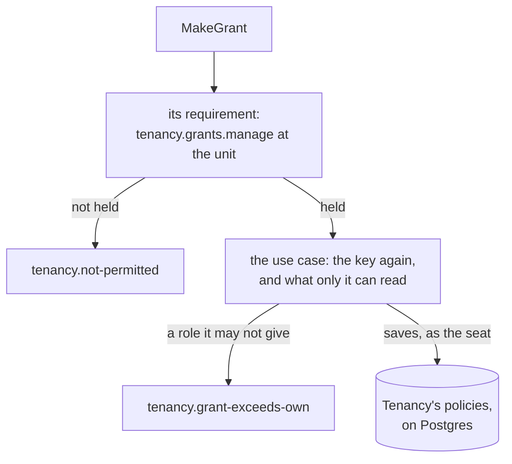

<details>
<summary>Show the code: a command handed to the package's use case</summary>

```csharp
public sealed record MakeGrant(SeatId Seat, OrganizationUnitId Unit, RoleId Role, DateTimeOffset? Until, string? Reason) : ICommand, ITenantsRequest
{
    // What the use case asks first, and the request names: the check refuses a caller without it.
    AccessRequirement IRequireAccess.RequiredAccess => TenancyAccess.AtUnit(TenancyKeys.GrantsManage, Unit);
}

public sealed class MakeGrantHandler(TenancyUseCases.SeatCommands seats) : ICommandHandler<MakeGrant>
{
    public async ValueTask<Unit> Handle(MakeGrant command, CancellationToken cancellationToken)
    {
        // The use case asks for the key again, whoever calls it, and then for the rules only it can read.
        await seats.GrantAsync(command.Seat, command.Unit, command.Role, command.Until, command.Reason, cancellationToken);
        return Unit.Value;
    }
}
```

</details>

#### Who may ask, and what the work runs as

A tenant is provisioned by system work outside any tenant, and nobody holds a seat to ask for that with. So
who may send the request that provisions one is one decision, and what the work runs with is another: the
handler begins the system work itself, in trusted code, whichever requirement its request declares.

The request's requirement says who gets as far as the handler. Every handler below begins
`TenancyUseCases.BeginSystem()` and provisions as that, whoever sent the request, and the caller gets nothing more by
it: what the system work does is the handler's to say, and the database's policies hold it to the tenant it
makes. What changes with the requirement is where the handler finds what system work cannot tell it, the
first administrator:

| Who may send it | Its requirement | Where the first administrator comes from |
|---|---|---|
| a signed-in person who registers an organization | `AccessRequirement.SignedIn()` | the caller's own token, read before the system work begins, never the request; an anonymous sign-in is refused |
| anyone, through a public registration form | `AccessRequirement.AllowAnonymous()` | there is no caller to take it from: the form carries an address, and the handler makes that account with `IIdentityAccounts.InviteByEmailAsync` and provisions for the id it answers |
| a job or a console tool the application runs, such as an import | `AccessRequirement.RequiresSystemWork()` | the request, which the trusted code that began the job filled in |

An operator's screen is none of these. An operator is a signed-in user, whom `RequiresSystemWork()` refuses
like any other, and what an operator asks for is carried out by system work that names the operator,
`TenancyUseCases.BeginOperator(identity)` ([Operators](#operators)).

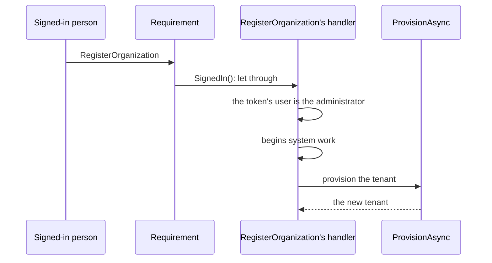

<details>
<summary>Show the code: a registration that provisions a tenant</summary>

```csharp
public sealed record RegisterOrganization(string Slug, string Name, string AdministratorName) : ICommand<TenantId>, ITenantsRequest
{
    // Who may send it: a signed-in person, who becomes the first administrator.
    AccessRequirement IRequireAccess.RequiredAccess => AccessRequirement.SignedIn();
}

public sealed class RegisterOrganizationHandler(TenancyUseCases.TenantCommands tenants, ICallerAccessor callers)
    : ICommandHandler<RegisterOrganization, TenantId>
{
    public async ValueTask<TenantId> Handle(RegisterOrganization command, CancellationToken cancellationToken)
    {
        // The administrator is the verified identity of the request's own token, never one the request carries,
        // and it is read before the system work begins: inside it, the caller is the system. SignedIn() lets an
        // anonymous sign-in through as well, and no seat should belong to one.
        var caller = callers.Current;
        if (caller.UserId is not { } administrator
            || string.Equals(caller.Claim("is_anonymous"), "true", StringComparison.OrdinalIgnoreCase))
        {
            throw TenancyRefusals.Refuse(TenancyRefusals.IdentityRequired);
        }

        // What it runs with: system work outside any tenant, begun here, which is what provisions a tenant.
        using (TenancyUseCases.BeginSystem())
        {
            var made = await tenants.ProvisionAsync(
                new TenancyUseCases.TenantToProvision(
                    command.Slug, command.Name, TenantShape.Flat, command.Name, administrator,
                    ConfigureFirstSeat: seat => seat.Rename(command.AdministratorName)),
                cancellationToken);
            return made.Tenant;
        }
    }
}
```

A form anyone may fill in declares `AccessRequirement.AllowAnonymous()` and carries an address instead, and its
handler makes the account before it provisions. An address that has an account already is answered as if it
had none: the form must not tell anyone who has one, and that person signs in and registers as above.

```csharp
var made = await accounts.InviteByEmailAsync(command.Address, signInRedirect: null, cancellationToken);
if (made is not IdentityAccountOutcome.Created(var administrator))
{
    return;                                          // the address has an account: answer as if it had none
}

using (TenancyUseCases.BeginSystem())
{
    await tenants.ProvisionAsync(
        new TenancyUseCases.TenantToProvision(
            command.Slug, command.Name, TenantShape.Flat, command.Name, administrator,
            ConfigureFirstSeat: seat => seat.Rename(command.AdministratorName)),
        cancellationToken);
}
```

</details>

The check that decides Tenancy's cases is added per module, for the module's request interface and over the
module's context:

```csharp
// In the module that declares Tenancy's classes: generated like AddTenancy, closed over the four ids
services.AddTenancyAccess<ITenancyRequest, TenancyContext>();

// In any other module, which sees the ids and none of the classes: the four ids written out, as where the read
// model is mapped (Your ids, named once)
services.AddTenancyAccess<TenantId, SeatId, OrganizationUnitId, RoleId, IBillingRequest, BillingContext>();
```

Only `ForTheWholeTenant` and `AtUnit` read: one statement each, over that context, which is Tenancy's own or
one that maps the [read model](#what-a-module-reads-of-tenancy), so no module is checked over another module's
context. A request of a module that never added the check is stopped, and the message names
`AddTenancyAccess` as the call that adds it. It runs
on a context of its own where you registered a factory for the context, a pooled one say, and on the request's
own otherwise.

The Tenancy packages reference no dispatcher. What asks the checks in front of the handlers is one call of
yours, `AccessChecks<IBillingRequest>.RequireAsync`, or, in a project that references Mediator, the
[behavior the generator writes](access-requirements.md#the-generated-behavior-with-mediator) for an interface
marked `[AccessRequests]`.

### What a module reads of Tenancy

The read model is six rows, and they carry what an access rule reads: ids, keys, periods, statuses, a unit's
parent, and a role's pack and keys. That is all a module's model can map of Tenancy's, as a view or as a
function:

| Row | Carries | Does not carry |
|---|---|---|
| `SeatRight` | the tenant, the seat, the unit, the role, the key, and the grant's start and end | |
| `OrganizationUnitPath` | the tenant, the unit above, the unit at or below it, and how many levels apart they are | |
| `OrganizationUnitRow` | the unit's id, its tenant, its parent and its status | its name, and every field your unit class adds |
| `RoleRow` | the role's id, its tenant, the pack it was copied from, its status and its keys | its name |
| `PlacementRow` | the seat, the unit, and whether the placement is the primary one | |
| `SeatRow` | the seat's id, its tenant and its status | its identity, and every field your seat class adds, such as a name |

No row has a text that is shown to people. So a module cannot lean on Tenancy for what it shows: a query of
its own has no seat's name to select, whatever it joins. It answers ids, and [names](#names) are asked of
Tenancy. A rule never needs one: "the unit is active", "the role is a copy of the lead's pack" and "the seat
holds the key here" are all in the rows.

`TenancyModel.ReadsBeyondAccessFacts(model)` says what a module's model maps of Tenancy's beyond these rows,
one sentence per finding: a type of the module's own on one of Tenancy's tables, views or functions, or a
property added to a row, a shadow property included. A test asserts it is empty for every module's context,
built for each database you run on:

```csharp
using var projects = new ProjectsContext(optionsForPostgres);
TenancyModel.ReadsBeyondAccessFacts(projects.Model, schema: "tenancy").Should().BeEmpty();
```

It judges the shape of a mapping. SQL a module writes by hand is not a mapping and is not seen, and on a
database without the second lock nothing but your project references keeps a module from Tenancy's tables.
SQLite has no schemas: a table is found by its name alone, whichever schema a mapping names. For a model built
for SQLite, ask once more for each schema the model names (`schema: null` is its default schema), so a type
mapped under one of Tenancy's table names is found there as well. The sample's `ModuleModelTests` asks it of
every context its host registers, under Tenancy's schema.

## Names

What a unit is called and where it hangs, and what a role is called, are Tenancy's to answer. What a seat is
shown by is not: Tenancy keeps no name of a seat, and your application decides where one comes from
([How a seat is shown](#how-a-seat-is-shown)). Tenancy's directory, `TenancyDirectory`, answers all three
kinds from Tenancy's own seats, roles and units, and answers seats and units as your own classes:

| Question | Answers |
|---|---|
| `WhoAmIAsync()` | the calling seat's `SeatOverview`: your seat, whole, with its placements and grants, and beside it the tenant, the path of each unit it is placed at, the roles its grants name, and every key it holds now with the units it reaches |
| `SeatOverviewAsync(seat)` | the same `SeatOverview` of any seat of the tenant, as the caller reads it: the request that asks says who may ([Another seat's overview](#another-seats-overview)) |
| `ListSeatsAsync()` | every seat of the tenant the caller reads, your own class, whole, in the order of their ids: by default every seat of the tenant, and on Postgres a [read rule of yours](#who-reads-the-seats-a-default-you-may-replace) may narrow that |
| `ListRolesAsync()` | every role of the tenant, the active ones first, with whether each manages access |
| `ListUnitsAsync()` | the units the caller is placed under, your own class, whole, each with its path from the root and its depth (`UnitInTree`) |
| `SeatsByIdAsync(ids)` | the seats among the ids, as `ListSeatsAsync` answers them |
| `RolesByIdAsync(ids)` | the roles among the ids, as `ListRolesAsync` answers them |
| `UnitsByIdAsync(ids)` | the units among the ids, as `ListUnitsAsync` answers them, whichever of them the caller is placed under |

A seat and a unit come whole, with every field your class adds, so a screen shows a seat by the name you keep
for it, and a unit with the kind your unit class keeps, with a plain `Select`. What Tenancy puts beside them is
only what is not on your class: a unit's path and depth, which come from the units above it, and in an overview
the tenant, the paths, the role names and the keys.

The lists fill a picker. The three questions by id are for a screen that was answered ids by another module:
a project names its unit and the seats of its crew by id, and the screen asks what those are called. The
roles a crew holds are the project's module's own, which it names itself (`GET /project-roles` in the sample).

Whoever works in a tenant reads its names: a seat of it, or system work in it. No key is asked, for a list, for
a question by id or for a seat's overview, and a question by id answers any seat, role or unit of the caller's
tenant, of the seats those the caller reads, which is every seat unless a
[read rule of yours](#who-reads-the-seats-a-default-you-may-replace) says otherwise. That is wider than
`ListUnitsAsync`, which lists where the caller is placed: someone on a project's team works at a unit they are not
placed under, and still reads what that unit is called. An id of another tenant, or of
nothing, is left out of the answer without a word, so the answer never says which of the two it was. A
question takes at most `TenancyDirectory.MostIds` ids, 200; more is refused with `tenancy.too-many-ids`, a
400 whose `Max` argument says how many. A caller that is nobody is refused first, with its own code, such as
`tenancy.not-seated`.

A question by id costs the same however many ids it carries: one statement for seats, one for roles, and two
for units, the organization with its units and the closure that orders a path. Seats and units are read whole,
a seat with its placements and grants as loading one does, and tracked by nobody: nothing you do to one is
saved, by that question or by a save later in the same unit of work. A seat comes with its identity, as your
class has it, so what leaves is what you select. On Postgres the policies decide what of a seat is read, as they
do for every read: another seat's grants come with it only where the caller may read them
([Who reads which grants](#who-reads-which-grants)). Only those policies narrow them: on another database, or in a
context without row level security, a listed seat comes with every placement and grant it has. So where another
seat's grants are shown, the request that asks says who may see them, as the sample's `SeatGrants` asks
`tenancy.seats.manage` for the whole tenant ([Another seat's overview](#another-seats-overview)), and a list's
seats are selected into what every member may see.

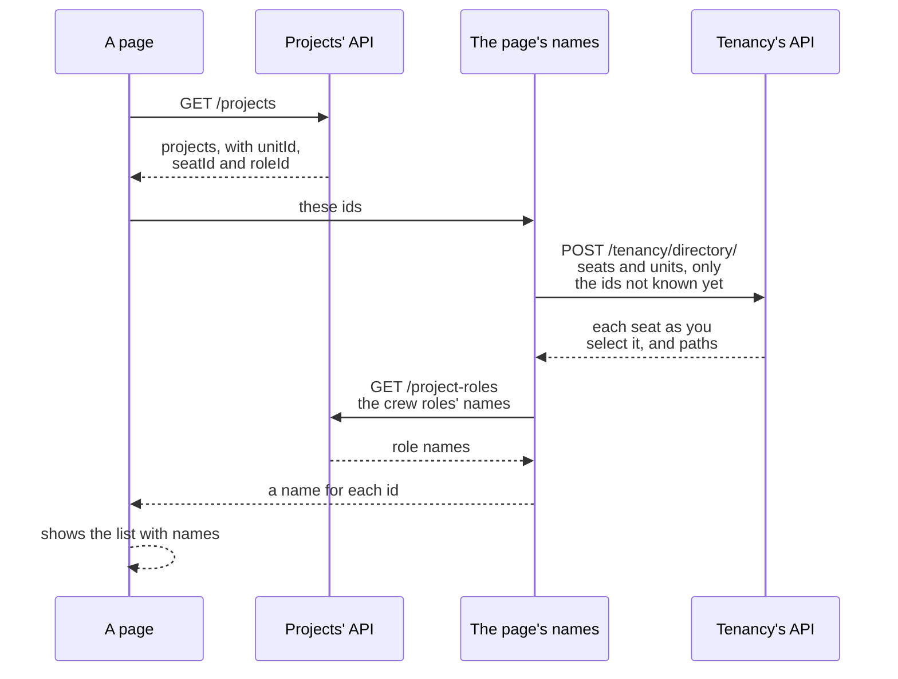

<details>
<summary>Show the code: asking the directory, and a route for it</summary>

```csharp
// The directory is registered with Tenancy. It checks the caller itself, as every use case does. The seats are
// your own class, so the name is the one it keeps.
public sealed class ProjectScreen(TenancyUseCases.TenancyDirectory directory)
{
    public async Task<IReadOnlyDictionary<SeatId, string>> NamesOfAsync(IReadOnlyCollection<SeatId> seats, CancellationToken cancellationToken)
        => (await directory.SeatsByIdAsync(seats, cancellationToken)).ToDictionary(seat => seat.Id, seat => seat.DisplayName);
}
```

```csharp
// The sample's route: a POST that only asks, since 200 ids do not fit a request line. It sends a query,
// SeatsById, whose handler selects the module's SeatListing from the seats the directory answers.
group.MapPost("/tenancy/directory/seats", async (IdsAsked<SeatId> body, ISender sender, CancellationToken cancellationToken)
    => Results.Ok((await sender.Send(new SeatsById(Asked(body)), cancellationToken)).Select(Describe)));
```

```http
POST /tenancy/directory/seats
Authorization: Bearer <rhea's token>
Tenant: harbor
Content-Type: application/json

{ "ids": ["c0000000-0000-4000-8000-000000000103", "c0000000-0000-4000-8000-000000000104", "c0000000-0000-4000-8000-000000000207"] }
```

```json
[
  { "id": "c0000000-0000-4000-8000-000000000104", "displayName": "Juno", "status": "active" },
  { "id": "c0000000-0000-4000-8000-000000000103", "displayName": "Leo", "status": "active" }
]
```

The third id is a seat of another tenant, and is not in the answer.

</details>

A screen keeps the names it was answered for as long as it shows them, and no longer: the sample's UI makes
its names new with every load of a page, so a renamed seat shows at the next load and nothing of one tenant is
shown in another. A module's own answers carry no name of Tenancy's at all.

### How a seat is shown

Tenancy keeps no name of a seat. No access rule reads one, and Tenancy knows a person only by the verified
identity of their token, so what a person is shown by is your application's to decide, and so is the rule
about it. Three ways, and you may mix them:

1. **A name per tenant, on your seat class.** A field of your own, as a job title is, so the same person may be
   called differently in each tenant. You set it in the callback of the use case that makes the seat:
   `ConfigureFirstSeat` when a tenant is provisioned, `configure` of `AddSeatAsync`, and `configure` of an
   invitation's `AcceptAsync`, where the person gives it. Each runs before anything is saved, so a name your rule
   refuses leaves nothing behind, and an invitation stays open. Renaming is a use case of your own, under a rule
   of your own. The sample does this.
2. **The person's own name, from the identity provider.** One name in every tenant, which the person keeps
   themself. Supabase Auth keeps it in `user_metadata`, which their access token carries, so the caller's own
   name is a claim. Another person's the provider answers by the seat's identity. A user may edit
   their own `user_metadata`: fine for a name to show, never for something a rule decides.
3. **A profile of your own, found by the seat's identity.** A table of yours, one row per person, with whatever
   you show of them, in every tenant; one read of yours for the identities a page shows.

Whichever you choose, Tenancy answers your own seat class, whole: the directory's four questions about seats,
and the lookup of a person's own seats in every tenant for a tenant picker, `TenantSelection.SeatsOfAsync<TSeat>(caller)`.
Each decides which seats the caller is answered and reads them in one statement, so every screen shows what you
chose with a plain `Select` and no read more. Beside a seat comes only what is not on it: in the overview
`WhoAmIAsync` and `SeatOverviewAsync(seat)` answer (`SeatOverview`), the tenant, the path of each unit it is placed
at, the roles its grants name and the keys it holds; in the picker (`SeatInTenant`), the tenant:

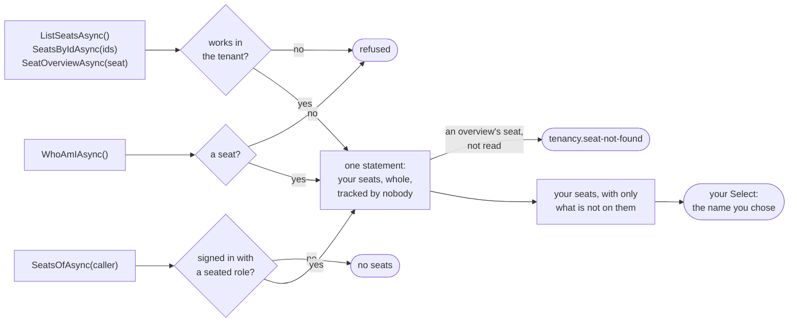

The lists leave out a seat the caller does not read, without a word. An overview is about one seat, so
`SeatOverviewAsync(seat)` refuses a seat the caller does not read with `tenancy.seat-not-found` instead.

Nothing you do to a seat the directory answered is saved, by that question or by a save later in the same unit of
work. The picker reads across tenants, before one is picked: it answers your seat for the fields you keep on it,
and where the seat is placed and what it holds are its tenant's, which a database that keeps tenants apart
leaves out there. Nothing in an overview's record is the caller's own but the question that made it, so it fits
any seat: the seat, and beside it only what is not on it. `SeatOverviewAsync(seat)` answers it for any seat of the
tenant ([Another seat's overview](#another-seats-overview)). `UnitOf(id)` and `RoleOf(id)` give the path of a
placement's unit and the role a grant names; `RoleOf` answers `null` for a role a filter of your own on the role
class hides, as the grant is the seat's all the same.

The field is yours to guard as well. On Postgres, Tenancy's policies let every seat of a tenant, and the
person a row is for, read the seats' rows, your columns with them; and they let a seat change its own row, and
a seat that manages seats or grants anywhere in the tenant change any seat's row, since every save of a seat
writes its version. Tenancy guards its own columns of the row and decides nothing about yours: who may change a
name is said by a column rule of yours, as the sample's says it for the rule of its command
([What the database guards on a seat](#what-the-database-guards-on-a-seat)). A column rule holds a change and
never a read, so a field you would show to fewer people than every member of the tenant belongs in a table of
your own, with a rule of your own.

<details>
<summary>Show the code: a name per tenant, the provider's name, and a profile of your own</summary>

```csharp
// 1. A name per tenant, on your seat class, with your own rule.
[SeatAggregate<SeatId>]
public sealed partial class Seat
{
    public string DisplayName { get; private set; } = string.Empty;

    public void Rename(string? displayName)
    {
        var name = displayName?.Trim() ?? string.Empty;
        DisplayName = name.Length is > 0 and <= 200 ? name : throw new RefusalException("shop.seat.name", RefusalKind.Invalid, "A seat's name is 1 to 200 characters.");
    }
}

// Named where it is made: provisioned, added, or accepted with the name the person gives.
new TenancyUseCases.TenantToProvision(slug, name, shape, name, identity, ConfigureFirstSeat: seat => seat.Rename("Ada"));
await seats.AddSeatAsync(identity, cancellationToken, configure: seat => seat.Rename("Bert"));
await invitations.AcceptAsync(command.Token, verifiedAddress, cancellationToken, configure: seat => seat.Rename(command.DisplayName));

// Shown with a plain select over your own seats: the lists, the questions by id, and a seat's overview.
public sealed record SeatListing(SeatId Id, string DisplayName, SeatStatus Status);

var listed = (await directory.ListSeatsAsync(cancellationToken)).Select(seat => new SeatListing(seat.Id, seat.DisplayName, seat.Status));

var me = await directory.WhoAmIAsync(cancellationToken);    // a SeatOverview: your seat, and only what is not on it
var shown = new
{
    Seat = new SeatListing(me.Seat.Id, me.Seat.DisplayName, me.Seat.Status),
    Placements = me.Seat.Placements.Select(placement => new
    {
        me.UnitOf(placement.UnitId).Path,
        Roles = placement.Grants.Where(grant => grant.AppliesAt(me.AsOf)).Select(grant => me.RoleOf(grant.RoleId)?.Name),
    }),
};

// And the tenant picker, before a tenant is picked: each of the caller's own seats with the name its tenant keeps.
var mine = (await selection.SeatsOfAsync<Seat>(callers.Current, cancellationToken))
    .Select(found => (found.Slug, found.OrganizationName, Seat: new SeatListing(found.Seat.Id, found.Seat.DisplayName, found.Seat.Status)));

// Renamed by a command of yours: a seat renames itself; another seat takes seats.manage for the whole tenant.
var seat = await store.FindSeatAsync(command.Seat, cancellationToken) ?? throw TenancyRefusals.Refuse(TenancyRefusals.SeatNotFound);
seat.Rename(command.DisplayName);
await store.SaveAsync(cancellationToken);
```

```csharp
// 2. The person's own name, from the identity provider: theirs in every tenant. The caller's own is a claim of
// their token; another person's your client of the provider answers, by the seat's identity.
var mine = callers.Current.Claim("user_metadata.full_name");
var listed = await directory.ListSeatsAsync(cancellationToken);
var names = await provider.NamesOfAsync([.. listed.Select(seat => seat.Identity)], cancellationToken);
```

```csharp
// 3. A profile of your own, by the identity: one read of yours for the page, beside the directory's.
var listed = await directory.ListSeatsAsync(cancellationToken);
var identities = listed.Select(seat => seat.Identity).ToArray();
var profiles = await shop.Profiles.Where(profile => identities.Contains(profile.Identity)).ToDictionaryAsync(profile => profile.Identity, cancellationToken);
```

The identity is a person's, as an address is: what you select is what leaves, and the sample's answers never
carry it.

</details>

The sample keeps a name per tenant on its `Seat`, with its rule (`tenants.seat.display-name`, in English and
Dutch): its demo seeder names each seat in the callbacks, `POST /invitations/accept` takes the name the person
gives, `PUT /tenancy/seats/{seatId}/name` and the mutation `seatRename` are its own command `RenameSeat`, and
`SeatListing` is what every answer about a seat shows, in REST, in GraphQL and in the access history, the tenant
picker's `GET /me/seats` and `seatsOfMine` and the overview's `GET /me` and `overviewOfMine` included: each query
selects it from the seats the package answered. In the database its
column rule `NameChangesByTheSeatOrWithTheSeatsKey` holds the name to the rule of `RenameSeat`.

### Another seat's overview

`WhoAmIAsync` answers the calling seat's overview. `SeatOverviewAsync(seat)` answers the same record for any seat
of the tenant: the seat, whole, with its placements and grants, and beside it the tenant, the path of each unit it
is placed at, the roles its grants name, every key it holds now with the units it reaches, and the moment that
holds for. A page about one person, the one an administration opens before it changes someone's roles say, asks
it and shows that person the way a seat's own page shows the seat. Asked about the caller's own seat, it answers
what `WhoAmIAsync` answers.

Two rules decide what happens, and neither is the directory's own:

- **Your request decides who may ask.** The directory asks no more of the caller than every question of it asks:
  a seat of the tenant, or system work in it. Who may see another person's access is your application's choice,
  so the request that sends the question states it, as a request states it for everything else. The sample's
  administration lets only a seat that manages seats for the whole tenant read another person's roles,
  `TenancyAccess.ForTheWholeTenant(TenancyKeys.SeatsManage)`. An application that lets the managers of a unit see
  the people of their units asks `TenancyAccess.InTenant()` and leaves the rest to the read rules.
- **The read rules decide what comes back.** The seat is read through Tenancy's store, as the caller, the way the
  lists read seats. On Postgres the policies decide: every member reads a seat and where it is placed (unless a
  [read rule of yours](#who-reads-the-seats-a-default-you-may-replace) says otherwise), and its grants only where
  the caller [may read them](#who-reads-which-grants): at the units where it manages grants, seats or units and
  below them, or all of them for a seat that manages roles for the whole tenant. The roles and the keys are those
  of the grants that were read.

In the sample's harbor, Rhea manages seats, grants and units at North. Maud administers the tenant from the root
and holds every key of Tenancy there. Rhea's request is refused at the door, since the sample asks for the seats
key for the whole tenant. Were it not, the overview of Maud that Rhea reads would hold where Maud is placed and
none of her grants, so no role and no key: her grant is above North. The overview of Vic, at North Inland, holds
his grant there. System work in harbor reads every grant of every seat.

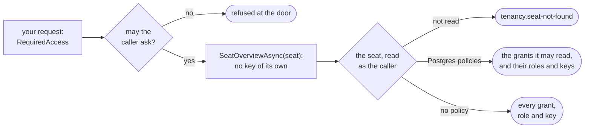

A seat the caller does not read is refused with `tenancy.seat-not-found`, a 404: one of another tenant, one that
does not exist, or one your read rule on the seat class leaves out, and the refusal does not say which.

**Where no policy applies, your request is the only rule.** On another database, SQLite or SQL Server say, or in
a context that runs without row level security, every seat comes with all its grants and keys to whoever the
request lets ask. That is your choice to make, so choose the requirement as the rule you mean: a request that
asks `TenancyAccess.InTenant()` there shows every member everybody's access.

The keys are worked out from the grants that were read, by the rule the rights are written by: an active seat, an
active role, a key the catalogue keeps live, a grant that applies at `AsOf`. They are not read from the rights,
since a database that keeps the rights shows a seat its own alone. So a key is shown where the caller reads the
grant that gives it, a suspended seat holds none, and a role that a filter of yours on the role class hides still
gives its keys, as it does to the access questions; `RoleOf` answers `null` for it. The overview reads what
`WhoAmIAsync` reads, in as many statements, and tracks nothing: what you do to the seat it answers is never saved.

<details>
<summary>Show the code: the sample's request and handler, and a request that leaves it to the policies</summary>

```csharp
// The sample's choice: whoever manages seats for the whole tenant reads another person's roles, in every unit.
public sealed record SeatGrants(SeatId Seat) : IQuery<IReadOnlyList<SeatGrant>>, ITenantsRequest
{
    AccessRequirement IRequireAccess.RequiredAccess => TenancyAccess.ForTheWholeTenant(TenancyKeys.SeatsManage);
}

public sealed class SeatGrantsHandler(ITenancyReads reads) : IQueryHandler<SeatGrants, IReadOnlyList<SeatGrant>>
{
    public async ValueTask<IReadOnlyList<SeatGrant>> Handle(SeatGrants query, CancellationToken cancellationToken)
    {
        // The directory, in a scope of this query's own; it refuses a seat the caller does not read.
        var overview = await reads.AskDirectoryAsync(directory => directory.SeatOverviewAsync(query.Seat, cancellationToken));

        return
        [
            .. overview.Seat.Placements.SelectMany(placement => placement.Grants.Select(grant => new SeatGrant(
                placement.UnitId,
                overview.UnitOf(placement.UnitId).Path,
                grant.RoleId,
                overview.RoleOf(grant.RoleId)?.Name ?? string.Empty,
                grant.StartsAt,
                grant.EndsAt,
                grant.AppliesAt(overview.AsOf)))),
        ];
    }
}
```

```csharp
// Another application's choice: every member may ask, and on Postgres the policies decide what each one reads.
// Elsewhere this shows every member everybody's access.
public sealed record PersonPage(SeatId Seat) : IQuery<PersonCard>, IShopRequest
{
    AccessRequirement IRequireAccess.RequiredAccess => TenancyAccess.InTenant();
}
```

```http
GET /tenancy/seats/c0000000-0000-4000-8000-000000000102/grants
Authorization: Bearer <maud's token>
Tenant: harbor
```

The route sends `SeatGrants` and answers one row per grant of Rhea's: her Area manager role at North. The
administration's GraphQL schema has the same as `seatGrants(seatId:)`.

</details>

## Who may give a role

Holding `tenancy.grants.manage` at a unit is enough to give roles there. Its holder gives any active role
of the tenant that manages no access to a seat placed there or below, and takes it away again, without holding
the role's keys. Someone in HR gives a developer the developer's role without being a developer.

A role manages access when it holds a key that gives power over other people's access. Such a role stays
contained:

- It is given, and taken away, only by a seat that holds each of its keys that manage access at that unit,
  granted there or above it, for at least as long as the grant runs: until the grant's end, or for good when it
  has none, so a seat that manages seats for a week does not give a role that manages seats for good. The
  refusal is `tenancy.grant-exceeds-own`, and its `Missing` argument names the keys that manage access the
  seat lacks there, or lacks for long enough. The role's other keys are not counted.
- Nobody gives themselves one, whatever they hold: `tenancy.self-appointment`, decided before any of the
  role's keys is counted.

This is containment, and everything this section says about roles and keys that manage access is part of it. It
is on unless you turn it off, which [Containment, on or off](#containment-on-or-off) weighs: then a role that
manages access goes as one that manages none, down the flowchart's branch for those below, and what this
section says of those holds for every role.

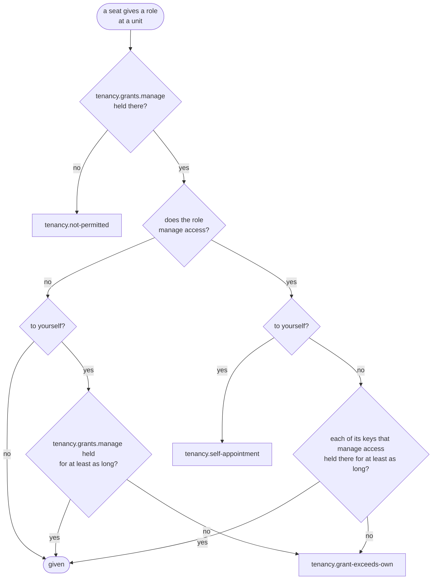

<details>
<summary>Show the code: giving a role, and reading a refusal</summary>

```csharp
// SeatCommands is registered with Tenancy. It finds the calling seat itself,
// and decides as above before it saves.
public sealed class RoleDesk(TenancyUseCases.SeatCommands seats)
{
    public Task GiveAsync(SeatId seat, OrganizationUnitId unit, RoleId role, DateTimeOffset? until, CancellationToken cancellationToken)
        => seats.GrantAsync(seat, unit, role, until, reason: null, cancellationToken);
}
```

```csharp
try
{
    // No end: the role is given for good
    await desk.GiveAsync(seat, unit, role, until: null, cancellationToken);
}
catch (RefusalException refusal) when (refusal.Code == TenancyRefusals.GrantExceedsOwn)
{
    // The keys that manage access the caller lacks there, or lacks for long enough
    var missing = refusal.Arguments["Missing"];
}
```

</details>

The rest holds for every role: the key is asked for at the unit and reaches everything below it, the last
administrator stays, nothing is given at an archived unit, only active roles of the same tenant are given, and
a grant a seat makes starts now. System work in a tenant is held to none of this.

**Which keys manage access.** Tenancy's keys all do, but the one that reads the
[access history](#access-history). Mark your own where you declare them, and any
key, a module's included, in your part of the catalogue. The sample's host marks two keys its Projects module
declares:

```csharp
public static ApplicationCatalogue Application { get; } = new(
    Packs: [/* ... */],
    AccessManagingKeys: [ProjectKeys.ChangeOwner, ProjectKeys.ManageCrew]);

// A key of your own, marked where it is declared
new Permission("widgets.assign", "Widgets", "Hand widgets to people", ManagesAccess: true);
```

Mark a key when it should be given only by someone who holds it. Go through your keys with this list, and
mark every key that:

- gives power over roles, grants, placements, seats or the tree;
- decides who works on what, such as managing a project's crew, or names an owner;
- reaches credentials, or lets support staff into a tenant.

A key whose power reaches no further than the keys of roles that manage no access may stay unmarked. The built
catalogue lists the marks in `AccessManagingKeys`, and shows each one on its key in `Permissions`. A key that
manages no access may not imply one that does, so what a role is labelled with is what it holds.

Then pin the set with a test: one that holds the built catalogue's `AccessManagingKeys` to the keys written
out, one by one. A mark added or dropped then fails a test until somebody decides it, and never goes in as the
side effect of a key being added somewhere.

<details>
<summary>Show the code: the sample's test of its marks</summary>

```csharp
// ApplicationRuleScenarios.cs in the sample's tests
[Fact]
public async Task The_keys_that_manage_access_are_exactly_these()
{
    await using var host = await sample.StartAsync();   // a host from the class's fixture, on Supabase's Postgres image

    host.Services.GetRequiredService<TenancyCatalogue>().AccessManagingKeys.Should().BeEquivalentTo(
    [
        "tenancy.settings.manage",
        "tenancy.units.manage",
        "tenancy.seats.manage",
        "tenancy.grants.manage",
        "tenancy.roles.manage",
        "projects.owner.change",
        "projects.crew.manage",
    ]);
}
```

</details>

Marking is opt-in, so a forgotten mark fails open: a key nobody marks is given by every grants manager, to
anyone placed where they hold `tenancy.grants.manage`, themselves included. An application that marks none of its keys
hands every role but those holding one of Tenancy's keys that manage access to its grants managers, so go
through your keys and mark the ones that give power over access before anyone manages grants. The marks rule
the organization's grants,
which Tenancy gives. A module that gives keys through grants of its own, as a crew role gives its keys on one
project, answers for a marked key it gives that way: give it no further than the giver reaches with it, or
contain it the same way. The sample's crews give `projects.crew.manage` on one project only, and only from
whoever manages that project's crew already.

Marks are read when a role is given or taken away, and nothing checks the grants that exist when a mark
changes. Change marks with every instance of the application restarted before anyone grants again. Taking
a marked key out of retirement marks it anew.

**Giving yourself a role.** A seat gives itself a role that manages no access, for no longer than it holds
`tenancy.grants.manage` there, so a seat that manages grants for a week does not give itself a role for good.
Grants to anyone else run for as long as the giver says. Nobody places themselves (`tenancy.self-assignment`),
so a seat gives itself roles only where someone else placed it.

**Taking a role away.** Taking away follows giving: a role that manages no access goes with
`tenancy.grants.manage` alone, and one that manages access needs its keys that do, until at least the end of
that grant. A seat's own grant that applies now is its own hold of those keys, so a seat may take away its
current roles; one that has ended, or is still to start, holds nothing, and taking it away needs the keys like
anyone else's. An archived role manages nothing. Withdrawing a placement takes its grants with it, so the
caller needs `tenancy.seats.manage` and, when the placement has grants, `tenancy.grants.manage`, and each
grant is checked against its own end. The last administrator stays in every case.

**Suspending, deactivating and reactivating a seat.** A seat's status decides whether its grants count, so
these take away, or give back, every grant of the seat that has not ended. Besides `tenancy.seats.manage` for
the whole tenant, each grant of a role that manages access needs its keys that do, held by the caller at that
grant's unit until at least its end, as taking the role away would: `tenancy.grant-exceeds-own`, naming the
keys the caller lacks. A grant that has ended gives nothing either way, and is not counted; one still to start
is. A seat may suspend or deactivate itself: its own grants that apply now are its own hold. It
never reactivates itself, because a suspended seat acts as nobody. The last administrator stays.

**Moving a unit.** A move changes which grants reach the unit and everything below it: those at the units
above the old parent and not above the new one stop reaching it, and those above the new parent and not above
the old one start to. Besides `tenancy.units.manage` at both parents, the mover is held to the rules for giving
and taking away over what the move changes, each grant that has not ended counted at the unit that moves,
against its own end, one still to start included:

- The move gives the mover nothing: every key its own grants on the new side would give it there, it holds at
  the unit already, for at least as long.
- It gives or takes away a key that manages access, from anyone, only when the mover holds that key at the
  unit until at least the end of the grant it comes from, or for good for a grant with no end.

The refusal is `tenancy.grant-exceeds-own`, with no `Role`, and `Missing` naming the keys. Keys that manage no
access follow a move freely for everyone but the mover, as a role holding only them is given freely. An
administrator whose role holds every key moves any unit. One whose pack lists its keys holds every key that
manages access at the root, so no move is refused it over what it gives or takes away from someone else; a
grant of its own below the root still counts, and a move that would give it a key from there that its role at
the root lacks is refused like any other seat's.

**Changing a role that manages access.** Adding a key that manages access to a role, taking one out, or
archiving a role that holds one takes an administrator: a seat that holds `tenancy.roles.manage` at the root
with no end; anyone else is refused with `tenancy.grant-exceeds-own`, naming `tenancy.roles.manage`. An added
key reaches every seat that holds the role, seats that gave themselves the role included, so look at who holds
a role before you add one. A key taken out, or a role archived, goes from every holder at once, which an
administrator for a week could not do grant by grant. Each grant records who gave it, in `RoleGrant.GrantedBy`
and in the `OrganizationRoleGranted` event, and a change of a role's keys names the keys that came in and
went out, in the `RoleKeysChanged` event.

What that means for a tenant:

- Trust `tenancy.grants.manage` with every role that manages no access where it is held, the holder's own
  included.
- Two people who manage grants can give each other roles. Containment still holds for the roles that manage
  access.
- Tenancy knows one person per seat. Someone who can add a seat for another account of their own, or has
  help from someone who can, gives that seat what they could not give themselves, within what containment
  allows them anyway.
- A role holding only `tenancy.grants.manage` manages access, so grants managers give it to one another, and
  never to themselves.
- A move gains the mover nothing, and gives or takes away from nobody a key that manages access that the
  mover could not give or take away at the unit. A seat that manages a region for a week neither keeps its
  units for good by moving them under a region it manages for good, nor moves a unit away from, or under,
  someone who holds a role that manages access there for good.

## Containment, on or off

Containment is the rule of [the section above](#who-may-give-a-role) for keys that manage access: a seat hands
one on only where it holds it itself. Tenancy keeps it unless you turn it off. Who may give your users what is
a choice about your product, and this rule is part of the access model rather than something that keeps your
data sound, so it is a setting of your catalogue: `ContainAccessManagingKeys`, on by default.

**What it does.** Ben holds `tenancy.grants.manage` at Pier 7, a unit of Harbor Works, for good, through a role
that holds that key alone. He gives anyone placed at Pier 7 a role that manages no access, a surveyor's say,
himself included. He gives nobody a role that holds a key that manages access he does not hold there: not an area
manager's, which holds `tenancy.units.manage` and `tenancy.seats.manage`, and not the administrators', which holds
`tenancy.roles.manage`. And he gives himself no role that manages access at all. So Ben cannot give himself
`tenancy.roles.manage` at the root, or anywhere: what he hands on is the grants key, and no more. The same rule
holds for every other way a key that manages access changes hands:

- taking a role away, and withdrawing a placement that has one;
- suspending, deactivating or reactivating a seat that holds one;
- putting such a key into a role, taking one out of it, or archiving a role that holds one, which only an
  administrator does;
- moving a unit, which gives or takes away such a key from nobody where the mover does not hold it.

**What turning it off means.** A role or a key that manages access then goes as one that manages none, and the
rules above are asked of a seat no more. Ben gives himself the administrators' role at Pier 7, and from then on
manages everything at and below it: its units, its seats, its grants and every key of every module. A seat with
the grants key at the root gives itself the administrators' role there, and a seat that manages roles for the
whole tenant puts every key into every role, its own included. Anyone who holds a key that manages access can
hand out every key, so in practice is an administrator of everything that key reaches. Turn it off when that is
what you want, or when your own handlers decide who may give what, by rules of your product.

**What it does not touch.** Turning it off changes nothing else:

- Roles that manage no access go as they always do, with `tenancy.grants.manage` at the unit, and every role now
  goes that way. So a seat still gives itself a role, any role now, for no longer than it holds
  `tenancy.grants.manage` there: had Ben the grants key for a week, he would give himself the administrators'
  role for that week, and not for good. And a move still gives the mover nothing.
- Each command still asks its key where it acts. Ben gives no role outside Pier 7 and the units below it, since
  he holds the grants key there alone; that he gives none at the root is this, and not containment.
- A tenant keeps an administrator: the last one is never taken away, in C# or in the database.
- A seat keeps its identity and its tenant, whoever asks ([What the database guards on a seat](#what-the-database-guards-on-a-seat)).
- Which keys manage access stays as you marked them: `AccessManagingKeys` and `ManagesAccess` answer the same.

**The one question that decides it.** Can your database be reached without your handlers, for instance through
Supabase's Data API? Then leave it on. Your handlers are the only place a product rule of your own can say who
may give what, and a client that talks to the database directly goes past them. With containment on, the
database still refuses that client a role that manages access at a unit where it lacks that role's keys, any
such role to itself, such an invitation, and stopping a seat whose such grants it could not take away; how long
a grant runs, a change of such a key in a role, and moves are asked by the use cases alone
([What stays in C#](#what-stays-in-c)). With it off, a grants manager there hands out every role.

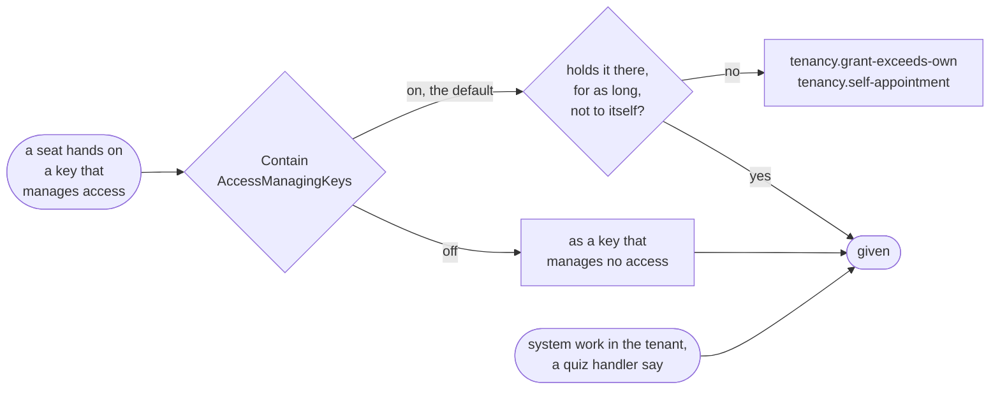

Containment is about a seat handing keys on, never about your application. System work in a tenant holds every
key there and is not held to it, on or off. So an application that lets a manager earn a role that manages
access, by passing a quiz say, keeps containment on: its own handler checks the quiz, which Tenancy knows nothing
of, and then gives the role inside `TenancyUseCases.BeginSystemIn(tenant, seat)`, for the seat that passed. The grant records no
seat as its giver, and its event records the system, acting for that seat.

System work gives whatever it is told, so what it is told comes from your application, never from the request.
The handler below takes the tenant and the seat from the caller, refusing anything that is not a seat, and the
role and the unit from the quiz's own record: the request names the quiz and carries the answers, nothing more.
A handler that took a role or a seat from its request would give whoever passed the quiz whatever they named,
the administrators' role at the root included.

The setting is one line of your part of the catalogue, and leaving the line out keeps it on. The host reads it
from `TenancyOptions.Catalogue`, and the export from the same part, which you mark `[TenancyCatalogue]`
([Setting it up](#setting-it-up)), so the two cannot disagree. The export writes it into the access files with the
rest of the catalogue: on Postgres the policies on the grants and the
invitations, and the trigger on a seat's status, ask `key_is_contained(key)`, which answers the keys that manage
access while containment is on and none once it is off. The start-up check `tenancy.policies-in-place` compares
that function with the catalogue the host runs with, and refuses a database written with containment the other
way round, saying which way each one is. So after changing the setting, export the access files and apply them
before the host starts. Grants made while it was off stay when you turn it back on: containment is asked when a
role is given or taken away, and nothing checks the grants that exist.

<details>
<summary>Show the code: turning containment off, and a quiz handler that keeps it on</summary>

```csharp
// Your part of the catalogue, with containment off: the host hands it to TenancyOptions.Catalogue, and the export
// writes the policies from it because it is marked. Leave the last line out to keep containment on.
public static class ShopCatalogue
{
    [TenancyCatalogue]
    public static ApplicationCatalogue Application { get; } = new(
        Packs: [/* ... */],
        AccessManagingKeys: [ProjectKeys.ChangeOwner, ProjectKeys.ManageCrew],
        ContainAccessManagingKeys: false);
}
```

```csharp
// Your own handler, with containment on. The request names the quiz and carries the answers. Who passed is the
// caller, and what passing gives is the quiz's: system work gives whatever it is told, so a client chooses neither.
public sealed class QuizDesk(TenancyUseCases.SeatCommands seats, IQuizzes quizzes)
{
    public async Task PassAsync(QuizId quizId, QuizAnswers answers, CancellationToken cancellationToken)
    {
        if (TenancyUseCases.CurrentCaller() is not { Kind: TenancyCallerKind.Seat, Tenant: { } tenant, Seat: { } seat })
        {
            throw QuizRefusals.Refuse(QuizRefusals.SeatsOnly);
        }

        var quiz = await quizzes.FindAsync(quizId, cancellationToken) ?? throw QuizRefusals.Refuse(QuizRefusals.NotFound);
        if (!quiz.Passes(answers))
        {
            throw QuizRefusals.Refuse(QuizRefusals.NotPassed);
        }

        // The role and the unit are the quiz's own, which an administrator set when making it.
        using (TenancyUseCases.BeginSystemIn(tenant, seat))
        {
            await seats.GrantAsync(seat, quiz.Unit, quiz.Role, until: null, reason: "passed " + quiz.Name, cancellationToken);
        }
    }
}
```

</details>

## Invitations

A seat belongs to a verified identity, so somebody who has no account yet cannot be given one. An invitation
holds their place until they have: it is issued for an address, into a unit, with a role and, if you like, an
end for that role's grant. Issuing makes nothing but the invitation. The seat, its primary placement in the
unit and the grant are made when the person accepts, in one save.

Invitations are a part of the package you add when you want it: one more class of your own, one more call in
the context and one in the registration. A host that leaves them out has no table for them.

```csharp
// Shop.Tenants.Contracts
[EntityId<Guid>] public readonly partial record struct InvitationId;

// Shop.Tenants
[InvitationAggregate<InvitationId>] public sealed partial class ShopInvitation;

// In the context, after AddTenancy: two tables, the invitations and the digests of their tokens.
modelBuilder.AddTenancyInvitations<ShopInvitation, InvitationId>();

// In the registration, after AddTenancy. A new invitation's id is InvitationId.Create(), as every id's is.
services.AddTenancyInvitations<ShopInvitation, InvitationId, ShopTenancyContext>();

// In the outbox, next to AddTenancyDomainEvents.
outbox.AddTenancyInvitationEvents<InvitationId>();
```

The generated calls take your invitation class and its id, or the id alone, and fill in the rest of your classes. A context
that names its tables itself passes the same `TenancyTableNames` to `AddTenancyInvitations` as to `AddTenancy`.
Adding invitations to a database that is in use is a migration of your own for the two tables, and on Postgres
a new export of the access files.

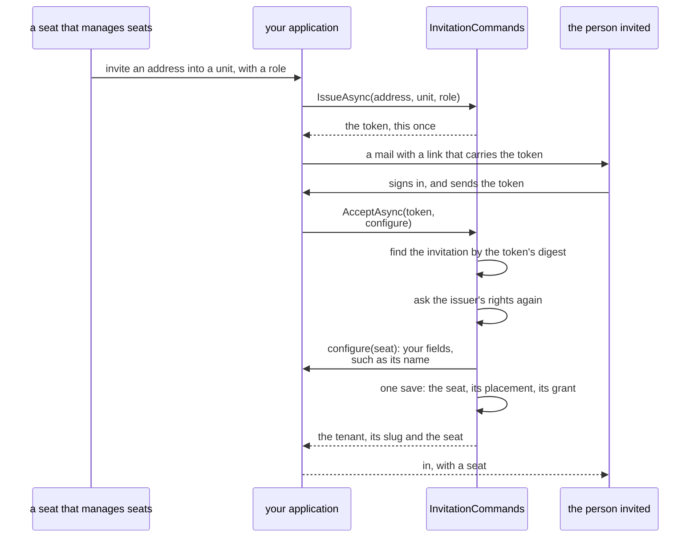

<details>
<summary>Show the code: issuing an invitation and mailing it, and the route that accepts one</summary>

```csharp
public sealed class InviteColleague(TenancyUseCases.InvitationCommands<ShopInvitation, InvitationId> invitations, IShopMail mail)
{
    public async Task HandleAsync(string address, OrganizationUnitId unit, RoleId role, CancellationToken cancellationToken)
    {
        var issued = await invitations.IssueAsync(
            address, unit, role, grantUntil: null, lifetime: null, cancellationToken);

        // The token is returned this once. In the fragment of a link it reaches the page and no server's log.
        await mail.SendAsync(address, $"https://shop.example/join#{issued.Token}", cancellationToken);
    }
}

// What the page calls once the person has signed in. The request names no tenant: the token does. The name the
// person gives is a field of your seat class, set in the callback before anything is saved.
app.MapPost("/invitations/accept", async (
    AcceptInvitation request,
    TenancyUseCases.InvitationCommands<ShopInvitation, InvitationId> invitations,
    CancellationToken cancellationToken) =>
{
    var accepted = await invitations.AcceptAsync(request.Token, verifiedAddress: null, cancellationToken,
        configure: seat => seat.Rename(request.DisplayName));
    return Results.Ok(new { tenant = accepted.Slug });
});
```

</details>

`ListOpenAsync` answers the invitations that can still be accepted, and `CancelAsync` ends one.

**Who may issue one.** An invitation offers what adding a seat, placing it and giving it a role would give, so
issuing takes what those take: `tenancy.seats.manage` for the whole tenant, `tenancy.grants.manage` at the
unit, and the rule of [who may give a role](#who-may-give-a-role). A role that manages no access is offered
freely. A role that manages access is offered only by a seat that holds each of its keys that manage access
at the unit, until at least the end of the grant. System work in the tenant issues one too, and is held to no
seat. An invitation is listed for, and cancelled by, the seats that hold `tenancy.seats.manage` at its unit,
whoever issued it; to any other seat it is not found.

**It never gives more than its issuer could give when it is used.** Accepting asks the issuer's rights again,
as they are at that moment and with the role as it is then. An issuer who was suspended since, lost a key, or
could no longer give what the role has become leaves the invitation unusable: `tenancy.invitation-unbacked`,
one answer that tells the person who accepts nothing about the issuer's keys. The unit and the role have to be
active still, and the tenant too.

**Who accepts.** A signed-in person: the toolkit's own caller, with a verified identity, a token role that
[holds seats](#how-the-tenant-reaches-a-policy), and no anonymous sign-in. They need no
seat and name no tenant. The use case reads the caller itself, finds the invitation by the token, and does the
rest as system work inside the invitation's tenant, for the seat that issued it: that seat is who the grant
keeps as its giver, and the events name the system acting for it. The answer is the tenant, its slug for the
next request, and the new seat. Nobody invites themself into a role: an identity that has a seat in the tenant
is refused with `tenancy.identity-has-seat`.

**What the seat is called is yours.** An invitation suggests no name, since a seat has none in Tenancy. The
fields your seat class adds, a name it is shown by among them, are set by `configure`: it is handed the new seat
once the invitation holds, the seat is placed and holds the role, and before the invitation is marked as
accepted and anything is saved. A callback that throws, your own rule refusing a blank name say, accepts
nothing: the invitation stays open for another try. It is not run for an invitation the same person accepted
before, which answers the seat it made then.

**The address finds nobody.** The package sends nothing to it and looks nobody up by it; it is what the people
who manage seats recognize the invitation by, and it is forgotten as soon as the invitation is accepted or
cancelled. If your application knows the address its identity provider verified for
the caller, pass it as `verifiedAddress` and an invitation for another address is refused with
`tenancy.address-mismatch`. It only narrows. Left `null`, whoever holds the token and is signed in accepts,
which is what a link in a mail amounts to.

**It ends, and works once.** An invitation stays open for `DefaultLifetime`, seven days, or the `lifetime` you
pass, between `MinLifetime` and `MaxLifetime`, and a grant it offers has to end later than it does. Whether it
is still open is decided from the clock when it is used, so nothing has to mark it. The same person sending
the token again is answered the seat they have; anybody else is told it was used. Two acceptances at the same
moment are kept apart by the save: one is saved, and the other fails with `ConcurrencyConflictException`, as any
save that came second does, and is answered what the first made of it when it is sent again.

| Code | Kind | When |
|---|---|---|
| `tenancy.invitation-not-found` | Not found | No invitation has this token, or the text is no token; and for a seat that does not manage seats at its unit |
| `tenancy.invitation-lapsed` | Conflict | Its time ran out |
| `tenancy.invitation-used` | Conflict | Somebody else accepted it |
| `tenancy.invitation-cancelled` | Conflict | It was cancelled |
| `tenancy.invitation-state` | Conflict | Cancelling one that was accepted or cancelled already |
| `tenancy.invitation-unbacked` | Conflict | Its issuer may no longer give what it offers |
| `tenancy.address-mismatch` | Not permitted | It is for another address than the caller's verified one |
| `tenancy.address-invalid`, `tenancy.invitation-lifetime`, `tenancy.invitation-grant-ends-first` | Invalid | The address, the lifetime or the end of the grant, each with its [`Field`](#refusals-in-english-and-dutch) |

**The token.** `BearerTokens.New()`, in the toolkit's core, makes it: 32 random bytes as 43 characters that fit
a link, and their SHA-256 digest. Only the digest is stored, in a table of its own next to the invitations, and
an invitation is found by the digest of the token somebody sent; a text that is not written exactly as a token
is written has no digest, and is never looked up. 256 random bits cannot be guessed, so guessing needs no rate
limit of its own, and their digest cannot be turned back into them, so it needs no salt. The token is in no
event, no refusal and no log of the package, and a record that holds it does not print it. Keep it out of a
query string as well, which servers and proxies write down: it travels in a request's body, or in the fragment
of a link. The helper is yours to use for a link of your own:

```csharp
var made = BearerTokens.New();                          // made.Token goes to the person, made.Digest into your table
bool theirs = BearerTokens.Matches(sent, storedDigest); // compared in constant time
```

**Events.** `tenancy.invitation-issued`, `tenancy.invitation-cancelled` and `tenancy.invitation-accepted`, each
with [who acted](#access-history) and with ids only, never the address. Accepting also raises what making the
seat raises: `tenancy.seat-added`, `tenancy.seat-placed` and `tenancy.organization-role-granted`, which the
access history keeps.

**On Postgres**, [the second lock](#on-postgres-the-second-lock) holds the same lines for a query that forgets
them. An invitation is read by the seats that manage seats at its unit, added by a seat that could add the
seat and make the grant itself, and changed by a seat to cancelled and nothing else; what it offers is fixed
for every role by a trigger, the tables' owner included. The digests are read by no caller's role, an
operator's and the scoped system role's included: whoever issues an invitation adds its row in the same
transaction, and one function, `invitation_of_digest`, answers which invitation a digest is for, as ids, to
Tenancy's own system work alone. That is how accepting finds the tenant before any tenant is known. The
start-up checks cover both tables and the function.

## Languages

Tenancy keeps no language. Which language a tenant works in and which a person reads are fields of your own
tenant and seat classes, because which languages an application offers is the application's to say. The
package phrases its refusals in the two languages it ships, and takes a language where it makes a text that
stays: the name of a role. Its own administrators' pack, for a catalogue that declares none, comes in those two
languages as well.

### Refusals in English and Dutch

Every code of `TenancyRefusals` has an English text, which is the refusal's own message, and a Dutch one.
Add the package's resx to the localizer and a refusal reaches its reader in their language
([Localization](localization.md)):

```csharp
services.AddLocalization();
services.AddDDDToolkitLocalization(options => options.AddResource<TenancyFailures>());
```

The Dutch texts have no word for the reader. Dutch makes a writer choose between a familiar and a formal
word for "you", and that choice is the application's, so a Dutch text says what is the case or what is
needed: "Hiervoor is het recht tenancy.seats.manage nodig." An application that wants another tone, or that
calls a tenant an organization, adds a resx of its own with the keys it says differently, before
`TenancyFailures` and in every language it supports. The localizer asks its sources in the order they were
added, and each falls back to its own neutral file first, so a key in your neutral resx alone would give
Dutch readers your English text. A third language is the same recipe with every `tenancy.*` key.

A refusal of the kind "invalid" that is about one input names it in its `Field` argument, in the word the
use cases call that input by, so a form puts the text under it:

| Code | `Field` |
| --- | --- |
| `tenancy.name-invalid` | `name` for the name of a tenant, a unit or a role, `description` for a role's, `reason` for a reason. `What` says which of the five it is. A seat has no name in Tenancy: one your seat class keeps is refused by your own rule, under your own code |
| `tenancy.invalid-slug` | `slug`. A slug is a value object, so this one arrives as a validation failure with the same code and argument |
| `tenancy.invalid-period` | `until` |
| `tenancy.reason-required` | `reason` |
| `tenancy.unknown-permission`, `tenancy.keys-not-normalized` | `keys` |
| `tenancy.identity-required` | `identity` |
| `tenancy.too-many-ids` | `ids` |
| `tenancy.page-size-invalid` | `size` |
| `tenancy.cursor-invalid` | `after` |
| `tenancy.address-invalid` | `address` |
| `tenancy.invitation-lifetime` | `lifetime` |
| `tenancy.invitation-grant-ends-first` | `grantUntil` |

An edge whose input has another name maps the word: a request body that calls the end of a grant something
else puts the text of `until` under its own field. `tenancy.tenant-required` names no field: a request names
its tenant beside the command, in a header or in its address, and its text says only that the request names
none.

### Roles in the tenant's language

The catalogue declares each pack once, with one name and one description, and a tenant's roles are copies
of the packs. So that a Dutch tenant does not get its roles named in English, implement `IRolePackTexts`
over your own resources and register it:

```csharp
public sealed class ShopPackTexts(IStringLocalizer<ShopPacks> texts) : IRolePackTexts
{
    public (string Name, string Description)? For(RolePack pack, CultureInfo culture)
    {
        using (CultureScope.Use(culture))
        {
            var name = texts[pack.Key + ".name"];
            return name.ResourceNotFound ? null : (name.Value, texts[pack.Key + ".description"].Value);
        }
    }
}

services.AddSingleton<IRolePackTexts, ShopPackTexts>();
```

The use cases ask it whenever they make a role from a pack, in the language you pass:

- `TenantToProvision.Language`, when a tenant is provisioned. `ConfigureTenant` is where your tenant class
  takes the same language as its own field
  ([How your classes add behaviour](#how-your-classes-add-behaviour)).
- The `language` of `ChangeShapeAsync`, when a change of shape copies the packs the tenant has no copy of
  yet. The roles it has already keep their names.

Without a language, without registered texts, or where `For` answers `null`, a role gets the catalogue's
texts. The texts are chosen once. Afterwards the role is the tenant's own, renamed like any role, and a
tenant that changes its language later keeps its roles' names. A role that [follows its pack](#packs-after-provisioning)
follows it in its keys alone: its name and description stay the tenant's. A translated name is checked like any role's
name: blank or too long is `tenancy.name-invalid`, and a name another role of the tenant has, ignoring case,
is `tenancy.role-name-taken`. A tenant holds a copy of every pack seeded for its shape, and a flat tenant that
turns hierarchical is given the packs seeded for a hierarchical one next to them, so give every pack a name of
its own in every language.

The [default administrators' pack](#the-administrators-pack), which Tenancy adds when you declare no
administrators' pack, is the package's own, so the package has texts for it: Administrator in English and
Beheerder in Dutch. Your `IRolePackTexts` is asked first, by the key `administrator`; where it answers `null`
for it, or none is registered, its role gets the package's text in the language passed, and the English in a
language the package does not ship. Without a language it is called Administrator, the catalogue's name.
`TenancyCatalogue.Build` refuses a pack of yours named Administrator or Beheerder while it adds the default, so
a tenant in either language never meets the clash. Your own texts it cannot see: a pack your `IRolePackTexts`
calls Beheerder in Dutch collides with the default at provisioning, like any two packs named alike.

## Keeping tenants apart: the filter and the save check

On every database, tenants are kept apart in C#, by two things that `AddTenancy()` puts on Tenancy's own
classes and `ScopeToTenant` puts on yours:

- **The tenant filter.** A query filter that keeps every read to the tenant the current caller acts in, and
  finds nothing for a caller that acts in none.
- **The save check.** An interceptor that refuses to write a row of another tenant, whoever loaded or made
  it, with `tenancy.other-tenant`, before anything is written.

A row never moves to another tenant. `ScopeToTenant` marks the tenant's property as fixed once the row is
there (`IsFixedAfterInsert`), so Entity Framework refuses a save that changed it, after the save check has
refused it first, and [privileges written from the policies](row-level-security.md#privileges-from-the-policies)
leave its column out of `UPDATE`.

The filter has a name, `TenancyQueryFilter.Name`, so a filter of your own on the same class, a soft delete
say, sits next to it instead of replacing it. A read that must look across tenants for the application
skips it by that name, `IgnoreQueryFilters([TenancyQueryFilter.Name])`, and keeps your filters. Yours hides
rows from your reads only. Tenancy still sees them when it writes the rights a save changes, and when it
checks that a slug, a person or a role name is free, because the database sees them too. A seat your
filter hides keeps its rights; suspend or deactivate it to take them away.

The save check is Tenancy's part of a context's options. `AddTenancy` brings it, and `UseDDDToolkit` puts it on
every context it wires, after the toolkit's own interceptors and last of all the parts. There it sees what the
domain event handlers changed, only aggregates that passed their invariants, and every row another part added to
the save; added before, it would check rows that are still to change.

The check goes on every context alike because what decides its work is the model, and the options are built before
the model is. So it asks the model at every save, once per model: in Tenancy's own context it checks the rows and
writes the closure and the rights the save changes, in a module's context it checks the rows `ScopeToTenant` keeps
to a tenant, and in a context with neither it does nothing. No registration lists the contexts Tenancy is for, and
a module added later is kept to the tenant by the same one call.

A context that keeps rows to a tenant cannot do without the save check, and its model says so: `ScopeToTenant`
states it ([A part a model cannot do without](entity-framework.md#a-part-a-model-cannot-do-without)). So such a
context without it fails loudly rather than writing unchecked rows, at its first save, before anything is
written: where nothing registered Tenancy, the message names `AddTenancy`, and where the context was given the
base alone, it names `UseTenancy`. Tenancy's store checks its own context before every save as well, and
`TenancyChecks.EnsureWired(context)` checks any other, the order included: the save check before the toolkit's
interceptors is refused too. `AddTenancy` registers it as the [start-up check](startup-checks.md)
`tenancy.contexts-wired`, over every context the host registers, with `tenancy.catalogue-builds` and
`tenancy.unknown-stored-keys`; a host runs them with `services.RunStartupChecks()`. It holds a context configured
with `UseDDDToolkitCore` to the same: such a context takes the save check with `UseTenancy`, after it.

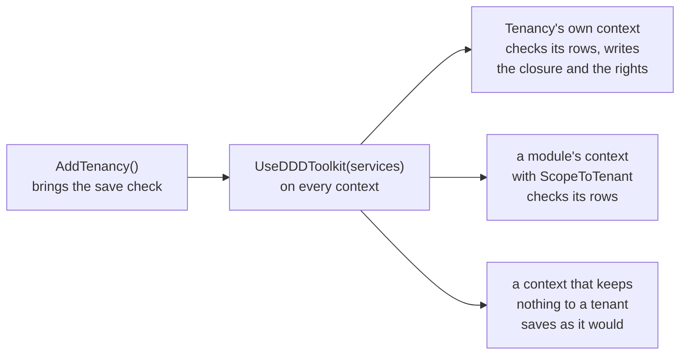

<details>
<summary>Show the code: a module's context, and one that takes the parts one by one</summary>

```csharp
// A module's context that keeps its own rows to a tenant
services.AddDbContext<ProjectsContext>((serviceProvider, options) => options
    .UseNpgsql(connectionString)
    .UseDDDToolkit(serviceProvider));   // the toolkit's interceptors, row level security where it is registered, the save check

// A context that runs as the login role on purpose, where that role may read the tables, and still keeps its rows to a tenant
services.AddDbContext<ReportsContext>((serviceProvider, options) => options
    .UseNpgsql(connectionString)
    .UseDDDToolkitCore(serviceProvider)
    .UseTenancy(serviceProvider));      // after the toolkit's interceptors: EnsureWired refuses it the other way round
```

</details>

A context given the base alone does what the login role may. Where that role owns and holds nothing, as
[a login that owns nothing](row-level-security.md#a-login-that-owns-nothing) asks, the database refuses its first
command; the reads across tenants Tenancy itself needs go through [system work](#system-work) instead.

Both read the caller when they are used: the filter when a query runs, the save check at every save.
Neither keeps anything on a context or in its options. So a context taken from a
[pool](entity-framework.md#contexts-from-a-pool) is kept to the tenant of whoever rented it, for what it
saves as for what it reads, and an instance another tenant's request gave back a moment ago refuses a row
of that tenant like any other. The same call goes in the pool's options, Tenancy's own context included:

```csharp
services.AddPooledDbContextFactory<ProjectsContext>((serviceProvider, options) => options
    .UseNpgsql(connectionString)
    .UseDDDToolkit(serviceProvider));
services.AddScopedFromPool<ProjectsContext>();   // a scope's own context, which a command saves through
```

`TenancyChecks.EnsureWired` passes for a context of the pool as for any other, the scope's own or one
taken from the factory, and Tenancy's store saves through the scope's.

On Postgres, row level security adds a second lock under these two: policies that keep every caller to its
tenant and ask Tenancy's questions as SQL functions, so a query of your own that skips the filter or goes past
Entity Framework still reaches only its tenant. [On Postgres: the second lock](#on-postgres-the-second-lock)
says what it checks, and what it leaves to the use cases.

### System work

Nothing becomes system work by itself: a person reaches Tenancy through a seat. Work nobody asked for in a
request, such as seeding, an import or an operator's command, and work a handler does that no caller of its
request could, such as [provisioning a tenant](#who-may-ask-and-what-the-work-runs-as), is begun on purpose
with `TenancyWork`, and it begins two callers at once, ended together. `TenancyWork`'s methods are generic over
your tenant and seat ids; a project that sees your classes calls the same ones closed over them, through the class
your use cases are named through, and names neither ([Your ids, named once](#your-ids-named-once)):

| | Tenancy's caller | The toolkit's caller |
|---|---|---|
| `TenancyUseCases.BeginSystem()` | system work outside any tenant, which provisions tenants, and reads and writes no tenant's rows | `Caller.SystemIn("tenancy")` |
| `TenancyUseCases.BeginSystemIn(tenant, actingSeat, scope)` | system work in that tenant, holding every key there and nothing anywhere else | `Caller.SystemIn(scope)`, `"tenancy"` unless you pass another |
| `TenancyUseCases.BeginOperator(identity)` | as `BeginSystem`, recorded as the operator a tenant is provisioned for | `Caller.SystemIn("tenancy")` |
| `TenancyUseCases.BeginOperatorIn(tenant, identity, scope)` | as `BeginSystemIn`, recorded as the operator the work is carried out for | `Caller.SystemIn(scope)` |
| `TenancyUseCases.BeginTokenIn(tenant, seat, scope)` | as `BeginSystemIn`, recorded as a link's token and the seat it stands for | `Caller.SystemIn(scope)`, the module's name |

A module that sees only your ids calls `TenancyWork`'s own: `TenancyWork.BeginSystemIn(tenant, seat, "billing")`,
whose ids C# infers from the arguments, or `TenancyWork.BeginSystemIn<TenantId, SeatId>(tenant, scope: "billing")`
where no seat is given.

Neither is the toolkit's `Caller.System`, the application itself, which
[row level security](row-level-security.md#the-scoped-system-role) runs as a role no policy is written for:
past every policy as the login role or a role that bypasses them, or, on Supabase unless the project says
otherwise, as `ddd_system`, which reaches the toolkit's bookkeeping and no module's rows. The scoped system
caller runs as a role that cannot bypass the policies, and they decide what it reaches. The scope says
whose work it is. Work that calls
Tenancy's use cases keeps Tenancy's own; a module's own work in a tenant that only reads Tenancy's rows
next to its own passes its module's name.

Everything about system work is named after the toolkit's caller of the application itself, `Caller.System`,
so one word says it wherever it comes up:

| System work | Spelled |
|---|---|
| the application itself, which no policy is written for | `Caller.System`, on the role `SystemRole` names: on Supabase `ddd_system` unless the project says otherwise, the toolkit's bookkeeping and nothing else; past every policy only on the login role (`system=none`) or a role that bypasses them |
| the application at work in a scope, inside the policies | `Caller.SystemIn(scope)`, on `ddd_system_in` unless the host names another |
| begun in Tenancy, outside any tenant or in one | `TenancyUseCases.BeginSystem()`, `TenancyUseCases.BeginSystemIn(tenant)`: `TenancyWork`'s, closed over your ids |
| a request only it sends | `AccessRequirement.RequiresSystemWork()`, which lets through system work trusted code began and refuses every user with `access.system-only` |

`RequiresSystemWork()` takes system work that was begun on purpose, with `TenancyWork` or with
`Callers.Begin(Caller.System)`. Work nobody began a caller for is refused too, also in a host that does not
[require explicit callers](row-level-security.md#fail-closed-callers), whose accessor answers the application
itself for such work: there, that is the answer a web request gets as well when no accessor knows requests.
It says who may send a request, not where the work acts: it lets system work through in a tenant and outside
any. A handler that acts in a tenant asks Tenancy which one, and Tenancy refuses system work outside any
tenant there, as the sample's `MarkTenantAsDemo` does. Tenancy's own use cases that only system work may call,
provisioning a tenant and suspending, reactivating or closing one, refuse a seat with the same
`access.system-only`. The database roles keep their names: migrations an application applied already grant
them.

```csharp
using (TenancyUseCases.BeginSystemIn(tenant, actingSeat))
{
    await seats.PlaceAsync(seat, unit, primary: true, cancellationToken);
}
```

System work outside any tenant can neither read nor write a tenant's rows: the save check refuses every
one of them with `tenancy.other-tenant`. So provisioning, once it knows the new tenant's id, runs the check
that the slug is free and the save as system work in that new tenant, and writes that tenant's rows and
nothing else.

A few answers are needed before any tenant is known: the keys stored on every tenant's roles, which
`TenancyChecks.UnknownStoredKeysAsync` reports at start-up, and the tenants there are to visit, which
`TenancySystemReads.TenantsToSweepAsync` lists for a round of system work of any module. Each is one query
that answers ids or keys only, as a caller Tenancy begins around that query and nothing more. It runs on a
context of its own, which connects separately unless your contexts share one connection, and outside any
transaction the caller began, so a transaction the caller holds open neither narrows it nor carries the
read's reach into the caller's work. That caller is `Caller.System`, the application itself, where nothing
but the filter holds anyone to a tenant, as on SQLite. With [the second lock](#on-postgres-the-second-lock) it
is scoped system work in no tenant, which asks a function of the database, and nothing of Tenancy's runs as
the application ([below](#the-scoped-system-role-grants-and-reads-across-tenants)). The read's own caller is
begun before its context is taken, so a host that makes a context for whoever is calling makes that one for
the read, and never for the seat the work around it acts as.

Because that context connects separately, ask before you begin a transaction, not inside one. Code that
holds a connection and waits for a second one can end up waiting for itself where the data source has few
to give ([With a context pool](row-level-security.md#with-a-context-pool)). Nothing in Tenancy's use cases
does: they complete on a data source of one connection.

A read of your own that is no seat's and no tenant's, made in the middle of somebody's work, begins
`TenancyCallers.BeginNone()`: nobody is the Tenancy caller until it is disposed, as `Callers.BeginNone()`
does for the toolkit's caller, so the tenant of the work around it does not travel with the read.

```csharp
// A round of a module's own: the tenants to visit, then its system work in each, under its own scope
foreach (var tenant in await TenancySystemReads.TenantsToSweepAsync<ShopTenant, TenantId>(tenancy, "ordering", cancellationToken))
{
    using (TenancyUseCases.BeginSystemIn(tenant, scope: "ordering"))
    {
        await orders.EndWhatHasRunOutAsync(cancellationToken);
    }
}
```

`tenancy` there is Tenancy's context, resolved from your services: it names the context the read makes its
own of, and is not queried itself. The active and the suspended tenants are answered, a closed one is not.

A host that requires explicit callers, `services.RequireExplicitCallers()`, fails work that says nothing
about who it runs as instead of running it as the application; the sample does. See
[Fail-closed callers](row-level-security.md#fail-closed-callers).

## Operators

An operator is one of your own staff, who looks across tenants: support, or whoever provisions and suspends
tenants. An operator is not an administrator of every tenant. It **holds no seat**, in any tenant, and it
**changes nothing itself**.

- **Who is one.** A signed-in user whose token carries a role you list in `TenancyOptions.OperatorTokenRoles`.
  The list is empty until you add one. A token role is never both an operator's and seated: registration
  refuses that, and tenant selection answers nobody for an operator whatever tenant the request names.
- **What it reads.** `TenantDirectory.ListAsync(after, size)` lists every tenant by slug, a page at a time,
  each with its name, its status and how many of its seats are active. Anyone else is refused with
  `tenancy.operators-only`, before anything is read. A request of your own that is an operator's declares
  `TenancyAccess.RequiresOperator()`, and is refused the same way
  ([What a request requires of its caller](#what-a-request-requires-of-its-caller)). A page holds 1 to 200 tenants
  (`tenancy.page-size-invalid`), and the next one is asked with the marker the page before gave
  (`tenancy.cursor-invalid` for anything else). The read runs as the operator, never as the system.
- **How it writes.** It does not. What an operator asks for is carried out by system work that names the
  operator: `TenancyUseCases.BeginOperator(identity)` to provision a tenant, and
  `TenancyUseCases.BeginOperatorIn(tenant, identity)` for work in one. The work holds what system work holds; the
  operator is only who it is [recorded as](#who-changed-a-row). The identity is the verified `sub` of the
  request that asked, taken from the token or from a record that request wrote, never from what a caller sends.

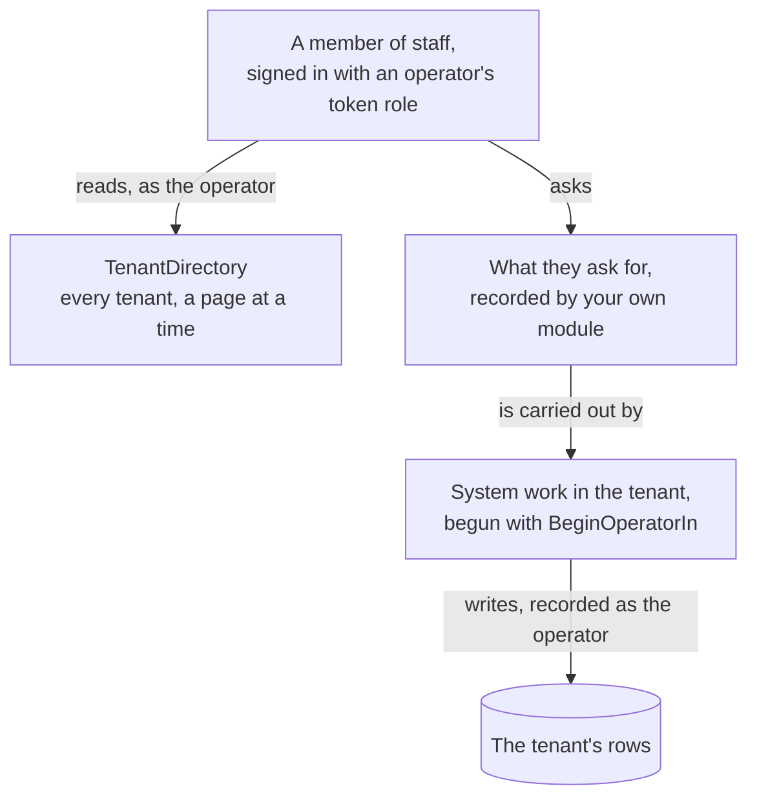

<details>
<summary>Show the code: listing an operator's token role, and carrying out what one asked</summary>

```csharp
// The host: which token roles are operators'
services.AddTenancy<TenancyContext>(options =>
{
    // the catalogue, when you have one
    options.OperatorTokenRoles.Add("operator");
});

// A route of the operators' own: the directory decides who may ask
var page = await tenants.ListAsync(after, size: 50, cancellationToken);

// Carrying out what an operator asked for: system work in the tenant, which names the operator
using (TenancyUseCases.BeginOperatorIn(tenant, operatorIdentity))
{
    await tenantCommands.SuspendAsync("Asked for by the owner", cancellationToken);
}
```

</details>

**On Postgres** an operator reads through a database role of its own. Map the token role to one
(`PostgresRowLevelSecurityOptions.TokenRoles`, or `token:operator=<role>` in `SupabaseRowAccessRoles`), and mark
the token roles you give Tenancy, so the export writes the policies for the same ones:

```csharp
public static class ShopOperators
{
    [TenancyOperators]
    public static IReadOnlyList<string> TokenRoles { get; } = ["operator"];
}

// Where Tenancy is registered
options.OperatorTokenRoles.UnionWith(ShopOperators.TokenRoles);
```

The contribution then writes, for that role:

| On | The role |
|---|---|
| Tenancy's tables, the tables of your entities on them, and the access history | reads every row, in every tenant, and adds, changes and removes none |
| A module's table kept to a tenant | reads what a rule of the module for `RowAccessRoles.Token("operator")` admits, and nothing without one; adds, changes and removes nothing, whatever a rule says |

Without operator token roles nothing is written for them, and a mapped token role nobody called an operator's
stays [closed out](#what-the-policies-check). The role is one of its own: the export refuses an operator's
token role that is mapped to no database role, to the role of a signed-in user, or to a role another token role
shares, since those policies would open every tenant to callers who are no operators.
`EnsurePoliciesAreInPlaceAsync` checks at start-up that the options and the database agree: the options name
the operators for your application, the mark for the database, and with the first alone an operator is answered
an empty directory.

## Who changed a row

A module can keep, on each row of an entity it keeps to a tenant, who wrote it first and who changed it last:

```csharp
modelBuilder.Entity<Project>(project =>
{
    project.ScopeToTenant(row => row.TenantId);
    project.RecordsWhoChanged<Project, SeatId>();   // in Tenancy's own module: project.RecordsWhoChanged()
});
```

That adds six shadow columns, which Tenancy's save interceptor fills in from the Tenancy caller
the save runs as: both sets on a new row, and the last three on a row that changes.

| Who acted | `…ByKind` | `…BySeat` | `…ByIdentity` |
|---|---|---|---|
| A seat | `seat` | the seat | |
| System work that names an operator (`BeginOperator`, `BeginOperatorIn`) | `operator` | | the operator's verified identity |
| System work (`BeginSystemIn`), also when it is done for a seat | `system` | | |
| System work that answers a link's token (`BeginTokenIn`) | `token` | | |

The columns are `CreatedBySeat`, `CreatedByKind`, `CreatedByIdentity`, `ChangedBySeat`, `ChangedByKind` and
`ChangedByIdentity` (`TenancyAttribution`). They are ids, never a name: what a seat is called is asked of the
[directory](#names), by id. Read one with `EF.Property<SeatId?>(row, TenancyAttribution.ChangedBySeat)`. Who
wrote a row first is fixed once the row is there. A row whose own columns did not change keeps who changed it
last; an aggregate with a version changes its row whenever one of its parts changes. Adding the columns to a
table that exists is a migration of your own. In a hierarchy stored in one table, call `RecordsWhoChanged` on
the type at the root, so every row of the table keeps them; the first save refuses a model that calls it on a
derived type alone, as it refuses one that calls it without `ScopeToTenant`.

The same answer goes everywhere a record keeps who acted. Every Tenancy caller that can change something
carries its actor, `TenancyCaller.Actor`, and `AddTenancy` puts an accessor around the toolkit's own
(`TenancyActedByAccessor`), so an [event log](entity-framework.md#an-event-log) says `seat`, `operator`,
`system` or `token` as well, and every domain event of Tenancy's carries the actor itself, as
[`By`](#access-history). Where there is no Tenancy caller, the toolkit's own answer stands. An accessor
of your own is wrapped the same way when it is registered before `AddTenancy`, as a singleton: a scoped one is
refused there. One registered after `AddTenancy` takes the place of Tenancy's, and `TenancyChecks.EnsureWired`
refuses a context that keeps the [access history](#access-history) then, before anything is saved.

> [!IMPORTANT]
> Whoever a piece of work acts for is never put into the toolkit's caller. `Caller.UserId` is always the
> verified `sub` of a token, and system work has none: an operator or a seat it acts for is named by
> `TenancyWork`, and recorded, and gives the work no rights.

**On Postgres** the contribution writes a trigger on every such table, before each insert and update of a
row, which holds callers to themselves:

- a signed-in user writes the kind `seat`, its own seat and no operator's identity, as who changed the row
  and, on a new row, as who wrote it first;
- the scoped system role never writes the kind `seat`;
- neither changes who wrote the row first.

A statement it refuses fails with SQLSTATE `42501`, with the trigger's name and the toolkit's hint, as every
access guard the toolkit writes refuses: a save through Entity Framework that it refuses is refused with
`access.refused` ([When the database refuses](row-level-security.md#when-the-database-refuses)). The save fills
every column itself, though, so the trigger only ever refuses a statement that goes around the model. Such a
statement of your own, an `ExecuteUpdate` say, sets the last three columns itself: a change that leaves another
seat's name on the row is refused too. It is no save, so its refusal reaches you as the `PostgresException`
itself, which `DatabaseRefusal.From` reads as a guard's. A role that is no caller's, the tables' owner in a
migration, is not held: it fills the columns of the rows that were there before them.

## Access history

Tenancy's events that change access can be kept as a history of who changed what: the toolkit's
[event log](entity-framework.md#an-event-log), with the tenant of each event on its row.

```csharp
// Tenancy's context
modelBuilder.AddTenancy(database: Database);
modelBuilder.AddDomainEventOutbox(Database);
modelBuilder.AddTenancyEventLogTable(Database);   // the event log, with a TenantId column of your tenant id

// Where Tenancy is registered, the project that declares your classes or your module's infrastructure project:
// keep the events that change access
options.UseOutbox<TenancyContext>(outbox => outbox
    .AddTenancyDomainEvents()
    .KeepEventLog(log => log.AddTenancyEventLog()));   // both generated there, closed over your four ids
```

`AddTenancyEventLog` keeps every event that changes who may do what, under the name the outbox stores it by:

| About | Events kept |
|---|---|
| The tenant | `tenancy.tenant-provisioned`, `tenancy.tenant-activated`, `tenancy.tenant-suspended`, `tenancy.tenant-reactivated`, `tenancy.tenant-closed`, `tenancy.tenant-shape-changed` |
| A unit | `tenancy.organization-unit-added`, `tenancy.organization-unit-moved`, `tenancy.organization-unit-archived` |
| A seat | `tenancy.seat-added`, `tenancy.seat-suspended`, `tenancy.seat-reactivated`, `tenancy.seat-deactivated`, `tenancy.seat-placed`, `tenancy.seat-withdrawn`, `tenancy.primary-placement-changed` |
| A seat's roles | `tenancy.organization-role-granted`, `tenancy.organization-role-revoked` |
| A role | `tenancy.role-created`, `tenancy.role-keys-changed`, `tenancy.role-archived`, `tenancy.role-followed-its-pack` |

A rename changes nobody's access, so the three events that say the organization, a unit or a role is called
something else are left out: `tenancy.organization-renamed`, `tenancy.organization-unit-renamed` and
`tenancy.role-renamed`. The outbox still stores them. A seat has no name of Tenancy's, so it has no such event;
the sample renames a seat by a command of its own, which keeps no history of it. An event of your own that
belongs in the history is one more `Keep<TEvent>()` next to the call, and `KeepEventLog()` with nothing chosen
keeps every event of the context.

**Every event says who made the change.** Each domain event of Tenancy's ends with `By`: the
[actor](#who-changed-a-row) of the caller whose command raised it, a seat, an operator by its verified
identity, the system with its scope, or a token. So an event about a tenant, a unit or a role is closed over
the seat id as well (`TenantSuspended<TenantId, SeatId>`), and `RoleKeysChanged` also names the keys that came
in, `Added`, and went out, `Removed`, implied keys included, as `RoleFollowedItsPack` does for a role that
[followed its pack](#packs-after-provisioning). The use cases pass their caller's actor. A method
of an aggregate that you call yourself takes it as its last argument, `by`; a tenant, an organization and a
role do not know the seat id's type, so with nobody to name you name the type: `tenant.Activate<SeatId>()`.

Every kept event gets a row in the save that raised it, so a change that rolls back leaves none. The row says
which tenant the event is about, taken from the event, and who acted, as [above](#who-changed-a-row): the
caller of the save, which is the actor a use case puts on its events. An event of your own in that context
that names no tenant gets the tenant the save runs in. The payload is the event as the outbox stores it: ids,
keys and dates, who made the change, and the little else an event says, such as the slug a tenant was
provisioned under, the pack a role was copied from and the reason a tenant was suspended or closed for. It never holds what a tenant, a unit, a seat or a role is called, or why a role was given.

Reading it takes a key of Tenancy's own, **`tenancy.history.view`**, asked for the whole tenant. It manages
no access, so a role that holds it is given like any other. An administrators' pack that lists its keys holds
it, as it holds every key of Tenancy's. The rows are not kept to a tenant by the query filter, because the
toolkit's retention reads the table whole: code that reads the history asks the key and names the tenant.

**On Postgres** the contribution keeps the table to itself, like Tenancy's own. It writes the table's
policies with those of Tenancy's tables, so map the history in the context that calls `AddTenancy`: the export
refuses it in a module's context, where it would be left without a policy.

| Who | Reads | Adds |
|---|---|---|
| A signed-in user | its tenant's rows, with `tenancy.history.view` for the whole tenant | rows about its own seat, the calling one, in the tenant the connection names |
| System work in a tenant | its tenant's rows, in any scope | in Tenancy's own scope, which is the scope Tenancy's events are raised in, as the system, an operator or a token and never as a seat |
| An operator's role | every row | nothing |
| The role of your own bookkeeping, where the export writes privileges and the table lets rows go | every row, to find the old ones | nothing; it removes rows the table's guard lets go |

The policies read a row's columns, the tenant and who acted, and never its payload. The payload is the
application's word, `By` included: the two agree because the use cases put their caller's actor on every
event, not because the database compares them, so where they differ the columns are the ones to trust.

Nobody changes a row, and nobody removes one before its time: the log's
[guard](entity-framework.md#an-event-log) refuses that for every role, the tables' owner included. A seat that
suspends or deactivates itself is still recorded, though it is no calling seat once its row is written: the
person's seat counts as well in the transaction that wrote it, and in no later one.

The [sample](#who-may-do-what-in-the-sample) keeps its history this way, and reads
it [as a list](#an-operator-who-changed-a-row-and-the-history-as-a-list): a route for whoever holds the key
and one for an operator, each with a field in the GraphQL schema.

## Who may do what, in the sample

[`Examples/Tenancy`](../Examples/Tenancy) is a small application on Tenancy: teams that work on projects, which
it calls crews, in two tenants. It has three modules. Tenants declares the application's classes, its
context and its migrations. Projects owns the projects and their crews, and decides who may see and change
one. Inspections records inspections on projects, and asks Projects whether the caller may, through a
contract, without reading Projects' tables.

It runs on Postgres, as Supabase runs it, and on no other database: its AppHost starts Supabase's own
Postgres and Auth images, and [Try it](#try-it) says how. The host logs in as a role that owns nothing, every
table forces its policies, and the privileges are written from them. The tables, policies and roles come from
the files under `Examples/Tenancy/supabase/migrations`, which a program of its own exports
(`Examples.Tenancy.Exporter`), and the host refuses to start while a migration is missing or the
database is not set up as the policies rely on ([the samples' page](../Examples/README.md#on-postgres)). The
choices the sample makes are listed one by one, each with its code, something to try and
its test, under [Design choices and where to see them](#design-choices-and-where-to-see-them).

Each module is a project per layer, in a folder named after the module, and every one of them is the module's:
[`Modules/Directory.Build.props`](../Examples/Tenancy/Modules/Directory.Build.props) declares it for each, from
the folder, rather than a `Module.cs` in each ([A module named by its folder](modules.md#a-module-named-by-its-folder)). The
domain project holds the classes and their rules, in a folder per aggregate. The application project holds the
use cases, each a command or a query with a handler of its own, in a folder per feature; the interface through
which each of them says what it requires of its caller, with the check for the cases that are the module's
own; and the ports they read and save through. The infrastructure project holds the
context, the migrations, the adapters that implement the ports, and the registration of all of that. The API
project holds the routes and the GraphQL fields and types, in the same feature folders, and the module's
entry. `Add{Module}Module` registers the module: it calls the infrastructure project's registration and the
application project's, and adds the module's GraphQL schema when the host serves GraphQL. The routes are
mapped per audience, because the host decides what each group of routes requires: `Map{Module}Module` for
callers with a seat, and `Map{Module}Operations` for the application's own staff. Tenants has two more, for
a person who is signed in and has no seat yet, `MapTenantsSeatsOfMine` and `MapTenantsInvitationAcceptance`,
and `AddTenantsInvitationPage`, with which a host says where its page that accepts an invitation is. So the
host references each module's API project and nothing else of it. Tenants and Projects also have a contracts
project with what the other modules may name;
Inspections publishes nothing, so it has none. Only the infrastructure project names Entity Framework, and
only the API project ASP.NET Core. Projects, for one:

```mermaid
flowchart TB
    Host["Tenancy.Host"]
    subgraph projects ["module Projects"]
        Api["Projects.Api<br/>the module's entry, routes"]
        Infrastructure["Projects.Infrastructure<br/>context, migrations,<br/>EfProjectStore, EfProjectReads,<br/>registration"]
        Application["Projects.Application<br/>commands, queries, access,<br/>the ports IProjectStore<br/>and IProjectReads"]
        Domain["Projects.Domain<br/>Project and its crew"]
        Contracts["Projects.Contracts<br/>ProjectId, keys, IProjectGate"]
        Api --> Application
        Api --> Infrastructure
        Infrastructure --> Application
        Application --> Domain
        Domain --> Contracts
    end
    TenantsIds["Tenants.Contracts<br/>the ids"]
    Inspections["Inspections.Application"]
    Host --> Api
    Domain --> TenantsIds
    Inspections --> Contracts
```

<details>
<summary>Show the code: the module's entry and the two registrations it calls</summary>

```csharp
// Projects.Api: the entry, which the host calls with the starter project roles it declares
public static IServiceCollection AddProjectsModule(this IServiceCollection services, ModuleHost host, IReadOnlyList<StarterProjectRole> starterRoles)
{
    var membership = new ProjectMembership(starterRoles);                        // the projects' rules
    return services.AddProjectsInfrastructure(host, membership).AddProjectsApplication(membership);
}

public static IEndpointRouteBuilder MapProjectsModule(this IEndpointRouteBuilder seated)
    => seated
        .MapOverviewEndpoints()
        .MapLifecycleEndpoints()
        .MapCrewEndpoints()
        .MapOwnershipEndpoints()
        .MapProjectRolesEndpoints()
        .MapAccessEndpoints();

public static IEndpointRouteBuilder MapProjectsOperations(this IEndpointRouteBuilder operators)
    => operators.MapOperatorsEndpoints();

// Projects.Infrastructure: the context on the host's connections, from a pool, and an adapter for each port
host.RequirePostgres().AddContext<ProjectsContext>(services, (application, options) => options
    .UseDDDToolkit(application));   // the toolkit, the caller on every connection, Tenancy's save check
services.AddScoped<IProjectStore, EfProjectStore>();
services.AddScoped<IProjectReads, EfProjectReads>();
services.AddTenancyAccess<TenantId, SeatId, OrganizationUnitId, RoleId, IProjectsRequest, ProjectsContext>();   // Tenancy's check, for this module's requests
services.AddProjectMembershipWithTenancy<ProjectsContext, TenantId, OrganizationUnitId, RoleId>(membership.Rules);   // the crews, by the Membership package
services.AddProjectMemberAccess<IProjectsRequest>();                         // its check, for a key on a project

// Projects.Application: the rules, the check for a key at a unit, and the generated behavior. No keys: the module
// marks their list, ProjectCatalogue.Permissions, with [TenancyPermissions], and the host adds every module's
services.AddSingleton(membership);
services.AddScoped<ProjectAccess>();
services.AddAccessCheck<IProjectsRequest, ProjectsAccessCheck>();
services.AddProjectsAccessBehavior();
```

*[`Projects.Api/ProjectsModule.cs`](../Examples/Tenancy/Modules/Projects/Examples.Tenancy.Projects.Api/ProjectsModule.cs),
[`Projects.Infrastructure/ProjectsInfrastructure.cs`](../Examples/Tenancy/Modules/Projects/Examples.Tenancy.Projects.Infrastructure/ProjectsInfrastructure.cs)
and
[`Projects.Application/ProjectsApplicationServices.cs`](../Examples/Tenancy/Modules/Projects/Examples.Tenancy.Projects.Application/ProjectsApplicationServices.cs),
shortened*

</details>

An arrow is a project reference. The host points at the API project alone. The API project points at the
infrastructure project for its entry alone: `AddProjectsModule` calls `AddProjectsInfrastructure`, and no
route or field names anything of that project, of Entity Framework or a port.
The application project declares two ports and the infrastructure project registers an adapter for each.
A command loads, changes and saves through `IProjectStore`, on the request's context, its unit of work. A
query reads through `IProjectReads`, on a context of its own: the queries of one request may run side by
side, and a context runs one at a time. The access check before any request reads
that way too, and so does a command for what it asks of Tenancy before it changes anything, on one reading for
all of it. A reading takes Tenancy's answers as sets, so the projects a seat may see are still one statement
([Who may do what](#who-may-do-what)), and answers with data, never with an entity. The roles a crew holds are
not Tenancy's: they are project roles, the module's own, kept with the
[Membership package](membership.md), so a command asks about a crew's role of the module's own table, on the
request's context. Each module's contexts come from pools of their own, which `PostgresPools.AddContext`
in the samples' hosting project registers: one on the host's connections for requests and one on those for
background work, a factory over both that picks at each rental, and `AddScopedFromPool`. A read takes a
context for its one query and gives it back, and the request's own is taken from the same factory when the
request first asks for it, and goes back when the request ends.
[`Examples/README.md`](../Examples/README.md#the-tenancy-sample) has every project, and
[Folders inside the layers](modules.md#folders-inside-the-layers) the folders of one module, with why each
is where it is.

A route decides nothing: it makes a command or a query of its arguments and sends it. On its way to its
handler the request passes tracing, then its module's access behavior, which holds it to what the request
itself declares: a key, and the project or the unit the key is held on, taken from the request. The behavior
is the one the toolkit's generator writes for the module's request interface
([What a request requires of its caller](#what-a-request-requires-of-its-caller)); it asks the checks the
module registered, and the one that decides the case answers. Here leo closes Pier 7:

```mermaid
sequenceDiagram
    participant Route as Route, ISender,<br/>tracing
    participant Behavior as ProjectsAccess<br/>Behavior
    participant Check as MemberAccess<br/>Check
    participant Handler as CloseProject<br/>Handler
    participant Store as IProjectStore

    Route->>Behavior: Send(CloseProject),<br/>in one activity
    Behavior->>Check: a key on a project
    Check->>Check: IMemberQuestions:<br/>projects.close<br/>on Pier 7? held<br/>through the crew,<br/>at version 7
    Check-->>Behavior: met
    Behavior->>Handler: checked
    Handler->>Store: LoadAsync(Pier 7,<br/>If-Match)
    Store-->>Handler: the project, tracked
    Handler->>Handler: project.Close()
    Handler->>Store: SaveAsync()
    Handler-->>Route: done
    Route-->>Route: 204
```

<details>
<summary>Show the code: the route, the command it sends, the module's one line, the check and the handler</summary>

```csharp
// Lifecycle/Rest/LifecycleEndpoints.cs in Projects.Api: the route only sends
group.MapPost("/projects/{id}/close", async (ProjectId id, HttpRequest request, ISender sender, CancellationToken cancellationToken) =>
{
    await sender.Send(new CloseProject(id, ProjectVersions.Expected(request)), cancellationToken);   // the If-Match header, when there is one
    return Results.NoContent();
});

// Lifecycle/Commands/CloseProject.cs in Projects.Application: the command says what it requires of its caller
public sealed record CloseProject(ProjectId Id, long? ExpectedVersion = null) : ICommand, IProjectsRequest
{
    public const string RequiredKey = ProjectKeys.Close;

    AccessRequirement IRequireAccess.RequiredAccess => MemberAccess.On(RequiredKey, Id, ExpectedVersion);   // the Membership package's case
}

// Access/IProjectsRequest.cs: the one line ProjectsAccessBehavior<TMessage, TResponse> is written from
[AccessRequests]
public interface IProjectsRequest : IRequireAccess;

// MemberAccessCheck, the Membership package's, which AddProjectMemberAccess<IProjectsRequest>() adds: the check
// for a key on a project. What it read it keeps with the request, for the expert hold; the handler takes none of it.
case MemberAccess<ProjectId>.On required:
{
    var hold = await access.RequireAsync(required.Resource, required.Key, cancellationToken);

    // Only now, with the project seen and the key held, is the version the caller read compared
    if (required.ExpectedVersion is { } expected && expected != hold.Version)
    {
        throw new ConcurrencyConflictException(typeof(Project), required.Resource);
    }

    kept.KeepFor(request, hold);
    break;
}

// CloseProject.cs again: the handler loads the project its command names, calls the domain, and saves
public sealed class CloseProjectHandler(IProjectStore store) : ICommandHandler<CloseProject>
{
    public async ValueTask<Unit> Handle(CloseProject command, CancellationToken cancellationToken)
    {
        var project = await store.LoadAsync(command.Id, command.ExpectedVersion, cancellationToken)   // If-Match held at the load
            ?? throw ProjectRefusals.Refuse(ProjectRefusals.NotFound);

        project.Close();
        await store.SaveAsync(cancellationToken);
        return Unit.Value;
    }
}
```

</details>

The order is the same for every request: tracing, the access check, the handler. The host registers tracing
before the modules, and each module registers its own behavior and the checks it asks, so the host names none
of them. A request the check refuses never reaches its handler, and the activity of a refused request is
tagged with the refusal's code. Saving stays in the handler, through the store: one command, one unit of work.
Nothing else in the sample reaches a handler. A module that left its behavior out would stop the host at
start-up, since registering the checks brings the [start-up check](startup-checks.md)
`access.behaviors-registered`, which holds every request the host handles to the behavior of its module; and a
handler called in code instead of sent is [DDD00061](diagnostics.md#ddd00061), a warning where the call is
written ([When nothing asks the checks](access-requirements.md#when-nothing-asks-the-checks)).

No module writes a behavior. Each writes its request interface, marked `[AccessRequests]`, and a check only
for the cases that are its own: Projects for a key at a unit, Inspections for what takes Projects' gate,
Tenants none. A key on a project is the Membership package's case, and its check is added to Projects' set.
That the caller works in a tenant, holds a key for the whole of it or at a unit, or is an operator are the
Tenancy package's cases, and its check is added to each module's set. That the caller signed in, or is the
application itself, the toolkit decides in every set. A case no check of the module decides stops the request
where it is sent, and a test holds every case the requests declare to having a check.

The check and the load are two statements, and the check reads on a context of its own. The handler loads the
project its command names, which is the one that was checked, and holds it to the version the caller named
with `If-Match`: a project changed in between, by a crew change as much as by a rename, answers 409
`concurrency-conflict`, as a save that came second does. A command that names no version changes the project
as it is. Who may was the check's to decide; what holds the write after it is the version the save compares,
the project's own rules, and the database, which checks every row as the caller: a caller that lost every key
that writes the project by then is refused, 403 `access.refused`, and one it is hidden from by then finds none
to load. [From the check to the save](membership.md#from-the-check-to-the-save) has the whole of it, and
[the expert hold](membership.md#the-expert-hold) what a host adds with one line to tie the save to the version
the check read as well; the sample ships without it, and its tests play the races both ways.

What each request declares, and what its handler still decides, because it depends on more than the request
can say beforehand:

| Projects | Declares | The handler adds |
|---|---|---|
| `VisibleProjects` (query) | seen with `projects.view`: the key filters the list inside its statement, and nobody is refused for seeing nothing | |
| `ProjectDetail` (query) | `projects.view` on the project | what the caller may do, asked with each command's own key |
| `KeyOnProject` (query) | seen with `projects.view` | an unknown key is `tenancy.unknown-permission`; then a project out of sight is `projects.not-found` |
| `AllCrewMembers` (query) | seen with `projects.view`: the key filters the query's one statement | a project out of sight is `projects.not-found` |
| `ProjectsById`, `CrewsOfProjects`, `AbilitiesOnProjects`, `KeysOnProjects` (queries about several projects) | seen with `projects.view` | a project out of sight is left out of the answer |
| `KeysHeldAtRoot` (query) | a caller that works in a tenant | |
| `TenantProjects` (query) | an operator, and nobody else | |
| `OpenProject` | `projects.open` at the unit | `projects.owner.change` at the unit, to name somebody else as owner |
| `ChangeProjectName` | `projects.edit` on the project | |
| `PlanProject` | `projects.edit` on the project | |
| `MoveProjectToUnit` | `projects.edit` on the project | `projects.open` at the unit it goes to |
| `CloseProject`, `ReopenProject` | `projects.close` on the project | |
| `AddCrewMember` | `projects.crew.manage` on the project | that the seat is active, and that a role given with it is one of the tenant's project roles in use |
| `GiveCrewRole` | `projects.crew.manage` on the project | that the role is one of the tenant's project roles in use, which the module answers from its own table |
| `TakeCrewRole` | `projects.crew.manage` on the project | which project role is the crew lead's, when the seat is the owner's |
| `RemoveCrewMember` | `projects.crew.manage` on the project | |
| `ChangeProjectOwner` | `projects.owner.change` on the project | an active seat; the new owner gets the crew lead's project role, and the old owner loses it and stays on the crew |
| `TenantProjectRoles`, `ProjectRolesById` (queries) | a caller that works in a tenant | the keys of each role only for a caller that holds `tenancy.roles.manage` for the whole tenant |
| `MakeProjectRole`, `RenameProjectRole`, `SetProjectRoleKeys`, `ArchiveProjectRole` | `tenancy.roles.manage` for the whole tenant | the same again: no use case of a package stands between the command and the role |
| `SetUpProjectRoles` | system work; no route sends it, whatever sets a tenant up does | the same again, and narrower: system work in the tenant it sets up |

| Inspections | Declares | The handler adds |
|---|---|---|
| `ProjectInspections`, `InspectionDetail` (queries) | `projects.view` on the project | for the list, whether the caller may record, asked with `RecordInspection`'s key |
| `InspectionsOfProjects` (query) | `projects.view` on each of the projects: one out of reach is left out, and nobody is refused | which of them the caller sees, asked of Projects' gate once for all of them |
| `ProjectsOpenToRecording` (query) | `inspections.record` on each of the projects, the same way | which of them the caller may record on and are open, asked of Projects' gate once for all of them |
| `RecordInspection` | `inspections.record` on the project, which must be open, recorded by a seat | the title and the days, which the inspection checks itself; days outside the project's planned range, which the handler asks the gate for, are `inspections.outside-planned-range` |
| `TenantProjectInspections` (query) | an operator, and nobody else | |

Inspections cannot answer any of the keys itself. Its check asks Projects' gate, `IProjectGate`, and maps the answer: a
project out of sight is `projects.not-found`, a closed one `projects.closed`, a key not held
`projects.not-permitted`. Its handlers act on the project their request names, which is the one the gate
answered for, and ask the gate themselves for what they need of it: the planned range an inspection is held
to, or which of a list of projects the caller sees, asked once for all of them. The check of a list asks
nothing about a project, as a query that declares `MemberAccess.SeenWith` is filtered by its own statement.

| Tenants | Declares | The package's use case asks besides |
|---|---|---|
| `SeatsOfMine` (query) | a signed-in user: a person's own seats are asked for before any tenant, by the verified identity of the token alone | |
| `OverviewOfMine`, `OrganizationUnits`, `TenantSeats`, `TenantRoles`, `SeatsById`, `OrganizationUnitsById`, `RolesById` (queries) | a caller that works in a tenant | the directory answers it; `OverviewOfMine` only a seat, since only a seat has a self |
| `CatalogueContents`, `UnitsWhereIHold`, `OpenInvitations` (queries) | a caller that works in a tenant | the open invitations are those into the units where the caller holds `tenancy.seats.manage` |
| `AddOrganizationUnit` | `tenancy.units.manage` at the parent | nothing more: the kind is the sample's own field, which the handler sets in the use case's callback ([The kind of a unit](#the-kind-of-a-unit)) |
| `MoveOrganizationUnit`, `ArchiveOrganizationUnit` | a caller that works in a tenant | `tenancy.units.manage` at the parent the unit hangs under now, which only the use case reads, and for a move at the new parent too, and that the move gives or takes away nothing the caller could not |
| `ChangeTenantShape` | `tenancy.settings.manage` for the whole tenant | |
| `MakePlacement`, `WithdrawPlacement` | `tenancy.seats.manage` at the unit | that a seat does not place itself; for a withdrawal, what taking each role away would need |
| `MakeGrant`, `RevokeGrant` | `tenancy.grants.manage` at the unit | for a role that manages access, that the caller holds its keys that do, there and for long enough, and never gives it to itself; that the tenant keeps an administrator |
| `SuspendTenantSeat`, `ReactivateTenantSeat`, `DeactivateTenantSeat` | `tenancy.seats.manage` for the whole tenant | what taking or giving each of the seat's roles would need; that the tenant keeps an administrator |
| `RenameSeat` | a caller that works in a tenant | no use case of the package: the name is the sample's own field, and its handler asks the sample's own rule, that a seat renames itself and another seat takes `tenancy.seats.manage` for the whole tenant ([How a seat is shown](#how-a-seat-is-shown)), and a column rule of the sample's holds the name to the same rule in the database ([What the database guards on a seat](#what-the-database-guards-on-a-seat)) |
| `CreateTenantRole`, `SetRoleKeys`, `ArchiveTenantRole` | `tenancy.roles.manage` for the whole tenant | that only an administrator adds, takes out or archives what manages access |
| `InvitePerson` | `tenancy.seats.manage` for the whole tenant | `tenancy.grants.manage` at the unit, and the rule every grant is held to |
| `CancelInvitation` | a caller that works in a tenant | `tenancy.seats.manage` at the invitation's unit, which only the use case reads; anyone else is told there is no such invitation |
| `AcceptInvitation` | a signed-in user: there is no seat yet to hold a key | a verified identity that may hold a seat, and the token of an open invitation; then the work is done as system work in the invitation's tenant, begun by the package, and the seat is named in its callback by the sample's rule |
| `MarkTenantAsDemo` | system work; no route sends it, the seeding does | no use case of the package stands between it and the tenant, so its handler asks again, and narrower: system work in the tenant it marks |
| `AccessHistory` (query) | `tenancy.history.view` for the whole tenant | |
| `AllTenants`, `TenantAccessHistory` (queries) | an operator, and nobody else | |

Every request of the package's says the first thing its use case asks, so a caller the use case would refuse
first is refused at the door already, with the same code and the same key; the use case asks again past it,
and then what the third column says. A request that declared nothing would reach its handler unchecked, so the
sample's tests fail for one that declares nothing, find no request anyone may send, and hold every request to
the tables above (`AccessDeclarationTests`). That the door and the use case refuse alike is held by
`RequestPipelineTests`.

What Projects and Inspections answer names a unit, a seat and a crew's role by its id, and never by a name:
they read Tenancy through the [read model](#what-a-module-reads-of-tenancy), which has none, and a crew's role
is a project role, whose name Projects answers on a route of its own, `GET /project-roles`. `GET /projects` as
it answers rhea, shortened to the first of her two projects:

```json
{
  "items": [
  {
    "id": "f0000000-0000-4000-8000-000000000101",
    "version": 3,
    "number": "P-001",
    "name": "Pier 7",
    "unitId": "b0000000-0000-4000-8000-000000000103",
    "state": "open",
    "ownerSeat": "c0000000-0000-4000-8000-000000000103",
    "plannedFrom": null,
    "plannedUntil": null,
    "myRoleIds": [],
    "via": "organization",
    "crew": [
      {
        "seatId": "c0000000-0000-4000-8000-000000000103",
        "isOwner": true,
        "startsAt": "2026-10-01T17:20:20.5690145+00:00",
        "endsAt": null,
        "appliesNow": true,
        "roles": [
          {
            "roleId": "90000000-0000-4000-8000-000000000103",
            "startsAt": "2026-10-01T17:20:20.5690145+00:00",
            "endsAt": null,
            "appliesNow": true
          }
        ]
      },
      {
        "seatId": "c0000000-0000-4000-8000-000000000104",
        "isOwner": false,
        "startsAt": "2026-10-01T17:20:20.7208506+00:00",
        "endsAt": null,
        "appliesNow": true,
        "roles": [
          {
            "roleId": "90000000-0000-4000-8000-000000000104",
            "startsAt": "2026-10-01T17:20:20.7208506+00:00",
            "endsAt": null,
            "appliesNow": true
          }
        ]
      },
      {
        "seatId": "c0000000-0000-4000-8000-000000000105",
        "isOwner": false,
        "startsAt": "2026-10-01T17:20:20.7349509+00:00",
        "endsAt": null,
        "appliesNow": true,
        "roles": [
          {
            "roleId": "90000000-0000-4000-8000-000000000105",
            "startsAt": "2026-10-01T17:20:20.7349509+00:00",
            "endsAt": null,
            "appliesNow": true
          }
        ]
      }
    ],
    "can": { "rename": true, "plan": true, "move": true, "close": true, "reopen": false, "manageCrew": true, "changeOwner": true },
    "changedBy": { "kind": "system", "seatId": null }
  }
  ],
  "next": null
}
```

The name and the number are the project's own. The crew comes the owner first, then by when each membership
starts, and a member's roles by when each starts: the module has no names to order by. `myRoleIds` are the
roles the caller holds on the crew now: none for rhea, who reaches Pier 7 through the organization, and the
Crew lead role for leo. `changedBy` is [who changed the project last](#an-operator-who-changed-a-row-and-the-history-as-a-list):
the seeding here, which is system work. A client that shows the ids asks [Tenancy for the names](#names) of
the unit and the seats, and Projects for those of the roles, `GET /project-roles`.

The list comes a page at a time, by number: `GET /projects?size=20` answers at most twenty and, when more
follow, `next`, a cursor the client sends back as `after`. The paging is not the sample's own: the query takes
GreenDonut's `PagingArguments` and answers a `Page<T>`, the read adapter orders by the number and calls
`ToPageAsync`, and the page makes its cursors. A number is unique in its tenant, so a cursor is a place in the
list that stays put whatever is opened or closed meanwhile; it carries no right, and the page after it is
filtered for the caller like the first. A text that is no cursor of this list is
[refused](#a-marker-that-is-not-the-lists-cursor), 400 `projects.cursor-invalid`. `state`, `unit` (that unit and everything below it, which Tenancy
answers as a subquery) and `text` narrow the list and never widen it, and the list is counted only when
`count=true` asks. `text` matches a number that starts with it or a name that contains it, whatever the case:
the database folds the letters, and Postgres folds all of them, so "écluse" finds a project named "Écluse
nord". The route costs the same statements however many
projects a page holds: the page, with who may see what inside it; the crews of its projects; and what the caller may do to each, which is where a
row's `can` comes from. Each is a query of its own (`VisibleProjects`, `CrewsOfProjects`,
`AbilitiesOnProjects`), so the [GraphQL list](#graphql-in-the-sample) sends the same three and leaves out the
two a client did not ask for. The key sets are a route of their own, `POST /access/projects/keys`, for a client
that fills its own buttons, next to `GET /access/keys` for the keys held at the tenant's root.

A project carries its `version`, and `GET /projects/{id}` sends it as `ETag`. A change that names the version
its caller read, `If-Match: "3"`, is refused with 409 `concurrency-conflict` when the project changed since:
the same answer as a save that came second, because the client does the same for both, read again and decide
again. The version is compared only after the caller is known to see the project and to hold the key, so a
caller without access learns nothing from it.

Enum values are written and read by name in lower snake case (`open`, `hierarchical`): the host's choice,
made once in its JSON options. And the seat a route inside a tenant needs is an authorization policy of the
host, so authorization answers a caller without a seat before the route reads its arguments: a malformed body
from such a caller is 403 `tenancy.not-seated`, not the 400 `invalid-request` a seated caller gets for it.

What the ids are called:

| Route | Body | Answers |
|---|---|---|
| `POST /tenancy/directory/seats` | `{ "ids": [ ... ] }` | `[ { id, displayName, status } ]`, by name |
| `POST /tenancy/directory/units` | `{ "ids": [ ... ] }` | `[ { id, parentId, name, kind, status, path, depth } ]`, by path; `kind` is the sample's own field, `null` for a unit added without one |
| `POST /tenancy/directory/roles` | `{ "ids": [ ... ] }` | `[ { id, name, fromPack, status, keys, managesAccess } ]`, the active ones first, by name |

Each is a `POST` that only asks and changes nothing. Anyone seated in the tenant may send it, and is answered
200 with what the ids are called in that tenant; an id of another tenant is left out. A body without the list
is 400 `invalid-request`, and more than 200 ids 400 `tenancy.too-many-ids`. The roles a crew holds are not
among them: they are project roles, and `GET /project-roles` answers all of the tenant's, which are few.

A seat reaches a project in two ways, and Projects asks both inside one query:

- **Through the organization.** A role granted at a unit gives its keys on every project at that unit and
  below it.
- **Through the crew.** A seat on a project's crew sees that project for as long as its membership lasts,
  whatever it holds there. Every other key comes from a project role it holds on the crew, below: it gives its
  keys on that project alone, for a period of its own and only while the membership lasts, and only the keys
  that act on a project. Opening projects (`projects.open`), naming an owner (`projects.owner.change`) and
  Tenancy's own keys, which manage the organization, are the organization's: a crew role that holds them gives
  nothing with them.

The application's catalogue has seven packs, and each tenant's roles start as copies of the packs seeded for
its shape:

| Pack | Keys | Manages access | Seeded for | Usually granted |
|---|---|---|---|---|
| Tenant admin | every key: the administrators' pack of a flat tenant, which lists none | yes | flat | at the root of a flat tenant, to its first administrator |
| Access admin | Tenancy's six keys, `projects.owner.change`, `projects.crew.manage`, `projects.view`: the administrators' pack of a hierarchical tenant, which lists its keys | yes | hierarchical | at the root of a hierarchical tenant, to its first administrator |
| Area manager | `projects.view`, `projects.open`, `projects.edit`, `projects.close`, `projects.crew.manage`, `projects.owner.change`, `inspections.record`, `tenancy.units.manage`, `tenancy.seats.manage`, `tenancy.grants.manage` | yes | hierarchical | at a unit |
| Crew lead | `projects.view`, `projects.edit`, `projects.close`, `projects.crew.manage`, `inspections.record` | yes | every shape | at a unit, to lead every crew there |
| Surveyor | `projects.view`, `inspections.record` | no | every shape | at a unit, to record on every project there |
| Observer | `projects.view` | no | every shape | at a unit |
| People office | `tenancy.grants.manage` | yes | every shape | at a unit, to someone who gives people their roles |

Each shape of tenant has an administrators' pack of its own, seeded for it with `SeededFor`, and a flat tenant
that turns hierarchical is given Access admin and Area manager then. A flat tenant has one unit and a handful of
people, so its administrator does everything: Tenant admin lists no keys and holds them all. A hierarchical
tenant keeps running access apart from doing the work. Access admin lists its keys, so whoever holds it gives
every role, names owners, manages every crew and sees every project, and renames, closes and records on none
of them: maud's rename of Pier 7 is refused with `projects.not-permitted`, naming `projects.edit`. An
administrators' pack that lists its keys has to hold every key that manages access, so marking another key
stops the host at start-up until Access admin lists it. An access admin who is to do the work gets a role for
it like anyone else. Managing crews is hers, so maud may put herself on Pier 7's crew as Crew lead, and then
she renames it.

Tenancy's keys manage access, all but `tenancy.history.view`, which only reads, and so do two keys that
Projects declares and the host marks:
`projects.owner.change`, because the owner leads the crew until the organization names another, and
`projects.crew.manage`, because whoever holds it at a unit may put anyone on every crew there, in any role,
themselves included. So Crew lead and Area manager, given at a unit, go only from someone who holds those keys
there for at least as long, and never to oneself. Whoever manages grants and holds neither gives Surveyor and
Observer.

Being on a crew and holding a role on it are two things, each with dates of its own. A membership puts a seat
on the crew from now until a day, or for good, and that alone lets it see the project. A crew role is given to
a seat on the crew, next to the roles it holds there already, until a day of its own or for good, and taken
away again while the seat stays. A seat holds a role once on a crew (`projects.crew-role-held`), and a role
counts only while the membership does. Pier 7's crew, say, once vic is on it until December and a surveyor
until November, and maud has put herself on it with no role:

```mermaid
flowchart LR
    Project["Pier 7"]
    subgraph crew ["its crew: who is on it, and until when"]
        direction TB
        Leo["leo, the owner<br/>for good"]
        Vic["vic<br/>until 1 December"]
        Maud["maud<br/>for good"]
    end
    LeoLead(["Crew lead<br/>for good"])
    VicObserver(["Observer<br/>for good"])
    VicSurveyor(["Surveyor<br/>until 1 November"])
    None(["no role:<br/>sees the project"])
    Project --> Leo
    Project --> Vic
    Project --> Maud
    Leo -- "holds" --> LeoLead
    Vic -- "holds" --> VicObserver
    Vic -- "holds" --> VicSurveyor
    Maud -.- None
```

<details>
<summary>Show the code: the crew's routes, and the project's side of them</summary>

| Route | Body | Sends |
|---|---|---|
| `POST /projects/{id}/crew` | `{ seatId, roleId?, until? }` | `AddCrewMember`: on the crew until then or for good, with the role for the same period when one is named |
| `POST /projects/{id}/crew/{seatId}/roles` | `{ roleId, until? }` | `GiveCrewRole`: next to the roles the member holds |
| `DELETE /projects/{id}/crew/{seatId}/roles/{roleId}` | | `TakeCrewRole`: the member stays on the crew |
| `DELETE /projects/{id}/crew/{seatId}` | | `RemoveCrewMember`: off the crew, with every role held there |

Each answers 204, and each declares `projects.crew.manage` on the project. `GET /projects/{id}/crew` answers
the crew to whoever sees the project, and each member's roles and their dates only to a caller who holds
`projects.crew.manage` on it: for anybody else `roles` is `null`, in this answer and wherever a project is
answered with its crew. The query holds that, in the statement that reads the crew
(`CrewOverview.RolesKey`).

```csharp
// Aggregates/Projects/Entities/CrewMember.cs in Projects.Domain: the Membership package's member template, which
// gives it the seat (MemberId), the period it is on the crew for, who put it there, and its dated project roles
[Member<CrewMemberId, SeatId, ProjectRoleId, Project>]
public sealed partial class CrewMember;

// Crew/Commands/GiveCrewRole.cs in Projects.Application: the role is asked of the module's own table, then the project
await admission.RequireRoleAsync(command.Role, cancellationToken);       // one of the tenant's project roles, in use

var now = clock.GetUtcNow();
project.GiveCrewRole(command.Seat, command.Role, CrewPeriod.Between(now, command.Until), now, answers.RequireTenant().Seat);
await store.SaveAsync(cancellationToken);
```

</details>

The roles a crew holds are not the organization's. Each tenant keeps project roles of its own for its crews,
which the Projects module keeps with the [Membership package](membership.md), the sample being that page's
worked example: three starter roles, made once when the tenant is set up, and whatever roles the tenant makes
itself. Setting a tenant up is `SetUpProjectRoles`, system work in the tenant, which the seeding sends for every
tenant it provisions and whatever makes a tenant while the application runs sends the same; a starter role is
told by what it was made from, so one the tenant renamed or archived is not made again. Whoever holds
`tenancy.roles.manage` for the whole tenant makes, renames, re-keys and archives them: `GET` and `POST
/project-roles`, `PUT /project-roles/{id}`, `PUT /project-roles/{id}/keys` and `POST
/project-roles/{id}/archive`, the `projectRoles` field with its four mutations, and the UI's Crew roles page.
Anybody who works in the tenant reads what they are called; their keys are answered to that holder alone.

| Starter role | Keys |
|---|---|
| Crew lead | `projects.view`, `projects.edit`, `projects.close`, `projects.crew.manage`, `inspections.record`: every key a crew can give. Every project's owner holds it, so it is not archived (`projects.owner-role-stays`) |
| Surveyor | `projects.view`, `inspections.record` |
| Observer | `projects.view` |

A project role gives only the keys that act on a project: one with a key of the organization's or of
Tenancy's is not made, nor re-keyed to one (400 `projects.key-not-for-members`). A role of the organization
goes on no crew, and neither does an archived project role or another tenant's: 400
`projects.role-not-for-members`. An archived role stays on whoever holds it, gives nothing, and can still be
taken away. The database holds a statement that goes round the application to part of it: a seat that writes a
crew's roles itself gives none of another tenant's, since the Membership package's lock asks the project
roles' table as that seat, and the crew lead's role is archived by no statement, whoever sends it. One of its
own tenant's archived roles such a seat can still write onto a crew, and that role gives nothing.

A project has one owner, who is on its crew with no end and holds the crew lead's project role there, with no
end either. That role holds every key a crew can give, so the owner may do everything that acts on the
project: rename it, close it and reopen it, manage its crew and record inspections. Moving it needs
`projects.open` at the unit it goes to, and naming another owner needs `projects.owner.change` at the
project's unit or above it, so the owner does neither through the crew. Until the organization names another
owner, the owner is not taken off the crew and does not lose the Crew lead role (`projects.owner-protected`),
whoever asks. Naming another owner puts the new owner on the crew, when not on it yet, and gives them the
role. The old owner loses that role and nothing else: the seat stays on the crew with whatever other roles it
holds there, or with none, still seeing the project. A second crew lead holds as much as the owner, but is not
the owner, and cannot take the owner off the crew.

The owner's role is the tenant's project role in use made from the crew lead's starter role, whatever the
tenant has called it since. What it gives is the tenant's to decide: take `projects.edit` out of it, and no
owner renames through the crew. Changing a project role's keys takes `tenancy.roles.manage` for the whole
tenant. A tenant with no such role in use opens no project and names no owner (`projects.no-lead-role`).

Giving a crew role is positional: whoever manages the crew gives any of the tenant's project roles in use, to
anyone on the crew, themselves included, without holding the role's keys, and puts any active seat of the
tenant on it. The marks rule the organization's grants, not the crew's. On a crew a role reaches that project alone, and no role
gives more there than the crew lead's, so a lead gives away nothing a lead cannot do. It does make
`projects.crew.manage` a lead's position wherever it is held: whoever holds it on a project, on the crew or
at the project's unit or above it, can make themselves the crew's lead. A crew membership and a crew role end
when whoever gives them says, not when the giver's own grant ends, so an area manager granted a region for a
week can lead a crew there for good, and so can whoever holds a role of the tenant's own with
`projects.crew.manage` in it. That is why the host marks the key: managing grants alone does not make anyone a
lead, since a role at a unit that holds it goes only from someone who holds it there, and never to oneself
([who may give a role](#who-may-give-a-role)). Grant it only to someone who may lead the crews it reaches.

Two variations the sample does not build, each a small change to Projects:

- **A key of its own for adding members.** Declare a second key, say `projects.crew.add`, have `AddCrewMember`
  declare it in place of `projects.crew.manage`, and refuse a role named with it unless the caller holds
  `projects.crew.manage` too. Whoever holds only the new key then puts people on a crew, who see the project,
  and whoever manages the crew decides what they may do there.
- **A role every new member gets.** Have `AddCrewMember`'s handler give a role the tenant picked when the
  request names none: keep which role that is with the tenant's settings, ask for it on the reading the handler
  opens, and give it for the membership's period. It is asked whether it is one of the tenant's project roles
  in use (`admission.RequireRoleAsync`), like any other.

Harbor Works (`harbor`) is hierarchical: its root has two regions, North and South, and three areas below
them. An area manager granted at North holds her keys at North and at everything below it, and nowhere
else:

```mermaid
flowchart LR
    Root["Harbor Works<br/>P-004 HQ refit"]
    Grant(["rhea: Area manager"])
    subgraph reach ["where rhea holds projects.edit"]
        direction LR
        North["North"]
        Coast["North Coast<br/>P-001 Pier 7"]
        Inland["North Inland<br/>P-002 Inland depot"]
    end
    South["South"]
    Bay["South Bay<br/>P-003 Bay bridge"]
    Root --> North
    Root --> South
    Grant -. "granted at" .-> North
    North --> Coast
    North --> Inland
    South --> Bay
```

<details>
<summary>Show the code: asking where a key reaches</summary>

```http
GET /access/units?key=projects.edit
Authorization: Bearer <rhea's token>
Tenant: harbor
```

```json
{
  "unitsWhereIHold": [
    "b0000000-0000-4000-8000-000000000102",
    "b0000000-0000-4000-8000-000000000103",
    "b0000000-0000-4000-8000-000000000104"
  ],
  "wholeTenant": false
}
```

The units are ids: North, North Coast and North Inland. The answer is built on the access questions, which
have no names, and `POST /tenancy/directory/units` says what the ids are called.

The route sends a query, `UnitsWhereIHold`, and its handler asks the question inside the query that reads the
tenant's units, so the answer is one statement. It reads on a context of its own, which the read port opens
for it: a request may send several queries side by side, and a context runs one at a time.

```csharp
// Access/Queries/UnitsWhereIHold.cs in the sample's Tenants.Application project: the query's handler
await using var reading = reads.Open();                             // ITenancyReads: a context for this query alone
var questions = answers.Over(reading.Rows, reading.Queries);

var held = questions.UnitsWhereIHold(query.Key);                    // a set, not a list: it becomes a subquery
var units = await reading.Queries.ListAsync(
    questions.Units().Select(unit => new UnitRead(unit.Id, unit.ParentId, held.Contains(unit.Id))),
    cancellationToken);

var wholeTenant = units.Any(unit => unit.ParentId is null && unit.Held);   // held at the root
var ids = units.Where(unit => unit.Held).Select(unit => unit.Id).OrderBy(unit => unit.Value);
```

</details>

Meadow Gardens (`meadow`) is flat: its root is its only unit, and it refuses a unit below it with
`tenancy.flat-tenant` until it changes shape. Each person of the demonstration shows one rule:

| Person | Seat | Shows |
|---|---|---|
| ada | harbor, at the root, Access admin and Area manager | harbor's first administrator, who also runs its work: everything in harbor is hers to do. maud administers too, so either of them may step down, and not both |
| rhea | harbor, North, Area manager | sees Pier 7 and Inland depot, and not Bay bridge (`projects.not-found`); grants Observer and Crew lead at North Coast, and is refused Access admin there (`tenancy.grant-exceeds-own`, with the keys that manage access she lacks) and anything at South Bay (`tenancy.not-permitted`) |
| leo | harbor, North Coast, no organization role | the owner of Pier 7 and its crew lead: renames it, closes and reopens it, puts seats on its crew and gives and takes their project roles, his own included; names no other owner (`projects.not-permitted`), gives the crew no role of the organization (`projects.role-not-for-members`), and keeps the Crew lead role on the crew until someone else owns it (`projects.owner-protected`) |
| juno | harbor, North Coast | a surveyor on Pier 7's crew: records an inspection, is refused a rename |
| vic | harbor, North Inland, Observer until yesterday | sees Pier 7 through its crew, and not Inland depot, which only his expired grant reached |
| seth | harbor, South Bay, suspended | every call in harbor is `tenancy.seat-suspended`, though `/me/seats` still lists the seat |
| tove | harbor, South Bay; meadow, Tenant admin, its only administrator | one person in two tenants, switching with the `Tenant` header; in meadow she may neither revoke her own grant, suspend herself nor withdraw her placement (`tenancy.last-admin`) |
| hana | harbor, at the root, People office | gives roles without holding them: Surveyor to leo at North Coast, and to herself at the root; is refused Crew lead, Area manager and Access admin for anyone else (`tenancy.grant-exceeds-own`), and any role that manages access for herself (`tenancy.self-appointment`) |
| maud | harbor, at the root, Access admin | runs access and does none of the work: gives every role, names owners, manages every crew and sees every project; her rename of Pier 7 is refused (`projects.not-permitted`, key `projects.edit`) until she is on its crew as Crew lead, where she may put herself |

### An operator, who changed a row, and the history as a list

**An operator who only reads.** orla works for the application and has no seat. Her token carries the role
`tenancy_operator`: with Supabase Auth a claim the project's owner sets for a member of staff, and with the
dev login whoever the host's settings list under `DevLogin:Operators`. The host has a policy for it,
`SamplePolicies.OperatorRequired`, and maps the operators' routes outside the group that requires a seat.
Each module owns what it answers, in a feature of its own, named for who it is for, `Operators`:

| Route | Module | Answers |
|---|---|---|
| `GET /operations/tenants` | Tenants | every tenant by slug, with its status and its active seats: the package's `TenantDirectory` |
| `GET /operations/tenants/{tenant}/history` | Tenants | that tenant's access history |
| `GET /operations/tenants/{tenant}/projects` | Projects | that tenant's projects, by number |
| `GET /operations/tenants/{tenant}/projects/{project}/inspections` | Inspections | that project's inspections, newest first |

Each route has a field in the GraphQL schema, which sends the same query
([GraphQL in the sample](#graphql-in-the-sample)).

An operator works in no tenant, so the tenant is in the path and the query names it past the tenant filter
(`IgnoreQueryFilters([TenancyQueryFilter.Name])`). The policy is a courtesy, as the seat's is: every one of
these queries declares `TenancyAccess.RequiresOperator()`, and the package's check, added to each module's set,
refuses anyone else with `tenancy.operators-only`, a seat that holds every key and system work included. In the
database the query runs as the operators' own role, which reads a module's table only where a rule of that module
admits it:

```csharp
// Projects.Infrastructure/Access/OperatorsSeeEveryProject.cs; Inspections has the same rule for its own table
[RowAccess<Project>(RowOperations.Read, To = [RowAccessRoles.TokenPrefix + SampleTokenRoles.Operator])]
public static partial class OperatorsSeeEveryProject
{
    public static bool Allows(Project project, Caller caller) => true;
}
```

She changes nothing. Every route inside a tenant asks for a seat, and an operator's token has none, whatever
tenant it names: `tenancy.not-seated`. Her database role holds `SELECT` and nothing else, so a statement
that went around the application is refused by the database.

**Who changed a row.** A project and an inspection answer `changedBy`: the kind of actor and, for a seat, its
id, read from the columns `RecordsWhoChanged` adds. A seat's change names the seat, the seeding names
`system`, and work begun with `TenancyWork.BeginOperatorIn` names `operator`, without the identity: that is
not a tenant's to read. The UI asks the directory what the seat is called. The row keeps who, not when: an
inspection never changes, so its `recordedAt` is the moment, and a project's row has no time of its own. In
GraphQL `Project` and `Inspection` have the field as well, `changedBy { kind seat }`, with nothing written for
it: each [type is declared over the record](#graphql-in-the-sample) the route writes out. The answer is one
value object, `ChangedBy`, which the Tenants module publishes in its contracts, so both modules answer the same
record. A value object is shareable by itself in a source schema, so each schema shows the type and the gateway
offers one, as it does for `DateRange`, the range of days a project is planned for and an inspection covers:
`planned { from until }` on a project, `days { from until }` on an inspection, and `DateRangeInput` where a
mutation takes one.

**The access history as a list.** `GET /tenancy/history?size=&after=` answers the tenant's
[access history](#access-history), newest first, to whoever holds `tenancy.history.view` for the whole
tenant, and anyone else `tenancy.not-permitted`. Each row has the event's name, when it happened, who acted
and the event as it was stored, but for its own word on who acted, which would name an operator's identity. It
is paged by GreenDonut's own types, not by a marker of the sample's:

```csharp
// Tenants.Application/History/Queries/AccessHistory.cs: the query takes the page and answers one
public sealed record AccessHistory(PagingArguments Paging) : IQuery<Page<AccessHistoryEntry>>, ITenantsRequest

// Tenants.Infrastructure/Persistence/EfTenancyReads.cs: ordered by a unique pair of columns, and paged in SQL
var page = await db.Set<EventLogEntry>().AsNoTracking()
    .Where(entry => EF.Property<TenantId>(entry, TenancyEventLogTable.TenantId) == tenant)
    .OrderByDescending(entry => entry.RecordedAt)
    .ThenByDescending(entry => entry.Id)
    .TakingOnlyItsOwnCursors(paging, () => TenancyRefusals.Refuse(TenancyRefusals.CursorInvalid))
    .ToPageAsync(paging, cancellationToken);

// Tenants.Api/History/Rest/HistoryEndpoints.cs: the route maps size and after to the same arguments
sender.Send(new AccessHistory(HistoryPages.Asked(after, size)), cancellationToken)

// Tenants.Api/Rest/HistoryPages.cs: what the routes of two features share sits beside the features
public static PagingArguments Asked(string? after, int? size) => new(first: size ?? HistoryRefusals.DefaultPage, after: after);

// Tenants.Api/History/GraphQL/HistoryPagedQueries.cs: the field hands on the arguments HotChocolate read
[UseConnection(IncludeTotalCount = true, DefaultPageSize = DefaultPage, MaxPageSize = LargestPage)]   // ten, and fifty at most
public static async Task<PageConnection<AccessHistoryEntry>> GetAccessHistoryAsync(PagingArguments paging, [Service] ISender sender, CancellationToken cancellationToken)
    => new(await sender.Send(new AccessHistory(paging), cancellationToken));
```

A size outside 1 to 200 is `tenants.history.page-size-invalid`. The UI has a page for it, **Access history**,
and the try-it presets read it once with the key and once without.

#### A marker that is not the list's cursor

The sample pages three lists this way: the projects, a project's inspections and the access history. Each
holds the marker a page is asked with to its own list before it reads anything, the line
`TakingOnlyItsOwnCursors` above:

| Sent as `after` or `before` | Left to the paging library | In the sample |
|---|---|---|
| A text that is no cursor | An empty page | Refused |
| A cursor of a list ordered by other keys | A failure inside the read: a 500, and an unexpected error in GraphQL | Refused |
| A cursor of this list with a head written into it, which says how many pages to skip and what the list's total is | Believed | Refused |

The refusal is the list's own: 400 `projects.cursor-invalid`, `inspections.cursor-invalid` or
`tenancy.cursor-invalid` from a route, and a coded error at the field in GraphQL, where the project a refused
`inspections` belongs to stays in the answer. The check is one class for the three lists, `ListCursors`, in
`Shared/Examples.Tenancy.Shared.Infrastructure`. The lists are read in three infrastructure projects, and a
module does not reference another's; how a query is ordered and how the library writes a cursor is storage's
to know, so what all three need of it has a project of its own, which only infrastructure projects reference.
It reads the marker with the keys of the query that is about to be paged, the way the library will: Base64,
the head the library writes, one value for every key, each of its key's type. Nothing is sent to the database
to find that out.

A cursor of another list that is ordered by keys of the same types is a place in this list too: a moment and
an id from the access history read as a moment and an id among a project's inspections, and answer the rows
after them. A cursor is a place and never a right, so that gives a caller nothing it could not ask for.

### Inviting a person by address

The sample's Tenants module has [invitations](#invitations): the class `Invitation` with its id, one more
call in the context and one in the registration, and a feature of its own, `Invitations`, in the application
and the API project.

| Route | Sends | Answers |
|---|---|---|
| `POST /tenancy/invitations` | `InvitePerson` | the invitation's id, when it ends, and its token, this once |
| `GET /tenancy/invitations` | `OpenInvitations` | the open invitations into the units where the caller manages seats: the address, and what each offers by id |
| `DELETE /tenancy/invitations/{id}` | `CancelInvitation` | nothing; the token no longer works |
| `POST /invitations/accept` | `AcceptInvitation` | the seat the caller now has, named as the body says: `{ token, displayName }` |

**Who may invite** is the package's to say: `tenancy.seats.manage` for the whole tenant and
`tenancy.grants.manage` at the unit, with the role held to [the rule every grant is held to](#who-may-give-a-role).
tove, meadow's administrator, invites; hana, who gives roles and adds no seat, is refused with
`tenancy.not-permitted`.

**The account.** A seat belongs to a verified identity, so the invited person needs an account to sign in
with. The handler asks for one through the toolkit's port, `IIdentityAccounts`, once the package has issued
the invitation, so nobody who may not invite has an account made or a mail sent:

```csharp
// Tenants.Application/Invitations/Commands/InvitePerson.cs
var issued = await invitations.IssueAsync(command.Address, command.Unit, command.Role, command.Until, lifetime: null, cancellationToken);

// Made just now, and mailed; or there already, and then mailed again only when it is this application's own.
var account = await accounts.InviteByEmailAsync(address, leadsTo, cancellationToken) is IdentityAccountOutcome.Created made
    ? made.Identity
    : await MailedAgainAsync(accounts, issued.Id, address, leadsTo, cancellationToken);

// The invitation keeps the id of the account that was made for it.
if (account is { } own && await kept.FindAsync(issued.Id, cancellationToken) is { } invitation)
{
    invitation.KeepAccount(own);
    await store.SaveAsync(cancellationToken);
}

return issued;
```

The host says who answers the port (`Host/Auth/SampleIdentityAccounts.cs`). With `Supabase:SecretKey` set, as
the AppHost sets it, it is Supabase Auth, through its admin client: an address without an account gets one,
and Auth mails the person a link that lets them in, which is how anyone gets in where nobody signs up. A host
that has no key for Auth and the dev login on, such as one started by hand on the stack the Supabase CLI
starts, gets `DevIdentityAccounts`, to which the demonstration people are the accounts there are. Whoever invites is
answered the same for an address that had an account and for one that had none, and the account is given
nothing: there is no seat until the person accepts. When the provider cannot be asked, the invitation is
cancelled again and the failure is passed on.

**The account is kept with the invitation**, by its id: `Invitation.InvitedAccount`, a field the sample
adds to the package's invitation as it adds a job title to a seat. A provider finds no account by its
address, and the mail it sends lets a person in once, and for a while. A person whose mail was lost, or who
came to it too late, has an account and no way into it, and from then on the provider answers that the
address is taken and mails nobody. So:

- **Inviting the address again mails that account again.** The handler looks among the tenant's open
  invitations for one to the same address that kept an account, asks the provider whether anybody ever
  signed in with it (`FindAsync`), and when nobody did has it mailed by its id (`InviteAccountAsync`), with
  the link of the new invitation. Only an account the application made itself is ever mailed this way.
- **An account somebody signed in with is not mailed.** Following the mail proves the address, and the
  provider invites no proven account. The new token then reaches the person from whoever invited, and they
  accept signed in.
- **Cancelling deletes an account nobody used**, once the package has cancelled the invitation, unless
  another open invitation of the tenant keeps the same account. The invitation forgets the id with the
  address, in the same save. An account somebody signed in with stays: it is a person's.

**The token** is answered once, to whoever invited, and the API keeps only its digest. The UI shows it as a
link with the token after the `#`, which a browser sends to no server, for the inviter to hand to the person.
To and from the API it travels in a body, and never in a path or a query.

**A person with no account yet** gets that link by mail, without anybody handing it over, when the host says
where the UI's page is: `Sample:Invitations:AcceptPage`, which the host passes to the module with
`AddTenantsInvitationPage`. The handler then asks the provider to send the person on to that page with the
token after the `#` (`InvitationPage.With`). Auth keeps that part and adds its sign-in behind a `#` of its
own, so the browser lands on `…/invitations/accept#<token>#access_token=…&type=invite`, none of which the
UI's server is sent.

```mermaid
sequenceDiagram
    actor Inviter
    participant API as The API
    participant Auth as Supabase Auth
    actor Person
    participant Page as The UI's<br/>accept page

    Inviter->>API: POST /tenancy/<br/>invitations
    API->>Auth: make the account<br/>and mail it, send<br/>the person on to the<br/>page with the token
    API-->>Inviter: the id, the token<br/>(once), the end
    Auth-->>Person: a mail with<br/>Auth's link
    Person->>Auth: follows the link
    Auth-->>Person: on to the page,<br/>with the token and the<br/>sign-in after the hash
    Person->>Page: the browser<br/>opens the page
    Page->>Auth: GET user, whose<br/>sign-in this is
    Page->>Auth: PUT user, the password<br/>the person chose
    Page->>API: POST /invitations/accept,<br/>the token, as that person
    API-->>Page: the seat
```

<details>
<summary>Show the code: the page's address with the token, and the page reading what it arrived with</summary>

```csharp
// Host/Auth/SampleIdentityAccounts.cs: the host says where the page is, from Sample:Invitations:AcceptPage
services.AddTenantsInvitationPage(page);

// Tenants.Application/Invitations/InvitationPage.cs: the page's address, with the token after the '#'
public Uri With(string token)
{
    ArgumentException.ThrowIfNullOrWhiteSpace(token);
    return new UriBuilder(Address) { Fragment = token }.Uri;
}

// Ui/Auth/AuthLink.cs, in Read: what the address carries after its '#' when the person arrives.
// The application's part first, then what Auth added behind a '#' of its own.
var second = fragment.IndexOf('#');
var (token, added) = second >= 0 ? (fragment[..second], fragment[(second + 1)..])
    : fragment.Contains('=') ? ("", fragment)
    : (fragment, "");
```

*[`InvitationPage.cs`](../Examples/Tenancy/Modules/Tenants/Examples.Tenancy.Tenants.Application/Invitations/InvitationPage.cs)
and [`AuthLink.cs`](../Examples/Tenancy/Examples.Tenancy.Ui/Auth/AuthLink.cs), shortened*

</details>

The page (`Ui/Components/Pages/AcceptInvitation.razor`, with `Ui/Auth/AuthLink.cs`) reads both off the address
and takes them off it at once. What an address says proves nothing, so the page starts no session until Auth
has said whose the access token is. And anybody can make such a link with the sign-in of an account of their
own, so a tab that is signed in as somebody else keeps its session: the page says whom the link would sign
in and asks first (`Ui/Auth/LinkSignIn.cs`). The person has no password yet and the mail's link works once, so the
page has them choose one first, with Auth's own call and their own sign-in, and then shows the invitation
with its token filled in. The next sign-in is the login page's, with the address and that password.

Four things to know. Auth follows a redirect only to an address its settings allow: the host of its site
URL, or an entry of its redirect list. The sample names the UI as Auth's site: in the AppHost, which also
sets the page, and in `supabase/config.toml` for the stack the Supabase CLI starts
([the samples' page](../Examples/README.md#on-the-stack-the-supabase-cli-starts)). In a Supabase project a
gateway stands in front of Auth and passes the mail's link on to it. The AppHost starts none: it has the link
name Auth's own address on the machine and the path Auth answers itself, so the link opens as it is written.
The token is handed to
Auth for this, and not kept from it: the page's address, token and all, is a value in the address of the
request that asks Auth for the mail (`invite?redirect_to=…`), so Auth's request log and any gateway's in
front of it keep it, and it is in the mail. Whoever reads those logs, or that mailbox, holds the token of an
open invitation. Where the mail carries the token, an invitation therefore rests on the sign-in with the
invited address, which accepting takes as well and Auth alone gives; keeping the token from Auth takes a
mail of the application's own. And an address that had an account is not mailed, unless it is the account
an earlier invitation kept and nobody used; there, as with the dev login, whoever invited passes the link on.

**Accepting** takes a signed-in caller and no tenant, so the host maps it beside `GET /me/seats`, outside the
group that requires a seat. The package reads the caller's verified identity itself, and the handler hands
it the address in the caller's own token, so an invitation is accepted by the account it was sent to and by no
other: `tenancy.address-mismatch`. One save makes the seat, its primary placement and the grant. A revoked
invitation is `tenancy.invitation-cancelled`, one whose week ran out `tenancy.invitation-lapsed`, one that
somebody else accepted `tenancy.invitation-used`, and a text that is no token `tenancy.invitation-not-found`.

Adding invitations to a database in use took a migration of the Tenants module and the access files
exported again. The UI has two pages for it, **Invitations** and **Accept an invitation**, the `.http` file has
the requests under tove, and two try-it presets show a refusal each. The same use cases are in the GraphQL
schema ([GraphQL in the sample](#graphql-in-the-sample)). The sample leaves out: a mail of the application's
own, a way back in for somebody who followed the mail's link and chose no password, inviting somebody back
whose seat was deactivated, and removing the account of an invitation whose time ran out without anybody
cancelling it.

## GraphQL in the sample

Next to its routes the sample serves GraphQL at `/graphql`: the same commands and queries, as one schema. Each
module has a GraphQL schema of its own in its API project, in a `GraphQL` folder per feature beside `Rest`,
and the host composes the three in the process, with
[`DDDToolkit.HotChocolate.Fusion.InMemory`](graphql.md#one-schema-over-a-modular-monolith). A module names
another module's entity by its id and nothing else; the gateway asks the owner for the rest. So Projects still
answers no name of Tenancy's, and a client still gets a crew with names in one request.

```mermaid
flowchart LR
    Client([A client]) -->|"POST /graphql"| Gateway["The gateway<br/>one schema"]
    Gateway --> Projects["projects<br/>Project, its crew,<br/>ProjectRole"]
    Gateway --> Inspections["inspections<br/>Inspection,<br/>a project's inspections"]
    Gateway --> Tenants["tenants<br/>Seat, OrganizationUnit, Role"]
    Inspections -.->|"a project's id,<br/>a seat's id"| Gateway
    Projects -.->|"the ids of a unit,<br/>a seat"| Gateway
    Tenants -.->|"names, paths,<br/>statuses"| Gateway
```

<details>
<summary>Show the code: a reference, its owner, and the lookup between them</summary>

```csharp
// Projects.Api/GraphQL/ReferencedSeat.cs: a seat as Projects knows it. Its name is Tenancy's to give.
[GraphQLName("Seat")]
[EntityKey("id")]
internal sealed record ReferencedSeat(SeatId Id);

// Tenants.Api/Seats/GraphQL/SeatType.cs: the same type where it is owned, declared over the record the
// module's queries select from the seats the directory answers, with the name the module keeps on its seat class.
// Nothing is copied, and nothing is said per field: the host's conventions make every field of a type with a
// key nullable but the key, so a seat the caller may not read arrives as its id with nothing else, and without
// an error.
[ObjectType<SeatListing>]
[EntityKey("id")]
internal static partial class SeatType
{
    static partial void Configure(IObjectTypeDescriptor<SeatListing> descriptor) => descriptor.Name("Seat");
}

// Tenants.Api/Directory/GraphQL/DirectoryQueries.cs: how the gateway gets from the one to the other. The
// lookup is internal: it is no field of the composed schema.
[Query]
[Lookup]
[Internal]
[Cost(LoadedForTheRequest)]                                         // 1: it reads once for the ids of a batch, as a rule all of a request
public static async Task<SeatListing?> GetSeatAsync(SeatId id, ISeatByIdDataLoader seats, CancellationToken cancellationToken)
    => await seats.LoadAsync(id, cancellationToken);

// Tenants.Api/Directory/GraphQL/DirectoryDataLoaders.cs: HotChocolate's generator writes ISeatByIdDataLoader
// from this method, and calls it in a scope of its own. It sends the directory's query, SeatsById, once for
// the seats of a batch, as a rule all a field of the answer names, in parts no larger than one question takes.
[DataLoader]
public static async Task<IReadOnlyDictionary<SeatId, SeatListing>> GetSeatByIdAsync(
    IReadOnlyList<SeatId> ids, ISender sender, CancellationToken cancellationToken)
{
    var seats = new Dictionary<SeatId, SeatListing>();
    foreach (var part in ids.Chunk(TenancyUseCases.TenancyDirectory.MostIds))
    {
        foreach (var seat in await sender.Send(new SeatsById(part), cancellationToken))
        {
            seats[seat.Id] = seat;
        }
    }

    return seats;
}
```

</details>

<details>
<summary>Show the code: a relation inside the module that owns it</summary>

```csharp
// Tenants.Api/History/GraphQL/AccessHistoryEntryType.cs: the record names the seat that acted by id. The
// resolver takes that field's place and reads the seat through the loader of the lookup, once for a batch,
// as a rule a page. The id stays a field beside it, for whoever the directory does not answer.
[ObjectType<AccessHistoryEntry>]
internal static partial class AccessHistoryEntryType
{
    public static SeatId? GetBySeatId([Parent] AccessHistoryEntry row) => row.BySeat;

    [Cost(DirectoryQueries.LoadedForTheRequest)]                    // 1, as the lookup beside the loader
    public static async Task<SeatListing?> GetBySeatAsync([Parent] AccessHistoryEntry row, ISeatByIdDataLoader seats, CancellationToken cancellationToken)
        => row.BySeat is { } seat ? await seats.LoadAsync(seat, cancellationToken) : null;
}
```

</details>

A module also adds fields of its own to a type another module owns. A project's inspections are Inspections'
to give, so in its schema `Project` is the key and one field, `inspections`, and the gateway puts that field on
the project Projects answers. There is no root field that takes a project's id: a client asks the project.

```graphql
{
  projects {
    nodes {
      name
      inspections(first: 5) { nodes { title } }
    }
  }
}
```

This costs Inspections one question and one statement for each batch of projects, not one of each per project.
The field loads through a data loader, which sends one query about every project of a batch; that query's
access check asks Projects' gate once about all of them (`IProjectGate.AskAsync(projects, key)`, one statement),
and the read pages every project's inspections in one statement (`ToBatchPageAsync`). `canRecord` and
`totalCount` cost one more each, and only when a client selects them. A project the caller may not see
answers `null` here: whatever id reaches Inspections' schema, its own access check decides.

A batch is what HotChocolate has gathered when it sends: it waits a moment for more keys. So a page of
projects is one batch as a rule, and two on a server too busy to resolve the page's fields within that
moment. The answer is the same either way; what is promised is the cost of a batch, not the number of batches.

<details>
<summary>Show the code: a field added to another module's type</summary>

```csharp
// Inspections.Api/Recording/GraphQL/ProjectType.cs: Project as Inspections declares it, over a record that
// holds the project's id and nothing else. The connection, its edges and its cursors are HotChocolate's.
[ObjectType<ReferencedProject>]
[EntityKey("id")]
internal static partial class ProjectType
{
    static partial void Configure(IObjectTypeDescriptor<ReferencedProject> descriptor) => descriptor.Name("Project");

    // HotChocolate's own sizes, said on the field: ten, and fifty at most
    [UseConnection(IncludeTotalCount = true, DefaultPageSize = DefaultPage, MaxPageSize = LargestPage)]
    [Cost(InspectionsConnection.LoadedForThePage)]                  // 1: the loader reads once for a batch, as a rule the page
    public static async Task<InspectionsConnection?> GetInspectionsAsync(
        [Parent] ReferencedProject project, PagingArguments paging, IInspectionsByProjectIdDataLoader inspections, CancellationToken cancellationToken)
        => await inspections.With(paging).LoadAsync(project.Id, cancellationToken) is { } page
            ? new InspectionsConnection(page, project.Id)
            : null;
}

// RecordingDataLoaders.cs: HotChocolate's generator writes the loader from this method. It sends one query
// for the projects of a batch, in parts of at most what Projects' gate answers at a time.
[DataLoader]
public static async Task<IReadOnlyDictionary<ProjectId, Page<InspectionOverview>>> GetInspectionsByProjectIdAsync(
    IReadOnlyList<ProjectId> projects, PagingArguments paging, ISender sender, CancellationToken cancellationToken)
{
    var pages = new Dictionary<ProjectId, Page<InspectionOverview>>();
    foreach (var part in projects.Chunk(InspectionsOfProjects.MostProjects))
    {
        foreach (var (project, page) in await sender.Send(new InspectionsOfProjects(part, paging), cancellationToken))
        {
            pages[project] = page;
        }
    }

    return pages;
}

// RecordingQueries.cs: the gateway's way in, and no field of the schema a client is offered. It answers the key
// it was given: what the caller may see is decided where the inspections are read.
[Query]
[Lookup]
[Internal]
public static ReferencedProject? GetProjectById([ID("Project")] ProjectId id) => new(id);

// Inspections.Infrastructure/Persistence/EfInspectionReads.cs: newest first, the id as the second key. The
// rows are tracked by the context of this one read, which is where who changed a row is taken from.
return await db.Inspections.Where(inspection => asked.Contains(inspection.ProjectId))
    .OrderByDescending(inspection => inspection.RecordedAt).ThenBy(inspection => inspection.Id)
    .TakingOnlyItsOwnCursors(paging, NotThisLists)                  // inspections.cursor-invalid, before the statement
    .ToBatchPageAsync(inspection => inspection.ProjectId, inspection => Overview(db, inspection), paging, cancellationToken);
```

</details>

`Inspection` itself is declared the same way, over `InspectionOverview`, the record the application's queries
answer with (`[ObjectType<InspectionOverview>]` in `InspectionType.cs`): the module has no output record and
no mapping. The route `GET /projects/{id}/inspections` reads the same pages with the same paging arguments, so
its `next` is the cursor a GraphQL client is given for the page's last row.

One query, from the client's document to the statements it costs:

```mermaid
sequenceDiagram
    participant Client as A client
    participant Gateway as The gateway
    participant Projects as projects
    participant Tenants as tenants

    Client->>Gateway: projects { nodes { name<br/>unit { path }<br/>owner { displayName } } }
    Gateway->>Projects: projects { nodes { name<br/>unit { id } owner { id } } }
    Note over Projects: the seat gate, then<br/>Send(VisibleProjects):<br/>its access check, and<br/>the page in one statement
    Projects-->>Gateway: names, and the ids<br/>of units and seats
    Gateway->>Tenants: organizationUnit(id)<br/>and seat(id), for<br/>every id at once
    Note over Tenants: the seat gate, then<br/>one loader per kind:<br/>Send(OrganizationUnitsById),<br/>Send(SeatsById)
    Tenants-->>Gateway: paths and display names
    Gateway-->>Client: one answer
```

<details>
<summary>Show the code: the host's part, and a field that only sends</summary>

```csharp
// Host/Program.cs: every module registers its schemas and gets the host's conventions; two gateways compose.
// AddSampleStorage says where the modules' tables live: Postgres, at ConnectionStrings:Supabase.
var host = builder.AddSampleStorage().WithGraphQL(graphql => graphql.AddSampleGraphQLConventions());
// Each module's entry is given that host: the three Add{Module}Module(host) calls, shown under "Try it".
builder.Services.AddInMemoryFusionGateway(SampleGateways.User,
    [TenantsModule.SourceSchema, ProjectsModule.SourceSchema, InspectionsModule.SourceSchema],
    options => options.ConfigureGateway = gateway => gateway.AddSampleRequestBounds());
builder.Services.AddInMemoryFusionGateway(SampleGateways.Administration,
    [TenantsModule.AdministrationSchema, ProjectsModule.SourceSchema, InspectionsModule.SourceSchema],
    options => options.ConfigureGateway = gateway => gateway.AddSampleRequestBounds());

// After authentication and tenant selection: each gateway is an endpoint, and requires what the routes do.
app.MapInMemoryFusionGateway("/graphql", SampleGateways.User).RequireAuthorization();
app.MapInMemoryFusionGateway("/admin/graphql", SampleGateways.Administration).RequireAuthorization(SamplePolicies.SeatRequired);
```

```csharp
// Projects.Api/Lifecycle/GraphQL/LifecycleMutations.cs: the command the route sends, then what it changed.
[Mutation]
public static async Task<ProjectOverview?> ProjectRenameAsync([ID("Project")] ProjectId id, string name, long? expectedVersion, [Service] ISender sender, CancellationToken cancellationToken)
{
    await sender.Send(new ChangeProjectName(id, name, expectedVersion), cancellationToken);
    return await ChangedProject.ReadAsync(id, sender, cancellationToken);
}
```

</details>

Every module declares its schema the way HotChocolate 16 offers, and writes none of it a second time: what
that comes to is listed below the code. Projects', which has all of it:

<details>
<summary>Show the code: a type over the application's record, a loader, a paged field and a key on a field</summary>

```csharp
// Projects.Api/Overview/GraphQL/ProjectType.cs: the type Project, over what the application answers. The
// record's properties are its fields; what takes another read is a resolver that asks a loader.
[ObjectType<ProjectOverview>]
[EntityKey("id")]
internal static partial class ProjectType
{
    static partial void Configure(IObjectTypeDescriptor<ProjectOverview> descriptor) => descriptor.Name("Project");

    [BindMember(nameof(ProjectOverview.OwnerSeat))]                 // ownerSeat becomes owner, a reference by key
    public static ReferencedSeat GetOwner([Parent] ProjectOverview project) => new(project.OwnerSeat);

    [Cost(LoadedForThePage)]                                        // 1: the loader reads once for a batch, as a rule the page
    public static async Task<IReadOnlyList<CrewOverview>?> GetCrewAsync([Parent] ProjectOverview project, ICrewByProjectIdDataLoader crews, CancellationToken cancellationToken)
        => (await crews.LoadAsync(project.Id, cancellationToken))?.Members;
}

// Projects.Api/Overview/GraphQL/OverviewDataLoaders.cs: HotChocolate writes ICrewByProjectIdDataLoader from
// this. It sends one set-shaped query for the projects of a batch; the query declares its access and
// answers only the projects the caller may see, in one statement.
[DataLoader]
public static async Task<IReadOnlyDictionary<ProjectId, ProjectCrew>> GetCrewByProjectIdAsync(IReadOnlyList<ProjectId> projects, ISender sender, CancellationToken cancellationToken)
    => await sender.Send(new CrewsOfProjects(projects), cancellationToken);   // the sample sends more than 200 ids in parts

// Projects.Api/Overview/GraphQL/OverviewPagedQueries.cs: the one exception to "a field is a method marked
// [Query]". HotChocolate writes a paged field's connection type only for a class it generates the type of, so
// a class marked [QueryType] holds the paged fields, and nothing else: a field that does not page stays a
// [Query] method, in OverviewQueries.cs. The field hands HotChocolate's paging arguments to the query the
// route sends, and answers its page as a connection.
[UseConnection(IncludeTotalCount = true, DefaultPageSize = DefaultPage, MaxPageSize = LargestPage)]   // ten, and fifty at most
public static async Task<PageConnection<ProjectOverview>> GetProjectsAsync(PagingArguments paging, ProjectState? state, OrganizationUnitId? unit, string? text, [Service] ISender sender, CancellationToken cancellationToken)
    => new(await sender.Send(new VisibleProjects(paging, state, unit, text), cancellationToken));

// Projects.Api/Crew/GraphQL/CrewMemberType.cs: who holds which role on a crew is for whoever manages it.
// The schema shows the rule: @authorize(policy: "projects.crew.manage"). Tenants' Role.keys has one too.
// The key is the constant the query asks about, which left the roles out for a caller without it.
[Authorize(CrewOverview.RolesKey)]
public static IReadOnlyList<CrewRoleOverview>? GetRoles([Parent] CrewOverview member) => member.Roles;

// Projects.Api/Crew/GraphQL/CrewFieldKeys.cs: who answers that key, for every member of a page at once.
internal sealed class CrewFieldKeys : IFieldKeys<CrewOverview>
{
    public async ValueTask<RefusalException?> RefusedAsync(CrewOverview parent, string key, IResolverContext context, CancellationToken cancellationToken)
        => await context.DataLoader<IHeldKeysByProjectIdDataLoader>().LoadAsync(parent.ProjectId, cancellationToken) is { } held && held.Keys.Contains(key, StringComparer.Ordinal)
            ? null
            : ProjectRefusals.Refuse(ProjectRefusals.NotPermitted, ("Key", key));
}
```

</details>

- **A field decides nothing.** A resolver takes its arguments, the sender and, for a lookup or a field of an
  entity, a data loader, and sends the command or query the route of the same feature sends. So what a seat may do is decided where it
  is for a route: on the request's way to its handler.
- **Nothing to read is nothing, not an error.** `project(id:)` and `node(id:)` answer `null` for a project
  that is not there or not the caller's to see, and the two read the same. A reference whose owner answers
  nothing, a seat of another tenant say, is its id with every other field `null`, and `errors` stays empty:
  every field but the key of `Seat`, `OrganizationUnit`, `Role` and `Project` may be null for that reason.
- **A type is the application's own record**, in every module. `Project`, its crew and `Inspection`, and
  Tenants' `Seat`, `OrganizationUnit`, `Role`, the catalogue, the calling seat's overview, an invitation, a
  row of the access history and a tenant of the operators' list, are each declared over the record a query
  answers, the package's own included, with [`[ObjectType<T>]`](graphql.md#types-over-your-own-records) in a
  type class beside the fields, so no record is copied for the schema and nothing is mapped.
  `AddDDDToolkitEntityNullability()`, among the host's conventions, makes the fields of the four entities
  nullable. No record is a schema's own: where the package answers the module's own seat, the query selects
  what it shows into a record of the application layer, the tenant picker's `SeatOfMine` with its `TenantOfSeat`
  and the overview's `SeatOverviewListing` among them. `GraphQLDeclarationTests` holds the three modules to
  this, and to the loaders and the paging below.
- **A lookup's ids are asked together.** Every data loader is written by HotChocolate's generator from a
  method marked `[DataLoader]`. The gateway asks a module once for each field of the answer that names
  something of it, so the owners of a page of projects are as a rule one `SeatsById` and the seats of their
  crews another, however many projects and seats there are, and `project(id:)` asks one loader for every id
  of a request. What a loader promises is one question for each batch it sends.
- **A list reads what is asked for.** `{ projects { nodes { number } } }` costs one statement. A project's
  `crew`, `myRoles` and `can` are resolvers behind loaders: asked for, they cost one statement each for a
  batch of projects, which is the whole page as a rule: three in all. A project role a crew or `myRoles` names
  by id is read only when anything of it but its id is asked, once for the request.
- **A field can ask for a permission key.** `Role.keys` and `ProjectRole.keys` carry
  [`[Authorize("tenancy.roles.manage")]`](graphql.md#a-permission-key-on-a-field), and `CrewMember.roles`
  `[Authorize("projects.crew.manage")]`. A seat that does not hold the key gets every role, or every member
  of a crew it sees, with that field `null` and one coded error at each refused field,
  `tenancy.not-permitted` or `projects.not-permitted`. It is a rule a client can read in the schema, beside
  the access check of every request and not in its place.
- **The rule itself is held where the data is read**, not on the field. The query that reads a crew asks, in
  its one statement, whether the caller holds `projects.crew.manage` on each project, and answers the members
  of a crew the caller does not manage without their roles (`CrewOverview.Roles` is `null`); the queries that
  list roles ask whether the caller holds `tenancy.roles.manage` for the whole tenant, and answer a role
  without its keys otherwise (`RoleListing.Keys`). So the routes say what the fields say:
  `GET /projects/{id}/crew`, a project and the list of projects answer `"roles": null` to a seat that only
  sees the crew, and `GET /tenancy/roles` and `POST /tenancy/directory/roles` answer `"keys": null` to a seat
  that does not manage roles. `null`, not an empty list: an empty one would say the member holds no role, or
  the role brings no key. The attribute on the field names the same constant the query asks about, and adds
  what a field can: the rule in the schema, and the refusal that says why the field is empty. What a seat
  holds itself it always reads: its own roles on a crew (`myRoles`, `myRoleIds`), and the roles of its own
  overview with their keys.
- **Tenants' lists are lists.** `seats`, `organizationUnits`, `roles` and `openInvitations` answer a tenant's
  rows whole: the package has no paged form for them. What it does page, the operators' `tenants`, keeps the
  package's page and marker and is no connection.
- **A row of the access history says who acted**: `byKind`, and for a seat `bySeat`, the `Seat` itself, read
  through the directory's data loader once for a batch, as a rule the page, with its id beside it as
  `bySeatId`. Without `tenancy.history.view` the field `accessHistory` is one `tenancy.not-permitted`, the
  query's own refusal.
- **Invitations are three mutations and a list.** `personInvite` answers the invitation's token, the one
  time it is shown; `invitationCancel` answers the id; `invitationAccept` answers the new seat's id, and
  `seatsOfMine` then lists it with its tenant. A client sends the token as a variable, not in the document.
  `openInvitations` shows the unit, the role and who issued each as the `OrganizationUnit`, `Role` and `Seat`
  they are: inside the module that owns them a relation is a resolver with a data loader, not a reference
  for the gateway.
- **An operator's field asks for an operator.** Each of
  [the operators' routes](#an-operator-who-changed-a-row-and-the-history-as-a-list)
  has a field in the `Operators` feature of the module that owns it: `tenants(after:, size:)`, with `items`
  and `next`, `tenantAccessHistory(tenant:)`, the connection `accessHistory` is, and two plain lists,
  `tenantProjects(tenant:)` and `tenantProjectInspections(tenant:, project:)`. An operator has no seat, and
  Tenancy's directory answers a seat of the tenant. So what the directory would name is its id for an
  operator: `unitId` and `ownerSeat` of a `TenantProject`, `recordedBy { id }` of an inspection and
  `bySeatId` of a row of the history, whose `bySeat` is refused with `tenancy.not-seated`.
- **A mutation answers what it changed**, read after the save, with the typed errors of
  [mutation payloads](graphql.md#typed-errors-in-mutation-payloads): a refusal is a `RefusalError` with its
  code, never a top-level error. A project's mutations take `expectedVersion`, the `If-Match` of the routes,
  and answer the new `version`; a stale one is a `ConcurrencyConflictError`.
- **A project is a node.** Its `id` is a node id, not the bare id the routes take, in every schema that names
  a project. Seats, units and roles keep plain `UUID` ids.
- **A token, then a seat.** `/graphql` is the user's gateway, an endpoint, and requires a token as the routes do,
  `RequireAuthorization()`: a request without one is challenged before the gateway reads it. The seat is checked
  in front of every root field of every module's schema by
  `SeatGate`, which asks what the routes' policy asks (`SeatRequirement.RefusalFor`) and throws the refusal,
  so a client gets `tenancy.tenant-required` or `tenancy.not-seated` with its code. Two fields need no seat,
  as their routes need none: `seatsOfMine` and `invitationAccept`. The operators' four ask for an operator
  instead, and answer anybody else `tenancy.operators-only` before a query is sent. HotChocolate's own
  authorization could only answer one generic error.
- **A message is in the request's language.** The gateway comes after `UseRequestLocalization()`, so a
  refusal's `message`, the gate's included, reads in the language `Accept-Language` asks for, as the `title`
  of a route's refusal does ([A sample in two languages](localization.md#a-sample-in-two-languages)).
- **A field runs as its caller in the database too.** A resolver only sends, so what it reads goes through
  its module's contexts like a route's: on the host's connections for requests, under the caller's role and
  claims, where the policies check it a second time.
- **What stays REST:** the dev login and its attempts, the probe route `GET /access/projects/{id}?key=`, the
  health endpoints, and `POST /tenancy/directory/*`, whose GraphQL form is the references themselves.
- **The project list, a project's inspections and the access history are connections.**
  `projects(first:, after:)` and `projects(last:, before:)` answer `nodes`, `edges`, `pageInfo` and, when
  asked, `totalCount`, by the cursors the route gives as `next`: one query and one page under both.
  `inspections` pages the same way, with `canRecord` beside `totalCount`, and so does `accessHistory`, over
  the query `GET /tenancy/history` sends. No module has a cursor or a page of its own, and each list refuses
  [a marker that is not its cursor](#a-marker-that-is-not-the-lists-cursor).
- **A page is asked for from one end.** `first` with `last` is no page of a list, and the paging library
  throws for it, so each list refuses it with a code of its own before anything is read:
  `projects.page-from-both-ends`, `inspections.page-from-both-ends` and
  `tenants.history.page-from-both-ends`. A size is held to the list's range from whichever end it is asked.
  The three lists make that check through one helper, `PageSizes` in
  `Shared/Examples.Tenancy.Shared.Application`, each with its own sizes and refusals.
- **A page is within what a request may cost.** HotChocolate estimates a request before it runs, from the
  largest page each list may hold and a weight for each field. So every connection has HotChocolate's own
  sizes, ten when a client names none and fifty at most, where the routes keep fifty and two hundred, and
  says them on its field (`[UseConnection(DefaultPageSize = 10, MaxPageSize = 50)]`), so they are in the
  schema whatever a default becomes elsewhere; and a field that loads through a data loader, which reads once
  for a batch of its parents, says that it weighs one (`[Cost(1)]`), where HotChocolate would weigh it ten for
  every row. A page of projects with their crews, what the caller may do and their inspections, at the
  largest size, is then within the limits: `GraphQLProjectScenarios` asks for one.
- **A gateway bounds a request as a whole.** That estimate is made in each module's schema, for each
  operation the gateway sends it, and the gateway asks a field another module adds once for every row. A
  request that is wide, the list of projects many times over under names of its own and in each row the list
  of its inspections many times over, passes every estimate and still asks for a great many rows. So the host
  bounds the request where it is seen whole, at each of its two gateways (`AddSampleRequestBounds` in
  `Host/GraphQL/SampleGraphQL.cs`): at most 200 fields in a document, and ten levels of data deep, where the deepest
  a screen asks is seven. Such a request is refused before a module is asked. Introspection is left to
  HotChocolate's own bound on it, so the query GraphQL Codegen sends, seven `ofType` deep, is answered to a tool
  that may read the schema. A statement that runs for a signed-in user is
  stopped after ten seconds as well, `StatementTimeouts[CallerKind.User]` in `Host/Storage/SampleStorage.cs`;
  the application's own work keeps the login role's timeout.
- The sample has no subscriptions. A WebSocket carries no header per message, so a host that adds them reads
  the tenant from the connection's first message and resolves it once, as tenant selection does per request.
- **The tenant's administration has a gateway of its own, at `/admin/graphql`.** It offers everything a seat is
  offered at `/graphql`, and another person's roles besides: `seatGrants(seatId:)`, the query
  `GET /tenancy/seats/{seatId}/grants` sends, which requires `tenancy.seats.manage` for the whole tenant, the
  sample's own choice, and selects its rows from the package's `SeatOverviewAsync(seat)`. The class
  of that field, `SeatsAdminQueries`, is marked
  [`[GraphQLSchema("admin", OperationType.Query)]`](graphql.md#a-field-for-one-schema-only), so the module's
  generated bindings, `AddTenantsGraphQlRuntimeBindings()`, register it in the schema of that name and in no other;
  a seat reads its own roles at `/graphql`, in `overviewOfMine`. The module registers its two source schemas from the
  same calls (`TenantsGraphQL.AddTenantsGraphQL`), and the lookups the gateways resolve references through,
  `DirectoryQueries`, are marked for both. The host composes each in a gateway of its own with Projects and
  Inspections ([Several gateways](graphql.md#several-gateways), `SampleGateways`), bounds both alike, and maps the
  administration's at an endpoint that requires a seat, as the routes inside a tenant do. Maud, an access admin,
  reads Rhea's roles there; Leo, who holds no key, is refused with `tenancy.not-permitted`; a seat of another tenant
  is not found there, `tenancy.seat-not-found`; and `/graphql` refuses the field to everybody when it reads the
  document. The schema decides who is offered a field, the request who may read what it answers. The operators'
  fields are offered at both endpoints, as everything of the three modules is; since `/admin/graphql` admits seats
  only, there they always answer `tenancy.operators-only`.
- **A tool reads the schemas with a key.** GraphQL Codegen and the Relay compiler have no token. In Development,
  where the sample runs on a developer's machine, they read either gateway's schema without one; elsewhere with the
  key the host reads at `GraphQL:SchemaKey`, from the environment variable `GraphQL__SchemaKey` or its secret store,
  which the tool sends in `X-GraphQL-Schema-Key` from the same secret. The key reads the schema and nothing else ([Reading the schema from a tool](graphql.md#reading-the-schema-from-a-tool));
  `GraphQLSchemaKeyTests` runs the host in Production and downloads both schemas with it.

The schemas are committed: `schema.graphql` next to the host's `Program.cs` is what a client of `/graphql` is offered
and `admin.graphql` beside it what `/admin/graphql` offers, each module's `GraphQL/schema.graphql` is its own, with
the keys and lookups the gateways compose by, and `Tenants.Api/GraphQL/admin.graphql` is Tenancy's administration's.
`GraphQLSchemaTests` compares them, and writes them anew when run with `TENANCY_WRITE_SCHEMA=1`: a test that
wrote its file fails and says so, and passes when it is run again without the variable.

## Try it

The sample needs Docker and nothing else. Its AppHost starts Supabase's own Postgres and Auth images and a
mail catcher, applies the exported files to the database, and runs the API and the UI. From the repository's
root:

```bash
dotnet run --project Examples/Tenancy/Examples.Tenancy.AppHost
```

Open Aspire's dashboard with the login link the terminal prints, on `http://localhost:15105`. It shows the
containers (`db`, `mail`, `auth`), the two steps that run once (`roles`, `migrate`), the API (`api`) and the
UI (`ui`); open the UI from there. The API seeds the two tenants on its first start, and the login page
signs the demonstration people in two ways: with the dev login's cards, and at Supabase Auth, with
`<name>@example.test` and the password the dashboard shows under Parameters, as `demo-password`. The
containers are new every run, so to start over, restart the AppHost.
[The samples' page](../Examples/README.md#the-tenancy-sample) says what each part is, and how to run the
host on the stack the Supabase CLI starts, without Aspire.

The UI is a Blazor app that calls the API over HTTP, with the signed-in person's token and the `Tenant`
header, exactly as any other client would:

- **Sign in** shows one card per person. Signing in starts in the person's first tenant by slug where their
  seat is active, or, for seth, whose only seat is suspended, in that one, so its refusal is the first thing he
  sees. The picker in the top bar switches tenant, a suspended seat included. Logging out forgets the
  answers of the session.
- **Who am I** shows the tenant, the seat, each placement with its grants, their periods and whether they
  apply now, the roles with whether each manages access, and every key held now with the units it reaches.
- **My projects** lists the projects the seat may see, with its roles on each and whether it reaches the
  project through the crew or the organization. A project's page shows its crew, for whoever manages the crew
  each member with the roles it holds and their dates, its inspections and its actions: filled when the seat may, outlined as "not
  allowed, try anyway" when it may not. A seat goes on the crew with a role or without one, a member is given
  a role until a day or for good, and each role has a button that takes it away. Every button sends the call
  regardless, and shows the answer. Both pages are answered ids, and ask the directory what
  they are called (`DirectoryNames` in the UI): once per id per load, one call for seats, one for units and one
  for roles, and only for what the page's pickers did not list already; the project roles, which are few, in
  one `GET /project-roles`. An id the directory does not answer is shown as the start of the
  id.
- **Crew roles** lists the tenant's project roles, and makes, renames, re-keys and archives them, each
  button filled for whoever manages the tenant's roles and outlined for anybody else.
- **Try it** sends any call by hand, as the signed-in person, as nobody or in another tenant, with ids typed
  or picked. The two actions on org roles mark the roles that manage access in their picker, and the crew's
  actions pick a project role, an archived one too. "Name of a seat", "Path of a unit" and "Name of a role"
  ask the directory about one id: type one of another tenant, and the answer is an empty list. Below it are
  the presets, calls that each break one rule, with the answer they should get.
- **Access history** lists who changed whose access, newest first, for a seat that holds
  `tenancy.history.view`; anyone else sees the API's refusal.
- **Invitations** lists the open invitations, revokes one and invites a person by address; the invitation's
  token is shown once, as a link. **Accept an invitation** takes that token, as the signed-in person: sign in
  as juno, whom tove invited into meadow, and the tenant picker has meadow from then on.

Every call takes the same way through the API: the bearer finds the person, the `Tenant` header and the
person's own seats decide the seat, the request's requirement lets through who may send it, and the use case
refuses what the seat may not do, with a code. Here
rhea grants leo a role that manages access with keys she does not hold:

```mermaid
sequenceDiagram
    participant UI
    box API
        participant Bearer as Supabase bearer,<br/>tenant selection
        participant Requirement
        participant UseCase as Use case
    end

    UI->>Bearer: rhea's Grant: POST grants,<br/>token, Tenant: harbor
    Bearer->>Bearer: the token's sub,<br/>her seat in harbor
    Bearer->>Requirement: runs as that seat
    Requirement->>UseCase: tenancy.grants.manage<br/>at the unit: held
    UseCase->>UseCase: the role manages<br/>access, with keys<br/>she lacks there
    UseCase-->>UI: refused, 403 problem+json,<br/>tenancy.grant-exceeds-own
    UI->>UI: shows the status, the code,<br/>the missing keys
```

<details>
<summary>Show the code: the API's side of a call</summary>

From the host's `Program.cs`, shortened:

```csharp
builder.Services.AddSampleAuthentication(builder.Configuration, builder.Environment);   // the Supabase bearer
builder.Services.AddSampleSeatPolicy();                                              // "a seat in the tenant named", as a policy
builder.Services.AddSampleOperatorPolicy();                                          // "an operator's token role", as another
builder.Services.AddSampleIdentityAccounts(builder.Configuration, builder.Environment);   // the accounts invited people sign in with
builder.Services.RequireExplicitCallers();                                           // nothing runs as the application unasked
builder.Services.Configure<RouteHandlerOptions>(options => options.ThrowOnBadRequest = true);
builder.Services.AddMediator(options => options.ServiceLifetime = ServiceLifetime.Scoped);   // handlers and the sender, per request
builder.Services.AddRequestTracing();                                                // first in every request's pipeline
builder.Services.AddTenantsModule(host, SampleCatalogue.Application);              // each module's entry, from its API project
builder.Services.AddProjectsModule(host, SampleCatalogue.ProjectRoles);            // with the starter project roles
builder.Services.AddInspectionsModule(host);
builder.Services.AddTenancyPermissionsOfModules();                                      // every module's keys, written by Tenancy's generator
builder.Services.AddProblemDetails();
builder.Services.AddExceptionHandler<RefusalProblems>();                             // refusals as problem+json

var app = builder.Build();
app.UseExceptionHandler();
app.UseAuthentication();
app.UseTenantSelection();                                    // the token's caller, and the Tenant header against its seats
app.UseRequestLocalization();                                // the language of the answer, before anything can refuse
app.UseAuthorization();                                      // after both: the seat policy asks for the seat, and refuses in that language

var signedIn = app.MapGroup("").RequireAuthorization();      // no token, or an expired one: 401
signedIn.MapTenantsSeatsOfMine();                            // a person's seats need no tenant
signedIn.MapTenantsInvitationAcceptance();                   // and neither does accepting an invitation
var seated = signedIn.MapGroup("").RequireAuthorization(SamplePolicies.SeatRequired);   // everything else needs a seat in the named tenant
seated.MapTenantsModule();
seated.MapProjectsModule();
seated.MapInspectionsModule();
var operators = signedIn.MapGroup("").RequireAuthorization(SamplePolicies.OperatorRequired);   // the application's own staff: reading only
operators.MapTenantsOperations();
operators.MapProjectsOperations();
operators.MapInspectionsOperations();
```

`POST .../grants` sends `MakeGrant`, which passes tracing and then the Tenants module's access behavior, as
[every request does](#who-may-do-what-in-the-sample). `MakeGrant` requires `tenancy.grants.manage` at the unit,
which rhea holds there, so the package's check lets her through, and the handler hands the request to the
package's use case. That asks for the key again, and then for what only it can read: the role manages access,
and rhea does not hold its keys that do, so it refuses as above. The queries
that list the tenant's units, seats and roles, name them by id and describe the caller's own seat are answered
by the package's directory, each in a scope of its own, whose context is taken from the module's pool, so two
of them sent side by side never share a context.

The answer, shortened (it also carries the problem's `type` and a `traceId`):

```json
{
  "status": 403,
  "title": "That reaches past what you hold yourself, there or for that long: tenancy.roles.manage, tenancy.settings.manage.",
  "code": "tenancy.grant-exceeds-own",
  "arguments": {
    "Role": "e0000000-0000-4000-8000-000000000107",
    "Missing": "tenancy.roles.manage, tenancy.settings.manage"
  }
}
```

</details>

The header only names a tenant. The seat comes from the person's own seats, found by the verified identity
in the token, so naming a tenant one has no seat in is `tenancy.not-seated`, the same answer as for a tenant
that does not exist. A refusal is 400, 403, 404 or 409 by its kind, a broken rule of an aggregate is 422,
and a change that lost a race with another is 409 `concurrency-conflict`.

The presets, which the page runs one by one or all at once. Each is a refusal of the demonstration as it is
seeded, but for one read that is allowed beside the same read refused, so running them changes nothing. A role given from the UI first can make one succeed: with Crew lead at
North Coast, juno may give vic Crew lead on Pier 7. Restart the AppHost to have them all refused
again.

| Attempt | Status | Code |
|---|---|---|
| tove, in harbor, opens Garden shed, meadow's project | 404 | `projects.not-found` |
| rhea names meadow in the header | 403 | `tenancy.not-seated` |
| rhea opens Bay bridge, outside her region | 404 | `projects.not-found` |
| vic opens Inland depot, reached only through his expired grant | 404 | `projects.not-found` |
| vic closes Pier 7, which he only observes | 403 | `projects.not-permitted`, key `projects.close` |
| maud, an access admin, renames Pier 7 | 403 | `projects.not-permitted`, key `projects.edit` |
| juno gives vic Crew lead on Pier 7 | 403 | `projects.not-permitted`, key `projects.crew.manage` |
| leo gives vic Area manager on Pier 7, a role of the organization | 400 | `projects.role-not-for-members` |
| leo gives juno Surveyor on Pier 7, which she holds there already | 409 | `projects.crew-role-held` |
| rhea records an inspection on Inland depot for days outside its planned range | 409 | `inspections.outside-planned-range` |
| leo, Pier 7's owner and crew lead, names juno its owner | 403 | `projects.not-permitted`, key `projects.owner.change` |
| rhea grants Access admin to leo at North Coast | 403 | `tenancy.grant-exceeds-own` |
| rhea grants Observer to tove at South Bay | 403 | `tenancy.not-permitted` |
| hana gives leo Area manager at North Coast | 403 | `tenancy.grant-exceeds-own` |
| hana gives leo Access admin at North Coast | 403 | `tenancy.grant-exceeds-own` |
| hana gives leo Crew lead at North Coast, without `projects.crew.manage` | 403 | `tenancy.grant-exceeds-own` |
| hana takes away rhea's Area manager at North | 403 | `tenancy.grant-exceeds-own` |
| hana gives herself Area manager at Harbor Works | 403 | `tenancy.self-appointment` |
| rhea gives herself People office at North, whose one key she holds | 403 | `tenancy.self-appointment` |
| tove, in meadow, revokes her own Tenant admin grant | 409 | `tenancy.last-admin` |
| tove, in meadow, suspends her own seat | 409 | `tenancy.last-admin` |
| tove, in meadow, withdraws her root placement | 409 | `tenancy.last-admin` |
| leo removes himself, the owner, from Pier 7's crew | 409 | `projects.owner-protected` |
| leo, the owner, takes his own Crew lead role on Pier 7 | 409 | `projects.owner-protected` |
| maud, an access admin, reads the access history | 200 | |
| rhea reads the access history, without `tenancy.history.view` | 403 | `tenancy.not-permitted`, key `tenancy.history.view` |
| hana, who gives roles and adds no seat, invites a person | 403 | `tenancy.not-permitted` |
| leo accepts an invitation with a token nobody was given | 404 | `tenancy.invitation-not-found` |
| seth asks who he is, with his suspended seat | 403 | `tenancy.seat-suspended` |
| rhea's projects, asked without a token | 401 | |
| rhea asks who she is, naming no tenant | 400 | `tenancy.tenant-required` |

The buttons on a project's page are real calls. Closing Pier 7 there, as leo or rhea may, closes it for
everyone, and three presets answer 409 `projects.closed` instead: the role juno holds already, and the two
about its owner. Whoever may close a project may reopen it, with the button that takes Close's place on a
closed project.

`Examples.Tenancy.Host.http`, next to the host, walks through the same API from an editor: it signs
in, reads, changes and is refused, request by request.

> [!WARNING]
> The dev login signs anyone in as anyone. The host maps it only in Development, and refuses to start with
> it on anywhere else, with a JWT secret shorter than 32 bytes, or with a Supabase URL that is not on the
> machine itself. Its tokens are ordinary Supabase access tokens, checked by the same bearer a real sign-in
> goes through. With the dev login off and no JWT secret set, the host checks tokens against the keys a
> real Supabase project publishes.

## Design choices and where to see them

Every choice this page describes can be looked at three ways: in the code, in something you can try on the
running [sample](#who-may-do-what-in-the-sample), and in a test that fails when the choice is undone. The
tables say where, group by group. Where one of the three is not there, the row says so.

- **Code** is linked. A file of the sample is under [`Examples/Tenancy`](../Examples/Tenancy), a file of the packages under
  `Source/`.
- **Try it** is a preset of the UI's Try it page, named by its id as [`DevAttempts.cs`](../Examples/Tenancy/Examples.Tenancy.Host/DevLogin/DevAttempts.cs)
  lists it; a page of the UI; a request in the host's [`.http` file](../Examples/Tenancy/Examples.Tenancy.Host/Examples.Tenancy.Host.http), under the
  person who sends it; or a command. [Try it](#try-it) says how to start the sample.
- **Test** is a test class. The sample's are in
  [`Tests/Examples.Tenancy.Tests`](../Tests/Examples.Tenancy.Tests), the packages' in `Tests/DDDToolkit.Supporting.Tenancy.Tests`,
  `Tests/DDDToolkit.Supporting.Tenancy.EntityFramework.Tests` and
  `Tests/DDDToolkit.Supporting.Tenancy.Postgres.Tests`. A choice the toolkit itself carries names a class of
  the toolkit's own tests, in `Tests/DDDToolkit.Tests`, `Tests/DDDToolkit.EntityFramework.Tests`,
  `Tests/DDDToolkit.HotChocolate.Tests` or `Tests/DDDToolkit.Auth.Supabase.Tests`, and the sample run whole,
  from its AppHost, is in `Tests/Examples.AppHost.Tests`. A test class of the sample that needs the host with a
  database takes it from the fixture `SampleHosts`, which starts Supabase's own images through Testcontainers:
  such a class needs Docker.

### Access rules

| The choice | Where to see it |
|---|---|
| Every request says what it requires, in one line on the request, and none leaves it to a package. A request handed to a use case of Tenancy's says what that use case asks first; the use case asks again, and keeps the rules only it can read | **Code:** [`AccessRequirement.cs`](../Source/DDDToolkit/Access/AccessRequirement.cs), [`TenancyAccess.cs`](../Source/DDDToolkit.Supporting.Tenancy/Access/RequiredAccess/TenancyAccess.cs), [`MakeGrant.cs`](../Examples/Tenancy/Modules/Tenants/Examples.Tenancy.Tenants.Application/Grants/Commands/MakeGrant.cs)<br/>**Try it:** Preset `grant-outside-your-region`, which the request's requirement refuses, and `give-a-role-that-manages-access`, which it lets through and the use case refuses<br/>**Test:** `AccessDeclarationTests`, `RequestPipelineTests`, `CallerRequirementTests` |
| A project's owner may do everything that acts on the project, and a crew role reaches no further than the crew lead's | **Code:** [`Project.cs`](../Examples/Tenancy/Modules/Projects/Examples.Tenancy.Projects.Domain/Aggregates/Projects/Project.cs), [`ProjectCatalogue.cs`](../Examples/Tenancy/Modules/Projects/Examples.Tenancy.Projects.Application/Access/ProjectCatalogue.cs)<br/>**Try it:** Sign in as leo and open Pier 7. Presets `owner-change-from-the-crew`, `remove-the-owner` and `take-the-owners-lead-role`<br/>**Test:** `OwnerScenarios`, `CrewRoleScenarios` |
| Whoever may close a project may reopen it | **Code:** [`ReopenProject.cs`](../Examples/Tenancy/Modules/Projects/Examples.Tenancy.Projects.Application/Lifecycle/Commands/ReopenProject.cs)<br/>**Try it:** The Reopen button on a closed project's page; leo's close and reopen in the `.http` file<br/>**Test:** `ClosingAndReopeningScenarios` |
| Whoever manages a crew gives any of the tenant's project roles in use, to anyone on it, themselves included, without holding the role's keys | **Code:** [`GiveCrewRole.cs`](../Examples/Tenancy/Modules/Projects/Examples.Tenancy.Projects.Application/Crew/Commands/GiveCrewRole.cs)<br/>**Try it:** leo gives vic the surveyor's role, in the `.http` file. Preset `crew-role-without-crew-management`<br/>**Test:** `CrewRoleScenarios` |
| A role of the organization is given by whoever manages grants where the seat is placed. A role that manages access is given only by a seat that holds its keys that do, there and for at least as long, and never to itself | **Code:** [`TenancyUseCases.Gate.cs`](../Source/DDDToolkit.Supporting.Tenancy/UseCases/TenancyUseCases.Gate.cs), [`SampleCatalogue.cs`](../Examples/Tenancy/Examples.Tenancy.Catalogue/SampleCatalogue.cs)<br/>**Try it:** Sign in as hana. Presets `give-a-role-that-manages-access`, `appoint-yourself` and `appoint-yourself-holding-its-key`<br/>**Test:** `PeopleOfficeScenarios`, `SeatCommandsTests` |
| A seat's status and a unit's move are held to the same rule as giving and taking a role | **Code:** [`TenancyUseCases.Seats.cs`](../Source/DDDToolkit.Supporting.Tenancy/UseCases/Seats/TenancyUseCases.Seats.cs), [`TenancyUseCases.Organization.cs`](../Source/DDDToolkit.Supporting.Tenancy/UseCases/Organizations/TenancyUseCases.Organization.cs)<br/>**Try it:** Nothing in the demonstration shows it: whoever manages seats or units for the whole tenant there holds every key that manages access<br/>**Test:** `SeatCommandsTests`, `OrganizationCommandsTests`, `ContainmentAndLastAdminScenarios` |
| Another seat's overview asks no key of its own: the request that asks it says who may, and the read rules what comes back. The sample's administration asks `tenancy.seats.manage` for the whole tenant, its own choice, and on Postgres the policies give a caller another seat's grants only where it may read them | **Code:** [`TenancyUseCases.Directory.cs`](../Source/DDDToolkit.Supporting.Tenancy/UseCases/Directory/TenancyUseCases.Directory.cs), [`SeatGrants.cs`](../Examples/Tenancy/Modules/Tenants/Examples.Tenancy.Tenants.Application/Seats/Queries/SeatGrants.cs)<br/>**Try it:** maud's `GET /tenancy/seats/{seatId}/grants` for juno, and maud's and leo's `seatGrants` at `/admin/graphql`, in the `.http` file<br/>**Test:** `DirectoryTests`, in Tenancy's tests and on Postgres, `ReadRulesTests`, `AdministrationSchemaScenarios` |
| Containment is a setting of the catalogue, on unless the application turns it off, and the sample keeps it on: the database and the use cases follow the same setting, and system work gives what a handler of the application's own decided | **Code:** [`ApplicationCatalogue.cs`](../Source/DDDToolkit.Supporting.Tenancy/Catalogue/ApplicationCatalogue.cs), [`SampleCatalogue.cs`](../Examples/Tenancy/Examples.Tenancy.Catalogue/SampleCatalogue.cs)<br/>**Try it:** Nothing in the demonstration turns it off; every refusal of `tenancy.grant-exceeds-own` and `tenancy.self-appointment` there is containment<br/>**Test:** `ContainmentTests`, in Tenancy's tests and on Postgres, `StartUpCheckTests`, `ApplicationRuleScenarios`, and `TenancyChoicesExportTests`, which runs the exporter's build step with it off and finds the function that answers it the one change |
| The database knows which keys manage access: its functions are written from the catalogue the host runs with | **Code:** [`TenancyRowAccessContribution.cs`](../Source/DDDToolkit.Supporting.Tenancy.Postgres/Policies/TenancyRowAccessContribution.cs), [`SampleCatalogue.cs`](../Examples/Tenancy/Examples.Tenancy.Catalogue/SampleCatalogue.cs), which marks the catalogue `[TenancyCatalogue]`, `Examples/Tenancy/supabase/migrations/*_access.tenants.ddd.sql`<br/>**Try it:** Start the sample: the host starts only when the database and the catalogue agree ([On Postgres](../Examples/README.md#on-postgres))<br/>**Test:** `ContributionTests`, `StartupTests`, `SampleOnPostgresTests` |
| An administrators' pack may list its keys, for administrators who run access and do none of the work | **Code:** [`TenancyCatalogue.cs`](../Source/DDDToolkit.Supporting.Tenancy/Catalogue/TenancyCatalogue.cs), [`SampleCatalogue.cs`](../Examples/Tenancy/Examples.Tenancy.Catalogue/SampleCatalogue.cs)<br/>**Try it:** Sign in as maud. Preset `rename-as-access-admin`<br/>**Test:** `CatalogueTests`, `AccessAdminScenarios` |
| A catalogue that declares no administrators' pack gets Tenancy's own, holding every live key, for every shape; one that declares an administrators' pack declares one for every shape | **Code:** [`TenancyPacks.cs`](../Source/DDDToolkit.Supporting.Tenancy/Catalogue/TenancyPacks.cs), [`TenancyCatalogue.cs`](../Source/DDDToolkit.Supporting.Tenancy/Catalogue/TenancyCatalogue.cs)<br/>**Try it:** Not in the sample: it declares an administrators' pack for each shape. The publishing house the package check builds against the packed packages declares none ([`Tenants.cs`](../build/package-consumers/SupportingDomains/Domain/Tenants.cs)), and the check finds the default in the access file its export writes<br/>**Test:** `CatalogueTests`, `TenantCommandsTests`, `ProvisioningTests`, and the package check, build/verify-package-consumption.sh |
| A role made from a pack follows its pack once the host syncs the packs: what the pack gained is added and what it lost is taken out, what the tenant changed itself stays, and the tenant's administrators read it in the history. The host turns it on with a call of its own, not among its start-up checks | **Code:** [`RoleAggregate.cs`](../Source/DDDToolkit.Supporting.Tenancy/Aggregates/Roles/RoleAggregate.cs), [`TenancyUseCases.Roles.cs`](../Source/DDDToolkit.Supporting.Tenancy/UseCases/Roles/TenancyUseCases.Roles.cs), [`EfRolePackSync.cs`](../Source/DDDToolkit.Supporting.Tenancy.EntityFramework/RolePacks/EfRolePackSync.cs), [`Program.cs`](../Examples/Tenancy/Examples.Tenancy.Host/Program.cs)<br/>**Try it:** On [the stack the Supabase CLI starts](../Examples/README.md#on-the-stack-the-supabase-cli-starts), whose database stays: start the host once and stop it, add a key to a pack in [`SampleCatalogue.cs`](../Examples/Tenancy/Examples.Tenancy.Catalogue/SampleCatalogue.cs), build `Examples.Tenancy.Exporter`, which writes a new `*_access.tenants.ddd.sql`, run `supabase migration up`, and start the host again: the role has the key, and maud reads `tenancy.role-followed-its-pack` on the History page. Under the AppHost the database is new every run, so provisioning gives the key and the sync has nothing to follow<br/>**Test:** `RoleFollowsItsPackTests`, `FollowPacksTests`, `RolePackSyncTests`, `RolePackSyncScenarios` |
| A crew member holds several roles, each with dates of its own. The roles are the tenant's project roles, kept by the Projects module with the Membership package: made from starter roles when a tenant is set up, and the tenant's own to make, rename, re-key and archive | **Code:** [`CrewMember.cs`](../Examples/Tenancy/Modules/Projects/Examples.Tenancy.Projects.Domain/Aggregates/Projects/Entities/CrewMember.cs), [`ProjectRole.cs`](../Examples/Tenancy/Modules/Projects/Examples.Tenancy.Projects.Domain/Aggregates/ProjectRoles/ProjectRole.cs), [`ProjectMembership.cs`](../Examples/Tenancy/Modules/Projects/Examples.Tenancy.Projects.Application/Access/ProjectMembership.cs), [`SetUpProjectRoles.cs`](../Examples/Tenancy/Modules/Projects/Examples.Tenancy.Projects.Application/ProjectRoles/Commands/SetUpProjectRoles.cs)<br/>**Try it:** The crew table on a project's page, and the Crew roles page. Presets `organization-role-on-a-crew` and `crew-role-held-twice`<br/>**Test:** `CrewMembershipScenarios`, `ProjectRoleScenarios`, `ProjectCrewTests` |
| A seat that gives up its own place on a crew is saved as the application's work for that seat, because a database that checks rows judges each statement by the rows as they are then. Only for the command whose check let it through, the request in hand: a handler reached around its check saves as the caller, and the database judges it. That save writes the one project it changed and refuses when the unit of work holds anything else. It is the sample's answer; the toolkit has no general one | **Code:** [`OwnPlaceOnTheCrew.cs`](../Examples/Tenancy/Modules/Projects/Examples.Tenancy.Projects.Application/Crew/OwnPlaceOnTheCrew.cs), [`EfProjectStore.cs`](../Examples/Tenancy/Modules/Projects/Examples.Tenancy.Projects.Infrastructure/Persistence/EfProjectStore.cs)<br/>**Try it:** No preset. In the UI, leo gives vic Crew lead on Pier 7, and vic takes that role from himself<br/>**Test:** `CrewRoleScenarios`, `AccessHoldScenarios` |

### Structure

| The choice | Where to see it |
|---|---|
| A module is a project per layer, with ports between the application and its storage. Its entry is in its API project, and the host references that project alone | **Code:** [`Modules`](../Examples/Tenancy/Modules), [`ProjectsModule.cs`](../Examples/Tenancy/Modules/Projects/Examples.Tenancy.Projects.Api/ProjectsModule.cs), [`IProjectStore.cs`](../Examples/Tenancy/Modules/Projects/Examples.Tenancy.Projects.Application/StoredProjects/IProjectStore.cs)<br/>**Try it:** `dotnet run --project Examples/Tenancy/Examples.Tenancy.AppHost`<br/>**Test:** `LayerReferenceTests` |
| A module states its permission keys once, on the list it marks with `[TenancyPermissions]`. The host gets every module's list from Tenancy's generator and registers the keys with one call; the program that exports finds the same marked lists itself and builds Tenancy's policies from them and the part of the catalogue marked `[TenancyCatalogue]` | **Code:** [`ProjectCatalogue.cs`](../Examples/Tenancy/Modules/Projects/Examples.Tenancy.Projects.Application/Access/ProjectCatalogue.cs), [`Program.cs`](../Examples/Tenancy/Examples.Tenancy.Host/Program.cs), [`SampleCatalogue.cs`](../Examples/Tenancy/Examples.Tenancy.Catalogue/SampleCatalogue.cs), [`TenancyPermissionsGenerator.cs`](../Source/DDDToolkit.Supporting.Tenancy.Analyzers/TenancyPermissionsGenerator.cs)<br/>**Try it:** Nothing to run: build the host and the exporter with `-p:EmitCompilerGeneratedFiles=true`: `TenancyPermissionsOfModules.g.cs` is under the host's `obj` folder, `DDDToolkit.RowAccessContributionsOfPackages.g.cs` under the exporter's<br/>**Test:** `ModuleKeysTests`, `TenancyPermissionsGeneratorTests`, `PackageContributionsGeneratorTests`, `StartupTests` |
| No project writes Tenancy's nine types: the use cases are named through a class the toolkit's generator writes where the module's classes are declared, `TenancyUseCases` after the package's own class, which every project above sees, the generators there included; a second module with the classes names its own in one line | **Code:** [`TemplateFacades.cs`](../Source/DDDToolkit.Analyzers.Shared/TemplateFacades.cs), [`AssemblyInfo.cs`](../Source/DDDToolkit.Supporting.Tenancy/AssemblyInfo.cs), [`KeyOfMineType.cs`](../Examples/Tenancy/Modules/Tenants/Examples.Tenancy.Tenants.Api/Seats/GraphQL/KeyOfMineType.cs)<br/>**Try it:** Nothing to run: build with `-p:EmitCompilerGeneratedFiles=true`, and `TenancyUseCases.TemplateFacade.g.cs` is under the obj folder of the Tenants domain project<br/>**Test:** `TemplateFacadeTests`, `SourceTreeTests` |
| No project that sees the Tenants module's classes names Tenancy's ids to begin system work, ask the current caller, register Tenancy or select the tenant: the first two are static members of the class the use cases are named through, the registrations are generated like `AddTenancy` into the module's own projects, and tenant selection is asked without its id types. Types generic over the ids keep them. Projects and Inspections see the ids alone, and write them where they register | **Code:** [`TenancyUseCases.Callers.cs`](../Source/DDDToolkit.Supporting.Tenancy/UseCases/TenancyUseCases.Callers.cs), [`ITenantSelection.cs`](../Source/DDDToolkit.Supporting.Tenancy/Access/Selection/ITenantSelection.cs), [`DemoSeeder.cs`](../Examples/Tenancy/Examples.Tenancy.Host/Seeding/DemoSeeder.cs), [`TenantHeader.cs`](../Examples/Tenancy/Examples.Tenancy.Host/Access/TenantHeader.cs), [`TenantsInfrastructure.cs`](../Examples/Tenancy/Modules/Tenants/Examples.Tenancy.Tenants.Infrastructure/TenantsInfrastructure.cs), [`ProjectsInfrastructure.cs`](../Examples/Tenancy/Modules/Projects/Examples.Tenancy.Projects.Infrastructure/ProjectsInfrastructure.cs)<br/>**Try it:** Nothing to run: the seeding begins its system work this way each time the sample starts with its demonstration<br/>**Test:** `SourceTreeTests`, `TenancyClosedOverTheIdsTests`, `ClosedOverTheIdsTests` |
| No class the application adds nothing to is written by hand: Tenancy's switch in the Tenants domain project has the generator write the organization and the role as the package ships them, and the tenant, the unit, the seat and the invitation are declared, because each adds something, and win. The ids are the contracts project's own, printed with their prefixes, and the switch takes them | **Code:** [`Module.cs`](../Examples/Tenancy/Modules/Tenants/Examples.Tenancy.Tenants.Domain/Module.cs), [`GenerateTenancyClassesAttribute.cs`](../Source/DDDToolkit.Supporting.Tenancy/Aggregates/GenerateTenancyClassesAttribute.cs), [`TemplateDefaults.cs`](../Source/DDDToolkit.Analyzers.Shared/TemplateDefaults.cs)<br/>**Try it:** Nothing to run: build with `-p:EmitCompilerGeneratedFiles=true`, and `Organization.TemplateDefault.*.g.cs` and `Role.TemplateDefault.*.g.cs` are under the obj folder of the Tenants domain project<br/>**Test:** `SourceTreeTests`, `MigrationTests`, `TemplateDefaultsTests`, `ProvisioningTests` |
| A use case is one command or query, sent through the mediator, and what it requires of its caller is checked on its way to its handler, by a behavior the toolkit generates from the module's request interface | **Code:** [`CloseProject.cs`](../Examples/Tenancy/Modules/Projects/Examples.Tenancy.Projects.Application/Lifecycle/Commands/CloseProject.cs), [`IProjectsRequest.cs`](../Examples/Tenancy/Modules/Projects/Examples.Tenancy.Projects.Application/Access/IProjectsRequest.cs), [`MemberAccessCheck.cs`](../Source/DDDToolkit.Supporting.Membership/Access/RequiredAccess/MemberAccessCheck.cs)<br/>**Try it:** Any route. Preset `close-as-observer` is refused by the check<br/>**Test:** `AccessDeclarationTests`, `RequestPipelineTests` |
| The feature comes first and the kind second: a folder per feature with `Commands` and `Queries` in it, and the same feature names in the API project with `Rest` and `GraphQL` | **Code:** [`AllCrewMembers.cs`](../Examples/Tenancy/Modules/Projects/Examples.Tenancy.Projects.Application/Crew/Queries/AllCrewMembers.cs), [`CrewEndpoints.cs`](../Examples/Tenancy/Modules/Projects/Examples.Tenancy.Projects.Api/Crew/Rest/CrewEndpoints.cs), [`CrewMutations.cs`](../Examples/Tenancy/Modules/Projects/Examples.Tenancy.Projects.Api/Crew/GraphQL/CrewMutations.cs)<br/>**Try it:** juno reads Pier 7's crew, in the `.http` file<br/>**Test:** `FeatureFolderTests`, `AllCrewMembersScenarios` |
| Folders are deep, and in the sample the namespace of a type is its folder. The packages have the same folders and keep few namespaces | **Code:** [`Aggregates/Projects`](../Examples/Tenancy/Modules/Projects/Examples.Tenancy.Projects.Domain/Aggregates/Projects), [`Aggregates`](../Source/DDDToolkit.Supporting.Tenancy/Aggregates)<br/>**Try it:** Nothing to run: [Folders inside the layers](modules.md#folders-inside-the-layers) has the tree<br/>**Test:** `SourceTreeTests`, `StoredNameTests` |
| A sample is not in the toolkit's namespace: this one is `Examples.Tenancy`, and its module on the package is Tenants | **Code:** [`Directory.Build.props`](../Examples/Tenancy/Modules/Directory.Build.props), which names each module after its folder<br/>**Try it:** The command above<br/>**Test:** `SourceTreeTests`, `LayerReferenceTests` |
| What several modules share and none owns has a project of its own. A range of calendar days is the example: a project's plan, and the days an inspection covers | **Code:** [`DateRange.cs`](../Examples/Tenancy/Shared/Examples.Tenancy.Shared.Domain/ValueObjects/DateRange.cs), and in GraphQL one type both schemas show: [`ProjectType.cs`](../Examples/Tenancy/Modules/Projects/Examples.Tenancy.Projects.Api/Overview/GraphQL/ProjectType.cs), [`InspectionType.cs`](../Examples/Tenancy/Modules/Inspections/Examples.Tenancy.Inspections.Api/Recording/GraphQL/InspectionType.cs)<br/>**Try it:** Preset `inspection-outside-the-planned-range`; `planned { from until }` on a project, in the host's `schema.graphql`<br/>**Test:** `DateRangeTests`, `PlannedRangeScenarios`, `GraphQLMutationScenarios`, `GraphQLSchemaTests` |
| A program without routes may reference a module's infrastructure: the one that exports the database's files | **Code:** [`Examples.Tenancy.Exporter`](../Examples/Tenancy/Examples.Tenancy.Exporter)<br/>**Try it:** `dotnet build Examples/Tenancy/Examples.Tenancy.Exporter` writes `Examples/Tenancy/supabase/migrations`<br/>**Test:** `PostgresCompositionTests` |
| A module's migrations are in its infrastructure project, beside its context. There is one set, and one factory that `dotnet ef`, the export and the host's start-up check all build the context with: the one the build writes beside the context, which is marked `[SupabaseMigrations]`. The host checks every marked context with one `AddSupabaseMigrations()` | **Code:** [`Migrations`](../Examples/Tenancy/Modules/Tenants/Examples.Tenancy.Tenants.Infrastructure/Persistence/Migrations), [`TenantsContext.cs`](../Examples/Tenancy/Modules/Tenants/Examples.Tenancy.Tenants.Infrastructure/Persistence/TenantsContext.cs), [`Program.cs`](../Examples/Tenancy/Examples.Tenancy.Host/Program.cs), [`PostgresPools.cs`](../Examples/Shared/Examples.Hosting/PostgresPools.cs)<br/>**Try it:** The two commands in the context's remarks: `dotnet ef migrations add` in the infrastructure project, then a build of the exporter, which writes the new file<br/>**Test:** `MigrationTests`, `PostgresCompositionTests` |
| A read takes a context of its own for its one query, and every context comes from a pool | **Code:** [`PooledContexts.cs`](../Source/DDDToolkit.EntityFramework/PooledContexts.cs), [`PostgresPools.cs`](../Examples/Shared/Examples.Hosting/PostgresPools.cs)<br/>**Try it:** Run all, on the Try it page: every preset, one after another on the same pooled contexts<br/>**Test:** `PooledContextScenarios`, `PooledContextSaveTests` |
| The sample's tests run on Supabase's own images. A test that needs the host with a database takes it from one fixture, on a copy of a database that was migrated and seeded once in the run, and its class carries the traits the builds without Docker filter on. No test makes such a host itself, and none moves a clock on to see a period end: a period that has to run out ends a few seconds ahead and is waited for | **Code:** [`SampleHosts.cs`](../Tests/Examples.Tenancy.Tests/Infrastructure/SampleHosts.cs), [`SampleOnPostgres.cs`](../Tests/Examples.Tenancy.Tests/Infrastructure/SampleOnPostgres.cs), [`SampleSupabaseStack.cs`](../Tests/Examples.Tenancy.Tests/Infrastructure/SampleSupabaseStack.cs)<br/>**Try it:** `DDDTOOLKIT_REQUIRE_CONTAINERS=1 dotnet test Tests/Examples.Tenancy.Tests --filter "Sample=Tenancy.Supabase"`<br/>**Test:** `ContainerTraitTests`, `SeededOnceTests`, `CrewMembershipOverTimeScenarios` |
| Every project fits the path budget: the longest path its build writes is at most 200 characters below the repository's root. Visual Studio writes no path over 259, and the command line builds a longer one all the same, so only a test says so before somebody opens the solution | **Code:** [`SourceTreeTests.cs`](../Tests/Examples.Tenancy.Tests/Architecture/SourceTreeTests.cs)<br/>**Try it:** Nothing to run: the rule is about the name of a project and of the folder it is in<br/>**Test:** `SourceTreeTests` |

### Data and names

| The choice | Where to see it |
|---|---|
| No module reads Tenancy's tables. It maps the read model, as Tenancy's functions | **Code:** [`ProjectsContext.cs`](../Examples/Tenancy/Modules/Projects/Examples.Tenancy.Projects.Infrastructure/Persistence/ProjectsContext.cs), [`TenancyModelBuilderExtensions.cs`](../Source/DDDToolkit.Supporting.Tenancy.EntityFramework/Mapping/TenancyModelBuilderExtensions.cs)<br/>**Try it:** Nothing to see from outside: any list of projects asks Tenancy's functions inside its own statement ([On Postgres](../Examples/README.md#on-postgres))<br/>**Test:** `ModuleModelTests`, `ReadFunctionTests`, `MigrationTests`, `AccessStatementTests` |
| Key sets draw a screen, and a command asks again when it runs | **Code:** [`KeysOnProjects.cs`](../Examples/Tenancy/Modules/Projects/Examples.Tenancy.Projects.Application/Access/Queries/KeysOnProjects.cs), [`ProjectAbilities.cs`](../Examples/Tenancy/Modules/Projects/Examples.Tenancy.Projects.Application/Overview/ProjectAbilities.cs), [`ITenancyQuestions.cs`](../Source/DDDToolkit.Supporting.Tenancy/Access/Questions/ITenancyQuestions.cs)<br/>**Try it:** rhea's two requests under `/access`, in the `.http` file; the actions on a project's page, filled or outlined<br/>**Test:** `KeySetScenarios`, `KeySetQuestionTests` |
| A unit's kind is the application's: an enum on its own unit class, set by the callback of the use case that makes the unit, and shown by a plain select over the units the directory answers whole | **Code:** [`OrganizationUnit.cs`](../Examples/Tenancy/Modules/Tenants/Examples.Tenancy.Tenants.Domain/Aggregates/Organizations/Entities/OrganizationUnit.cs), [`AddOrganizationUnit.cs`](../Examples/Tenancy/Modules/Tenants/Examples.Tenancy.Tenants.Application/Organization/Commands/AddOrganizationUnit.cs), [`UnitListing.cs`](../Examples/Tenancy/Modules/Tenants/Examples.Tenancy.Tenants.Application/Organization/UnitListing.cs)<br/>**Try it:** `GET /tenancy/units`, each unit with its `kind`; `organizationUnits { name kind }` in GraphQL<br/>**Test:** `FlatAndHierarchicalScenarios`, `GraphQLMutationScenarios`, `OrganizationCommandsTests`, `DirectoryTests`, `AccessStatementTests`, `MigrationTests` |
| A seat's name is the application's, kept per tenant on its own seat class with a rule of its own: set in the callbacks of the use cases that make a seat, shown by a plain select over the seats the directory answers whole, and renamed by a command of the sample's own. Tenancy keeps no name and decides nothing with one | **Code:** [`Seat.cs`](../Examples/Tenancy/Modules/Tenants/Examples.Tenancy.Tenants.Domain/Aggregates/Seats/Seat.cs), [`SeatListing.cs`](../Examples/Tenancy/Modules/Tenants/Examples.Tenancy.Tenants.Application/Seats/SeatListing.cs), [`RenameSeat.cs`](../Examples/Tenancy/Modules/Tenants/Examples.Tenancy.Tenants.Application/Seats/Commands/RenameSeat.cs), [`AcceptInvitation.cs`](../Examples/Tenancy/Modules/Tenants/Examples.Tenancy.Tenants.Application/Invitations/Commands/AcceptInvitation.cs), [`DemoSeeder.cs`](../Examples/Tenancy/Examples.Tenancy.Host/Seeding/DemoSeeder.cs)<br/>**Try it:** juno accepts with her name and renames her seat, in the `.http` file; `seats { displayName }` and `seatRename` in GraphQL; the name on the page Who am I<br/>**Test:** `SeatNameScenarios`, `InvitationScenarios`, `SeatCommandsTests`, `DirectoryTests`, `MigrationTests` |
| The read model carries access facts and no name. What a seat, a unit or a role is called is asked of the directory, by id | **Code:** [`ReadModel`](../Source/DDDToolkit.Supporting.Tenancy/Access/ReadModel), [`DirectoryEndpoints.cs`](../Examples/Tenancy/Modules/Tenants/Examples.Tenancy.Tenants.Api/Directory/Rest/DirectoryEndpoints.cs), [`DirectoryNames.cs`](../Examples/Tenancy/Examples.Tenancy.Ui/Api/DirectoryNames.cs)<br/>**Try it:** Name of a seat, Path of a unit and Name of a role, on the Try it page<br/>**Test:** `StrictAnswersTests`, `DirectoryScenarios`, `DirectoryNamesTests`, `ReadModelTests` |
| Access is asked live, and a name is asked of its owner: by id over REST, through a reference in GraphQL. A copy of names that another module keeps from events is not built | **Code:** [`DirectoryQueries.cs`](../Examples/Tenancy/Modules/Tenants/Examples.Tenancy.Tenants.Api/Directory/GraphQL/DirectoryQueries.cs), [`ReferencedSeat.cs`](../Examples/Tenancy/Modules/Projects/Examples.Tenancy.Projects.Api/GraphQL/ReferencedSeat.cs)<br/>**Try it:** "A project with names", in the GraphQL part of the `.http` file<br/>**Test:** `GraphQLLookupScenarios`, `DirectoryLookupScenarios` |
| The sample keeps the names Entity Framework gives. A database in snake_case is a host's choice | **Code:** [`TenancyTableNames.cs`](../Source/DDDToolkit.Supporting.Tenancy.EntityFramework/Mapping/TenancyTableNames.cs)<br/>**Try it:** The recipe under [Your own naming](#your-own-naming); the sample's files under `Examples/Tenancy/supabase/migrations`<br/>**Test:** `TenancyNamingTests`, `MigrationTests` |
| What the database refuses is answered with the refusal's code | **Code:** [`ProjectsContext.cs`](../Examples/Tenancy/Modules/Projects/Examples.Tenancy.Projects.Infrastructure/Persistence/ProjectsContext.cs), [`TenancyMapping.cs`](../Source/DDDToolkit.Supporting.Tenancy.EntityFramework/Mapping/TenancyMapping.cs)<br/>**Try it:** Nothing to try by hand: it takes two commands at once. A number that is taken is refused under the same code by the command's own check<br/>**Test:** `DatabaseRefusalScenarios`, `IndexRefusalTests` |

### Database security

| The choice | Where to see it |
|---|---|
| A seat reads only its own rights, and the database writes them | **Code:** [`TenancySql.cs`](../Source/DDDToolkit.Supporting.Tenancy.Postgres/Sql/TenancySql.cs), [`TenantsInfrastructure.cs`](../Examples/Tenancy/Modules/Tenants/Examples.Tenancy.Tenants.Infrastructure/TenantsInfrastructure.cs)<br/>**Try it:** Start the sample: it runs no other way ([On Postgres](../Examples/README.md#on-postgres))<br/>**Test:** `RightsVisibilityTests`, `DatabaseKeepsRightsTests`, `SampleOnPostgresTests` |
| `tenancy.grants.manage`, `tenancy.seats.manage` and `tenancy.units.manage` read another seat's grants only where they apply: at the unit they are held at and below it. `tenancy.roles.manage` reads them everywhere when held for the whole tenant. The functions that answer about other seats' rights follow the same definition ([Who reads which grants](#who-reads-which-grants)) | **Code:** [`TenancySql.cs`](../Source/DDDToolkit.Supporting.Tenancy.Postgres/Sql/TenancySql.cs), [`TenancyQuestions.cs`](../Source/DDDToolkit.Supporting.Tenancy/Access/Questions/TenancyQuestions.cs)<br/>**Try it:** Nothing in the demonstration shows it: rhea's request for another person's roles is refused at the door, because it asks `tenancy.seats.manage` for the whole tenant. Past the door, the policy shows her only the grants at North and below it, and none of ada's or maud's at the root (`AdministrationSchemaScenarios`)<br/>**Test:** `RightsVisibilityTests`, `CrossSeatQuestionTests`, `AdministrationSchemaScenarios` |
| A read across tenants goes through a function, never past the policies. Functions that take the tenant serve a policy on a stored file or a channel | **Code:** [`TenancySql.cs`](../Source/DDDToolkit.Supporting.Tenancy.Postgres/Sql/TenancySql.cs), [`TenancySystemReads.cs`](../Source/DDDToolkit.Supporting.Tenancy.EntityFramework/ReadFunctions/TenancySystemReads.cs)<br/>**Try it:** Not in the sample: it stores no files and has no channels<br/>**Test:** `SystemReadFunctionTests`, `TenantArgumentFunctionTests` |
| A token's role reaches the database only as a role the host mapped it to. A mapped role is closed out of every tenant unless it is an operator's, which reads and never writes | **Code:** [`SampleStorage.cs`](../Examples/Tenancy/Examples.Tenancy.Host/Storage/SampleStorage.cs), [`TenancyPostgresChecks.cs`](../Source/DDDToolkit.Supporting.Tenancy.Postgres/Checks/TenancyPostgresChecks.cs)<br/>**Try it:** orla's requests in the `.http` file<br/>**Test:** `TokenRoleTests`, `OperatorPolicyTests`, `TokenRolePostgresTests` |
| The host logs in as a role that owns nothing, every table forces its policies, the privileges are written from the policies, and the event log only grows | **Code:** `Examples/Tenancy/supabase/migrations/*_login_role.tenancy_api.ddd.sql`, which the exporter writes from its `SupabaseLoginRole`, [`Examples.Tenancy.Exporter.csproj`](../Examples/Tenancy/Examples.Tenancy.Exporter/Examples.Tenancy.Exporter.csproj), [`Program.cs`](../Examples/Tenancy/Examples.Tenancy.Host/Program.cs), which runs the start-up checks the registrations bring<br/>**Try it:** [On the stack the Supabase CLI starts](../Examples/README.md#on-the-stack-the-supabase-cli-starts)<br/>**Test:** `SampleOnPostgresTests`, `SampleWithoutDatabaseTests`, `LoginRoleFileTests`, `LoginThatOwnsNothingTests`, `ForcedRowLevelSecurityTests`, `EventLogGuardTests` |
| On Postgres the unique index on a tenant's root is required: the policies hold a seat, the index holds every role | **Code:** [`TenancyPostgresChecks.cs`](../Source/DDDToolkit.Supporting.Tenancy.Postgres/Checks/TenancyPostgresChecks.cs), [`TenantsContext.cs`](../Examples/Tenancy/Modules/Tenants/Examples.Tenancy.Tenants.Infrastructure/Persistence/TenantsContext.cs)<br/>**Try it:** The host starts only when the check passes<br/>**Test:** `RootIndexCheckTests` |
| The policy for changing a project is coarser than the application on purpose. The unit a project is at, the seat that owns it and its crew decide who reaches it, so in the database those change only with the keys their commands ask: the unit with a trigger of the module's own, the owner and the crew with the lock the Membership package writes from the projects' rules. Its name, its planned days and its state change only with the keys renaming, planning and closing ask, by column rules. A save one of them refuses, from a handler whose caller lost a key after its check, is refused with `access.refused`, a 403, as a policy's refusal is | **Code:** [`UnitChangesWithItsKeys.cs`](../Examples/Tenancy/Modules/Projects/Examples.Tenancy.Projects.Infrastructure/Access/UnitChangesWithItsKeys.cs), [`NameAndPlanChangeWithTheEditKey.cs`](../Examples/Tenancy/Modules/Projects/Examples.Tenancy.Projects.Infrastructure/Access/NameAndPlanChangeWithTheEditKey.cs), [`StateChangesWithTheCloseKey.cs`](../Examples/Tenancy/Modules/Projects/Examples.Tenancy.Projects.Infrastructure/Access/StateChangesWithTheCloseKey.cs), [`SampleCatalogue.cs`](../Examples/Tenancy/Examples.Tenancy.Catalogue/SampleCatalogue.cs), which marks the projects' rules `[MembershipRules<CrewMember>]`, [`SeatsChangeTheProjectsTheyWorkOn.cs`](../Examples/Tenancy/Modules/Projects/Examples.Tenancy.Projects.Infrastructure/Access/SeatsChangeTheProjectsTheyWorkOn.cs), [`Program.cs`](../Examples/Tenancy/Examples.Tenancy.Exporter/Program.cs)<br/>**Try it:** Nothing to try through the application: the rule is about statements that go around it. [What stays in C#](#what-stays-in-c) says what the policy still lets through<br/>**Test:** `SampleOnPostgresTests`, `MovingScenarios`, `OwnerScenarios` |
| What a member reads of the other seats, and who besides the seats managers reads an invitation, are defaults: a read rule on the application's own class takes the place of one, held to the tenant, beside what Tenancy's own work reads, which stays. The sample keeps both defaults | **Code:** [`TenancySql.cs`](../Source/DDDToolkit.Supporting.Tenancy.Postgres/Sql/TenancySql.cs), [`ContributedDefault.cs`](../Source/DDDToolkit.EntityFramework.Postgres/ContributedDefault.cs), [`TenancyRowAccess.cs`](../Source/DDDToolkit.Supporting.Tenancy/Access/RowAccess/TenancyRowAccess.cs)<br/>**Try it:** Nothing in the sample: it keeps the defaults ([Who reads the seats](#who-reads-the-seats-a-default-you-may-replace) says why)<br/>**Test:** `ReadRulesTests`, `RowAccessContributionTests`, `TenancyReadRuleGeneratorTests`, and `TenancyChoicesExportTests`, which runs the exporter's build step with a read rule on the sample's seat class and finds the default's policy the one that goes |
| Tenancy guards only its own columns of a seat: no seat changes its id, identity or tenant, whatever it manages, and its status changes only as the use cases change it. The columns the application adds are its own to guard: the sample holds a seat's name to the rule of its command with a column rule, and leaves the job title as writable as the row | **Code:** [`TenancySql.cs`](../Source/DDDToolkit.Supporting.Tenancy.Postgres/Sql/TenancySql.cs), [`NameChangesByTheSeatOrWithTheSeatsKey.cs`](../Examples/Tenancy/Modules/Tenants/Examples.Tenancy.Tenants.Infrastructure/Access/NameChangesByTheSeatOrWithTheSeatsKey.cs), [`RenameSeat.cs`](../Examples/Tenancy/Modules/Tenants/Examples.Tenancy.Tenants.Application/Seats/Commands/RenameSeat.cs)<br/>**Try it:** Nothing to try through the application: the rules are about statements that go around it ([What the database guards on a seat](#what-the-database-guards-on-a-seat))<br/>**Test:** `SeatColumnsTests`, `TenancyTriggerTests`, `SampleOnPostgresTests` |
| A module's rule asks another module's projects by the project's id, through a contract of one line that Projects publishes, and names no SQL function: the export writes the policy with the function the Membership package says answers that set. Projects' own rules ask the same contracts. The functions keep the names the sample's database had, said in one place | **Code:** [`ProjectsISee.cs`](../Examples/Tenancy/Modules/Projects/Examples.Tenancy.Projects.Contracts/RowAccess/ProjectsISee.cs), [`ProjectsWhereIHold.cs`](../Examples/Tenancy/Modules/Projects/Examples.Tenancy.Projects.Contracts/RowAccess/ProjectsWhereIHold.cs), [`SeatsRecordWhereTheyMay.cs`](../Examples/Tenancy/Modules/Inspections/Examples.Tenancy.Inspections.Infrastructure/Access/SeatsRecordWhereTheyMay.cs), [`ProjectMembership.cs`](../Examples/Tenancy/Modules/Projects/Examples.Tenancy.Projects.Application/Access/ProjectMembership.cs), whose `Functions` keeps the names<br/>**Try it:** Read the newest `Examples/Tenancy/supabase/migrations/*_access.inspections.ddd.sql`: its policies ask `projects.project_ids_where_i_hold`, a name no rule of Inspections writes. [A resource's access, asked by its id](row-level-security.md#a-resources-access-asked-by-its-id) has the mechanism<br/>**Test:** `ProjectRowRulesTests`, `InspectionRowRulesTests`, `SampleOnPostgresTests` |
| Every context is wired by one call. `UseDDDToolkit` adds the toolkit's interceptors, then what the host's registrations brought: the caller on every connection, which row level security brings, and Tenancy's save check, last. A module added later is wired by the same call, and a context that keeps rows to a tenant without the save check is refused at its first save | **Code:** [`ProjectsInfrastructure.cs`](../Examples/Tenancy/Modules/Projects/Examples.Tenancy.Projects.Infrastructure/ProjectsInfrastructure.cs), [`SampleStorage.cs`](../Examples/Tenancy/Examples.Tenancy.Host/Storage/SampleStorage.cs), [`DependencyInjection.cs`](../Source/DDDToolkit.EntityFramework/DependencyInjection.cs)<br/>**Try it:** Start the sample: the host's log names each context once, with what it was given<br/>**Test:** `StartupTests`, `UseDDDToolkitTests`, `OneCallTests`, `RequiredSaveCheckTests` |
| Connections are budgeted per purpose: one pool for requests and one for background work | **Code:** [`PostgresPools.cs`](../Examples/Shared/Examples.Hosting/PostgresPools.cs), [`ContextsByPurpose.cs`](../Examples/Shared/Examples.Hosting/ContextsByPurpose.cs)<br/>**Try it:** `Sample:Pools:Requests` and `Sample:Pools:Background`, in the host's settings<br/>**Test:** `SampleOnPostgresTests` |
| The application's clock and the database's are expected to be in step. The policies have no tolerance for a difference | **Code:** [The functions](#the-functions) says so; nothing in the packages<br/>**Try it:** Nothing to try: it is a property of the machines' clocks<br/>**Test:** `DatabaseClock`, the clock the Postgres tests of the package run with |
| The real sign-in stands beside the dev login. The host takes both kinds of token Supabase Auth issues, one checked with the JWT secret and one with a key Auth publishes | **Code:** [`SupabaseTokenHandler.cs`](../Source/DDDToolkit.Auth.Supabase/SupabaseTokenHandler.cs), [`SampleAuthentication.cs`](../Examples/Tenancy/Examples.Tenancy.Host/Auth/SampleAuthentication.cs), [`SupabaseLoginClient.cs`](../Examples/Tenancy/Examples.Tenancy.Ui/Auth/SupabaseLoginClient.cs)<br/>**Try it:** The password form on the login page, with `rhea@example.test` and the password the dashboard shows under Parameters<br/>**Test:** `SampleOnSupabaseTests`, `PublishedKeyTokenTests`, `SupabaseTokenHandlerTests` |
| The sample is a Supabase project as the CLI reads one: the exported files are its migrations, and the stack the CLI starts runs it with the real sign-in | **Code:** `Examples/Tenancy/supabase/config.toml`, `Examples/Tenancy/supabase/migrations`<br/>**Try it:** [On the stack the Supabase CLI starts](../Examples/README.md#on-the-stack-the-supabase-cli-starts)<br/>**Test:** `SampleOnTheCliStackTests`, which is skipped where no such stack runs |

### REST

| The choice | Where to see it |
|---|---|
| The seat a route inside a tenant needs is an authorization policy of the host, so a caller without one is answered before the route reads its arguments | **Code:** [`SamplePolicies.cs`](../Examples/Tenancy/Examples.Tenancy.Host/Access/SamplePolicies.cs), [`SeatRequirementHandler.cs`](../Examples/Tenancy/Examples.Tenancy.Host/Access/SeatRequirementHandler.cs)<br/>**Try it:** Preset `other-tenants-slug`; rhea's body that would not bind, sent to meadow, in the `.http` file<br/>**Test:** `SeatPolicyScenarios` |
| Enum values travel by name in lower snake case, in answers and in bodies: the host's choice, made once | **Code:** [`Program.cs`](../Examples/Tenancy/Examples.Tenancy.Host/Program.cs), [`SampleGraphQL.cs`](../Examples/Tenancy/Examples.Tenancy.Host/GraphQL/SampleGraphQL.cs)<br/>**Try it:** Any answer: `"state": "open"`, `"via": "crew"`<br/>**Test:** `EnumSpellingScenarios` |
| A change may name the version its caller read. A stale one is a 409, the answer a save that came second gets, compared only after access, and again where the handler loads | **Code:** [`MemberAccessCheck.cs`](../Source/DDDToolkit.Supporting.Membership/Access/RequiredAccess/MemberAccessCheck.cs), [`ProjectVersions.cs`](../Examples/Tenancy/Modules/Projects/Examples.Tenancy.Projects.Api/Rest/ProjectVersions.cs), [`EfProjectStore.cs`](../Examples/Tenancy/Modules/Projects/Examples.Tenancy.Projects.Infrastructure/Persistence/EfProjectStore.cs)<br/>**Try it:** leo renames Pier 7 with `If-Match`, then again with the old version, in the `.http` file<br/>**Test:** `VersionScenarios`, `AccessHoldScenarios` |
| A handler takes nothing from its check: it loads what its command names, and the save, the project's rules and the database hold the write. The expert hold, one line, ties the save to the version the check read as well, and the sample ships without it | **Code:** [`ChangeProjectName.cs`](../Examples/Tenancy/Modules/Projects/Examples.Tenancy.Projects.Application/Lifecycle/Commands/ChangeProjectName.cs), [`MemberHoldInterceptor.cs`](../Source/DDDToolkit.Supporting.Membership.EntityFramework/Saving/MemberHoldInterceptor.cs)<br/>**Try it:** a race is not played by hand: the tests play each one, with a step between the check and the handler<br/>**Test:** `AccessHoldScenarios`, `RequestPipelineTests`, `HoldsCheckedAtSaveTests` |
| A list comes a page at a time with a cursor, is counted only when asked, and a filter narrows it and never widens it. A marker that is no cursor of the list is refused | **Code:** [`VisibleProjects.cs`](../Examples/Tenancy/Modules/Projects/Examples.Tenancy.Projects.Application/Overview/Queries/VisibleProjects.cs), [`EfProjectReads.cs`](../Examples/Tenancy/Modules/Projects/Examples.Tenancy.Projects.Infrastructure/Persistence/EfProjectReads.cs), [`ListCursors.cs`](../Examples/Tenancy/Shared/Examples.Tenancy.Shared.Infrastructure/Paging/ListCursors.cs)<br/>**Try it:** rhea's `GET /projects?size=1&count=true` and the page after it, in the `.http` file; the filters and More on My projects<br/>**Test:** `ProjectListScenarios`, `InspectionListScenarios`, `ListCursorsTests`, `AccessStatementTests` |
| A browser client on another origin is let in only when the host lists its origin | **Code:** [`BrowserCors.cs`](../Examples/Tenancy/Examples.Tenancy.Host/Requests/BrowserCors.cs)<br/>**Try it:** `Sample:Cors:Origins` in the host's settings, and the `fetch` example on [the samples' page](../Examples/README.md#the-tenancy-sample)<br/>**Test:** `CorsTests` |

### GraphQL

| The choice | Where to see it |
|---|---|
| REST and GraphQL are two ways into the same use cases: a field sends what its feature's route sends | **Code:** [`CrewMutations.cs`](../Examples/Tenancy/Modules/Projects/Examples.Tenancy.Projects.Api/Crew/GraphQL/CrewMutations.cs), [`CrewEndpoints.cs`](../Examples/Tenancy/Modules/Projects/Examples.Tenancy.Projects.Api/Crew/Rest/CrewEndpoints.cs)<br/>**Try it:** The GraphQL part at the end of the `.http` file<br/>**Test:** `FeatureFolderTests`, `GraphQLMutationScenarios` |
| Each module has a source schema of its own, the host composes them in the process, and a module names another's entity by its id | **Code:** [`ProjectsGraphQL.cs`](../Examples/Tenancy/Modules/Projects/Examples.Tenancy.Projects.Api/GraphQL/ProjectsGraphQL.cs), [`ReferencedSeat.cs`](../Examples/Tenancy/Modules/Projects/Examples.Tenancy.Projects.Api/GraphQL/ReferencedSeat.cs), [`schema.graphql`](../Examples/Tenancy/Examples.Tenancy.Host/schema.graphql)<br/>**Try it:** "A project with names", in the `.http` file<br/>**Test:** `GraphQLSchemaTests`, `GraphQLLookupScenarios` |
| A lookup is in the composed schema only when a client needs it; the others are the gateway's alone | **Code:** [`DirectoryQueries.cs`](../Examples/Tenancy/Modules/Tenants/Examples.Tenancy.Tenants.Api/Directory/GraphQL/DirectoryQueries.cs), [`OverviewQueries.cs`](../Examples/Tenancy/Modules/Projects/Examples.Tenancy.Projects.Api/Overview/GraphQL/OverviewQueries.cs)<br/>**Try it:** The host's `schema.graphql` has `project(id:)` and no lookup of a seat, a unit or a role<br/>**Test:** `GraphQLSchemaTests`, `DirectoryLookupScenarios` |
| A reference whose owner answers nothing is its key with every other field null, and no error | **Code:** [`EntityFieldsNullableInterceptor.cs`](../Source/DDDToolkit.HotChocolate/Interceptors/EntityFieldsNullableInterceptor.cs), [`SeatType.cs`](../Examples/Tenancy/Modules/Tenants/Examples.Tenancy.Tenants.Api/Seats/GraphQL/SeatType.cs)<br/>**Try it:** Not in the sample: the demonstration names no seat of another tenant<br/>**Test:** `GraphQLLookupScenarios`, `EntityNullabilityTests` |
| An operation is a static method marked `[Query]` or `[Mutation]`, with its services marked `[Service]`, registered by HotChocolate's own generator | **Code:** [`LifecycleMutations.cs`](../Examples/Tenancy/Modules/Projects/Examples.Tenancy.Projects.Api/Lifecycle/GraphQL/LifecycleMutations.cs), [`Module.cs`](../Examples/Tenancy/Modules/Projects/Examples.Tenancy.Projects.Api/Module.cs)<br/>**Try it:** The rename, in the GraphQL part of the `.http` file<br/>**Test:** `OperationDeclarationTests` |
| A list is paged by HotChocolate's own paging, under the route as under the field. A page is asked for from one end, in a size of the list's own: one check for the three lists | **Code:** [`OverviewPagedQueries.cs`](../Examples/Tenancy/Modules/Projects/Examples.Tenancy.Projects.Api/Overview/GraphQL/OverviewPagedQueries.cs), [`EfInspectionReads.cs`](../Examples/Tenancy/Modules/Inspections/Examples.Tenancy.Inspections.Infrastructure/Persistence/EfInspectionReads.cs), [`PageSizes.cs`](../Examples/Tenancy/Shared/Examples.Tenancy.Shared.Application/Paging/PageSizes.cs)<br/>**Try it:** `projects(first: 2)` with `pageInfo` and `totalCount`, and `projects(first: 2, last: 2)`, which is refused, in the `.http` file<br/>**Test:** `GraphQLProjectScenarios`, `InspectionListScenarios`, `ProjectListScenarios`, `PageSizesTests`, `IdsAsPagingKeysTests` |
| A type is declared over the application's own record, and what takes a read of its own is a resolver behind a data loader that HotChocolate's generator writes | **Code:** [`ProjectType.cs`](../Examples/Tenancy/Modules/Projects/Examples.Tenancy.Projects.Api/Overview/GraphQL/ProjectType.cs), [`OverviewDataLoaders.cs`](../Examples/Tenancy/Modules/Projects/Examples.Tenancy.Projects.Api/Overview/GraphQL/OverviewDataLoaders.cs), [`AccessHistoryEntryType.cs`](../Examples/Tenancy/Modules/Tenants/Examples.Tenancy.Tenants.Api/History/GraphQL/AccessHistoryEntryType.cs)<br/>**Try it:** "A project with names", in the `.http` file: the crews of the answer are one read<br/>**Test:** `GraphQLDeclarationTests`, `GraphQLProjectScenarios` |
| A field can ask for a permission key, beside the access check of every request and never in its place. The rule itself is held where the data is read, so a route answers what the field answers; the field declares it | **Code:** [`CrewOverviews.cs`](../Examples/Tenancy/Modules/Projects/Examples.Tenancy.Projects.Application/Crew/CrewOverviews.cs), [`RoleListing.cs`](../Examples/Tenancy/Modules/Tenants/Examples.Tenancy.Tenants.Application/Roles/RoleListing.cs), [`CrewMemberType.cs`](../Examples/Tenancy/Modules/Projects/Examples.Tenancy.Projects.Api/Crew/GraphQL/CrewMemberType.cs), [`CrewFieldKeys.cs`](../Examples/Tenancy/Modules/Projects/Examples.Tenancy.Projects.Api/Crew/GraphQL/CrewFieldKeys.cs), [`KeyAuthorizationHandler.cs`](../Source/DDDToolkit.HotChocolate/Authorization/KeyAuthorizationHandler.cs)<br/>**Try it:** In the `.http` file: juno's `GET /projects/{id}/crew` and vic's query answer every member with `roles` null, and leo's `{ roles { name keys } }` every role with `keys` null. Pier 7's page as juno says who manages the crew reads the roles<br/>**Test:** `CrewRoleScenarios`, `RoleKeysScenarios`, `GraphQLProjectScenarios`, `KeyAuthorizationTests` |
| Across modules a relation is the gateway's: a reference by key, and a module adding fields to a type another owns. A batch of projects, as a rule a page, costs the other module one question and one statement | **Code:** [`ProjectType.cs`](../Examples/Tenancy/Modules/Inspections/Examples.Tenancy.Inspections.Api/Recording/GraphQL/ProjectType.cs), [`RecordingDataLoaders.cs`](../Examples/Tenancy/Modules/Inspections/Examples.Tenancy.Inspections.Api/Recording/GraphQL/RecordingDataLoaders.cs), [`IProjectGate.cs`](../Examples/Tenancy/Modules/Projects/Examples.Tenancy.Projects.Contracts/Gate/IProjectGate.cs)<br/>**Try it:** juno's projects with their inspections, in the `.http` file<br/>**Test:** `InspectionsOfProjectsScenarios`, `InspectionsSchemaTests` |
| The tenant's administration has a gateway of its own at `/admin/graphql`: everything `/graphql` offers, and another person's roles, which `/graphql` offers nobody. The class of that field is marked for Tenancy's administration schema, each gateway lists the schemas it composes, and the request still says who may read it | **Code:** [`SeatsAdminQueries.cs`](../Examples/Tenancy/Modules/Tenants/Examples.Tenancy.Tenants.Api/Seats/GraphQL/SeatsAdminQueries.cs), [`TenantsGraphQL.cs`](../Examples/Tenancy/Modules/Tenants/Examples.Tenancy.Tenants.Api/GraphQL/TenantsGraphQL.cs), [`SampleGateways.cs`](../Examples/Tenancy/Examples.Tenancy.Host/GraphQL/SampleGateways.cs), [`Program.cs`](../Examples/Tenancy/Examples.Tenancy.Host/Program.cs), [`admin.graphql`](../Examples/Tenancy/Examples.Tenancy.Host/admin.graphql)<br/>**Try it:** maud's and leo's `seatGrants` at `/admin/graphql`, in the `.http` file<br/>**Test:** `AdministrationSchemaScenarios`, `GraphQLSchemaTests`, `OneSchemaPerClassTests` |
| A gateway is an endpoint and requires what the routes require; a tool reads a schema with the key at `GraphQL:SchemaKey`, and in Development without one | **Code:** [`Program.cs`](../Examples/Tenancy/Examples.Tenancy.Host/Program.cs), [`SampleGateways.cs`](../Examples/Tenancy/Examples.Tenancy.Host/GraphQL/SampleGateways.cs)<br/>**Try it:** "The schema, as a tool reads it", in the `.http` file<br/>**Test:** `GraphQLSchemaKeyTests`, `GraphQLSeatGateScenarios`, `SchemaKeyTests` |
| A project is a node, a mutation answers what it changed with typed errors in its payload, and the seat is checked in front of every field | **Code:** [`SampleGraphQL.cs`](../Examples/Tenancy/Examples.Tenancy.Host/GraphQL/SampleGraphQL.cs), [`SeatGate.cs`](../Examples/Tenancy/Examples.Tenancy.Host/Access/SeatGate.cs)<br/>**Try it:** The rename with `expectedVersion`, vic's refused rename and rhea's query in meadow, in the `.http` file<br/>**Test:** `GraphQLMutationScenarios`, `GraphQLSeatGateScenarios` |
| A field of the application's own staff asks for an operator where every other asks for a seat, and is in the `Operators` feature of the module that owns what it reads | **Code:** [`SeatGate.cs`](../Examples/Tenancy/Examples.Tenancy.Host/Access/SeatGate.cs), [`OperatorsQueries.cs`](../Examples/Tenancy/Modules/Projects/Examples.Tenancy.Projects.Api/Operators/GraphQL/OperatorsQueries.cs), [`TenantProjectType.cs`](../Examples/Tenancy/Modules/Projects/Examples.Tenancy.Projects.Api/Operators/GraphQL/TenantProjectType.cs)<br/>**Try it:** orla's four requests at the end of the GraphQL part of the `.http` file<br/>**Test:** `GraphQLSeatGateScenarios`, `OperatorFieldScenarios`, `TenantProjectsFieldScenarios`, `TenantProjectInspectionsFieldScenarios` |
| A page is within what a request may cost: HotChocolate's own page sizes, said on the field, and a weight of one on a field behind a data loader. The gateway bounds the request as a whole, its depth and its number of fields, and in the database a user's statement has a timeout | **Code:** [`OverviewPagedQueries.cs`](../Examples/Tenancy/Modules/Projects/Examples.Tenancy.Projects.Api/Overview/GraphQL/OverviewPagedQueries.cs), [`InspectionsConnection.cs`](../Examples/Tenancy/Modules/Inspections/Examples.Tenancy.Inspections.Api/Recording/GraphQL/InspectionsConnection.cs), [`SampleGraphQL.cs`](../Examples/Tenancy/Examples.Tenancy.Host/GraphQL/SampleGraphQL.cs), [`SampleStorage.cs`](../Examples/Tenancy/Examples.Tenancy.Host/Storage/SampleStorage.cs)<br/>**Try it:** A page of projects with `crew`, `can` and `inspections`; and the request that goes round three times, in the `.http` file, which is refused<br/>**Test:** `GraphQLProjectScenarios`, `GraphQLDeclarationTests`, `SampleOnPostgresTests` |

### Operators and history

| The choice | Where to see it |
|---|---|
| An operator only reads: across tenants, through a database role of its own, with no seat. What it asks for is carried out by system work that names it | **Code:** [`TenancyUseCases.TenantDirectory.cs`](../Source/DDDToolkit.Supporting.Tenancy/UseCases/Tenants/TenancyUseCases.TenantDirectory.cs), [`AllTenants.cs`](../Examples/Tenancy/Modules/Tenants/Examples.Tenancy.Tenants.Application/Operators/Queries/AllTenants.cs), [`OperatorRequirement.cs`](../Examples/Tenancy/Examples.Tenancy.Host/Access/OperatorRequirement.cs), [`OperatorsSeeEveryProject.cs`](../Examples/Tenancy/Modules/Projects/Examples.Tenancy.Projects.Infrastructure/Access/OperatorsSeeEveryProject.cs), [`OperatorsQueries.cs`](../Examples/Tenancy/Modules/Tenants/Examples.Tenancy.Tenants.Api/Operators/GraphQL/OperatorsQueries.cs)<br/>**Try it:** orla's requests in the `.http` file, by route and by field. The UI has no page for an operator<br/>**Test:** `OperatorScenarios`, `OperatorFieldScenarios`, `OperatorTests`, `OperatorPolicyTests` |
| Who acted is one answer everywhere: a seat, an operator by its verified identity, the system, or a link's token. It is never put into the toolkit's caller | **Code:** [`TenancyActor.cs`](../Source/DDDToolkit.Supporting.Tenancy/Access/ActedBy/TenancyActor.cs), [`TenancyAttribution.cs`](../Source/DDDToolkit.Supporting.Tenancy.EntityFramework/Attribution/TenancyAttribution.cs), [`ChangedBy.cs`](../Examples/Tenancy/Modules/Tenants/Examples.Tenancy.Tenants.Contracts/ValueObjects/ChangedBy.cs)<br/>**Try it:** "Last changed by" on a project's page; leo reads Pier 7 after his rename, in the `.http` file<br/>**Test:** `WhoChangedScenarios`, `ActorTests`, `AttributionTests`, `AttributionTriggerTests` |
| The access history is the event log with each event's tenant on its row. It only grows, and reading it takes a key of its own | **Code:** [`TenancyEventLogExtensions.cs`](../Source/DDDToolkit.Supporting.Tenancy.EntityFramework/History/TenancyEventLogExtensions.cs), [`AccessHistory.cs`](../Examples/Tenancy/Modules/Tenants/Examples.Tenancy.Tenants.Application/History/Queries/AccessHistory.cs), [`HistoryEndpoints.cs`](../Examples/Tenancy/Modules/Tenants/Examples.Tenancy.Tenants.Api/History/Rest/HistoryEndpoints.cs), [`HistoryPagedQueries.cs`](../Examples/Tenancy/Modules/Tenants/Examples.Tenancy.Tenants.Api/History/GraphQL/HistoryPagedQueries.cs)<br/>**Try it:** The Access history page. Presets `history-with-the-key` and `history-without-the-key`. maud's `accessHistory`, in the GraphQL part of the `.http` file<br/>**Test:** `AccessHistoryScenarios`, `AccessHistoryFieldScenarios`, `AccessHistoryTests`, `AccessHistoryPolicyTests` |

### Invitations

| The choice | Where to see it |
|---|---|
| A seat is made when an invitation is accepted. Issuing makes the invitation and nothing else; accepting makes the seat, its placement and its grant in one save | **Code:** [`InvitationAggregate.cs`](../Source/DDDToolkit.Supporting.Tenancy/Aggregates/Invitations/InvitationAggregate.cs), [`TenancyUseCases.Invitations.cs`](../Source/DDDToolkit.Supporting.Tenancy/UseCases/Invitations/TenancyUseCases.Invitations.cs), [`InvitePerson.cs`](../Examples/Tenancy/Modules/Tenants/Examples.Tenancy.Tenants.Application/Invitations/Commands/InvitePerson.cs), [`InvitationsMutations.cs`](../Examples/Tenancy/Modules/Tenants/Examples.Tenancy.Tenants.Api/Invitations/GraphQL/InvitationsMutations.cs)<br/>**Try it:** The pages Invitations and Accept an invitation; tove's requests in the `.http` file, by route and through the schema<br/>**Test:** `InvitationScenarios`, `InvitationFieldScenarios`, `InvitationTests`, `InvitationStoreTests` |
| An invitation never gives more than its issuer could give at the moment it is used | **Code:** [`TenancyUseCases.Invitations.cs`](../Source/DDDToolkit.Supporting.Tenancy/UseCases/Invitations/TenancyUseCases.Invitations.cs)<br/>**Try it:** Preset `invite-without-seat-management` shows the issuing half. Nothing in the demonstration takes a key from an issuer before the invitation is accepted<br/>**Test:** `InvitationTests`, `InvitationPolicyTests` |
| Accepting takes the token and a verified identity, read from the caller. Nobody is found by an address; an address the host passes as verified only narrows | **Code:** [`AcceptInvitation.cs`](../Examples/Tenancy/Modules/Tenants/Examples.Tenancy.Tenants.Application/Invitations/Commands/AcceptInvitation.cs)<br/>**Try it:** Preset `accept-an-invitation-nobody-sent`; leo's refused acceptance in the `.http` file<br/>**Test:** `InvitationScenarios`, `InvitationTests` |
| A token is a bearer credential: shown once, and kept as a digest in a table that on Postgres no caller's role reads | **Code:** [`BearerTokens.cs`](../Source/DDDToolkit/Security/BearerTokens.cs), [`TenancyInvitationDigest.cs`](../Source/DDDToolkit.Supporting.Tenancy.EntityFramework/Invitations/TenancyInvitationDigest.cs)<br/>**Try it:** The Invitations page shows the token once, as a link<br/>**Test:** `BearerTokensTests`, `InvitationPolicyTests` |
| An invitation offers one role, for one address, which is forgotten once it is accepted or cancelled | **Code:** [`InvitationAggregate.cs`](../Source/DDDToolkit.Supporting.Tenancy/Aggregates/Invitations/InvitationAggregate.cs)<br/>**Try it:** The form on the Invitations page; `GET /tenancy/invitations` in the `.http` file<br/>**Test:** `InvitationTests`, `ModelTests` |
| An invitation is open, accepted or cancelled. Whether its time ran out is decided from the clock when it is used, so nothing has to mark it | **Code:** [`InvitationState.cs`](../Source/DDDToolkit.Supporting.Tenancy/Aggregates/Invitations/ValueObjects/InvitationState.cs)<br/>**Try it:** tove revokes her second invitation, in the `.http` file<br/>**Test:** `InvitationOverTimeScenarios`, `InvitationTests` |
| Listing and cancelling take seat management at the invitation's unit. To any other seat it is not found | **Code:** [`OpenInvitations.cs`](../Examples/Tenancy/Modules/Tenants/Examples.Tenancy.Tenants.Application/Invitations/Queries/OpenInvitations.cs), [`CancelInvitation.cs`](../Examples/Tenancy/Modules/Tenants/Examples.Tenancy.Tenants.Application/Invitations/Commands/CancelInvitation.cs)<br/>**Try it:** The Invitations page<br/>**Test:** `InvitationTests`, `InvitationPolicyTests` |
| Two acceptances at once are kept apart by the save: the second is a lost race | **Code:** [`TenancyUseCases.Invitations.cs`](../Source/DDDToolkit.Supporting.Tenancy/UseCases/Invitations/TenancyUseCases.Invitations.cs)<br/>**Try it:** Not in the sample: no page or request makes two acceptances meet<br/>**Test:** `InvitationStoreTests` |
| What an invitation offers is fixed once it is issued: by the model, and on Postgres by a trigger that holds every role | **Code:** [`TenancyMapping.cs`](../Source/DDDToolkit.Supporting.Tenancy.EntityFramework/Mapping/TenancyMapping.cs), [`TenancySql.cs`](../Source/DDDToolkit.Supporting.Tenancy.Postgres/Sql/TenancySql.cs)<br/>**Try it:** Nothing to try: the rule is about statements that go around the model<br/>**Test:** `InvitationStoreTests`, `InvitationPolicyTests` |
| Invitations are the one part of Tenancy a host may leave out | **Code:** [`TenantsContext.cs`](../Examples/Tenancy/Modules/Tenants/Examples.Tenancy.Tenants.Infrastructure/Persistence/TenantsContext.cs), [`Invitation.cs`](../Examples/Tenancy/Modules/Tenants/Examples.Tenancy.Tenants.Domain/Aggregates/Invitations/Invitation.cs)<br/>**Try it:** The two pages, which a host without invitations would not have<br/>**Test:** `ModelTests`, `TemplateWiringTests` |
| The account an invited person signs in with is asked for through a port. An address that has an account already is not mailed, and whoever invites is answered the same either way. The invitation keeps the id of the account that was made for it: an account whose mail went unanswered is mailed again when the address is invited again, and one nobody used is deleted when the invitation is cancelled | **Code:** [`IIdentityAccounts.cs`](../Source/DDDToolkit/Identity/IIdentityAccounts.cs), [`SupabaseIdentityAccounts.cs`](../Source/DDDToolkit.Auth.Supabase/SupabaseIdentityAccounts.cs), [`SampleIdentityAccounts.cs`](../Examples/Tenancy/Examples.Tenancy.Host/Auth/SampleIdentityAccounts.cs), [`Invitation.cs`](../Examples/Tenancy/Modules/Tenants/Examples.Tenancy.Tenants.Domain/Aggregates/Invitations/Invitation.cs), [`InvitePerson.cs`](../Examples/Tenancy/Modules/Tenants/Examples.Tenancy.Tenants.Application/Invitations/Commands/InvitePerson.cs), [`CancelInvitation.cs`](../Examples/Tenancy/Modules/Tenants/Examples.Tenancy.Tenants.Application/Invitations/Commands/CancelInvitation.cs)<br/>**Try it:** tove invites juno, and wren twice, in the `.http` file; the mails arrive in `mail`, from the dashboard<br/>**Test:** `InvitationScenarios`, `InvitationWithSupabaseAuthTests`, `InvitedByMailTests`, `SupabaseIdentityAccountsOnAuthTests` |
| Where the host names the page that accepts, the provider's mail leads there with the token after the `#`. The page signs the person in from the link, has them choose a password, and accepts. A tab that is signed in as somebody else is asked first, and the provider is handed the token to mail it, so such an invitation rests on the sign-in with the invited address | **Code:** [`InvitationPage.cs`](../Examples/Tenancy/Modules/Tenants/Examples.Tenancy.Tenants.Application/Invitations/InvitationPage.cs), [`AcceptInvitation.razor`](../Examples/Tenancy/Examples.Tenancy.Ui/Components/Pages/AcceptInvitation.razor), [`AuthLink.cs`](../Examples/Tenancy/Examples.Tenancy.Ui/Auth/AuthLink.cs), [`LinkSignIn.cs`](../Examples/Tenancy/Examples.Tenancy.Ui/Auth/LinkSignIn.cs)<br/>**Try it:** tove invites an address without an account on the Invitations page. The mail is in `mail`, from the dashboard, and its link opens as it is written<br/>**Test:** `InvitedByMailTests`, `AuthLinkTests`, `LinkSignInTests`, `TenancyOnSupabase` |

### Languages

| The choice | Where to see it |
|---|---|
| The package's Dutch has no word for the reader. An application that wants another tone puts a resource file of its own in front of the package's | **Code:** [`TenancyFailures.nl.resx`](../Source/DDDToolkit.Supporting.Tenancy/Resources/TenancyFailures.nl.resx), [`ProjectFailures.nl.resx`](../Examples/Tenancy/Modules/Projects/Examples.Tenancy.Projects.Domain/Aggregates/Projects/ProjectFailures.nl.resx)<br/>**Try it:** The `en` and `nl` switch in the UI's top bar; rhea's request with `Accept-Language: nl` in the `.http` file<br/>**Test:** `RefusalTableTests`, `TranslationTests` |
| A request is answered in the language it asks for, and code that phrases a text outside a request names its reader's language | **Code:** [`CultureScope.cs`](../Source/DDDToolkit/Localization/CultureScope.cs), [`RequestLanguages.cs`](../Examples/Tenancy/Examples.Tenancy.Host/Languages/RequestLanguages.cs), [`RefusalProblems.cs`](../Examples/Tenancy/Examples.Tenancy.Host/Requests/RefusalProblems.cs)<br/>**Try it:** The same switch: any refusal on a page reads Dutch after it<br/>**Test:** `CultureScopeTests`, `LanguageScenarios` |
| The input a refusal is about stays an argument, `Field`, in the word the use cases call it by. The sample's own codes do not carry it yet, and no form of the UI uses it | **Code:** [`TenancyRefusals.cs`](../Source/DDDToolkit.Supporting.Tenancy/Refusals/TenancyRefusals.cs), [`TenancyNames.cs`](../Source/DDDToolkit.Supporting.Tenancy/Services/TenancyNames.cs)<br/>**Try it:** rhea asks about a key the catalogue does not know, in the `.http` file: the answer's `Field` is `keys`<br/>**Test:** `RefusalTableTests` |
| A role made from a pack is named once, in the language the application passes, and is the tenant's own afterwards | **Code:** [`IRolePackTexts.cs`](../Source/DDDToolkit.Supporting.Tenancy/Catalogue/IRolePackTexts.cs)<br/>**Try it:** Not in the sample: it passes no language, so its roles have the catalogue's names<br/>**Test:** `RolePackTextsTests`, `ProvisioningHooksTests` |
| The package names its own administrators' pack in English and Dutch, after the application's texts | **Code:** [`TenancyPackTexts.nl.resx`](../Source/DDDToolkit.Supporting.Tenancy/Resources/TenancyPackTexts.nl.resx), [`TenancyUseCases.Tenants.cs`](../Source/DDDToolkit.Supporting.Tenancy/UseCases/Tenants/TenancyUseCases.Tenants.cs)<br/>**Try it:** Not in the sample: it declares its own packs<br/>**Test:** `RolePackTextsTests` |

## On Postgres: the second lock

`DDDToolkit.Supporting.Tenancy.Postgres` puts Tenancy's rules into Postgres as well, as
[row level security](row-level-security.md) under the filter and the save check: policies on Tenancy's
tables and on every table you keep to a tenant, the questions as SQL functions the policies and your
modules' rules ask, and triggers for what no policy can see. It stops your application's own queries that
forget a condition. It is not a boundary against SQL someone else runs on your connection;
[the threat model](#what-the-second-lock-stops-and-what-it-does-not) says where it holds.

### Setting it up

Register it next to row level security, mark your part of the catalogue, and run the checks both bring at
start-up. Tenancy's functions, policies and triggers go into your migrations because the project that runs the
export references the package, directly or through the module that stores Tenancy:

```csharp
// The host
services.AddSupabaseRowLevelSecurity();   // or AddPostgresRowLevelSecurity() on a Postgres of your own
services.AddTenancyPostgres();

// Before the host serves anything: every check the registrations brought, Tenancy's among them
services.RunStartupChecks();

// Your part of the catalogue, the one you hand TenancyOptions.Catalogue: the export writes the policies from it,
// and from the keys your modules mark with [TenancyPermissions]. Mark nothing, and they are written from
// new ApplicationCatalogue(), as a host that leaves TenancyOptions.Catalogue unset runs with.
public static class ShopCatalogue
{
    [TenancyCatalogue]
    public static ApplicationCatalogue Application { get; } = new(Packs: [...]);
}
```

- **`AddTenancyPostgres()`** carries the tenant to Postgres, turns the refusal of the trigger that keeps a
  tenant an administrator into `tenancy.last-admin`, and requires explicit callers, so work that never said
  who it runs as fails instead of running
  as the application, past every policy ([Fail-closed callers](row-level-security.md#fail-closed-callers)).
  It also leaves the rights to the database (`TenancyStoreOptions.DatabaseKeepsRights`), which writes them
  and answers what the use cases ask about other seats ([below](#what-the-policies-check)).
  With row level security registered, `UseDDDToolkit` runs your contexts as their caller and gives them
  Tenancy's save check, with nothing more to write.
- **The contribution** is a [row access contribution](row-level-security.md#policies-a-package-ships) the
  package declares, so referencing the package writes it. Which keys manage access is yours to say, so its SQL
  is written from your catalogue, built as your registration builds it: the part you mark with
  `[TenancyCatalogue]`, a static property or field of type `ApplicationCatalogue`, and every list your modules
  mark with `[TenancyPermissions]` ([A module states its keys once](#a-module-states-its-keys-once)), found in
  the projects the exporting project references. The build makes it in that project, in a class it writes into
  `DDDToolkit.RowAccessContributionsOfPackages.g.cs`, whose comment names what it was made from. Two members
  marked `[TenancyCatalogue]`, or one of another type, the catalogue built already say, stop the build
  ([DDD00071](diagnostics.md#ddd00071)); one a library keeps internal is reported where it is declared,
  [DDD00070](diagnostics.md#ddd00070), since the exporting project would not see it and would write the policies
  from the default catalogue. An application with [operators](#operators) marks their token roles
  `[TenancyOperators]` too. On a Postgres of your own, pass `new TenancyRowAccessContribution(catalogue)` to
  `PostgresRowAccess.Scripts` in `RowAccessExport.Contributions`. The functions go into the default schema of
  the context that maps Tenancy's tables, so give it one in lower case, such as `tenancy`.
- **The checks** are [start-up checks](startup-checks.md): `AddTenancyPostgres()` brings them, and the host runs
  them with every other check it has, before the server binds its port, in an order that says the cause before
  its effects. A host that runs them by hand calls `TenancyPostgresChecks.EnsureExplicitCallers`,
  `EnsureSeatedTokenRolesAreSignedInUsers`, `EnsureSystemInRoleIsConfinedAsync`,
  `EnsureSystemReadsAcrossTenantsAsync` and `EnsurePoliciesAreInPlaceAsync`, in that order, as the system caller,
  after the checks of the login role and of the migrations. Each throws naming what is wrong and the statement
  that puts it right. The first proves
  that the host still requires explicit callers. The second, that every token role Tenancy seats reaches the
  database as a signed-in user, the role the policies are written for
  ([below](#how-the-tenant-reaches-a-policy)). The third, that the scoped system role cannot escape its
  tenant: it cannot log in or bypass row level security, has the privileges of no role that owns a table,
  and no role a caller signs in with has its privileges; that no mapped token role has the privileges of a
  signed-in user, or may run a function of Tenancy's, by a grant of its own or through another role it was
  given; and that `anon` may run none of Tenancy's
  functions that run as their owner. The fourth, that Tenancy's few reads across tenants answer through
  their functions, to the scoped system role and to nobody else
  ([below](#the-scoped-system-role-grants-and-reads-across-tenants)). The last,
  that row level security is on for Tenancy's tables, that the units' table has
  [the unique index on a tenant's root](#the-index-on-a-tenants-root), that `manages_access`,
  `key_is_contained`, `pack_keys` and `key_is_live`
  in the database were written from the catalogue the host runs with, with [containment](#containment-on-or-off)
  the same way round, and that the database keeps the
  rights as the store expects: the trigger that writes them is on the grants, the seats and the roles, the
  functions the store asks, the ones [modules read through](#modules-read-through-functions) and the ones
  that [take the tenant](#where-the-connection-names-no-tenant) are there
  as the contribution writes them, and nothing turned `DatabaseKeepsRights` off. A contribution the
  application leaves out with `[assembly: LeaveOutRowAccessContribution]` writes nothing, and a table without
  row level security is open to every caller with privileges on it.

What Postgres refuses reaches the caller as the refusal the use case gives for the same rule, where the
database sees what the use case could not ask about first, such as two requests racing for one slug. Each
unique index says in the mapping which refusal a save that breaks it gets, so those five answer on SQLite and
SQL Server as well; the trigger is Postgres's alone:

| Postgres refuses | The refusal |
|---|---|
| The unique index on a tenant's slug | `tenancy.slug-taken` |
| The unique index on a seat's identity in a tenant | `tenancy.identity-has-seat` |
| The unique index on a role's name in a tenant | `tenancy.role-name-taken` |
| The unique index on a tenant's root | the use case's refusal of a second root |
| The unique index on a seat's primary placement | `tenancy.second-primary` |
| The trigger that keeps an administrator | `tenancy.last-admin` |

Anything else, the other triggers' failures included, is thrown as it was: it is a bug, not a refusal. The
administrator's trigger checks when the transaction commits, so its refusal comes from the store's save when
that save commits, as it does unless you run the use case inside a transaction of your own. Then it reaches
your commit as the `PostgresException` it is, with the constraint name `tenancy_administrator_remains`.

### The index on a tenant's root

On Postgres the unique index that keeps a tenant's organization to a single root is required. It is the one
`AddTenancy` maps when you pass it the context's `Database`, and `EnsurePoliciesAreInPlaceAsync` refuses a
database without it.

```csharp
modelBuilder.AddTenancy(database: Database);   // maps the index; your migration makes it
```

A key held at a unit without a parent is held for the whole tenant: `holds_tenant_wide(key)` counts every
such unit, whichever it is. So a second root would make whoever holds a key there a holder for all of the
tenant. The policies keep a seat from that: a seat adds a unit only below one it manages, and never leaves a
unit that had a parent without one. They do not hold everyone:

- Tenancy's own system work in a tenant writes the units of that tenant;
- the tables' owner is held by no policy, in a migration or a script of your own.

The index refuses a second root to every role, those two included, so on Postgres the rule does not rest on
the policies alone.

The check looks for what the index does and not for its name: a unique index Postgres uses, on the units'
tenant alone, over the units without a parent. One you made yourself under another name counts. One that is
not unique, has a second column, a narrower condition, or was left invalid by a `CREATE INDEX CONCURRENTLY`
that failed, does not. The failure says what is missing:

| The model | The database | What to do |
|---|---|---|
| maps the index | has none | add a migration, where none makes the index yet, and apply it |
| maps none, because `AddTenancy` was called without `database` | has none | pass the context's `Database` to `AddTenancy`, then add a migration and apply it |
| either | has the index, and it is not valid | see that no tenant has two roots, then `REINDEX INDEX` it; the failure names it |
| maps none | has it | nothing: the check reads the database |

A database that holds two roots in one tenant already cannot get the index until one of them has a parent
again.

### How the tenant reaches a policy

The tenant a request acts in travels in one setting, `tenancy.caller_tenant`
(`TenancyRowLevelSecurity.TenantSetting`): the id of the Tenancy caller's tenant, or empty when there is
none. The interceptor sets it in the same statement as the role and the claims, whenever it sets the caller on
a connection ([Settings of your own](row-level-security.md#settings-of-your-own)).

```mermaid
sequenceDiagram
    participant Client
    participant Host as The host
    participant Tenancy as TenantSelection
    participant Postgres
    Client->>Host: a request, with a token<br/>and the Tenant header
    Host->>Host: validates the token,<br/>the caller is its user
    Host->>Tenancy: which seat has this user<br/>in the tenant the header names?
    Tenancy->>Postgres: the seat directory, as the<br/>user, in no tenant yet
    Postgres-->>Tenancy: the user's own seats, found<br/>by the token's identity
    Tenancy-->>Host: the seat, when it and the<br/>tenant are both active, or nobody
    Host->>Postgres: a query, with the role, the claims<br/>and tenancy.caller_tenant<br/>set on its connection
    Postgres->>Postgres: a policy asks caller_tenant(),<br/>caller_seat() finds the seat<br/>of the token's identity<br/>in that tenant
    Postgres-->>Host: the rows that seat may see
```

<details>
<summary>Show the code: the request's callers, and the function that finds the seat</summary>

```csharp
// Each request, after authentication: the user of its token, and that user's seat in the tenant it names
app.Use(async (context, next) =>
{
    var caller = context.SupabaseCaller();
    using (Callers.Begin(caller))
    {
        // The selection without its id types: the middleware names no id, and reads the same in every application
        var seat = await context.RequestServices.GetRequiredService<ITenantSelection>()
            .ResolveAsync(caller, context.Request.Headers["Tenant"], context.RequestAborted);
        using (TenancyCallers.Begin(seat))
        {
            await next(context);
        }
    }
});
```

```sql
-- What the contribution writes, shortened: the seat is found from the verified identity, never taken from
-- the application
CREATE OR REPLACE FUNCTION tenancy.caller_seat() RETURNS uuid
    LANGUAGE sql STABLE SECURITY DEFINER SET search_path = '' AS $function$
SELECT s."Id" FROM "tenancy"."Seats" s
JOIN "tenancy"."Tenants" t ON t."Id" = s."TenantId"
WHERE s."Identity" = (SELECT auth.uid())
  AND s."TenantId" = (SELECT tenancy.system_tenant())
  AND ... -- the seat and its tenant both active
$function$;
```

</details>

For a signed-in user the setting says which tenant, never which seat: `caller_seat()` finds the seat of the
token's identity in that tenant, and only while the seat and the tenant are active, so a wrong tenant from
your own code reaches no seat, and a suspended seat or tenant reaches nothing. For system work in a tenant,
which runs as the scoped system role, the setting is the tenant.

**Looking at the rows as a user does.** A tool that lets you act as a user sets the user's role and claims,
and no tenant: Supabase Studio's table editor, set to a signed-in user, shows every table kept to a tenant
empty, because the restrictive policy finds no tenant to keep them to. Set the tenant as well, the way the
interceptor does, in a transaction you roll back:

```sql
begin;
select set_config('request.jwt.claims', '{"sub":"<the user''s id>","role":"authenticated"}', true),
       set_config('tenancy.caller_tenant', '<the tenant''s id>', true);
set local role authenticated;
select * from tenancy."OrganizationUnits"; -- what the policies let that user's seat read of them
rollback;
```

**Which signed-in users hold seats.** `TenantSelection` seats a user whose token carries a seated role:
`authenticated`, or no role at all, unless the application lists others in
`options.TenantSelection.SeatedTokenRoles` where it registers Tenancy. A user with another
[token role](row-level-security.md#token-roles), a reporting job's say, is nobody in every
tenant, with the answer of a person without a seat, `tenancy.not-seated`, and nothing is looked up for
them. The list of a person's own seats, for a tenant picker, goes by the same rule:
`TenantSelection.SeatsOfAsync<TSeat>(caller)` answers such a user no seats, as it answers a person who has
none.
On Postgres the contribution closes Tenancy's tables and every table kept to a tenant to the
database role such a token role is mapped to, with a restrictive policy as it does for anonymous callers,
so a module's rule for that role lets nothing of a tenant through. The exception is a token role listed as
an operator's, whose role reads every tenant's rows of Tenancy's and writes none ([Operators](#operators)).
A token role mapped to the role of a
signed-in user is a signed-in user; list it in `SeatedTokenRoles` and it is seated like one. A seated token
role that reaches the database as any other role would hold a seat in the application and be nobody to the
database, so `EnsureSeatedTokenRolesAreSignedInUsers` refuses it at start-up; and a mapped role that was
granted the role of a signed-in user would be answered by every function a signed-in user may ask, so
`EnsureSystemInRoleIsConfinedAsync` refuses that.

The same check refuses a mapped role that was given a function of Tenancy's to run. The access files give
Tenancy's functions to signed-in users and to the scoped system role, and to nobody else, and each file takes
back every other grant on the functions it writes. A grant made by hand since stays until the next file is
applied, and on the trigger functions for good:

```sql
-- Next to the tables' privileges, and one line too many: the role may now ask what a seat asks
GRANT EXECUTE ON ALL FUNCTIONS IN SCHEMA tenancy TO analyst_role;
```

The check names the role and the functions, and the statement that takes the grant back. Where the role may
run them with the privileges of another role it was given, it names that role instead, and the `REVOKE` that
takes the mapped role out of it. An operator's role is a mapped role too, and runs none of Tenancy's
functions either. The check reads Tenancy's schema, so a function of your own that you keep there counts as
well: put what such a role is to run in another schema.

### Who reads what

Only Tenancy's own context reads Tenancy's tables, and what it reads there the policies decide. Everything
else is asked of a function:

- **A seat**, through Tenancy's use cases, reads its tenant with its tree, seats, placements and roles, and of
  what the seats hold its own: its grants and its rights. A seat that manages grants, seats or units at a unit
  reads the other seats' grants there and below it too, and one that manages roles for the whole tenant reads
  them all. Nobody reads another seat's rights ([Who reads which grants](#who-reads-which-grants)). Which other
  seats a member reads is a default, which a read rule on your seat class replaces
  ([Who reads the seats](#who-reads-the-seats-a-default-you-may-replace)).
- **What a use case has to know of other seats' rights**, three functions answer, as ids, keys and dates:
  who administers the tenant, what a move of a unit changes, and who holds a key at a unit.
- **A module** reads none of the tables. Its context maps six functions that answer the rows the questions
  read, and they run as their caller, so the same policies decide what a module's query sees
  ([Modules read through functions](#modules-read-through-functions)).
- **System work in a tenant** reads every row of that tenant. **System work in no tenant** reads no row,
  and asks three functions for ids and keys, and a fourth where the context maps invitations
  ([reads across tenants](#the-scoped-system-role-grants-and-reads-across-tenants)).
- **A policy that runs where your connection is not the one asking**, on a stored file or a channel, asks
  five functions that take the tenant as an argument
  ([Where the connection names no tenant](#where-the-connection-names-no-tenant)).
- **An operator's role** reads every row of Tenancy's tables and of the access history, in every tenant, and
  writes none; it runs none of the functions ([Operators](#operators)).
- **An anonymous caller** reads no table and runs no function.

In the picture a solid line is a read as the caller, which the policies narrow. A dotted line is a function
that runs as its owner and reads past them: its own SQL says whom it answers, and it answers ids, keys and
dates, never a name.

```mermaid
flowchart LR
    Seat["A seat,<br/>through Tenancy's use cases"]
    Work["Tenancy's system work<br/>in a tenant"]
    Module["A module's query,<br/>for a seat or for system work in a tenant"]
    Nowhere["System work<br/>in no tenant"]
    Elsewhere["A policy on a file or a channel,<br/>for a signed-in user"]

    subgraph asked ["Tenancy's functions"]
        direction TB
        Read["The six read functions,<br/>which run as their caller"]
        Others["About other seats,<br/>which run as their owner"]
        Across["Across tenants,<br/>which run as their owner"]
        Named["With the tenant as an argument,<br/>which run as their owner"]
    end

    Tables[("Tenancy's tables,<br/>each under its policies")]

    Seat -- "its tenant's tree, seats, placements and roles,<br/>its own grants and rights,<br/>and the grants where it manages grants, seats or units" --> Tables
    Work -- "every row of its tenant" --> Tables
    Seat -- "who administers the tenant, what a move changes,<br/>who holds a key at a unit" --> Others
    Module -- "the rows the questions read" --> Read
    Read -- "what the policies show the caller" --> Tables
    Nowhere -- "the keys in use, a person's seats,<br/>the tenants to visit, the invitation of a digest" --> Across
    Elsewhere -- "the caller's seat, keys and units<br/>in the tenant named" --> Named
    Others -. "ids, keys and dates" .-> Tables
    Across -. "ids and keys" .-> Tables
    Named -. "about the caller alone" .-> Tables
```

<details>
<summary>Show the code: a module's context and a read of its own, and the two kinds of function</summary>

```csharp
// A module's context: its own tables, and Tenancy's read model as Tenancy's functions
protected override void OnModelCreating(ModelBuilder modelBuilder)
{
    modelBuilder.HasDefaultSchema("projects");
    modelBuilder.AddTenancyReadFunctions<TenantId, SeatId, OrganizationUnitId, RoleId>("tenancy");
    modelBuilder.Entity<Project>().ScopeToTenant(project => project.TenantId);
}

// A read of the module's. The question is a subquery of its own statement, asked over the context that
// runs it: here one taken for this read alone, as a host does that runs the reads of one request side by side
public async Task<List<string>> VisibleProjectsAsync(CancellationToken cancellationToken)
{
    await using var db = await contexts.CreateDbContextAsync(cancellationToken);   // IDbContextFactory<ProjectsContext>
    var held = answers.Over(db).UnitsWhereIHold(ProjectKeys.Read);
    return await db.Projects.Where(project => held.Contains(project.UnitId)).Select(project => project.Name).ToListAsync(cancellationToken);   // the project's own name
}
```

```sql
-- A read function, as the contribution writes it: no condition and no setting of its own, so Postgres folds
-- it into the module's query, and the policies on the table decide the rows
CREATE OR REPLACE FUNCTION tenancy.caller_rights() RETURNS TABLE ("TenantId" bigint, "SeatId" uuid, "UnitId" uuid, "RoleId" uuid, "Key" text, "StartsAt" timestamp with time zone, "EndsAt" timestamp with time zone)
    LANGUAGE sql STABLE AS $function$
SELECT t."TenantId", t."SeatId", t."UnitId", t."RoleId", t."Key"::pg_catalog.text, t."StartsAt", t."EndsAt"
FROM "tenancy"."SeatRights" t
$function$;

-- A question about other seats, shortened: it runs as its owner, past the policies, answers ids, and
-- answers a right only where the caller may read the grant that gives it, as the policy on the grants does
CREATE OR REPLACE FUNCTION tenancy.tenant_administrators() RETURNS TABLE ("SeatId" uuid, "RoleId" uuid)
    LANGUAGE sql STABLE SECURITY DEFINER SET search_path = '' AS $function$
SELECT r."SeatId", r."RoleId" FROM "tenancy"."SeatRights" r
JOIN "tenancy"."OrganizationUnits" u ON u."Id" = r."UnitId" AND u."TenantId" = r."TenantId"
WHERE r."TenantId" = (SELECT tenancy.caller_tenant()) AND r."Key" = 'tenancy.roles.manage'
  AND ... -- held at the root, with no end
  AND (r."SeatId" = (SELECT tenancy.caller_seat())
       OR r."UnitId" = ANY (ARRAY(SELECT tenancy.units_where_i_hold('tenancy.grants.manage')))
       OR ...) -- or seats or units managed at the right's unit, or roles for the whole tenant
$function$;
```

</details>

### Who reads the seats: a default you may replace

Who may see whom is a choice of your application, not of Tenancy's. One application shows every member of a
tenant everyone, another shows a person the people of their own team. So what a signed-in user reads of the seats
is a default, and so is who besides the seats managers reads an invitation. You replace one with a read rule on
your own class, written like any [row access rule](row-level-security.md#row-access-rules-written-in-c), and the
export writes your rule where the default was.

| Table | A signed-in user reads, by default | Replaced by a read rule on | Stays, whatever your rule says |
|---|---|---|---|
| Seats | the tenant's seats, and the person's own in every tenant | your seat class | a person's own seats, in every tenant; and every seat of the tenant to a seat that manages seats, grants or units anywhere, or roles for the whole tenant |
| Invitations, where the context maps them | those at a unit where the seat manages seats | your invitation class | the same: listing and cancelling one load it, so your rule can only add readers |
| Tenants, Organizations | the tenant, and the tenants the person has a seat in | no default | what the tenant picker needs; within a tenant there is nothing wider to give and nothing narrower to keep |
| Roles | the tenant's | no default | Tenancy's questions read the roles as their caller, `RolesWithKey` and which keys of a grant's role manage access, so a narrower read would change their answers |
| Units, the tree, placements, grants, rights, the revision, the history | as [What the policies check](#what-the-policies-check) says | no default | a rule is about an aggregate's own table, and these are the rows of an organization or a seat, or rows Tenancy writes itself |

```mermaid
flowchart LR
    Read["A signed-in user<br/>reads the seats"] --> Rule{"a read rule of yours<br/>on your seat class?"}
    Rule -- no --> Default(["Tenancy's default:<br/>the tenant's seats, and<br/>the person's own anywhere"])
    Rule -- yes --> Either(["what Tenancy's own work reads,<br/>or what your rule allows<br/>in the calling seat's tenant"])
```

Without a rule nothing changes: the export writes the default as it always did. With one, it writes your rule in
the default's place, and keeps two things of Tenancy's:

- **Your rule is held to the calling seat's tenant**, as a rule on any table kept to a tenant is, so it never
  repeats the tenant and never reaches another one. A rule that lets every seat through lets the tenant's seats
  through. Reading across tenants is what [operators](#operators) do, and their policies are Tenancy's.
- **What Tenancy's own work reads stays.** A person reads their own seats in every tenant, which the tenant picker
  lists and the history's policy finds the person by. A seat that manages seats, grants or units anywhere, or roles
  for the whole tenant, reads every seat of the tenant: the use cases load the seats it acts on, and the policies on
  the placements and the grants read the seats as the caller, by the same keys that
  [read the grants](#who-reads-which-grants). So a rule stricter than the default breaks none of Tenancy's own use
  cases. The package's tests run every one of them under a rule that lets a member read itself alone.

The export knows from the rules it writes for the context: a rule about your seat class that allows `Read` is on
the table of a policy Tenancy marked a default for signed-in users, so it takes that policy's place
([Policies a package ships](row-level-security.md#policies-a-package-ships)). Write it as you write any rule: one
without `To` is for the signed-in users the default is for, the comment above the policy says so, and the table
stays closed to anonymous callers. What else your rule changes, and what it does not:

- **A direct read of the table, and what asks one.** A query of yours, the directory's lists and lookups of seats,
  and `tenant_seats()`, which [modules read Tenancy through](#modules-read-through-functions) and which runs as its
  caller, answer the seats your rule lets the caller read, and so does `ITenancyQuestions.Seats()`, which reads
  it. Your own entities on the seat class are read with the seat, so your rule decides them as well. Whatever
  admits a seat by asking there admits only seats the caller reads. [Membership](membership.md)'s admission, on a
  member list joined to Tenancy, refuses a seat outside your rule with `member-not-active`, as it refuses a seat
  that does not exist, so the refusal tells the caller nothing about a seat it may not see; a module's own rule
  that reads `tenant_seats()` as the caller, such as the sample's check that a crew member is a seat of the
  project's tenant, does the same. So a member puts on a list only the people it reads; a seat that manages
  seats, grants or units anywhere, or roles for the whole tenant, reads every seat, and puts on whoever the list
  takes.
- **Not Tenancy's questions about the caller and about rights.** `caller_seat`, `units_where_i_hold`,
  `seats_in_my_units`, `seats_holding_at`, `tenant_administrators`, `rights_a_move_changes` and the others run as
  their owner and read no table as the caller: they answer what they answered, whatever your rule says.
  `ITenancyQuestions.SeatsHoldingAt` asks the function on Postgres.
- **Not a seat's placements and grants.** A rule on your seat class is about the seats' own table. The placements
  and the grants keep Tenancy's policies: what a seat holds is read where it applies, and the policy that lets a
  placement be withdrawn reads its grants. So your rule hides a seat's row, with its identity and every field of
  yours on it, and not that the seat is there: every member still reads every seat's id and the units it is
  placed at, through the placements and `tenant_placements()`.
- **Not what anyone writes.** Who adds, changes or removes a seat stays Tenancy's: a rule on your seat class that
  allows anything but `Read` is refused when the policies are written, and so is one whose `To` names a role the
  default is not for, the anonymous caller's say. A [column rule](#what-the-database-guards-on-a-seat) still holds
  a field of yours, as before.
- **Not system work, nor operators.** Their policies are Tenancy's, and read as before.

A read rule on your tenant, organization or role class is refused, naming the table: their reads are no default.

<details>
<summary>Show the code: a rule on the seat class, the building blocks, and what the export writes</summary>

A member reads the people placed where it is placed, or below, beside what Tenancy keeps. Write it where your
other rules are, in your infrastructure:

```csharp
[RowAccess<Seat>(RowOperations.Read)]
public static partial class MembersReadThePeopleOfTheirUnits
{
    public static bool Allows(Seat seat, Caller caller) => TenancyRowAccess.SeatsInMyUnits<SeatId>().Contains(seat.Id);
}
```

And a seat that gives roles at an invitation's unit reads it too, beside the seats managers there:

```csharp
[RowAccess<Invitation>(RowOperations.Read)]
public static partial class GrantsManagersReadTheInvitationsAtTheirUnits
{
    public static bool Allows(Invitation invitation, Caller caller)
        => TenancyRowAccess.UnitsWhereIHold<OrganizationUnitId>(TenancyKeys.GrantsManage).Contains(invitation.UnitId);
}
```

The building blocks are Tenancy's questions as `TenancyRowAccess` offers them, and the columns of your class. Each
question is asked once per statement, never once per row:

| You mean | Your rule says | The policy asks |
|---|---|---|
| in the caller's tenant | `seat.TenantId == TenancyRowAccess.CallerTenant<TenantId>()` | `"TenantId" = (SELECT tenancy.caller_tenant())` |
| the caller itself | `seat.Id == TenancyRowAccess.CallerSeat<SeatId>()` | `"Id" = (SELECT tenancy.caller_seat())` |
| the person's own seats, in every tenant | `seat.Identity == caller.UserId` | `"Identity" IS NOT DISTINCT FROM (SELECT auth.uid())` |
| the seats placed at or below a unit the caller is placed at; to a seat placed at the root, as every seat of a flat tenant is, every placed seat | `TenancyRowAccess.SeatsInMyUnits<SeatId>().Contains(seat.Id)` | `"Id" = ANY (ARRAY(SELECT tenancy.seats_in_my_units()))` |
| where the caller holds a key | `TenancyRowAccess.UnitsWhereIHold<OrganizationUnitId>(key).Contains(invitation.UnitId)` | `"UnitId" = ANY (ARRAY(SELECT tenancy.units_where_i_hold('...')))` |
| a key held anywhere | `TenancyRowAccess.HoldsKey(key)` | `(SELECT tenancy.holds_key('...'))` |
| a key held for the whole tenant | `TenancyRowAccess.HoldsTenantWide(key)` | `(SELECT tenancy.holds_tenant_wide('...'))` |

Tenancy's own default is written with the same blocks, and so is what it keeps:

```csharp
// The default: the tenant's seats, and the person's own
seat.TenantId == TenancyRowAccess.CallerTenant<TenantId>() || seat.Identity == caller.UserId

// What stays beside a rule of yours
seat.Identity == caller.UserId
    || (seat.TenantId == TenancyRowAccess.CallerTenant<TenantId>()
        && (TenancyRowAccess.HoldsKey(TenancyKeys.SeatsManage) || TenancyRowAccess.HoldsKey(TenancyKeys.GrantsManage)
            || TenancyRowAccess.HoldsKey(TenancyKeys.UnitsManage) || TenancyRowAccess.HoldsTenantWide(TenancyKeys.RolesManage)))
```

What the export writes for the first rule, under the sample's names, with the comment that says what it did:

```sql
-- Seats (select) for authenticated asks the rule 'Members read the people of their units' (which names no role, so
-- it is for the roles of the default) in place of the default 'Members and the person read seats' of the row access
-- contribution ..., held to what that default holds a rule to, beside what it keeps whatever a rule says: a row one
-- of them allows is allowed.
CREATE POLICY "Seats (select) for authenticated" ON tenancy."Seats" FOR SELECT TO authenticated
    USING (("Identity" = (SELECT auth.uid())
            OR (("TenantId" = (SELECT tenancy.caller_tenant()))
                AND ((SELECT tenancy.holds_key('tenancy.seats.manage')) OR (SELECT tenancy.holds_key('tenancy.grants.manage'))
                     OR (SELECT tenancy.holds_key('tenancy.units.manage')) OR (SELECT tenancy.holds_tenant_wide('tenancy.roles.manage')))))
           OR (("TenantId" = (SELECT tenancy.caller_tenant())) AND ("Id" = ANY (ARRAY(SELECT tenancy.seats_in_my_units())))));
```

</details>

The [sample](#who-may-do-what-in-the-sample) keeps both defaults and writes no read rule: in its harbor people work
across units, a crew lead puts on a project whoever the job needs, and every member sees everyone, which is the
default; issuing and cancelling invitations is a seats manager's work there, which is the other. An application
whose members should see only the people of their own part of the tree writes the rule above, and pins it with a
test that reads the seats as a member, as the package's `ReadRulesTests` do.

### The functions

The contribution writes the questions as functions, with your table names and the column types of your ids.
They are `LANGUAGE sql`, run with an empty `search_path`, and may be run by signed-in users and by the scoped
system role, never by `anon`. All but `system_tenant`, `manages_access`, `key_is_contained` and `pack_keys` run as their owner, so
they read Tenancy's tables whatever the caller's policies allow. "Live" is a grant or right whose period holds
now, by the database's `now()`. A grant's start is stamped by the application's clock, so keep the two clocks
in step, as servers that synchronize theirs are: while the database's runs behind, a grant made a moment ago is
not live to the policies yet. They answer for a seat: system work in a tenant has none, so they answer it
nothing, and the policies keep system work to its tenant with `system_tenant` instead.

| Function | Answers | In C# |
|---|---|---|
| `caller_seat()` | the seat of the caller's identity in the tenant the setting names, when it and that tenant are both active; else null | the seat `TenantSelection` picks |
| `caller_tenant()` | that seat's tenant; else null | the seat's tenant |
| `system_tenant()` | the tenant the setting names: the scoped system role's tenant, and the one a signed-in user's access revision is taken in and its [access history](#access-history) is added to | `TenancyWork.BeginSystemIn`'s tenant |
| `units_where_i_hold(key)` | the units where the seat holds the key live, and every unit below them | `UnitsWhereIHold` |
| `readable_units()` | the units of the seat's tenant where it is placed, and every unit below them | `ReadableUnits` |
| `seats_in_my_units()` | the seats placed at one of those units, whatever their status: the people of the seat's own part of the tree, every placed seat to a seat placed at the root; for a [read rule on your seat class](#who-reads-the-seats-a-default-you-may-replace) | |
| `roles_with_key(key)` | the active roles of the seat's tenant that hold the key | `RolesWithKey` |
| `holds_key(key)` | whether the seat holds the key live at any unit | |
| `holds_tenant_wide(key)` | whether the seat holds the key live at the root | `HoldsTenantWideAsync` |
| `identity_tenants()` | every tenant where the caller's identity has a seat, whatever its status | the seat directory |
| `unit_parent(unit)` | the parent a unit of the seat's tenant has, as it was before the statement that asks | |
| `manages_access(key)` | whether your catalogue marks the key as managing access | `TenancyCatalogue.ManagesAccess` |
| `key_is_contained(key)` | whether a seat hands the key on only where it holds it: a key that manages access while [containment](#containment-on-or-off) is on, and no key once it is off | `TenancyCatalogue.ContainAccessManagingKeys` |
| `pack_keys(pack)` | the keys a role made from that pack of your catalogue holds, implied ones included; null for a pack it does not have | `TenancyCatalogue.Packs` |

Your modules' rules ask them through `TenancyRowAccess`, in `DDDToolkit.Supporting.Tenancy`, so a module
needs no reference to the Postgres package. A rule that asks one is for signed-in users, since the functions
are not `anon`'s:

```csharp
[RowAccess<Project>(RowOperations.Read, To = [RowAccessRoles.User])]
public static partial class ProjectsAreReadWhereTheKeyIsHeld
{
    public static bool Allows(Project project, Caller caller)
        => TenancyRowAccess.UnitsWhereIHold<OrganizationUnitId>(ProjectKeys.Read).Contains(project.UnitId);
}
```

The rule becomes `"UnitId" = ANY (ARRAY(SELECT tenancy.units_where_i_hold('projects.read')))`. `EXPLAIN`
shows the question as an init plan, asked once per statement, whose answer the scan compares with, by an index
where the table is large enough for one; a row never calls the function itself. The
[set-shaped questions](row-level-security.md#set-shaped-questions) say why.

### Modules read through functions

On Postgres a module reads no table of Tenancy's. The rows the questions read are each answered by a function
of Tenancy's, and the module's context maps its read model to those with `AddTenancyReadFunctions`, where on
another database `AddTenancyReadModel` maps views over the tables:

| Function | Answers | Its columns |
|---|---|---|
| `caller_rights()` | the rights the caller may read: a seat's own, and for system work in a tenant, that tenant's | `"TenantId"`, `"SeatId"`, `"UnitId"`, `"RoleId"`, `"Key"`, `"StartsAt"`, `"EndsAt"` |
| `tenant_unit_paths()` | the closure of the tenant's tree | `"TenantId"`, `"AncestorId"`, `"DescendantId"`, `"Distance"` |
| `tenant_units()` | the tenant's units, without their names | `"Id"`, `"TenantId"`, `"ParentId"`, `"Status"` |
| `tenant_roles()` | the tenant's roles, without their names, with their keys as an array of text | `"Id"`, `"TenantId"`, `"FromPack"`, `"Status"`, `"Keys"` |
| `tenant_placements()` | where the tenant's seats are placed | `"SeatId"`, `"UnitId"`, `"IsPrimary"`, `"TenantId"` |
| `tenant_seats()` | the tenant's seats the caller reads, every seat by default and those a [read rule of yours](#who-reads-the-seats-a-default-you-may-replace) lets it read where you write one; never their identity, nor a field your seat class adds such as a name | `"Id"`, `"TenantId"`, `"Status"` |

These are the columns of the [read model's rows](#what-a-module-reads-of-tenancy), and no others: a function
answers no name, so on Postgres a module has none to read either. `EnsurePoliciesAreInPlaceAsync` compares
the columns each function answers with the read model's at start-up, and names the function that differs. A
database whose functions were written for another version of the read model fails there: Postgres replaces no
function by one that answers other columns, so drop the functions it names, then apply the access files.

Nothing changes in how a module asks: `answers.Over(db).UnitsWhereIHold(key)` is still a subquery of the
module's own query, one statement. The functions run as their caller, so the [policies](#what-the-policies-check)
on Tenancy's tables decide their rows, and they are written for Postgres to fold into the query that asks them
([functions folded into the query](row-level-security.md#policies-a-package-ships)): the plan reads Tenancy's
tables with their indexes, as it would through a view. They may be run by signed-in users and by the scoped
system role, never by `anon`.

What a module's model names is then what Tenancy offers it, and nothing of how Tenancy stores it. The functions
answer under the names of the read rows' properties and give a status as the name of its enum member, whatever
you call Tenancy's tables and columns and however you store its statuses or a role's keys
([Your own naming](#your-own-naming)).

With `AddTenancyPostgres()`, asking over a module's context that still maps the views is refused, naming
`AddTenancyReadFunctions`: a seat reads only its own rights there, and a module that read the tables would
come to depend on what the policies happen to show it. A model is built once for the database its context
runs on, so a context that runs on SQLite in one host and on Postgres in another chooses in
`OnModelCreating`, as [the context above](#who-may-do-what) does, and the choice holds for every instance,
one taken from a context pool included.

A host that runs the reads of one request side by side, as a GraphQL server runs the resolvers of a query,
gives each read a context of its own, from a factory or a pool, since two reads cannot share one. Ask over
that context, `answers.Over(db)`, and the question stays a subquery of the read's own statement, sent as the
caller the request began, whichever instance the pool hands out and whoever had it before. What the request
changes it saves through its own context, which can come from the same pool: the command is checked as its
caller, its events are stored with the change, and the database writes the rights, on an instance that
served another caller the moment before
([Keeping tenants apart](#keeping-tenants-apart-the-filter-and-the-save-check)).

### Where the connection names no tenant

A policy does not always run on your application's connection. A file store or a channel service that checks a
signed-in user's token against policies of its own, as Supabase's Storage and Realtime do, knows the user and
the path or the channel, and sets no `tenancy.caller_tenant`. For those, five questions take the tenant as an
argument and read no setting:

| Function | Answers | In a rule |
|---|---|---|
| `seat_in_tenant(tenant)` | the seat the caller's identity has in that tenant, when it and the tenant are both active; else null | `SeatInTenant` |
| `seated_in_tenant(tenant)` | whether there is such a seat | `SeatedInTenant` |
| `holds_key_in_tenant(tenant, key)` | whether that seat holds the key live at any unit | `HoldsKeyInTenant` |
| `units_where_i_hold_in_tenant(tenant, key)` | the units where that seat holds the key live, and every unit below them | `UnitsWhereIHoldInTenant` |
| `roles_with_key_in_tenant(tenant, key)` | the active roles of that tenant that hold the key, to a caller with such a seat | `RolesWithKeyInTenant` |

They run as their owner and may be run by signed-in users alone. Each answers for the caller's own seat in the
tenant asked about, as the question that reads the setting answers for the calling seat. So naming a tenant
tells a caller nothing of it: a suspended seat, a suspended or closed tenant, a tenant the caller has no seat
in and someone without a seat anywhere are all answered nothing, the tenant's roles included.

A policy on files kept by their path, `tenant/unit/name`, asks where the reader holds the key in the tenant
the path names. A reader with seats in two tenants reads the files of both in one statement:

```sql
CREATE POLICY "Read where the key is held in the tenant of the path" ON files FOR SELECT TO authenticated
    USING (split_part(path, '/', 2)::uuid = ANY (ARRAY(
        SELECT tenancy.units_where_i_hold_in_tenant(split_part(path, '/', 1)::bigint, 'projects.read'))));
```

A cast raises on a path of another shape, and an error in a policy fails the whole statement, for every
reader. Keep the files such a policy is on to that shape, in a table or a bucket of their own, or test the
shape in a `CASE` before casting.

A module asks them through `TenancyRowAccess` as well. A scalar one may take the tenant from the row. A
set-shaped one is worked out once per statement, so in a rule its tenant cannot come from the row
([DDD00051](diagnostics.md#ddd00051)): it comes from a parameter of an
[access function](row-level-security.md#asking-the-aggregates-entities-access-functions) of the module's own,
which is then asked about one row, with the tenant and the id a path names:

```csharp
// Whether the caller may read a project, in the tenant given: for the files of a project, kept as tenant/project/name
[AccessFunction<Project>("projects.readable_in_tenant")]
public static partial class ProjectIsReadableInTenant
{
    public static bool Allows(Project project, Caller caller, TenantId tenant)
        => project.TenantId == tenant
           && TenancyRowAccess.UnitsWhereIHoldInTenant<OrganizationUnitId, TenantId>(tenant, ProjectKeys.Read).Contains(project.UnitId);
}
```

That is `projects.readable_in_tenant(project, tenant)` in the database. The export grants an access function to
the roles whose rules ask it, and takes every other grant on it back with each access file, so a policy written
by hand keeps to Tenancy's own functions, as the one above does, unless one of the module's rules asks the
function too.

### What the policies check

Every command stays in the caller's tenant. Beyond that, a signed-in user reads what every member of the
tenant reads through the use cases, and writes where the use case asks the key:

| Table | Reads | Writes |
|---|---|---|
| Tenants, Organizations | the tenant; and the tenants where the person has a seat, which the tenant picker lists | the tenant with `tenancy.settings.manage` for the whole tenant, and never its status; the organization with that, or with `tenancy.units.manage` held |
| OrganizationUnits | the tenant's | with `tenancy.units.manage` at the parent to add, at the unit or at its parent to rename or move, and at the new parent for a move; a unit that has a parent is never left without one, since a key held at a root is held for the whole tenant |
| OrganizationUnitPaths | the tenant's | with `tenancy.units.manage` held; the trigger checks the rest |
| Seats | the tenant's, and the person's own in any tenant: a default, which a read rule on your seat class replaces ([Who reads the seats](#who-reads-the-seats-a-default-you-may-replace)) | added with `tenancy.seats.manage` for the whole tenant; changed with `tenancy.seats.manage` or `tenancy.grants.manage` held anywhere, or by the seat itself, since every save of a seat writes its version; its id, identity and tenant by no seat, and its status only with `tenancy.seats.manage` for the whole tenant, by a seat that holds what the seat's roles that manage access give (triggers, below); your own columns as your column rules say ([What the database guards on a seat](#what-the-database-guards-on-a-seat)) |
| SeatPlacements | the tenant's | placed with `tenancy.seats.manage` at the unit, for a seat of the tenant; withdrawn with it there, or by the seat itself, once the placement holds no grant; changed with it held, and made primary only where it is held at the unit, since making one primary demotes the old one wherever that is |
| SeatRoleGrants | the seat's own; another seat's where the caller manages grants, seats or units at the grant's unit or above it, or roles for the whole tenant ([who reads which grants](#who-reads-which-grants)) | with `tenancy.grants.manage` at the grant's unit, naming a role of the tenant that is active, given in the caller's own name; taken away there, or by the seat itself |
| SeatRights | the seat's own | by no caller: the database writes them |
| Roles | the tenant's | with `tenancy.roles.manage` for the whole tenant, which adds a role made by hand, naming no pack; a copy of one of your catalogue's packs, remembering exactly its keys, is added with that or with `tenancy.settings.manage`. What a role's pack gave it no seat changes (a trigger, below) |
| TenancyAccessRevisions | the tenant's, for a person with a seat there of any status | by the same person: it is a counter every change of access takes, a seat's change of its own included |
| The access history, where the context maps one | the tenant's, with `tenancy.history.view` for the whole tenant | added about the person's own seat, in the tenant the connection names; changed and removed by no caller ([Access history](#access-history)) |
| Invitations and the digests of their tokens, where the context maps them | an invitation with `tenancy.seats.manage` at its unit, and by whoever a read rule on your invitation class adds; a digest by no caller | added by a seat that could add the seat and make the grant itself, and changed to cancelled and nothing else ([Invitations](#invitations)) |

No signed-in user deletes a tenant, an organization, a unit, a seat or a role, and the use cases never do;
Tenancy's own system work may. Every member reads the tree, the seats, where each seat is placed and the
roles, as the use cases show them to every member; which seats, a [read rule on your seat class](#who-reads-the-seats-a-default-you-may-replace)
may narrow. What a seat holds is its own to read: a seat reads its own
rights and no other seat's, whatever it manages, and its own grants. Another seat's grants it reads only where
it manages grants, seats or units, or everywhere when it manages roles for the whole tenant
([Who reads which grants](#who-reads-which-grants)).

A seat takes away its own grants and placements without the keys the use cases ask for: taking away
its own access never gives it any, and the same save removes its keys before the rows that would need them.
A placement and a grant keep what they are about, and a seat what it is: the triggers below refuse a change of a
placement's seat, unit or tenant, of a grant's seat, unit, role or giver, and, to every caller but Tenancy's
system work in the seat's tenant, of a seat's id, identity or tenant. The use cases never change these, and each such change would move a row past
the checks its policy makes of a new one, or hand a seat to another account.

**Roles that manage access.** `manages_access(key)` is written from your catalogue, Tenancy's five keys that
manage access and the ones you mark. A grant of a role that holds a key that manages access is given, changed and taken away
only by a seat that holds each such key at the grant's unit, and never given by a seat to itself, however
much it holds. The same goes for withdrawing a placement: the database would take its grants with it, so a
placement goes only once its grants are gone. That is [containment](#containment-on-or-off), and the policies
ask it of `key_is_contained(key)`, which the export writes from your catalogue's setting: the keys that manage
access while it is on, none once you turn it off, and then a grant of any role takes the grants key at its unit
alone, as one of a role that manages no access does. Every change of a role, of its keys and archiving it included,
takes `tenancy.roles.manage` for the whole tenant. A settings manager adds a role only as a copy of a pack,
as the use case that changes a tenant's shape does: it names the pack, holds exactly the keys `pack_keys` says, and
remembers exactly those as what the pack gave it, which the next sync of the packs compares the pack with. A role
manager adds such a copy too, or a role made by hand that names no pack and remembers none. When you mark another key, or change a pack, the next build writes these functions again, and the
access file it writes is the migration: nobody writes it by hand. An administrators' pack that lists no keys
holds every key, Tenancy's default one included, so adding a key writes them again as well.

**The database keeps the rights.** A trigger on the grants, the seats and the roles writes the rights each
change reaches, in the same statement, so they are never behind, inside a transaction either, and whoever
wrote the row: a use case, a query of your own or an import. It writes one right for each key of an active
role granted to an active seat that `key_is_live` says your catalogue has live, and only the rows that
differ. No policy lets a caller add, change or remove a right, system work included, so the save writes
none. Two transactions past the use cases that write at once do not see each other's rows; the use cases
never get there, since each command of a tenant waits for the one before it.

What a seat may still learn of other seats' rights, three functions answer, as ids, keys and dates. Only
signed-in users may run them, they run as their owner, and each answers nothing to a seat its guard keeps
out:

| Function | Answers | To |
|---|---|---|
| `tenant_administrators()` | the seats that administer the tenant, each with the role that makes it one | a seat that may read the grants at the root: one that manages grants, seats or units there, or roles for the whole tenant |
| `rights_a_move_changes(parent, new_parent)` | the rights a move of a unit from under one to under the other would change: the caller's own, and anyone's for a key that manages access that reaches one parent and not the other | a seat that holds `tenancy.units.manage` at both |
| `seats_holding_at(key, unit)` | the active seats that hold the key live at the unit or above it | each holder whose grant there the caller may read: itself, and the others where it manages grants, seats or units, or all of them when it manages roles for the whole tenant |

The use cases ask the first two through the store, for the rule that a tenant keeps an administrator and for
the check of a move, and `ITenancyQuestions.SeatsHoldingAt` asks the third, which composes into a query of
your own like every other question. A move is checked by the application's clock first and answered by the
database's: when a grant of the mover's starts or ends between the two, the database answers a seat it does
see nothing, and the move is a `ConcurrencyConflictException`, to read again, as any lost race is.
`rewrite_tenant_rights()` writes a tenant's rights again from its
grants and answers how many rows it wrote: it is for Tenancy's own system work in that tenant, after rows
were written past the trigger.

**System work** reads its tenant's rows in any scope, the rights of every seat included, and writes
Tenancy's tables only in Tenancy's own, `"tenancy"`, and the rights in none: another module's work in a
tenant reads the seats and the rights, and changes none of them.
**Anonymous callers** read and write nothing.

**Your tables kept to a tenant.** For every table of any context that `ScopeToTenant` keeps to a tenant, and the
tables of its aggregate's entities, the contribution turns row level security on and adds restrictive
policies, which no permissive policy can widen: a signed-in user stays in the calling seat's tenant, system
work in its own, and `anon` gets nothing, nor does a [mapped token role](#how-the-tenant-reaches-a-policy).
One listed as an operator's reads there what a rule of yours for it admits, and writes nothing
([Operators](#operators)).
System work of any scope reads and writes its tenant. So your rules
never repeat the tenant, a rule for `anon` on such a table lets nobody in, and a table with no rule for
signed-in users is closed to them. A rule for a role of your own, named by its database name rather than as a
signed-in user, system work or `anon`, is not kept to a tenant: the contribution does not see your rules, so
write the tenant into such a rule yourself.

**Your own entities on Tenancy's classes**, such as a note on a tenant, are read with the row they belong
to, in the caller's tenant, and written by whoever may change that row. Tenancy's tables, and these, are the
contribution's alone: a rule or another contribution that would add a policy to one is refused, but for a read
rule on your seat or invitation class, which takes the place of Tenancy's default read there
([Who reads the seats](#who-reads-the-seats-a-default-you-may-replace)). A
[column rule](row-level-security.md#column-rules) adds no policy, so one of yours may hold a column you added to
one of Tenancy's classes; it cannot hold an entity's table, whose rows follow the row they belong to
([What the database guards on a seat](#what-the-database-guards-on-a-seat)).

**The triggers** that check, next to the one that writes the rights, fire for every role, the tables' owner
included. A use case trips the first only in a race with another that takes away an administrator, and the one
on a seat's status only when the calling seat loses a key between the use case's check and its save; the others,
the ones on what a seat is and on what a role's pack gave it included, it never trips. The first three check at
commit what the transaction wrote, the last four as the row changes:

- a tenant, active or suspended, keeps an administrator: a seat that holds `tenancy.roles.manage` at the root
  with no end, through an active role, and is active itself. A closed tenant needs none, and a tenant that has
  none is refused nothing. It checks one transaction of a tenant at a time, so two transactions that each
  take away a different administrator cannot both commit. That holds at read committed, which Postgres and
  Entity Framework use unless you choose another isolation level;
- every right a seat holds comes from a grant of an active role of its tenant that holds the key, for the
  grant's period;
- the paths of a unit are exactly the units above it and itself, in its tenant;
- a placement keeps its seat, unit and tenant, a grant its seat, unit, role and the seat that gave it, and a role
  the pack it was made from;
- a seat keeps the id, the identity and the tenant it was made with, which no use case changes. No seat changes
  them, whatever it manages, and neither does the tables' owner: only Tenancy's system work in the seat's tenant,
  so that a one-off of yours can link a seat to another identity, and the policies keep that work to its tenant
  ([What the database guards on a seat](#what-the-database-guards-on-a-seat));
- a seat's status changes only by a seat that could give and take away what the status gives and takes
  away. The rights follow the status: a seat made active again gets every grant back, and one suspended or
  deactivated loses them. So the calling seat holds `tenancy.seats.manage` for the whole tenant, as the use
  cases ask, and holds, at the unit of each grant of the seat that has not ended, every key that manages
  access of that grant's role, while containment is on (`key_is_contained`). Its own grants that apply now are
  its own hold, so a seat that manages seats suspends itself. System work and the tables' owner are no seat and
  are not held to it; the policies, and the administrator a tenant keeps, hold those;
- what a role's pack gave it, which the [sync of the packs](#packs-after-provisioning) compares the pack with, is
  changed by no seat: a role manager who wrote it could have the next sync add to the role what the pack never gave
  it. It is written as a role is made from its pack, and as Tenancy's own system work makes the role follow it.
  System work and the tables' owner are no seat, so a migration that fills the column passes.

The first four hold what may never be, whoever writes, and raise `check_violation`: a use case that trips one
has a bug, and fails as one, except the last administrator, which Tenancy's store answers with the use case's
own refusal. The last three are access guards: they hold who may, and refuse as a policy does, with `42501` and the
toolkit's hint.

A save a policy or one of those three triggers denies is refused with `access.refused`, a refusal of the kind "not
permitted": an insert or an update whose new row a policy refuses, a status the calling seat lost a key for
between the use case's check and its save, a seat's identity changed behind the aggregate's back, and an update
or a delete of a row a policy hides from the statement.
That last one changes no row, exactly as a lost race does, so the row is read again first; a row somebody else
changed or removed stays a concurrency conflict. See [When the database refuses](row-level-security.md#when-the-database-refuses).
It is logged after asking the request's access check again
([When the policies refuse what C# allowed](row-level-security.md#when-the-policies-refuse-what-c-allowed)). A
request that requires a key, `ForTheWholeTenant` or `AtUnit`, is refused by that check as well once the seat lost
the key, and an information line says that the seat's rights changed between the check and the save. What a use
case of Tenancy's checks past what its request declares, behind `InTenant()` say, is not asked again: a save of
such a request that the database denies stays a warning, which names the requirement it asked.

### What the database guards on a seat

A seat's row holds Tenancy's columns and yours side by side: its id, its tenant, the identity of the person it
belongs to, its status and the version the toolkit keeps of every aggregate, and whatever your seat class adds, a
name or a job title. A policy is asked of a row and never of a column, and every save of a seat writes its
version: a placement and a grant as much as a status, and a command of yours that renames it. So the policy on the
seats lets the row be changed by every caller one of those use cases admits: a seat that manages seats or grants
anywhere in the tenant, and the seat itself, which takes away what is its own and may be renamed by its own
command.

It asks those keys anywhere, and not at the seat's units, on purpose. The seats key places any seat of the tenant
at the caller's unit, so anywhere is what that use case asks. The grants key could be asked at the units the seat
is placed at, which is all a grant needs, but the policy is also all that lets your own commands write the row:
you cannot widen it, since Tenancy keeps the table to itself, and you narrow it column by column with column
rules. Holding it to the units would decide for you which of your fields a grants manager writes. Beside the
policy, Tenancy holds its own columns one by one, and leaves yours to you:

```mermaid
flowchart LR
    Update["An UPDATE<br/>of a seat"] --> Policy{"may the caller<br/>change the row?"}
    Policy -- no --> Skipped(["the statement<br/>skips the row"])
    Policy -- "yes: itself, or seats<br/>or grants managed<br/>anywhere" --> Column{"which column<br/>changes?"}
    Column -- "id, identity,<br/>tenant" --> System{"Tenancy's system<br/>work in its tenant?"}
    Column -- status --> Status{"seats key for the<br/>tenant, and the keys<br/>of its grants?"}
    Column -- "a column<br/>of yours" --> Yours{"your column<br/>rule allows it,<br/>or you have none?"}
    Column -- version --> Written(["written"])
    System -- yes --> Written
    Status -- yes --> Written
    Yours -- yes --> Written
    System -- no --> Refused(["refused: 42501,<br/>access.refused"])
    Status -- no --> Refused
    Yours -- no --> Refused
```

- **What a seat is, no seat changes.** The id, the identity and the tenant stay what the seat was made with, for
  every seat, whatever it manages, its own row included. The identity links the seat to a person's account, so a
  seat that wrote another one into it would hand the seat, and every key it holds, to that account; a seat moved
  to another tenant would leave its placements, grants and rights in the first; and a seat given another id would
  leave every row that names it naming none. A trigger refuses each as a policy refuses, `42501` with the
  toolkit's hint, so a save that tries is `access.refused`. No use case of Tenancy changes them once the seat is
  made: provisioning, adding a seat, accepting an invitation and an import write all three as they make the seat,
  an insert. Only Tenancy's system work in the seat's tenant passes, the scoped system role that
  `TenancyUseCases.BeginSystemIn(tenant)` begins, so that a one-off of yours can link a seat to the identity another sign-in
  provider gives the same person, with an `ExecuteUpdate` of the seat inside it (the code is below). The policies
  keep that work to Tenancy's scope and to its tenant, so it moves no seat to another tenant. Anything else changes
  none of them: background work under `Caller.System`, and a migration or the SQL editor running as the tables'
  owner, which the trigger refuses as it refuses a seat. Where the export
  [writes the privileges](row-level-security.md#privileges-from-the-policies), the id, a key, and the tenant, as on
  every table kept to a tenant, are no column a caller may update at all, and Postgres refuses those before the
  trigger is asked, as a privilege missing.
- **The status changes as the use cases change it**, only by a seat that holds `tenancy.seats.manage` for the
  whole tenant and the keys that manage access of the seat's grants ([What the policies check](#what-the-policies-check)).
- **The version is the row's.** Every save of the seat writes it, a save of your own commands included, so whoever
  may change the row writes it, and nothing more holds it. A seat that gives roles at one unit may so write the
  version of a seat it gives nothing to: that changes nothing the seat holds, and makes a save of that seat at the
  same moment a concurrency conflict, as a seats manager anywhere could already.
- **Your columns are yours.** Tenancy reads none of them and decides nothing about them, so each is as writable as
  the row: by the seat itself, and by a seat that manages seats or grants anywhere in the tenant. Where your
  command asks more than that, hold the column to your command's rule with a
  [column rule](row-level-security.md#column-rules) of yours, written where your other rules are, beside your
  infrastructure. It adds no policy, so a table Tenancy keeps to itself takes it, and it holds the roles a caller's
  statement runs as, never your own work in a tenant. A column rule holds a change; reading follows the row, which
  every member of the tenant reads unless a [read rule](#who-reads-the-seats-a-default-you-may-replace) of yours
  says otherwise, so a field you would show to fewer people than the row belongs in a table of your own. An
  entity your seat class holds, a collection, is no column: its table is written with the seat's row, by the same
  callers, Tenancy keeps it to itself, and no column rule holds it ([DDD00038](diagnostics.md#ddd00038)). Data
  that needs a narrower rule belongs in a table of your own with a rule of your own, or is held by a trigger in a
  [contribution](row-level-security.md#policies-a-package-ships) of yours, which refuses with the toolkit's hint
  as every access guard does, as the sample's `UnitChangesWithItsKeys` holds a project's unit.

<details>
<summary>Show the code: the sample's column rule on a seat's name, the trigger that keeps what a seat is, and a one-off that links a seat to another identity</summary>

The sample keeps a name per tenant on its seat, and renames it with its own command, `RenameSeat`: a seat renames
itself, and another seat takes `tenancy.seats.manage` for the whole tenant. Its column rule says the same to the
database. The job title has no command, and no rule: it is as writable as the row.

```csharp
// Examples.Tenancy.Tenants.Infrastructure/Access/NameChangesByTheSeatOrWithTheSeatsKey.cs
[RowAccess<Seat>(RowOperations.Change, To = [RowAccessRoles.User], Columns = [nameof(Seat.DisplayName)])]
public static partial class NameChangesByTheSeatOrWithTheSeatsKey
{
    public static bool Allows(Seat seat, Caller caller)
        => seat.Id == TenancyRowAccess.CallerSeat<SeatId>() || TenancyRowAccess.HoldsTenantWide(RenameSeat.RequiredKey);
}
```

What Tenancy writes for what a seat is, under the sample's names. It runs as its caller, so it asks the role the
statement runs as:

```sql
CREATE OR REPLACE FUNCTION "tenancy".seat_identity_is_fixed() RETURNS trigger
    LANGUAGE plpgsql SET search_path = '' AS $body$
BEGIN
    IF CURRENT_USER IS DISTINCT FROM 'ddd_system_in' THEN
        RAISE EXCEPTION USING ERRCODE = 'insufficient_privilege', CONSTRAINT = 'tenancy_seat_identity_is_fixed', HINT = 'ddd:access.refused',
            MESSAGE = 'A seat keeps the id, the identity and the tenant it was made with: only Tenancy''s system work in its tenant changes them.';
    END IF;
    RETURN NEW;
END
$body$;

CREATE TRIGGER tenancy_seat_identity_is_fixed BEFORE UPDATE OF "Id", "TenantId", "Identity" ON "tenancy"."Seats"
    FOR EACH ROW WHEN ((OLD."Id", OLD."TenantId", OLD."Identity") IS DISTINCT FROM (NEW."Id", NEW."TenantId", NEW."Identity"))
    EXECUTE FUNCTION "tenancy".seat_identity_is_fixed();
```

A one-off of yours that links a seat to the identity another sign-in provider gave the same person runs as
Tenancy's system work in the seat's tenant, which the trigger lets through:

```csharp
using (TenancyUseCases.BeginSystemIn(tenant))
{
    await context.Set<Seat>()
        .Where(seat => seat.Id == seatId)
        .ExecuteUpdateAsync(set => set.SetProperty(seat => seat.Identity, newIdentity), cancellationToken);
}
```

</details>

In the sample's harbor, hana, who gives roles at the root, and rhea, who manages seats at North, may each write
leo's row, and the column rule keeps his name from both; leo renames himself, maud, who manages seats for the whole
tenant, renames him, and hana changes his job title, which no rule holds. Nobody, ada included, links his seat to
another account (`SampleOnPostgresTests`).

### Who reads which grants

Three keys read other seats' grants, `tenancy.grants.manage`, `tenancy.seats.manage` and `tenancy.units.manage`,
and each reads only where it applies, as it acts only there. Held at a unit, it reaches that unit and every unit
below it, which is what `units_where_i_hold(key)` answers, and the grants there; never one above it or beside it.
A fourth, `tenancy.roles.manage`, reads them all when it is held for the whole tenant. In the sample's harbor:

| The calling seat holds | It reads the grants | In harbor |
|---|---|---|
| none of the keys below, whatever else it holds: `tenancy.settings.manage` and your catalogue's keys that manage access read no other seat's grants | its own | leo, juno and vic read their own |
| `tenancy.grants.manage`, `tenancy.seats.manage` or `tenancy.units.manage` at a unit | its own, and every grant at that unit and below it | rhea, Area manager at North: those at North, North Coast and North Inland; not ada's, maud's or hana's at the root, nor any at South Bay |
| one of those three at the root | every grant of the tenant, the root being the whole tenant | hana, People office at the root |
| `tenancy.roles.manage` for the whole tenant | every grant of the tenant: a change of a role reaches every seat that holds it | ada and maud, Access admins |
| `tenancy.roles.manage` below the root | its own: held there, it changes no role | |

The use cases need nothing more. Tenancy's store loads a seat with the grants its caller may read, and every
command acts on grants it may read: one that gives, takes away or withdraws at a unit asks its key at that unit,
and one that changes a seat's status, which reaches every grant of the seat, asks `tenancy.seats.manage` for the
whole tenant, as does the administration's overview of another person's roles in the sample. The directory's
overview of another seat, `SeatOverviewAsync`, reads through this policy too: its grants, roles and keys are those
this table gives the caller ([Another seat's overview](#another-seats-overview)). The seats key at a
unit reads the grants there too, because withdrawing a placement takes its grants with it: the use case reads
them to ask for `tenancy.grants.manage` as well, and the policy on the placements reads them, as the caller, to
keep a placement that still has any. Were they hidden from it, a seats manager without the grants key could
withdraw a placement, and the database would take its grants with it.

`tenant_administrators()` and `seats_holding_at(key, unit)` are written from the same definition as the policy,
and answer a right only where the caller may read the grant that gives it. So rhea is answered no administrator,
whose grant is at the root, and asked who holds `projects.view` at North Coast, she learns about the seats whose
grants are at North and below it, and not about ada. Every command that could take an administrator away asks a
key at the root first, so the rule that a tenant keeps one reads all of them whenever it is asked.

`rights_a_move_changes(parent, new_parent)` is the one function that answers past this line, because the check
of a move has to weigh what it takes away and what it gives, wherever that is held. It answers another seat's
right only where it reaches one parent and not the other, as a unit, a key and an end, never whose. A seat that
manages units at North Coast and at South Bay, moving a unit from under the one to under the other, learns that keys
that manage access are held at North, which the unit would leave. It learns nothing of what is held at the root,
which reaches the unit wherever it hangs, and a move within North tells rhea nothing held above North.

### What stays in C#

The policies check the keys where each use case asks them. The use cases decide the rest, and the second lock
does not repeat it:

- how long a grant of a role that manages access may run against the giver's own hold of its keys, and a
  seat's grant to itself against its own `tenancy.grants.manage`;
- that changing a role that manages access takes an administrator with no end, where the policy asks
  `tenancy.roles.manage` at the root however long it runs;
- how long the caller holds each key that manages access against the end of each grant of a seat it
  suspends, deactivates or reactivates, where the trigger asks only that it holds the key now;
- what a move may give or take away, the mover's own keys and anyone's keys that manage access;
- the key at the old parent of a unit that moves, where the policy asks the units key at the unit itself;
- every change of state a policy cannot tell from another change of the row, such as archiving a unit;
- the keys a seat needs to take away its own grants and placements, and which packs a tenant's shape
  asks for.

Some of the first four are containment, and go when you turn it [off](#containment-on-or-off): how long a grant
of a role that manages access may run, the administrator who changes such a key in a role, the hold against
each grant of a seat whose status changes, and the keys that manage access a move gives or takes away, from
anyone. A seat's grant to itself against its own `tenancy.grants.manage`, every key a move would give the mover,
and the key at the old parent stay, on or off.

The columns you add to Tenancy's classes are neither: Tenancy checks nothing about them, in C# or in SQL. Your
own command's rule holds them in C#, and a column rule of yours in the database, where without one they are as
writable as the row ([What the database guards on a seat](#what-the-database-guards-on-a-seat)).

A key you retire stops answering in C# at once. In SQL it stops once the access file that writes
`key_is_live` again is applied: it gets no new right, and every question about the caller or the roles asks
`key_is_live` too, the ones that [take the tenant](#where-the-connection-names-no-tenant) included, so none
answers for it, in a policy on a stored file or a channel either. The rights already written for it, and the
key in a role's own list, stay as rows until the holders' rights are written again: when a seat, a grant or
the role changes, or when `rewrite_tenant_rights()` runs.

**A module's own rule can be coarser still, and then says what it lets through.** The sample's Projects
module is the example. In C# every command asks its own key: renaming, planning and moving a project ask
`projects.edit`, closing and reopening `projects.close`, its crew `projects.crew.manage`, naming its owner
`projects.owner.change`, and opening one `projects.open` at the unit. A row knows no command, so the policy
(`SeatsChangeTheProjectsTheyWorkOn`) lets a seat write a project when it holds any of those keys: at the
project's unit, or, for the three a crew gives, on its crew. What decides who reaches a project at all is held
closer. A trigger of the module's own (`UnitChangesWithItsKeys`, beside the module's Postgres migrations)
changes the unit only to a unit of the project's tenant, for a seat that may edit the project where it was and
may open projects where it goes. The lock the Membership package writes from the projects' rules
(`SampleCatalogue.ProjectRules`, marked `[MembershipRules<CrewMember>]`) changes the owner only for a seat that
holds `projects.owner.change` on the project, and writes the rows of its crew only for a seat that holds `projects.crew.manage` or
`projects.owner.change` there. The rule that opens a project (`SeatsOpenProjectsWhereTheyMay`) names the seat
itself its owner unless the seat may name owners at the unit, and a policy of the module's own
(`CrewSeatsOfTheProjectsTenant`) puts only seats of the project's tenant on a crew. And the columns whose
commands ask a stricter key than any of them have [column rules](row-level-security.md#column-rules): the
project's name and its planned days change only for a seat that holds `projects.edit` on it
(`NameAndPlanChangeWithTheEditKey`), and whether it is open only for one that holds `projects.close`
(`StateChangesWithTheCloseKey`). What a statement that goes round the application can still do, as a seat that
holds any one of those keys on a project:

- with any of them, `projects.open` at the project's unit included, which in C# opens new projects there and
  changes none, write the row with nothing changed but its version and the columns that say who changed it
  last, which the policy alone leaves to every key that changes a project: a save that adds a crew member bumps
  the project's version;
- with `projects.crew.manage` or `projects.owner.change`, write every row of the project's crew, as the
  commands would, but without their rules: put a seat on it twice, or give one of the tenant's archived
  project roles, which gives nothing;
- leave the project without what only the aggregate keeps: an owner who is on the crew with the lead role, and,
  with `projects.edit`, a name and planned days that are valid.

It never crosses a tenant, reaches none of Tenancy's tables or keys, gives nobody a role on a crew without the
key that manages it or the one that names the owner, names no owner without the key that does, renames, plans,
closes and reopens nothing without the key its command asks, and changes neither a project's number nor who wrote
its row first.

### What the second lock stops, and what it does not

- **It stops your application's own queries that forget a condition.** A query run as a seat with
  `IgnoreQueryFilters()`, `FromSql`, `ExecuteUpdate` or a filter left out still sees and changes only that
  seat's tenant, and cannot give or take away a role at a unit the seat does not manage, move a placement or
  a grant, widen a subtree through the closure, make its unit a root, read another seat's rights, write a
  right, change a seat's id, identity or tenant, give a suspended seat its grants back or take another's away
  by its status, close its tenant, or remove the last administrator.
- **It does not stop SQL an attacker controls on your application's connection.** Postgres checks `SET ROLE`
  against the role that logged in, not the one in use, so any statement there can switch to the scoped system
  role or any other role the login role belongs to, and set the claims and the tenant to anything.
  Parameterized queries, which Entity Framework sends, are the defense against that. How far such a statement
  gets depends on what the login role is:
  - **The application logs in as the tables' owner**, as a host that migrates its own database does. The
    statement goes back to the owner, which no policy holds, and disables the triggers. Every policy and
    trigger is escaped.
  - **The application logs in as a role that owns nothing**, the tables force their policies on their
    owner, and the privileges are the ones written from the policies
    ([A login that owns nothing](row-level-security.md#a-login-that-owns-nothing),
    [Forcing row level security](row-level-security.md#forcing-row-level-security),
    [Privileges from the policies](row-level-security.md#privileges-from-the-policies)). Going back to the
    login role then reaches nothing, the owner is out of reach, and no trigger can be disabled. What is left
    is the callers' roles themselves: the statement can name another tenant, or another person's identity,
    and is then held to that seat's policies. Tenancy works that way unchanged: its policies, functions and
    triggers are the same, its few reads across tenants run through their functions, and its
    [start-up checks](#setting-it-up) pass. The package's tests run every use case on such a database, and the
    [sample](#who-may-do-what-in-the-sample) runs on Postgres no other way.
- **It does not check what stays in C#**, above.

Your module schemas are not served through Supabase's Data API: the application is the first lock, and the
boundary.

### The scoped system role, grants, and reads across tenants

System work in a tenant runs as the scoped system role, `ddd_system_in` unless you configure another, which
cannot log in or bypass row level security, so its policies keep it in its tenant
([The scoped system role](row-level-security.md#the-scoped-system-role)). Its claims carry its scope:
`TenancyWork.BeginSystemIn` takes Tenancy's, `"tenancy"`, unless you pass another, and a module's own work in
a tenant passes its module's name, so it reads Tenancy's rows and writes none.

The roles need privileges before their policies let them near a row. The Supabase build writes them, unless the
project sets `SupabaseRowAccessGrants` to `None`, and a script of your own does with `RowAccessExport.WriteGrants`:
every policy of Tenancy's is one the export sees, so each of its tables gets exactly the commands its policies
allow ([Privileges from the policies](row-level-security.md#privileges-from-the-policies)). The rights are then
read and never written by a caller, a row's tenant is left out of what may be updated, and the access history
takes rows and changes for nobody. Otherwise grant them by hand: signed-in users and the scoped system role usage
of Tenancy's schema and `select, insert, update, delete` on its tables, and nothing on Tenancy's schema to
`anon`, whose policies there are `false` anyway. Its outbox and inbox tables have no policies: callers add outbox
rows only, and the scoped system role reads and adds inbox rows, as for any module
([grants](row-level-security.md#a-postgres-of-your-own)).

A few answers are needed before any tenant is known. Nothing of Tenancy's runs past the policies for them.
Each such read runs as the scoped system role in no tenant, where the policies show it no row, and asks a
function that runs as its owner and answers ids or keys only:

| Function | Answers | To |
|---|---|---|
| `role_keys_in_use()` | the keys stored on the roles of every tenant, each once | Tenancy's own system work |
| `seats_of_identity(identity)` | the tenant and the seat of every seat a person has, whatever its status | Tenancy's own system work |
| `tenants_to_sweep()` | the ids of the active and the suspended tenants | system work of any scope |
| `invitation_of_digest(digest)`, where the context maps invitations | the tenant, the invitation and the seat that issued it, for the digest of a token | Tenancy's own system work |

`TenancyChecks.UnknownStoredKeysAsync` asks the first and `TenancySystemReads.TenantsToSweepAsync` the third;
accepting an [invitation](#invitations) asks the fourth, which is written only for a context that maps them.
Tenancy begins `Caller.SystemIn` around that one query, on a context of its own and outside any transaction
the caller holds, with no tenant, whatever seat the work around it acts as. The first two and the fourth
answer the scope `"tenancy"` alone, so a module's own system work learns nothing from them. The tenants to
visit are for every module's rounds: an id names no person and no row, and the module then works in each
tenant under its own scope. No signed-in user and no `anon` may run any of them.

So the role your application logs in as needs no reach past the policies for Tenancy; only the functions'
owner does. `EnsureSystemReadsAcrossTenantsAsync` proves at start-up that each function is there, runs as its
owner with an empty `search_path`, belongs to a role that reads the table it answers from past the policies
(the table's owner, while the table does not force row level security on it, or a role with `BYPASSRLS`), and
may be run by the scoped system role, and not by the user's role, `anon` or every role at once. It also proves
that the context that maps Tenancy's tables says
who is calling: a read sent as the role the application logs in as would be answered nothing, in silence.

### Your own naming

Tenancy writes no table, column or stored value of its own into SQL. The functions, the policies and the
triggers read each name from your model, and compare a status with the value your model says is stored. So
your database is named and spelled as you choose. What stays the same in every application is what Tenancy
offers others: the names of its functions, and the columns they answer under.

A database in snake_case takes three things, the last one only if you want it:

```csharp
// 1. The naming convention of EFCore.NamingConventions, on the options of Tenancy's context,
//    and of every module's context you want named the same way
options.UseNpgsql(connectionString).UseSnakeCaseNamingConvention();

// 2. In Tenancy's context, the names AddTenancy gives itself: a convention leaves a name that was given
protected override void OnModelCreating(ModelBuilder modelBuilder)
{
    modelBuilder.HasDefaultSchema("tenancy");
    modelBuilder.AddTenancy(TenancyTableNames.SnakeCase, Database);
    modelBuilder.AddDomainEventOutbox(Database, tableName: "outbox_messages", schema: "tenancy");

    // 3. The statuses in your spelling, after AddTenancy: what is configured last holds
    var enums = modelBuilder.Model.GetEntityTypes()
        .SelectMany(entity => entity.GetProperties())
        .Where(property => property.ClrType.IsEnum);
    foreach (var stored in enums)
    {
        stored.SetValueConverter(SnakeCaseText.For(stored.ClrType));   // a converter of yours: Active as active
    }
}
```

- **The convention** names what was left to it: every column, key and index, and the tables of your modules.
  It is part of a context's options, and the names are part of the model built from them, both made once, so
  every context has them, one taken from a pool like one built for a request.
- **`TenancyTableNames.SnakeCase`** names Tenancy's ten tables, `seats`, `seat_role_grants` and the rest, the
  two of the [invitations](#invitations) where you map them, and the two indexes `AddTenancy` names itself. For another naming, pass a `TenancyTableNames` of your own, with
  `RootIndex` and `PrimaryIndex` if the two indexes should not be named after their tables. A module that
  reads Tenancy through views, on a database other than Postgres, passes the same names to
  `AddTenancyReadModel`. One that reads through the functions passes nothing: its context maps each column
  a function answers by that column's own name, which the convention leaves alone.
- **The statuses** are stored as the names of their enum members unless you say otherwise. Change the
  conversion of every enum property in Tenancy's context, as the loop does, and not only on the aggregates:
  the context reads its own tables through rows of the read model as well, which read the same columns. The
  policies then compare with `'active'`, and the read functions still answer `Active`, so no module needs
  your converter.

Without a convention, name the model yourself, wherever in `OnModelCreating` you like. One thing depends on
the order. The condition of an index is SQL, which the two filtered indexes get when `AddTenancy` maps them,
with their columns as the model names them then. A convention has named a column by that time. If you name
`ParentId` or `IsPrimary` by hand, do it before `AddTenancy`.

The access files are written from the model, so the build that follows a renaming writes them again, and
[the start-up checks](#setting-it-up) read the database by the same names. Renaming the tables of a database
that exists is a migration of your own, like any other. EFCore.NamingConventions 10 needs Entity Framework
10.0.1 or later. The [sample](#who-may-do-what-in-the-sample) keeps the names Entity Framework gives, and the
package's own tests run on Postgres under both.

## Why it is shaped this way

Three choices keep the access data small and the questions fast:

- **Facts, not outcomes.** Tenancy stores who is placed where and holds which role. It does not store what
  that adds up to per person per project, and neither does Projects: rights on a project are worked out
  when they are asked for, from the team and the keys of each role. For the organization it also keeps
  the keys a seat holds at each unit, one row per seat, unit, key and the role that grants it, with that
  grant's period, written by the very transaction that makes the change. The rows grow with the grants,
  never with the number of projects.
- **Start from the person.** A question starts from what the current seat holds and works outward, so its
  cost grows with what that person may do, not with the size of the tenant.
- **One tree, no copies.** The organization is a closure table on ids. A project stores only the unit it
  belongs to, never a copy of that unit's path, so moving a unit moves everything under it with no
  project touched.

[Performance](performance.md#tenancy-the-shape-of-the-access-data) has the measurements behind these
choices.

## What it does not do

- It does not decide access to your resources. The module that owns a resource does, with Tenancy's answers.
  For a resource with members, [Membership](membership.md#with-tenancy) asks them for you: a member is a seat,
  and a key given at a unit counts for what sits there and below.
- It gives a module no names. The read model carries access facts; what a seat, a unit or a role is called is
  asked of the directory, by id.
- It does not publish integration events or create tables. Those are your module's.
- It never links a seat to a person by their e-mail address. A seat is linked to a verified identity.
- It does not copy a pack you add later into the tenants that exist already: a tenant gets the packs seeded for its
  shape when it is provisioned, and those seeded for a new shape when it changes shape. The [sync](#packs-after-provisioning) brings
  the roles a tenant has up to their packs, and makes none. Nor does it send a message about what the sync
  changed: it raises the event, and the access history keeps it.
