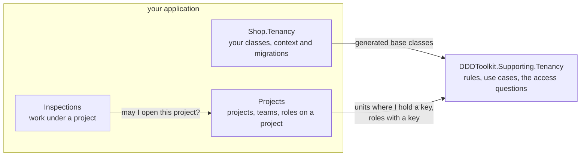

# Tenancy

> [!NOTE]
> `DDDToolkit.Supporting.Tenancy` is being built and is not published yet. This page describes the design
> it is built to, and the names on it can still change until the package is released.

Tenancy is the toolkit's first [supporting domain](writing-a-supporting-domain.md): the part of a
multi-tenant application that knows who you are in a tenant and what you may do where in its
organization. Every application with tenants needs it, and none is set apart by it, so it is written once,
as a package, and each application extends it with what only it knows.

It comes in three packages:

| Package | What it holds |
|---|---|
| `DDDToolkit.Supporting.Tenancy` | The model, its rules and its use cases. No database in it. |
| `DDDToolkit.Supporting.Tenancy.EntityFramework` | `AddTenancy()` for your context, the organization tree as a closure table, and the access questions as Entity Framework queries. Works on every provider. |
| `DDDToolkit.Supporting.Tenancy.Postgres` | The same questions as SQL functions and row level security policies, through the [export](supabase.md). |

## The model

| | Holds | Rules the package states |
|---|---|---|
| **Tenant** | Its slug, its status and its shape | Status moves in one direction, and closed is final. The shape only goes from flat to hierarchical. |
| **Organization** | The tree of **OrganizationUnits** | One root, no cycles, a depth of at most 32. A unit is archived, never deleted. |
| **Seat** | A person in a tenant: their **Placements** in units, and the **RoleGrants** at each | One placement per unit and one primary. Only active roles are granted. The person a seat belongs to never changes. |
| **Role** | A name and the **Permission** keys it grants | Only keys from the catalogue, with the keys they imply expanded. |
| **Catalogue** | The permission keys, the **RolePacks** and the kinds of unit | One administrators' pack per shape. A key is retired, never deleted. |

Each is an aggregate, and they refer to each other by id. Two rules span more than one aggregate, and so
live in the use cases, guarded against concurrent changes: the last administrator of a tenant cannot be
removed, and nobody grants a key they do not hold themselves.

Tenancy raises domain events. Integration events are the application's to write, from those, the way any
module writes its own.

## Your tenancy module

The ids are yours, declared in your contracts project with the key type you use, and so are the classes.
You declare each of the package's aggregates as a class of your own, extend the ones you need to, and
keep the rest as they come:

```csharp
// Shop.Tenancy.Contracts
[EntityId<long>] public readonly partial record struct TenantId;
[EntityId<Guid>] public readonly partial record struct SeatId;
[EntityId<Guid>] public readonly partial record struct OrganizationUnitId;
[EntityId<Guid>] public readonly partial record struct RoleId;

// Shop.Tenancy
[TenantAggregate<TenantId>]
public sealed partial class ShopTenant
{
    public bool IsDemo { get; private set; }
}

[SeatAggregate<SeatId>]
public sealed partial class ShopSeat
{
    public string? JobTitle { get; private set; }
}

[OrganizationUnit<OrganizationUnitId>]
public sealed partial class ShopUnit
{
    public CostCentre? CostCentre { get; private set; }
}

[OrganizationAggregate<TenantId>] public sealed partial class ShopOrganization;
[RoleAggregate<RoleId>] public sealed partial class ShopRole;
```

The package's rules run for your classes before your own, and your classes are what Entity Framework
maps. [Writing your own supporting domain](writing-a-supporting-domain.md) explains how that works.

The context is a plain `DbContext` in your module, with your conventions. `AddTenancy()` is generated for
your classes, the way `AddDomainEventOutbox` adds the outbox:

```csharp
public sealed class ShopTenancyContext(DbContextOptions<ShopTenancyContext> options) : DbContext(options)
{
    protected override void OnModelCreating(ModelBuilder modelBuilder)
    {
        modelBuilder.HasDefaultSchema("tenancy");
        modelBuilder.AddTenancy();
        modelBuilder.AddDomainEventOutbox(Database, schema: "tenancy");
    }
}
```

The migrations are yours too, made from your model in the project where the context lives. The package
has none, because it cannot know your database.

## Who may do what

Tenancy answers questions about the organization, and nothing else:

| Question | Answer |
|---|---|
| `UnitsWhereIHold(key)` | The units where the current seat holds the key: the units it was granted it at, and every unit below them |
| `ReadableUnits()` | The units the current seat may see |
| `HoldsTenantWide(key)` | Whether it holds the key for the whole tenant |
| `RolesWithKey(key)` | The roles that grant the key |
| The current tenant and seat | Who is asking |

It does not decide who may open a project. The module that owns the project does: it knows what a project
is, who is on its team and in which role, and it combines that with Tenancy's answer. A key held at a unit
holds for everything below it.



<details>
<summary>Show the code: how Projects asks</summary>

```csharp
// Every provider: Entity Framework makes this one query with two subqueries
var mine = db.Projects.Where(project =>
    projectAccess.TeamProjectIds("project.update").Contains(project.Id)
    || tenancy.UnitsWhereIHold("project.update").Contains(project.UnitId));
```

```sql
-- Postgres: the same shape as a policy, two set-shaped subqueries that each run once
id IN (SELECT projects.team_project_ids('project.update'))
OR unit_id IN (SELECT tenancy.units_where_i_hold('project.update'))
```

</details>

## Keeping tenants apart

On every database, tenants are kept apart in C#: an Entity Framework query filter on the tenant, and a
check when a change is saved. That protects everything that goes through the application.

On Postgres, row level security is a second lock: a policy on the tenant, and the access questions as SQL
functions the policies call. It is the only thing that also protects the data from someone who runs SQL
directly. The role, the claims and the tenant are set per transaction, so it works behind a pooler in
transaction mode, such as Supavisor.

## Why it is shaped this way

Three choices keep the access data small and the questions fast:

- **Facts, not outcomes.** Tenancy stores who is placed where and holds which role. It does not store what
  that adds up to per person per project, and neither does Projects: rights on a project are worked out
  when they are asked for, from the team and the keys of each role.
- **Start from the person.** A question starts from what the current seat holds and works outward, so its
  cost grows with what that person may do, not with the size of the tenant.
- **One tree, no copies.** The organization is a closure table on ids. A project stores only the unit it
  belongs to, never a copy of that unit's path, so moving a unit moves everything under it with no
  project touched.

[Performance](performance.md#tenancy-the-shape-of-the-access-data) has the measurements behind these
choices.

## What it does not do

- It does not decide access to your resources. The module that owns a resource does, with Tenancy's answers.
- It does not publish integration events or create tables. Those are your module's.
- It never links a seat to a person by their e-mail address. A seat is linked to a verified identity.
