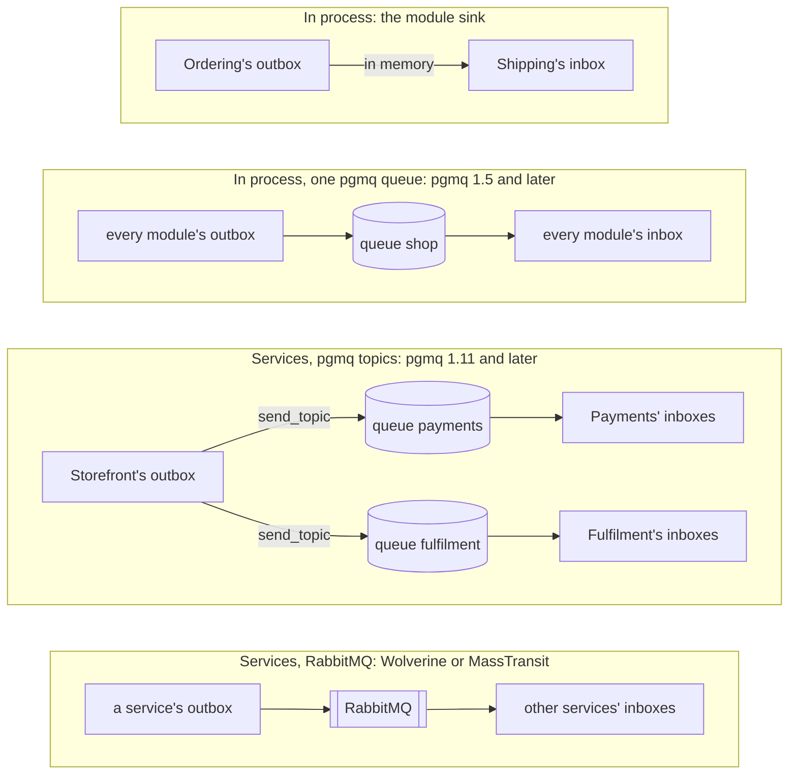

# Transports

A module that runs in the same process as the modules that react to it needs no transport: the
[module sink](integration-events.md#the-common-case-another-module-in-this-process) hands each message to
them directly. The day a module becomes a deployable of its own, that stops working. The outbox still
writes the message in the aggregate's transaction, and the receiving service's inbox still applies it
once, but something has to carry the message from one process to the other.

The toolkit does not write that part. There is no client here for RabbitMQ, Azure Service Bus, Kafka or
SQS, and there is not going to be one. [MassTransit](https://masstransit.io/) and
[Wolverine](https://wolverinefx.net/) are far more mature at that job than anything this repository
would write, so the toolkit hands its messages to them
([Wolverine](#through-a-broker-wolverine), [MassTransit](#through-a-broker-masstransit)) and keeps only
the outbox and the inbox on either side. What it does ship itself is a sink for Postgres queues
([pgmq](#when-a-module-becomes-its-own-deployable-pgmq)), because there the queue is a table and the
guarantees change.

Whichever carries the message, both ends stay as [Integration events](integration-events.md) describes
them. The sending module publishes the same contract through the same outbox, with a different sink. The
receiving process registers its modules with `AddModuleIntegrationEvents`, exactly as a monolith does, and
each handler runs inside its module's inbox. A handler cannot tell which way a message came.

The roads a message can take, from the one that needs nothing to the ones that cross a network:



<details>
<summary>Show the code: choosing the road</summary>

Only the sink on the outbox and, away from the module sink, what reads on the other side change. The
modules and their handlers stay as they are:

```csharp
// one process: the module sink
options.UseOutbox<OrderingContext>(outbox => outbox.SendToModules());

// one process, through one pgmq queue
builder.Services.AddPgmqSink(queues, pgmq => pgmq.UseQueue("shop"));
builder.Services.AddPgmqConsumer(queues, "shop");
options.UseOutbox<OrderingContext>(outbox => outbox.SendToPgmq());

// services over pgmq topics
builder.Services.AddPgmqSink(queues, pgmq => pgmq.UseTopics());
builder.Services.AddPgmqConsumer(queues, "fulfilment", consumer => consumer.BindTopics = true);
options.UseOutbox<OrderingContext>(outbox => outbox.SendToPgmq());

// services over RabbitMQ
options.UseOutbox<OrderingContext>(outbox => outbox.SendToWolverine());     // and wolverine.ReceiveIntegrationEvents(...)
options.UseOutbox<OrderingContext>(outbox => outbox.SendToMassTransit());   // and bus.AddIntegrationEventConsumers(...)
```

`queues` is an `NpgsqlDataSource` on the database the queues live in. Each section below has the whole
registration for its road, and `Examples/` runs every one of them.

</details>

## When a module becomes its own deployable: pgmq

`DDDToolkit.Messaging.Postgres` sends published messages to a
[pgmq](https://github.com/pgmq/pgmq) queue.

pgmq is a Postgres extension whose queues are ordinary tables, and `pgmq.send` is an ordinary insert.
That one fact is the whole reason this package exists: the enqueue obeys the transaction it is called in.
No broker can do that, which is why every broker needs an outbox in front of it. On Postgres you get the
outbox guarantee from the queue itself.

Supabase Queues is this extension with a UI on top. A project has it once Queues is turned on in the
dashboard, or once a migration runs `create extension if not exists pgmq;`. The sink knows nothing about
Supabase; it talks to Postgres through Npgsql and SQL. To have the Supabase CLI apply your migrations,
see `DDDToolkit.EntityFramework.Supabase` on [Supabase](supabase.md).

Which pgmq a database has decides what you can use, and Supabase's is not the newest. A Supabase project
gets the pgmq that goes with its Postgres version: 1.5.1 on Postgres 17 at the time of writing. Ask a
project which one it offers:

```sql
select default_version, installed_version from pg_available_extensions where name = 'pgmq';
```

| | pgmq | On Supabase's 1.5.1 |
|---|---|---|
| Named queues: `UseQueue`, `UseQueues`, the consumer, headers | 1.5.1 and later | Yes |
| [Topics](#publish-and-subscribe-topics): `UseTopics`, `BindTopics` | 1.11 and later | No |

Both columns are tested: the example shop runs over named queues on a real Supabase project in the
Supabase Live workflow, and over topics on pgmq 1.13 in `Examples/Microservices.Pgmq`.

```bash
dotnet add package DDDToolkit.Messaging.Postgres
```

```csharp
builder.Services.AddPgmqSink<OrderingContext>(pgmq => pgmq.UseQueue("ordering_events"));

builder.Services.AddDDDToolkitEntityFramework(options =>
{
    options.UseOutbox(outbox =>
    {
        outbox.AddOrderingIntegrationEvents();
        outbox.SendToPgmq<OrderingContext>();
        outbox.DeliverInTransaction = true;
    });
});
```

`PgmqSink<TContext>` sends on that context's connection, and joins that context's current transaction if
it has one. `DeliverInTransaction` is what makes that pay: the outbox processor then wraps one message's
delivery and its "processed" mark in a single transaction. Either the message is on the queue and the row
is marked, or neither happened. The handoff from the outbox to the queue is exactly once.

Turn `DeliverInTransaction` on for a sink that writes to the same database, and leave it off otherwise. A
send to a broker or an HTTP endpoint cannot be rolled back, so widening the transaction around it buys
nothing. It also changes what `SendToModules` guarantees: the inbox joins the caller's transaction, so
with one transaction around the whole message a failing consumer rolls back the consumers that already
succeeded. Use one or the other on a given outbox, not both.

### Enqueueing in the aggregate's own transaction

You can go further and skip the outbox, because `pgmq.send` is just an insert:

```csharp
await using var transaction = await context.Database.BeginTransactionAsync();

context.Orders.Add(order);
await context.SaveChangesAsync();

await PgmqQueue.SendAsync(
    (NpgsqlConnection)context.Database.GetDbConnection(),
    (NpgsqlTransaction?)context.Database.CurrentTransaction?.GetDbTransaction(),
    "ordering_events",
    JsonSerializer.Serialize(new OrderPlacedV2(order.Id.Value, order.Total.Amount)));

await transaction.CommitAsync();
```

The order and the message now commit together, with nothing in between.

The outbox is still the better default. It keeps the queue name and the payload shape out of the code
path that writes the aggregate, it retries for you, it lets you add a second sink without touching the
aggregate, and it survives the queue being briefly unreachable. Reach for the direct call when you have a
specific reason and can name it.

### Reading the queue

The receiving process registers its modules exactly as a monolith does, with
`AddModuleIntegrationEvents`, and a `PgmqConsumer` for its queue:

```csharp
builder.Services.AddShippingModule(...);   // AddModuleIntegrationEvents<ShippingContext>(m => m.AddShippingIntegrationEvents())
builder.Services.AddPgmqConsumer(dataSource, "fulfilment", consumer => consumer.BindTopics = true);
```

The consumer reads the queue, rebuilds each envelope from its headers
(`IntegrationEventHeaders.ToMessage`), and hands it to `IntegrationEventReceiver`, which offers it to
every module in the process the way the module sink does: each handler inside its module's inbox. So
`BookShipment` is the same class whether the message came from Ordering next door or through a queue,
and a message delivered twice is applied once.

pgmq is at-least-once like everything else. Reading hides a message for a visibility timeout rather than
removing it, and the consumer archives a message only after every module applied it. When a handler
throws, the message is left alone and becomes visible again after `VisibilityTimeout`: a retry is a wait.
After `MaxDeliveries` reads it is archived as poison and logged as an error, so one bad message cannot
hold up the queue; it stays readable in the archive table. A message without the toolkit's headers has
no identity to deduplicate on, and is archived unread.

`PgmqQueue.ReadAsync` and `ArchiveAsync` are there for anything the consumer does not do.
`PgmqMessage.MessageId` is pgmq's own counter, not the integration message id; idempotency keys on the
`messageId` header, the domain event's `EventId`, the same one the
[inbox](integration-events.md#the-inbox-on-the-other-side) stores.

### Publish and subscribe: topics

A pgmq queue is a queue: a message read by one consumer is gone for the others. Since version 1.11 pgmq
routes by topic as well, the way a RabbitMQ topic exchange does. A queue is bound to routing-key patterns
(`pgmq.bind_topic`), and `pgmq.send_topic` puts a message on every queue bound to a pattern its key
matches. That is pgmq's own publish and subscribe, and the way to use it between services:

```csharp
// every service: send by topic, the contract's published name as the routing key
builder.Services.AddPgmqSink(dataSource, pgmq => pgmq.UseTopics());

// every service: its own queue, bound to what it has to be sent
builder.Services.AddPgmqConsumer(dataSource, "fulfilment", consumer => consumer.BindTopics = true);
```

The sender names no queue. Each consumer binds its own queue at start-up to every contract its modules
handle and another service publishes (`IntegrationEventSubscriptions.FromElsewhere`), and unbinds the exact
names it no longer handles; a wildcard somebody bound by hand is left alone. The sends ride one connection
and one transaction, so a message reaches all of its queues or none. A message nobody is bound to reaches
no queue, which is how a broker's exchange behaves too: a consumer that has never started has asked for
nothing yet. `Examples/Microservices.Pgmq` routes the whole shop this way.

Without topic routing, on a pgmq older than 1.11, `pgmq.UseQueues(message => ...)` enqueues on named
queues instead, which means the sender has to know its receivers.

That is the shape on Supabase today. Where the receivers are the modules of one process, it is also the
simplest one: every message on one queue, read back into the modules, whose inboxes decide what each
one handles. `Examples/ModularMonolith.Supabase` does that when it runs with `Messaging=pgmq`:

```csharp
// every module's outbox sends to the one queue, and this host reads it back into the modules
services.AddPgmqSink(queues, pgmq => pgmq.UseQueue("shop"));
services.AddPgmqConsumer(queues, "shop");

var host = new ModuleHost(database, outbox => outbox.SendToPgmq());
```

*[`ModularMonolith.Supabase/DDDToolkit.Examples.Host/Program.cs`](../Examples/ModularMonolith.Supabase/DDDToolkit.Examples.Host/Program.cs)*

No module sink is involved, so nothing reaches a module except through the queue. That makes it the
step before a module moves out: its messages already travel through the database rather than a method
call, so moving the module changes where it runs, not how it hears.

### What the sink sends

The body is the envelope's `Payload`, stored as `jsonb`. The envelope's routing fields go into pgmq's
`headers` column, so a consumer can filter without parsing the body and a human reading the table can
tell what a row is:

```json
{
  "messageId": "0199...", "name": "ordering.order-placed", "version": "2",
  "contentType": "application/json", "occurredAt": "2026-09-13T12:00:00.0000000+00:00",
  "aggregateType": "Order", "aggregateId": "ORD_0199..."
}
```

Turn that off with `pgmq.SendHeaders = false`.

### Queues, creation and the missing extension

By default the sink sends everything to one queue called `integration_events` and creates it on first use.
`pgmq.create` is idempotent, and the create runs on a connection of its own rather than on yours, because
creating a table is DDL and Postgres rolls DDL back like anything else. A queue is deployment state; it
should not vanish when a business transaction changes its mind.

```csharp
pgmq.UseQueue("ordering_events");                                   // one queue, named
pgmq.UseQueue(message => message.Name.Replace('.', '_'));           // one queue per event name
pgmq.CreateQueueIfMissing = false;                                  // queues come from a migration
```

pgmq builds table names from the queue name, so keep them short, lower case, and free of anything that is
not a letter, a digit or an underscore. A published name like `ordering.order-placed` has to be rewritten,
not passed through. Turn creation off when the application's database user may not create tables; the sink
then fails on a missing queue instead of hiding it.

If the extension is not installed you get a `PgmqNotInstalledException` naming the database and saying
what to run, rather than `schema "pgmq" does not exist` from somewhere deep in the driver:

```sql
CREATE EXTENSION IF NOT EXISTS pgmq;
```

The extension has to be on the server first. `ghcr.io/pgmq/pg17-pgmq` is an image that ships it, and
managed Postgres that offers queues generally has it already.

### For a queue in another database

`PgmqSink` (no type argument) opens its own connections from an `NpgsqlDataSource`:

```csharp
builder.Services.AddPgmqSink(NpgsqlDataSource.Create(connectionString), pgmq => pgmq.UseQueue("events"));

// and on the outbox:
outbox.SendToPgmq();
```

There is no shared transaction on that path, so it is at-least-once like any other remote sink. Use it
when the queue genuinely lives somewhere else.

## Through a broker: Wolverine

`DDDToolkit.Messaging.Wolverine` makes Wolverine the transport between the outbox of one process and the
inbox of another. Wolverine carries the message; the toolkit keeps the outbox that writes it in the
aggregate's transaction and the inbox that applies it once. Wolverine's own outbox, inbox and sagas are
not used, so there is one of each rather than two that disagree.

Messages travel the way Wolverine sends anything: each contract is a message type of its own, and
Wolverine's routing decides where it goes. With RabbitMQ's conventional routing every contract type gets a
fanout exchange, and every service that handles the type a queue bound to it. What the contract does not
carry travels in headers, the same ones the pgmq sink writes (`IntegrationEventHeaders`): the outbox's
message id, the published name and version, the time and the aggregate.

```csharp
builder.Services.AddFulfilmentModules(...);   // first: the modules say what this service handles

builder.UseWolverine(wolverine =>
{
    wolverine.UseRabbitMq(rabbitUri)
        .AutoProvision()
        .UseConventionalRouting(conventions => conventions
            .UseIntegrationEventNames()                                    // exchanges named ordering.order-placed.v1
            .QueueNameForListener(type => $"fulfilment.{type.Name}")      // a queue per service and contract
            .ConfigureListeners((listener, _) => listener.ProcessInline())
            .ConfigureSending((sender, _) => sender.SendInline()));

    // a handler per contract this service has to be sent; retries, then the error queue
    wolverine.ReceiveIntegrationEvents(builder.Services.IntegrationEventSubscriptions());
    wolverine.Policies.DisableConventionalLocalRouting();    // what this process publishes goes to the broker
});

// the outbox of each module
options.UseOutbox<OrderingContext>(outbox => outbox.SendToWolverine());
```

`WolverineSink` publishes the contract through `IMessageBus`. `ReceiveIntegrationEvents` adds an
`IntegrationEventHandler<TContract>` to Wolverine's discovery for every contract the modules handle and
this process does not publish itself, so Wolverine listens for exactly those types; nothing names a
contract by hand. The handler hands the message to `IntegrationEventReceiver`, which delivers it to the
modules of the process, each handler inside its module's inbox. When a handler throws, Wolverine retries
with a cooldown and then moves the message to its error queue; a retry cannot apply anything twice.

Three things to get right. Name the listener queues per service, as above, or two services that handle
one contract share a queue and each get half the messages. Listen inline (`ProcessInline()`), so a message
is acknowledged after the modules applied it; a buffered listener acknowledges first, and a crash in
between loses the message. And
reference `WolverineFx.RuntimeCompilation` in the process, because Wolverine compiles its handler adapters
at start-up and since 6.x ships that compiler separately. `Examples/Microservices.Wolverine` runs the shop
this way.

`UseIntegrationEventNames()` is optional, and it is what the samples do. Without it Wolverine names a
contract's exchange after its CLR type, so renaming the contract class or moving it to another namespace
moves its messages to another exchange, and a service still on the old name sends into the void. With it
the exchange is the contract's published name and version, `ordering.order-placed.v1`
([Stable names](domain-events.md#stable-names)), which stays put while the class is renamed as long as the
name is pinned. Each version is an exchange of its own, because each version is a type of its own to
Wolverine. Listeners bind their queues to the same name, so every service that shares the events has to
switch together. Other message types keep Wolverine's names.

## Through a broker: MassTransit

`DDDToolkit.Messaging.MassTransit` does the same with MassTransit: each contract a message type of its
own, published and consumed as MassTransit does any message, the same receiver behind it, MassTransit's
own outbox and sagas left out. It is built on **MassTransit 8**,
the last major version under the Apache 2.0 licence; 9 and later are commercial, and moving to them is
for whoever deploys the software to decide.

```csharp
builder.Services.AddFulfilmentModules(...);   // first: the modules say what this service handles

builder.Services.AddMassTransit(bus =>
{
    // a consumer per contract the modules handle and another service publishes
    bus.AddIntegrationEventConsumers(builder.Services.IntegrationEventSubscriptions());

    bus.UsingRabbitMq((context, rabbit) =>
    {
        rabbit.Host(rabbitUri);
        rabbit.UseIntegrationEventNames();   // exchanges named ordering.order-placed.v1, before any endpoint

        // this service's queue; MassTransit binds it to the exchange of every contract its consumers take
        rabbit.ReceiveEndpoint("fulfilment", endpoint =>
        {
            endpoint.UseMessageRetry(retry => retry.Intervals(250, 1000, 5000));
            endpoint.ConfigureConsumers(context);
        });
    });
});

// the outbox of each module
options.UseOutbox<OrderingContext>(outbox => outbox.SendToMassTransit());
```

`MassTransitSink` publishes the contract through `IPublishEndpoint`, so MassTransit gives it the exchange of
its type, with the outbox's message id as MassTransit's message id and the toolkit's headers alongside.
MassTransit names that exchange after the CLR type, `Shop.Ordering.Contracts:OrderPlacedV1`, unless
`UseIntegrationEventNames()` replaces its entity name formatter with `IntegrationEventEntityNameFormatter`:
then it is the published name and version, `ordering.order-placed.v1`, and survives renaming the class for
the same reasons as under Wolverine above. Consumers bind through the same formatter, so switch every
service together. Message types the toolkit does not name, `Fault<T>` among them, keep MassTransit's names.
`IntegrationEventConsumer<TContract>` hands it to `IntegrationEventReceiver`; MassTransit acknowledges it
when the consumer returns, retries it as the endpoint says when a handler throws, and then moves it to the
endpoint's error queue.

One thing to know: MassTransit has an `AddMediator` of its own on `IServiceCollection`. In a file that
imports the `MassTransit` namespace, the [Mediator](https://github.com/martinothamar/Mediator) source
generator no longer reads the options of your `AddMediator` call, and the process stops at start-up saying
it generated for another lifetime. Configure MassTransit in a file of its own, as
`Examples/Microservices.MassTransit` does in each service's `RabbitMq.cs`.

## For screens: the GraphQL subscription sink

`DDDToolkit.HotChocolate` has one more sink, `GraphQlSubscriptionSink`, and it is a different axis from
the others. The module sink, pgmq and the brokers are integration: durable, retried, and the receiver gets
the message whether or not it was running at the time. A GraphQL subscription stores nothing and reaches
only the clients holding a socket right now, so use it to keep a browser in step with the server, never
as the path by which some other part of the system learns that an order was placed.
[GraphQL](graphql.md#pushing-integration-events-to-subscribers) has the registration, the subscription
field, the transports, and why it publishes the contract rather than the domain event.

## Writing a sink of your own

One method, one message, one cancellation token. Return and the transport accepted it. Throw and it did
not.

```csharp
public interface IIntegrationEventSink
{
    Task SendAsync(IntegrationEventMessage message, CancellationToken cancellationToken = default);
}
```

```csharp
using DDDToolkit.BaseTypes;
using DDDToolkit.Interfaces;

public sealed class WebhookSink(HttpClient client) : IIntegrationEventSink
{
    public async Task SendAsync(IntegrationEventMessage message, CancellationToken cancellationToken)
    {
        using var content = new StringContent(message.Payload, Encoding.UTF8, message.ContentType);
        content.Headers.Add("X-Message-Id", message.MessageId.ToString());
        content.Headers.Add("X-Message-Name", $"{message.Name}/v{message.Version}");

        var response = await client.PostAsync("/events", content, cancellationToken);
        response.EnsureSuccessStatusCode();
    }
}
```

A sink for a real broker is the same shape. Topic from `Name`, deduplication id from `MessageId`,
partition key from `AggregateId`, body from `Payload`:

```csharp
public sealed class ServiceBusSink(ServiceBusSender sender) : IIntegrationEventSink
{
    public Task SendAsync(IntegrationEventMessage message, CancellationToken cancellationToken)
        => sender.SendMessageAsync(
            new ServiceBusMessage(message.Payload)
            {
                MessageId = message.MessageId.ToString(),
                Subject = message.Name,
                PartitionKey = message.AggregateId,
                ContentType = message.ContentType,
                ApplicationProperties = { ["version"] = message.Version },
            },
            cancellationToken);
}
```

`SendTo<TSink>()` takes the sink from the scope the processor runs in when you registered it there, and
otherwise builds it with its constructor services injected. `SendTo(sink)` takes an instance you already
have, which is what tests usually want.

Every sink on an outbox is handed every message the outbox publishes, and a message counts as delivered
only when all of them accepted it. [When one sink fails and another does not](integration-events.md#when-one-sink-fails-and-another-does-not)
is what that means for a sink that cannot tolerate a repeat.

### Why an envelope and not the event

The sink receives an `IntegrationEventMessage`, not an `IDomainEvent` and not the outbox row. Both of
those were considered and neither is right.

Handing a sink the `IDomainEvent` makes every sink responsible for serializing it, which means every sink
has to know your JSON options, and it quietly puts the domain type on the wire. Handing it the
`OutboxMessage` row is worse: that row carries `Attempts`, `ProcessedAt` and `LastError`, which are this
process's bookkeeping and no transport's business, and it drags Entity Framework into the signature. A
sink project would then have to reference `DDDToolkit.EntityFramework` to send an HTTP request.

The envelope is neither. It lives in the core `DDDToolkit` package, it has no Entity Framework types at
all, and it carries exactly what a transport routes on:

| Member | What it is |
|---|---|
| `MessageId` | The idempotency key. The domain event's `EventId`, which is also the outbox row's key |
| `Name` | What consumers route on |
| `Version` | The schema version of `Payload` |
| `Payload` | The serialized body |
| `ContentType` | `application/json` unless you change it |
| `OccurredAt` | When the thing happened, not when delivery was attempted |
| `AggregateType` | CLR type name of the aggregate it came from |
| `AggregateId` | The aggregate's key as text. Useful as a partition key |
| `Body` | The object `Payload` came from, for transports that speak CLR objects |

One identifier runs the whole way. `EventId` on the event, `Id` on the outbox row, `MessageId` on the
envelope, `MessageId` on the consumer's inbox row. That is deliberate, and it is what makes
[the guarantees](integration-events.md#the-guarantees-honestly) add up.

## Where to look next

- [Integration events](integration-events.md) for the contract, the module sink, the inbox and versioning.
- `Examples/Microservices.Pgmq`, `Examples/Microservices.Wolverine` and `Examples/Microservices.MassTransit`
  for the example shop run as three services over each transport.
- `Tests/DDDToolkit.EntityFramework.Tests/PgmqSinkTests.cs` for the transactional enqueue, against a real
  Postgres, and `PgmqConsumerTests.cs` next to it for reading the queue.
- `Tests/DDDToolkit.EntityFramework.Tests/OutboxTransactionTests.cs` for `DeliverInTransaction`.
- `Tests/DDDToolkit.Messaging.Tests/WolverineTests.cs` and `MassTransitTests.cs` for the two brokers.
- `Tests/DDDToolkit.EntityFramework.Tests/IntegrationEventTests.cs` for the sink contract.
