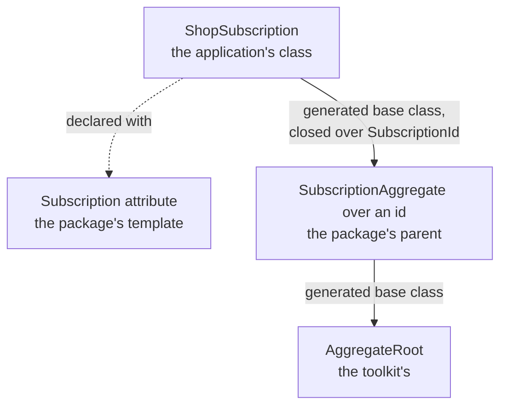
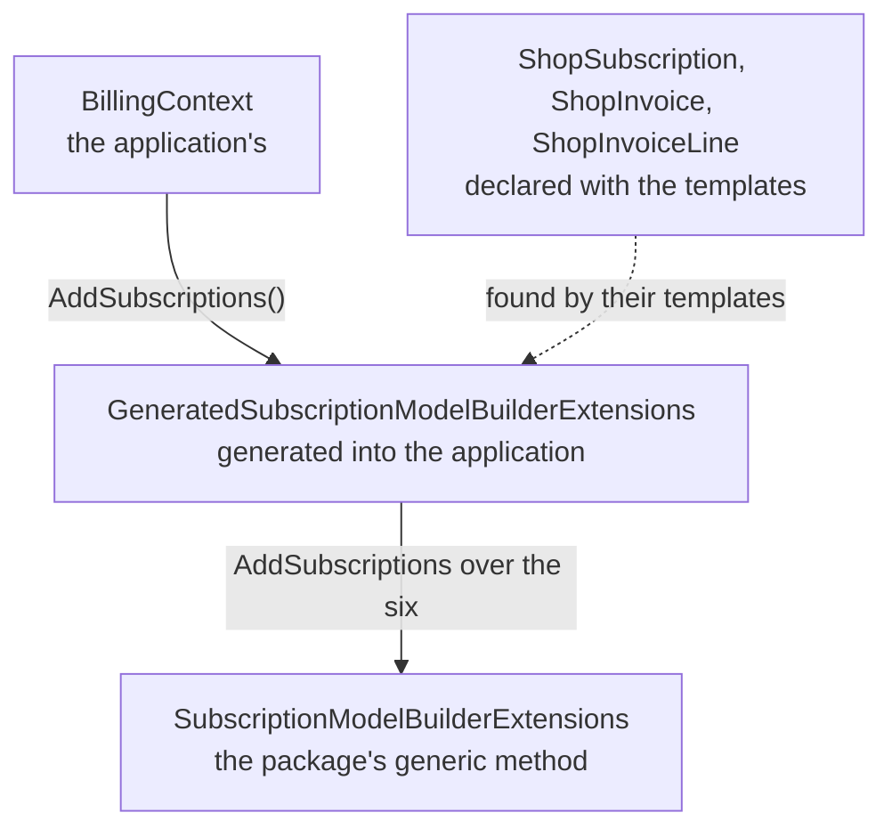
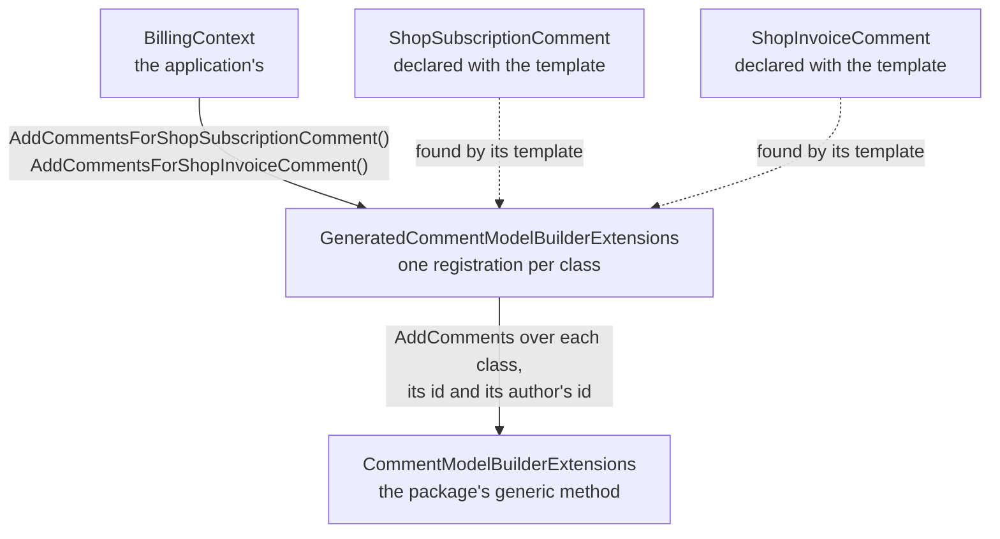
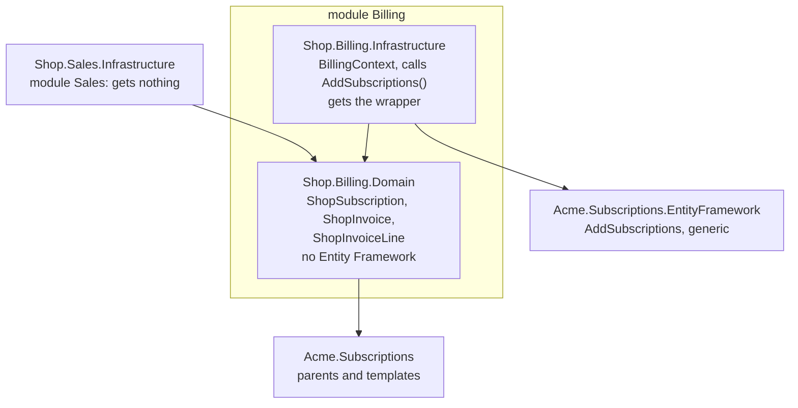

# Writing your own supporting domain

Your core domain is what the application is for, and the [building blocks](entities-and-aggregates.md)
are how you write it. Around it sit domains that many applications need and none is set apart by:
subscriptions, tenants, audit. A **supporting domain** is one of those written once, as a package, and
used by many applications. The toolkit ships its own under `DDDToolkit.Supporting.*`, [Tenancy](tenancy.md)
and [Membership](membership.md), and you can write one the same way.

A supporting domain is not a building block. It is written with the building blocks, the way your own
modules are, and once an application references it, it is a module of that application. What makes it a
package rather than a copy is how the application extends it:

- **The ids are the application's.** It declares them with `[EntityId<T>]`, in its contracts project,
  over whatever value it uses. The package never forces a `Guid` on anyone.
- **The classes are the application's.** It declares each of the package's aggregates and entities as a
  class of its own, and adds properties, behaviour, rules and entities to it.
- **The rules are the package's.** Every rule the package states runs for the application's class, before
  the class's own. The application adds rules; it cannot leave one out by accident.
- **The database is the application's.** The package brings no migrations and no `DbContext`. The
  application's context and migrations stay where its module keeps them.

The example on this page is a package for subscriptions and their invoices, `Acme.Subscriptions`, and a
shop that uses it.

## A parent and its template

The package declares each aggregate as an abstract generic **parent**, marked `[AggregateRootBase]`, with
the id as its first type parameter. It is written like any other aggregate: rules nested in it, a
`CheckInvariants()` seam, read-only collections.

```csharp
[AggregateRootBase]
public abstract partial class SubscriptionAggregate<TSubscriptionId>
    where TSubscriptionId : IEntityId, IEquatable<TSubscriptionId>
{
    protected SubscriptionAggregate(TSubscriptionId id, string plan) : base(id) => Plan = plan;

    public string Plan { get; private set; } = "";

    public sealed class PlanIsRequired : IInvariant<SubscriptionAggregate<TSubscriptionId>>
    {
        public string Code => "subscription.plan";

        public InvariantFailure? Check(SubscriptionAggregate<TSubscriptionId> entity)
            => entity.Plan.Length > 0 ? null : "A subscription is on a plan.";
    }
}
```

Next to it goes the attribute the application declares its class with, the **template**. It names the
parent, and its type arguments fill the parent's first type parameters, the id first:

```csharp
[AggregateRootTemplate(typeof(SubscriptionAggregate<>))]
[AttributeUsage(AttributeTargets.Class, Inherited = false)]
public sealed class SubscriptionAttribute<TSubscriptionId> : Attribute;
```

A child entity works the same way, with `[EntityBase]` on the parent and `[EntityTemplate]` on the
attribute.

## What the application writes

The application declares its ids and its own class with the template, and adds what only it knows:

```csharp
[EntityId<Guid>]
public readonly partial record struct SubscriptionId;      // in its contracts project

[Subscription<SubscriptionId>]
public sealed partial class ShopSubscription
{
    public ShopSubscription(SubscriptionId id, string plan, bool isTrial) : base(id, plan) => IsTrial = isTrial;

    public bool IsTrial { get; private set; }

    public sealed class TrialsAreOnTheFreePlan : IInvariant<ShopSubscription> { ... }
}
```

The generator derives the class from the parent, closed over the application's id, and the parent from
the toolkit's `AggregateRoot<TId>`. Nobody writes a base class by hand.



<details>
<summary>Show the code: what the generator writes</summary>

```csharp title="SubscriptionAggregate.g.cs and ShopSubscription.g.cs, shortened"
partial class SubscriptionAggregate<TSubscriptionId> : global::DDDToolkit.BaseTypes.AggregateRoot<TSubscriptionId>
{
    protected void CollectBaseInvariantViolations(
        ref global::System.Collections.Generic.List<global::DDDToolkit.Invariants.InvariantViolation>? violations,
        ref global::DDDToolkit.Exceptions.InvariantViolationException? seamFailure,
        global::System.Type entityType)
    {
        foreach (var invariant in __invariants)
        {
            // ...
        }

        // ...then its CheckInvariants() seam
    }
}

partial class ShopSubscription : global::Acme.Subscriptions.SubscriptionAggregate<global::Shop.Contracts.SubscriptionId>
{
    private void CollectInvariantViolations(
        ref global::System.Collections.Generic.List<global::DDDToolkit.Invariants.InvariantViolation>? violations,
        out global::DDDToolkit.Exceptions.InvariantViolationException? seamFailure)
    {
        seamFailure = null;
        CollectBaseInvariantViolations(ref violations, ref seamFailure, typeof(global::Shop.Billing.ShopSubscription));

        foreach (var invariant in __invariants)
        {
            // ...
        }

        // ...then its own CheckInvariants() seam
    }
}
```

</details>

## The parent's rules always run

A rule the parent states runs for every class derived from it, and so does the parent's
`CheckInvariants()` seam. The parent's run first and the class's after, and both come back in one list
from `GetInvariantViolations()`, or as one exception from `EnsureInvariants()` and the save. Every
violation names the application's class, `ShopSubscription`, not the package's parent, because that is
the object that is wrong. The parent's child entities are walked the same way, so a rule of the package's
line runs inside the application's invoice.

The parent gets the four public invariant methods too, running its own rules alone. A class declared with
the template replaces them with its own; they are there for a class that derives from the parent by hand,
which would otherwise check nothing the package states.

A rule of the application's may be about its class, about the parent, or about an interface the parent
implements. All of them are nested in the application's class:

```csharp
[Subscription<SubscriptionId>]
public sealed partial class ShopSubscription
{
    public sealed class TrialsAreOnTheFreePlan : IInvariant<ShopSubscription> { ... }

    public sealed class PlanIsKnown : IInvariant<SubscriptionAggregate<SubscriptionId>> { ... }
}
```

## Parents that need more than an id

An invoice needs more than its own id: the id of the subscription it bills, and the class of its lines,
which is the application's own. A **`[TemplateArgument]`** fills such a type parameter from the one class
declared with the template it names. By default it takes that class's id, and with
`Take = TemplateArgumentKind.Type` the class itself:

```csharp
[AggregateRootTemplate(typeof(InvoiceAggregate<,,,>))]
[TemplateArgument(1, typeof(SubscriptionAttribute<>))]
[TemplateArgument(2, typeof(InvoiceLineAttribute<>), Take = TemplateArgumentKind.Type)]
[TemplateArgument(3, typeof(InvoiceLineAttribute<>))]
[AttributeUsage(AttributeTargets.Class, Inherited = false)]
public sealed class InvoiceAttribute<TInvoiceId> : Attribute;
```

The application declares each class once, and the rest follows:

```csharp
[InvoiceLine<InvoiceLineId>]
public sealed partial class ShopInvoiceLine : IInvoiceLineFactory<ShopInvoiceLine, InvoiceLineId> { ... }

[Invoice<InvoiceId>]
public sealed partial class ShopInvoice
{
    public ShopInvoice(InvoiceId id, SubscriptionId subscriptionId) : base(id, subscriptionId) { }
}
```

`ShopInvoice` derives from `InvoiceAggregate<InvoiceId, SubscriptionId, ShopInvoiceLine, InvoiceLineId>`,
with the subscription's id taken from `ShopSubscription`. The class a template takes from is looked for in
the application's project first and, when that declares none, in the projects it references, so a
billing module can take the subscription's id from the module that declares the subscription.

## Creating the application's entities

A parent that holds the application's child entities cannot call their constructor: it does not know
their class. A static abstract factory on an interface the child implements does it, and the parent
constrains its type parameter to that interface:

```csharp
public interface IInvoiceLineFactory<TSelf, TLineId>
    where TSelf : IInvoiceLineFactory<TSelf, TLineId>
{
    static abstract TSelf Create(TLineId id, decimal amount);
}

[AggregateRootBase]
public abstract partial class InvoiceAggregate<TInvoiceId, TSubscriptionId, TLine, TLineId>
    where TInvoiceId : IEntityId, IEquatable<TInvoiceId>
    where TSubscriptionId : IEntityId, IEquatable<TSubscriptionId>
    where TLine : InvoiceLineEntity<TLineId>, IInvoiceLineFactory<TLine, TLineId>
    where TLineId : IEntityId, IEquatable<TLineId>
{
    public partial IReadOnlyList<TLine> Lines { get; }

    public TLine Charge(TLineId id, decimal amount)
    {
        var line = TLine.Create(id, amount);
        _lines.Add(line);
        return line;
    }
}
```

An application class that does not implement the factory is reported,
[DDD00048](diagnostics.md#ddd00048), on the class that takes it, rather than as a compile error in the
generated code. A `new()` constraint is no way round the factory: the parameterless constructor the
generator writes is never public.

## Stored with Entity Framework

Nothing changes. Entity Framework maps the application's classes, with the parent's properties and
collections as their own, and a child entity declared with an `[EntityTemplate]` is an owned type like any
other child entity. The parent is never mapped: it is an open generic, and Entity Framework only ever sees
the classes closed over the application's ids. `[KeyPart]` properties on a parent join the key in front of
the class's own.

A [row access rule](row-level-security.md#row-access-rules-written-in-c) is written for the application's
class, and reads the parent's properties and collections like the class's own. A rule about the parent
itself is refused, [DDD00040](diagnostics.md#ddd00040): the parent has no table.

The package's own row level security, for tables that are not the application's aggregates and for SQL
that names the schema and id types the application chose, is a
[row access contribution](row-level-security.md#policies-a-package-ships): a class the package offers with
`[assembly: RowAccessContribution(typeof(SubscriptionRowAccess))]`, which writes functions, policies and
statements from the application's model when the export asks. The application writes it into its
migrations by listing it, `[assembly: UseRowAccessContribution(typeof(SubscriptionRowAccess))]`, in the
project that runs the export; where the SQL depends on what only the application knows, the package offers
a class for the application to derive from, and the application lists its own. Questions the package offers
the application's rules, declared in an `[AccessFunctions(Owner = "subscriptions")]` class, are answered by
the functions it contributes, found by their logical names, `subscriptions/active_plans`, in the default
schema of the context that maps the package's tables.

What other modules read of the package's data, it gives them as functions too, and not as its tables: each
answers rows under column names of its own, and the package ships the mapping that reads them into a module's
context. A module's model then names what the package offers and nothing of how it is stored, so the
application names the package's tables and columns as it likes, and the policies on those tables still decide
what each caller is answered ([Tenancy's read functions](tenancy.md#modules-read-through-functions)).

Keep what a module can read that way to what a rule needs. A read model of ids, keys, periods and statuses
lets a module ask "is this subscription active" inside its own query, and gives it nothing to show: no plan's
name, no subscriber's. Names are a question of their own, asked of the package by id: a directory, where
`PlansByIdAsync(ids)` answers what the plans a module's answer carried are called, to whoever may work with
them, and leaves out an id that is not theirs to ask about. A module's answers then carry ids, and whoever
shows them asks the package for the names. Ship a check next to the mapping that says what a module's model
maps of the package's beyond the read model, a type of its own on one of the package's tables or a property
added to a row, so a test of the application holds every module to it
([what a module reads of Tenancy](tenancy.md#what-a-module-reads-of-tenancy), and [its names](tenancy.md#names)).

What such a contribution writes follows from what the package owns. Policies on its own tables, which it keeps
to itself in `ExclusiveTables`, so no rule of the application's adds one next to them. Restrictive policies on
the application's tables that depend on it, a table kept to a subscription say, since a restrictive policy is
never merged with the rules' and no rule can widen it. As statements, the triggers that keep what no policy can
see, such as a rule about rows other than the one written, checked at commit. A contribution the host forgets
to list writes nothing, and the build only warns, so the package also ships a start-up check that its policies
are in the database and were written from what the application runs with: a function written from the
catalogue of subscription plans the application is configured with, say, answers as that catalogue does. Its
registration for Postgres registers that check with `services.AddStartupCheck(...)`, in the stage of the
database, so a host that runs its [start-up checks](startup-checks.md#a-check-of-your-own) gets it without
naming it. [Tenancy's](tenancy.md#on-postgres-the-second-lock) does all four.

A package that keeps rows a customer makes, in a class of the application's, knows no customer: whose a row
is, is a column the application adds and a rule the application writes. Its functions run as their owner and
see every customer's rows, so it cannot ask "of the same customer" there. It can make the database hold what
the application declared all the same: a restrictive policy that asks the application's table as the caller,
`EXISTS (SELECT 1 FROM <the application's table> ... )`, is answered under the application's own rules on that
table, so a row that refers to one the caller is not shown is not written. And what the package's own
operations refuse whoever asks, a row in a state nobody may leave it in, is a trigger written from the rules,
which holds whoever writes the row. [Membership's roles a customer makes](membership.md#roles-a-customer-makes)
do both.

## A registration closed over your classes

A package usually ships a registration as well: a method that adds its tables to the application's model,
or its services to the container. The package cannot name the application's classes, so the method is
generic over them, and an application with three classes and three ids would name all six in every call:

```csharp
modelBuilder.AddSubscriptions<ShopSubscription, SubscriptionId, ShopInvoice, InvoiceId, ShopInvoiceLine, InvoiceLineId>();
```

Mark the method **`[TemplateRegistration]`** and each type parameter the application fills
**`[TemplateType]`**, naming the template whose class fills it, and name the type that declares the method
in an assembly attribute, **`[TemplateRegistrations]`**, so the generator in the application finds it
without walking every type of every reference:

```csharp
[assembly: TemplateRegistrations(typeof(Acme.Subscriptions.SubscriptionModelBuilderExtensions))]

public static class SubscriptionModelBuilderExtensions
{
    [TemplateRegistration]
    public static ModelBuilder AddSubscriptions<
        [TemplateType(typeof(SubscriptionAttribute<>), Take = TemplateArgumentKind.Type)] TSubscription,
        [TemplateType(typeof(SubscriptionAttribute<>))] TSubscriptionId,
        [TemplateType(typeof(InvoiceAttribute<>), Take = TemplateArgumentKind.Type)] TInvoice,
        [TemplateType(typeof(InvoiceAttribute<>))] TInvoiceId,
        [TemplateType(typeof(InvoiceLineAttribute<>), Take = TemplateArgumentKind.Type)] TLine,
        [TemplateType(typeof(InvoiceLineAttribute<>))] TLineId>(
        this ModelBuilder modelBuilder, string schema = "sales")
        where TSubscription : SubscriptionAggregate<TSubscriptionId>
        where TInvoice : InvoiceAggregate<TInvoiceId, TSubscriptionId, TLine, TLineId>
        where TLine : InvoiceLineEntity<TLineId>, IInvoiceLineFactory<TLine, TLineId>
        // and the three ids, constrained as the parents constrain them
    {
        modelBuilder.Entity<TSubscription>().ToTable("Subscriptions", schema);
        modelBuilder.Entity<TInvoice>().ToTable("Invoices", schema);
        return modelBuilder;
    }
}
```

The application calls it without its classes:

```csharp
protected override void OnModelCreating(ModelBuilder modelBuilder) => modelBuilder.AddSubscriptions();
```



<details>
<summary>Show the code: what the generator writes</summary>

```csharp title="SubscriptionModelBuilderExtensions.AddSubscriptions.Registration.g.cs, shortened"
namespace Acme.Subscriptions;

internal static partial class GeneratedSubscriptionModelBuilderExtensions
{
    public static global::Microsoft.EntityFrameworkCore.ModelBuilder AddSubscriptions(
        this global::Microsoft.EntityFrameworkCore.ModelBuilder modelBuilder, string schema = "sales")
        => global::Acme.Subscriptions.SubscriptionModelBuilderExtensions.AddSubscriptions<
            global::Shop.Billing.ShopSubscription, global::Shop.Contracts.SubscriptionId,
            global::Shop.Billing.ShopInvoice, global::Shop.Contracts.InvoiceId,
            global::Shop.Billing.ShopInvoiceLine, global::Shop.Contracts.InvoiceLineId>(modelBuilder, schema);
}
```

</details>

- **Each `[TemplateType]` is filled like a `[TemplateArgument]`:** from the one class declared with the
  template, in the project first and then in the projects it references. By default it takes that class's
  id, and with `Take = TemplateArgumentKind.Type` the class itself. A template with more type arguments than
  the id hands those over too ([A template with more than one type argument](#a-template-with-more-than-one-type-argument)),
  and one that may be declared more than once gets a registration per class
  ([A template declared more than once](#a-template-declared-more-than-once)).
- **A type parameter without `[TemplateType]` stays open,** with its constraints, so the application still
  names what only it can choose: `services.AddSubscriptions<BillingContext>(options => ...)`.
- **The parameters are the method's own,** default values included, and the wrapper passes them on.
- **The wrapper is internal,** a class named `Generated` and the declaring type's name, in the declaring
  type's namespace. The using the application already has for the package is all a call needs, and two
  projects that both declare the classes never see each other's.
- **The generic method keeps working.** The wrapper calls it, and an application can call it too.

A project gets the registration when it declares a class with at least one of the method's templates. A
project that declares none, the package itself or a module that only refers to the ids, gets nothing and is
told nothing, unless it declares the same `[assembly: Module]` as the projects that do
([In a module split by layer](#in-a-module-split-by-layer)). A project that declares some and misses one is
told which one, [DDD00049](diagnostics.md#ddd00049), and a code fix declares it. That is why the
registrations belong in a package of their own, the way Tenancy keeps them in
`DDDToolkit.Supporting.Tenancy.EntityFramework`: a domain module that declares one of the classes and does
not reference the storage package is never asked for the rest.

### A template with more than one type argument

Not every type a parent needs comes from another class. A comment is written by someone, and what identifies
that someone is the application's to say: a `StaffId` of its own, a `Guid`. Such a type is a further type
argument of the template, after the id, and fills the parent's next type parameter:

```csharp
[AggregateRootBase]
public abstract partial class CommentAggregate<TCommentId, TAuthorId>
    where TCommentId : IEntityId, IEquatable<TCommentId>
    where TAuthorId : struct, IEquatable<TAuthorId>
{
    protected CommentAggregate(TCommentId id, TAuthorId writtenBy, string text) : base(id)
    {
        WrittenBy = writtenBy;
        Text = text;
    }

    public TAuthorId WrittenBy { get; private set; }

    public string Text { get; private set; } = "";
}

[AggregateRootTemplate(typeof(CommentAggregate<,>), AllowSeveral = true)]
[AttributeUsage(AttributeTargets.Class, Inherited = false)]
public sealed class CommentAttribute<TCommentId, TAuthorId> : Attribute;
```

```csharp
[Comment<InvoiceCommentId, StaffId>]
public sealed partial class ShopInvoiceComment
{
    public ShopInvoiceComment(InvoiceCommentId id, StaffId writtenBy, string text) : base(id, writtenBy, text) { }
}
```

Only the first type argument has to be an entity id. The others are whatever the application writes there, held
to the parent's constraints ([DDD00053](diagnostics.md#ddd00053)).

A registration that takes the class takes those type arguments too, with **`Argument`**, counted from zero
like the attribute's own, so 0 is the id and need not be said:

```csharp
[assembly: TemplateRegistrations(typeof(Acme.Subscriptions.CommentModelBuilderExtensions))]

public static class CommentModelBuilderExtensions
{
    [TemplateRegistration]
    public static ModelBuilder AddComments<
        [TemplateType(typeof(CommentAttribute<,>), Take = TemplateArgumentKind.Type)] TComment,
        [TemplateType(typeof(CommentAttribute<,>))] TCommentId,
        [TemplateType(typeof(CommentAttribute<,>), Argument = 1)] TAuthorId>(
        this ModelBuilder modelBuilder, string table)
        where TComment : CommentAggregate<TCommentId, TAuthorId>
        where TCommentId : IEntityId, IEquatable<TCommentId>
        where TAuthorId : struct, IEquatable<TAuthorId>
    {
        modelBuilder.Entity<TComment>().ToTable(table);
        return modelBuilder;
    }
}
```

```csharp
modelBuilder.AddComments("InvoiceComments");       // AddComments<ShopInvoiceComment, InvoiceCommentId, StaffId>
```

It has to take every one of them. `ShopInvoiceComment` is a `CommentAggregate<InvoiceCommentId, StaffId>` and
nothing else, so a wrapper that left `TAuthorId` for the caller to write would not compile: the class would
have to be a comment by whatever the caller wrote. A type argument that misses a constraint of the method is
reported on the class, [DDD00050](diagnostics.md#ddd00050), as an id is.

### A template declared more than once

Most templates stand for something an application has one of: its tenant, its subscription. A second class
declared with one is a mistake, and [DDD00045](diagnostics.md#ddd00045) says so. A template for comments is
not like that. The shop has comments on subscriptions and comments on invoices, each a class of its own with
a table of its own. The package says the template is meant for that on its marker, **`AllowSeveral = true`**,
as `CommentAttribute` does above.

An application with one such class calls the registration by the method's name, as always. One with several
gets it once per class, named after the class:

```csharp
[Comment<SubscriptionCommentId, StaffId>]
public sealed partial class ShopSubscriptionComment { ... }

[Comment<InvoiceCommentId, StaffId>]
public sealed partial class ShopInvoiceComment { ... }

protected override void OnModelCreating(ModelBuilder modelBuilder)
{
    modelBuilder.AddCommentsForShopSubscriptionComment("SubscriptionComments");
    modelBuilder.AddCommentsForShopInvoiceComment("InvoiceComments");
}
```



<details>
<summary>Show the code: what the generator writes</summary>

```csharp title="CommentModelBuilderExtensions.AddComments.Registration.g.cs, shortened"
namespace Acme.Subscriptions;

internal static partial class GeneratedCommentModelBuilderExtensions
{
    public static global::Microsoft.EntityFrameworkCore.ModelBuilder AddCommentsForShopSubscriptionComment(
        this global::Microsoft.EntityFrameworkCore.ModelBuilder modelBuilder, string table)
        => global::Acme.Subscriptions.CommentModelBuilderExtensions.AddComments<
            global::Shop.Billing.ShopSubscriptionComment, global::Shop.Contracts.SubscriptionCommentId,
            global::Shop.Contracts.StaffId>(modelBuilder, table);

    public static global::Microsoft.EntityFrameworkCore.ModelBuilder AddCommentsForShopInvoiceComment(
        this global::Microsoft.EntityFrameworkCore.ModelBuilder modelBuilder, string table)
        => global::Acme.Subscriptions.CommentModelBuilderExtensions.AddComments<
            global::Shop.Billing.ShopInvoiceComment, global::Shop.Contracts.InvoiceCommentId,
            global::Shop.Contracts.StaffId>(modelBuilder, table);
}
```

</details>

- **The name says which class a registration is closed over,** so nothing is picked for the application without
  a word. The method's own name is not written when there are several classes: a project that declares its
  second class calls both by their class names from then on. A package that would rather not have a call
  change [names its registration itself](#a-registration-named-after-what-it-is-for).
- **Every type parameter that names the template is filled from the same class:** the class, its id and its
  later type arguments belong together.
- **One template per method may have several classes.** A method that takes classes from two templates that
  each have several cannot tell which goes with which, and two classes of one name cannot be told apart by
  their registrations; both are [DDD00045](diagnostics.md#ddd00045), and say what to do. The generic method
  still works for them, with the type arguments written out.
- **A parent is closed over one class.** A `[TemplateArgument]` that takes a type from such a template still
  needs exactly one class, so leave `AllowSeveral` off a template another template takes from.
- **Write the package for several.** What the registration adds is called once per class in one application:
  key every service, option and name by the class or its id, never by the author's id alone, and take table
  names as parameters rather than fixing them. [Membership](membership.md#several-kinds-of-resource) is
  written that way: a member class per kind of resource, and everything it registers asked for by the
  resource.

A module split by layer gets them the same way: its infrastructure project is given one registration for each
class the module's projects declare.

### A registration named after what it is for

A registration has its method's name, and `{Method}For{Class}` once a project declares a second class. A
package can say what it is called instead, with **`Name`** on `[TemplateRegistration]`: a name with a type
parameter of the method in braces, where the name of the type that fills it goes. The registration is then
called that with one class and with several, so a second class changes no call that was there.

What a registration is best named after is often not the class but what the class is about: the discounts
on an invoice, the members of a document. The template says that. A template attribute may have **more type
arguments than its parent takes**; those are not the parent's, and a registration takes them by position.
With **`IdOfArgument = true`** it takes the id of the entity or aggregate root one of them names, so the
application writes that class once, where it declares its own, and neither the class nor its id again:

```csharp
[EntityBase]
public abstract partial class DiscountEntity<TDiscountId>
    where TDiscountId : IEntityId, IEquatable<TDiscountId>
{
    protected DiscountEntity(TDiscountId id, decimal percent) : base(id) => Percent = percent;

    public decimal Percent { get; private set; }
}

// TOwner is what a class of discounts is given on. The parent takes the id alone.
[EntityTemplate(typeof(DiscountEntity<>), AllowSeveral = true)]
[AttributeUsage(AttributeTargets.Class, Inherited = false)]
public sealed class DiscountAttribute<TDiscountId, TOwner> : Attribute;

public static class DiscountModelBuilderExtensions
{
    [TemplateRegistration(Name = "Add{TOwner}Discounts")]
    public static ModelBuilder AddDiscounts<
        [TemplateType(typeof(DiscountAttribute<,>), Take = TemplateArgumentKind.Type)] TDiscount,
        [TemplateType(typeof(DiscountAttribute<,>))] TDiscountId,
        [TemplateType(typeof(DiscountAttribute<,>), Argument = 1)] TOwner,
        [TemplateType(typeof(DiscountAttribute<,>), Argument = 1, IdOfArgument = true)] TOwnerId>(
        this ModelBuilder modelBuilder)
        where TDiscount : DiscountEntity<TDiscountId>
        where TDiscountId : IEntityId, IEquatable<TDiscountId>
        where TOwner : AggregateRoot<TOwnerId>
        where TOwnerId : IEntityId, IEquatable<TOwnerId>
    {
        modelBuilder.Entity<TDiscount>().ToTable(typeof(TOwner).Name + "Discounts");
        return modelBuilder;
    }
}
```

```csharp
[Discount<InvoiceDiscountId, ShopInvoice>]
public sealed partial class ShopInvoiceDiscount
{
    public ShopInvoiceDiscount(InvoiceDiscountId id, decimal percent) : base(id, percent) { }
}

modelBuilder.AddShopInvoiceDiscounts();   // AddDiscounts<ShopInvoiceDiscount, InvoiceDiscountId, ShopInvoice, InvoiceId>
```

- **The name is the type's own,** as its declaration says it, without its namespace: `ShopInvoice`. Only a type
  parameter that carries `[TemplateType]` can be named, since the wrapper is closed over it. A type with no name
  of its own, an array, is reported on the class ([DDD00050](diagnostics.md#ddd00050)).
- **Each registration needs a name of its own.** Two classes of discounts on the one `ShopInvoice` would both be
  `AddShopInvoiceDiscounts`, and a call could not tell them apart: [DDD00045](diagnostics.md#ddd00045) names
  both. Classes of one name in two namespaces are no longer in the way, as long as what they are named after
  differs.
- **The id is read from how the class is declared:** the id of `[AggregateRoot<InvoiceId>]`, of `[Entity<T>]`
  or of a template, in the project or in one it references, and the id generated beside a class declared over
  a raw value, `[AggregateRoot<Guid>]`. A type that is declared none of these has no id to take, and is reported
  on the class that names it ([DDD00050](diagnostics.md#ddd00050)).
- **Nothing checks what the extra type argument is but the registration,** through its constraints. Constrain
  the attribute's own type parameter where a mistake should be the compiler's to catch, `where TOwner : class`.
  An entity or aggregate root of the application's own project is held to the registration's constraints by
  what the generator will make of it, so a child entity named where `TOwner : AggregateRoot<TOwnerId>` is asked
  is reported on the class that names it ([DDD00050](diagnostics.md#ddd00050)), not inside the registration.

[Membership](membership.md) is written this way: `[Member<DocumentShareId, UserId, NamedRole, Document>]` names
the document its members are of, and the application calls `services.AddDocumentMembership<TContext>(rules)`.

### In a module split by layer

An application that splits a module into projects by layer declares the classes in its domain project,
which references the package and not its storage, and calls the registration from its infrastructure
project, which holds the context and declares none of the classes. The infrastructure project gets the
registration anyway, because it declares the same `[assembly: Module]`: it is closed over the classes the
module's other projects declare, and only those.



<details>
<summary>Show the code: the two projects of the module</summary>

```csharp
// Shop.Billing.Domain: references Acme.Subscriptions, and no Entity Framework
[assembly: Module("Billing")]

[Subscription<SubscriptionId>]
public partial class ShopSubscription;

// Shop.Billing.Infrastructure: references the domain project and Acme.Subscriptions.EntityFramework
[assembly: Module("Billing")]

public sealed class BillingContext(DbContextOptions<BillingContext> options) : DbContext(options)
{
    // Generated into this project, closed over the classes the domain project declares
    protected override void OnModelCreating(ModelBuilder modelBuilder) => modelBuilder.AddSubscriptions();
}
```

</details>

Only the lowest such project gets the wrapper. A project of the module above it, such as an API project that
references the infrastructure project to compose the module, declares none of the classes either and sees
the same registration through that reference. It gets nothing: the wrapper is already in the project below
it, and it calls that project's own public registration instead.

A project of another module that references the domain project, or a project that declares no module, gets
nothing and is told nothing, and the package, which declares no module, is never looked in for a class. When
the module's projects declare a class with one of the method's templates and none with another, the
infrastructure project is told which one, [DDD00049](diagnostics.md#ddd00049), on its `[assembly: Module]`
attribute; the class belongs next to the others, in the domain project.

## A domain that works alone, and beside another

A supporting domain is the more useful the less it needs. One that requires a second package is two
packages to adopt, and an application that has its own way of doing what the second does cannot use the
first. So a package asks for what it needs, and does not name who answers:

- **Ask through ports of your own.** What the package needs of the application, who a caller is to it, where
  something sits, it asks through small interfaces named for what they answer, keyed by what they are about,
  each with the default a package standing alone has. The application registers a class that answers them.
  In SQL the same is a function named by a logical name, `owner/name`: a text, so nothing is referenced.
- **Let the application join two packages.** Where an application has both, the class that answers one
  package's ports from the other's questions is application code: a few lines that forward. Write it by hand
  first, in a test host that references both, and keep that host and its suite.
- **Then have a generator of the package's own write it.** It ships with the package that holds the
  registrations, runs in the application, and names the other package's types by their metadata names:

  ```csharp
  if (compilation.GetTypeByMetadataName("Acme.Calendars.ICalendarQuestions`1") is null)
  {
      return;      // the other package is not here: nothing is written, and nothing is missed
  }
  ```

  A text needs no reference, so neither package references the other, and the toolkit's own generator names
  neither. It writes where the package's registration was closed, for the same classes, and only where the
  application's own types fit: an id of the one that is the other's id. What it writes is a registration
  beside the plain one, under a name that says what it joins, which refuses what the plain one would read
  wrong without a word.
- **Hold it with tests.** One that neither package references the other, to the bottom of what each loads,
  and generator tests for an application with both, with one, with types that do not fit, and with several
  classes in a project.

[Membership](membership.md#with-tenancy) is written this way beside [Tenancy](tenancy.md): it works for
plain users, and where an application has an organization, a member is a seat.

## What the application should not have to write

Each line an application writes over a package's types is a line it can get wrong, and a line a reader of
the package's docs has to have explained. Three kinds can be the package's to write:

- **A registration for each thing, beside the main one.** A registration can take only the later type
  arguments of a template and leave the rest to the call. Membership's access check is added this way, closed
  over the resource the member template names and that resource's id, and named after the resource as the
  resource's own registration is:

  ```csharp
  [TemplateRegistration(Name = "Add{TResource}MemberAccess")]
  public static IServiceCollection AddMemberAccess<
      [TemplateType(typeof(MemberAttribute<,,,>), Argument = 3)] TResource,
      [TemplateType(typeof(MemberAttribute<,,,>), Argument = 3, IdOfArgument = true)] TResourceId,
      TRequests>(this IServiceCollection services)
      where TResource : AggregateRoot<TResourceId>
      where TResourceId : struct, IEntityId, IEquatable<TResourceId>
      where TRequests : class, IRequireAccess
      => services.AddAccessCheck<TRequests, MemberAccessCheck<TResource, TResourceId>>();
  ```

  The application calls `services.AddDocumentMemberAccess<IFilingRequest>()`. Two registrations that take
  the same template are refused together, each under its own name, where its class is declared twice.

- **The package's texts.** The registration that knows the codes offers the texts under them, and an
  application that localizes its failures adds no line: `services.AddFailureTexts<MembershipFailures>(codes.TextKeys)`.
  An offer changes nothing for an application that does not, and the application's own texts come first
  ([texts a package's registration offers](localization.md#texts-a-packages-registration-offers)).
- **A line over the application's own class.** Membership's generator writes the member list on the
  resource a member class names, from the collection, the owner and the codes the resource declares. Such a
  generator ships with the package that declares the template, not with the one that holds the
  registrations, because it runs where the classes are declared: a domain project, which references no
  storage. It names the package's types by their metadata names, as text, and it is held to three rules:

  - **Nothing is guessed.** It writes only when each thing it needs is the only one of its kind on the
    class, and says in its docs which shapes those are.
  - **What the application wrote stays.** A class that declares the line itself, under whatever name, is
    left alone and hears nothing, so the hand-written form is there for every other shape.
  - **What it cannot write it says.** A class that has no line and cannot be given one is told what stands
    in the way, as a warning, since the class compiles and is only of no use yet:
    [DDD00059](diagnostics.md#ddd00059).
- **What every module states, collected where the modules are composed.** Tenancy's generator reads the lists
  of keys the modules mark with `[TenancyPermissions]`, in the assemblies a project references, and writes them
  into each project that declares no module with `[assembly: Module]`, the host among them, with the call that
  registers them ([A module states its keys once](tenancy.md#a-module-states-its-keys-once)). So a module says a
  thing once that two programs need, and no project lists the modules. It writes nothing in a module's own
  projects, and a list it could not read from outside is an error where the list is declared:
  [DDD00063](diagnostics.md#ddd00063).

A generator of the package's own ships inside the package it belongs to, in `analyzers/dotnet/cs`, and is no
package of its own, so it never arrives at another version than the types it names as text. The package
references the generator's project only to have it built first, and packs its assembly:

```xml
<ItemGroup>
  <ProjectReference Include="..\Acme.Subscriptions.Analyzers\Acme.Subscriptions.Analyzers.csproj" ReferenceOutputAssembly="false" PrivateAssets="all" />
  <None Include="..\Acme.Subscriptions.Analyzers\bin\$(Configuration)\netstandard2.0\Acme.Subscriptions.Analyzers.dll" Pack="true" PackagePath="analyzers/dotnet/cs" Visible="false" />
</ItemGroup>
```

An application that references only a package above it, the storage package or the Postgres one, gets the
generator all the same: the compiler is handed the analyzers of every package the application depends on.
So the generator also runs in every project above the one it is meant for, an application's infrastructure
and its host, and has to write nothing there: it writes for what the project itself declares, or where the
registration it belongs to is written. Membership's two generators ship this way, and so does Tenancy's, which
writes in the host because the host is where the modules are composed. What proves they arrive, and write
nowhere else, is a build from the packed packages of an application in three projects: a domain project on the
two domain packages, an infrastructure project on the two Postgres packages, and a host above them that is
handed every generator, gets nothing from Membership's, and gets the modules' keys from Tenancy's.

## Requirements

- The parent is a partial class, like every entity ([DDD00005](diagnostics.md#ddd00005),
  [DDD00002](diagnostics.md#ddd00002)), and abstract, with the id as its first type parameter constrained
  `where TId : IEntityId, IEquatable<TId>`, not nested in a generic type
  ([DDD00042](diagnostics.md#ddd00042)).
- The template's first type argument, chosen by the application, is an entity id
  ([DDD00043](diagnostics.md#ddd00043)), and every type argument a template supplies, its own and the ids
  it takes from other classes, meets what the parent's constraints ask of it, such as `struct`
  ([DDD00053](diagnostics.md#ddd00053)).
- A template fills every type parameter of its parent exactly once, with its own type arguments and its
  `[TemplateArgument]`s, and a parameter that takes the application's class is not constrained `new()`
  ([DDD00046](diagnostics.md#ddd00046)). That one is reported on the attribute when the package is built.
  Type arguments the attribute has beyond what its parent takes are its own, for a registration to take.
- A `[TemplateArgument]` finds exactly one class ([DDD00044](diagnostics.md#ddd00044),
  [DDD00045](diagnostics.md#ddd00045)), and a class it takes meets the parent's constraints
  ([DDD00048](diagnostics.md#ddd00048)). DDD00044 has a code fix that declares the missing class.
- A `[TemplateRegistration]` method's `[TemplateType]`s each find exactly one class
  ([DDD00049](diagnostics.md#ddd00049), [DDD00045](diagnostics.md#ddd00045)), or, for the one template of the
  method that says `AllowSeveral = true`, one class per registration, each with a name of its own. A class,
  an id or a later type argument it takes meets the method's constraints, a type argument whose id it takes
  is an entity or an aggregate root, and a type it is named after has a name
  ([DDD00050](diagnostics.md#ddd00050)). The method is public, static and generic, each `[TemplateType]`
  names a template attribute, an `Argument` is one the attribute has and goes without `Take = Type`, a
  `Name` has its braces around type parameters that carry `[TemplateType]` and is a name with them filled,
  and the declaring type is named by `[assembly: TemplateRegistrations]`. The generator passes over a method
  that is not, so the package's own tests of the call without type arguments are what show it.
- A class is declared one way only: a template, `[AggregateRoot<T>]`, `[Entity<T>]`, `[AggregateRootBase]`
  or `[EntityBase]`, never two ([DDD00047](diagnostics.md#ddd00047); `[AggregateRoot<T>]` with `[Entity<T>]`
  is [DDD00009](diagnostics.md#ddd00009)).
- One level of parent: a parent does not derive from another parent.
