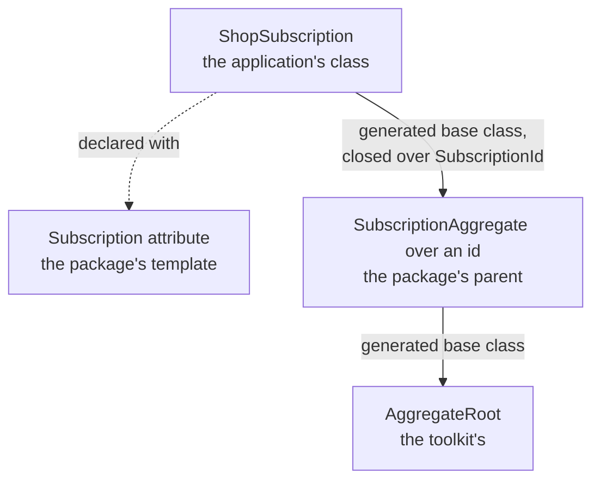

# Writing your own supporting domain

Your core domain is what the application is for, and the [building blocks](entities-and-aggregates.md)
are how you write it. Around it sit domains that many applications need and none is set apart by:
subscriptions, tenants, audit. A **supporting domain** is one of those written once, as a package, and
used by many applications. The toolkit ships its own under `DDDToolkit.Supporting.*`, starting with
[Tenancy](tenancy.md), and you can write one the same way.

A supporting domain is not a building block. It is written with the building blocks, the way your own
modules are, and once an application references it, it is a module of that application. What makes it a
package rather than a copy is how the application extends it:

- **The ids are the application's.** It declares them with `[EntityId<T>]`, in its contracts project,
  over whatever value it uses. The package never forces a `Guid` on anyone.
- **The classes are the application's.** It declares each of the package's aggregates and entities as a
  class of its own, and adds properties, behaviour, rules and entities to it.
- **The rules are the package's.** Every rule the package states runs for the application's class, before
  the class's own. The application adds rules; it cannot leave one out by accident.
- **The database is the application's.** The package brings no migrations and no `DbContext`. The
  application's context and migrations stay where its module keeps them.

The example on this page is a package for subscriptions and their invoices, `Acme.Subscriptions`, and a
shop that uses it.

## A parent and its template

The package declares each aggregate as an abstract generic **parent**, marked `[AggregateRootBase]`, with
the id as its first type parameter. It is written like any other aggregate: rules nested in it, a
`CheckInvariants()` seam, read-only collections.

```csharp
[AggregateRootBase]
public abstract partial class SubscriptionAggregate<TSubscriptionId>
    where TSubscriptionId : IEntityId, IEquatable<TSubscriptionId>
{
    protected SubscriptionAggregate(TSubscriptionId id, string plan) : base(id) => Plan = plan;

    public string Plan { get; private set; } = "";

    public sealed class PlanIsRequired : IInvariant<SubscriptionAggregate<TSubscriptionId>>
    {
        public string Code => "subscription.plan";

        public InvariantFailure? Check(SubscriptionAggregate<TSubscriptionId> entity)
            => entity.Plan.Length > 0 ? null : "A subscription is on a plan.";
    }
}
```

Next to it goes the attribute the application declares its class with, the **template**. It names the
parent, and its type arguments fill the parent's first type parameters, the id first:

```csharp
[AggregateRootTemplate(typeof(SubscriptionAggregate<>))]
[AttributeUsage(AttributeTargets.Class, Inherited = false)]
public sealed class SubscriptionAttribute<TSubscriptionId> : Attribute;
```

A child entity works the same way, with `[EntityBase]` on the parent and `[EntityTemplate]` on the
attribute.

## What the application writes

The application declares its ids and its own class with the template, and adds what only it knows:

```csharp
[EntityId<Guid>]
public readonly partial record struct SubscriptionId;      // in its contracts project

[Subscription<SubscriptionId>]
public sealed partial class ShopSubscription
{
    public ShopSubscription(SubscriptionId id, string plan, bool isTrial) : base(id, plan) => IsTrial = isTrial;

    public bool IsTrial { get; private set; }

    public sealed class TrialsAreOnTheFreePlan : IInvariant<ShopSubscription> { ... }
}
```

The generator derives the class from the parent, closed over the application's id, and the parent from
the toolkit's `AggregateRoot<TId>`. Nobody writes a base class by hand.



<details>
<summary>Show the code: what the generator writes</summary>

```csharp title="SubscriptionAggregate.g.cs and ShopSubscription.g.cs, shortened"
partial class SubscriptionAggregate<TSubscriptionId> : global::DDDToolkit.BaseTypes.AggregateRoot<TSubscriptionId>
{
    protected void CollectBaseInvariantViolations(
        ref global::System.Collections.Generic.List<global::DDDToolkit.Invariants.InvariantViolation>? violations,
        ref global::DDDToolkit.Exceptions.InvariantViolationException? seamFailure,
        global::System.Type entityType)
    {
        foreach (var invariant in __invariants)
        {
            // ...
        }

        // ...then its CheckInvariants() seam
    }
}

partial class ShopSubscription : global::Acme.Subscriptions.SubscriptionAggregate<global::Shop.Contracts.SubscriptionId>
{
    private void CollectInvariantViolations(
        ref global::System.Collections.Generic.List<global::DDDToolkit.Invariants.InvariantViolation>? violations,
        out global::DDDToolkit.Exceptions.InvariantViolationException? seamFailure)
    {
        seamFailure = null;
        CollectBaseInvariantViolations(ref violations, ref seamFailure, typeof(global::Shop.Billing.ShopSubscription));

        foreach (var invariant in __invariants)
        {
            // ...
        }

        // ...then its own CheckInvariants() seam
    }
}
```

</details>

## The parent's rules always run

A rule the parent states runs for every class derived from it, and so does the parent's
`CheckInvariants()` seam. The parent's run first and the class's after, and both come back in one list
from `GetInvariantViolations()`, or as one exception from `EnsureInvariants()` and the save. Every
violation names the application's class, `ShopSubscription`, not the package's parent, because that is
the object that is wrong. The parent's child entities are walked the same way, so a rule of the package's
line runs inside the application's invoice.

The parent gets the four public invariant methods too, running its own rules alone. A class declared with
the template replaces them with its own; they are there for a class that derives from the parent by hand,
which would otherwise check nothing the package states.

A rule of the application's may be about its class, about the parent, or about an interface the parent
implements. All of them are nested in the application's class:

```csharp
[Subscription<SubscriptionId>]
public sealed partial class ShopSubscription
{
    public sealed class TrialsAreOnTheFreePlan : IInvariant<ShopSubscription> { ... }

    public sealed class PlanIsKnown : IInvariant<SubscriptionAggregate<SubscriptionId>> { ... }
}
```

## Parents that need more than an id

An invoice needs more than its own id: the id of the subscription it bills, and the class of its lines,
which is the application's own. A **`[TemplateArgument]`** fills such a type parameter from the one class
declared with the template it names. By default it takes that class's id, and with
`Take = TemplateArgumentKind.Type` the class itself:

```csharp
[AggregateRootTemplate(typeof(InvoiceAggregate<,,,>))]
[TemplateArgument(1, typeof(SubscriptionAttribute<>))]
[TemplateArgument(2, typeof(InvoiceLineAttribute<>), Take = TemplateArgumentKind.Type)]
[TemplateArgument(3, typeof(InvoiceLineAttribute<>))]
[AttributeUsage(AttributeTargets.Class, Inherited = false)]
public sealed class InvoiceAttribute<TInvoiceId> : Attribute;
```

The application declares each class once, and the rest follows:

```csharp
[InvoiceLine<InvoiceLineId>]
public sealed partial class ShopInvoiceLine : IInvoiceLineFactory<ShopInvoiceLine, InvoiceLineId> { ... }

[Invoice<InvoiceId>]
public sealed partial class ShopInvoice;
```

`ShopInvoice` derives from `InvoiceAggregate<InvoiceId, SubscriptionId, ShopInvoiceLine, InvoiceLineId>`,
with the subscription's id taken from `ShopSubscription`. The class a template takes from is looked for in
the application's project first and, when that declares none, in the projects it references, so a
billing module can take the subscription's id from the module that declares the subscription.

## Creating the application's entities

A parent that holds the application's child entities cannot call their constructor: it does not know
their class. A static abstract factory on an interface the child implements does it, and the parent
constrains its type parameter to that interface:

```csharp
public interface IInvoiceLineFactory<TSelf, TLineId>
    where TSelf : IInvoiceLineFactory<TSelf, TLineId>
{
    static abstract TSelf Create(TLineId id, decimal amount);
}

[AggregateRootBase]
public abstract partial class InvoiceAggregate<TInvoiceId, TSubscriptionId, TLine, TLineId>
    where TInvoiceId : IEntityId, IEquatable<TInvoiceId>
    where TSubscriptionId : IEntityId, IEquatable<TSubscriptionId>
    where TLine : InvoiceLineEntity<TLineId>, IInvoiceLineFactory<TLine, TLineId>
    where TLineId : IEntityId, IEquatable<TLineId>
{
    public partial IReadOnlyList<TLine> Lines { get; }

    public TLine Charge(TLineId id, decimal amount)
    {
        var line = TLine.Create(id, amount);
        _lines.Add(line);
        return line;
    }
}
```

An application class that does not implement the factory is reported,
[DDD00048](diagnostics.md#ddd00048), on the class that takes it, rather than as a compile error in the
generated code.

## Stored with Entity Framework

Nothing changes. Entity Framework maps the application's classes, with the parent's properties and
collections as their own, and a child entity declared with an `[EntityTemplate]` is an owned type like any
other child entity. The parent is never mapped: it is an open generic, and Entity Framework only ever sees
the classes closed over the application's ids. `[KeyPart]` properties on a parent join the key in front of
the class's own.

A [row access rule](row-level-security.md#row-access-rules-written-in-c) is written for the application's
class, and reads the parent's properties and collections like the class's own. A rule about the parent
itself is refused, [DDD00040](diagnostics.md#ddd00040): the parent has no table.

## Requirements

- The parent is a partial class, like every entity ([DDD00005](diagnostics.md#ddd00005),
  [DDD00002](diagnostics.md#ddd00002)), and abstract, with the id as its first type parameter constrained
  `where TId : IEntityId, IEquatable<TId>`, not nested in a generic type
  ([DDD00042](diagnostics.md#ddd00042)).
- The template's first type argument, chosen by the application, is an entity id
  ([DDD00043](diagnostics.md#ddd00043)).
- A template fills every type parameter of its parent exactly once, with its own type arguments and its
  `[TemplateArgument]`s ([DDD00046](diagnostics.md#ddd00046)). That one is the package's mistake, reported
  where the application meets it.
- A `[TemplateArgument]` finds exactly one class ([DDD00044](diagnostics.md#ddd00044),
  [DDD00045](diagnostics.md#ddd00045)), and a class it takes meets the parent's constraints
  ([DDD00048](diagnostics.md#ddd00048)).
- A class is declared one way only: a template, or `[AggregateRoot<T>]`, or `[Entity<T>]`, never two
  ([DDD00047](diagnostics.md#ddd00047)).
- One level of parent: a parent does not derive from another parent.
